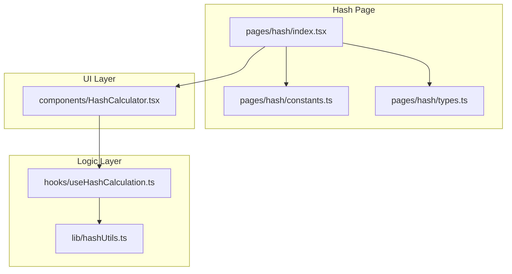
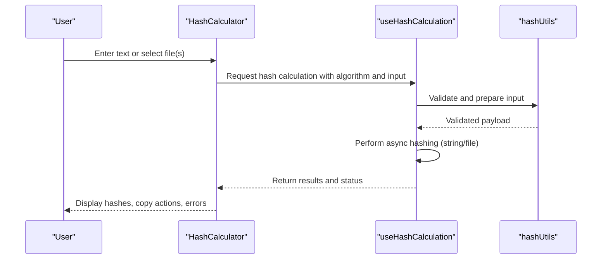
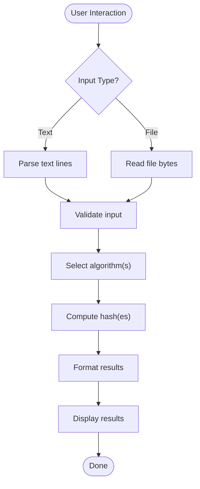
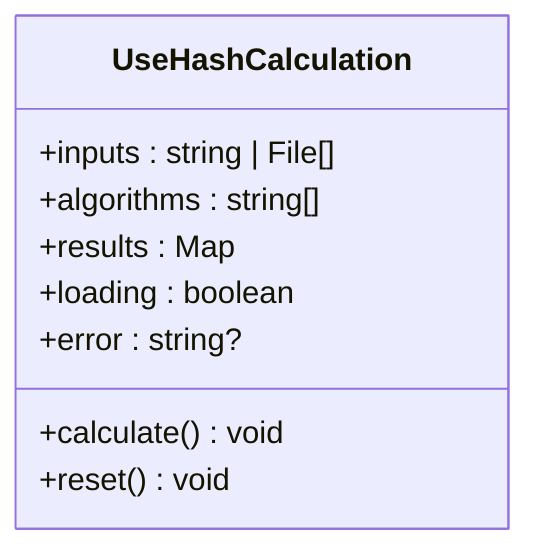
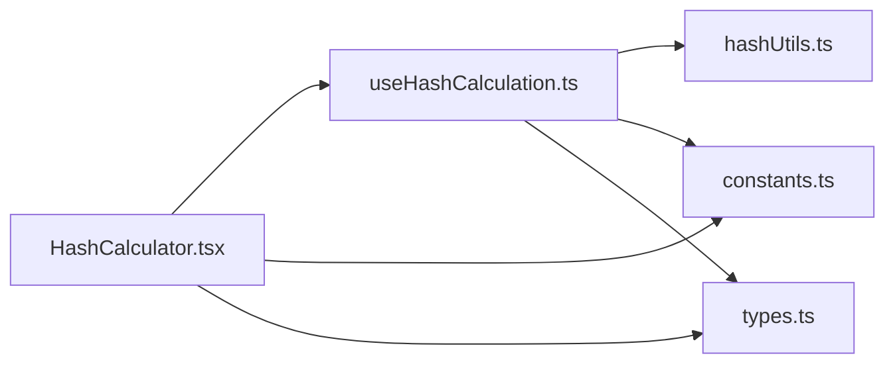

# Hash - Cryptographic Hash Functions

<cite>
**Referenced Files in This Document**
- [hash/index.tsx](file://src/pages/hash/index.tsx)
- [hash/constants.ts](file://src/pages/hash/constants.ts)
- [hash/types.ts](file://src/pages/hash/types.ts)
- [hash/components/HashCalculator.tsx](file://src/pages/hash/components/HashCalculator.tsx)
- [hash/hooks/useHashCalculation.ts](file://src/pages/hash/hooks/useHashCalculation.ts)
- [hash/lib/hashUtils.ts](file://src/pages/hash/lib/hashUtils.ts)
</cite>

## Table of Contents
1. [Introduction](#introduction)
2. [Project Structure](#project-structure)
3. [Core Components](#core-components)
4. [Architecture Overview](#architecture-overview)
5. [Detailed Component Analysis](#detailed-component-analysis)
6. [Dependency Analysis](#dependency-analysis)
7. [Performance Considerations](#performance-considerations)
8. [Troubleshooting Guide](#troubleshooting-guide)
9. [Conclusion](#conclusion)

## Introduction
Apprecon’s Hash tool provides a fast, user-friendly interface for computing cryptographic hashes and comparing hash values. It supports common algorithms such as MD5, SHA-1, SHA-256, and SHA-512, and enables both string and file hashing. The tool is designed to integrate into security testing workflows by offering batch processing, multiple output formats, and utilities that help identify password hashes, verify file integrity, and deduplicate data based on content fingerprints.

This documentation explains how the feature works at a high level, outlines supported algorithms and input types, describes batch and comparison capabilities, and provides guidance for performance optimization and security considerations when working with cryptographic functions.

## Project Structure
The Hash feature is implemented as a dedicated page within Apprecon’s frontend application. It includes:
- A main page component that renders the UI and orchestrates state
- Constants defining supported algorithms and default options
- TypeScript types describing inputs, outputs, and configuration
- A reusable calculator component for interactive hashing
- A hook encapsulating the hashing logic and async operations
- Utility functions for formatting and validation

**Diagram sources**
- [hash/index.tsx](file://src/pages/hash/index.tsx)
- [hash/constants.ts](file://src/pages/hash/constants.ts)
- [hash/types.ts](file://src/pages/hash/types.ts)
- [hash/components/HashCalculator.tsx](file://src/pages/hash/components/HashCalculator.tsx)
- [hash/hooks/useHashCalculation.ts](file://src/pages/hash/hooks/useHashCalculation.ts)
- [hash/lib/hashUtils.ts](file://src/pages/hash/lib/hashUtils.ts)

**Section sources**
- [hash/index.tsx](file://src/pages/hash/index.tsx)
- [hash/constants.ts](file://src/pages/hash/constants.ts)
- [hash/types.ts](file://src/pages/hash/types.ts)
- [hash/components/HashCalculator.tsx](file://src/pages/hash/components/HashCalculator.tsx)
- [hash/hooks/useHashCalculation.ts](file://src/pages/hash/hooks/useHashCalculation.ts)
- [hash/lib/hashUtils.ts](file://src/pages/hash/lib/hashUtils.ts)

## Core Components
- Hash Calculator (UI): Presents input fields for text or file selection, algorithm choices, and displays results. It also supports pasting multiple lines for batch processing and shows computed hashes alongside metadata like size and algorithm used.
- Hash Calculation Hook: Encapsulates asynchronous hashing operations for strings and files, manages loading states, and returns results in a consistent format.
- Utilities: Provide helper functions for validating inputs, formatting hash outputs, and handling large file reads efficiently.
- Constants and Types: Define available algorithms, default selections, and the shape of data passed between components and hooks.

Key responsibilities:
- Accept string or file inputs
- Compute hashes using selected algorithms
- Present results clearly and allow copying
- Support batch operations for multiple inputs
- Expose error messages and status feedback

**Section sources**
- [hash/components/HashCalculator.tsx](file://src/pages/hash/components/HashCalculator.tsx)
- [hash/hooks/useHashCalculation.ts](file://src/pages/hash/hooks/useHashCalculation.ts)
- [hash/lib/hashUtils.ts](file://src/pages/hash/lib/hashUtils.ts)
- [hash/constants.ts](file://src/pages/hash/constants.ts)
- [hash/types.ts](file://src/pages/hash/types.ts)

## Architecture Overview
The Hash feature follows a layered architecture:
- Presentation layer (React components) handles user interactions and rendering
- Business logic layer (hook) coordinates hashing operations and state management
- Utility layer provides pure functions for formatting and validation
- Data contracts (types) ensure consistency across layers

**Diagram sources**
- [hash/components/HashCalculator.tsx](file://src/pages/hash/components/HashCalculator.tsx)
- [hash/hooks/useHashCalculation.ts](file://src/pages/hash/hooks/useHashCalculation.ts)
- [hash/lib/hashUtils.ts](file://src/pages/hash/lib/hashUtils.ts)

## Detailed Component Analysis

### HashCalculator Component
Responsibilities:
- Render input controls for text and file selection
- Allow selecting one or more algorithms
- Trigger calculations via the hook
- Display results in a readable format
- Provide copy-to-clipboard functionality
- Handle batch inputs (multiple lines or files)

Behavior highlights:
- Debounces rapid typing to avoid excessive recomputation
- Shows progress indicators during file hashing
- Validates inputs before computation
- Aggregates results for batch operations

**Diagram sources**
- [hash/components/HashCalculator.tsx](file://src/pages/hash/components/HashCalculator.tsx)
- [hash/lib/hashUtils.ts](file://src/pages/hash/lib/hashUtils.ts)

**Section sources**
- [hash/components/HashCalculator.tsx](file://src/pages/hash/components/HashCalculator.tsx)

### useHashCalculation Hook
Responsibilities:
- Manage state for inputs, selected algorithms, and results
- Execute hashing operations asynchronously
- Handle errors and edge cases (empty input, unsupported algorithms)
- Normalize outputs across different algorithms

Processing flow:
- Normalize input (trim whitespace, split lines for batch)
- Read file contents in chunks for memory efficiency
- Compute hashes per algorithm
- Aggregate results and return them to the UI

**Diagram sources**
- [hash/hooks/useHashCalculation.ts](file://src/pages/hash/hooks/useHashCalculation.ts)

**Section sources**
- [hash/hooks/useHashCalculation.ts](file://src/pages/hash/hooks/useHashCalculation.ts)

### hashUtils Utilities
Responsibilities:
- Validate input types and sizes
- Format hash outputs consistently (hex, base64 if needed)
- Provide helpers for chunked file reading
- Ensure deterministic behavior across platforms

Common patterns:
- Pure functions with no side effects
- Defensive checks for null/undefined inputs
- Consistent error messaging

**Section sources**
- [hash/lib/hashUtils.ts](file://src/pages/hash/lib/hashUtils.ts)

### Constants and Types
Responsibilities:
- Define supported algorithms (e.g., MD5, SHA-1, SHA-256, SHA-512)
- Specify default algorithm and output format
- Describe shapes for inputs, outputs, and configuration objects

Usage:
- Centralized configuration ensures consistency across UI and logic
- Types enforce correctness in TypeScript code

**Section sources**
- [hash/constants.ts](file://src/pages/hash/constants.ts)
- [hash/types.ts](file://src/pages/hash/types.ts)

## Dependency Analysis
The Hash feature has clear separation of concerns:
- UI depends on the hook for business logic
- Hook depends on utilities for pure operations
- Constants and types are consumed by both UI and hook

**Diagram sources**
- [hash/components/HashCalculator.tsx](file://src/pages/hash/components/HashCalculator.tsx)
- [hash/hooks/useHashCalculation.ts](file://src/pages/hash/hooks/useHashCalculation.ts)
- [hash/lib/hashUtils.ts](file://src/pages/hash/lib/hashUtils.ts)
- [hash/constants.ts](file://src/pages/hash/constants.ts)
- [hash/types.ts](file://src/pages/hash/types.ts)

**Section sources**
- [hash/components/HashCalculator.tsx](file://src/pages/hash/components/HashCalculator.tsx)
- [hash/hooks/useHashCalculation.ts](file://src/pages/hash/hooks/useHashCalculation.ts)
- [hash/lib/hashUtils.ts](file://src/pages/hash/lib/hashUtils.ts)
- [hash/constants.ts](file://src/pages/hash/constants.ts)
- [hash/types.ts](file://src/pages/hash/types.ts)

## Performance Considerations
- Large file hashing: Use chunked reading to avoid memory spikes; process files in streams where possible.
- Algorithm selection: Prefer SHA-256 or SHA-512 for modern security needs; MD5 and SHA-1 are faster but less secure.
- Batch processing: Limit concurrent computations to prevent UI freezing; queue operations if necessary.
- Output formatting: Avoid unnecessary conversions; keep outputs in hex unless another format is required.
- Caching: Cache results for identical inputs within a session to reduce redundant work.

[No sources needed since this section provides general guidance]

## Troubleshooting Guide
Common issues and resolutions:
- Empty input: Ensure text is not blank and files are valid; show clear error messages.
- Unsupported algorithm: Validate against constants; provide fallback or alert users.
- Memory errors on large files: Implement chunked reading and monitor memory usage.
- Inconsistent outputs: Normalize encoding and casing; confirm platform-specific behaviors.
- Copy failures: Check clipboard permissions and provide manual alternatives.

**Section sources**
- [hash/lib/hashUtils.ts](file://src/pages/hash/lib/hashUtils.ts)
- [hash/hooks/useHashCalculation.ts](file://src/pages/hash/hooks/useHashCalculation.ts)

## Conclusion
Apprecon’s Hash tool offers a robust, extensible foundation for cryptographic hashing tasks. With support for multiple algorithms, flexible input types, and batch processing, it integrates well into security testing workflows. By following the performance and security recommendations outlined here, users can efficiently compute hashes, compare values, and apply hash-based techniques such as integrity verification and deduplication while maintaining safety and speed.

[No sources needed since this section summarizes without analyzing specific files]