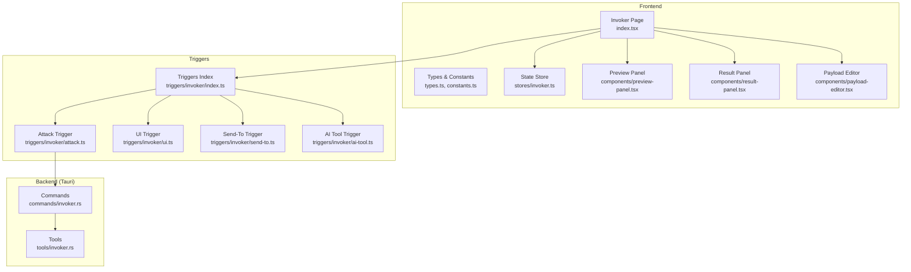
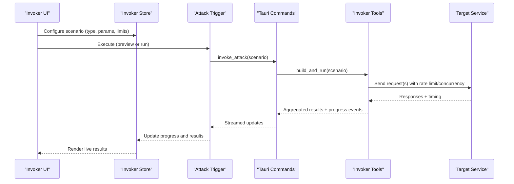
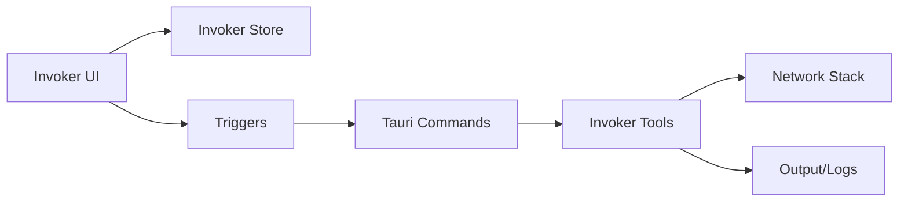

# Attack Scenarios & Execution

<cite>
**Referenced Files in This Document**
- [src/pages/invoker/index.tsx](file://src/pages/invoker/index.tsx)
- [src/pages/invoker/types.ts](file://src/pages/invoker/types.ts)
- [src/pages/invoker/constants.ts](file://src/pages/invoker/constants.ts)
- [src/stores/invoker.ts](file://src/stores/invoker.ts)
- [src/triggers/invoker/index.ts](file://src/triggers/invoker/index.ts)
- [src/triggers/invoker/attack.ts](file://src/triggers/invoker/attack.ts)
- [src/triggers/invoker/ui.ts](file://src/triggers/invoker/ui.ts)
- [src/triggers/invoker/send-to.ts](file://src/triggers/invoker/send-to.ts)
- [src/triggers/invoker/ai-tool.ts](file://src/triggers/invoker/ai-tool.ts)
- [src-tauri/src/commands/invoker.rs](file://src-tauri/src/commands/invoker.rs)
- [src-tauri/src/tools/invoker.rs](file://src-tauri/src/tools/invoker.rs)
- [src/components/invoker/components/payload-editor.tsx](file://src/components/invoker/components/payload-editor.tsx)
- [src/components/invoker/components/result-panel.tsx](file://src/components/invoker/components/result-panel.tsx)
- [src/components/invoker/components/preview-panel.tsx](file://src/components/invoker/components/preview-panel.tsx)
</cite>

## Table of Contents
1. [Introduction](#introduction)
2. [Project Structure](#project-structure)
3. [Core Components](#core-components)
4. [Architecture Overview](#architecture-overview)
5. [Detailed Component Analysis](#detailed-component-analysis)
6. [Dependency Analysis](#dependency-analysis)
7. [Performance Considerations](#performance-considerations)
8. [Troubleshooting Guide](#troubleshooting-guide)
9. [Conclusion](#conclusion)
10. [Appendices](#appendices)

## Introduction
This document explains how to configure and execute attack scenarios using the Invoker tool. It covers setting up brute force, fuzzing, time-based attacks, and blind injection tests; configuring rate limits, parallelism, and resource management; previewing payloads; analyzing responses; interpreting results; building complex chains with conditional branching; handling errors; optimizing performance for large campaigns; and monitoring execution progress in real-time.

## Project Structure
The Invoker feature spans both the frontend (React UI and state stores) and the backend (Tauri commands and tools). The key areas are:
- Frontend page and types for scenario configuration and UI state
- Triggers that wire UI actions to backend execution
- Tauri commands and tools that orchestrate request crafting, execution, and result collection
- UI components for payload editing, preview, and results display

**Diagram sources**
- [src/pages/invoker/index.tsx](file://src/pages/invoker/index.tsx)
- [src/pages/invoker/types.ts](file://src/pages/invoker/types.ts)
- [src/pages/invoker/constants.ts](file://src/pages/invoker/constants.ts)
- [src/stores/invoker.ts](file://src/stores/invoker.ts)
- [src/triggers/invoker/index.ts](file://src/triggers/invoker/index.ts)
- [src/triggers/invoker/attack.ts](file://src/triggers/invoker/attack.ts)
- [src/triggers/invoker/ui.ts](file://src/triggers/invoker/ui.ts)
- [src/triggers/invoker/send-to.ts](file://src/triggers/invoker/send-to.ts)
- [src/triggers/invoker/ai-tool.ts](file://src/triggers/invoker/ai-tool.ts)
- [src-tauri/src/commands/invoker.rs](file://src-tauri/src/commands/invoker.rs)
- [src-tauri/src/tools/invoker.rs](file://src-tauri/src/tools/invoker.rs)

**Section sources**
- [src/pages/invoker/index.tsx](file://src/pages/invoker/index.tsx)
- [src/pages/invoker/types.ts](file://src/pages/invoker/types.ts)
- [src/pages/invoker/constants.ts](file://src/pages/invoker/constants.ts)
- [src/stores/invoker.ts](file://src/stores/invoker.ts)
- [src/triggers/invoker/index.ts](file://src/triggers/invoker/index.ts)
- [src-tauri/src/commands/invoker.rs](file://src-tauri/src/commands/invoker.rs)
- [src-tauri/src/tools/invoker.rs](file://src-tauri/src/tools/invoker.rs)

## Core Components
- Scenario model and options: Defines attack type, target, headers, body, parameters, rate limiting, concurrency, timeouts, retries, and output format.
- Preview panel: Renders a dry-run or sample execution to validate payloads before committing to full runs.
- Result panel: Displays per-request outcomes, response metadata, timing, and flags for anomalies.
- Store: Manages active scenarios, queued jobs, progress, and aggregated metrics.
- Triggers: Bridge UI actions to backend execution pipelines.
- Backend commands and tools: Orchestrate request generation, execution, throttling, and result aggregation.

Key responsibilities:
- Configuration validation and defaults
- Rate limiting and concurrency control
- Real-time progress streaming
- Error categorization and retry policies
- Response analysis helpers (status codes, timing, content patterns)

**Section sources**
- [src/pages/invoker/types.ts](file://src/pages/invoker/types.ts)
- [src/pages/invoker/constants.ts](file://src/pages/invoker/constants.ts)
- [src/stores/invoker.ts](file://src/stores/invoker.ts)
- [src/triggers/invoker/attack.ts](file://src/triggers/invoker/attack.ts)
- [src-tauri/src/commands/invoker.rs](file://src-tauri/src/commands/invoker.rs)
- [src-tauri/src/tools/invoker.rs](file://src-tauri/src/tools/invoker.rs)

## Architecture Overview
The Invoker follows a layered architecture:
- UI layer: Scenario editor, preview, and results
- Trigger layer: Event-driven wiring between UI and backend
- Command layer: Tauri command handlers that receive requests and dispatch tasks
- Tool layer: Execution engine that crafts HTTP requests, applies rate limits, manages concurrency, and collects results

**Diagram sources**
- [src/triggers/invoker/attack.ts](file://src/triggers/invoker/attack.ts)
- [src-tauri/src/commands/invoker.rs](file://src-tauri/src/commands/invoker.rs)
- [src-tauri/src/tools/invoker.rs](file://src-tauri/src/tools/invoker.rs)

## Detailed Component Analysis

### Scenario Configuration Model
- Attack types: Brute force, fuzzing, time-based, blind injection
- Parameters: URL, method, headers, cookies, body, query/path params
- Execution options: Rate limit (requests/sec), concurrency (parallel workers), timeout per request, retries, backoff strategy
- Output: Include raw response, status codes, timing, matched patterns, error categories

Complexity considerations:
- Payload expansion is O(N) over payload set size
- Concurrency scaling affects memory and network saturation
- Time-based attacks require careful jitter and baseline measurement

**Section sources**
- [src/pages/invoker/types.ts](file://src/pages/invoker/types.ts)
- [src/pages/invoker/constants.ts](file://src/pages/invoker/constants.ts)

### Preview Panel
Purpose:
- Validate syntax and parameter interpolation
- Dry-run against a small subset or single request
- Show expected request shape and potential issues before execution

Workflow:
- User edits payload and selects preview mode
- System constructs a minimal request set
- Results are displayed without impacting target stability

Best practices:
- Use small payload sets for preview
- Enable verbose logging only during preview
- Inspect headers and encoding carefully

**Section sources**
- [src/components/invoker/components/preview-panel.tsx](file://src/components/invoker/components/preview-panel.tsx)
- [src/triggers/invoker/ui.ts](file://src/triggers/invoker/ui.ts)

### Result Panel and Response Analysis
Capabilities:
- Per-request status, timing, and body summary
- Pattern matching highlights for indicators of vulnerability
- Grouping by status code, error category, or timing anomaly
- Exportable logs for post-processing

Interpretation tips:
- Time-based signals: Compare latency distributions across baseline vs. injected payloads
- Blind injection: Look for side-channel effects like redirects, status changes, or downstream triggers
- Fuzzing: Focus on unique responses and server errors as potential leads

**Section sources**
- [src/components/invoker/components/result-panel.tsx](file://src/components/invoker/components/result-panel.tsx)
- [src/stores/invoker.ts](file://src/stores/invoker.ts)

### Attack Execution Pipeline
Execution modes:
- Single request (for testing)
- Sequential iteration over payload sets
- Parallel execution with controlled concurrency
- Conditional branching based on previous responses

Rate limiting and resource management:
- Global rate limiter enforces max requests per second
- Worker pool controls concurrent executions
- Backpressure via queue when targets are slow
- Timeout and retry policies prevent hanging and reduce noise

Error handling strategies:
- Network errors: Retry with exponential backoff
- Server errors: Categorize and flag for review
- Validation errors: Fail fast with actionable messages
- Partial failures: Continue remaining jobs and aggregate results

**Section sources**
- [src/triggers/invoker/attack.ts](file://src/triggers/invoker/attack.ts)
- [src-tauri/src/commands/invoker.rs](file://src-tauri/src/commands/invoker.rs)
- [src-tauri/src/tools/invoker.rs](file://src-tauri/src/tools/invoker.rs)

### Complex Attack Chains and Conditional Branching
Patterns:
- Chain multiple steps where later steps depend on earlier outcomes
- Branch based on status codes, response bodies, or timing thresholds
- Accumulate context across steps (e.g., tokens, session IDs)
- Abort early on critical failures or non-recoverable states

Implementation approach:
- Define step graph with conditions and transitions
- Evaluate conditions against prior results
- Maintain stateful context for subsequent steps
- Provide rollback or cleanup hooks for destructive operations

**Section sources**
- [src/pages/invoker/types.ts](file://src/pages/invoker/types.ts)
- [src/tariggers/invoker/attack.ts](file://src/triggers/invoker/attack.ts)

### Payload Editing and Interpolation
Features:
- Syntax highlighting and validation
- Variable substitution from environment and scope
- Inline helpers for encoding, hashing, and formatting
- Template support for dynamic payloads

Tips:
- Keep templates modular and reusable
- Validate encodings for different contexts (URL, JSON, XML)
- Use deterministic seeds for reproducible fuzzing

**Section sources**
- [src/components/invoker/components/payload-editor.tsx](file://src/components/invoker/components/payload-editor.tsx)

### Sending to Other Tools
Integration points:
- Send crafted requests to Repeater for manual follow-up
- Forward payloads to SQL Injection or XSS Generator modules
- Export collections for regression testing

**Section sources**
- [src/triggers/invoker/send-to.ts](file://src/triggers/invoker/send-to.ts)

### AI-Assisted Scenario Generation
Use cases:
- Generate initial payloads from natural language descriptions
- Suggest variations and encodings
- Propose conditional logic based on observed behavior

**Section sources**
- [src/triggers/invoker/ai-tool.ts](file://src/triggers/invoker/ai-tool.ts)

## Dependency Analysis
The Invoker’s dependencies form a clear separation of concerns:
- UI depends on store and trigger APIs
- Triggers depend on Tauri commands
- Commands delegate to tools for execution
- Tools interact with network stack and optional external services

**Diagram sources**
- [src/pages/invoker/index.tsx](file://src/pages/invoker/index.tsx)
- [src/stores/invoker.ts](file://src/stores/invoker.ts)
- [src/triggers/invoker/index.ts](file://src/triggers/invoker/index.ts)
- [src-tauri/src/commands/invoker.rs](file://src-tauri/src/commands/invoker.rs)
- [src-tauri/src/tools/invoker.rs](file://src-tauri/src/tools/invoker.rs)

**Section sources**
- [src/pages/invoker/index.tsx](file://src/pages/invoker/index.tsx)
- [src/stores/invoker.ts](file://src/stores/invoker.ts)
- [src/triggers/invoker/index.ts](file://src/triggers/invoker/index.ts)
- [src-tauri/src/commands/invoker.rs](file://src-tauri/src/commands/invoker.rs)
- [src-tauri/src/tools/invoker.rs](file://src-tauri/src/tools/invoker.rs)

## Performance Considerations
Optimization strategies:
- Tune concurrency to match target capacity and available resources
- Apply adaptive rate limiting to avoid overwhelming servers
- Use connection pooling and keep-alive where supported
- Batch small payloads to reduce overhead
- Cache static parts of requests (headers, auth tokens)
- Stream results incrementally to reduce memory pressure
- Profile CPU and I/O hotspots during large campaigns

Monitoring:
- Track throughput (requests/sec), latency percentiles, and error rates
- Observe worker utilization and queue lengths
- Alert on abnormal spikes in timeouts or server errors

**Section sources**
- [src/stores/invoker.ts](file://src/stores/invoker.ts)
- [src-tauri/src/tools/invoker.rs](file://src-tauri/src/tools/invoker.rs)

## Troubleshooting Guide
Common issues and resolutions:
- Timeouts: Increase per-request timeout or reduce concurrency; check network connectivity
- Rate limit errors: Lower global rate limit or implement backoff
- Memory spikes: Reduce payload set size, enable streaming, and monitor heap usage
- Inconsistent results: Ensure deterministic payload generation and stable baselines
- Conditional branches not triggering: Validate condition expressions and inspect intermediate results

Debugging aids:
- Enable verbose logs in preview mode
- Export raw responses for offline analysis
- Use targeted filters in result panel to isolate anomalies

**Section sources**
- [src/components/invoker/components/result-panel.tsx](file://src/components/invoker/components/result-panel.tsx)
- [src/stores/invoker.ts](file://src/stores/invoker.ts)

## Conclusion
The Invoker provides a robust framework for designing, previewing, and executing diverse attack scenarios with fine-grained control over rate limiting, concurrency, and error handling. By leveraging preview panels, structured result analysis, and advanced chaining capabilities, users can efficiently conduct large-scale testing campaigns while maintaining safety and performance.

## Appendices

### Example Scenarios Overview
- Brute force: Iterate over credential sets with controlled concurrency and adaptive delays
- Fuzzing: Inject varied payloads into parameters and analyze response uniqueness
- Time-based: Measure latency differences to infer server-side processing paths
- Blind injection: Trigger out-of-band effects and correlate with observability signals

[No sources needed since this section summarizes conceptual examples]