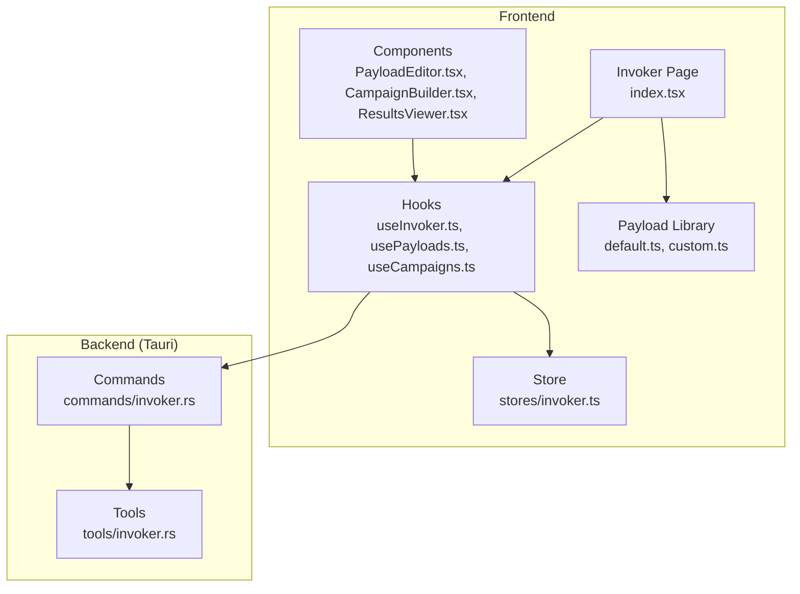
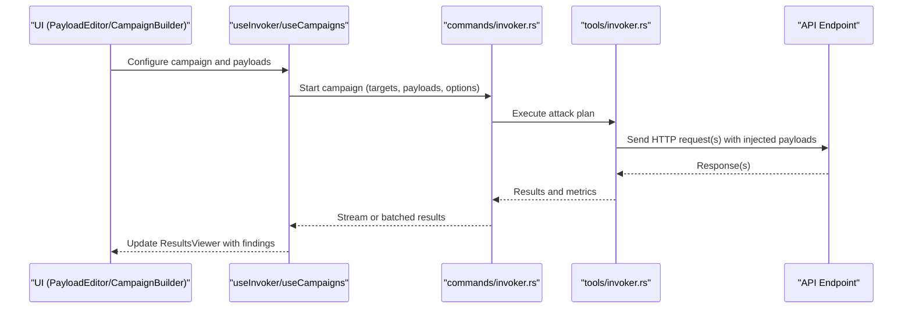
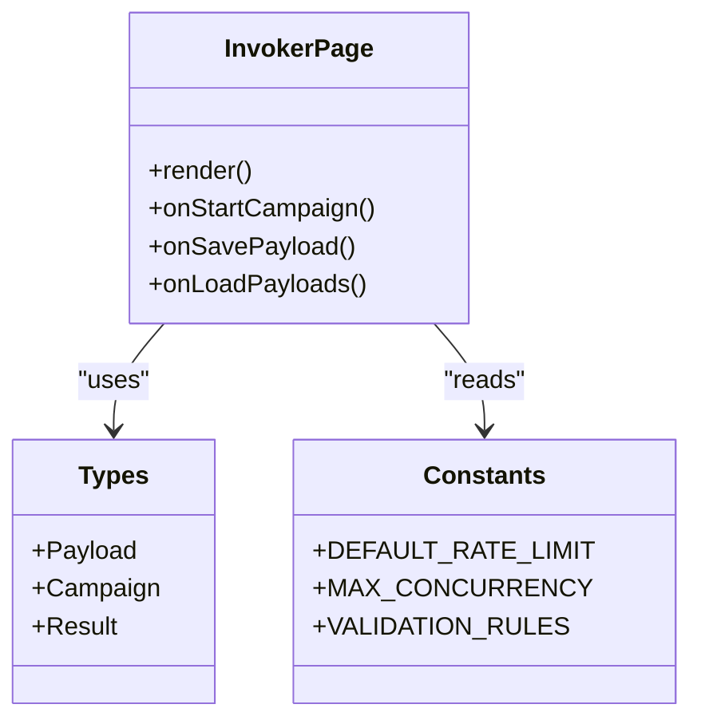
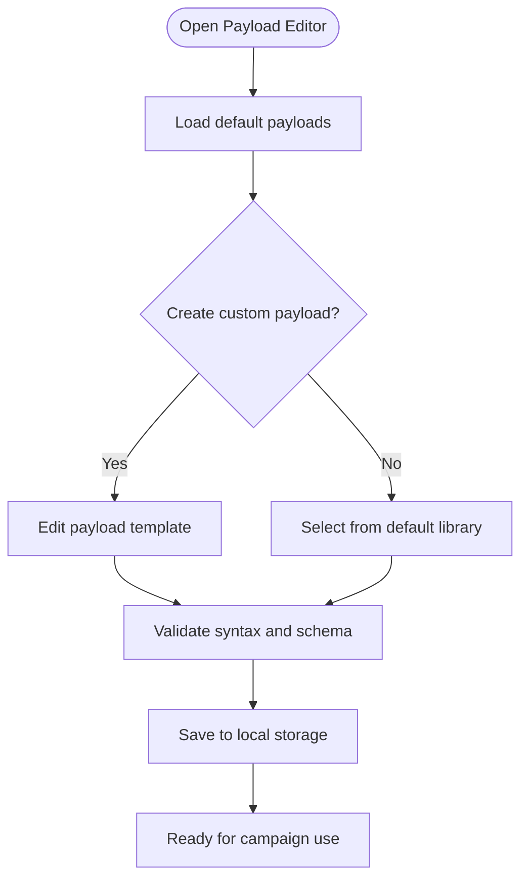
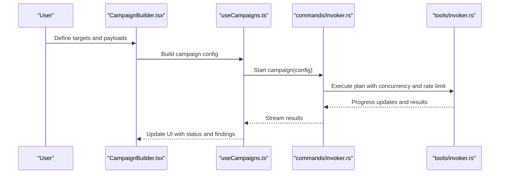
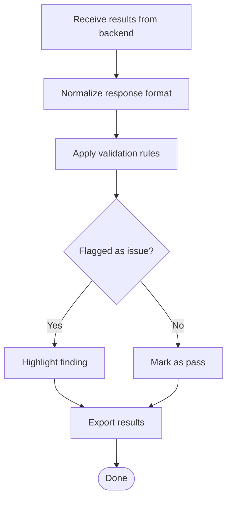
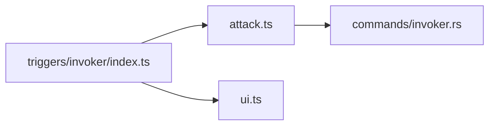
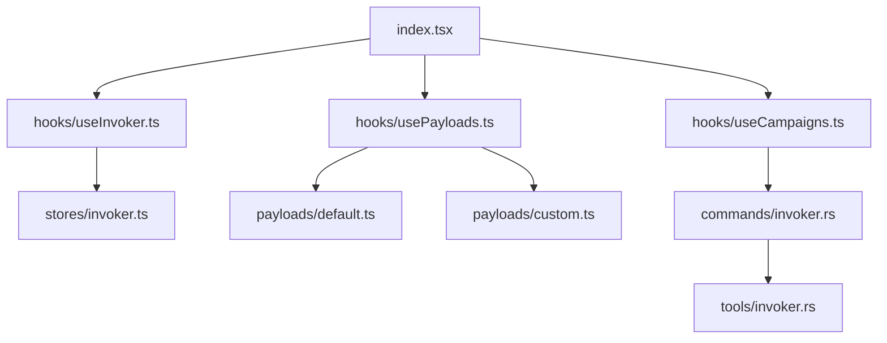

# Invoker - Automated API Testing

<cite>
**Referenced Files in This Document**
- [index.tsx](file://src/pages/invoker/index.tsx)
- [types.ts](file://src/pages/invoker/types.ts)
- [constants.ts](file://src/pages/invoker/constants.ts)
- [lib.ts](file://src/pages/invoker/lib.ts)
- [api.ts](file://src/pages/invoker/api.ts)
- [hooks/useInvoker.ts](file://src/pages/invoker/hooks/useInvoker.ts)
- [hooks/usePayloads.ts](file://src/pages/invoker/hooks/usePayloads.ts)
- [hooks/useCampaigns.ts](file://src/pages/invoker/hooks/useCampaigns.ts)
- [components/PayloadEditor.tsx](file://src/pages/invoker/components/PayloadEditor.tsx)
- [components/CampaignBuilder.tsx](file://src/pages/invoker/components/CampaignBuilder.tsx)
- [components/ResultsViewer.tsx](file://src/pages/invoker/components/ResultsViewer.tsx)
- [payloads/default.ts](file://src/pages/invoker/payloads/default.ts)
- [payloads/custom.ts](file://src/pages/invoker/payloads/custom.ts)
- [stores/invoker.ts](file://src/stores/invoker.ts)
- [triggers/invoker/index.ts](file://src/triggers/invoker/index.ts)
- [triggers/invoker/attack.ts](file://src/triggers/invoker/attack.ts)
- [commands/invoker.rs](file://src-tauri/src/commands/invoker.rs)
- [tools/invoker.rs](file://src-tauri/src/tools/invoker.rs)
</cite>

## Table of Contents
1. [Introduction](#introduction)
2. [Project Structure](#project-structure)
3. [Core Components](#core-components)
4. [Architecture Overview](#architecture-overview)
5. [Detailed Component Analysis](#detailed-component-analysis)
6. [Dependency Analysis](#dependency-analysis)
7. [Performance Considerations](#performance-considerations)
8. [Troubleshooting Guide](#troubleshooting-guide)
9. [Conclusion](#conclusion)
10. [Appendices](#appendices)

## Introduction
This document explains Apprecon’s Invoker tool for automated API testing and payload generation. It covers how to create and manage test payloads, configure attack scenarios, execute automated security tests against APIs, and analyze results. It also documents the predefined payload library, custom payload creation, fuzzing campaigns, rate limiting, parallel execution, custom validation rules, and CI/CD integration patterns.

## Project Structure
The Invoker feature spans both the frontend (React/TypeScript) and backend (Tauri/Rust). The frontend provides UI for payload editing, campaign configuration, and result visualization. The backend exposes commands and tools for executing attacks, managing payloads, and persisting state.

**Diagram sources**
- [index.tsx](file://src/pages/invoker/index.tsx)
- [stores/invoker.ts](file://src/stores/invoker.ts)
- [hooks/useInvoker.ts](file://src/pages/invoker/hooks/useInvoker.ts)
- [hooks/usePayloads.ts](file://src/pages/invoker/hooks/usePayloads.ts)
- [hooks/useCampaigns.ts](file://src/pages/invoker/hooks/useCampaigns.ts)
- [components/PayloadEditor.tsx](file://src/pages/invoker/components/PayloadEditor.tsx)
- [components/CampaignBuilder.tsx](file://src/pages/invoker/components/CampaignBuilder.tsx)
- [components/ResultsViewer.tsx](file://src/pages/invoker/components/ResultsViewer.tsx)
- [payloads/default.ts](file://src/pages/invoker/payloads/default.ts)
- [payloads/custom.ts](file://src/pages/invoker/payloads/custom.ts)
- [commands/invoker.rs](file://src-tauri/src/commands/invoker.rs)
- [tools/invoker.rs](file://src-tauri/src/tools/invoker.rs)

**Section sources**
- [index.tsx](file://src/pages/invoker/index.tsx)
- [types.ts](file://src/pages/invoker/types.ts)
- [constants.ts](file://src/pages/invoker/constants.ts)
- [stores/invoker.ts](file://src/stores/invoker.ts)
- [commands/invoker.rs](file://src-tauri/src/commands/invoker.rs)
- [tools/invoker.rs](file://src-tauri/src/tools/invoker.rs)

## Core Components
- Invoker Page: Entry point that orchestrates payload management, campaign building, and execution.
- Payload Editor: Creates and edits payloads with support for templates and variables.
- Campaign Builder: Configures attack scenarios, targets, and execution parameters.
- Results Viewer: Displays outcomes, diffs, and validation results.
- Hooks: Encapsulate logic for invoking attacks, managing payloads, and handling campaigns.
- Store: Centralized state for Invoker across the app.
- Backend Commands/Tools: Execute HTTP requests, apply payloads, enforce rate limits, and persist results.

Key responsibilities:
- Payload lifecycle: create, validate, store, and reuse.
- Campaign orchestration: define sequences, concurrency, and scheduling.
- Execution engine: send requests, collect responses, and run validations.
- Reporting: aggregate findings and export results.

**Section sources**
- [index.tsx](file://src/pages/invoker/index.tsx)
- [components/PayloadEditor.tsx](file://src/pages/invoker/components/PayloadEditor.tsx)
- [components/CampaignBuilder.tsx](file://src/pages/invoker/components/CampaignBuilder.tsx)
- [components/ResultsViewer.tsx](file://src/pages/invoker/components/ResultsViewer.tsx)
- [hooks/useInvoker.ts](file://src/pages/invoker/hooks/useInvoker.ts)
- [hooks/usePayloads.ts](file://src/pages/invoker/hooks/usePayloads.ts)
- [hooks/useCampaigns.ts](file://src/pages/invoker/hooks/useCampaigns.ts)
- [stores/invoker.ts](file://src/stores/invoker.ts)

## Architecture Overview
Invoker uses a layered architecture:
- UI Layer: React components and hooks for user interactions.
- State Layer: Stores maintain application state and persistence.
- Command Layer: Tauri commands expose backend capabilities to the frontend.
- Tool Layer: Rust tools implement request execution, payload injection, and validation.

**Diagram sources**
- [components/PayloadEditor.tsx](file://src/pages/invoker/components/PayloadEditor.tsx)
- [components/CampaignBuilder.tsx](file://src/pages/invoker/components/CampaignBuilder.tsx)
- [hooks/useInvoker.ts](file://src/pages/invoker/hooks/useInvoker.ts)
- [hooks/useCampaigns.ts](file://src/pages/invoker/hooks/useCampaigns.ts)
- [commands/invoker.rs](file://src-tauri/src/commands/invoker.rs)
- [tools/invoker.rs](file://src-tauri/src/tools/invoker.rs)

## Detailed Component Analysis

### Invoker Page and Types
- Provides the main interface for Invoker operations.
- Integrates payload editor, campaign builder, and results viewer.
- Uses types and constants to ensure consistent data structures and behavior.

**Diagram sources**
- [index.tsx](file://src/pages/invoker/index.tsx)
- [types.ts](file://src/pages/invoker/types.ts)
- [constants.ts](file://src/pages/invoker/constants.ts)

**Section sources**
- [index.tsx](file://src/pages/invoker/index.tsx)
- [types.ts](file://src/pages/invoker/types.ts)
- [constants.ts](file://src/pages/invoker/constants.ts)

### Payload Management
- Default payloads provide common attack vectors and test cases.
- Custom payloads allow users to define bespoke inputs and transformations.
- Payload Editor supports variable substitution, templating, and validation.

**Diagram sources**
- [components/PayloadEditor.tsx](file://src/pages/invoker/components/PayloadEditor.tsx)
- [payloads/default.ts](file://src/pages/invoker/payloads/default.ts)
- [payloads/custom.ts](file://src/pages/invoker/payloads/custom.ts)
- [hooks/usePayloads.ts](file://src/pages/invoker/hooks/usePayloads.ts)

**Section sources**
- [components/PayloadEditor.tsx](file://src/pages/invoker/components/PayloadEditor.tsx)
- [payloads/default.ts](file://src/pages/invoker/payloads/default.ts)
- [payloads/custom.ts](file://src/pages/invoker/payloads/custom.ts)
- [hooks/usePayloads.ts](file://src/pages/invoker/hooks/usePayloads.ts)

### Campaign Builder and Execution
- Campaign Builder defines targets, payloads, order, and execution parameters.
- Hooks coordinate campaign start, pause, resume, and stop.
- Backend commands execute campaigns with concurrency control and rate limiting.

**Diagram sources**
- [components/CampaignBuilder.tsx](file://src/pages/invoker/components/CampaignBuilder.tsx)
- [hooks/useCampaigns.ts](file://src/pages/invoker/hooks/useCampaigns.ts)
- [commands/invoker.rs](file://src-tauri/src/commands/invoker.rs)
- [tools/invoker.rs](file://src-tauri/src/tools/invoker.rs)

**Section sources**
- [components/CampaignBuilder.tsx](file://src/pages/invoker/components/CampaignBuilder.tsx)
- [hooks/useCampaigns.ts](file://src/pages/invoker/hooks/useCampaigns.ts)
- [commands/invoker.rs](file://src-tauri/src/commands/invoker.rs)
- [tools/invoker.rs](file://src-tauri/src/tools/invoker.rs)

### Results Viewer and Validation
- Aggregates responses, highlights differences, and applies validation rules.
- Supports filtering, sorting, and exporting results.
- Integrates with custom validation rules for precise detection.

**Diagram sources**
- [components/ResultsViewer.tsx](file://src/pages/invoker/components/ResultsViewer.tsx)
- [constants.ts](file://src/pages/invoker/constants.ts)

**Section sources**
- [components/ResultsViewer.tsx](file://src/pages/invoker/components/ResultsViewer.tsx)
- [constants.ts](file://src/pages/invoker/constants.ts)

### Triggers and Integration Points
- Triggers connect Invoker actions to other features like AI tools and UI updates.
- Attack trigger coordinates payload injection and execution flow.

**Diagram sources**
- [triggers/invoker/index.ts](file://src/triggers/invoker/index.ts)
- [triggers/invoker/attack.ts](file://src/triggers/invoker/attack.ts)
- [commands/invoker.rs](file://src-tauri/src/commands/invoker.rs)

**Section sources**
- [triggers/invoker/index.ts](file://src/triggers/invoker/index.ts)
- [triggers/invoker/attack.ts](file://src/triggers/invoker/attack.ts)

## Dependency Analysis
Invoker depends on:
- Frontend modules: types, constants, hooks, components, store.
- Backend modules: Tauri commands and tools for execution.
- External integrations: API endpoints under test, optional CI/CD pipelines.

**Diagram sources**
- [index.tsx](file://src/pages/invoker/index.tsx)
- [hooks/useInvoker.ts](file://src/pages/invoker/hooks/useInvoker.ts)
- [hooks/usePayloads.ts](file://src/pages/invoker/hooks/usePayloads.ts)
- [hooks/useCampaigns.ts](file://src/pages/invoker/hooks/useCampaigns.ts)
- [stores/invoker.ts](file://src/stores/invoker.ts)
- [payloads/default.ts](file://src/pages/invoker/payloads/default.ts)
- [payloads/custom.ts](file://src/pages/invoker/payloads/custom.ts)
- [commands/invoker.rs](file://src-tauri/src/commands/invoker.rs)
- [tools/invoker.rs](file://src-tauri/src/tools/invoker.rs)

**Section sources**
- [index.tsx](file://src/pages/invoker/index.tsx)
- [hooks/useInvoker.ts](file://src/pages/invoker/hooks/useInvoker.ts)
- [hooks/usePayloads.ts](file://src/pages/invoker/hooks/usePayloads.ts)
- [hooks/useCampaigns.ts](file://src/pages/invoker/hooks/useCampaigns.ts)
- [stores/invoker.ts](file://src/stores/invoker.ts)
- [payloads/default.ts](file://src/pages/invoker/payloads/default.ts)
- [payloads/custom.ts](file://src/pages/invoker/payloads/custom.ts)
- [commands/invoker.rs](file://src-tauri/src/commands/invoker.rs)
- [tools/invoker.rs](file://src-tauri/src/tools/invoker.rs)

## Performance Considerations
- Parallel execution: Use concurrency settings to balance throughput and target stability.
- Rate limiting: Configure per-target and global limits to avoid overloading APIs.
- Result batching: Stream large result sets to reduce memory pressure.
- Caching payloads: Reuse validated payloads to minimize overhead.
- Selective scanning: Scope campaigns to specific endpoints or methods to reduce noise.

[No sources needed since this section provides general guidance]

## Troubleshooting Guide
Common issues and resolutions:
- Network errors: Verify proxy settings and endpoint reachability.
- Validation failures: Check rule definitions and expected response schemas.
- Rate limit exceeded: Adjust concurrency and delay settings.
- Missing payloads: Ensure custom payloads are saved and referenced correctly.
- CI/CD failures: Confirm environment variables and credentials are configured.

**Section sources**
- [constants.ts](file://src/pages/invoker/constants.ts)
- [hooks/useCampaigns.ts](file://src/pages/invoker/hooks/useCampaigns.ts)
- [components/ResultsViewer.tsx](file://src/pages/invoker/components/ResultsViewer.tsx)

## Conclusion
Invoker provides a robust framework for automated API testing and payload generation. With a clear separation between UI, state, commands, and tools, it enables flexible campaign configuration, efficient execution, and actionable results. By leveraging predefined payloads, custom templates, and advanced execution controls, teams can integrate continuous API security testing into their workflows.

[No sources needed since this section summarizes without analyzing specific files]

## Appendices

### Creating and Managing Test Payloads
- Use the Payload Editor to create new payloads or edit existing ones.
- Leverage default payloads for common scenarios and extend with custom templates.
- Validate payloads before adding them to campaigns.

**Section sources**
- [components/PayloadEditor.tsx](file://src/pages/invoker/components/PayloadEditor.tsx)
- [payloads/default.ts](file://src/pages/invoker/payloads/default.ts)
- [payloads/custom.ts](file://src/pages/invoker/payloads/custom.ts)
- [hooks/usePayloads.ts](file://src/pages/invoker/hooks/usePayloads.ts)

### Configuring Attack Scenarios
- Define targets, methods, headers, and body templates in the Campaign Builder.
- Set execution parameters such as concurrency, delays, and retries.
- Apply validation rules to classify findings accurately.

**Section sources**
- [components/CampaignBuilder.tsx](file://src/pages/invoker/components/CampaignBuilder.tsx)
- [hooks/useCampaigns.ts](file://src/pages/invoker/hooks/useCampaigns.ts)
- [constants.ts](file://src/pages/invoker/constants.ts)

### Executing Automated Security Tests
- Start campaigns via the UI or triggers; monitor progress and results in real time.
- Pause or stop campaigns as needed; review detailed findings post-execution.

**Section sources**
- [hooks/useInvoker.ts](file://src/pages/invoker/hooks/useInvoker.ts)
- [commands/invoker.rs](file://src-tauri/src/commands/invoker.rs)
- [tools/invoker.rs](file://src-tauri/src/tools/invoker.rs)

### Predefined Payload Library and Custom Creation
- Explore default payloads for common vulnerabilities and edge cases.
- Create custom payloads using templates and variables for targeted testing.

**Section sources**
- [payloads/default.ts](file://src/pages/invoker/payloads/default.ts)
- [payloads/custom.ts](file://src/pages/invoker/payloads/custom.ts)
- [components/PayloadEditor.tsx](file://src/pages/invoker/components/PayloadEditor.tsx)

### Setting Up Fuzzing Campaigns
- Choose fuzzing targets and select appropriate payload sets.
- Configure rate limits and concurrency to match target capacity.
- Monitor results and refine payloads based on findings.

**Section sources**
- [components/CampaignBuilder.tsx](file://src/pages/invoker/components/CampaignBuilder.tsx)
- [hooks/useCampaigns.ts](file://src/pages/invoker/hooks/useCampaigns.ts)
- [constants.ts](file://src/pages/invoker/constants.ts)

### Interpreting Test Results
- Review flagged items, diffs, and validation outcomes in the Results Viewer.
- Export results for reporting and further analysis.

**Section sources**
- [components/ResultsViewer.tsx](file://src/pages/invoker/components/ResultsViewer.tsx)

### Advanced Configurations
- Parallel execution: Tune concurrency levels for optimal performance.
- Custom validation rules: Define precise conditions to detect issues.
- CI/CD integration: Automate campaigns in pipelines using commands and exports.

**Section sources**
- [constants.ts](file://src/pages/invoker/constants.ts)
- [commands/invoker.rs](file://src-tauri/src/commands/invoker.rs)
- [tools/invoker.rs](file://src-tauri/src/tools/invoker.rs)