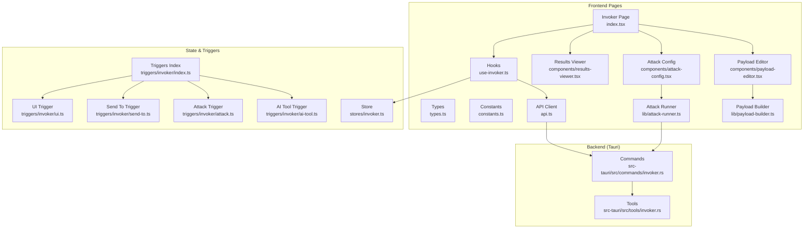
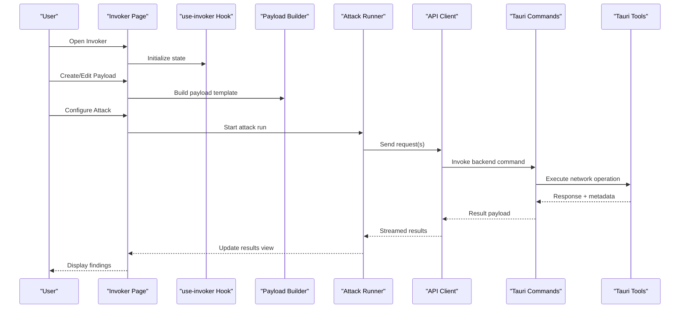
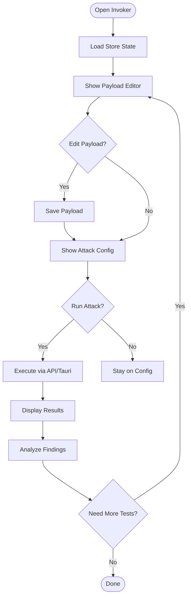
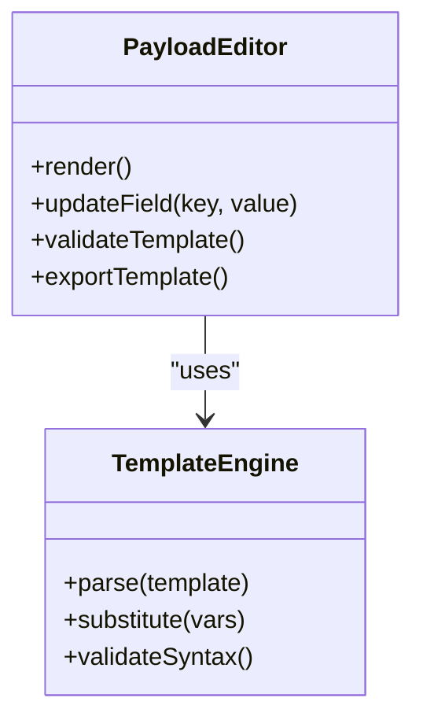
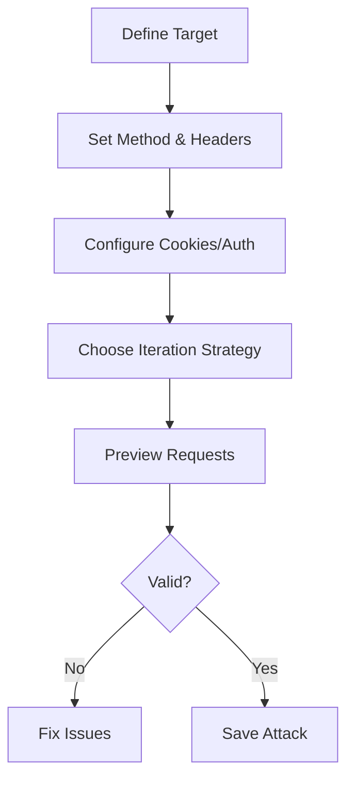
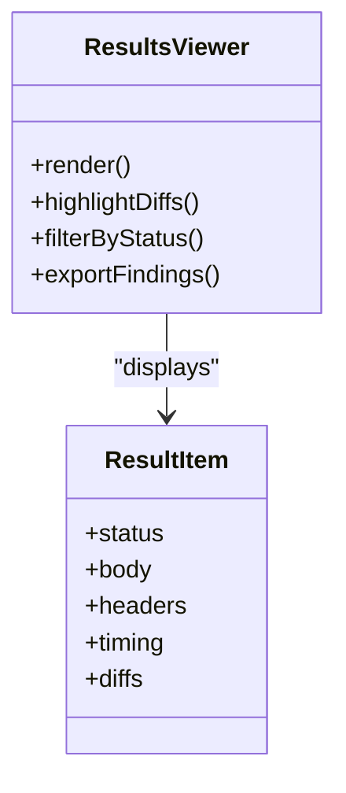
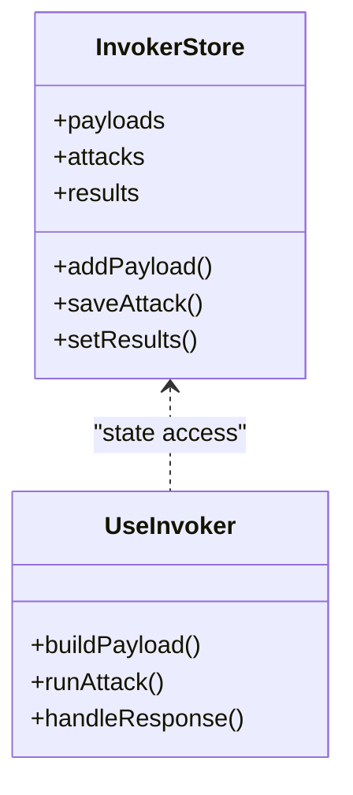
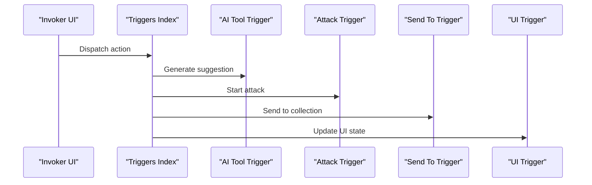
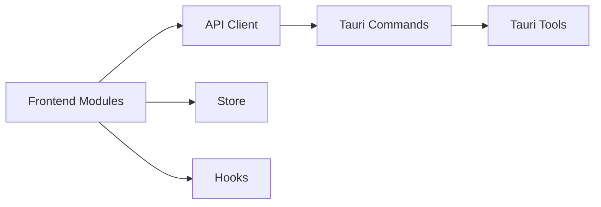

# Invoker Overview & Getting Started

<cite>
**Referenced Files in This Document**
- [index.tsx](file://src/pages/invoker/index.tsx)
- [types.ts](file://src/pages/invoker/types.ts)
- [constants.ts](file://src/pages/invoker/constants.ts)
- [api.ts](file://src/pages/invoker/api.ts)
- [use-invoker.ts](file://src/pages/invoker/hooks/use-invoker.ts)
- [payload-builder.ts](file://src/pages/invoker/lib/payload-builder.ts)
- [attack-runner.ts](file://src/pages/invoker/lib/attack-runner.ts)
- [results-viewer.ts](file://src/pages/invoker/components/results-viewer.tsx)
- [payload-editor.tsx](file://src/pages/invoker/components/payload-editor.tsx)
- [attack-config.tsx](file://src/pages/invoker/components/attack-config.tsx)
- [invoker-store.ts](file://src/stores/invoker.ts)
- [invoker-trigger-index.ts](file://src/triggers/invoker/index.ts)
- [invoker-ai-tool.ts](file://src/triggers/invoker/ai-tool.ts)
- [invoker-attack.ts](file://src/triggers/invoker/attack.ts)
- [invoker-send-to.ts](file://src/triggers/invoker/send-to.ts)
- [invoker-ui.ts](file://src/triggers/invoker/ui.ts)
- [commands-invoker.rs](file://src-tauri/src/commands/invoker.rs)
- [tools-invoker.rs](file://src-tauri/src/tools/invoker.rs)
</cite>

## Table of Contents
1. [Introduction](#introduction)
2. [Project Structure](#project-structure)
3. [Core Components](#core-components)
4. [Architecture Overview](#architecture-overview)
5. [Detailed Component Analysis](#detailed-component-analysis)
6. [Dependency Analysis](#dependency-analysis)
7. [Performance Considerations](#performance-considerations)
8. [Troubleshooting Guide](#troubleshooting-guide)
9. [Conclusion](#conclusion)
10. [Appendices](#appendices)

## Introduction
The Invoker tool is a focused, automated API testing component designed to integrate into security workflows. It enables you to define payloads, configure attack scenarios, and analyze results with minimal friction. Typical use cases include parameter fuzzing, authentication bypass testing, and input validation checks. The UI guides you through creating payloads, running attacks against targets, and interpreting outcomes such as status codes, response bodies, and timing differences.

Key concepts:
- Payloads: Reusable request templates with variables and injection points.
- Attacks: Configurations that drive how payloads are sent (e.g., iteration strategies, headers, cookies).
- Results: Responses and metadata captured for analysis, including diffs and indicators.

This guide explains the purpose of automated API testing in security workflows, walks through the user interface layout and navigation, and provides step-by-step instructions to create your first test payload, configure a simple attack scenario, and interpret basic results.

## Project Structure
The Invoker feature spans both frontend pages and backend Tauri commands. The main entry point is the Invoker page, which composes components for payload editing, attack configuration, and results viewing. State is managed via a dedicated store, and triggers expose integrations with AI tools and other features like sending payloads elsewhere.

**Diagram sources**
- [index.tsx](file://src/pages/invoker/index.tsx)
- [types.ts](file://src/pages/invoker/types.ts)
- [constants.ts](file://src/pages/invoker/constants.ts)
- [api.ts](file://src/pages/invoker/api.ts)
- [use-invoker.ts](file://src/pages/invoker/hooks/use-invoker.ts)
- [payload-builder.ts](file://src/pages/invoker/lib/payload-builder.ts)
- [attack-runner.ts](file://src/pages/invoker/lib/attack-runner.ts)
- [results-viewer.ts](file://src/pages/invoker/components/results-viewer.tsx)
- [payload-editor.tsx](file://src/pages/invoker/components/payload-editor.tsx)
- [attack-config.tsx](file://src/pages/invoker/components/attack-config.tsx)
- [invoker-store.ts](file://src/stores/invoker.ts)
- [invoker-trigger-index.ts](file://src/triggers/invoker/index.ts)
- [invoker-ai-tool.ts](file://src/triggers/invoker/ai-tool.ts)
- [invoker-attack.ts](file://src/triggers/invoker/attack.ts)
- [invoker-send-to.ts](file://src/triggers/invoker/send-to.ts)
- [invoker-ui.ts](file://src/triggers/invoker/ui.ts)
- [commands-invoker.rs](file://src-tauri/src/commands/invoker.rs)
- [tools-invoker.rs](file://src-tauri/src/tools/invoker.rs)

**Section sources**
- [index.tsx](file://src/pages/invoker/index.tsx)
- [types.ts](file://src/pages/invoker/types.ts)
- [constants.ts](file://src/pages/invoker/constants.ts)
- [api.ts](file://src/pages/invoker/api.ts)
- [use-invoker.ts](file://src/pages/invoker/hooks/use-invoker.ts)
- [payload-builder.ts](file://src/pages/invoker/lib/payload-builder.ts)
- [attack-runner.ts](file://src/pages/invoker/lib/attack-runner.ts)
- [results-viewer.ts](file://src/pages/invoker/components/results-viewer.tsx)
- [payload-editor.tsx](file://src/pages/invoker/components/payload-editor.tsx)
- [attack-config.tsx](file://src/pages/invoker/components/attack-config.tsx)
- [invoker-store.ts](file://src/stores/invoker.ts)
- [invoker-trigger-index.ts](file://src/triggers/invoker/index.ts)
- [invoker-ai-tool.ts](file://src/triggers/invoker/ai-tool.ts)
- [invoker-attack.ts](file://src/triggers/invoker/attack.ts)
- [invoker-send-to.ts](file://src/triggers/invoker/send-to.ts)
- [invoker-ui.ts](file://src/triggers/invoker/ui.ts)
- [commands-invoker.rs](file://src-tauri/src/commands/invoker.rs)
- [tools-invoker.rs](file://src-tauri/src/tools/invoker.rs)

## Core Components
- Invoker Page: Orchestrates the editor, config, and results panels; manages navigation and state.
- Payload Editor: Creates and edits payloads with placeholders and variable substitution.
- Attack Config: Defines iteration strategies, headers, cookies, and target endpoints.
- Results Viewer: Displays responses, diffs, and indicators for quick triage.
- Store: Centralized state for payloads, attacks, and results.
- Hooks: Encapsulate logic for building payloads, running attacks, and handling API calls.
- Triggers: Expose actions to AI tools, send payloads to other features, and update UI.

**Section sources**
- [index.tsx](file://src/pages/invoker/index.tsx)
- [payload-editor.tsx](file://src/pages/invoker/components/payload-editor.tsx)
- [attack-config.tsx](file://src/pages/invoker/components/attack-config.tsx)
- [results-viewer.ts](file://src/pages/invoker/components/results-viewer.tsx)
- [invoker-store.ts](file://src/stores/invoker.ts)
- [use-invoker.ts](file://src/pages/invoker/hooks/use-invoker.ts)
- [invoker-trigger-index.ts](file://src/triggers/invoker/index.ts)

## Architecture Overview
The Invoker integrates with the Tauri backend to execute HTTP requests and process results. The frontend constructs payloads and attack configurations, then delegates execution to backend commands. Results flow back to the UI for visualization and analysis.

**Diagram sources**
- [index.tsx](file://src/pages/invoker/index.tsx)
- [use-invoker.ts](file://src/pages/invoker/hooks/use-invoker.ts)
- [payload-builder.ts](file://src/pages/invoker/lib/payload-builder.ts)
- [attack-runner.ts](file://src/pages/invoker/lib/attack-runner.ts)
- [api.ts](file://src/pages/invoker/api.ts)
- [commands-invoker.rs](file://src-tauri/src/commands/invoker.rs)
- [tools-invoker.rs](file://src-tauri/src/tools/invoker.rs)

## Detailed Component Analysis

### Invoker Page and Navigation
The Invoker page composes the editor, configuration, and results panels. It handles tabbed navigation and ensures consistent state across views.

**Diagram sources**
- [index.tsx](file://src/pages/invoker/index.tsx)
- [invoker-store.ts](file://src/stores/invoker.ts)

**Section sources**
- [index.tsx](file://src/pages/invoker/index.tsx)
- [invoker-store.ts](file://src/stores/invoker.ts)

### Payload Editor
The Payload Editor allows you to craft request templates with variables and placeholders. It supports common patterns for fuzzing and injection testing.

**Diagram sources**
- [payload-editor.tsx](file://src/pages/invoker/components/payload-editor.tsx)
- [payload-builder.ts](file://src/pages/invoker/lib/payload-builder.ts)

**Section sources**
- [payload-editor.tsx](file://src/pages/invoker/components/payload-editor.tsx)
- [payload-builder.ts](file://src/pages/invoker/lib/payload-builder.ts)

### Attack Configuration
Attack Config defines how payloads are executed: target endpoint, method, headers, cookies, and iteration strategies.

**Diagram sources**
- [attack-config.tsx](file://src/pages/invoker/components/attack-config.tsx)
- [attack-runner.ts](file://src/pages/invoker/lib/attack-runner.ts)

**Section sources**
- [attack-config.tsx](file://src/pages/invoker/components/attack-config.tsx)
- [attack-runner.ts](file://src/pages/invoker/lib/attack-runner.ts)

### Results Viewer
The Results Viewer displays responses, status codes, timing, and diffs to help identify anomalies and potential vulnerabilities.

**Diagram sources**
- [results-viewer.ts](file://src/pages/invoker/components/results-viewer.tsx)

**Section sources**
- [results-viewer.ts](file://src/pages/invoker/components/results-viewer.tsx)

### Store and Hooks
The store centralizes state for payloads, attacks, and results. Hooks encapsulate logic for building payloads, running attacks, and interacting with the API client.

**Diagram sources**
- [invoker-store.ts](file://src/stores/invoker.ts)
- [use-invoker.ts](file://src/pages/invoker/hooks/use-invoker.ts)

**Section sources**
- [invoker-store.ts](file://src/stores/invoker.ts)
- [use-invoker.ts](file://src/pages/invoker/hooks/use-invoker.ts)

### Triggers and Integrations
Triggers expose Invoker actions to AI tools and other features, enabling seamless workflows like sending payloads to collections or updating UI states.

**Diagram sources**
- [invoker-trigger-index.ts](file://src/triggers/invoker/index.ts)
- [invoker-ai-tool.ts](file://src/triggers/invoker/ai-tool.ts)
- [invoker-attack.ts](file://src/triggers/invoker/attack.ts)
- [invoker-send-to.ts](file://src/triggers/invoker/send-to.ts)
- [invoker-ui.ts](file://src/triggers/invoker/ui.ts)

**Section sources**
- [invoker-trigger-index.ts](file://src/triggers/invoker/index.ts)
- [invoker-ai-tool.ts](file://src/triggers/invoker/ai-tool.ts)
- [invoker-attack.ts](file://src/triggers/invoker/attack.ts)
- [invoker-send-to.ts](file://src/triggers/invoker/send-to.ts)
- [invoker-ui.ts](file://src/triggers/invoker/ui.ts)

## Dependency Analysis
The Invoker module depends on frontend components, hooks, and stores, while delegating network operations to Tauri commands and tools.

**Diagram sources**
- [api.ts](file://src/pages/invoker/api.ts)
- [invoker-store.ts](file://src/stores/invoker.ts)
- [use-invoker.ts](file://src/pages/invoker/hooks/use-invoker.ts)
- [commands-invoker.rs](file://src-tauri/src/commands/invoker.rs)
- [tools-invoker.rs](file://src-tauri/src/tools/invoker.rs)

**Section sources**
- [api.ts](file://src/pages/invoker/api.ts)
- [invoker-store.ts](file://src/stores/invoker.ts)
- [use-invoker.ts](file://src/pages/invoker/hooks/use-invoker.ts)
- [commands-invoker.rs](file://src-tauri/src/commands/invoker.rs)
- [tools-invoker.rs](file://src-tauri/src/tools/invoker.rs)

## Performance Considerations
- Batch requests when possible to reduce overhead.
- Use streaming results to keep the UI responsive during long-running attacks.
- Limit payload iterations to avoid overwhelming the target or triggering rate limits.
- Cache static headers and cookies to minimize repeated computations.

[No sources needed since this section provides general guidance]

## Troubleshooting Guide
Common issues and resolutions:
- Network errors: Verify proxy settings and target reachability.
- Authentication failures: Ensure tokens and cookies are correctly set in attack config.
- Payload syntax errors: Validate template syntax before running attacks.
- Slow responses: Adjust concurrency and timeouts in attack configuration.

**Section sources**
- [api.ts](file://src/pages/invoker/api.ts)
- [attack-runner.ts](file://src/pages/invoker/lib/attack-runner.ts)
- [commands-invoker.rs](file://src-tauri/src/commands/invoker.rs)

## Conclusion
The Invoker tool streamlines automated API testing by providing an intuitive interface for crafting payloads, configuring attacks, and analyzing results. Its modular architecture and trigger system enable integration with AI tools and other workflows, making it a powerful asset for security professionals conducting parameter fuzzing, authentication bypass testing, and input validation checks.

[No sources needed since this section summarizes without analyzing specific files]

## Appendices

### Step-by-Step: Creating Your First Test Payload
1. Open the Invoker page from the main navigation.
2. Navigate to the Payload Editor.
3. Define a new payload with a base request and add placeholders for parameters.
4. Validate the template syntax using the built-in validator.
5. Save the payload for reuse in future attacks.

**Section sources**
- [index.tsx](file://src/pages/invoker/index.tsx)
- [payload-editor.tsx](file://src/pages/invoker/components/payload-editor.tsx)
- [payload-builder.ts](file://src/pages/invoker/lib/payload-builder.ts)

### Step-by-Step: Configuring a Simple Attack Scenario
1. Go to the Attack Config panel.
2. Select the saved payload and specify the target endpoint.
3. Set HTTP method, headers, and cookies as needed.
4. Choose an iteration strategy (e.g., sequential or parallel).
5. Preview requests to ensure correctness before running.

**Section sources**
- [attack-config.tsx](file://src/pages/invoker/components/attack-config.tsx)
- [attack-runner.ts](file://src/pages/invoker/lib/attack-runner.ts)

### Interpreting Basic Results
- Review status codes to identify successful vs. failed requests.
- Inspect response bodies for unexpected content or error messages.
- Compare timing differences to detect performance anomalies.
- Use diff highlighting to spot variations between expected and actual responses.

**Section sources**
- [results-viewer.ts](file://src/pages/invoker/components/results-viewer.tsx)

### Common Use Cases and Patterns
- Parameter Fuzzing: Replace query params or body fields with varied inputs to uncover validation weaknesses.
- Authentication Bypass Testing: Manipulate tokens, roles, or session cookies to test authorization logic.
- Input Validation Checks: Inject special characters, SQL fragments, or script tags to assess sanitization.

[No sources needed since this section provides general guidance]