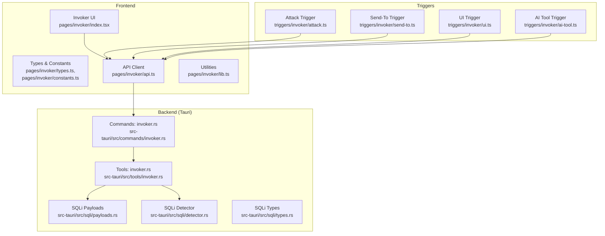
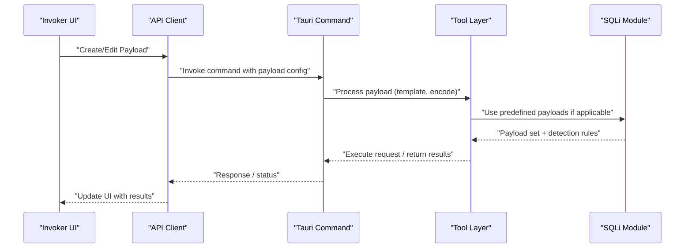
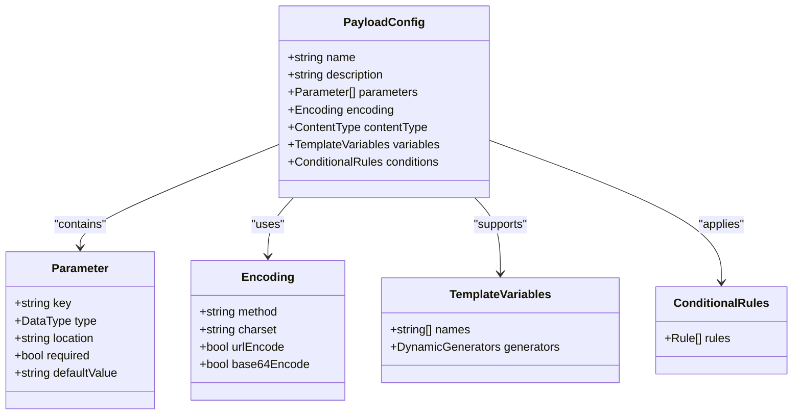
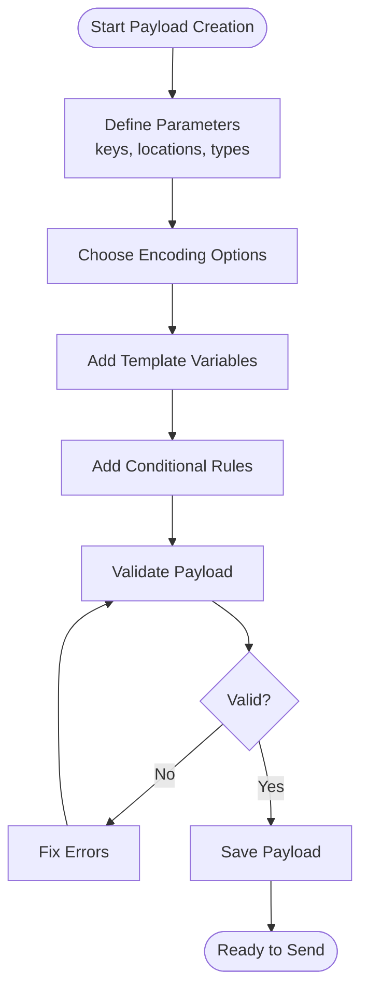
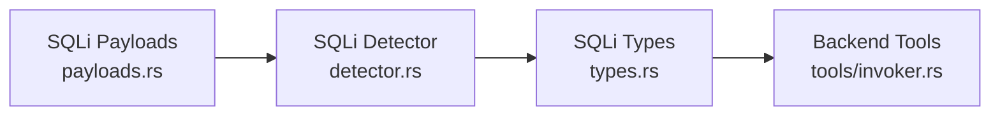
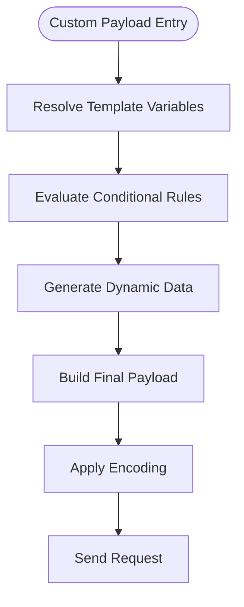
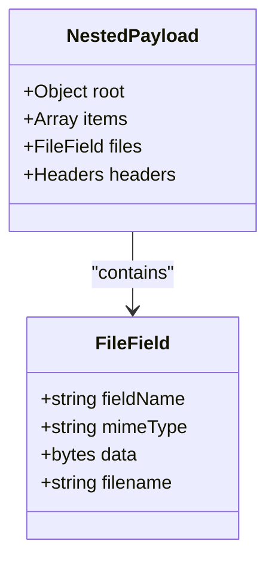
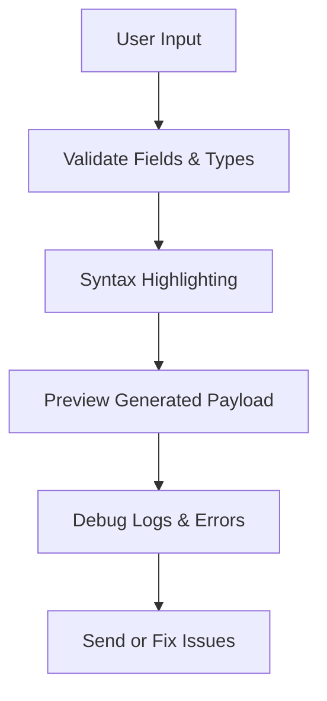
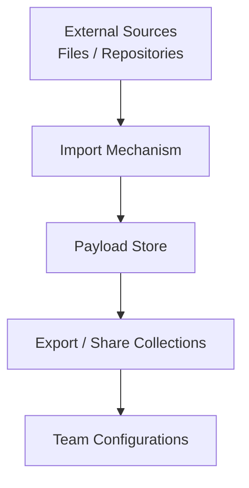
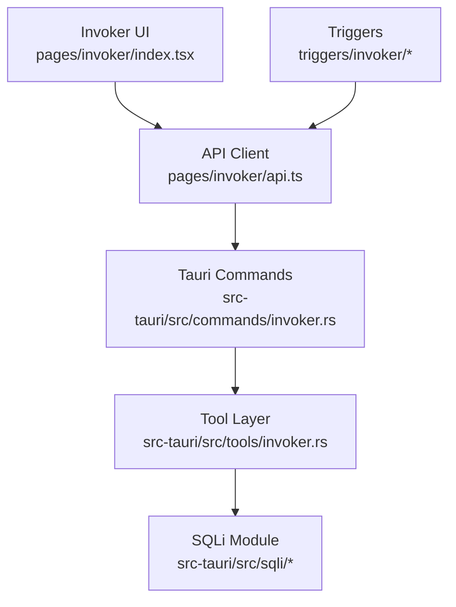

# Payload Management & Configuration

<cite>
**Referenced Files in This Document**
- [index.tsx](file://src/pages/invoker/index.tsx)
- [types.ts](file://src/pages/invoker/types.ts)
- [constants.ts](file://src/pages/invoker/constants.ts)
- [api.ts](file://src/pages/invoker/api.ts)
- [lib.ts](file://src/pages/invoker/lib.ts)
- [payloads.rs](file://src-tauri/src/sqli/payloads.rs)
- [detector.rs](file://src-tauri/src/sqli/detector.rs)
- [types.rs](file://src-tauri/src/sqli/types.rs)
- [mod.rs](file://src-tauri/src/sqli/mod.rs)
- [invoker.rs](file://src-tauri/src/commands/invoker.rs)
- [invoker.rs](file://src-tauri/src/tools/invoker.rs)
- [attack.ts](file://src/triggers/invoker/attack.ts)
- [send-to.ts](file://src/triggers/invoker/send-to.ts)
- [ui.ts](file://src/triggers/invoker/ui.ts)
- [ai-tool.ts](file://src/triggers/invoker/ai-tool.ts)
- [index.ts](file://src/triggers/invoker/index.ts)
</cite>

## Table of Contents
1. [Introduction](#introduction)
2. [Project Structure](#project-structure)
3. [Core Components](#core-components)
4. [Architecture Overview](#architecture-overview)
5. [Detailed Component Analysis](#detailed-component-analysis)
6. [Dependency Analysis](#dependency-analysis)
7. [Performance Considerations](#performance-considerations)
8. [Troubleshooting Guide](#troubleshooting-guide)
9. [Conclusion](#conclusion)
10. [Appendices](#appendices)

## Introduction
This document explains how payload management and configuration work in the Invoker tool. It covers creating, editing, and managing test payloads; parameter injection points; data types and encoding options; predefined payload libraries for common attack vectors; custom payload creation with template variables, conditional logic, and dynamic data generation; complex payload structures including nested parameters and file uploads; validation, syntax highlighting, debugging; and integration with external payload sources and team sharing.

## Project Structure
The Invoker feature spans both the frontend (TypeScript/React) and backend (Rust/Tauri). The frontend provides the UI for crafting payloads, selecting parameters, and sending requests. The backend exposes commands to execute attacks, manage payloads, and integrate with SQL injection detection and other tools.

**Diagram sources**
- [index.tsx](file://src/pages/invoker/index.tsx)
- [types.ts](file://src/pages/invoker/types.ts)
- [constants.ts](file://src/pages/invoker/constants.ts)
- [api.ts](file://src/pages/invoker/api.ts)
- [lib.ts](file://src/pages/invoker/lib.ts)
- [invoker.rs](file://src-tauri/src/commands/invoker.rs)
- [invoker.rs](file://src-tauri/src/tools/invoker.rs)
- [payloads.rs](file://src-tauri/src/sqli/payloads.rs)
- [detector.rs](file://src-tauri/src/sqli/detector.rs)
- [types.rs](file://src-tauri/src/sqli/types.rs)
- [attack.ts](file://src/triggers/invoker/attack.ts)
- [send-to.ts](file://src/triggers/invoker/send-to.ts)
- [ui.ts](file://src/triggers/invoker/ui.ts)
- [ai-tool.ts](file://src/triggers/invoker/ai-tool.ts)

**Section sources**
- [index.tsx](file://src/pages/invoker/index.tsx)
- [types.ts](file://src/pages/invoker/types.ts)
- [constants.ts](file://src/pages/invoker/constants.ts)
- [api.ts](file://src/pages/invoker/api.ts)
- [lib.ts](file://src/pages/invoker/lib.ts)
- [invoker.rs](file://src-tauri/src/commands/invoker.rs)
- [invoker.rs](file://src-tauri/src/tools/invoker.rs)
- [payloads.rs](file://src-tauri/src/sqli/payloads.rs)
- [detector.rs](file://src-tauri/src/sqli/detector.rs)
- [types.rs](file://src-tauri/src/sqli/types.rs)
- [attack.ts](file://src/triggers/invoker/attack.ts)
- [send-to.ts](file://src/triggers/invoker/send-to.ts)
- [ui.ts](file://src/triggers/invoker/ui.ts)
- [ai-tool.ts](file://src/triggers/invoker/ai-tool.ts)

## Core Components
- Frontend Invoker UI: Provides forms and editors for constructing HTTP requests and payloads, parameter selection, and sending actions.
- Invoker API client: Encapsulates Tauri command calls for executing attacks, retrieving payload sets, and managing configurations.
- Backend commands and tools: Handle request execution, payload templating, encoding, and integration with SQLi detection and other modules.
- SQLi payload library: Predefined payloads and detection logic for SQL injection testing.
- Triggers: Event-driven hooks that connect UI actions, AI assistance, and cross-feature integrations like “Send To”.

Key responsibilities:
- Parameter injection points are defined via typed models and constants.
- Data types and encoding options are handled by utilities and backend tools.
- Predefined payloads are provided through the SQLi module and can be extended.
- Custom payloads support template variables and conditional logic at runtime.
- Validation and syntax highlighting are exposed via editor components and helper functions.

**Section sources**
- [index.tsx](file://src/pages/invoker/index.tsx)
- [types.ts](file://src/pages/invoker/types.ts)
- [constants.ts](file://src/pages/invoker/constants.ts)
- [api.ts](file://src/pages/invoker/api.ts)
- [lib.ts](file://src/pages/invoker/lib.ts)
- [invoker.rs](file://src-tauri/src/commands/invoker.rs)
- [invoker.rs](file://src-tauri/src/tools/invoker.rs)
- [payloads.rs](file://src-tauri/src/sqli/payloads.rs)
- [detector.rs](file://src-tauri/src/sqli/detector.rs)
- [types.rs](file://src-tauri/src/sqli/types.rs)

## Architecture Overview
The Invoker architecture follows a clear separation between UI, API client, and backend services. Requests flow from the UI through the API client to Tauri commands, which then invoke tools for payload processing and execution. SQLi payloads and detectors are integrated as specialized modules.

**Diagram sources**
- [index.tsx](file://src/pages/invoker/index.tsx)
- [api.ts](file://src/pages/invoker/api.ts)
- [invoker.rs](file://src-tauri/src/commands/invoker.rs)
- [invoker.rs](file://src-tauri/src/tools/invoker.rs)
- [payloads.rs](file://src-tauri/src/sqli/payloads.rs)
- [detector.rs](file://src-tauri/src/sqli/detector.rs)

## Detailed Component Analysis

### Payload Model and Types
- Typed definitions describe payload structures, parameter injection points, data types, and encoding options.
- Constants define available encodings, content types, and default behaviors.
- Utilities provide helpers for building payloads, validating inputs, and formatting outputs.

**Diagram sources**
- [types.ts](file://src/pages/invoker/types.ts)
- [constants.ts](file://src/pages/invoker/constants.ts)
- [lib.ts](file://src/pages/invoker/lib.ts)

**Section sources**
- [types.ts](file://src/pages/invoker/types.ts)
- [constants.ts](file://src/pages/invoker/constants.ts)
- [lib.ts](file://src/pages/invoker/lib.ts)

### Creating and Editing Payloads
- Use the Invoker UI to create new payloads or edit existing ones.
- Define parameters with keys, locations (query, body, headers), and data types.
- Select encoding options such as URL encoding, Base64, or custom transformations.
- Apply template variables for dynamic values and conditional rules for context-aware behavior.

**Diagram sources**
- [index.tsx](file://src/pages/invoker/index.tsx)
- [lib.ts](file://src/pages/invoker/lib.ts)
- [types.ts](file://src/pages/invoker/types.ts)

**Section sources**
- [index.tsx](file://src/pages/invoker/index.tsx)
- [lib.ts](file://src/pages/invoker/lib.ts)
- [types.ts](file://src/pages/invoker/types.ts)

### Predefined Payload Library
- SQL Injection: Built-in payloads and detection logic are provided by the SQLi module.
- Other Attack Vectors: Extensible design allows adding XSS, command injection, and more via similar modules.

**Diagram sources**
- [payloads.rs](file://src-tauri/src/sqli/payloads.rs)
- [detector.rs](file://src-tauri/src/sqli/detector.rs)
- [types.rs](file://src-tauri/src/sqli/types.rs)
- [invoker.rs](file://src-tauri/src/tools/invoker.rs)

**Section sources**
- [payloads.rs](file://src-tauri/src/sqli/payloads.rs)
- [detector.rs](file://src-tauri/src/sqli/detector.rs)
- [types.rs](file://src-tauri/src/sqli/types.rs)

### Custom Payload Creation
- Template Variables: Inject dynamic values using named variables resolved at runtime.
- Conditional Logic: Apply rules based on context (e.g., environment, target, previous responses).
- Dynamic Data Generation: Integrate generators for randomized or contextual data.

**Diagram sources**
- [lib.ts](file://src/pages/invoker/lib.ts)
- [types.ts](file://src/pages/invoker/types.ts)
- [invoker.rs](file://src-tauri/src/tools/invoker.rs)

**Section sources**
- [lib.ts](file://src/pages/invoker/lib.ts)
- [types.ts](file://src/pages/invoker/types.ts)
- [invoker.rs](file://src-tauri/src/tools/invoker.rs)

### Complex Payload Structures
- Nested Parameters: Support hierarchical structures for JSON bodies or multipart forms.
- File Upload Scenarios: Configure file fields, metadata, and encoding for uploads.
- Mixed Content Types: Combine form data, JSON, and binary content in a single request.

**Diagram sources**
- [types.ts](file://src/pages/invoker/types.ts)
- [lib.ts](file://src/pages/invoker/lib.ts)

**Section sources**
- [types.ts](file://src/pages/invoker/types.ts)
- [lib.ts](file://src/pages/invoker/lib.ts)

### Validation, Syntax Highlighting, and Debugging
- Validation: Enforce required fields, correct types, and encoding constraints before sending.
- Syntax Highlighting: Editor components highlight templates, variables, and special characters.
- Debugging: Inspect generated payloads, view encoding steps, and capture errors with detailed messages.

**Diagram sources**
- [index.tsx](file://src/pages/invoker/index.tsx)
- [lib.ts](file://src/pages/invoker/lib.ts)

**Section sources**
- [index.tsx](file://src/pages/invoker/index.tsx)
- [lib.ts](file://src/pages/invoker/lib.ts)

### Integration with External Sources and Team Sharing
- External Payload Sources: Import payloads from external files or repositories via configuration.
- Team Sharing: Export and share payload collections across teams using standardized formats.
- Centralized Configurations: Manage shared settings and defaults for consistent behavior.

[No sources needed since this diagram shows conceptual workflow, not actual code structure]

## Dependency Analysis
The Invoker feature depends on several modules for functionality:

**Diagram sources**
- [index.tsx](file://src/pages/invoker/index.tsx)
- [api.ts](file://src/pages/invoker/api.ts)
- [invoker.rs](file://src-tauri/src/commands/invoker.rs)
- [invoker.rs](file://src-tauri/src/tools/invoker.rs)
- [payloads.rs](file://src-tauri/src/sqli/payloads.rs)
- [detector.rs](file://src-tauri/src/sqli/detector.rs)
- [types.rs](file://src-tauri/src/sqli/types.rs)
- [attack.ts](file://src/triggers/invoker/attack.ts)
- [send-to.ts](file://src/triggers/invoker/send-to.ts)
- [ui.ts](file://src/triggers/invoker/ui.ts)
- [ai-tool.ts](file://src/triggers/invoker/ai-tool.ts)

**Section sources**
- [index.tsx](file://src/pages/invoker/index.tsx)
- [api.ts](file://src/pages/invoker/api.ts)
- [invoker.rs](file://src-tauri/src/commands/invoker.rs)
- [invoker.rs](file://src-tauri/src/tools/invoker.rs)
- [payloads.rs](file://src-tauri/src/sqli/payloads.rs)
- [detector.rs](file://src-tauri/src/sqli/detector.rs)
- [types.rs](file://src-tauri/src/sqli/types.rs)
- [attack.ts](file://src/triggers/invoker/attack.ts)
- [send-to.ts](file://src/triggers/invoker/send-to.ts)
- [ui.ts](file://src/triggers/invoker/ui.ts)
- [ai-tool.ts](file://src/triggers/invoker/ai-tool.ts)

## Performance Considerations
- Minimize payload size by avoiding unnecessary fields and choosing efficient encodings.
- Cache reusable payload templates and computed values where appropriate.
- Batch operations when possible to reduce network overhead.
- Profile encoding and transformation steps to identify bottlenecks.

[No sources needed since this section provides general guidance]

## Troubleshooting Guide
Common issues and resolutions:
- Validation errors: Check required fields, data types, and encoding settings.
- Encoding problems: Verify URL/Base64 encoding flags and character sets.
- Template resolution failures: Ensure all variables are defined and accessible.
- Conditional logic errors: Review rule conditions and context availability.
- Debugging tips: Use preview and debug logs to inspect generated payloads and error messages.

**Section sources**
- [lib.ts](file://src/pages/invoker/lib.ts)
- [index.tsx](file://src/pages/invoker/index.tsx)

## Conclusion
The Invoker tool provides a robust framework for payload management and configuration. With typed models, flexible encoding options, predefined libraries, and extensibility for custom payloads, it supports comprehensive testing workflows. Integrations with triggers and external sources enable seamless collaboration and automation.

[No sources needed since this section summarizes without analyzing specific files]

## Appendices
- Best Practices:
  - Keep payloads modular and reusable.
  - Document template variables and conditions clearly.
  - Use consistent naming conventions for parameters and files.
- Extension Points:
  - Add new attack vector modules similar to SQLi.
  - Implement additional encoders and validators.
  - Enhance trigger integrations for advanced workflows.

[No sources needed since this section provides general guidance]