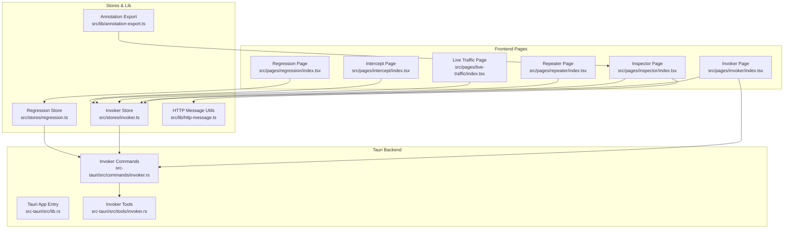
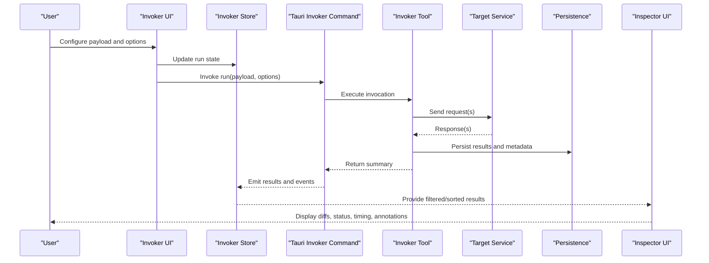
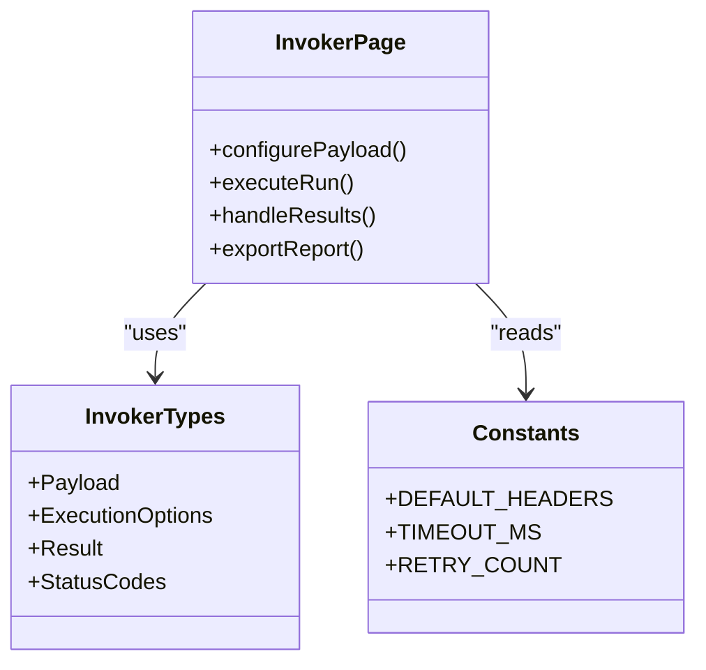
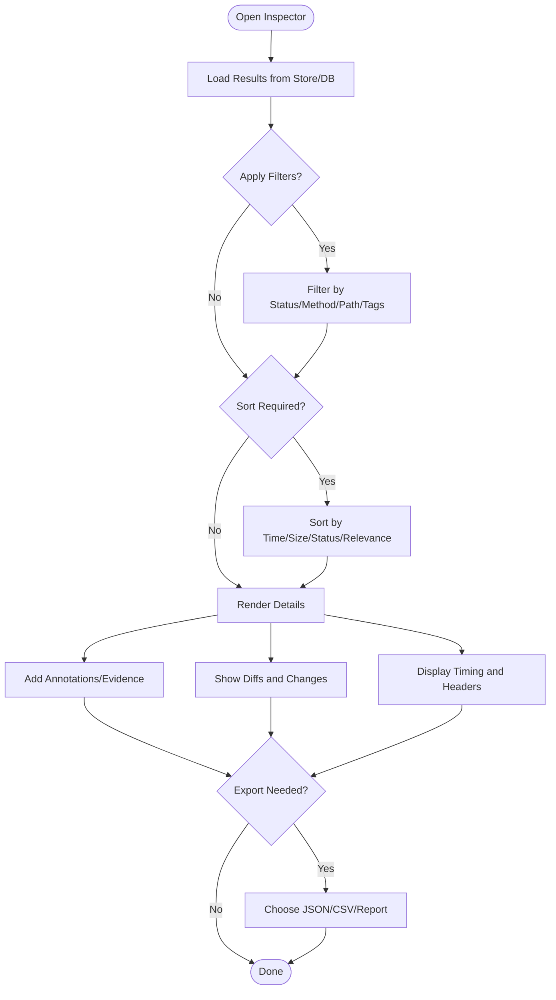
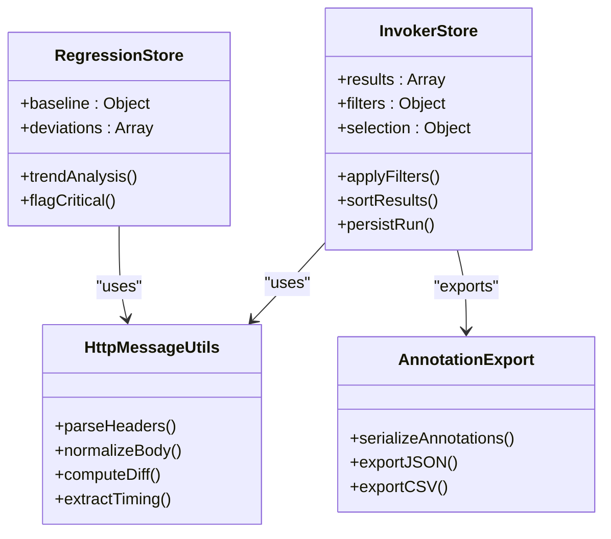
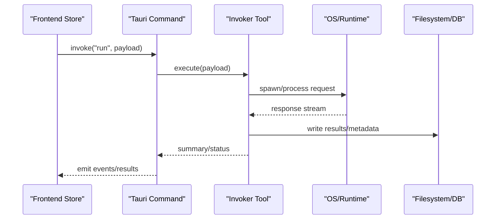
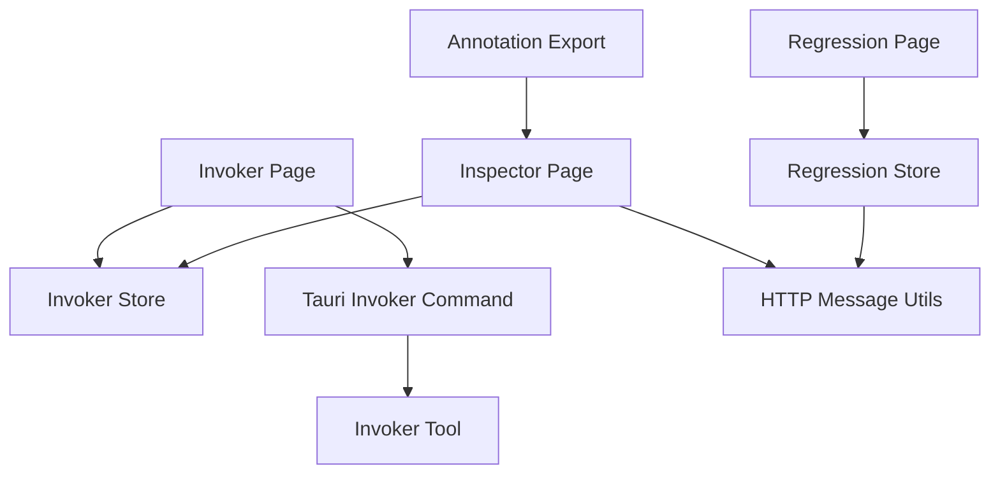

# Results Analysis & Reporting

<cite>
**Referenced Files in This Document**
- [index.tsx](file://src/pages/invoker/index.tsx)
- [types.ts](file://src/pages/invoker/types.ts)
- [constants.ts](file://src/pages/invoker/constants.ts)
- [api.ts](file://src/pages/inspector/api.ts)
- [index.tsx](file://src/pages/inspector/index.tsx)
- [types.ts](file://src/pages/inspector/types.ts)
- [constants.ts](file://src/pages/inspector/constants.ts)
- [invoker.ts](file://src/stores/invoker.ts)
- [regression.ts](file://src/stores/regression.ts)
- [http-message.ts](file://src/lib/http-message.ts)
- [annotation-export.ts](file://src/lib/annotation-export.ts)
- [index.tsx](file://src/components/ai-elements/test-results.tsx)
- [index.tsx](file://src/pages/regression/index.tsx)
- [index.tsx](file://src/pages/repeater/index.tsx)
- [index.tsx](file://src/pages/live-traffic/index.tsx)
- [index.tsx](file://src/pages/intercept/index.tsx)
- [lib.rs](file://src-tauri/src/lib.rs)
- [commands/invoker.rs](file://src-tauri/src/commands/invoker.rs)
- [tools/invoker.rs](file://src-tauri/src/tools/invoker.rs)
</cite>

## Table of Contents
1. [Introduction](#introduction)
2. [Project Structure](#project-structure)
3. [Core Components](#core-components)
4. [Architecture Overview](#architecture-overview)
5. [Detailed Component Analysis](#detailed-component-analysis)
6. [Dependency Analysis](#dependency-analysis)
7. [Performance Considerations](#performance-considerations)
8. [Troubleshooting Guide](#troubleshooting-guide)
9. [Conclusion](#conclusion)
10. [Appendices](#appendices)

## Introduction
This document explains how to analyze test results and generate reports using the Invoker tool within the application. It focuses on interpreting response differences, identifying potential vulnerabilities, and validating findings through manual verification. It also documents the result inspector interface for examining request/response pairs, status codes, response times, and content changes. Filtering and sorting capabilities for large result sets, export formats for reporting, and integration points with vulnerability management systems are covered. Finally, it includes examples of common vulnerability patterns, false positive identification, evidence collection practices, result correlation, trend analysis, and automated alerting for critical findings.

## Project Structure
The Invoker feature is implemented across frontend pages, stores, utilities, and Tauri backend commands. The key areas include:
- Invoker page and types for defining payloads, execution context, and result structures
- Inspector page and API for detailed inspection of requests/responses and metadata
- Stores for managing invoker state, regression tracking, and HTTP message utilities
- Tauri commands and tools for executing invocations and persisting results
- Shared UI components for displaying test results and annotations

**Diagram sources**
- [index.tsx](file://src/pages/invoker/index.tsx)
- [index.tsx](file://src/pages/inspector/index.tsx)
- [index.tsx](file://src/pages/regression/index.tsx)
- [index.tsx](file://src/pages/repeater/index.tsx)
- [index.tsx](file://src/pages/live-traffic/index.tsx)
- [index.tsx](file://src/pages/intercept/index.tsx)
- [invoker.ts](file://src/stores/invoker.ts)
- [regression.ts](file://src/stores/regression.ts)
- [http-message.ts](file://src/lib/http-message.ts)
- [annotation-export.ts](file://src/lib/annotation-export.ts)
- [lib.rs](file://src-tauri/src/lib.rs)
- [commands/invoker.rs](file://src-tauri/src/commands/invoker.rs)
- [tools/invoker.rs](file://src-tauri/src/tools/invoker.rs)

**Section sources**
- [index.tsx](file://src/pages/invoker/index.tsx)
- [index.tsx](file://src/pages/inspector/index.tsx)
- [invoker.ts](file://src/stores/invoker.ts)
- [regression.ts](file://src/stores/regression.ts)
- [http-message.ts](file://src/lib/http-message.ts)
- [annotation-export.ts](file://src/lib/annotation-export.ts)
- [lib.rs](file://src-tauri/src/lib.rs)
- [commands/invoker.rs](file://src-tauri/src/commands/invoker.rs)
- [tools/invoker.rs](file://src-tauri/src/tools/invoker.rs)

## Core Components
- Invoker Page: Orchestrates payload construction, execution, and result display. It integrates with the store for state management and invokes Tauri commands to run tests against targets.
- Inspector Page: Provides a detailed view of individual request/response pairs, including headers, body diffs, status codes, timing, and annotations. It supports filtering and exporting.
- Stores: Centralized state for invoker runs, regression baselines, and HTTP message utilities for parsing and comparing responses.
- Tauri Commands/Tools: Execute invocations securely, handle persistence, and expose APIs to the frontend for retrieval and export.

Key responsibilities:
- Result ingestion and normalization
- Difference detection between baseline and current responses
- Metadata capture (status codes, timings, headers)
- Annotation and tagging for evidence
- Export and integration hooks

**Section sources**
- [index.tsx](file://src/pages/invoker/index.tsx)
- [types.ts](file://src/pages/invoker/types.ts)
- [constants.ts](file://src/pages/invoker/constants.ts)
- [index.tsx](file://src/pages/inspector/index.tsx)
- [types.ts](file://src/pages/inspector/types.ts)
- [constants.ts](file://src/pages/inspector/constants.ts)
- [invoker.ts](file://src/stores/invoker.ts)
- [regression.ts](file://src/stores/regression.ts)
- [http-message.ts](file://src/lib/http-message.ts)
- [annotation-export.ts](file://src/lib/annotation-export.ts)
- [commands/invoker.rs](file://src-tauri/src/commands/invoker.rs)
- [tools/invoker.rs](file://src-tauri/src/tools/invoker.rs)

## Architecture Overview
The Invoker workflow spans multiple layers:
- Frontend constructs payloads and triggers execution via Tauri commands
- Backend executes invocations, captures responses, and persists results
- Inspector reads persisted data and renders detailed comparisons
- Stores maintain state and provide utilities for diffing and filtering
- Regression module tracks trends and flags deviations

**Diagram sources**
- [index.tsx](file://src/pages/invoker/index.tsx)
- [invoker.ts](file://src/stores/invoker.ts)
- [commands/invoker.rs](file://src-tauri/src/commands/invoker.rs)
- [tools/invoker.rs](file://src-tauri/src/tools/invoker.rs)
- [index.tsx](file://src/pages/inspector/index.tsx)

## Detailed Component Analysis

### Invoker Page and Types
- Purpose: Build payloads, manage execution lifecycle, and present results.
- Key aspects:
  - Payload schema and validation
  - Execution modes (single, batch, iterative)
  - Integration with Tauri commands for secure execution
  - Event-driven updates to stores and UI

**Diagram sources**
- [index.tsx](file://src/pages/invoker/index.tsx)
- [types.ts](file://src/pages/invoker/types.ts)
- [constants.ts](file://src/pages/invoker/constants.ts)

**Section sources**
- [index.tsx](file://src/pages/invoker/index.tsx)
- [types.ts](file://src/pages/invoker/types.ts)
- [constants.ts](file://src/pages/invoker/constants.ts)

### Inspector Interface
- Purpose: Inspect individual or grouped results with rich details.
- Capabilities:
  - Request/response pair viewer
  - Status code highlighting and interpretation
  - Response time metrics and latency thresholds
  - Content change detection and diff views
  - Filtering by status, method, path, tags, and severity
  - Sorting by time, size, status, and relevance
  - Export to JSON, CSV, or annotated reports

**Diagram sources**
- [index.tsx](file://src/pages/inspector/index.tsx)
- [types.ts](file://src/pages/inspector/types.ts)
- [constants.ts](file://src/pages/inspector/constants.ts)
- [http-message.ts](file://src/lib/http-message.ts)
- [annotation-export.ts](file://src/lib/annotation-export.ts)

**Section sources**
- [index.tsx](file://src/pages/inspector/index.tsx)
- [types.ts](file://src/pages/inspector/types.ts)
- [constants.ts](file://src/pages/inspector/constants.ts)
- [http-message.ts](file://src/lib/http-message.ts)
- [annotation-export.ts](file://src/lib/annotation-export.ts)

### Stores and Utilities
- Invoker Store: Manages run state, result lists, filters, and selection.
- Regression Store: Tracks baselines, deviations, and trends over time.
- HTTP Message Utilities: Parse headers, bodies, and compute diffs; normalize responses for comparison.
- Annotation Export: Serialize annotations and evidence into report formats.

**Diagram sources**
- [invoker.ts](file://src/stores/invoker.ts)
- [regression.ts](file://src/stores/regression.ts)
- [http-message.ts](file://src/lib/http-message.ts)
- [annotation-export.ts](file://src/lib/annotation-export.ts)

**Section sources**
- [invoker.ts](file://src/stores/invoker.ts)
- [regression.ts](file://src/stores/regression.ts)
- [http-message.ts](file://src/lib/http-message.ts)
- [annotation-export.ts](file://src/lib/annotation-export.ts)

### Tauri Backend Integration
- Commands: Expose secure endpoints for running invocations and retrieving results.
- Tools: Implement execution logic, error handling, and persistence.
- App Entry: Wires commands and tools into the Tauri runtime.

**Diagram sources**
- [lib.rs](file://src-tauri/src/lib.rs)
- [commands/invoker.rs](file://src-tauri/src/commands/invoker.rs)
- [tools/invoker.rs](file://src-tauri/src/tools/invoker.rs)

**Section sources**
- [lib.rs](file://src-tauri/src/lib.rs)
- [commands/invoker.rs](file://src-tauri/src/commands/invoker.rs)
- [tools/invoker.rs](file://src-tauri/src/tools/invoker.rs)

## Dependency Analysis
- Invoker depends on Tauri commands for execution and persistence.
- Inspector depends on stores and HTTP utilities for rendering and diffing.
- Regression depends on historical data and deviation thresholds.
- Export utilities depend on annotation structures and serialization formats.

**Diagram sources**
- [index.tsx](file://src/pages/invoker/index.tsx)
- [invoker.ts](file://src/stores/invoker.ts)
- [index.tsx](file://src/pages/inspector/index.tsx)
- [http-message.ts](file://src/lib/http-message.ts)
- [index.tsx](file://src/pages/regression/index.tsx)
- [regression.ts](file://src/stores/regression.ts)
- [annotation-export.ts](file://src/lib/annotation-export.ts)
- [commands/invoker.rs](file://src-tauri/src/commands/invoker.rs)
- [tools/invoker.rs](file://src-tauri/src/tools/invoker.rs)

**Section sources**
- [index.tsx](file://src/pages/invoker/index.tsx)
- [invoker.ts](file://src/stores/invoker.ts)
- [index.tsx](file://src/pages/inspector/index.tsx)
- [http-message.ts](file://src/lib/http-message.ts)
- [index.tsx](file://src/pages/regression/index.tsx)
- [regression.ts](file://src/stores/regression.ts)
- [annotation-export.ts](file://src/lib/annotation-export.ts)
- [commands/invoker.rs](file://src-tauri/src/commands/invoker.rs)
- [tools/invoker.rs](file://src-tauri/src/tools/invoker.rs)

## Performance Considerations
- Large result sets: Use pagination, virtualization, and efficient filtering/sorting in the inspector.
- Diff computation: Normalize bodies before diffing; avoid deep comparisons on large payloads.
- Timing metrics: Capture precise timestamps and avoid blocking operations during rendering.
- Persistence: Batch writes and use indexes for fast queries by status, path, and timestamp.
- Export: Stream large exports instead of loading entire datasets into memory.

[No sources needed since this section provides general guidance]

## Troubleshooting Guide
Common issues and resolutions:
- No results displayed: Verify store state and Tauri command responses; check network and proxy settings.
- Incorrect diffs: Ensure body normalization and consistent encoding; validate header casing.
- Slow performance: Reduce payload sizes, enable lazy loading, and optimize filter predicates.
- Export failures: Confirm annotation structure completeness and file permissions.
- False positives: Cross-check with live traffic and intercept logs; refine thresholds and rules.

**Section sources**
- [index.tsx](file://src/pages/invoker/index.tsx)
- [index.tsx](file://src/pages/inspector/index.tsx)
- [invoker.ts](file://src/stores/invoker.ts)
- [http-message.ts](file://src/lib/http-message.ts)
- [annotation-export.ts](file://src/lib/annotation-export.ts)
- [index.tsx](file://src/pages/live-traffic/index.tsx)
- [index.tsx](file://src/pages/intercept/index.tsx)

## Conclusion
The Invoker tool provides a robust framework for analyzing test results and generating actionable reports. By leveraging the inspector interface, stores, and Tauri backend, users can interpret response differences, identify vulnerabilities, and validate findings efficiently. Filtering, sorting, and export capabilities support comprehensive reporting and integration with vulnerability management systems. Trend analysis and automated alerting help prioritize critical findings and streamline security assessments.

[No sources needed since this section summarizes without analyzing specific files]

## Appendices

### Interpreting Response Differences
- Focus on structural changes in JSON/XML bodies, missing fields, and altered status codes.
- Compare headers for security-related changes (e.g., CSP, cookies).
- Validate timing anomalies that may indicate server-side errors or throttling.

### Identifying Potential Vulnerabilities
- Common patterns:
  - Unauthenticated access to sensitive endpoints
  - Insecure direct object references
  - Sensitive data exposure in responses
  - Misconfigured headers (CORS, CSP)
- Manual verification steps:
  - Reproduce with minimal payloads
  - Check server logs and error messages
  - Validate behavior across environments

### Evidence Collection
- Capture full request/response pairs
- Record timestamps, status codes, and headers
- Add annotations describing observed behavior and hypotheses
- Export artifacts for audit trails

### Result Correlation and Trend Analysis
- Correlate results across runs by endpoint and parameters
- Track deviations from baselines and flag regressions
- Visualize trends in error rates and response times

### Automated Alerting for Critical Findings
- Define thresholds for status codes, timing, and content changes
- Integrate with notification channels (email, Slack, issue trackers)
- Escalate high-severity findings immediately

### Example Workflows
- Single endpoint validation:
  - Construct payload, execute, inspect results, annotate, export
- Batch testing:
  - Iterate over parameter sets, aggregate results, filter by severity
- Regression checks:
  - Compare against baseline, highlight deviations, generate reports

[No sources needed since this section provides general guidance]