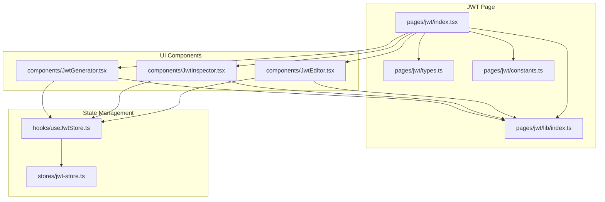
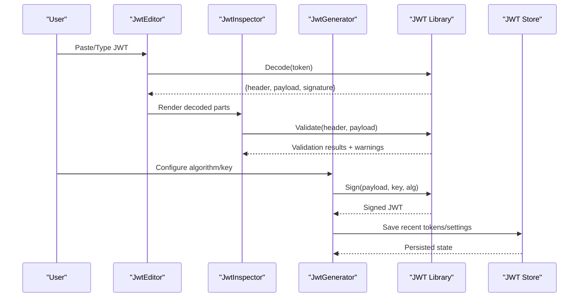
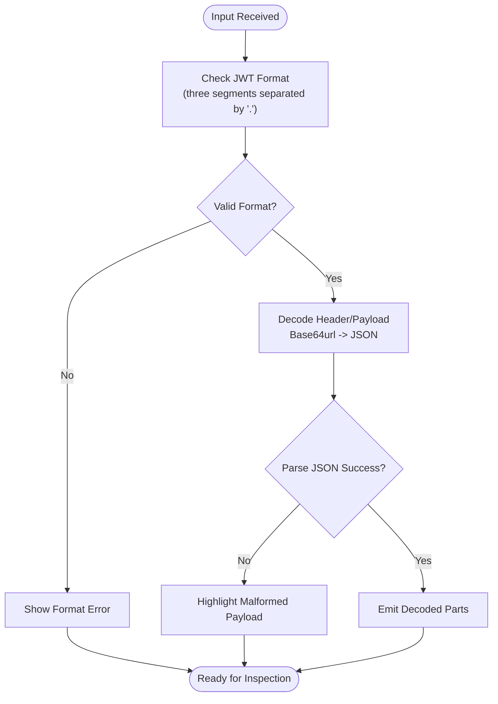
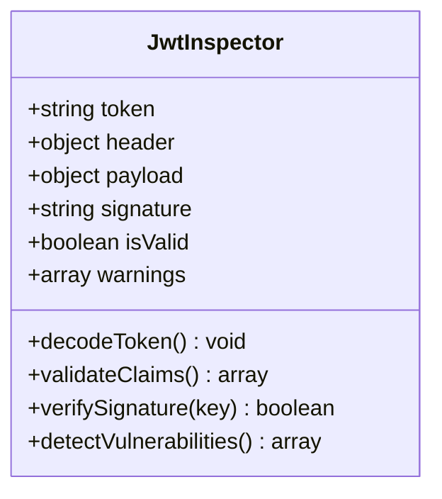
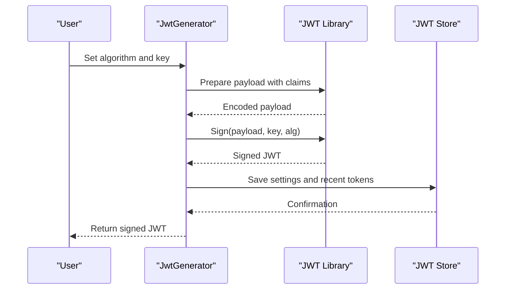
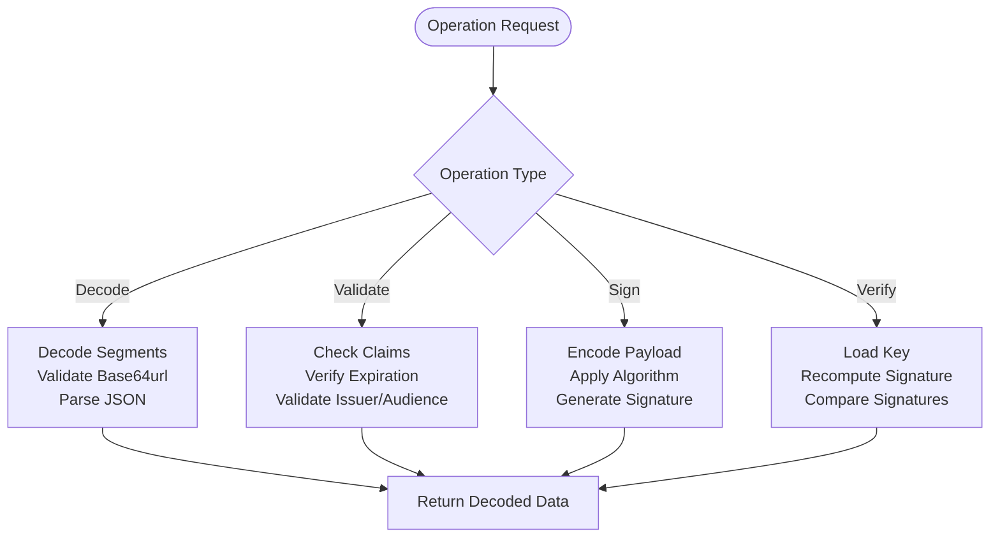
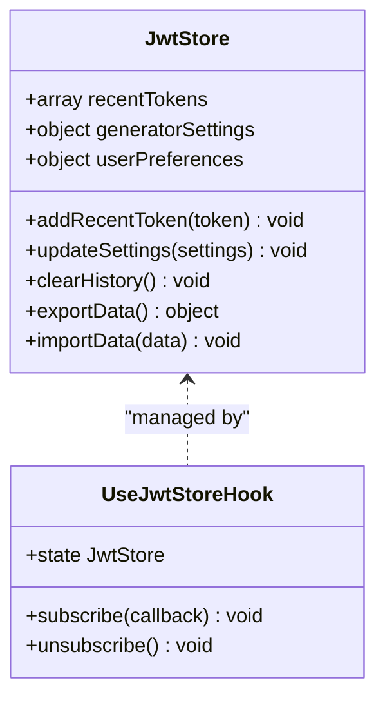
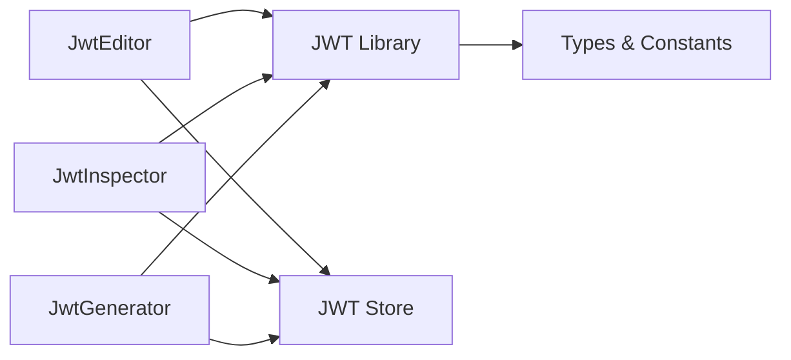

# JWT Tools - Token Manipulation & Analysis

<cite>
**Referenced Files in This Document**
- [jwt/index.tsx](file://src/pages/jwt/index.tsx)
- [jwt/constants.ts](file://src/pages/jwt/constants.ts)
- [jwt/types.ts](file://src/pages/jwt/types.ts)
- [jwt/lib/index.ts](file://src/pages/jwt/lib/index.ts)
- [jwt/components/JwtEditor.tsx](file://src/pages/jwt/components/JwtEditor.tsx)
- [jwt/components/JwtInspector.tsx](file://src/pages/jwt/components/JwtInspector.tsx)
- [jwt/components/JwtGenerator.tsx](file://src/pages/jwt/components/JwtGenerator.tsx)
- [jwt/hooks/useJwtStore.ts](file://src/pages/jwt/hooks/useJwtStore.ts)
- [stores/jwt-store.ts](file://src/stores/jwt-store.ts)
</cite>

## Table of Contents
1. [Introduction](#introduction)
2. [Project Structure](#project-structure)
3. [Core Components](#core-components)
4. [Architecture Overview](#architecture-overview)
5. [Detailed Component Analysis](#detailed-component-analysis)
6. [Dependency Analysis](#dependency-analysis)
7. [Performance Considerations](#performance-considerations)
8. [Troubleshooting Guide](#troubleshooting-guide)
9. [Conclusion](#conclusion)
10. [Appendices](#appendices)

## Introduction
This document provides comprehensive documentation for Apprecon’s JWT tools suite. It explains how to decode, validate, and generate JSON Web Tokens (JWTs), inspect headers and claims, verify signatures, and identify common vulnerabilities. It also covers advanced topics such as algorithm confusion attacks, key injection testing, and automated security assessments. The goal is to help both beginners and experienced users leverage the tool effectively while following best practices for secure handling of sensitive token data.

## Project Structure
The JWT tools are implemented as a dedicated page within the application, with clear separation between UI components, business logic, and state management:

- Page entry point and routing integration
- Constants and type definitions
- Core library for decoding, validation, and generation
- UI components for editing, inspecting, and generating tokens
- Hooks and stores for persistent state and cross-page synchronization

**Diagram sources**
- [jwt/index.tsx](file://src/pages/jwt/index.tsx)
- [jwt/lib/index.ts](file://src/pages/jwt/lib/index.ts)
- [jwt/components/JwtEditor.tsx](file://src/pages/jwt/components/JwtEditor.tsx)
- [jwt/components/JwtInspector.tsx](file://src/pages/jwt/components/JwtInspector.tsx)
- [jwt/components/JwtGenerator.tsx](file://src/pages/jwt/components/JwtGenerator.tsx)
- [jwt/hooks/useJwtStore.ts](file://src/pages/jwt/hooks/useJwtStore.ts)
- [stores/jwt-store.ts](file://src/stores/jwt-store.ts)

**Section sources**
- [jwt/index.tsx](file://src/pages/jwt/index.tsx)
- [jwt/constants.ts](file://src/pages/jwt/constants.ts)
- [jwt/types.ts](file://src/pages/jwt/types.ts)
- [jwt/lib/index.ts](file://src/pages/jwt/lib/index.ts)
- [jwt/components/JwtEditor.tsx](file://src/pages/jwt/components/JwtEditor.tsx)
- [jwt/components/JwtInspector.tsx](file://src/pages/jwt/components/JwtInspector.tsx)
- [jwt/components/JwtGenerator.tsx](file://src/pages/jwt/components/JwtGenerator.tsx)
- [jwt/hooks/useJwtStore.ts](file://src/pages/jwt/hooks/useJwtStore.ts)
- [stores/jwt-store.ts](file://src/stores/jwt-store.ts)

## Core Components
- JWT Editor: Allows pasting or typing raw JWTs, with syntax highlighting and quick actions (copy, clear).
- JWT Inspector: Decodes and displays header, payload, and signature; highlights potential issues and vulnerability patterns.
- JWT Generator: Creates custom JWTs with selectable algorithms and signing keys; supports exporting tokens for testing.
- Library: Implements decoding, validation, signature verification, and generation utilities.
- State Management: Persists user preferences, recent tokens, and generator settings across sessions.

Key responsibilities:
- Decode base64url segments safely and parse JSON payloads
- Validate standard claims (exp, nbf, iat, iss, aud, sub) and custom fields
- Verify signatures using provided keys or public certificates
- Detect common misconfigurations and attack vectors
- Generate tokens with various algorithms and key formats

**Section sources**
- [jwt/components/JwtEditor.tsx](file://src/pages/jwt/components/JwtEditor.tsx)
- [jwt/components/JwtInspector.tsx](file://src/pages/jwt/components/JwtInspector.tsx)
- [jwt/components/JwtGenerator.tsx](file://src/pages/jwt/components/JwtGenerator.tsx)
- [jwt/lib/index.ts](file://src/pages/jwt/lib/index.ts)
- [stores/jwt-store.ts](file://src/stores/jwt-store.ts)

## Architecture Overview
The JWT tools follow a modular architecture that separates concerns between UI, logic, and state. The page orchestrates interactions among components, delegates operations to the library, and persists state via hooks and stores.

**Diagram sources**
- [jwt/components/JwtEditor.tsx](file://src/pages/jwt/components/JwtEditor.tsx)
- [jwt/components/JwtInspector.tsx](file://src/pages/jwt/components/JwtInspector.tsx)
- [jwt/components/JwtGenerator.tsx](file://src/pages/jwt/components/JwtGenerator.tsx)
- [jwt/lib/index.ts](file://src/pages/jwt/lib/index.ts)
- [stores/jwt-store.ts](file://src/stores/jwt-store.ts)

## Detailed Component Analysis

### JWT Editor
- Purpose: Input and quick manipulation of raw JWT strings
- Features:
  - Paste detection and auto-decode
  - Copy-to-clipboard and clear actions
  - Basic format validation before passing to inspector
- Error Handling:
  - Invalid base64url segments flagged
  - Malformed JSON payloads highlighted

**Diagram sources**
- [jwt/components/JwtEditor.tsx](file://src/pages/jwt/components/JwtEditor.tsx)
- [jwt/lib/index.ts](file://src/pages/jwt/lib/index.ts)

**Section sources**
- [jwt/components/JwtEditor.tsx](file://src/pages/jwt/components/JwtEditor.tsx)

### JWT Inspector
- Purpose: Decode, validate, and analyze JWT structure and claims
- Features:
  - Display header, payload, and signature sections
  - Standard claim validation (exp, nbf, iat, iss, aud, sub)
  - Custom claim inspection and search
  - Signature verification with provided keys or certificates
  - Vulnerability detection patterns (e.g., none algorithm, weak keys)
- Output:
  - Visual indicators for valid/invalid/expired tokens
  - Warnings for risky configurations

**Diagram sources**
- [jwt/components/JwtInspector.tsx](file://src/pages/jwt/components/JwtInspector.tsx)
- [jwt/lib/index.ts](file://src/pages/jwt/lib/index.ts)

**Section sources**
- [jwt/components/JwtInspector.tsx](file://src/pages/jwt/components/JwtInspector.tsx)

### JWT Generator
- Purpose: Create custom JWTs for testing and analysis
- Features:
  - Selectable algorithms (HS256, RS256, ES256, etc.)
  - Support for symmetric and asymmetric keys
  - Custom claim population and expiration settings
  - Export signed tokens for immediate use
- Security:
  - Secure handling of private keys in memory
  - Option to avoid persisting sensitive keys

**Diagram sources**
- [jwt/components/JwtGenerator.tsx](file://src/pages/jwt/components/JwtGenerator.tsx)
- [jwt/lib/index.ts](file://src/pages/jwt/lib/index.ts)
- [stores/jwt-store.ts](file://src/stores/jwt-store.ts)

**Section sources**
- [jwt/components/JwtGenerator.tsx](file://src/pages/jwt/components/JwtGenerator.tsx)

### Library Implementation
- Responsibilities:
  - Base64url decoding and encoding
  - JSON parsing and validation
  - Algorithm-specific signing and verification
  - Claim validation rules and custom checks
  - Vulnerability pattern detection
- Algorithms Supported:
  - HMAC-based (HS256, HS384, HS512)
  - RSA-based (RS256, RS384, RS512)
  - ECDSA-based (ES256, ES384, ES512)
  - EdDSA (Ed25519)
- Key Formats:
  - PEM-encoded public/private keys
  - Raw hex/base64 secrets for symmetric algorithms
  - JWK support for standardized key representation

**Diagram sources**
- [jwt/lib/index.ts](file://src/pages/jwt/lib/index.ts)

**Section sources**
- [jwt/lib/index.ts](file://src/pages/jwt/lib/index.ts)

### State Management
- JWT Store:
  - Persists recent tokens and generator settings
  - Manages user preferences for algorithms and key formats
  - Provides reactive updates to UI components
- Hook Integration:
  - useJwtStore hook for component-level access
  - Automatic persistence and synchronization

**Diagram sources**
- [stores/jwt-store.ts](file://src/stores/jwt-store.ts)
- [jwt/hooks/useJwtStore.ts](file://src/pages/jwt/hooks/useJwtStore.ts)

**Section sources**
- [stores/jwt-store.ts](file://src/stores/jwt-store.ts)
- [jwt/hooks/useJwtStore.ts](file://src/pages/jwt/hooks/useJwtStore.ts)

## Dependency Analysis
The JWT tools have clear dependency boundaries:

- UI components depend on the library for core functionality
- Components interact through props and events
- State management is centralized and reactive
- No circular dependencies between modules

**Diagram sources**
- [jwt/components/JwtEditor.tsx](file://src/pages/jwt/components/JwtEditor.tsx)
- [jwt/components/JwtInspector.tsx](file://src/pages/jwt/components/JwtInspector.tsx)
- [jwt/components/JwtGenerator.tsx](file://src/pages/jwt/components/JwtGenerator.tsx)
- [jwt/lib/index.ts](file://src/pages/jwt/lib/index.ts)
- [stores/jwt-store.ts](file://src/stores/jwt-store.ts)

**Section sources**
- [jwt/constants.ts](file://src/pages/jwt/constants.ts)
- [jwt/types.ts](file://src/pages/jwt/types.ts)

## Performance Considerations
- Large JWTs: Implement streaming decoding for very large payloads
- Memory Management: Clear sensitive data from memory after use
- Async Operations: Use non-blocking operations for signature verification
- Caching: Cache validated tokens to avoid repeated processing
- UI Responsiveness: Debounce input changes in the editor

## Troubleshooting Guide
Common issues and solutions:

- **Invalid Token Format**: Ensure proper base64url encoding and three-segment structure
- **Algorithm Mismatch**: Verify the algorithm specified in the header matches the signing method
- **Expired Tokens**: Check expiration claims and adjust test scenarios accordingly
- **Key Issues**: Confirm correct key format and permissions for file-based keys
- **Signature Verification Failures**: Validate key alignment with algorithm and ensure proper encoding

**Section sources**
- [jwt/components/JwtInspector.tsx](file://src/pages/jwt/components/JwtInspector.tsx)
- [jwt/lib/index.ts](file://src/pages/jwt/lib/index.ts)

## Conclusion
Apprecon’s JWT tools provide a comprehensive suite for token manipulation, analysis, and security testing. The modular architecture ensures maintainability and extensibility, while the intuitive interface makes it accessible to users of all skill levels. By following the best practices outlined in this document, users can effectively analyze JWTs, identify vulnerabilities, and conduct thorough security assessments.

## Appendices

### JWT Security Testing Examples
- **Algorithm Confusion Attacks**: Test switching from RS256 to HS256 using the public key as HMAC secret
- **Key Injection Testing**: Attempt to inject malicious keys through parameter tampering
- **Automated Assessments**: Use the generator to create test cases for different vulnerability scenarios

### Best Practices for Sensitive Token Data
- Never log or store tokens in plain text
- Use secure storage mechanisms for private keys
- Implement proper cleanup procedures for sensitive data
- Follow least privilege principles when handling token data

### Advanced Features
- **Custom Claim Validation**: Define business-specific validation rules
- **Multi-Algorithm Support**: Test tokens across different cryptographic algorithms
- **Integration Testing**: Combine JWT testing with other security assessment workflows

[No sources needed since this section provides general guidance]