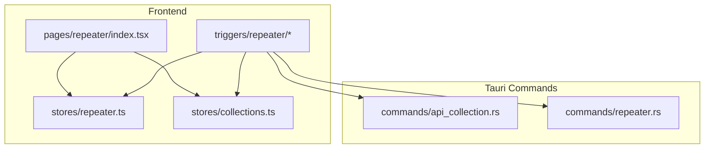
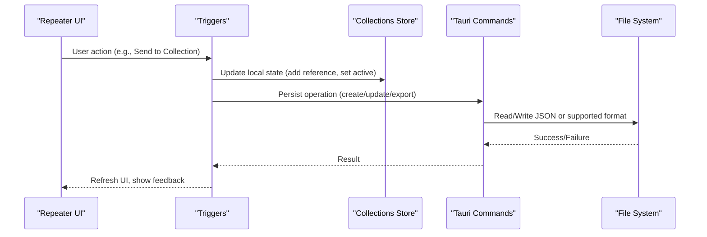
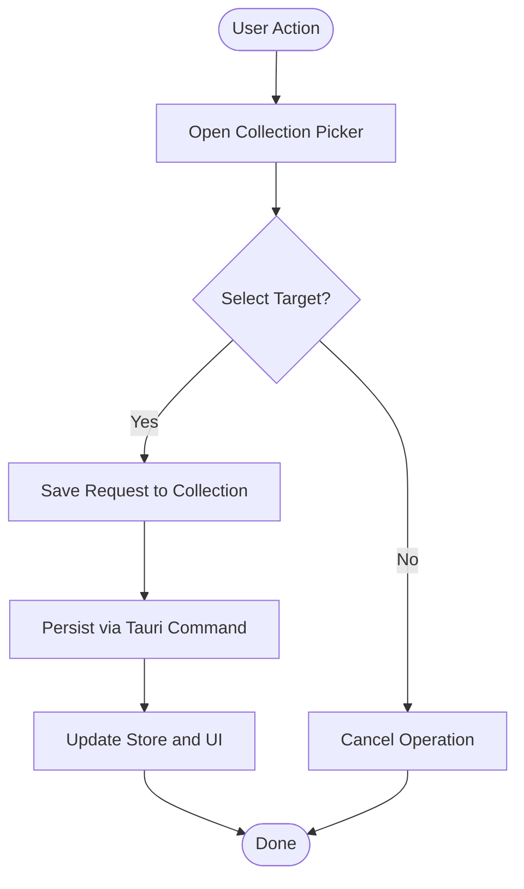
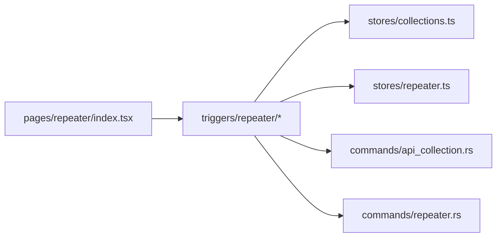

# Collection Management

<cite>
**Referenced Files in This Document**
- [collections.ts](file://src/stores/collections.ts)
- [repeater.ts](file://src/stores/repeater.ts)
- [api_collection.rs](file://src-tauri/src/commands/api_collection.rs)
- [repeater.rs](file://src-tauri/src/commands/repeater.rs)
- [index.tsx](file://src/pages/repeater/index.tsx)
- [types.ts](file://src/pages/repeater/types.ts)
- [constants.ts](file://src/pages/repeater/constants.ts)
- [collection-picker-submenu.tsx](file://src/triggers/repeater/collection-picker-submenu.tsx)
- [send-to-collection.ts](file://src/triggers/repeater/send-to-collection.ts)
- [use-collection-picker.ts](file://src/triggers/repeater/use-collection-picker.ts)
- [management.ts](file://src/triggers/repeater/management.ts)
- [craft.ts](file://src/triggers/repeater/craft.ts)
- [convert-to-craft.ts](file://src/triggers/repeater/convert-to-craft.ts)
</cite>

## Table of Contents
1. [Introduction](#introduction)
2. [Project Structure](#project-structure)
3. [Core Components](#core-components)
4. [Architecture Overview](#architecture-overview)
5. [Detailed Component Analysis](#detailed-component-analysis)
6. [Dependency Analysis](#dependency-analysis)
7. [Performance Considerations](#performance-considerations)
8. [Troubleshooting Guide](#troubleshooting-guide)
9. [Conclusion](#conclusion)
10. [Appendices](#appendices)

## Introduction
This document explains collection management in Apprecon’s Repeater. It covers how to organize HTTP requests into collections, build hierarchical folder structures, manage request metadata, import/export collections, share them across team members, integrate with version control, search and filter collections, perform bulk operations, and use templates. Practical examples demonstrate organizing API test suites, building reusable request libraries, and collaborating on shared collections.

## Project Structure
Collection management spans the frontend store, UI triggers, and Tauri commands:
- Frontend state and UI logic live under src/stores and src/triggers/repeater
- Page-level entry points and types are under src/pages/repeater
- Persistence and cross-process operations are handled by Tauri commands under src-tauri/src/commands

**Diagram sources**
- [index.tsx](file://src/pages/repeater/index.tsx)
- [repeater.ts](file://src/stores/repeater.ts)
- [collections.ts](file://src/stores/collections.ts)
- [api_collection.rs](file://src-tauri/src/commands/api_collection.rs)
- [repeater.rs](file://src-tauri/src/commands/repeater.rs)

**Section sources**
- [index.tsx](file://src/pages/repeater/index.tsx)
- [repeater.ts](file://src/stores/repeater.ts)
- [collections.ts](file://src/stores/collections.ts)
- [api_collection.rs](file://src-tauri/src/commands/api_collection.rs)
- [repeater.rs](file://src-tauri/src/commands/repeater.rs)

## Core Components
- Collections store: centralizes collection tree, folders, and request references; exposes actions for create/update/delete, move, rename, and export/import.
- Repeater store: manages active request editing, history, and sending; integrates with collections via send-to-collection flows.
- Tauri commands: persist collections to disk, handle file I/O for import/export, and coordinate with storage APIs.
- Triggers: provide UI interactions like “Send to Collection,” “Create from Request,” and collection picker selection.

Key responsibilities:
- Organize requests into nested folders
- Maintain request metadata (name, tags, notes, environment variables)
- Provide search/filtering over collections
- Support import/export formats compatible with common tools
- Enable sharing via exported files or version-controlled repositories

**Section sources**
- [collections.ts](file://src/stores/collections.ts)
- [repeater.ts](file://src/stores/repeater.ts)
- [api_collection.rs](file://src-tauri/src/commands/api_collection.rs)
- [repeater.rs](file://src-tauri/src/commands/repeater.rs)

## Architecture Overview
The Repeater uses a layered architecture:
- UI layer (pages and components) dispatches user actions
- Trigger layer wires UI events to store updates and command calls
- Store layer holds application state and orchestrates business logic
- Command layer persists data and performs system-level operations

**Diagram sources**
- [collection-picker-submenu.tsx](file://src/triggers/repeater/collection-picker-submenu.tsx)
- [send-to-collection.ts](file://src/triggers/repeater/send-to-collection.ts)
- [use-collection-picker.ts](file://src/triggers/repeater/use-collection-picker.ts)
- [management.ts](file://src/triggers/repeater/management.ts)
- [api_collection.rs](file://src-tauri/src/commands/api_collection.rs)
- [repeater.rs](file://src-tauri/src/commands/repeater.rs)

## Detailed Component Analysis

### Collections Store
Responsibilities:
- Maintain a hierarchical tree of folders and requests
- Track selected items and active context
- Expose methods for CRUD, moving, renaming, exporting, importing
- Manage metadata such as tags, descriptions, and environment variable bindings

Data model highlights:
- Folder nodes with children arrays
- Request nodes referencing stored request definitions
- Metadata fields for organization and collaboration

Operations:
- Create folder/request, update properties, delete
- Move between folders (drag-and-drop or menu actions)
- Export entire collection or subset to file
- Import from external formats and merge strategies

Search and filtering:
- Full-text search across names and metadata
- Filter by tags, method, path, folder scope

Bulk operations:
- Select multiple items to move, tag, or delete
- Batch export/import for subsets

Templates:
- Predefined request templates for common patterns (auth, CRUD, pagination)
- One-click creation from template with default headers and payloads

**Section sources**
- [collections.ts](file://src/stores/collections.ts)
- [types.ts](file://src/pages/repeater/types.ts)
- [constants.ts](file://src/pages/repeater/constants.ts)

### Repeater Store
Responsibilities:
- Manage current request editing state
- Keep request history and execution results
- Integrate with collections via send-to-collection workflows

Integration points:
- On save, optionally add to or update a collection item
- On send, support selecting target collection and folder

**Section sources**
- [repeater.ts](file://src/stores/repeater.ts)

### Tauri Commands
- api_collection.rs: handles persistence of collections, import/export, and file operations
- repeater.rs: supports repeater-specific operations that may interact with collections

These commands ensure reliable disk writes, error handling, and compatibility with platform file systems.

**Section sources**
- [api_collection.rs](file://src-tauri/src/commands/api_collection.rs)
- [repeater.rs](file://src-tauri/src/commands/repeater.rs)

### Triggers and UI Interactions
- collection-picker-submenu.tsx: provides a submenu to pick a destination collection/folder
- send-to-collection.ts: implements “Send to Collection” flow from the Repeater
- use-collection-picker.ts: composable hook for collection picker behavior
- management.ts: higher-level management actions (create, update, move, delete)
- craft.ts and convert-to-craft.ts: transform requests into reusable “craft” entries for collections

**Diagram sources**
- [collection-picker-submenu.tsx](file://src/triggers/repeater/collection-picker-submenu.tsx)
- [send-to-collection.ts](file://src/triggers/repeater/send-to-collection.ts)
- [use-collection-picker.ts](file://src/triggers/repeater/use-collection-picker.ts)
- [management.ts](file://src/triggers/repeater/management.ts)
- [craft.ts](file://src/triggers/repeater/craft.ts)
- [convert-to-craft.ts](file://src/triggers/repeater/convert-to-craft.ts)

**Section sources**
- [collection-picker-submenu.tsx](file://src/triggers/repeater/collection-picker-submenu.tsx)
- [send-to-collection.ts](file://src/triggers/repeater/send-to-collection.ts)
- [use-collection-picker.ts](file://src/triggers/repeater/use-collection-picker.ts)
- [management.ts](file://src/triggers/repeater/management.ts)
- [craft.ts](file://src/triggers/repeater/craft.ts)
- [convert-to-craft.ts](file://src/triggers/repeater/convert-to-craft.ts)

## Dependency Analysis
- UI components depend on trigger modules for event wiring
- Triggers call store methods and Tauri commands
- Stores encapsulate business logic and state transitions
- Commands abstract file system and persistence details

**Diagram sources**
- [index.tsx](file://src/pages/repeater/index.tsx)
- [collection-picker-submenu.tsx](file://src/triggers/repeater/collection-picker-submenu.tsx)
- [send-to-collection.ts](file://src/triggers/repeater/send-to-collection.ts)
- [use-collection-picker.ts](file://src/triggers/repeater/use-collection-picker.ts)
- [management.ts](file://src/triggers/repeater/management.ts)
- [craft.ts](file://src/triggers/repeater/craft.ts)
- [convert-to-craft.ts](file://src/triggers/repeater/convert-to-craft.ts)
- [collections.ts](file://src/stores/collections.ts)
- [repeater.ts](file://src/stores/repeater.ts)
- [api_collection.rs](file://src-tauri/src/commands/api_collection.rs)
- [repeater.rs](file://src-tauri/src/commands/repeater.rs)

**Section sources**
- [index.tsx](file://src/pages/repeater/index.tsx)
- [collections.ts](file://src/stores/collections.ts)
- [repeater.ts](file://src/stores/repeater.ts)
- [api_collection.rs](file://src-tauri/src/commands/api_collection.rs)
- [repeater.rs](file://src-tauri/src/commands/repeater.rs)

## Performance Considerations
- Debounce search input to avoid excessive filtering recalculations
- Lazy-load large collections and paginate results when necessary
- Use efficient tree traversal algorithms for folder navigation and bulk operations
- Minimize redundant writes by batching updates before persisting
- Cache frequently accessed metadata to reduce re-renders

[No sources needed since this section provides general guidance]

## Troubleshooting Guide
Common issues and resolutions:
- Import failures: verify file format compatibility and encoding; check command logs for parse errors
- Permission errors: ensure write access to the target directory; confirm file locks are released
- Sync conflicts: resolve naming collisions during merge; prefer deterministic conflict resolution rules
- Search not finding items: confirm indexing is up to date; clear and rebuild index if needed
- Bulk operations slow: break into smaller batches; monitor memory usage and consider virtualization

**Section sources**
- [api_collection.rs](file://src-tauri/src/commands/api_collection.rs)
- [repeater.rs](file://src-tauri/src/commands/repeater.rs)

## Conclusion
Apprecon’s Repeater provides robust collection management for organizing HTTP requests into hierarchical structures, managing metadata, and supporting import/export, sharing, and version control workflows. The layered architecture ensures clear separation of concerns, while triggers and stores enable rich user interactions. By following best practices for organization and collaboration, teams can build scalable, reusable request libraries and maintain consistent testing suites.

[No sources needed since this section summarizes without analyzing specific files]

## Appendices

### Organizing API Test Suites
- Group endpoints by domain or feature area using top-level folders
- Subdivide by HTTP method or resource type within each folder
- Tag requests with environment labels (dev, staging, prod) and status (draft, stable, deprecated)
- Use templates for standard patterns (authentication, pagination, error cases)

### Creating Reusable Request Libraries
- Extract common parameters and headers into shared variables
- Build parameterized requests with placeholders for dynamic values
- Version requests and maintain changelogs in notes
- Share via exported files or repository commits

### Collaborating on Shared Collections
- Export collections to a shared location (network drive, cloud storage)
- Use version control to track changes and review diffs
- Establish naming conventions and tagging standards
- Set up automated checks for consistency and completeness

### Searching and Filtering
- Use full-text search to locate requests by name, path, or metadata
- Filter by method, folder, tags, or environment
- Combine filters for precise results
- Save frequent searches as quick access shortcuts

### Bulk Operations
- Select multiple requests to move, tag, or delete
- Apply batch updates to headers, body, or variables
- Export subsets for targeted testing or sharing

### Templates
- Create templates for common scenarios (login, CRUD, file upload)
- Include default headers, authentication, and validation steps
- Customize per project while maintaining baseline structure

[No sources needed since this section provides general guidance]