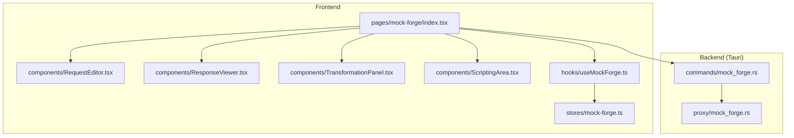
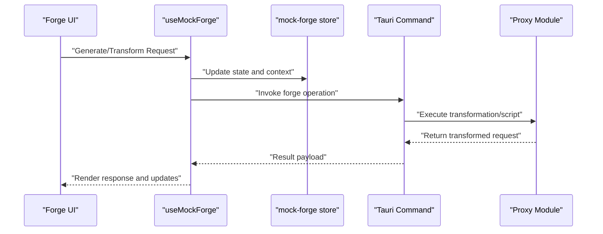
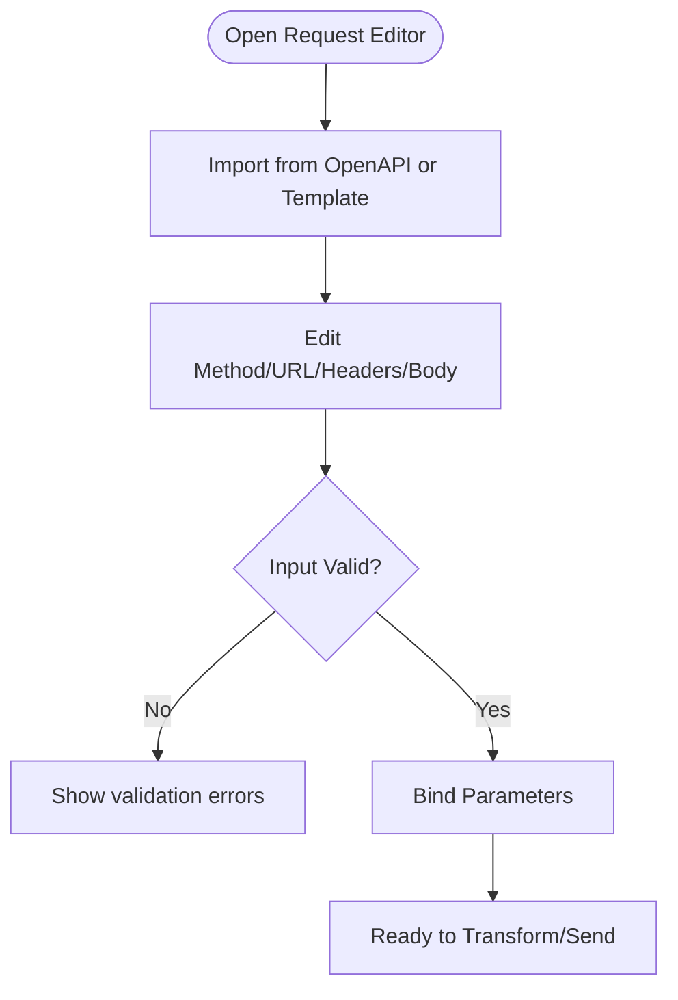
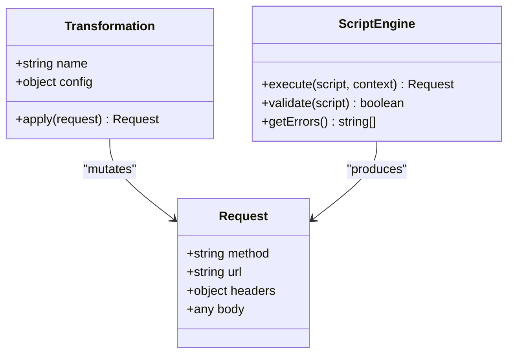
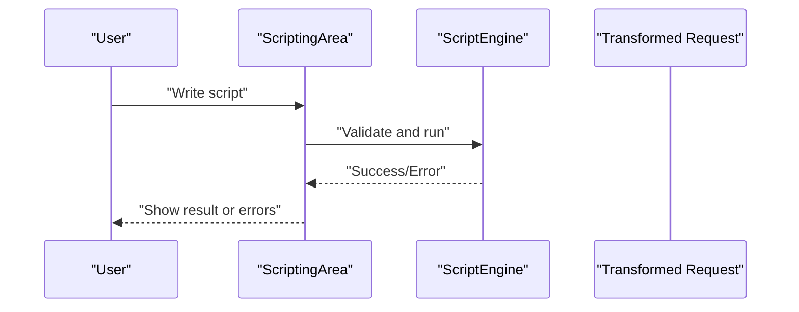
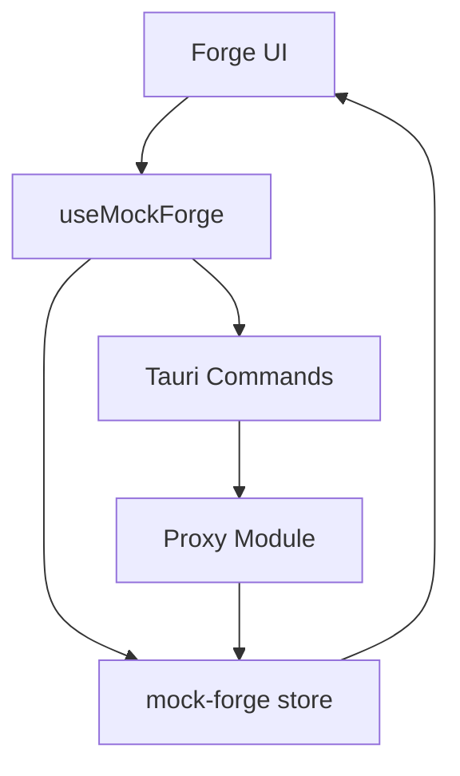
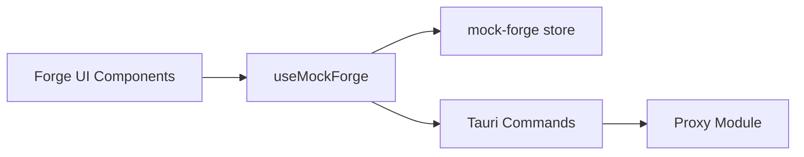

# Forge Panel & Dynamic Generation

<cite>
**Referenced Files in This Document**
- [mock-forge/index.tsx](file://src/pages/mock-forge/index.tsx)
- [mock-forge/types.ts](file://src/pages/mock-forge/types.ts)
- [mock-forge/constants.ts](file://src/pages/mock-forge/constants.ts)
- [mock-forge/hooks/useMockForge.ts](file://src/pages/mock-forge/hooks/useMockForge.ts)
- [mock-forge/components/RequestEditor.tsx](file://src/pages/mock-forge/components/RequestEditor.tsx)
- [mock-forge/components/ResponseViewer.tsx](file://src/pages/mock-forge/components/ResponseViewer.tsx)
- [mock-forge/components/TransformationPanel.tsx](file://src/pages/mock-forge/components/TransformationPanel.tsx)
- [mock-forge/components/ScriptingArea.tsx](file://src/pages/mock-forge/components/ScriptingArea.tsx)
- [stores/mock-forge.ts](file://src/stores/mock-forge.ts)
- [commands/mock_forge.rs](file://src-tauri/src/commands/mock_forge.rs)
- [proxy/mock_forge.rs](file://src-tauri/src/proxy/mock_forge.rs)
- [types/index.ts](file://src/types/index.ts)
</cite>

## Table of Contents
1. [Introduction](#introduction)
2. [Project Structure](#project-structure)
3. [Core Components](#core-components)
4. [Architecture Overview](#architecture-overview)
5. [Detailed Component Analysis](#detailed-component-analysis)
6. [Dependency Analysis](#dependency-analysis)
7. [Performance Considerations](#performance-considerations)
8. [Troubleshooting Guide](#troubleshooting-guide)
9. [Conclusion](#conclusion)
10. [Appendices](#appendices)

## Introduction
This document explains the Forge Panel feature that enables dynamic request generation and manipulation. It covers how to use the forge interface to generate requests from APIs, transform existing requests, and apply automated modifications. It also documents the forge command syntax, built-in transformations, and custom scripting capabilities. Practical examples include generating CRUD operations from OpenAPI specs, automating request variations, and creating parameterized test scenarios. Finally, it provides performance optimization guidance for large-scale request generation and debugging techniques for forge scripts.

## Project Structure
The Forge Panel is implemented as a dedicated page with supporting hooks, components, stores, and backend commands:
- Frontend page and UI components under src/pages/mock-forge
- State management via src/stores/mock-forge.ts
- Backend Tauri commands and proxy integration under src-tauri

**Diagram sources**
- [mock-forge/index.tsx](file://src/pages/mock-forge/index.tsx)
- [mock-forge/components/RequestEditor.tsx](file://src/pages/mock-forge/components/RequestEditor.tsx)
- [mock-forge/components/ResponseViewer.tsx](file://src/pages/mock-forge/components/ResponseViewer.tsx)
- [mock-forge/components/TransformationPanel.tsx](file://src/pages/mock-forge/components/TransformationPanel.tsx)
- [mock-forge/components/ScriptingArea.tsx](file://src/pages/mock-forge/components/ScriptingArea.tsx)
- [mock-forge/hooks/useMockForge.ts](file://src/pages/mock-forge/hooks/useMockForge.ts)
- [stores/mock-forge.ts](file://src/stores/mock-forge.ts)
- [commands/mock_forge.rs](file://src-tauri/src/commands/mock_forge.rs)
- [proxy/mock_forge.rs](file://src-tauri/src/proxy/mock_forge.rs)

**Section sources**
- [mock-forge/index.tsx](file://src/pages/mock-forge/index.tsx)
- [mock-forge/types.ts](file://src/pages/mock-forge/types.ts)
- [mock-forge/constants.ts](file://src/pages/mock-forge/constants.ts)
- [mock-forge/hooks/useMockForge.ts](file://src/pages/mock-forge/hooks/useMockForge.ts)
- [stores/mock-forge.ts](file://src/stores/mock-forge.ts)
- [commands/mock_forge.rs](file://src-tauri/src/commands/mock_forge.rs)
- [proxy/mock_forge.rs](file://src-tauri/src/proxy/mock_forge.rs)

## Core Components
- Request Editor: Compose or import requests; supports editing method, URL, headers, and body.
- Transformation Panel: Apply built-in transformations and custom scripts to modify requests before sending.
- Scripting Area: Write and execute JavaScript-like scripts to programmatically generate or mutate requests.
- Response Viewer: Inspect responses generated by the target server or mock pipeline.
- Hook and Store: Centralize state and orchestrate calls to backend commands.

Key responsibilities:
- Generate requests from templates or OpenAPI specifications
- Transform payloads, headers, and parameters
- Execute custom scripts for advanced logic
- Persist and manage collections of generated requests

**Section sources**
- [mock-forge/components/RequestEditor.tsx](file://src/pages/mock-forge/components/RequestEditor.tsx)
- [mock-forge/components/TransformationPanel.tsx](file://src/pages/mock-forge/components/TransformationPanel.tsx)
- [mock-forge/components/ScriptingArea.tsx](file://src/pages/mock-forge/components/ScriptingArea.tsx)
- [mock-forge/components/ResponseViewer.tsx](file://src/pages/mock-forge/components/ResponseViewer.tsx)
- [mock-forge/hooks/useMockForge.ts](file://src/pages/mock-forge/hooks/useMockForge.ts)
- [stores/mock-forge.ts](file://src/stores/mock-forge.ts)

## Architecture Overview
The Forge Panel integrates frontend UI with backend commands to perform request generation and transformation. The flow typically involves composing a base request, applying transformations/scripts, invoking backend commands, and rendering results.

**Diagram sources**
- [mock-forge/hooks/useMockForge.ts](file://src/pages/mock-forge/hooks/useMockForge.ts)
- [stores/mock-forge.ts](file://src/stores/mock-forge.ts)
- [commands/mock_forge.rs](file://src-tauri/src/commands/mock_forge.rs)
- [proxy/mock_forge.rs](file://src-tauri/src/proxy/mock_forge.rs)

## Detailed Component Analysis

### Request Editor
- Purpose: Create or import HTTP requests; edit method, path, query, headers, and body.
- Features:
  - Import from OpenAPI spec to scaffold endpoints
  - Parameter binding for dynamic values
  - Validation hints and formatting helpers
- Data model:
  - Method, URL template, headers map, body schema
  - Parameters and environment variables

**Section sources**
- [mock-forge/components/RequestEditor.tsx](file://src/pages/mock-forge/components/RequestEditor.tsx)
- [mock-forge/types.ts](file://src/pages/mock-forge/types.ts)

### Transformation Panel
- Purpose: Apply built-in transformations and custom scripts to requests.
- Built-in transformations:
  - Header injection/removal
  - Query parameter mutation
  - Body field mapping and masking
  - Path templating and variable substitution
- Custom scripting:
  - JavaScript-like execution context
  - Access to request object and utilities
  - Error handling and logging

**Diagram sources**
- [mock-forge/components/TransformationPanel.tsx](file://src/pages/mock-forge/components/TransformationPanel.tsx)
- [mock-forge/components/ScriptingArea.tsx](file://src/pages/mock-forge/components/ScriptingArea.tsx)
- [mock-forge/types.ts](file://src/pages/mock-forge/types.ts)

**Section sources**
- [mock-forge/components/TransformationPanel.tsx](file://src/pages/mock-forge/components/TransformationPanel.tsx)
- [mock-forge/components/ScriptingArea.tsx](file://src/pages/mock-forge/components/ScriptingArea.tsx)
- [mock-forge/types.ts](file://src/pages/mock-forge/types.ts)

### Scripting Area
- Purpose: Provide an editor and runtime for custom scripts that generate or manipulate requests.
- Capabilities:
  - Syntax highlighting and basic linting
  - Execution sandbox with limited globals
  - Context access to current request and environment
  - Error reporting and stack traces

**Diagram sources**
- [mock-forge/components/ScriptingArea.tsx](file://src/pages/mock-forge/components/ScriptingArea.tsx)
- [mock-forge/types.ts](file://src/pages/mock-forge/types.ts)

**Section sources**
- [mock-forge/components/ScriptingArea.tsx](file://src/pages/mock-forge/components/ScriptingArea.tsx)
- [mock-forge/types.ts](file://src/pages/mock-forge/types.ts)

### Response Viewer
- Purpose: Display responses from generated requests, including status, headers, and body.
- Features:
  - Pretty-print JSON/XML
  - Copy/export functionality
  - Error message highlighting

**Section sources**
- [mock-forge/components/ResponseViewer.tsx](file://src/pages/mock-forge/components/ResponseViewer.tsx)

### Hook and Store Integration
- useMockForge orchestrates interactions between UI and backend commands.
- mock-forge store manages state such as current request, transformations, scripts, and results.

**Diagram sources**
- [mock-forge/hooks/useMockForge.ts](file://src/pages/mock-forge/hooks/useMockForge.ts)
- [stores/mock-forge.ts](file://src/stores/mock-forge.ts)
- [commands/mock_forge.rs](file://src-tauri/src/commands/mock_forge.rs)
- [proxy/mock_forge.rs](file://src-tauri/src/proxy/mock_forge.rs)

**Section sources**
- [mock-forge/hooks/useMockForge.ts](file://src/pages/mock-forge/hooks/useMockForge.ts)
- [stores/mock-forge.ts](file://src/stores/mock-forge.ts)

## Dependency Analysis
- Frontend dependencies:
  - React components for UI
  - Hooks for orchestration
  - Store for state persistence
- Backend dependencies:
  - Tauri commands exposed to frontend
  - Proxy module for request processing and transformation

**Diagram sources**
- [mock-forge/index.tsx](file://src/pages/mock-forge/index.tsx)
- [mock-forge/hooks/useMockForge.ts](file://src/pages/mock-forge/hooks/useMockForge.ts)
- [stores/mock-forge.ts](file://src/stores/mock-forge.ts)
- [commands/mock_forge.rs](file://src-tauri/src/commands/mock_forge.rs)
- [proxy/mock_forge.rs](file://src-tauri/src/proxy/mock_forge.rs)

**Section sources**
- [mock-forge/index.tsx](file://src/pages/mock-forge/index.tsx)
- [mock-forge/hooks/useMockForge.ts](file://src/pages/mock-forge/hooks/useMockForge.ts)
- [stores/mock-forge.ts](file://src/stores/mock-forge.ts)
- [commands/mock_forge.rs](file://src-tauri/src/commands/mock_forge.rs)
- [proxy/mock_forge.rs](file://src-tauri/src/proxy/mock_forge.rs)

## Performance Considerations
- Batch operations:
  - Group multiple transformations into a single script to reduce round-trips
  - Use bulk imports for OpenAPI specs to avoid repeated parsing
- Caching:
  - Cache parsed OpenAPI schemas and resolved templates
  - Memoize expensive computations in scripts
- Memory management:
  - Avoid holding large payloads in memory; stream when possible
  - Clear intermediate artifacts after execution
- Concurrency:
  - Limit concurrent script executions to prevent UI freezes
  - Defer heavy tasks to background workers if available
- Profiling:
  - Measure script execution time and identify bottlenecks
  - Optimize hot paths in transformation logic

[No sources needed since this section provides general guidance]

## Troubleshooting Guide
Common issues and resolutions:
- Script errors:
  - Check syntax and runtime exceptions in the Scripting Area
  - Use logging statements to trace variable states
- Transformation failures:
  - Validate input schemas and ensure required fields exist
  - Inspect error messages returned by backend commands
- Performance problems:
  - Profile scripts and reduce unnecessary operations
  - Increase batch sizes where appropriate
- State inconsistencies:
  - Reset store state and re-import templates
  - Verify environment variables and parameter bindings

**Section sources**
- [mock-forge/components/ScriptingArea.tsx](file://src/pages/mock-forge/components/ScriptingArea.tsx)
- [mock-forge/components/TransformationPanel.tsx](file://src/pages/mock-forge/components/TransformationPanel.tsx)
- [stores/mock-forge.ts](file://src/stores/mock-forge.ts)
- [commands/mock_forge.rs](file://src-tauri/src/commands/mock_forge.rs)

## Conclusion
The Forge Panel provides a powerful interface for dynamic request generation and manipulation. By combining built-in transformations with custom scripting, users can automate API testing, create parameterized scenarios, and streamline development workflows. Following the performance and debugging recommendations ensures reliable and efficient usage at scale.

[No sources needed since this section summarizes without analyzing specific files]

## Appendices

### Forge Command Syntax
- Base command:
  - forge <operation> [options]
- Operations:
  - generate: Create requests from templates or OpenAPI specs
  - transform: Apply transformations to existing requests
  - script: Execute custom scripts to generate or mutate requests
- Options:
  - --input <path>: Source file or spec path
  - --output <path>: Destination file or collection
  - --env <key=value>: Environment variables
  - --dry-run: Preview changes without executing

[No sources needed since this section provides general guidance]

### Examples

#### Generate CRUD Operations from OpenAPI Specs
- Steps:
  - Import OpenAPI specification
  - Select endpoints to scaffold
  - Map parameters and bodies to templates
  - Export generated requests to a collection

[No sources needed since this section provides general guidance]

#### Automate Request Variations
- Steps:
  - Define base request
  - Add transformations for headers, query, and body
  - Use loops and conditionals in scripts to vary inputs
  - Run and collect results

[No sources needed since this section provides general guidance]

#### Create Parameterized Test Scenarios
- Steps:
  - Define parameters and data sets
  - Bind parameters to request fields
  - Iterate over data sets using scripts
  - Validate responses and log outcomes

[No sources needed since this section provides general guidance]