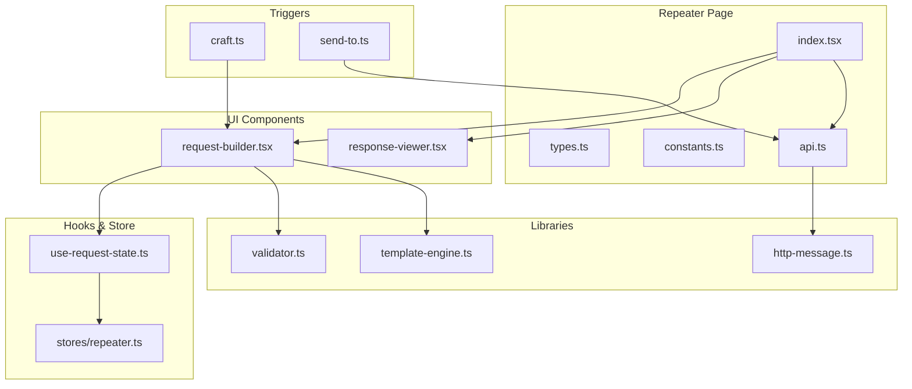
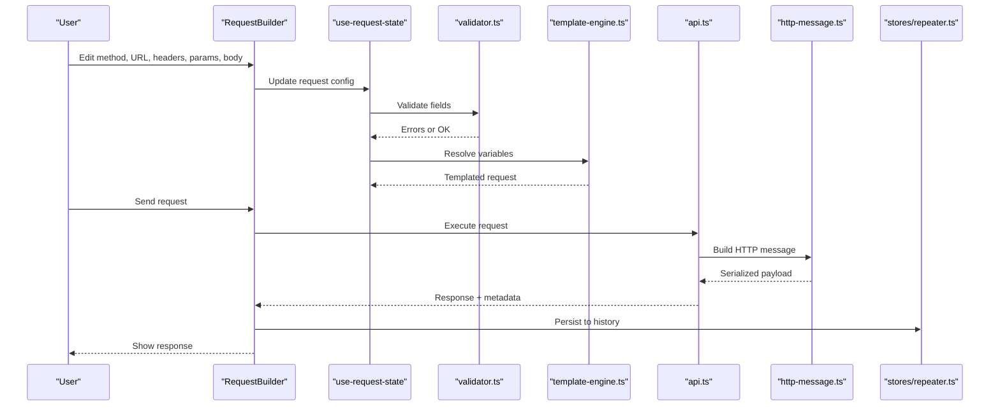
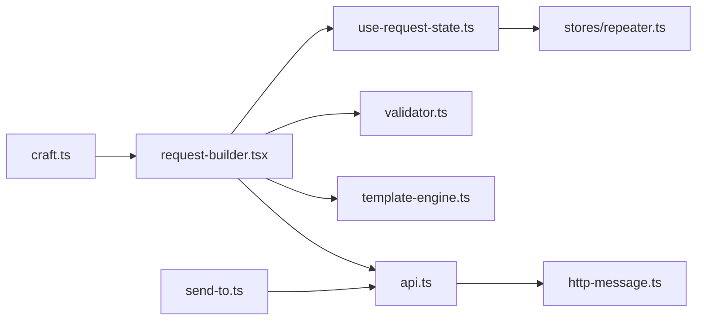
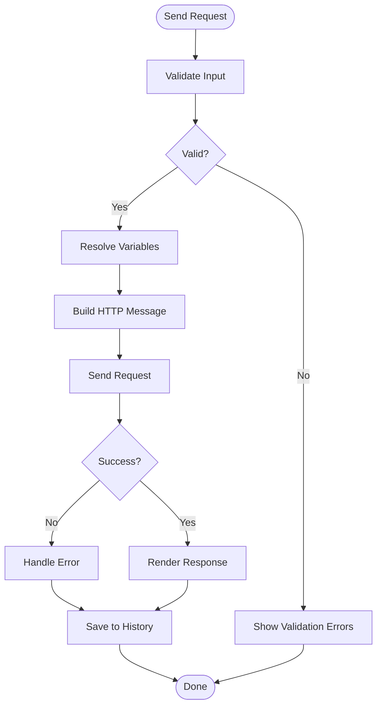

# HTTP Request Builder

<cite>
**Referenced Files in This Document**
- [repeater/index.tsx](file://src/pages/repeater/index.tsx)
- [repeater/types.ts](file://src/pages/repeater/types.ts)
- [repeater/constants.ts](file://src/pages/repeater/constants.ts)
- [repeater/api.ts](file://src/pages/repeater/api.ts)
- [repeater/components/request-builder.tsx](file://src/pages/repeater/components/request-builder.tsx)
- [repeater/components/response-viewer.tsx](file://src/pages/repeater/components/response-viewer.tsx)
- [repeater/hooks/use-request-state.ts](file://src/pages/repeater/hooks/use-request-state.ts)
- [repeater/lib/validator.ts](file://src/pages/repeater/lib/validator.ts)
- [repeater/lib/template-engine.ts](file://src/pages/repeater/lib/template-engine.ts)
- [stores/repeater.ts](file://src/stores/repeater.ts)
- [lib/http-message.ts](file://src/lib/http-message.ts)
- [components/ui/select-env-input.tsx](file://src/components/ui/select-env-input.tsx)
- [triggers/repeater/craft.ts](file://src/triggers/repeater/craft.ts)
- [triggers/repeater/send-to.ts](file://src/triggers/repeater/send-to.ts)
</cite>

## Table of Contents
1. [Introduction](#introduction)
2. [Project Structure](#project-structure)
3. [Core Components](#core-components)
4. [Architecture Overview](#architecture-overview)
5. [Detailed Component Analysis](#detailed-component-analysis)
6. [Dependency Analysis](#dependency-analysis)
7. [Performance Considerations](#performance-considerations)
8. [Troubleshooting Guide](#troubleshooting-guide)
9. [Conclusion](#conclusion)

## Introduction
This document explains the HTTP Request Builder component within Apprecon’s Repeater. It covers how to construct requests with different methods (GET, POST, PUT, DELETE), customize headers and query parameters, set request bodies (JSON, form data, files), manage authentication headers, and use templating variables for environment-specific configurations. It also documents parameter validation, request history management, and request chaining patterns.

## Project Structure
The Repeater feature is organized into a page module, UI components, hooks, utilities, and stores:
- Page entry and routing integration
- Request builder UI and response viewer
- State management hooks and store slices
- Validation and template engine for variables
- API layer for sending requests and managing collections/history
- Triggers for automation and send-to workflows

**Diagram sources**
- [repeater/index.tsx](file://src/pages/repeater/index.tsx)
- [repeater/components/request-builder.tsx](file://src/pages/repeater/components/request-builder.tsx)
- [repeater/components/response-viewer.tsx](file://src/pages/repeater/components/response-viewer.tsx)
- [repeater/hooks/use-request-state.ts](file://src/pages/repeater/hooks/use-request-state.ts)
- [stores/repeater.ts](file://src/stores/repeater.ts)
- [repeater/lib/validator.ts](file://src/pages/repeater/lib/validator.ts)
- [repeater/lib/template-engine.ts](file://src/pages/repeater/lib/template-engine.ts)
- [lib/http-message.ts](file://src/lib/http-message.ts)
- [repeater/api.ts](file://src/pages/repeater/api.ts)
- [triggers/repeater/craft.ts](file://src/triggers/repeater/craft.ts)
- [triggers/repeater/send-to.ts](file://src/triggers/repeater/send-to.ts)

**Section sources**
- [repeater/index.tsx](file://src/pages/repeater/index.tsx)
- [repeater/types.ts](file://src/pages/repeater/types.ts)
- [repeater/constants.ts](file://src/pages/repeater/constants.ts)
- [repeater/api.ts](file://src/pages/repeater/api.ts)
- [repeater/components/request-builder.tsx](file://src/pages/repeater/components/request-builder.tsx)
- [repeater/components/response-viewer.tsx](file://src/pages/repeater/components/response-viewer.tsx)
- [repeater/hooks/use-request-state.ts](file://src/pages/repeater/hooks/use-request-state.ts)
- [stores/repeater.ts](file://src/stores/repeater.ts)
- [repeater/lib/validator.ts](file://src/pages/repeater/lib/validator.ts)
- [repeater/lib/template-engine.ts](file://src/pages/repeater/lib/template-engine.ts)
- [lib/http-message.ts](file://src/lib/http-message.ts)
- [triggers/repeater/craft.ts](file://src/triggers/repeater/craft.ts)
- [triggers/repeater/send-to.ts](file://src/triggers/repeater/send-to.ts)

## Core Components
- Request Builder UI: Provides fields for method selection, URL input, headers editor, query parameters table, and body editor supporting JSON, form-data, and file uploads.
- Response Viewer: Displays status, headers, and body with syntax highlighting and tabs for different formats.
- State Hook: Manages request configuration, validation errors, and execution state.
- Validator: Enforces required fields, URL format, header key/value rules, and body constraints based on content type.
- Template Engine: Resolves variables from environment and context before sending.
- API Layer: Sends requests via Tauri commands or fetch wrappers and handles responses and history.

Key responsibilities:
- Method and URL construction
- Header and parameter editing
- Body serialization and file handling
- Variable templating and environment selection
- Validation feedback and error display
- History persistence and retrieval

**Section sources**
- [repeater/components/request-builder.tsx](file://src/pages/repeater/components/request-builder.tsx)
- [repeater/components/response-viewer.tsx](file://src/pages/repeater/components/response-viewer.tsx)
- [repeater/hooks/use-request-state.ts](file://src/pages/repeater/hooks/use-request-state.ts)
- [repeater/lib/validator.ts](file://src/pages/repeater/lib/validator.ts)
- [repeater/lib/template-engine.ts](file://src/pages/repeater/lib/template-engine.ts)
- [repeater/api.ts](file://src/pages/repeater/api.ts)

## Architecture Overview
The Request Builder orchestrates user inputs through validation and templating, then sends requests via an API layer. Responses are rendered by the Response Viewer and persisted to history. Environment variables and templates enable dynamic configuration across environments.

**Diagram sources**
- [repeater/components/request-builder.tsx](file://src/pages/repeater/components/request-builder.tsx)
- [repeater/hooks/use-request-state.ts](file://src/pages/repeater/hooks/use-request-state.ts)
- [repeater/lib/validator.ts](file://src/pages/repeater/lib/validator.ts)
- [repeater/lib/template-engine.ts](file://src/pages/repeater/lib/template-engine.ts)
- [repeater/api.ts](file://src/pages/repeater/api.ts)
- [lib/http-message.ts](file://src/lib/http-message.ts)
- [stores/repeater.ts](file://src/stores/repeater.ts)

## Detailed Component Analysis

### Request Builder UI
- Method selector supports GET, POST, PUT, DELETE, PATCH, HEAD, OPTIONS.
- URL field supports full URLs and relative paths resolved against base URL.
- Headers editor allows key-value pairs with duplicate support when needed.
- Query parameters table supports adding/removing entries and encoding.
- Body editor supports:
  - JSON: validated and formatted
  - Form data: key-value pairs
  - File upload: single/multiple file selection with content-type auto-set
- Authentication helpers include common headers like Authorization, Cookie, and custom tokens.

Validation and UX:
- Required fields highlighted with inline errors
- Content-type influences body schema validation
- Real-time variable preview using template engine

**Section sources**
- [repeater/components/request-builder.tsx](file://src/pages/repeater/components/request-builder.tsx)
- [repeater/lib/validator.ts](file://src/pages/repeater/lib/validator.ts)
- [repeater/lib/template-engine.ts](file://src/pages/repeater/lib/template-engine.ts)

### Response Viewer
- Displays status code, reason phrase, and response headers
- Body rendering with tabs for JSON, text, and binary previews
- Copy-to-clipboard and export options
- Timing and size metrics

**Section sources**
- [repeater/components/response-viewer.tsx](file://src/pages/repeater/components/response-viewer.tsx)

### State Management Hook
- Centralizes request configuration state
- Tracks validation errors and loading states
- Exposes functions to update fields, validate, resolve templates, and send

**Section sources**
- [repeater/hooks/use-request-state.ts](file://src/pages/repeater/hooks/use-request-state.ts)
- [stores/repeater.ts](file://src/stores/repeater.ts)

### Validator
- Enforces URL format and scheme validation
- Validates header keys/values and duplicates policy
- Ensures body conforms to selected content-type
- Returns structured error messages for UI feedback

**Section sources**
- [repeater/lib/validator.ts](file://src/pages/repeater/lib/validator.ts)

### Template Engine
- Supports environment variables and contextual variables
- Syntax for referencing variables in URL, headers, and body
- Safe resolution with fallbacks and undefined handling

**Section sources**
- [repeater/lib/template-engine.ts](file://src/pages/repeater/lib/template-engine.ts)
- [components/ui/select-env-input.tsx](file://src/components/ui/select-env-input.tsx)

### API Layer
- Encapsulates request execution logic
- Builds HTTP messages using http-message utilities
- Handles retries, timeouts, and error mapping
- Persists results to history and pinned collections

**Section sources**
- [repeater/api.ts](file://src/pages/repeater/api.ts)
- [lib/http-message.ts](file://src/lib/http-message.ts)

### Triggers and Automation
- Craft trigger converts captured traffic into reusable requests
- Send-to triggers integrate with other features like collection management

**Section sources**
- [triggers/repeater/craft.ts](file://src/triggers/repeater/craft.ts)
- [triggers/repeater/send-to.ts](file://src/triggers/repeater/send-to.ts)

## Dependency Analysis
The Request Builder depends on several modules:
- UI components depend on state hook and validator
- State hook depends on store slice for persistence
- API layer depends on http-message utilities
- Template engine integrates with environment selection UI
- Triggers feed into the builder and API layers

**Diagram sources**
- [repeater/components/request-builder.tsx](file://src/pages/repeater/components/request-builder.tsx)
- [repeater/hooks/use-request-state.ts](file://src/pages/repeater/hooks/use-request-state.ts)
- [repeater/lib/validator.ts](file://src/pages/repeater/lib/validator.ts)
- [repeater/lib/template-engine.ts](file://src/pages/repeater/lib/template-engine.ts)
- [stores/repeater.ts](file://src/stores/repeater.ts)
- [repeater/api.ts](file://src/pages/repeater/api.ts)
- [lib/http-message.ts](file://src/lib/http-message.ts)
- [triggers/repeater/craft.ts](file://src/triggers/repeater/craft.ts)
- [triggers/repeater/send-to.ts](file://src/triggers/repeater/send-to.ts)

**Section sources**
- [repeater/components/request-builder.tsx](file://src/pages/repeater/components/request-builder.tsx)
- [repeater/hooks/use-request-state.ts](file://src/pages/repeater/hooks/use-request-state.ts)
- [repeater/lib/validator.ts](file://src/pages/repeater/lib/validator.ts)
- [repeater/lib/template-engine.ts](file://src/pages/repeater/lib/template-engine.ts)
- [stores/repeater.ts](file://src/stores/repeater.ts)
- [repeater/api.ts](file://src/pages/repeater/api.ts)
- [lib/http-message.ts](file://src/lib/http-message.ts)
- [triggers/repeater/craft.ts](file://src/triggers/repeater/craft.ts)
- [triggers/repeater/send-to.ts](file://src/triggers/repeater/send-to.ts)

## Performance Considerations
- Debounce input updates for large payloads to avoid excessive re-renders
- Lazy-load response body rendering for large responses
- Use streaming where possible for file uploads and large downloads
- Cache frequently used environment variables and templates
- Minimize validation passes by batching changes

[No sources needed since this section provides general guidance]

## Troubleshooting Guide
Common issues and resolutions:
- Invalid URL format: Ensure scheme and host are present; check variable resolution
- Header duplication conflicts: Review duplicate policy and normalize keys
- Body parsing errors: Verify JSON syntax and content-type alignment
- File upload failures: Check file size limits and MIME types
- Authentication failures: Confirm token validity and expiration handling
- History not saving: Inspect store persistence and permissions

Error handling flow:

**Diagram sources**
- [repeater/lib/validator.ts](file://src/pages/repeater/lib/validator.ts)
- [repeater/lib/template-engine.ts](file://src/pages/repeater/lib/template-engine.ts)
- [repeater/api.ts](file://src/pages/repeater/api.ts)
- [stores/repeater.ts](file://src/stores/repeater.ts)

**Section sources**
- [repeater/lib/validator.ts](file://src/pages/repeater/lib/validator.ts)
- [repeater/lib/template-engine.ts](file://src/pages/repeater/lib/template-engine.ts)
- [repeater/api.ts](file://src/pages/repeater/api.ts)
- [stores/repeater.ts](file://src/stores/repeater.ts)

## Conclusion
The HTTP Request Builder in Apprecon’s Repeater provides a robust interface for constructing and testing API requests. With comprehensive validation, templating, and environment support, it enables efficient development and debugging workflows. The modular architecture ensures maintainability and extensibility for future enhancements such as advanced chaining and collaborative sharing.

[No sources needed since this section summarizes without analyzing specific files]