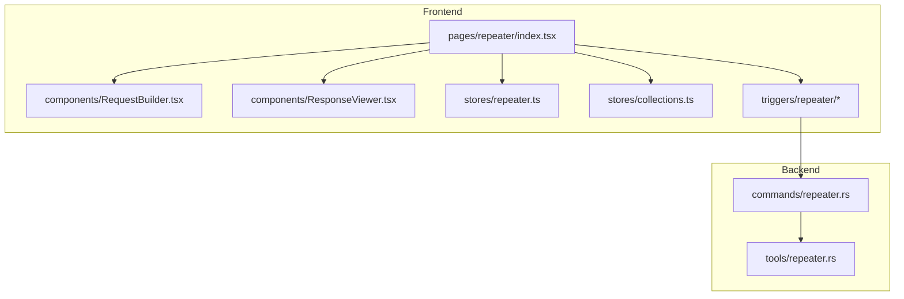
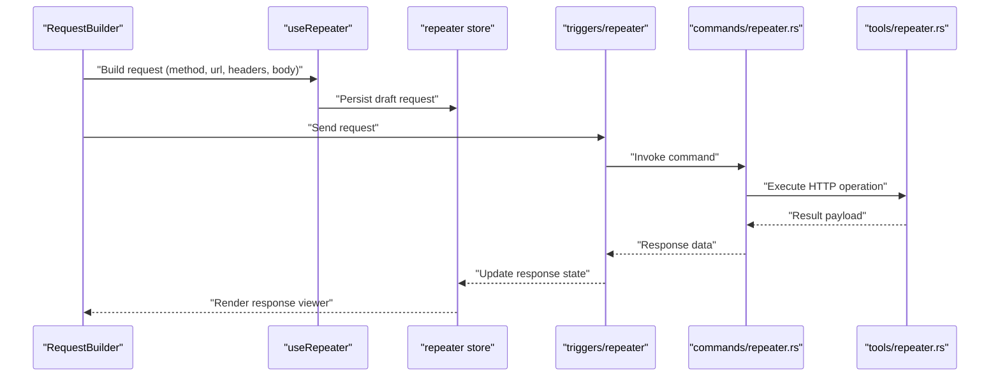
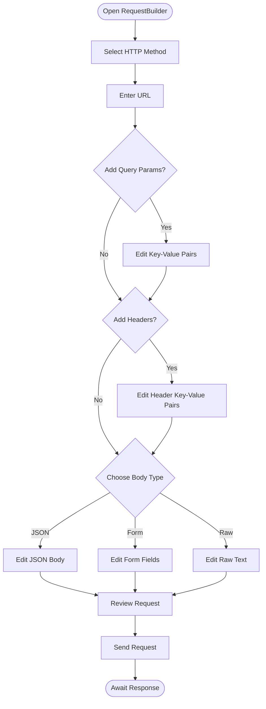
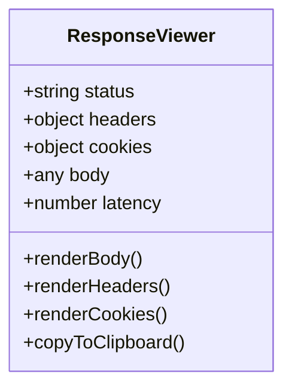
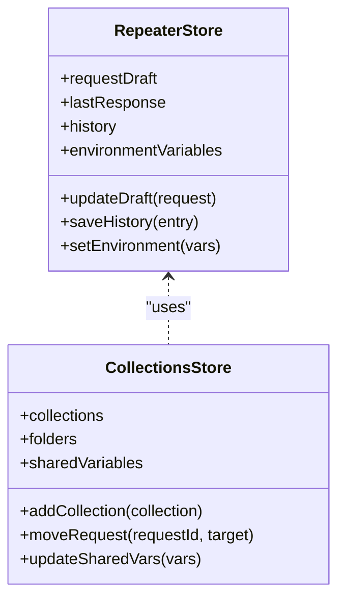
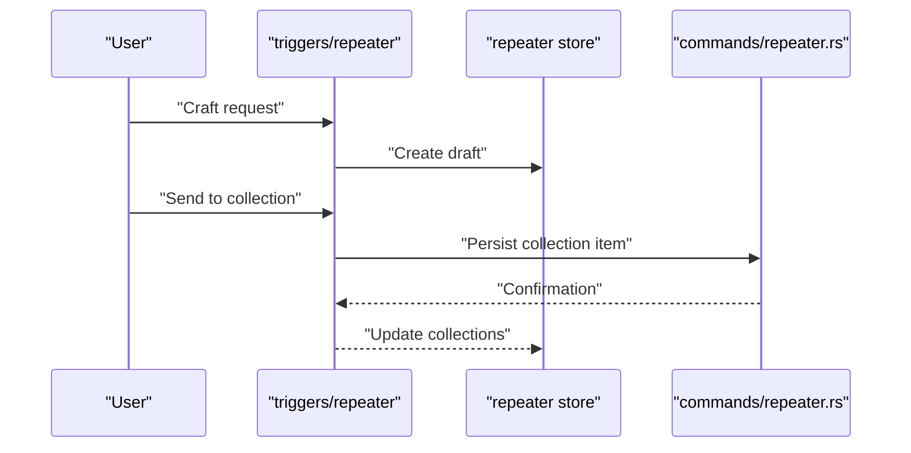
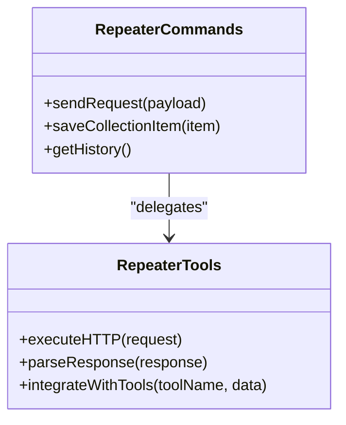
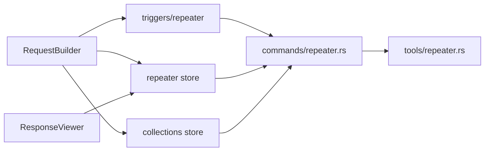

# Repeater - HTTP Request Builder

<cite>
**Referenced Files in This Document**
- [repeater/index.tsx](file://src/pages/repeater/index.tsx)
- [repeater/types.ts](file://src/pages/repeater/types.ts)
- [repeater/constants.ts](file://src/pages/repeater/constants.ts)
- [repeater/api.ts](file://src/pages/repeater/api.ts)
- [repeater/hooks/useRepeater.ts](file://src/pages/repeater/hooks/useRepeater.ts)
- [repeater/components/RequestBuilder.tsx](file://src/pages/repeater/components/RequestBuilder.tsx)
- [repeater/components/ResponseViewer.tsx](file://src/pages/repeater/components/ResponseViewer.tsx)
- [repeater/lib/request-utils.ts](file://src/pages/repeater/lib/request-utils.ts)
- [stores/repeater.ts](file://src/stores/repeater.ts)
- [stores/collections.ts](file://src/stores/collections.ts)
- [triggers/repeater/index.ts](file://src/triggers/repeater/index.ts)
- [triggers/repeater/craft.ts](file://src/triggers/repeater/craft.ts)
- [triggers/repeater/send-to.ts](file://src/triggers/repeater/send-to.ts)
- [triggers/repeater/management.ts](file://src/triggers/repeater/management.ts)
- [commands/repeater.rs](file://src-tauri/src/commands/repeater.rs)
- [tools/repeater.rs](file://src-tauri/src/tools/repeater.rs)
</cite>

## Table of Contents
1. [Introduction](#introduction)
2. [Project Structure](#project-structure)
3. [Core Components](#core-components)
4. [Architecture Overview](#architecture-overview)
5. [Detailed Component Analysis](#detailed-component-analysis)
6. [Dependency Analysis](#dependency-analysis)
7. [Performance Considerations](#performance-considerations)
8. [Troubleshooting Guide](#troubleshooting-guide)
9. [Conclusion](#conclusion)
10. [Appendices](#appendices)

## Introduction
Apprecon’s Repeater is the core HTTP request builder and collection management tool. It enables you to craft precise HTTP requests with custom headers, parameters, and body content; organize requests into collections; template requests using variables; analyze responses; and automate repetitive testing workflows. The Forge panel accelerates dynamic request generation, while scripting capabilities allow advanced manipulation of requests and responses. Workspace features support environment variables, conditional logic, data-driven testing, and integration with other Apprecon tools.

## Project Structure
The Repeater feature spans both frontend (TypeScript/React) and backend (Rust/Tauri) layers:
- Frontend pages and components implement the UI for building requests, viewing responses, managing collections, and invoking scripts.
- Stores manage state for repeater sessions and collections.
- Triggers expose actions like crafting requests, sending to collections, and managing workspace items.
- Backend commands and tools handle secure execution and persistence via Tauri.

**Diagram sources**
- [repeater/index.tsx](file://src/pages/repeater/index.tsx)
- [repeater/components/RequestBuilder.tsx](file://src/pages/repeater/components/RequestBuilder.tsx)
- [repeater/components/ResponseViewer.tsx](file://src/pages/repeater/components/ResponseViewer.tsx)
- [stores/repeater.ts](file://src/stores/repeater.ts)
- [stores/collections.ts](file://src/stores/collections.ts)
- [triggers/repeater/index.ts](file://src/triggers/repeater/index.ts)
- [commands/repeater.rs](file://src-tauri/src/commands/repeater.rs)
- [tools/repeater.rs](file://src-tauri/src/tools/repeater.rs)

**Section sources**
- [repeater/index.tsx](file://src/pages/repeater/index.tsx)
- [repeater/types.ts](file://src/pages/repeater/types.ts)
- [repeater/constants.ts](file://src/pages/repeater/constants.ts)
- [repeater/api.ts](file://src/pages/repeater/api.ts)
- [repeater/hooks/useRepeater.ts](file://src/pages/repeater/hooks/useRepeater.ts)
- [repeater/components/RequestBuilder.tsx](file://src/pages/repeater/components/RequestBuilder.tsx)
- [repeater/components/ResponseViewer.tsx](file://src/pages/repeater/components/ResponseViewer.tsx)
- [repeater/lib/request-utils.ts](file://src/pages/repeater/lib/request-utils.ts)
- [stores/repeater.ts](file://src/stores/repeater.ts)
- [stores/collections.ts](file://src/stores/collections.ts)
- [triggers/repeater/index.ts](file://src/triggers/repeater/index.ts)
- [triggers/repeater/craft.ts](file://src/triggers/repeater/craft.ts)
- [triggers/repeater/send-to.ts](file://src/triggers/repeater/send-to.ts)
- [triggers/repeater/management.ts](file://src/triggers/repeater/management.ts)
- [commands/repeater.rs](file://src-tauri/src/commands/repeater.rs)
- [tools/repeater.rs](file://src-tauri/src/tools/repeater.rs)

## Core Components
- RequestBuilder: Interactive form for method selection, URL input, query parameters, headers, and body editing with templating support.
- ResponseViewer: Syntax-highlighted response display with tabs for body, headers, cookies, and timing metrics.
- Store (repeater): Holds active session state, history, and current request/response payloads.
- Collections store: Manages grouped requests, folders, and shared variables.
- Triggers: Expose actions to craft requests, send to collections, and manage workspace items.
- Backend commands/tools: Provide secure execution, persistence, and integration points.

Key responsibilities:
- Constructing HTTP requests with full control over method, URL, headers, and body.
- Templating variables for environments and workspaces.
- Organizing requests into collections and folders.
- Analyzing responses with rich views and metadata.
- Automating workflows via scripts and triggers.

**Section sources**
- [repeater/components/RequestBuilder.tsx](file://src/pages/repeater/components/RequestBuilder.tsx)
- [repeater/components/ResponseViewer.tsx](file://src/pages/repeater/components/ResponseViewer.tsx)
- [stores/repeater.ts](file://src/stores/repeater.ts)
- [stores/collections.ts](file://src/stores/collections.ts)
- [triggers/repeater/index.ts](file://src/triggers/repeater/index.ts)
- [triggers/repeater/craft.ts](file://src/triggers/repeater/craft.ts)
- [triggers/repeater/send-to.ts](file://src/triggers/repeater/send-to.ts)
- [triggers/repeater/management.ts](file://src/triggers/repeater/management.ts)

## Architecture Overview
The Repeater follows a layered architecture:
- UI Layer: React components render the request builder and response viewer.
- State Layer: Stores maintain session state and collections.
- Trigger Layer: Actions orchestrate operations like crafting and sending requests.
- Command Layer: Tauri commands bridge to Rust tools for secure execution and persistence.
- Tool Layer: Rust utilities encapsulate HTTP operations and integrations.

**Diagram sources**
- [repeater/components/RequestBuilder.tsx](file://src/pages/repeater/components/RequestBuilder.tsx)
- [repeater/hooks/useRepeater.ts](file://src/pages/repeater/hooks/useRepeater.ts)
- [stores/repeater.ts](file://src/stores/repeater.ts)
- [triggers/repeater/index.ts](file://src/triggers/repeater/index.ts)
- [commands/repeater.rs](file://src-tauri/src/commands/repeater.rs)
- [tools/repeater.rs](file://src-tauri/src/tools/repeater.rs)

## Detailed Component Analysis

### RequestBuilder Component
- Purpose: Compose HTTP requests with method, URL, query parameters, headers, and body.
- Features:
  - Method selector and URL input with validation.
  - Dynamic key-value editors for headers and query params.
  - Body editor supporting JSON, form-data, and raw text.
  - Variable templating for environment and workspace values.
  - Save to collection and send actions.

**Diagram sources**
- [repeater/components/RequestBuilder.tsx](file://src/pages/repeater/components/RequestBuilder.tsx)
- [repeater/lib/request-utils.ts](file://src/pages/repeater/lib/request-utils.ts)

**Section sources**
- [repeater/components/RequestBuilder.tsx](file://src/pages/repeater/components/RequestBuilder.tsx)
- [repeater/lib/request-utils.ts](file://src/pages/repeater/lib/request-utils.ts)

### ResponseViewer Component
- Purpose: Display response details including status, headers, cookies, and body.
- Features:
  - Syntax highlighting for JSON/XML/text.
  - Tabs for body, headers, cookies, and timing.
  - Copy/export options for analysis and reporting.

**Diagram sources**
- [repeater/components/ResponseViewer.tsx](file://src/pages/repeater/components/ResponseViewer.tsx)

**Section sources**
- [repeater/components/ResponseViewer.tsx](file://src/pages/repeater/components/ResponseViewer.tsx)

### Store and State Management
- Repeater store maintains:
  - Active request draft and last response.
  - History entries with timestamps and metadata.
  - Environment variables and workspace context.
- Collections store manages:
  - Grouped requests and folders.
  - Shared variables and templates.

**Diagram sources**
- [stores/repeater.ts](file://src/stores/repeater.ts)
- [stores/collections.ts](file://src/stores/collections.ts)

**Section sources**
- [stores/repeater.ts](file://src/stores/repeater.ts)
- [stores/collections.ts](file://src/stores/collections.ts)

### Triggers and Automation
- Craft trigger builds requests from prompts or templates.
- Send-to trigger dispatches requests to collections or external tools.
- Management trigger handles workspace operations like saving, renaming, and organizing.

**Diagram sources**
- [triggers/repeater/craft.ts](file://src/triggers/repeater/craft.ts)
- [triggers/repeater/send-to.ts](file://src/triggers/repeater/send-to.ts)
- [triggers/repeater/management.ts](file://src/triggers/repeater/management.ts)
- [commands/repeater.rs](file://src-tauri/src/commands/repeater.rs)

**Section sources**
- [triggers/repeater/index.ts](file://src/triggers/repeater/index.ts)
- [triggers/repeater/craft.ts](file://src/triggers/repeater/craft.ts)
- [triggers/repeater/send-to.ts](file://src/triggers/repeater/send-to.ts)
- [triggers/repeater/management.ts](file://src/triggers/repeater/management.ts)

### Backend Commands and Tools
- Commands expose Tauri endpoints for secure operations.
- Tools encapsulate HTTP execution, parsing, and integration logic.

**Diagram sources**
- [commands/repeater.rs](file://src-tauri/src/commands/repeater.rs)
- [tools/repeater.rs](file://src-tauri/src/tools/repeater.rs)

**Section sources**
- [commands/repeater.rs](file://src-tauri/src/commands/repeater.rs)
- [tools/repeater.rs](file://src-tauri/src/tools/repeater.rs)

## Dependency Analysis
The Repeater feature depends on several internal modules and external integrations:
- Internal dependencies: stores, triggers, hooks, and utility libraries.
- External dependencies: Tauri commands for secure execution and persistence.
- Integration points: other Apprecon tools via triggers and tools layer.

**Diagram sources**
- [repeater/components/RequestBuilder.tsx](file://src/pages/repeater/components/RequestBuilder.tsx)
- [repeater/components/ResponseViewer.tsx](file://src/pages/repeater/components/ResponseViewer.tsx)
- [stores/repeater.ts](file://src/stores/repeater.ts)
- [stores/collections.ts](file://src/stores/collections.ts)
- [triggers/repeater/index.ts](file://src/triggers/repeater/index.ts)
- [commands/repeater.rs](file://src-tauri/src/commands/repeater.rs)
- [tools/repeater.rs](file://src-tauri/src/tools/repeater.rs)

**Section sources**
- [repeater/index.tsx](file://src/pages/repeater/index.tsx)
- [repeater/api.ts](file://src/pages/repeater/api.ts)
- [repeater/hooks/useRepeater.ts](file://src/pages/repeater/hooks/useRepeater.ts)
- [repeater/lib/request-utils.ts](file://src/pages/repeater/lib/request-utils.ts)
- [stores/repeater.ts](file://src/stores/repeater.ts)
- [stores/collections.ts](file://src/stores/collections.ts)
- [triggers/repeater/index.ts](file://src/triggers/repeater/index.ts)
- [commands/repeater.rs](file://src-tauri/src/commands/repeater.rs)
- [tools/repeater.rs](file://src-tauri/src/tools/repeater.rs)

## Performance Considerations
- Efficient state updates: Use selective store updates to avoid re-renders.
- Lazy loading: Load large response bodies only when needed.
- Caching: Cache repeated requests and responses for faster iteration.
- Background processing: Offload heavy parsing and transformations to background threads.
- Memory management: Clear unused history entries and drafts periodically.

[No sources needed since this section provides general guidance]

## Troubleshooting Guide
Common issues and resolutions:
- Request fails due to invalid URL: Validate URL format and ensure proper encoding.
- Headers not applied: Check header names and values for correctness.
- Body parsing errors: Ensure JSON is valid and matches expected schema.
- Collection save failures: Verify permissions and storage availability.
- Script execution errors: Review script syntax and environment variable references.

Debugging steps:
- Inspect network logs in the browser or system proxy.
- Use console logging in triggers and hooks.
- Validate environment variables and workspace settings.
- Test with minimal requests to isolate issues.

**Section sources**
- [repeater/lib/request-utils.ts](file://src/pages/repeater/lib/request-utils.ts)
- [triggers/repeater/craft.ts](file://src/triggers/repeater/craft.ts)
- [triggers/repeater/send-to.ts](file://src/triggers/repeater/send-to.ts)
- [commands/repeater.rs](file://src-tauri/src/commands/repeater.rs)

## Conclusion
Apprecon’s Repeater provides a powerful, flexible interface for crafting and testing HTTP requests. With robust collection management, templating, scripting, and automation capabilities, it streamlines API development and testing workflows. Its integration with other Apprecon tools enhances productivity and supports complex, data-driven testing scenarios.

[No sources needed since this section summarizes without analyzing specific files]

## Appendices

### Building API Test Collections
- Create a new collection and add requests by saving them from the builder.
- Organize requests into folders for better structure.
- Share variables across requests using environment and workspace settings.

### Using Environment Variables
- Define variables in the environment settings.
- Reference variables in URLs, headers, and body using templating syntax.
- Switch between environments for different testing contexts.

### Automating Repetitive Workflows
- Use triggers to automate request creation and sending.
- Write scripts to manipulate requests and responses dynamically.
- Integrate with external tools for extended functionality.

### Advanced Features
- Conditional logic in scripts for dynamic request modification.
- Data-driven testing with external data sources like CSV or JSON files.
- Integration with other Apprecon tools for comprehensive testing pipelines.

[No sources needed since this section provides general guidance]