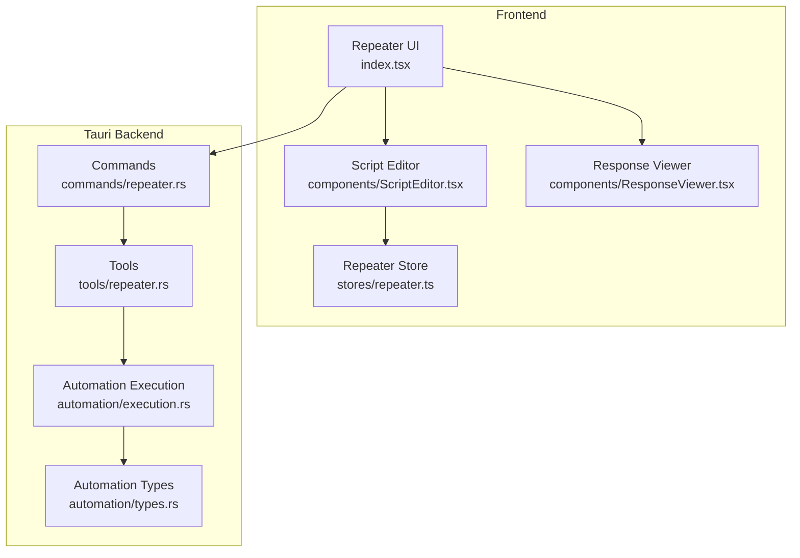
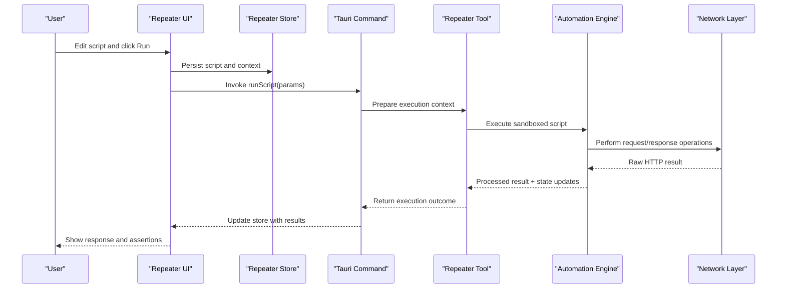
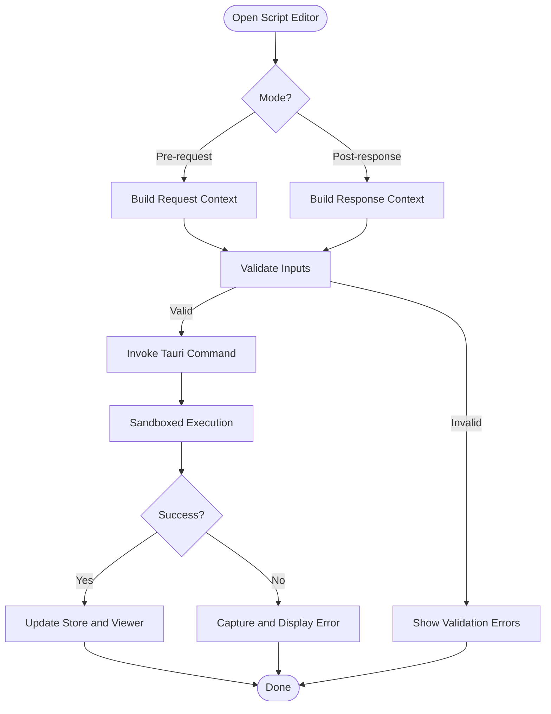
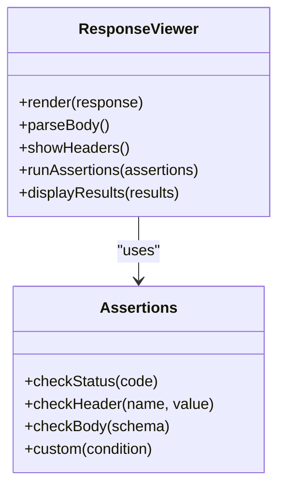
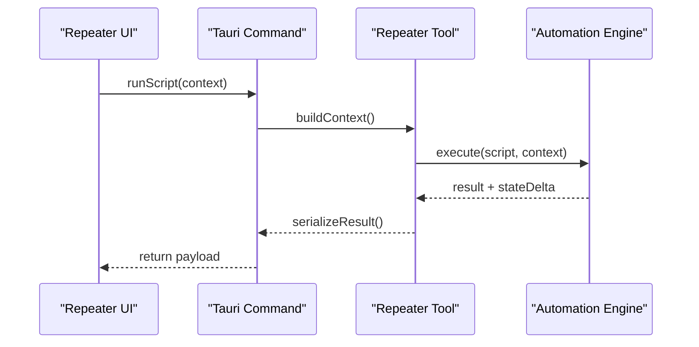
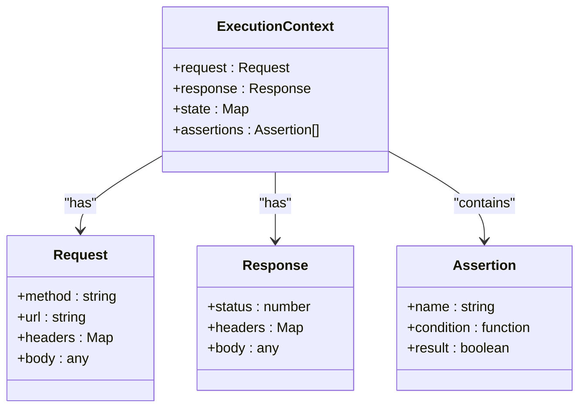
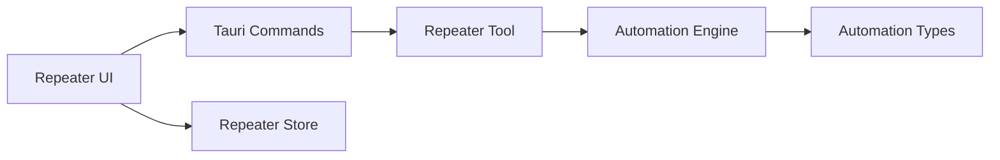

# Scripting & Automation

<cite>
**Referenced Files in This Document**
- [repeater/index.tsx](file://src/pages/repeater/index.tsx)
- [repeater/api.ts](file://src/pages/repeater/api.ts)
- [repeater/types.ts](file://src/pages/repeater/types.ts)
- [repeater/constants.ts](file://src/pages/repeater/constants.ts)
- [repeater/hooks/useRepeater.ts](file://src/pages/repeater/hooks/useRepeater.ts)
- [repeater/components/ScriptEditor.tsx](file://src/pages/repeater/components/ScriptEditor.tsx)
- [repeater/components/ResponseViewer.tsx](file://src/pages/repeater/components/ResponseViewer.tsx)
- [stores/repeater.ts](file://src/stores/repeater.ts)
- [automation/types.ts](file://src-tauri/src/automation/types.rs)
- [automation/execution.rs](file://src-tauri/src/automation/execution.rs)
- [commands/repeater.rs](file://src-tauri/src/commands/repeater.rs)
- [tools/repeater.rs](file://src-tauri/src/tools/repeater.rs)
</cite>

## Table of Contents
1. [Introduction](#introduction)
2. [Project Structure](#project-structure)
3. [Core Components](#core-components)
4. [Architecture Overview](#architecture-overview)
5. [Detailed Component Analysis](#detailed-component-analysis)
6. [Dependency Analysis](#dependency-analysis)
7. [Performance Considerations](#performance-considerations)
8. [Troubleshooting Guide](#troubleshooting-guide)
9. [Conclusion](#conclusion)

## Introduction
This document explains the scripting and automation capabilities in Apprecon’s Repeater. It covers the JavaScript sandbox environment, available APIs for request manipulation, response processing, and state management. You will learn how to write pre-request scripts, post-response handlers, and assertion functions; implement data-driven testing patterns; integrate external data sources; and apply conditional logic. The guide also includes examples for authentication flows, dynamic parameter generation, response validation, and automated test sequences, along with security considerations, performance best practices, and debugging techniques.

## Project Structure
The Repeater feature spans both the frontend (TypeScript/React) and the backend (Rust/Tauri). Key areas include:
- Frontend UI and editor for writing and running scripts
- State stores for managing script execution context and results
- Tauri commands and tools that execute scripts in a sandboxed runtime
- Automation types and execution engine used by Repeater

**Diagram sources**
- [repeater/index.tsx](file://src/pages/repeater/index.tsx)
- [repeater/components/ScriptEditor.tsx](file://src/pages/repeater/components/ScriptEditor.tsx)
- [repeater/components/ResponseViewer.tsx](file://src/pages/repeater/components/ResponseViewer.tsx)
- [stores/repeater.ts](file://src/stores/repeater.ts)
- [commands/repeater.rs](file://src-tauri/src/commands/repeater.rs)
- [tools/repeater.rs](file://src-tauri/src/tools/repeater.rs)
- [automation/execution.rs](file://src-tauri/src/automation/execution.rs)
- [automation/types.rs](file://src-tauri/src/automation/types.rs)

**Section sources**
- [repeater/index.tsx](file://src/pages/repeater/index.tsx)
- [repeater/api.ts](file://src/pages/repeater/api.ts)
- [repeater/types.ts](file://src/pages/repeater/types.ts)
- [repeater/constants.ts](file://src/pages/repeater/constants.ts)
- [repeater/hooks/useRepeater.ts](file://src/pages/repeater/hooks/useRepeater.ts)
- [repeater/components/ScriptEditor.tsx](file://src/pages/repeater/components/ScriptEditor.tsx)
- [repeater/components/ResponseViewer.tsx](file://src/pages/repeater/components/ResponseViewer.tsx)
- [stores/repeater.ts](file://src/stores/repeater.ts)
- [commands/repeater.rs](file://src-tauri/src/commands/repeater.rs)
- [tools/repeater.rs](file://src-tauri/src/tools/repeater.rs)
- [automation/execution.rs](file://src-tauri/src/automation/execution.rs)
- [automation/types.rs](file://src-tauri/src/automation/types.rs)

## Core Components
- Script Editor: Provides an inline code editor for authoring pre-request and post-response scripts with syntax support and quick actions.
- Response Viewer: Displays structured responses, headers, body previews, and allows assertions or transformations.
- Repeater Store: Holds execution state, variables, history, and results for scripts and requests.
- Tauri Commands: Expose safe entry points from the UI to run scripts and interact with network operations.
- Automation Engine: Executes scripts within a sandbox, providing APIs for request/response manipulation and state access.

Key responsibilities:
- Pre-request scripts can modify outgoing requests (headers, body, parameters).
- Post-response handlers can parse, transform, and assert on responses.
- State management enables passing values between steps and across runs.
- Data-driven testing is supported via external data sources and iteration patterns.

**Section sources**
- [repeater/components/ScriptEditor.tsx](file://src/pages/repeater/components/ScriptEditor.tsx)
- [repeater/components/ResponseViewer.tsx](file://src/pages/repeater/components/ResponseViewer.tsx)
- [stores/repeater.ts](file://src/stores/repeater.ts)
- [commands/repeater.rs](file://src-tauri/src/commands/repeater.rs)
- [automation/execution.rs](file://src-tauri/src/automation/execution.rs)

## Architecture Overview
The Repeater scripting pipeline integrates the frontend editor with a sandboxed execution environment. Scripts are authored in the UI and executed through Tauri commands, which delegate to the automation engine. The engine provides a controlled API surface for manipulating requests and responses while maintaining isolation and security.

**Diagram sources**
- [repeater/index.tsx](file://src/pages/repeater/index.tsx)
- [repeater/components/ScriptEditor.tsx](file://src/pages/repeater/components/ScriptEditor.tsx)
- [stores/repeater.ts](file://src/stores/repeater.ts)
- [commands/repeater.rs](file://src-tauri/src/commands/repeater.rs)
- [tools/repeater.rs](file://src-tauri/src/tools/repeater.rs)
- [automation/execution.rs](file://src-tauri/src/automation/execution.rs)

## Detailed Component Analysis

### Script Editor and Execution Flow
The Script Editor captures user input and triggers execution via Tauri commands. It supports switching between pre-request and post-response modes and exposes helpers for common tasks like encoding and parsing.

**Diagram sources**
- [repeater/components/ScriptEditor.tsx](file://src/pages/repeater/components/ScriptEditor.tsx)
- [commands/repeater.rs](file://src-tauri/src/commands/repeater.rs)
- [automation/execution.rs](file://src-tauri/src/automation/execution.rs)

**Section sources**
- [repeater/components/ScriptEditor.tsx](file://src/pages/repeater/components/ScriptEditor.tsx)
- [repeater/api.ts](file://src/pages/repeater/api.ts)
- [repeater/types.ts](file://src/pages/repeater/types.ts)
- [repeater/constants.ts](file://src/pages/repeater/constants.ts)
- [repeater/hooks/useRepeater.ts](file://src/pages/repeater/hooks/useRepeater.ts)

### Response Viewer and Assertions
The Response Viewer renders parsed responses and supports assertion checks. Users can define conditions to validate status codes, headers, and body content. Results are stored in the repeater store for later inspection.

**Diagram sources**
- [repeater/components/ResponseViewer.tsx](file://src/pages/repeater/components/ResponseViewer.tsx)

**Section sources**
- [repeater/components/ResponseViewer.tsx](file://src/pages/repeater/components/ResponseViewer.tsx)
- [stores/repeater.ts](file://src/stores/repeater.ts)

### Tauri Commands and Tools
Tauri commands expose secure endpoints for executing scripts and interacting with network resources. The Repeater tool prepares contexts and delegates execution to the automation engine, ensuring isolation and consistent behavior.

**Diagram sources**
- [commands/repeater.rs](file://src-tauri/src/commands/repeater.rs)
- [tools/repeater.rs](file://src-tauri/src/tools/repeater.rs)
- [automation/execution.rs](file://src-tauri/src/automation/execution.rs)

**Section sources**
- [commands/repeater.rs](file://src-tauri/src/commands/repeater.rs)
- [tools/repeater.rs](file://src-tauri/src/tools/repeater.rs)
- [automation/execution.rs](file://src-tauri/src/automation/execution.rs)

### Automation Types and Execution Model
The automation layer defines types for script execution, including request/response models, state variables, and assertion results. The execution engine enforces sandbox boundaries and provides APIs for safe operations.

**Diagram sources**
- [automation/types.rs](file://src-tauri/src/automation/types.rs)
- [automation/execution.rs](file://src-tauri/src/automation/execution.rs)

**Section sources**
- [automation/types.rs](file://src-tauri/src/automation/types.rs)
- [automation/execution.rs](file://src-tauri/src/automation/execution.rs)

## Dependency Analysis
The Repeater scripting system has clear separation between UI, command layer, and execution engine. Dependencies flow from the UI to commands, then to tools and the automation engine. This design minimizes coupling and enhances maintainability.

**Diagram sources**
- [repeater/index.tsx](file://src/pages/repeater/index.tsx)
- [commands/repeater.rs](file://src-tauri/src/commands/repeater.rs)
- [tools/repeater.rs](file://src-tauri/src/tools/repeater.rs)
- [automation/execution.rs](file://src-tauri/src/automation/execution.rs)
- [automation/types.rs](file://src-tauri/src/automation/types.rs)
- [stores/repeater.ts](file://src/stores/repeater.ts)

**Section sources**
- [repeater/index.tsx](file://src/pages/repeater/index.tsx)
- [commands/repeater.rs](file://src-tauri/src/commands/repeater.rs)
- [tools/repeater.rs](file://src-tauri/src/tools/repeater.rs)
- [automation/execution.rs](file://src-tauri/src/automation/execution.rs)
- [automation/types.rs](file://src-tauri/src/automation/types.rs)
- [stores/repeater.ts](file://src/stores/repeater.ts)

## Performance Considerations
- Keep scripts small and focused to reduce execution time.
- Avoid heavy computations inside pre-request scripts; precompute where possible.
- Use efficient parsing for large responses; prefer streaming or chunked processing if available.
- Cache frequently accessed data in the repeater store to avoid redundant operations.
- Limit the number of assertions per run to minimize overhead.
- Debounce rapid script executions during iterative development.

[No sources needed since this section provides general guidance]

## Troubleshooting Guide
Common issues and resolutions:
- Script errors: Inspect error messages returned by the automation engine; ensure inputs are valid and dependencies are present.
- Network failures: Verify target URLs, headers, and authentication tokens; check proxy settings and certificate configurations.
- State inconsistencies: Reset the repeater store when necessary; ensure state mutations are deterministic.
- Performance bottlenecks: Profile script execution; identify slow operations and optimize or offload them.
- Security warnings: Review sandbox restrictions; avoid disallowed operations and use provided APIs.

Debugging techniques:
- Log intermediate values using safe logging utilities exposed by the sandbox.
- Use step-by-step execution where supported to isolate failures.
- Validate payloads and responses with schema checks before assertions.
- Capture full request/response traces for analysis.

**Section sources**
- [automation/execution.rs](file://src-tauri/src/automation/execution.rs)
- [stores/repeater.ts](file://src/stores/repeater.ts)

## Conclusion
Apprecon’s Repeater provides a robust scripting and automation framework built around a secure JavaScript sandbox. By leveraging pre-request scripts, post-response handlers, and assertion functions, users can automate complex workflows, perform data-driven testing, and enforce response validations. Following the best practices outlined here ensures reliable, secure, and high-performance automation.

[No sources needed since this section summarizes without analyzing specific files]