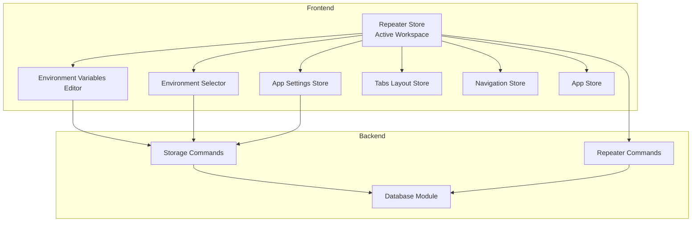
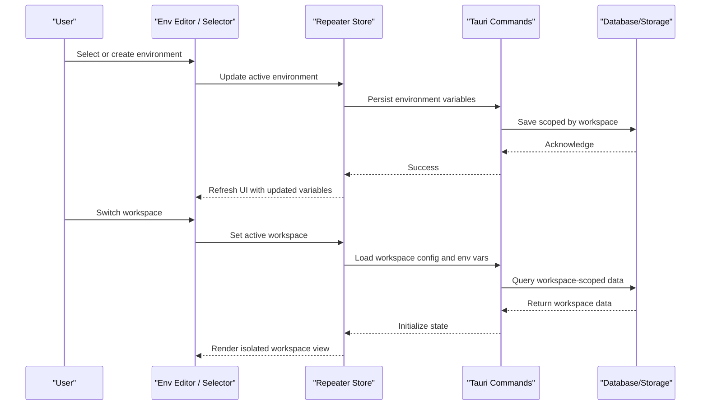
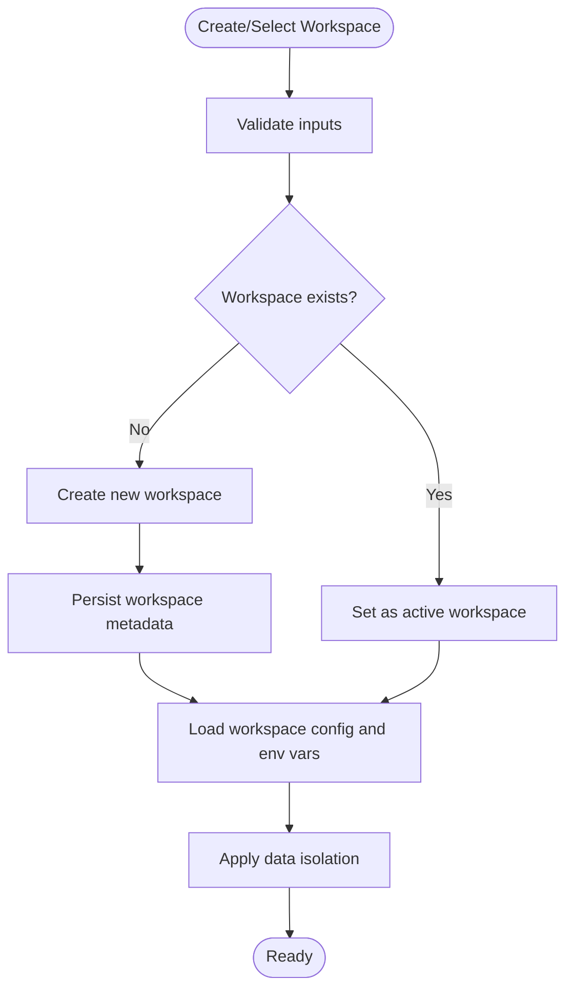
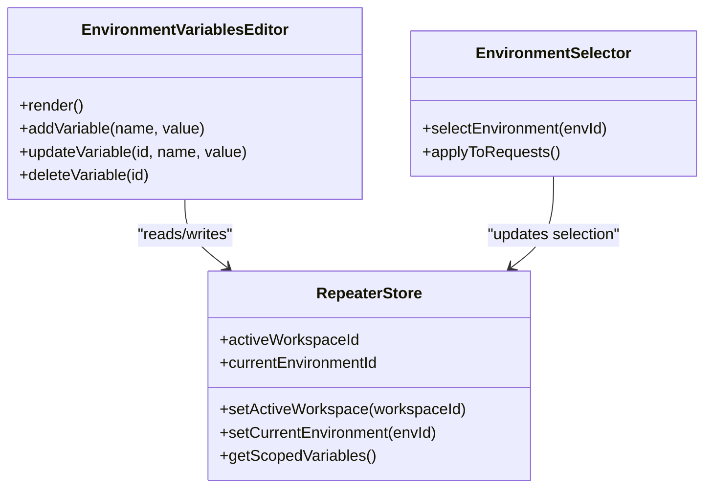
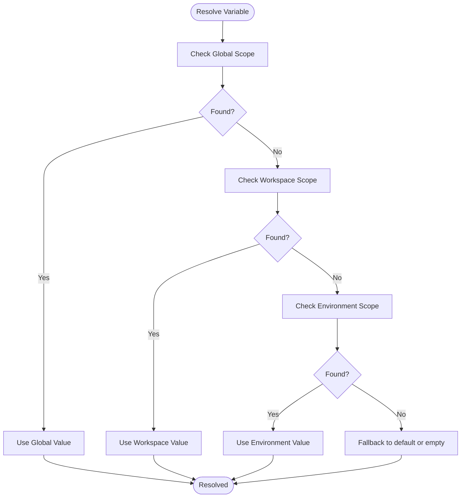
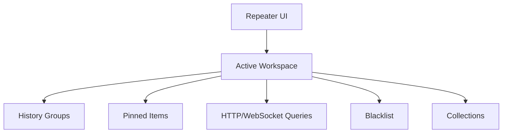
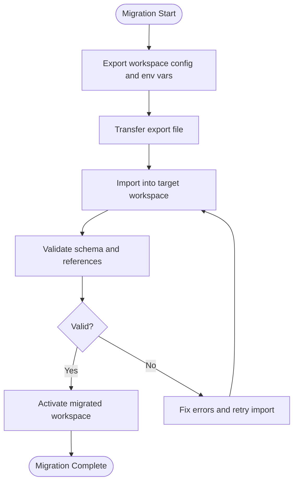
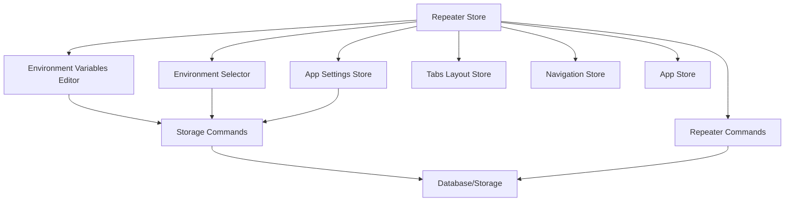

# Workspace & Environment Management

<cite>
**Referenced Files in This Document**
- [src/stores/repeater.ts](file://src/stores/repeater.ts)
- [src/pages/repeater/index.tsx](file://src/pages/repeater/index.tsx)
- [src/components/ai-elements/environment-variables.tsx](file://src/components/ai-elements/environment-variables.tsx)
- [src/components/ui/select-env-input.tsx](file://src/components/ui/select-env-input.tsx)
- [src/stores/app-settings-store.ts](file://src/stores/app-settings-store.ts)
- [src-tauri/src/commands/storage.rs](file://src-tauri/src/commands/storage.rs)
- [src-tauri/src/db/mod.rs](file://src-tauri/src/db/mod.rs)
- [src-tauri/src/commands/repeater.rs](file://src-tauri/src/commands/repeater.rs)
- [src/stores/collections.ts](file://src/stores/collections.ts)
- [src/stores/history/http-groups.ts](file://src/stores/history/http-groups.ts)
- [src/stores/history/http-pinned.ts](file://src/stores/history/http-pinned.ts)
- [src/stores/history/http-query.ts](file://src/stores/history/http-query.ts)
- [src/stores/history/http-blacklist.ts](file://src/stores/history/http-blacklist.ts)
- [src/stores/history/websocket-query.ts](file://src/stores/history/websocket-query.ts)
- [src/stores/tabs-layout.ts](file://src/stores/tabs-layout.ts)
- [src/stores/nav.ts](file://src/stores/nav.ts)
- [src/stores/app.ts](file://src/stores/app.ts)
</cite>

## Table of Contents
1. [Introduction](#introduction)
2. [Project Structure](#project-structure)
3. [Core Components](#core-components)
4. [Architecture Overview](#architecture-overview)
5. [Detailed Component Analysis](#detailed-component-analysis)
6. [Dependency Analysis](#dependency-analysis)
7. [Performance Considerations](#performance-considerations)
8. [Troubleshooting Guide](#troubleshooting-guide)
9. [Conclusion](#conclusion)
10. [Appendices](#appendices)

## Introduction
This document explains how Apprecon’s Repeater manages workspaces and environments. It covers creating and switching workspaces, configuring environment variables with scoping and inheritance rules, isolating data per workspace, migrating between workspaces, and sharing configurations across teams. Practical examples for development, staging, and production are included, along with guidance on securely managing sensitive credentials.

## Project Structure
Workspace and environment management spans both the frontend (TypeScript stores and UI components) and the backend (Tauri commands and persistence). The key areas include:
- Repeater store and page integration for active workspace context
- Environment variable editor and selector UI
- Application settings and global state for workspace identity
- Tauri storage and database modules for persistence
- History and collections stores that scope data by workspace

**Diagram sources**
- [src/stores/repeater.ts](file://src/stores/repeater.ts)
- [src/pages/repeater/index.tsx](file://src/pages/repeater/index.tsx)
- [src/components/ai-elements/environment-variables.tsx](file://src/components/ai-elements/environment-variables.tsx)
- [src/components/ui/select-env-input.tsx](file://src/components/ui/select-env-input.tsx)
- [src/stores/app-settings-store.ts](file://src/stores/app-settings-store.ts)
- [src/stores/tabs-layout.ts](file://src/stores/tabs-layout.ts)
- [src/stores/nav.ts](file://src/stores/nav.ts)
- [src/stores/app.ts](file://src/stores/app.ts)
- [src-tauri/src/commands/storage.rs](file://src-tauri/src/commands/storage.rs)
- [src-tauri/src/commands/repeater.rs](file://src-tauri/src/commands/repeater.rs)
- [src-tauri/src/db/mod.rs](file://src-tauri/src/db/mod.rs)

**Section sources**
- [src/stores/repeater.ts](file://src/stores/repeater.ts)
- [src/pages/repeater/index.tsx](file://src/pages/repeater/index.tsx)
- [src/components/ai-elements/environment-variables.tsx](file://src/components/ai-elements/environment-variables.tsx)
- [src/components/ui/select-env-input.tsx](file://src/components/ui/select-env-input.tsx)
- [src/stores/app-settings-store.ts](file://src/stores/app-settings-store.ts)
- [src/stores/tabs-layout.ts](file://src/stores/tabs-layout.ts)
- [src/stores/nav.ts](file://src/stores/nav.ts)
- [src/stores/app.ts](file://src/stores/app.ts)
- [src-tauri/src/commands/storage.rs](file://src-tauri/src/commands/storage.rs)
- [src-tauri/src/commands/repeater.rs](file://src-tauri/src/commands/repeater.rs)
- [src-tauri/src/db/mod.rs](file://src-tauri/src/db/mod.rs)

## Core Components
- Active workspace context: Maintained in the Repeater store and used by the Repeater page to scope all operations.
- Environment variables editor: Provides creation, editing, and deletion of variables within a selected environment.
- Environment selector: Allows switching between environments and applying their variables to requests.
- Persistence layer: Tauri storage and database modules persist workspace metadata, environment variables, and related configuration.
- Scoping stores: History and collections stores enforce workspace-scoped data isolation.

Key responsibilities:
- Create, update, delete, and switch workspaces
- Manage environment variables with scoping and inheritance
- Persist and load workspace and environment state
- Enforce data isolation across workspaces

**Section sources**
- [src/stores/repeater.ts](file://src/stores/repeater.ts)
- [src/components/ai-elements/environment-variables.tsx](file://src/components/ai-elements/environment-variables.tsx)
- [src/components/ui/select-env-input.tsx](file://src/components/ui/select-env-input.tsx)
- [src-tauri/src/commands/storage.rs](file://src-tauri/src/commands/storage.rs)
- [src-tauri/src/commands/repeater.rs](file://src-tauri/src/commands/repeater.rs)
- [src-tauri/src/db/mod.rs](file://src-tauri/src/db/mod.rs)

## Architecture Overview
The workspace and environment system is built around a central Repeater store that holds the active workspace ID and current environment selection. UI components interact with this store to render and edit environment variables. All changes are persisted via Tauri commands to the local storage/database. Data isolation is enforced by scoping history and collections to the active workspace.

**Diagram sources**
- [src/stores/repeater.ts](file://src/stores/repeater.ts)
- [src/components/ai-elements/environment-variables.tsx](file://src/components/ai-elements/environment-variables.tsx)
- [src/components/ui/select-env-input.tsx](file://src/components/ui/select-env-input.tsx)
- [src-tauri/src/commands/storage.rs](file://src-tauri/src/commands/storage.rs)
- [src-tauri/src/commands/repeater.rs](file://src-tauri/src/commands/repeater.rs)
- [src-tauri/src/db/mod.rs](file://src-tauri/src/db/mod.rs)

## Detailed Component Analysis

### Workspace Lifecycle and Switching
- Creating a workspace initializes a new workspace record and sets it as active.
- Switching workspaces loads the target workspace’s configuration and environment variables, then re-renders the UI with isolated data.
- Deletion removes the workspace and its associated data from persistence.

**Diagram sources**
- [src/stores/repeater.ts](file://src/stores/repeater.ts)
- [src-tauri/src/commands/repeater.rs](file://src-tauri/src/commands/repeater.rs)
- [src-tauri/src/commands/storage.rs](file://src-tauri/src/commands/storage.rs)

**Section sources**
- [src/stores/repeater.ts](file://src/stores/repeater.ts)
- [src-tauri/src/commands/repeater.rs](file://src-tauri/src/commands/repeater.rs)
- [src-tauri/src/commands/storage.rs](file://src-tauri/src/commands/storage.rs)

### Environment Variables Editor and Selector
- The editor allows adding, editing, and deleting variables within an environment.
- The selector enables choosing an environment to apply its variables to requests.
- Changes are immediately reflected in the UI and persisted to storage.

**Diagram sources**
- [src/components/ai-elements/environment-variables.tsx](file://src/components/ai-elements/environment-variables.tsx)
- [src/components/ui/select-env-input.tsx](file://src/components/ui/select-env-input.tsx)
- [src/stores/repeater.ts](file://src/stores/repeater.ts)

**Section sources**
- [src/components/ai-elements/environment-variables.tsx](file://src/components/ai-elements/environment-variables.tsx)
- [src/components/ui/select-env-input.tsx](file://src/components/ui/select-env-input.tsx)
- [src/stores/repeater.ts](file://src/stores/repeater.ts)

### Variable Scoping and Inheritance
- Variables can be defined at multiple scopes: global, workspace, and environment.
- Resolution order prioritizes more specific scopes over broader ones.
- When resolving a variable, the system merges base values with overrides according to precedence.

**Diagram sources**
- [src/stores/repeater.ts](file://src/stores/repeater.ts)
- [src-tauri/src/commands/storage.rs](file://src-tauri/src/commands/storage.rs)

**Section sources**
- [src/stores/repeater.ts](file://src/stores/repeater.ts)
- [src-tauri/src/commands/storage.rs](file://src-tauri/src/commands/storage.rs)

### Data Isolation Between Workspaces
- History entries, pinned items, queries, blacklists, and collections are scoped to the active workspace.
- Switching workspaces ensures no cross-workspace data leakage.
- UI components read from workspace-scoped stores only.

**Diagram sources**
- [src/stores/history/http-groups.ts](file://src/stores/history/http-groups.ts)
- [src/stores/history/http-pinned.ts](file://src/stores/history/http-pinned.ts)
- [src/stores/history/http-query.ts](file://src/stores/history/http-query.ts)
- [src/stores/history/http-blacklist.ts](file://src/stores/history/http-blacklist.ts)
- [src/stores/history/websocket-query.ts](file://src/stores/history/websocket-query.ts)
- [src/stores/collections.ts](file://src/stores/collections.ts)
- [src/stores/repeater.ts](file://src/stores/repeater.ts)

**Section sources**
- [src/stores/history/http-groups.ts](file://src/stores/history/http-groups.ts)
- [src/stores/history/http-pinned.ts](file://src/stores/history/http-pinned.ts)
- [src/stores/history/http-query.ts](file://src/stores/history/http-query.ts)
- [src/stores/history/http-blacklist.ts](file://src/stores/history/http-blacklist.ts)
- [src/stores/history/websocket-query.ts](file://src/stores/history/websocket-query.ts)
- [src/stores/collections.ts](file://src/stores/collections.ts)
- [src/stores/repeater.ts](file://src/stores/repeater.ts)

### Migration Procedures
- Export workspace configuration and environment variables for backup or sharing.
- Import exported data into another workspace or instance, ensuring no conflicts.
- Validate imported data integrity before activating the migrated workspace.

[No diagram sources since this section describes conceptual migration steps]

## Dependency Analysis
The following diagram shows how the frontend stores and UI components depend on each other and the backend persistence layer.

**Diagram sources**
- [src/stores/repeater.ts](file://src/stores/repeater.ts)
- [src/components/ai-elements/environment-variables.tsx](file://src/components/ai-elements/environment-variables.tsx)
- [src/components/ui/select-env-input.tsx](file://src/components/ui/select-env-input.tsx)
- [src/stores/app-settings-store.ts](file://src/stores/app-settings-store.ts)
- [src/stores/tabs-layout.ts](file://src/stores/tabs-layout.ts)
- [src/stores/nav.ts](file://src/stores/nav.ts)
- [src/stores/app.ts](file://src/stores/app.ts)
- [src-tauri/src/commands/storage.rs](file://src-tauri/src/commands/storage.rs)
- [src-tauri/src/commands/repeater.rs](file://src-tauri/src/commands/repeater.rs)
- [src-tauri/src/db/mod.rs](file://src-tauri/src/db/mod.rs)

**Section sources**
- [src/stores/repeater.ts](file://src/stores/repeater.ts)
- [src/components/ai-elements/environment-variables.tsx](file://src/components/ai-elements/environment-variables.tsx)
- [src/components/ui/select-env-input.tsx](file://src/components/ui/select-env-input.tsx)
- [src/stores/app-settings-store.ts](file://src/stores/app-settings-store.ts)
- [src/stores/tabs-layout.ts](file://src/stores/tabs-layout.ts)
- [src/stores/nav.ts](file://src/stores/nav.ts)
- [src/stores/app.ts](file://src/stores/app.ts)
- [src-tauri/src/commands/storage.rs](file://src-tauri/src/commands/storage.rs)
- [src-tauri/src/commands/repeater.rs](file://src-tauri/src/commands/repeater.rs)
- [src-tauri/src/db/mod.rs](file://src-tauri/src/db/mod.rs)

## Performance Considerations
- Minimize frequent persistence calls by batching updates when editing multiple variables.
- Cache resolved variable maps per workspace/environment to avoid repeated resolution.
- Lazy-load large datasets (e.g., history) scoped to the active workspace to reduce memory usage.
- Debounce user input in editors to prevent excessive write operations.

[No sources needed since this section provides general guidance]

## Troubleshooting Guide
Common issues and resolutions:
- Workspace not loading: Verify active workspace ID and persistence availability; ensure Tauri storage commands respond correctly.
- Variables not applied: Confirm environment selection and resolution order; check for naming conflicts and missing defaults.
- Data leakage between workspaces: Ensure all reads/writes use the active workspace context; audit store scoping logic.
- Migration failures: Validate schema compatibility and required fields; rollback to previous state if validation fails.

**Section sources**
- [src/stores/repeater.ts](file://src/stores/repeater.ts)
- [src-tauri/src/commands/storage.rs](file://src-tauri/src/commands/storage.rs)
- [src-tauri/src/commands/repeater.rs](file://src-tauri/src/commands/repeater.rs)

## Conclusion
Apprecon’s Repeater provides robust workspace and environment management through a clear separation of concerns: a central store for active context, dedicated UI components for editing and selection, and a persistent backend layer enforcing isolation. By following the scoping and inheritance rules, using secure credential practices, and leveraging migration procedures, teams can maintain consistent, safe, and efficient workflows across development, staging, and production environments.

[No sources needed since this section summarizes without analyzing specific files]

## Appendices

### Example Setup: Development, Staging, Production
- Create three workspaces: dev, staging, prod.
- For each workspace, define an environment with appropriate variables (e.g., API endpoints, feature flags).
- Apply inheritance: global defaults, workspace overrides, environment-specific values.
- Secure sensitive credentials using platform keyring or encrypted storage where available.

[No sources needed since this section provides general guidance]

### Sharing Workspace Configurations Across Teams
- Export workspace configuration and environment variables to a shared format.
- Distribute via version control or secure channels.
- Import into team members’ instances and validate before activation.

[No sources needed since this section provides general guidance]