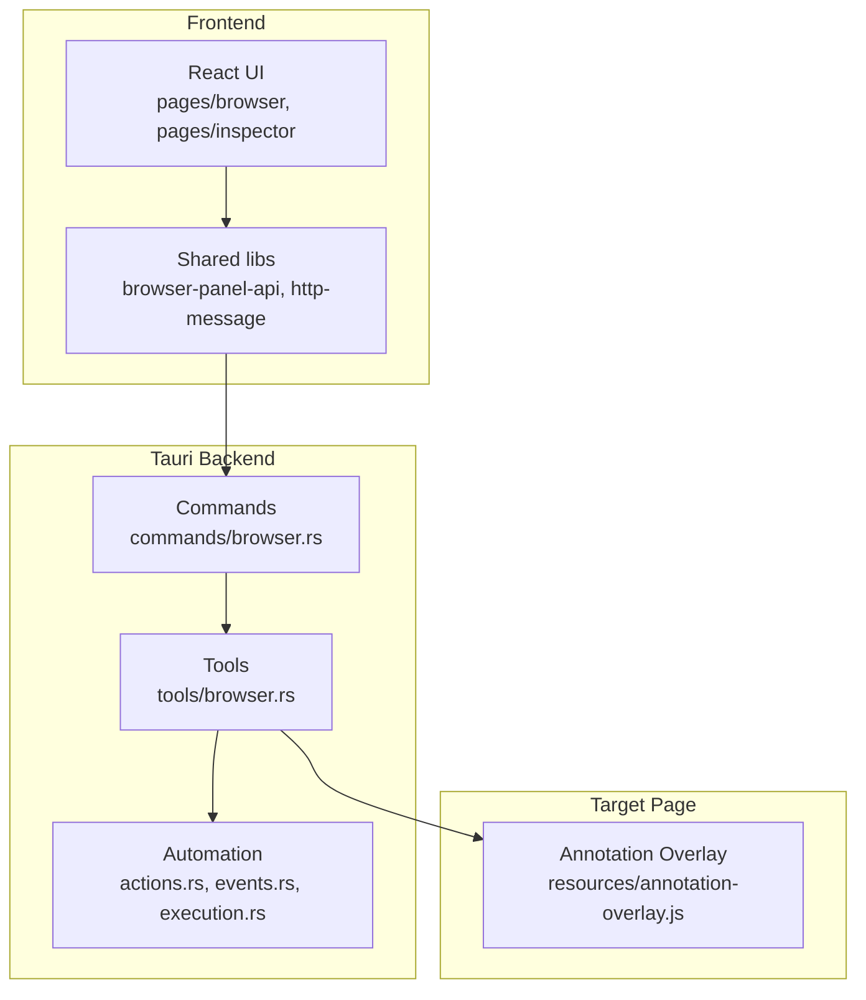
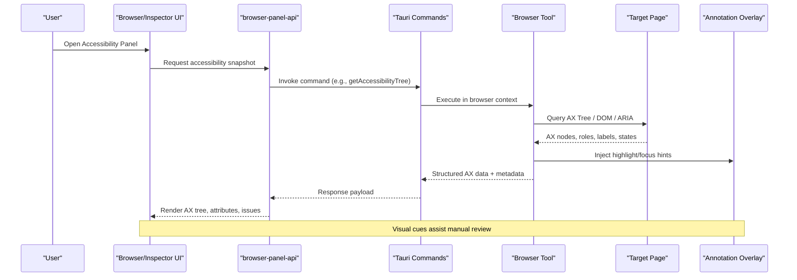
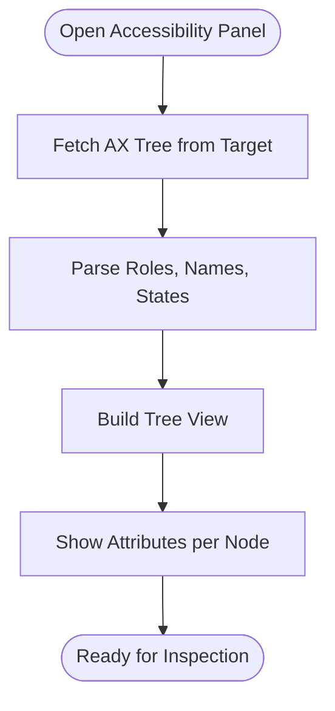
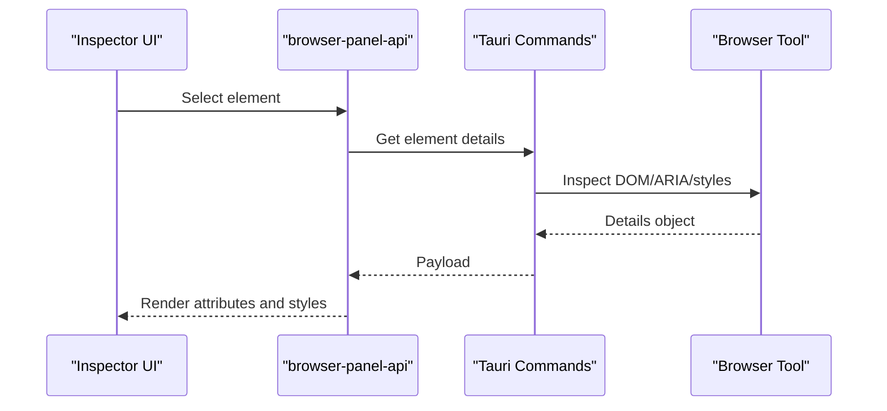
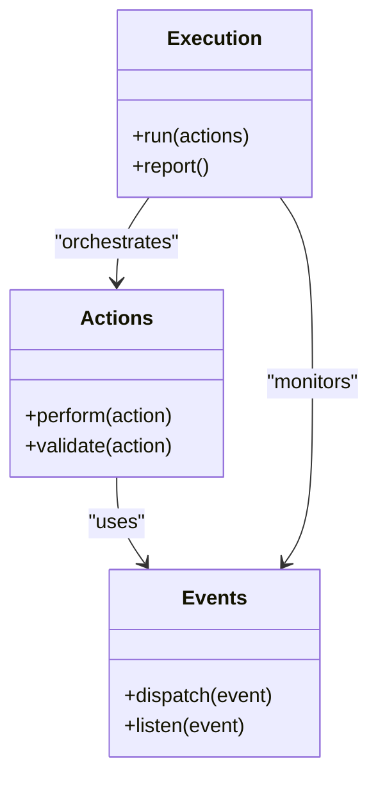
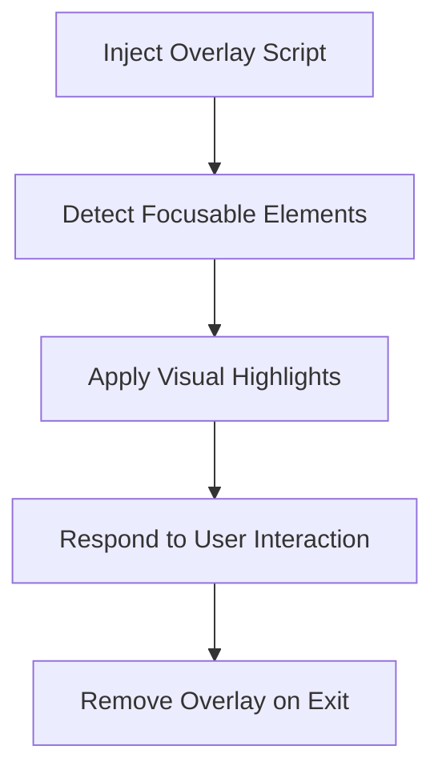
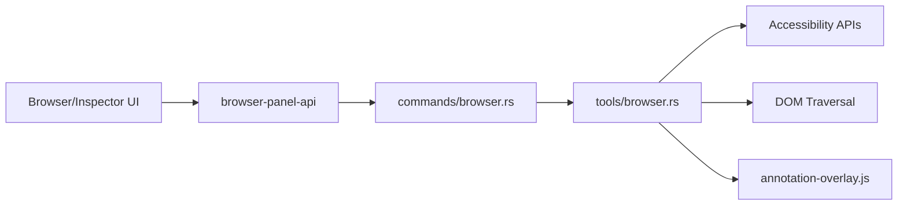

# Accessibility Testing & Analysis

<cite>
**Referenced Files in This Document**
- [README.md](file://README.md)
- [index.html](file://index.html)
- [App.tsx](file://src/App.tsx)
- [main.tsx](file://src/main.tsx)
- [vite.config.ts](file://vite.config.ts)
- [package.json](file://package.json)
- [browser/index.tsx](file://src/pages/browser/index.tsx)
- [browser/types.ts](file://src/pages/browser/types.ts)
- [browser/constants.ts](file://src/pages/browser/constants.ts)
- [browser/components/panel.tsx](file://src/pages/browser/components/panel.tsx)
- [browser/hooks/use-browser-session-events.ts](file://src/layout/hooks/use-browser-session-events.ts)
- [inspector/index.tsx](file://src/pages/inspector/index.tsx)
- [inspector/api.ts](file://src/pages/inspector/api.ts)
- [inspector/types.ts](file://src/pages/inspector/types.ts)
- [lib/browser-panel-api.ts](file://src/lib/browser-panel-api.ts)
- [lib/http-message.ts](file://src/lib/http-message.ts)
- [automation/actions.rs](file://src-tauri/src/automation/actions.rs)
- [automation/events.rs](file://src-tauri/src/automation/events.rs)
- [automation/execution.rs](file://src-tauri/src/automation/execution.rs)
- [commands/browser.rs](file://src-tauri/src/commands/browser.rs)
- [tools/browser.rs](file://src-tauri/src/tools/browser.rs)
- [resources/annotation-overlay.js](file://src-tauri/resources/annotation-overlay.js)
</cite>

## Table of Contents
1. [Introduction](#introduction)
2. [Project Structure](#project-structure)
3. [Core Components](#core-components)
4. [Architecture Overview](#architecture-overview)
5. [Detailed Component Analysis](#detailed-component-analysis)
6. [Dependency Analysis](#dependency-analysis)
7. [Performance Considerations](#performance-considerations)
8. [Troubleshooting Guide](#troubleshooting-guide)
9. [Conclusion](#conclusion)
10. [Appendices](#appendices)

## Introduction
This document explains Apprecon’s accessibility testing and analysis capabilities, focusing on how the application inspects DOM structure, ARIA attributes, and semantic markup; how automated checks can be integrated for WCAG compliance; color contrast analysis; keyboard navigation testing; issue identification and remediation reporting; validation of fixes; integration with screen readers and accessibility APIs; and best practices to avoid common pitfalls. It is written for both technical and non-technical users.

## Project Structure
Apprecon is a desktop application built with a Tauri backend (Rust) and a React frontend (TypeScript). The browser inspection and automation features are implemented across:
- Frontend pages for browser and inspector panels
- Shared libraries for panel communication and message handling
- Tauri commands and tools that bridge into the underlying browser engine
- Resources injected into target pages for live annotations and diagnostics

**Diagram sources**
- [browser/index.tsx](file://src/pages/browser/index.tsx)
- [inspector/index.tsx](file://src/pages/inspector/index.tsx)
- [lib/browser-panel-api.ts](file://src/lib/browser-panel-api.ts)
- [commands/browser.rs](file://src-tauri/src/commands/browser.rs)
- [tools/browser.rs](file://src-tauri/src/tools/browser.rs)
- [automation/actions.rs](file://src-tauri/src/automation/actions.rs)
- [resources/annotation-overlay.js](file://src-tauri/resources/annotation-overlay.js)

**Section sources**
- [README.md](file://README.md)
- [package.json](file://package.json)
- [vite.config.ts](file://vite.config.ts)
- [index.html](file://index.html)

## Core Components
- Browser Panel: Provides the main interface for inspecting and interacting with web pages, including access to the accessibility tree and DOM elements.
- Inspector Panel: Offers detailed element inspection, attribute viewing, and contextual actions.
- Automation Engine: Executes actions and events programmatically, enabling keyboard navigation simulation and interaction testing.
- Annotation Overlay: Injected script that highlights focusable elements and provides visual cues for accessibility debugging.
- Communication Layer: Bridges frontend requests to Tauri commands and tools, returning structured results for display.

Key responsibilities:
- Accessing and presenting the accessibility tree and computed styles
- Running or orchestrating automated checks (WCAG rules, contrast, keyboard flow)
- Capturing evidence (DOM snapshots, screenshots, logs)
- Generating reports and guiding remediation

**Section sources**
- [browser/index.tsx](file://src/pages/browser/index.tsx)
- [inspector/index.tsx](file://src/pages/inspector/index.tsx)
- [lib/browser-panel-api.ts](file://src/lib/browser-panel-api.ts)
- [automation/actions.rs](file://src-tauri/src/automation/actions.rs)
- [automation/events.rs](file://src-tauri/src/automation/events.rs)
- [automation/execution.rs](file://src-tauri/src/automation/execution.rs)
- [resources/annotation-overlay.js](file://src-tauri/resources/annotation-overlay.js)

## Architecture Overview
The accessibility analysis pipeline integrates the frontend UI, Tauri commands, browser tooling, and an injected overlay to collect data and present findings.

**Diagram sources**
- [lib/browser-panel-api.ts](file://src/lib/browser-panel-api.ts)
- [commands/browser.rs](file://src-tauri/src/commands/browser.rs)
- [tools/browser.rs](file://src-tauri/src/tools/browser.rs)
- [resources/annotation-overlay.js](file://src-tauri/resources/annotation-overlay.js)

## Detailed Component Analysis

### Accessibility Tree Panel
- Purpose: Displays the computed accessibility tree, roles, names, states, and relationships.
- Data Sources:
  - Accessibility tree via browser APIs
  - DOM traversal for structural context
  - ARIA attributes and computed labels/states
- UI Features:
  - Expandable tree view
  - Attribute inspector per node
  - Highlighting of focusable elements and landmarks
- Integration:
  - Requests go through the panel API to Tauri commands
  - Results are rendered in the tree and detail panes

**Diagram sources**
- [browser/index.tsx](file://src/pages/browser/index.tsx)
- [lib/browser-panel-api.ts](file://src/lib/browser-panel-api.ts)
- [commands/browser.rs](file://src-tauri/src/commands/browser.rs)
- [tools/browser.rs](file://src-tauri/src/tools/browser.rs)

**Section sources**
- [browser/index.tsx](file://src/pages/browser/index.tsx)
- [browser/types.ts](file://src/pages/browser/types.ts)
- [browser/constants.ts](file://src/pages/browser/constants.ts)
- [lib/browser-panel-api.ts](file://src/lib/browser-panel-api.ts)

### Inspector Panel
- Purpose: Deep-dive into selected elements, showing DOM, styles, and ARIA properties.
- Capabilities:
  - Element selection and highlighting
  - Attribute and computed style inspection
  - Contextual actions (copy selector, open in console)
- Workflow:
  - Selection event triggers API call
  - Tauri command returns structured details
  - UI renders attributes and related info

**Diagram sources**
- [inspector/index.tsx](file://src/pages/inspector/index.tsx)
- [inspector/api.ts](file://src/pages/inspector/api.ts)
- [lib/browser-panel-api.ts](file://src/lib/browser-panel-api.ts)
- [commands/browser.rs](file://src-tauri/src/commands/browser.rs)
- [tools/browser.rs](file://src-tauri/src/tools/browser.rs)

**Section sources**
- [inspector/index.tsx](file://src/pages/inspector/index.tsx)
- [inspector/api.ts](file://src/pages/inspector/api.ts)
- [inspector/types.ts](file://src/pages/inspector/types.ts)

### Automation and Keyboard Navigation Testing
- Purpose: Simulate user interactions to validate keyboard navigation and focus management.
- Mechanisms:
  - Action definitions (click, type, tab, arrow keys)
  - Event dispatching within the target page
  - Execution orchestration and state tracking
- Use Cases:
  - Tab order verification
  - Focus trapping detection
  - Custom key handlers validation

**Diagram sources**
- [automation/actions.rs](file://src-tauri/src/automation/actions.rs)
- [automation/events.rs](file://src-tauri/src/automation/events.rs)
- [automation/execution.rs](file://src-tauri/src/automation/execution.rs)

**Section sources**
- [automation/actions.rs](file://src-tauri/src/automation/actions.rs)
- [automation/events.rs](file://src-tauri/src/automation/events.rs)
- [automation/execution.rs](file://src-tauri/src/automation/execution.rs)

### Annotation Overlay and Visual Cues
- Purpose: Enhance manual accessibility reviews by visually indicating focusable elements, landmarks, and potential issues.
- Behavior:
  - Injected into target page
  - Highlights interactive elements
  - Shows focus indicators and role hints
- Integration:
  - Triggered by automation or inspection workflows
  - Communicates with Tauri tools for control

**Diagram sources**
- [resources/annotation-overlay.js](file://src-tauri/resources/annotation-overlay.js)
- [tools/browser.rs](file://src-tauri/src/tools/browser.rs)

**Section sources**
- [resources/annotation-overlay.js](file://src-tauri/resources/annotation-overlay.js)
- [tools/browser.rs](file://src-tauri/src/tools/browser.rs)

### Color Contrast Analysis
- Approach:
  - Extract foreground and background colors for text and UI components
  - Compute relative luminance and contrast ratios
  - Flag failures against WCAG thresholds (AA/AAA)
- Integration Points:
  - Computed styles via browser APIs
  - Presentation in the inspector or dedicated report
- Best Practices:
  - Ensure sufficient contrast for normal and large text
  - Avoid relying solely on color to convey information

[No sources needed since this section provides general guidance]

### Automated WCAG Checks
- Strategy:
  - Define rule sets aligned with WCAG criteria
  - Traverse AX tree and DOM to evaluate conditions
  - Aggregate findings with severity and location
- Implementation Hints:
  - Leverage browser accessibility APIs for roles, names, states
  - Combine static checks (HTML semantics) with dynamic checks (focus, ARIA usage)
  - Output structured results for reporting and filtering

[No sources needed since this section provides general guidance]

### Screen Reader and Accessibility API Integration
- Integration:
  - Use platform accessibility APIs exposed by the browser engine
  - Capture AX tree snapshots and element properties
  - Correlate with DOM and ARIA attributes for accurate representation
- Validation:
  - Cross-check computed labels and descriptions
  - Verify focus order matches expected logical flow

[No sources needed since this section provides general guidance]

### Issue Identification and Remediation Reports
- Process:
  - Collect findings from AX inspections, contrast checks, and automation runs
  - Categorize by severity and WCAG criterion
  - Generate actionable reports with evidence (selectors, snippets, screenshots)
- Delivery:
  - In-app viewer for quick triage
  - Export options for sharing with teams and CI systems

[No sources needed since this section provides general guidance]

### Validating Fixes
- Workflow:
  - Re-run targeted checks on fixed elements
  - Compare before/after snapshots
  - Confirm resolution and update status
- Automation:
  - Re-execute keyboard flows to ensure restored behavior
  - Validate that overlays and highlights reflect corrected state

[No sources needed since this section provides general guidance]

## Dependency Analysis
The accessibility features rely on clear boundaries between UI, API layer, Tauri commands, and browser tools.

**Diagram sources**
- [lib/browser-panel-api.ts](file://src/lib/browser-panel-api.ts)
- [commands/browser.rs](file://src-tauri/src/commands/browser.rs)
- [tools/browser.rs](file://src-tauri/src/tools/browser.rs)
- [resources/annotation-overlay.js](file://src-tauri/resources/annotation-overlay.js)

**Section sources**
- [lib/browser-panel-api.ts](file://src/lib/browser-panel-api.ts)
- [commands/browser.rs](file://src-tauri/src/commands/browser.rs)
- [tools/browser.rs](file://src-tauri/src/tools/browser.rs)

## Performance Considerations
- Minimize overhead:
  - Defer heavy AX queries until needed
  - Cache computed results where safe
- Efficient rendering:
  - Virtualize large AX trees
  - Batch updates to avoid reflows
- Network and IPC:
  - Coalesce requests
  - Stream large payloads when possible

[No sources needed since this section provides general guidance]

## Troubleshooting Guide
Common issues and resolutions:
- AX tree empty or incomplete:
  - Ensure target page has loaded fully
  - Check permissions and CSP restrictions
- Missing labels or roles:
  - Verify ARIA attributes and native semantics
  - Confirm computed name/state values
- Focus problems:
  - Validate tabindex usage and custom key handlers
  - Use annotation overlay to visualize focus flow
- Contrast failures:
  - Inspect computed colors and backgrounds
  - Adjust palette or add outlines/borders

[No sources needed since this section provides general guidance]

## Conclusion
Apprecon’s accessibility testing combines a robust AX tree inspector, automation-driven keyboard testing, and visual overlays to streamline identifying and fixing issues. By integrating with browser accessibility APIs and providing structured reporting, it supports both manual and automated workflows aligned with WCAG guidelines. Adopting the best practices outlined here will help teams build more inclusive experiences efficiently.

[No sources needed since this section summarizes without analyzing specific files]

## Appendices

### Best Practices for Accessible Web Development
- Use semantic HTML elements appropriately
- Provide descriptive labels and titles for all interactive controls
- Ensure visible focus indicators and logical tab order
- Maintain sufficient color contrast and avoid color-only cues
- Test with screen readers and keyboard-only navigation regularly
- Keep ARIA attributes minimal and correct; prefer native semantics

[No sources needed since this section provides general guidance]

### Common Pitfalls to Avoid
- Overuse of tabindex breaking natural focus order
- Hidden content not announced to assistive technologies
- Dynamic content changes without live region updates
- Complex widgets lacking proper roles and states
- Relying solely on visual design for meaning

[No sources needed since this section provides general guidance]