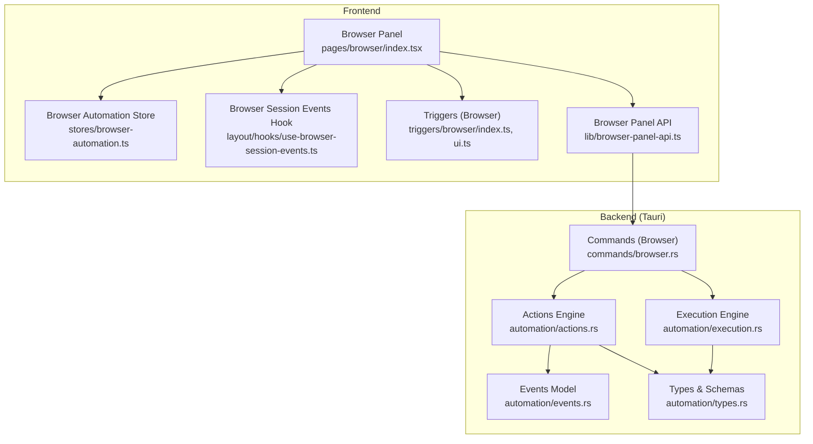
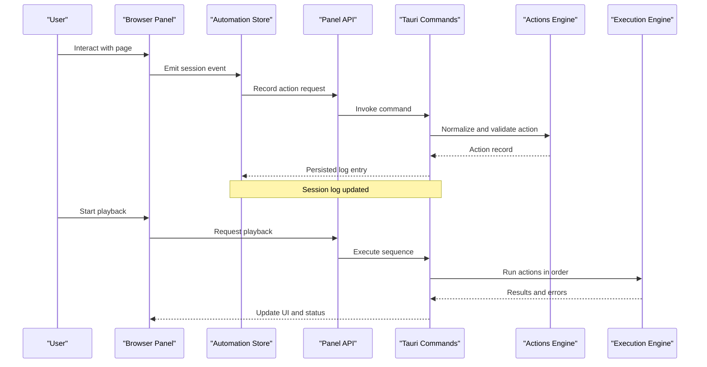
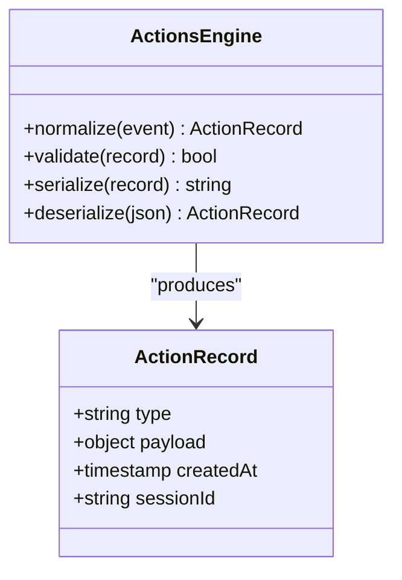
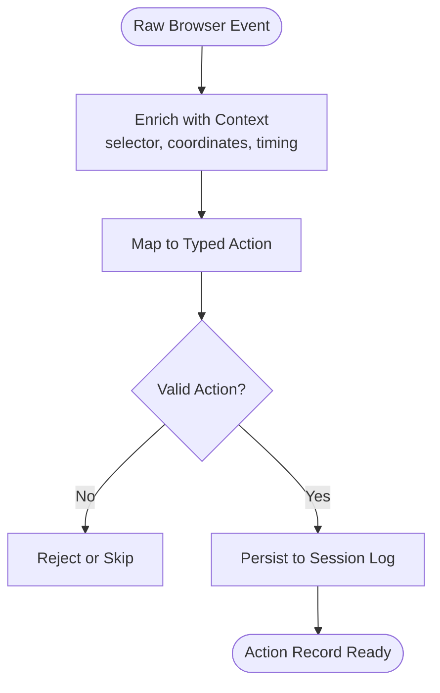
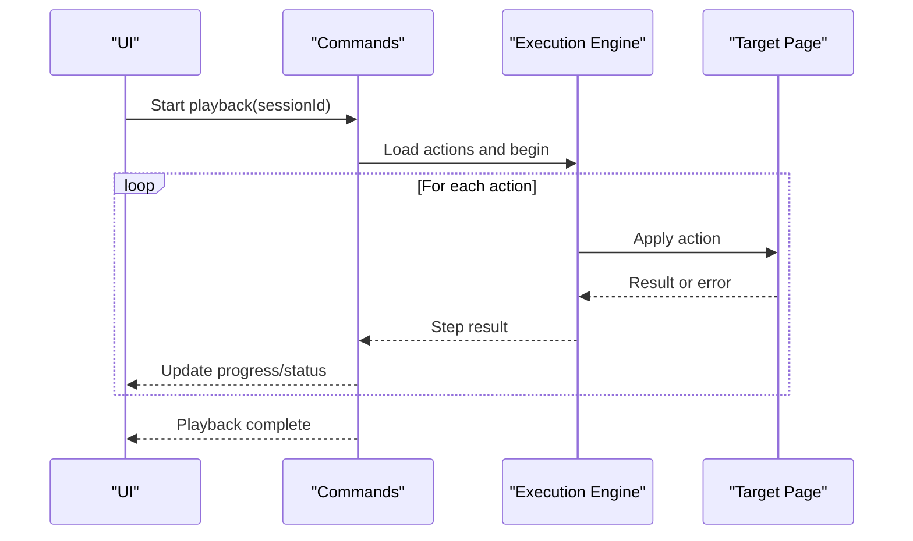
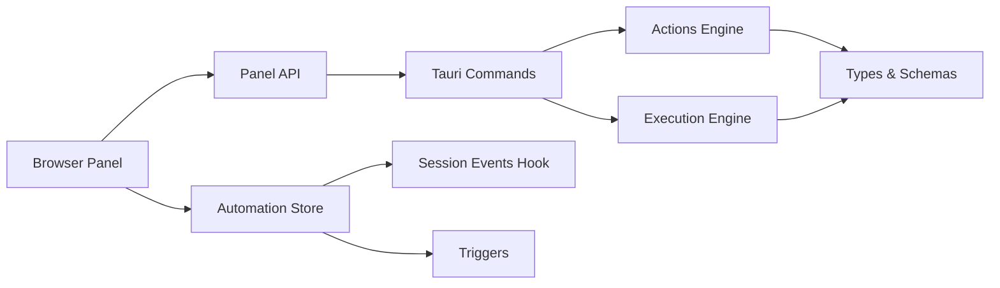

# Action Logging & Recording

<cite>
**Referenced Files in This Document**
- [automation/actions.rs](file://src-tauri/src/automation/actions.rs)
- [automation/events.rs](file://src-tauri/src/automation/events.rs)
- [automation/types.rs](file://src-tauri/src/automation/types.rs)
- [automation/execution.rs](file://src-tauri/src/automation/execution.rs)
- [commands/browser.rs](file://src-tauri/src/commands/browser.rs)
- [browser/index.tsx](file://src/pages/browser/index.tsx)
- [stores/browser-automation.ts](file://src/stores/browser-automation.ts)
- [layout/hooks/use-browser-session-events.ts](file://src/layout/hooks/use-browser-session-events.ts)
- [triggers/browser/index.ts](file://src/triggers/browser/index.ts)
- [triggers/browser/ui.ts](file://src/triggers/browser/ui.ts)
- [lib/browser-panel-api.ts](file://src/lib/browser-panel-api.ts)
</cite>

## Table of Contents
1. [Introduction](#introduction)
2. [Project Structure](#project-structure)
3. [Core Components](#core-components)
4. [Architecture Overview](#architecture-overview)
5. [Detailed Component Analysis](#detailed-component-analysis)
6. [Dependency Analysis](#dependency-analysis)
7. [Performance Considerations](#performance-considerations)
8. [Troubleshooting Guide](#troubleshooting-guide)
9. [Conclusion](#conclusion)
10. [Appendices](#appendices)

## Introduction
This document explains Apprecon’s action logging and recording functionality for browser automation. It covers how user interactions are captured, logged, filtered, replayed, and exported into test scripts. It also documents supported action types (clicks, form submissions, navigation), event delegation strategies, custom action handlers, integration points with testing frameworks, performance considerations for high-frequency logging, and storage management strategies.

## Project Structure
The action logging and recording system spans both the Tauri backend (Rust) and the frontend (TypeScript/React). The key areas include:
- Backend automation engine for actions, events, execution, and types
- Browser commands that bridge UI actions to the automation engine
- Frontend browser panel and stores for session state and event handling
- Triggers and hooks for UI-driven workflows and automation flows

**Diagram sources**
- [browser/index.tsx](file://src/pages/browser/index.tsx)
- [stores/browser-automation.ts](file://src/stores/browser-automation.ts)
- [layout/hooks/use-browser-session-events.ts](file://src/layout/hooks/use-browser-session-events.ts)
- [triggers/browser/index.ts](file://src/triggers/browser/index.ts)
- [triggers/browser/ui.ts](file://src/triggers/browser/ui.ts)
- [lib/browser-panel-api.ts](file://src/lib/browser-panel-api.ts)
- [commands/browser.rs](file://src-tauri/src/commands/browser.rs)
- [automation/actions.rs](file://src-tauri/src/automation/actions.rs)
- [automation/events.rs](file://src-tauri/src/automation/events.rs)
- [automation/execution.rs](file://src-tauri/src/automation/execution.rs)
- [automation/types.rs](file://src-tauri/src/automation/types.rs)

**Section sources**
- [browser/index.tsx](file://src/pages/browser/index.tsx)
- [stores/browser-automation.ts](file://src/stores/browser-automation.ts)
- [layout/hooks/use-browser-session-events.ts](file://src/layout/hooks/use-browser-session-events.ts)
- [triggers/browser/index.ts](file://src/triggers/browser/index.ts)
- [triggers/browser/ui.ts](file://src/triggers/browser/ui.ts)
- [lib/browser-panel-api.ts](file://src/lib/browser-panel-api.ts)
- [commands/browser.rs](file://src-tauri/src/commands/browser.rs)
- [automation/actions.rs](file://src-tauri/src/automation/actions.rs)
- [automation/events.rs](file://src-tauri/src/automation/events.rs)
- [automation/execution.rs](file://src-tauri/src/automation/execution.rs)
- [automation/types.rs](file://src-tauri/src/automation/types.rs)

## Core Components
- Actions Engine: Defines and validates discrete actions such as clicks, keystrokes, form submissions, and navigation. It normalizes inputs and produces canonical action records.
- Events Model: Provides a structured schema for capturing browser events and mapping them to actions. It supports metadata like selectors, coordinates, and timing.
- Execution Engine: Replays recorded actions deterministically, applying them against the target page context and reporting outcomes.
- Commands Bridge: Exposes Tauri commands for the frontend to start/stop recording, export sessions, and trigger playback.
- Browser Panel and Store: Hosts the UI for recording controls, session logs, filtering/search, and playback. It maintains session state and persists logs.
- Triggers and Hooks: Provide declarative hooks for UI-driven automation flows and integrate with external testing frameworks via triggers.

Key responsibilities:
- Capture: Intercept DOM events and translate them into typed actions.
- Log: Persist actions with timestamps, context, and optional payloads.
- Filter/Search: Allow users to filter by action type, selector, time range, and keywords.
- Replay: Execute actions in order with deterministic behavior and error reporting.
- Export: Generate test scripts or sequences in common formats.

**Section sources**
- [automation/actions.rs](file://src-tauri/src/automation/actions.rs)
- [automation/events.rs](file://src-tauri/src/automation/events.rs)
- [automation/execution.rs](file://src-tauri/src/automation/execution.rs)
- [commands/browser.rs](file://src-tauri/src/commands/browser.rs)
- [browser/index.tsx](file://src/pages/browser/index.tsx)
- [stores/browser-automation.ts](file://src/stores/browser-automation.ts)
- [layout/hooks/use-browser-session-events.ts](file://src/layout/hooks/use-browser-session-events.ts)
- [triggers/browser/index.ts](file://src/triggers/browser/index.ts)
- [triggers/browser/ui.ts](file://src/triggers/browser/ui.ts)
- [lib/browser-panel-api.ts](file://src/lib/browser-panel-api.ts)

## Architecture Overview
The system uses an event-driven pipeline:
- Frontend captures user interactions and emits session events.
- Tauri commands receive these events and convert them into actions.
- Actions are validated and stored in the session log.
- Playback executes actions sequentially, updating UI and reporting results.
- Export utilities serialize sessions into test script formats.

**Diagram sources**
- [browser/index.tsx](file://src/pages/browser/index.tsx)
- [stores/browser-automation.ts](file://src/stores/browser-automation.ts)
- [lib/browser-panel-api.ts](file://src/lib/browser-panel-api.ts)
- [commands/browser.rs](file://src-tauri/src/commands/browser.rs)
- [automation/actions.rs](file://src-tauri/src/automation/actions.rs)
- [automation/execution.rs](file://src-tauri/src/automation/execution.rs)

## Detailed Component Analysis

### Actions Engine
The actions engine defines supported action types and their schemas. Typical actions include:
- Click: element selection, coordinates, button, modifiers
- Keystroke: key codes, input focus context
- Form submission: form identifiers, field values, submit method
- Navigation: URL changes, history entries, redirects
- Scroll: viewport position, scroll targets

Validation ensures consistent structure and safe payloads. Normalization converts raw events into canonical action records suitable for persistence and replay.

**Diagram sources**
- [automation/actions.rs](file://src-tauri/src/automation/actions.rs)
- [automation/types.rs](file://src-tauri/src/automation/types.rs)

**Section sources**
- [automation/actions.rs](file://src-tauri/src/automation/actions.rs)
- [automation/types.rs](file://src-tauri/src/automation/types.rs)

### Events Model
The events model maps browser events to typed actions. It captures:
- Event type and target selector
- Coordinates and modifier keys
- Timing and frame context
- Optional payloads (e.g., form data)

It provides helpers to enrich raw events with contextual metadata required for reliable replay.

**Diagram sources**
- [automation/events.rs](file://src-tauri/src/automation/events.rs)
- [automation/types.rs](file://src-tauri/src/automation/types.rs)

**Section sources**
- [automation/events.rs](file://src-tauri/src/automation/events.rs)
- [automation/types.rs](file://src-tauri/src/automation/types.rs)

### Execution Engine
The execution engine replays recorded actions deterministically:
- Loads session log and iterates through actions
- Applies each action to the target page context
- Handles asynchronous operations and retries where applicable
- Reports success/failure and updates UI state

**Diagram sources**
- [automation/execution.rs](file://src-tauri/src/automation/execution.rs)
- [commands/browser.rs](file://src-tauri/src/commands/browser.rs)

**Section sources**
- [automation/execution.rs](file://src-tauri/src/automation/execution.rs)
- [commands/browser.rs](file://src-tauri/src/commands/browser.rs)

### Commands Bridge
Tauri commands expose capabilities to the frontend:
- Start/stop recording sessions
- Export session logs to various formats
- Trigger playback and report results
- Manage session lifecycle and storage

These commands encapsulate security and validation boundaries between the UI and automation engine.

**Section sources**
- [commands/browser.rs](file://src-tauri/src/commands/browser.rs)

### Browser Panel and Store
The browser panel hosts the recording UI:
- Recording controls (start/stop/pause)
- Session log viewer with filtering and search
- Playback controls and progress indicators
- Export options for test scripts

The store manages session state, logs, filters, and persistence. It integrates with hooks and triggers to coordinate automation flows.

**Section sources**
- [browser/index.tsx](file://src/pages/browser/index.tsx)
- [stores/browser-automation.ts](file://src/stores/browser-automation.ts)
- [layout/hooks/use-browser-session-events.ts](file://src/layout/hooks/use-browser-session-events.ts)
- [lib/browser-panel-api.ts](file://src/lib/browser-panel-api.ts)

### Triggers and Hooks
Triggers provide declarative automation hooks:
- UI-triggered workflows (e.g., “record this flow”)
- Integration points for external testing frameworks
- Custom action handlers for domain-specific behaviors

Hooks connect UI actions to backend commands and manage session lifecycle.

**Section sources**
- [triggers/browser/index.ts](file://src/triggers/browser/index.ts)
- [triggers/browser/ui.ts](file://src/triggers/browser/ui.ts)

## Dependency Analysis
The system exhibits clear separation of concerns:
- Frontend components depend on the automation store and panel API
- Commands bridge depends on the actions and execution engines
- Engines depend on shared types and schemas
- Triggers and hooks integrate UI and backend without tight coupling

**Diagram sources**
- [browser/index.tsx](file://src/pages/browser/index.tsx)
- [stores/browser-automation.ts](file://src/stores/browser-automation.ts)
- [lib/browser-panel-api.ts](file://src/lib/browser-panel-api.ts)
- [commands/browser.rs](file://src-tauri/src/commands/browser.rs)
- [automation/actions.rs](file://src-tauri/src/automation/actions.rs)
- [automation/execution.rs](file://src-tauri/src/automation/execution.rs)
- [automation/types.rs](file://src-tauri/src/automation/types.rs)
- [layout/hooks/use-browser-session-events.ts](file://src/layout/hooks/use-browser-session-events.ts)
- [triggers/browser/index.ts](file://src/triggers/browser/index.ts)

**Section sources**
- [browser/index.tsx](file://src/pages/browser/index.tsx)
- [stores/browser-automation.ts](file://src/stores/browser-automation.ts)
- [lib/browser-panel-api.ts](file://src/lib/browser-panel-api.ts)
- [commands/browser.rs](file://src-tauri/src/commands/browser.rs)
- [automation/actions.rs](file://src-tauri/src/automation/actions.rs)
- [automation/execution.rs](file://src-tauri/src/automation/execution.rs)
- [automation/types.rs](file://src-tauri/src/automation/types.rs)
- [layout/hooks/use-browser-session-events.ts](file://src/layout/hooks/use-browser-session-events.ts)
- [triggers/browser/index.ts](file://src/triggers/browser/index.ts)

## Performance Considerations
High-frequency action logging can impact UI responsiveness and memory usage. Recommended strategies:
- Batch writes: Accumulate actions and flush periodically to reduce I/O overhead
- Debounce events: Coalesce rapid events (e.g., mouse moves) into meaningful actions
- Lazy loading: Load large session logs on demand; paginate or virtualize lists
- Memory limits: Cap session size and rotate logs when thresholds are exceeded
- Efficient selectors: Prefer stable selectors and avoid heavy DOM queries during capture
- Background processing: Offload normalization and serialization to background threads

[No sources needed since this section provides general guidance]

## Troubleshooting Guide
Common issues and resolutions:
- Missing selectors: Ensure elements have stable identifiers; use fallback strategies
- Asynchronous actions: Add waits or retries for dynamic content
- Permission errors: Verify Tauri command permissions and CSP settings
- Large sessions: Split recordings or enable compression and pagination
- Playback failures: Inspect step logs and adjust action parameters or timing

**Section sources**
- [automation/execution.rs](file://src-tauri/src/automation/execution.rs)
- [commands/browser.rs](file://src-tauri/src/commands/browser.rs)
- [stores/browser-automation.ts](file://src/stores/browser-automation.ts)

## Conclusion
Apprecon’s action logging and recording system provides a robust foundation for capturing, analyzing, and replaying user interactions within the browser. By combining a typed actions engine, structured event modeling, and a resilient execution pipeline, it enables reliable automation workflows, test generation, and debugging. With careful attention to performance and storage management, it scales effectively for high-frequency logging and complex sessions.

[No sources needed since this section summarizes without analyzing specific files]

## Appendices

### Supported Action Types
- Click: Element clicks with coordinates and modifiers
- Keystroke: Keyboard input with focus context
- Form Submission: Submit forms with field values and methods
- Navigation: URL changes and history manipulation
- Scroll: Viewport scrolling and anchor navigation

**Section sources**
- [automation/actions.rs](file://src-tauri/src/automation/actions.rs)
- [automation/types.rs](file://src-tauri/src/automation/types.rs)

### Export Formats
- JSON: Structured session logs for analysis and integration
- Test Scripts: Common formats for popular testing frameworks
- CSV: Tabular logs for quick inspection and reporting

**Section sources**
- [commands/browser.rs](file://src-tauri/src/commands/browser.rs)
- [stores/browser-automation.ts](file://src/stores/browser-automation.ts)

### Debugging Interaction Sequences
- Use step-by-step playback to isolate failures
- Inspect enriched event metadata for context
- Review normalized action records for correctness
- Enable verbose logging during execution

**Section sources**
- [automation/execution.rs](file://src-tauri/src/automation/execution.rs)
- [automation/events.rs](file://src-tauri/src/automation/events.rs)