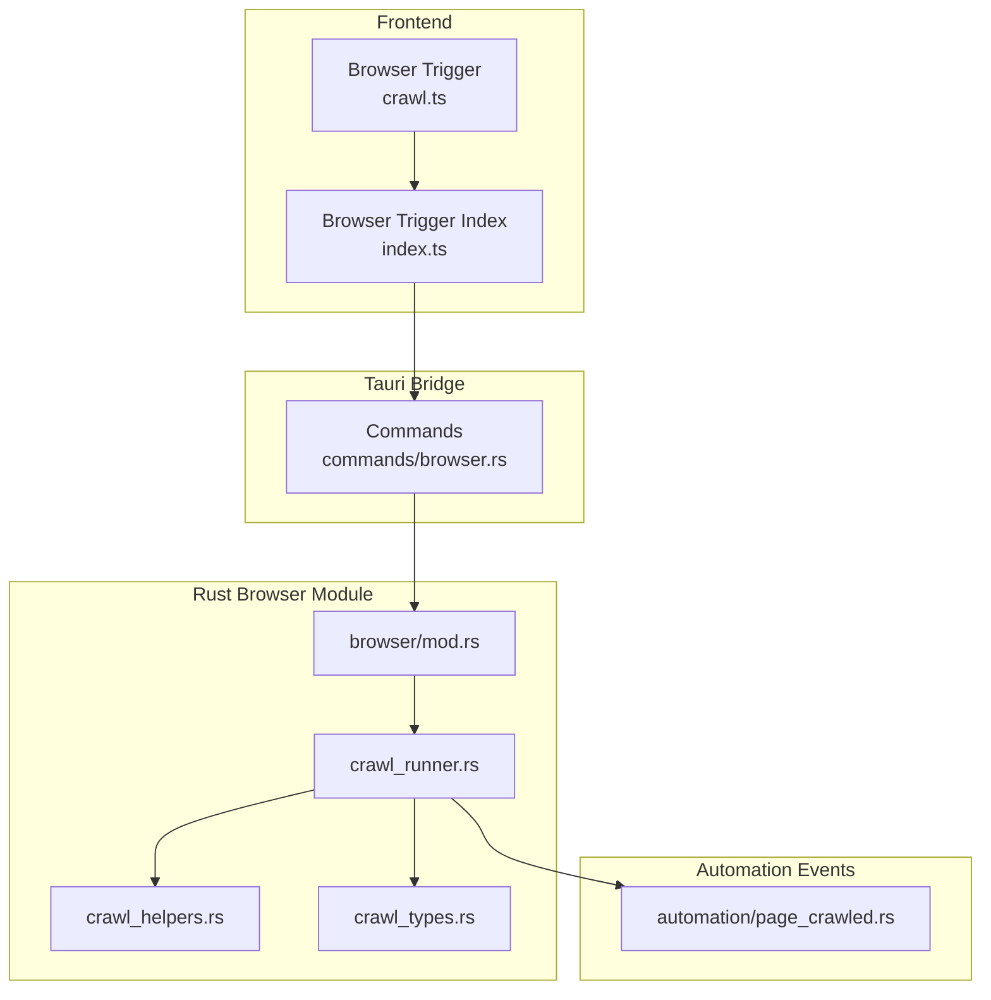
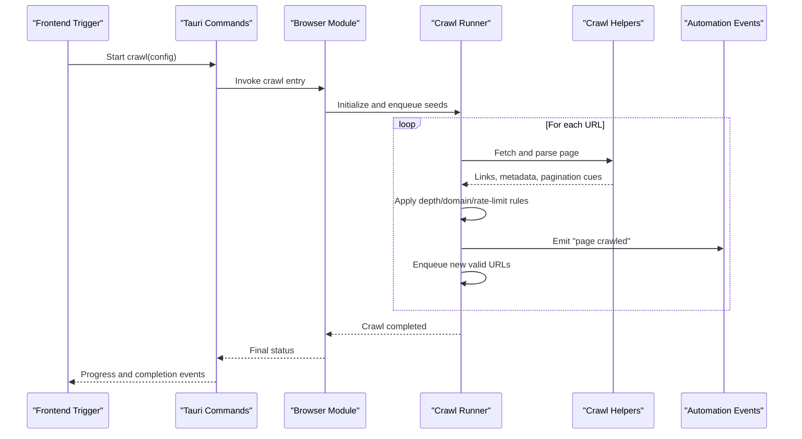
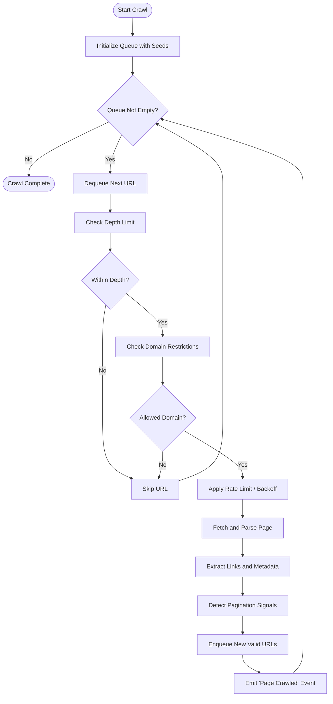
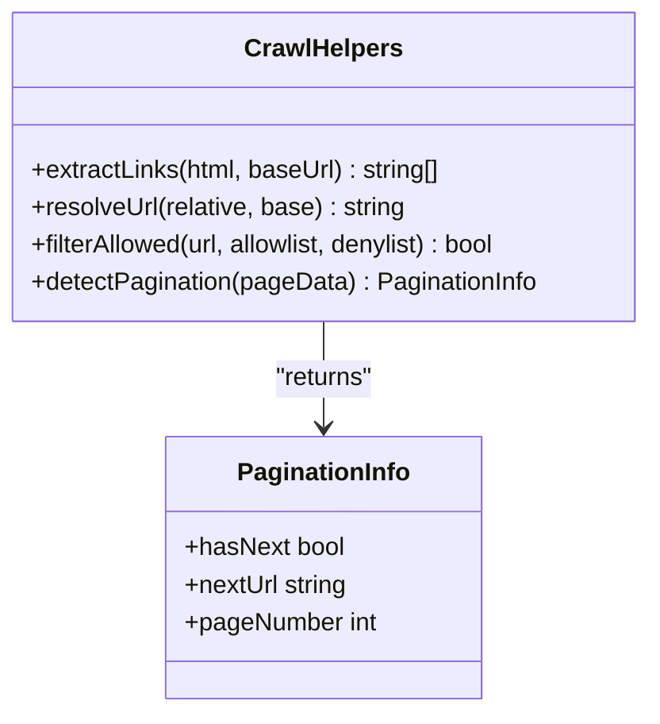
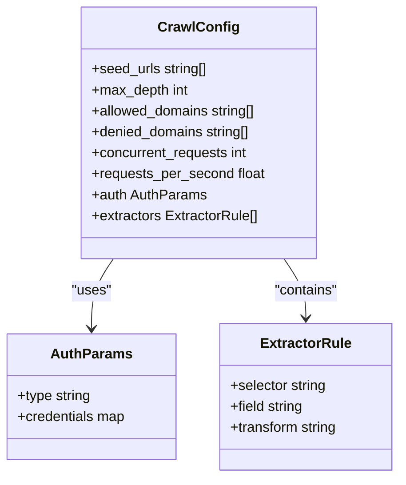
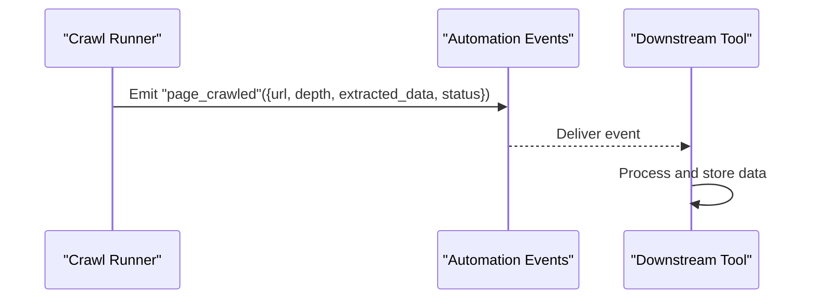
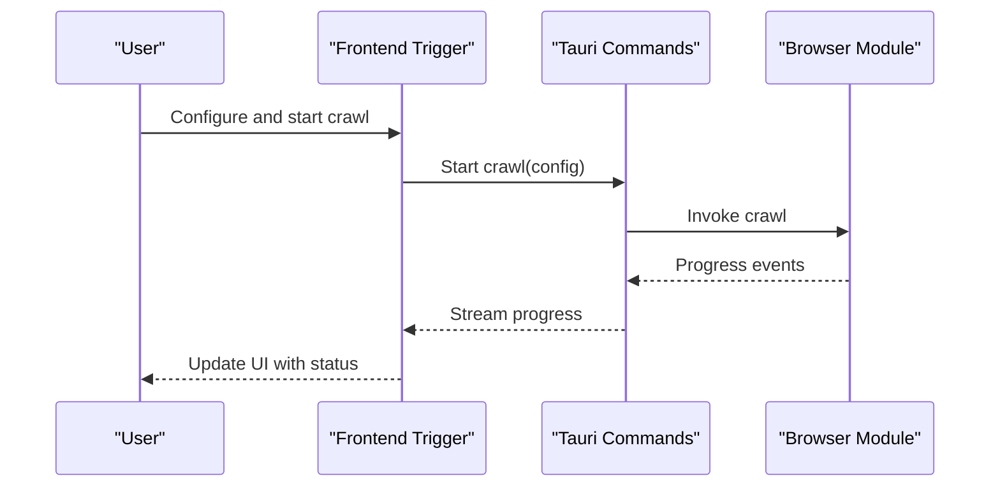
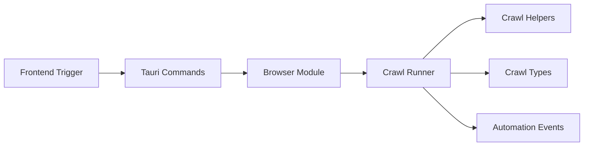

# Automated Site Crawling

<cite>
**Referenced Files in This Document**
- [crawl_runner.rs](file://src-tauri/src/browser/crawl_runner.rs)
- [crawl_helpers.rs](file://src-tauri/src/browser/crawl_helpers.rs)
- [crawl_types.rs](file://src-tauri/src/browser/crawl_types.rs)
- [mod.rs](file://src-tauri/src/browser/mod.rs)
- [page_crawled.rs](file://src-tauri/src/automation/page_crawled.rs)
- [crawl.ts](file://src/triggers/browser/crawl.ts)
- [index.ts](file://src/triggers/browser/index.ts)
</cite>

## Table of Contents
1. [Introduction](#introduction)
2. [Project Structure](#project-structure)
3. [Core Components](#core-components)
4. [Architecture Overview](#architecture-overview)
5. [Detailed Component Analysis](#detailed-component-analysis)
6. [Dependency Analysis](#dependency-analysis)
7. [Performance Considerations](#performance-considerations)
8. [Troubleshooting Guide](#troubleshooting-guide)
9. [Conclusion](#conclusion)

## Introduction
This document explains Apprecon’s automated site crawling capabilities, focusing on how the crawler discovers and navigates website structures, handles dynamic content, manages pagination, and exposes configuration for depth limits, domain restrictions, and rate limiting. It also covers data extraction from crawled pages, authentication scenarios, error handling and retries, progress monitoring, performance optimization for large-scale crawls, memory management, and integration points with other Apprecon tools for downstream analysis.

## Project Structure
The crawling subsystem is implemented primarily in Rust under the browser module and exposed to the frontend via triggers and automation events. Key files include:
- Crawl execution engine and orchestration
- Helper utilities for link discovery and navigation
- Type definitions for crawl configuration and results
- Automation event emission when a page is crawled
- Frontend trigger wiring to start crawls and observe progress

**Diagram sources**
- [crawl.ts](file://src/triggers/browser/crawl.ts)
- [index.ts](file://src/triggers/browser/index.ts)
- [mod.rs](file://src-tauri/src/browser/mod.rs)
- [crawl_runner.rs](file://src-tauri/src/browser/crawl_runner.rs)
- [crawl_helpers.rs](file://src-tauri/src/browser/crawl_helpers.rs)
- [crawl_types.rs](file://src-tauri/src/browser/crawl_types.rs)
- [page_crawled.rs](file://src-tauri/src/automation/page_crawled.rs)

**Section sources**
- [mod.rs](file://src-tauri/src/browser/mod.rs)
- [crawl_runner.rs](file://src-tauri/src/browser/crawl_runner.rs)
- [crawl_helpers.rs](file://src-tauri/src/browser/crawl_helpers.rs)
- [crawl_types.rs](file://src-tauri/src/browser/crawl_types.rs)
- [page_crawled.rs](file://src-tauri/src/automation/page_crawled.rs)
- [crawl.ts](file://src/triggers/browser/crawl.ts)
- [index.ts](file://src/triggers/browser/index.ts)

## Core Components
- Crawl runner: Orchestrates the crawl lifecycle, including queueing URLs, enforcing depth and domain constraints, applying rate limits, and emitting events as pages are processed.
- Crawl helpers: Provide utilities for extracting links from HTML, resolving relative URLs, filtering by allowed domains, and handling pagination patterns.
- Crawl types: Define configuration options (depth limits, concurrency, rate limiting), session/authentication parameters, and result structures for extracted data.
- Automation event emitter: Publishes “page crawled” events that can be consumed by other Apprecon features for analysis or storage.
- Frontend trigger: Exposes UI/API entry points to initiate crawls and subscribe to progress updates.

**Section sources**
- [crawl_runner.rs](file://src-tauri/src/browser/crawl_runner.rs)
- [crawl_helpers.rs](file://src-tauri/src/browser/crawl_helpers.rs)
- [crawl_types.rs](file://src-tauri/src/browser/crawl_types.rs)
- [page_crawled.rs](file://src-tauri/src/automation/page_crawled.rs)
- [crawl.ts](file://src/triggers/browser/crawl.ts)

## Architecture Overview
The crawler follows a producer-consumer pattern:
- The frontend trigger initiates a crawl with configuration.
- The Tauri bridge invokes the Rust browser module.
- The crawl runner enqueues initial URLs and processes them concurrently within configured limits.
- For each page, helpers extract links and metadata; pagination is handled by recognizing next-page signals.
- As pages complete, automation events are emitted for downstream consumption.

**Diagram sources**
- [crawl_runner.rs](file://src-tauri/src/browser/crawl_runner.rs)
- [crawl_helpers.rs](file://src-tauri/src/browser/crawl_helpers.rs)
- [page_crawled.rs](file://src-tauri/src/automation/page_crawled.rs)
- [crawl.ts](file://src/triggers/browser/crawl.ts)

## Detailed Component Analysis

### Crawl Runner
Responsibilities:
- Manage the crawl queue and concurrency.
- Enforce depth limits and domain allowlists/denylists.
- Apply rate limiting and backoff strategies.
- Track progress and emit completion signals.

Key behaviors:
- Seed initialization from provided starting URLs.
- Iterative processing until the queue is empty or limits are reached.
- Integration with helpers for link extraction and pagination detection.
- Event emission after successful page processing.

**Diagram sources**
- [crawl_runner.rs](file://src-tauri/src/browser/crawl_runner.rs)
- [crawl_helpers.rs](file://src-tauri/src/browser/crawl_helpers.rs)
- [page_crawled.rs](file://src-tauri/src/automation/page_crawled.rs)

**Section sources**
- [crawl_runner.rs](file://src-tauri/src/browser/crawl_runner.rs)

### Crawl Helpers
Responsibilities:
- Parse HTML to discover anchor tags and other navigational elements.
- Resolve relative URLs against base URLs.
- Filter out non-http(s) schemes and disallowed paths.
- Identify pagination patterns (e.g., “next” links, numbered pages).

Key behaviors:
- Normalize URLs and canonicalize paths.
- Deduplicate discovered URLs to avoid redundant work.
- Support optional selectors or heuristics for pagination detection.

**Diagram sources**
- [crawl_helpers.rs](file://src-tauri/src/browser/crawl_helpers.rs)
- [crawl_types.rs](file://src-tauri/src/browser/crawl_types.rs)

**Section sources**
- [crawl_helpers.rs](file://src-tauri/src/browser/crawl_helpers.rs)
- [crawl_types.rs](file://src-tauri/src/browser/crawl_types.rs)

### Crawl Types
Responsibilities:
- Define configuration schema for crawls (depth, concurrency, rate limit, domain filters).
- Represent session and authentication parameters.
- Model crawl results and extracted data structures.

Key fields typically include:
- seed_urls: Starting URLs for the crawl.
- max_depth: Maximum traversal depth.
- allowed_domains / denied_domains: Domain policy.
- concurrent_requests: Concurrency cap.
- requests_per_second: Rate limit.
- auth: Optional credentials or tokens.
- extractors: Rules for extracting structured data from pages.

**Diagram sources**
- [crawl_types.rs](file://src-tauri/src/browser/crawl_types.rs)

**Section sources**
- [crawl_types.rs](file://src-tauri/src/browser/crawl_types.rs)

### Automation Events
Responsibilities:
- Emit standardized events when a page is crawled successfully.
- Include metadata such as URL, depth, extracted fields, and timestamps.
- Enable downstream consumers (analysis tools, storage pipelines) to react to crawl progress.

Event payload typically includes:
- url: The processed page URL.
- depth: Current crawl depth.
- extracted_data: Structured data based on extractor rules.
- status: Success/failure indicators.
- timestamp: When the event occurred.

**Diagram sources**
- [page_crawled.rs](file://src-tauri/src/automation/page_crawled.rs)
- [crawl_runner.rs](file://src-tauri/src/browser/crawl_runner.rs)

**Section sources**
- [page_crawled.rs](file://src-tauri/src/automation/page_crawled.rs)

### Frontend Trigger
Responsibilities:
- Provide UI/API entry points to start crawls with configuration.
- Subscribe to progress and completion events.
- Display real-time crawl status and results.

Typical workflow:
- User inputs crawl settings and target URLs.
- Trigger sends configuration to Tauri commands.
- Listener receives progress updates and renders them.

**Diagram sources**
- [crawl.ts](file://src/triggers/browser/crawl.ts)
- [index.ts](file://src/triggers/browser/index.ts)

**Section sources**
- [crawl.ts](file://src/triggers/browser/crawl.ts)
- [index.ts](file://src/triggers/browser/index.ts)

## Dependency Analysis
The crawling subsystem has clear boundaries:
- Frontend triggers depend on Tauri commands to invoke backend logic.
- The Rust browser module encapsulates the crawl runner and helpers.
- Automation events decouple the crawler from downstream consumers.

**Diagram sources**
- [crawl.ts](file://src/triggers/browser/crawl.ts)
- [index.ts](file://src/triggers/browser/index.ts)
- [mod.rs](file://src-tauri/src/browser/mod.rs)
- [crawl_runner.rs](file://src-tauri/src/browser/crawl_runner.rs)
- [crawl_helpers.rs](file://src-tauri/src/browser/crawl_helpers.rs)
- [crawl_types.rs](file://src-tauri/src/browser/crawl_types.rs)
- [page_crawled.rs](file://src-tauri/src/automation/page_crawled.rs)

**Section sources**
- [mod.rs](file://src-tauri/src/browser/mod.rs)
- [crawl_runner.rs](file://src-tauri/src/browser/crawl_runner.rs)
- [crawl_helpers.rs](file://src-tauri/src/browser/crawl_helpers.rs)
- [crawl_types.rs](file://src-tauri/src/browser/crawl_types.rs)
- [page_crawled.rs](file://src-tauri/src/automation/page_crawled.rs)

## Performance Considerations
- Concurrency control: Use concurrent_requests to balance throughput and resource usage.
- Rate limiting: Set requests_per_second to respect server policies and avoid throttling.
- Depth limits: Cap max_depth to prevent runaway crawls on deep sites.
- Domain restrictions: Narrow scope using allowed_domains and denied_domains to reduce unnecessary work.
- Memory management: Avoid retaining full page payloads; prefer streaming parsing and incremental extraction.
- Deduplication: Maintain an in-memory set of visited URLs to prevent reprocessing.
- Pagination efficiency: Detect and follow only necessary next-page links to minimize redundant fetches.
- Backpressure: Pause or throttle when downstream consumers lag to prevent queue growth.

[No sources needed since this section provides general guidance]

## Troubleshooting Guide
Common issues and resolutions:
- Authentication failures: Ensure auth parameters are correctly configured and tokens are refreshed if required.
- Rate limiting errors: Reduce requests_per_second or implement exponential backoff.
- Domain mismatch: Verify allowed_domains and denied_domains lists; ensure base URLs resolve correctly.
- Pagination not detected: Adjust pagination heuristics or selectors in extractors.
- High memory usage: Stream responses, avoid storing entire DOM trees, and release resources promptly.
- Stalled crawls: Monitor queue length and progress events; investigate network timeouts and retry policies.

**Section sources**
- [crawl_runner.rs](file://src-tauri/src/browser/crawl_runner.rs)
- [crawl_helpers.rs](file://src-tauri/src/browser/crawl_helpers.rs)
- [crawl_types.rs](file://src-tauri/src/browser/crawl_types.rs)
- [page_crawled.rs](file://src-tauri/src/automation/page_crawled.rs)

## Conclusion
Apprecon’s automated site crawling system provides a robust, configurable framework for discovering and navigating websites at scale. With explicit controls for depth, domain restrictions, and rate limiting, it supports both static and dynamic content through helper-driven link extraction and pagination detection. The modular architecture enables seamless integration with downstream tools via automation events, while performance-oriented design ensures efficient operation on large sites. By tuning configuration and leveraging the provided hooks, users can tailor crawls to diverse site types and analytical workflows.

[No sources needed since this section summarizes without analyzing specific files]