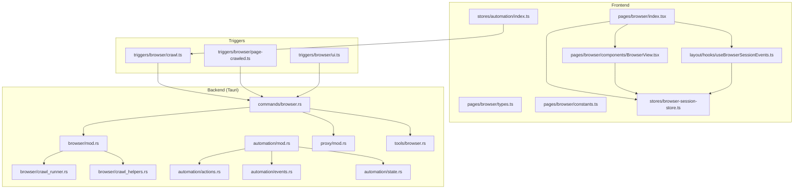
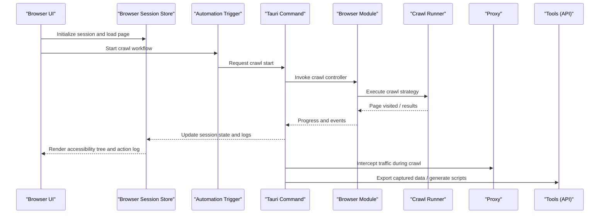
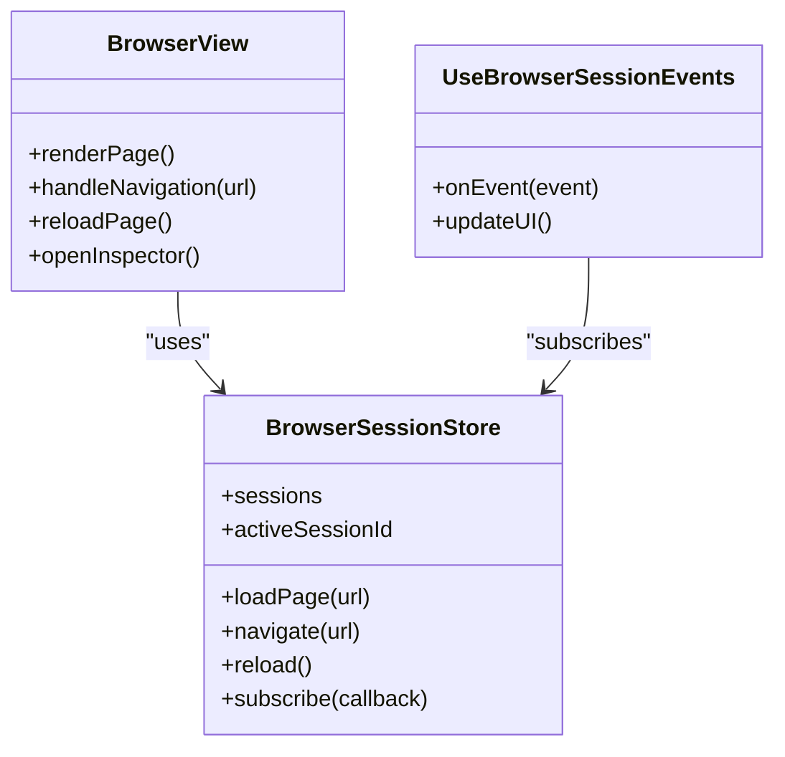
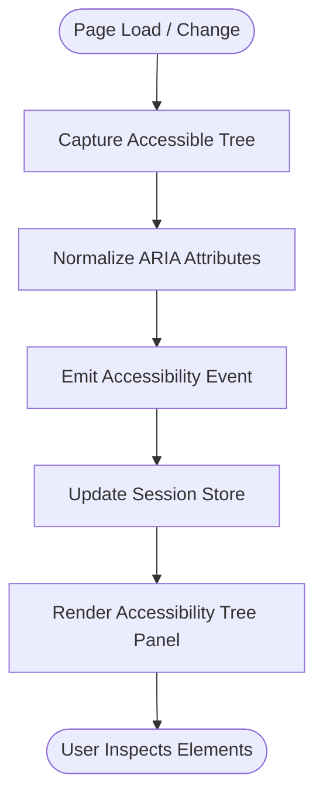
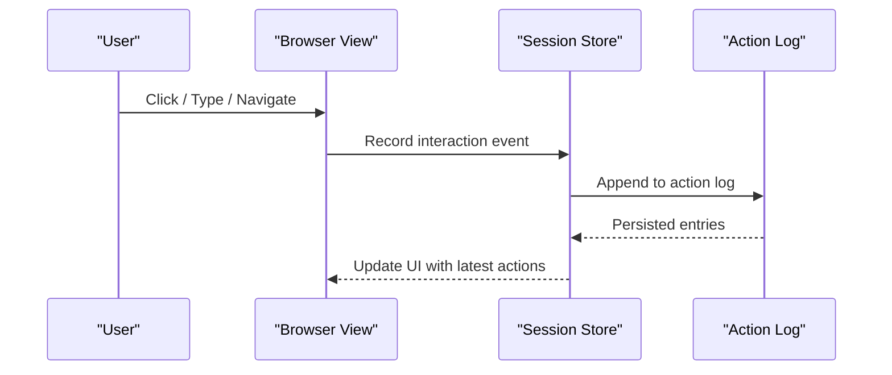
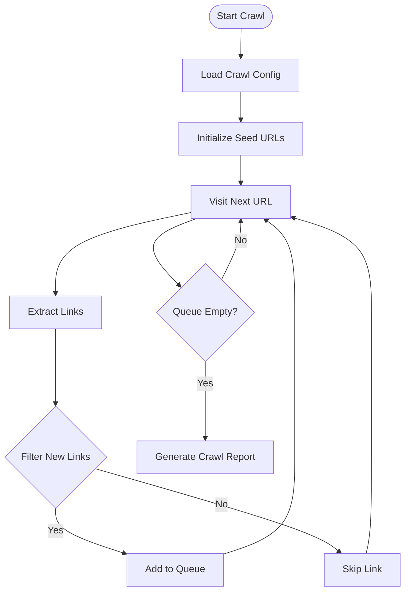
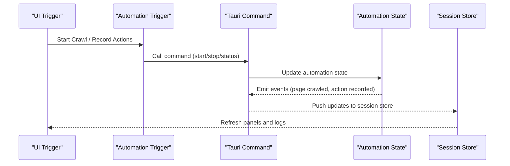
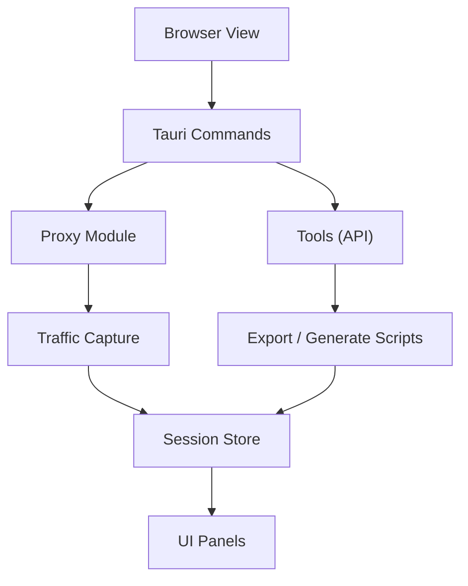
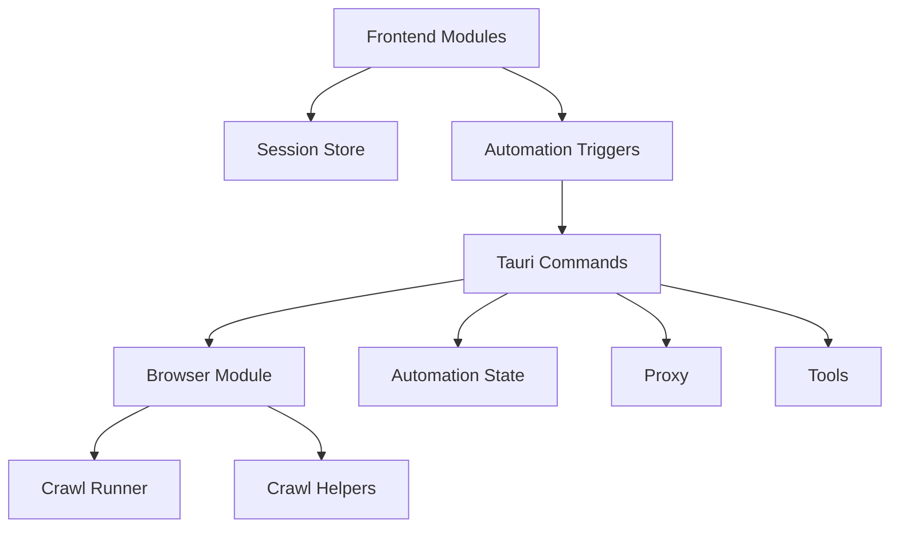

# Browser Automation & Inspection

<cite>
**Referenced Files in This Document**
- [browser/index.tsx](file://src/pages/browser/index.tsx)
- [browser/constants.ts](file://src/pages/browser/constants.ts)
- [browser/types.ts](file://src/pages/browser/types.ts)
- [browser/components/BrowserView.tsx](file://src/pages/browser/components/BrowserView.tsx)
- [browser/hooks/useBrowserSessionEvents.ts](file://src/layout/hooks/useBrowserSessionEvents.ts)
- [stores/browser-session-store.ts](file://src/stores/browser-session-store.ts)
- [stores/automation/index.ts](file://src/stores/automation/index.ts)
- [triggers/browser/crawl.ts](file://src/triggers/browser/crawl.ts)
- [triggers/browser/page-crawled.ts](file://src/triggers/browser/page-crawled.ts)
- [triggers/browser/ui.ts](file://src/triggers/browser/ui.ts)
- [src-tauri/src/browser/mod.rs](file://src-tauri/src/browser/mod.rs)
- [src-tauri/src/browser/crawl_runner.rs](file://src-tauri/src/browser/crawl_runner.rs)
- [src-tauri/src/browser/crawl_helpers.rs](file://src-tauri/src/browser/crawl_helpers.rs)
- [src-tauri/src/commands/browser.rs](file://src-tauri/src/commands/browser.rs)
- [src-tauri/src/automation/mod.rs](file://src-tauri/src/automation/mod.rs)
- [src-tauri/src/automation/actions.rs](file://src-tauri/src/automation/actions.rs)
- [src-tauri/src/automation/events.rs](file://src-tauri/src/automation/events.rs)
- [src-tauri/src/automation/state.rs](file://src-tauri/src/automation/state.rs)
- [src-tauri/src/proxy/mod.rs](file://src-tauri/src/proxy/mod.rs)
- [src-tauri/src/tools/browser.rs](file://src-tauri/src/tools/browser.rs)
</cite>

## Table of Contents
1. [Introduction](#introduction)
2. [Project Structure](#project-structure)
3. [Core Components](#core-components)
4. [Architecture Overview](#architecture-overview)
5. [Detailed Component Analysis](#detailed-component-analysis)
6. [Dependency Analysis](#dependency-analysis)
7. [Performance Considerations](#performance-considerations)
8. [Troubleshooting Guide](#troubleshooting-guide)
9. [Conclusion](#conclusion)

## Introduction
This document explains Apprecon’s browser automation and inspection capabilities, focusing on the built-in browser for automated crawling, accessibility testing, and UI interaction recording. It covers the accessibility tree panel for DOM and ARIA analysis, the action log panel for tracking user interactions, and the crawl functionality for automated site exploration. It also provides guidance on setting up automation workflows, capturing actions, generating test scripts, integrating with traffic interception and API testing within browser contexts, and addresses performance, debugging, and troubleshooting.

## Project Structure
Apprecon implements browser automation across both frontend (React/Tauri webview) and backend (Rust Tauri commands). The key areas include:
- Frontend browser page and components for rendering and interacting with pages
- Session store and hooks for managing browser events and state
- Automation triggers and stores for orchestrating crawls and actions
- Rust modules for crawl execution, helpers, and command bridges
- Proxy integration for traffic interception and API testing within browser contexts

**Diagram sources**
- [browser/index.tsx](file://src/pages/browser/index.tsx)
- [browser/components/BrowserView.tsx](file://src/pages/browser/components/BrowserView.tsx)
- [browser/types.ts](file://src/pages/browser/types.ts)
- [browser/constants.ts](file://src/pages/browser/constants.ts)
- [useBrowserSessionEvents.ts](file://src/layout/hooks/useBrowserSessionEvents.ts)
- [browser-session-store.ts](file://src/stores/browser-session-store.ts)
- [automation/index.ts](file://src/stores/automation/index.ts)
- [crawl.ts](file://src/triggers/browser/crawl.ts)
- [page-crawled.ts](file://src/triggers/browser/page-crawled.ts)
- [ui.ts](file://src/triggers/browser/ui.ts)
- [browser.rs](file://src-tauri/src/commands/browser.rs)
- [mod.rs](file://src-tauri/src/browser/mod.rs)
- [crawl_runner.rs](file://src-tauri/src/browser/crawl_runner.rs)
- [crawl_helpers.rs](file://src-tauri/src/browser/crawl_helpers.rs)
- [mod.rs](file://src-tauri/src/automation/mod.rs)
- [actions.rs](file://src-tauri/src/automation/actions.rs)
- [events.rs](file://src-tauri/src/automation/events.rs)
- [state.rs](file://src-tauri/src/automation/state.rs)
- [proxy/mod.rs](file://src-tauri/src/proxy/mod.rs)
- [browser.rs](file://src-tauri/src/tools/browser.rs)

**Section sources**
- [browser/index.tsx](file://src/pages/browser/index.tsx)
- [browser/components/BrowserView.tsx](file://src/pages/browser/components/BrowserView.tsx)
- [browser/types.ts](file://src/pages/browser/types.ts)
- [browser/constants.ts](file://src/pages/browser/constants.ts)
- [useBrowserSessionEvents.ts](file://src/layout/hooks/useBrowserSessionEvents.ts)
- [browser-session-store.ts](file://src/stores/browser-session-store.ts)
- [automation/index.ts](file://src/stores/automation/index.ts)
- [crawl.ts](file://src/triggers/browser/crawl.ts)
- [page-crawled.ts](file://src/triggers/browser/page-crawled.ts)
- [ui.ts](file://src/triggers/browser/ui.ts)
- [browser.rs](file://src-tauri/src/commands/browser.rs)
- [mod.rs](file://src-tauri/src/browser/mod.rs)
- [crawl_runner.rs](file://src-tauri/src/browser/crawl_runner.rs)
- [crawl_helpers.rs](file://src-tauri/src/browser/crawl_helpers.rs)
- [mod.rs](file://src-tauri/src/automation/mod.rs)
- [actions.rs](file://src-tauri/src/automation/actions.rs)
- [events.rs](file://src-tauri/src/automation/events.rs)
- [state.rs](file://src-tauri/src/automation/state.rs)
- [proxy/mod.rs](file://src-tauri/src/proxy/mod.rs)
- [browser.rs](file://src-tauri/src/tools/browser.rs)

## Core Components
- Built-in Browser View: Renders a navigable page within Apprecon and exposes controls for navigation, reloading, and inspecting content.
- Accessibility Tree Panel: Displays an accessible representation of the DOM, including roles, states, and ARIA attributes to support accessibility testing.
- Action Log Panel: Records user interactions such as clicks, keystrokes, and navigation events for later replay or script generation.
- Crawl Functionality: Automates site exploration by following links and visiting pages according to configured rules and constraints.
- Automation Triggers: Orchestrate crawl runs, handle page-crawled events, and provide UI hooks for starting and controlling automation.
- Backend Commands: Bridge frontend requests to Rust-based browser control, crawl execution, and tool integrations.

Key responsibilities:
- Manage session lifecycle and event propagation between frontend and backend
- Provide structured data for accessibility inspection and action logging
- Execute crawl strategies and report progress/results
- Integrate with proxy and tools for traffic capture and API testing

**Section sources**
- [browser/index.tsx](file://src/pages/browser/index.tsx)
- [browser/components/BrowserView.tsx](file://src/pages/browser/components/BrowserView.tsx)
- [browser/types.ts](file://src/pages/browser/types.ts)
- [browser/constants.ts](file://src/pages/browser/constants.ts)
- [useBrowserSessionEvents.ts](file://src/layout/hooks/useBrowserSessionEvents.ts)
- [browser-session-store.ts](file://src/stores/browser-session-store.ts)
- [crawl.ts](file://src/triggers/browser/crawl.ts)
- [page-crawled.ts](file://src/triggers/browser/page-crawled.ts)
- [ui.ts](file://src/triggers/browser/ui.ts)
- [browser.rs](file://src-tauri/src/commands/browser.rs)
- [mod.rs](file://src-tauri/src/browser/mod.rs)
- [crawl_runner.rs](file://src-tauri/src/browser/crawl_runner.rs)
- [crawl_helpers.rs](file://src-tauri/src/browser/crawl_helpers.rs)
- [mod.rs](file://src-tauri/src/automation/mod.rs)
- [actions.rs](file://src-tauri/src/automation/actions.rs)
- [events.rs](file://src-tauri/src/automation/events.rs)
- [state.rs](file://src-tauri/src/automation/state.rs)

## Architecture Overview
The browser automation architecture spans React components, stores, and Rust commands:
- Frontend initiates actions via UI and automation triggers
- Commands route to browser module which coordinates crawl runner and helpers
- Automation subsystem manages actions, events, and state
- Proxy integration enables traffic interception and API testing within browser contexts

**Diagram sources**
- [browser/index.tsx](file://src/pages/browser/index.tsx)
- [browser-session-store.ts](file://src/stores/browser-session-store.ts)
- [crawl.ts](file://src/triggers/browser/crawl.ts)
- [browser.rs](file://src-tauri/src/commands/browser.rs)
- [mod.rs](file://src-tauri/src/browser/mod.rs)
- [crawl_runner.rs](file://src-tauri/src/browser/crawl_runner.rs)
- [proxy/mod.rs](file://src-tauri/src/proxy/mod.rs)
- [browser.rs](file://src-tauri/src/tools/browser.rs)

## Detailed Component Analysis

### Built-in Browser and Session Management
The browser view component renders the target page and integrates with the session store to manage navigation, reloads, and inspection panels. The session store tracks active sessions, current URLs, and emitted events for UI updates. Hooks subscribe to session events to keep the UI synchronized with backend state.

**Diagram sources**
- [browser/components/BrowserView.tsx](file://src/pages/browser/components/BrowserView.tsx)
- [browser-session-store.ts](file://src/stores/browser-session-store.ts)
- [useBrowserSessionEvents.ts](file://src/layout/hooks/useBrowserSessionEvents.ts)

**Section sources**
- [browser/components/BrowserView.tsx](file://src/pages/browser/components/BrowserView.tsx)
- [browser-session-store.ts](file://src/stores/browser-session-store.ts)
- [useBrowserSessionEvents.ts](file://src/layout/hooks/useBrowserSessionEvents.ts)

### Accessibility Tree Panel
The accessibility tree panel presents an accessible representation of the DOM, including roles, states, and ARIA attributes. It is updated whenever the page changes or when specific events occur. Data flows from the backend through commands into the session store and then to the UI panel.

**Diagram sources**
- [browser.rs](file://src-tauri/src/commands/browser.rs)
- [browser-session-store.ts](file://src/stores/browser-session-store.ts)

**Section sources**
- [browser.rs](file://src-tauri/src/commands/browser.rs)
- [browser-session-store.ts](file://src/stores/browser-session-store.ts)

### Action Log Panel
The action log panel records user interactions such as clicks, keystrokes, and navigation events. These logs are stored in the session store and can be exported or replayed to generate test scripts.

**Diagram sources**
- [browser/components/BrowserView.tsx](file://src/pages/browser/components/BrowserView.tsx)
- [browser-session-store.ts](file://src/stores/browser-session-store.ts)

**Section sources**
- [browser/components/BrowserView.tsx](file://src/pages/browser/components/BrowserView.tsx)
- [browser-session-store.ts](file://src/stores/browser-session-store.ts)

### Crawl Functionality
Crawl functionality automates site exploration by following links and visiting pages based on configuration. The trigger initiates a crawl, which is executed by the backend crawl runner using helpers for link extraction and navigation.

**Diagram sources**
- [crawl.ts](file://src/triggers/browser/crawl.ts)
- [crawl_runner.rs](file://src-tauri/src/browser/crawl_runner.rs)
- [crawl_helpers.rs](file://src-tauri/src/browser/crawl_helpers.rs)

**Section sources**
- [crawl.ts](file://src/triggers/browser/crawl.ts)
- [crawl_runner.rs](file://src-tauri/src/browser/crawl_runner.rs)
- [crawl_helpers.rs](file://src-tauri/src/browser/crawl_helpers.rs)

### Automation Triggers and Events
Automation triggers coordinate crawl initiation, page-crawled events, and UI interactions. They interact with Tauri commands to execute actions and update state.

**Diagram sources**
- [crawl.ts](file://src/triggers/browser/crawl.ts)
- [page-crawled.ts](file://src/triggers/browser/page-crawled.ts)
- [ui.ts](file://src/triggers/browser/ui.ts)
- [browser.rs](file://src-tauri/src/commands/browser.rs)
- [mod.rs](file://src-tauri/src/automation/mod.rs)
- [state.rs](file://src-tauri/src/automation/state.rs)
- [browser-session-store.ts](file://src/stores/browser-session-store.ts)

**Section sources**
- [crawl.ts](file://src/triggers/browser/crawl.ts)
- [page-crawled.ts](file://src/triggers/browser/page-crawled.ts)
- [ui.ts](file://src/triggers/browser/ui.ts)
- [browser.rs](file://src-tauri/src/commands/browser.rs)
- [mod.rs](file://src-tauri/src/automation/mod.rs)
- [state.rs](file://src-tauri/src/automation/state.rs)
- [browser-session-store.ts](file://src/stores/browser-session-store.ts)

### Integration with Traffic Interception and API Testing
Within browser contexts, Apprecon integrates with its proxy to intercept HTTP traffic and enable API testing. Commands bridge frontend requests to proxy operations, allowing users to capture, modify, and replay requests alongside browser automation.

**Diagram sources**
- [browser.rs](file://src-tauri/src/commands/browser.rs)
- [proxy/mod.rs](file://src-tauri/src/proxy/mod.rs)
- [browser.rs](file://src-tauri/src/tools/browser.rs)
- [browser-session-store.ts](file://src/stores/browser-session-store.ts)

**Section sources**
- [browser.rs](file://src-tauri/src/commands/browser.rs)
- [proxy/mod.rs](file://src-tauri/src/proxy/mod.rs)
- [browser.rs](file://src-tauri/src/tools/browser.rs)
- [browser-session-store.ts](file://src/stores/browser-session-store.ts)

## Dependency Analysis
The system exhibits clear separation between frontend orchestration and backend execution:
- Frontend components depend on session store and hooks for state synchronization
- Triggers depend on commands to invoke backend operations
- Backend modules coordinate crawl execution, automation state, and proxy integration
- Tools provide auxiliary functions for exporting and scripting

**Diagram sources**
- [browser/index.tsx](file://src/pages/browser/index.tsx)
- [browser-session-store.ts](file://src/stores/browser-session-store.ts)
- [crawl.ts](file://src/triggers/browser/crawl.ts)
- [browser.rs](file://src-tauri/src/commands/browser.rs)
- [mod.rs](file://src-tauri/src/browser/mod.rs)
- [crawl_runner.rs](file://src-tauri/src/browser/crawl_runner.rs)
- [crawl_helpers.rs](file://src-tauri/src/browser/crawl_helpers.rs)
- [mod.rs](file://src-tauri/src/automation/mod.rs)
- [state.rs](file://src-tauri/src/automation/state.rs)
- [proxy/mod.rs](file://src-tauri/src/proxy/mod.rs)
- [browser.rs](file://src-tauri/src/tools/browser.rs)

**Section sources**
- [browser/index.tsx](file://src/pages/browser/index.tsx)
- [browser-session-store.ts](file://src/stores/browser-session-store.ts)
- [crawl.ts](file://src/triggers/browser/crawl.ts)
- [browser.rs](file://src-tauri/src/commands/browser.rs)
- [mod.rs](file://src-tauri/src/browser/mod.rs)
- [crawl_runner.rs](file://src-tauri/src/browser/crawl_runner.rs)
- [crawl_helpers.rs](file://src-tauri/src/browser/crawl_helpers.rs)
- [mod.rs](file://src-tauri/src/automation/mod.rs)
- [state.rs](file://src-tauri/src/automation/state.rs)
- [proxy/mod.rs](file://src-tauri/src/proxy/mod.rs)
- [browser.rs](file://src-tauri/src/tools/browser.rs)

## Performance Considerations
- Limit crawl depth and concurrency to avoid overwhelming targets and local resources
- Defer heavy computations (e.g., accessibility normalization) until needed
- Batch updates to the session store to reduce UI re-renders
- Use lazy loading for inspector panels and large logs
- Monitor memory usage during long-running crawls and implement cleanup routines

[No sources needed since this section provides general guidance]

## Troubleshooting Guide
Common issues and resolutions:
- Navigation failures: Verify network connectivity, CORS policies, and proxy settings
- Missing accessibility data: Ensure the page loads fully before capturing; check for dynamic content that may require waits
- Action log gaps: Confirm event listeners are attached and not blocked by CSP or sandbox restrictions
- Crawl stalls: Inspect queue management and link filtering logic; validate seed URLs and allowed domains
- Proxy conflicts: Disable conflicting proxies or adjust interception rules to avoid loops

Debugging techniques:
- Enable verbose logging in automation triggers and commands
- Inspect session store snapshots to trace state transitions
- Use the inspector to validate DOM structure and ARIA attributes
- Correlate traffic captures with action logs to identify mismatches

**Section sources**
- [browser.rs](file://src-tauri/src/commands/browser.rs)
- [browser-session-store.ts](file://src/stores/browser-session-store.ts)
- [crawl_runner.rs](file://src-tauri/src/browser/crawl_runner.rs)
- [proxy/mod.rs](file://src-tauri/src/proxy/mod.rs)

## Conclusion
Apprecon’s browser automation and inspection features provide a cohesive environment for crawling, accessibility testing, and UI interaction recording. By integrating with traffic interception and API testing, it supports comprehensive workflows for developers and testers. Proper configuration, performance tuning, and debugging practices ensure reliable automation and insightful inspections.

[No sources needed since this section summarizes without analyzing specific files]