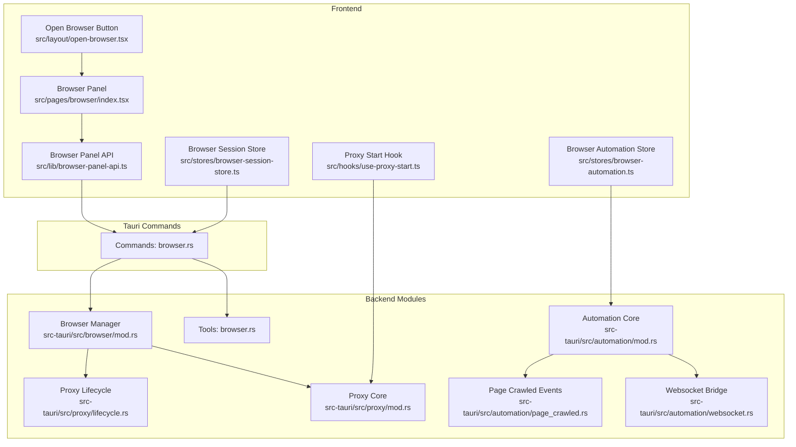
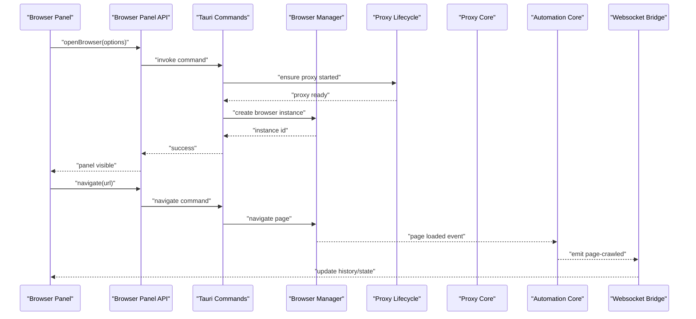
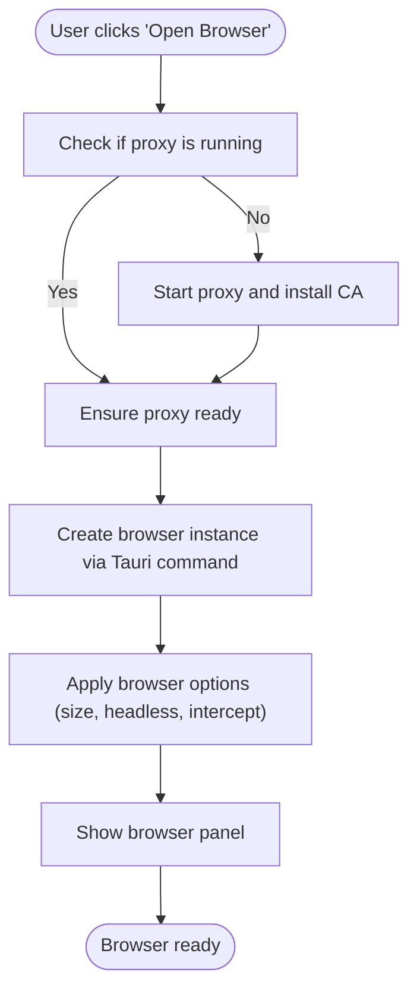
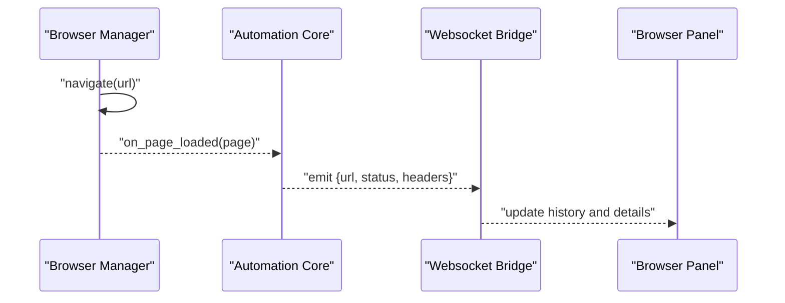
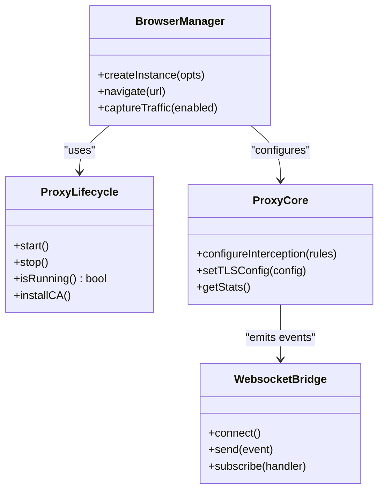
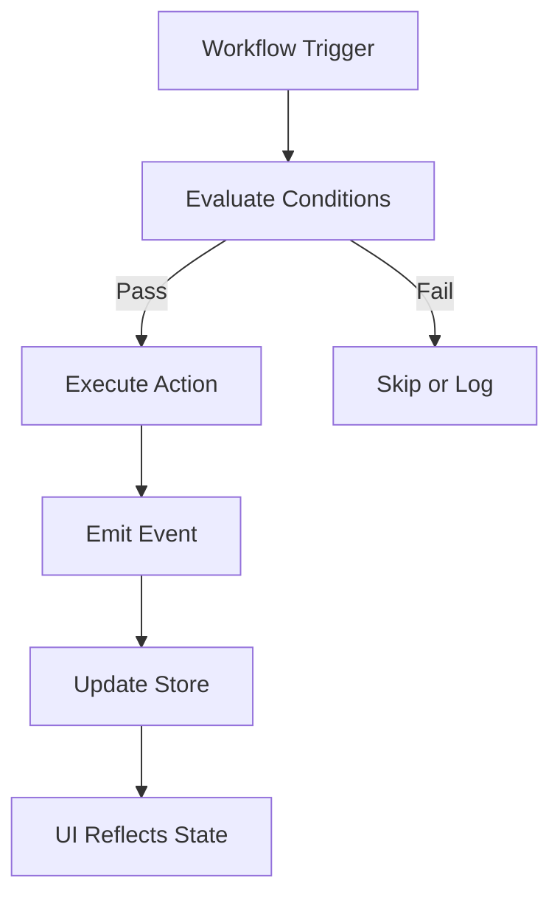
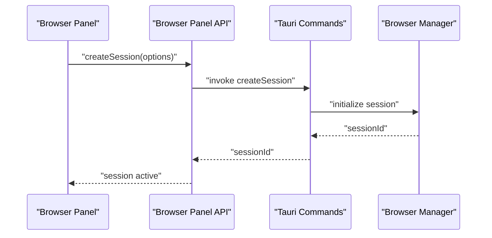
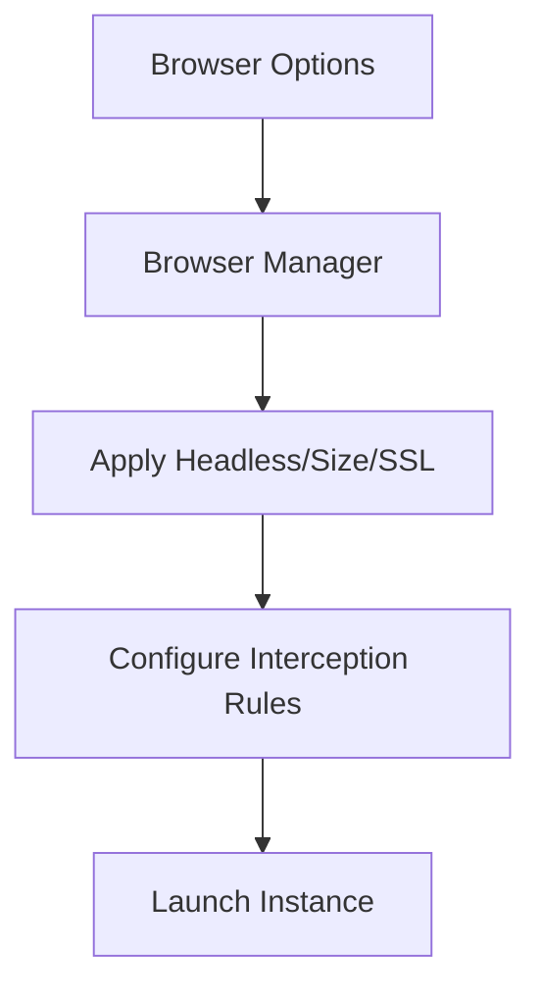
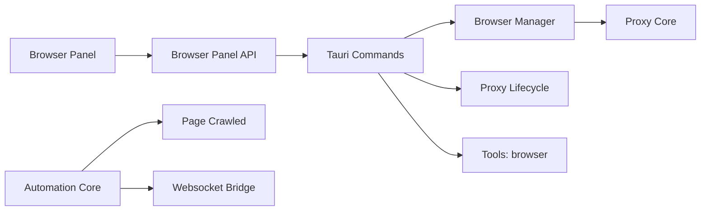

# Browser Core & Setup

<cite>
**Referenced Files in This Document**
- [src/pages/browser/index.tsx](file://src/pages/browser/index.tsx)
- [src/layout/open-browser.tsx](file://src/layout/open-browser.tsx)
- [src/hooks/use-proxy-start.ts](file://src/hooks/use-proxy-start.ts)
- [src/stores/browser-session-store.ts](file://src/stores/browser-session-store.ts)
- [src/stores/browser-automation.ts](file://src/stores/browser-automation.ts)
- [src/lib/browser-panel-api.ts](file://src/lib/browser-panel-api.ts)
- [src-tauri/src/commands/browser.rs](file://src-tauri/src/commands/browser.rs)
- [src-tauri/src/browser/mod.rs](file://src-tauri/src/browser/mod.rs)
- [src-tauri/src/proxy/mod.rs](file://src-tauri/src/proxy/mod.rs)
- [src-tauri/src/proxy/lifecycle.rs](file://src-tauri/src/proxy/lifecycle.rs)
- [src-tauri/src/tools/browser.rs](file://src-tauri/src/tools/browser.rs)
- [src-tauri/src/automation/mod.rs](file://src-tauri/src/automation/mod.rs)
- [src-tauri/src/automation/page_crawled.rs](file://src-tauri/src/automation/page_crawled.rs)
- [src-tauri/src/automation/websocket.rs](file://src-tauri/src/automation/websocket.rs)
</cite>

## Table of Contents
1. [Introduction](#introduction)
2. [Project Structure](#project-structure)
3. [Core Components](#core-components)
4. [Architecture Overview](#architecture-overview)
5. [Detailed Component Analysis](#detailed-component-analysis)
6. [Dependency Analysis](#dependency-analysis)
7. [Performance Considerations](#performance-considerations)
8. [Troubleshooting Guide](#troubleshooting-guide)
9. [Conclusion](#conclusion)
10. [Appendices](#appendices)

## Introduction
This document explains Apprecon’s built-in browser core: how the browser is initialized, configured, and managed; how page lifecycle events are handled; how connections are established and maintained; and how the browser integrates with Apprecon’s proxy system for traffic inspection and automation. It also provides practical guidance for setting up browser automation workflows, configuring browser options, handling sessions, understanding capabilities and compatibility, and optimizing performance.

## Project Structure
Apprecon implements a hybrid architecture:
- Frontend (React + Tauri): UI panels, state stores, hooks, and commands to control the browser and proxy.
- Backend (Rust via Tauri): Native browser management, proxy lifecycle, automation execution, and event publishing.

Key areas relevant to the browser core:
- Frontend browser panel and session store orchestrate user interactions and UI state.
- Tauri commands expose browser operations to the frontend.
- Rust modules manage the embedded browser instance, pages, and integration with the proxy.
- Automation subsystem publishes events like page-crawled and websocket messages.

**Diagram sources**
- [src/pages/browser/index.tsx](file://src/pages/browser/index.tsx)
- [src/layout/open-browser.tsx](file://src/layout/open-browser.tsx)
- [src/hooks/use-proxy-start.ts](file://src/hooks/use-proxy-start.ts)
- [src/stores/browser-session-store.ts](file://src/stores/browser-session-store.ts)
- [src/stores/browser-automation.ts](file://src/stores/browser-automation.ts)
- [src/lib/browser-panel-api.ts](file://src/lib/browser-panel-api.ts)
- [src-tauri/src/commands/browser.rs](file://src-tauri/src/commands/browser.rs)
- [src-tauri/src/browser/mod.rs](file://src-tauri/src/browser/mod.rs)
- [src-tauri/src/proxy/lifecycle.rs](file://src-tauri/src/proxy/lifecycle.rs)
- [src-tauri/src/proxy/mod.rs](file://src-tauri/src/proxy/mod.rs)
- [src-tauri/src/tools/browser.rs](file://src-tauri/src/tools/browser.rs)
- [src-tauri/src/automation/mod.rs](file://src-tauri/src/automation/mod.rs)
- [src-tauri/src/automation/page_crawled.rs](file://src-tauri/src/automation/page_crawled.rs)
- [src-tauri/src/automation/websocket.rs](file://src-tauri/src/automation/websocket.rs)

**Section sources**
- [src/pages/browser/index.tsx](file://src/pages/browser/index.tsx)
- [src/layout/open-browser.tsx](file://src/layout/open-browser.tsx)
- [src/hooks/use-proxy-start.ts](file://src/hooks/use-proxy-start.ts)
- [src/stores/browser-session-store.ts](file://src/stores/browser-session-store.ts)
- [src/stores/browser-automation.ts](file://src/stores/browser-automation.ts)
- [src/lib/browser-panel-api.ts](file://src/lib/browser-panel-api.ts)
- [src-tauri/src/commands/browser.rs](file://src-tauri/src/commands/browser.rs)
- [src-tauri/src/browser/mod.rs](file://src-tauri/src/browser/mod.rs)
- [src-tauri/src/proxy/lifecycle.rs](file://src-tauri/src/proxy/lifecycle.rs)
- [src-tauri/src/proxy/mod.rs](file://src-tauri/src/proxy/mod.rs)
- [src-tauri/src/tools/browser.rs](file://src-tauri/src/tools/browser.rs)
- [src-tauri/src/automation/mod.rs](file://src-tauri/src/automation/mod.rs)
- [src-tauri/src/automation/page_crawled.rs](file://src-tauri/src/automation/page_crawled.rs)
- [src-tauri/src/automation/websocket.rs](file://src-tauri/src/automation/websocket.rs)

## Core Components
- Browser Panel (UI): Renders the embedded browser view and exposes controls for navigation, screenshots, and inspection.
- Open Browser Button: Triggers initialization and visibility of the browser panel.
- Proxy Start Hook: Ensures the proxy is running before launching or interacting with the browser.
- Browser Session Store: Manages active sessions, tabs, and page metadata.
- Browser Automation Store: Holds automation workflow state, triggers, and results.
- Browser Panel API: Provides typed methods to call Tauri commands for browser actions.
- Tauri Commands (browser.rs): Expose backend operations such as open, navigate, screenshot, and close.
- Browser Manager (mod.rs): Owns the embedded browser instance, page lifecycle, and configuration.
- Proxy Lifecycle (lifecycle.rs): Starts, stops, and monitors the proxy process.
- Proxy Core (mod.rs): Configures interception rules and certificates.
- Tools: browser.rs: Utility functions for common browser tasks (e.g., capturing network data).
- Automation Core (mod.rs): Orchestrates automation flows and event emission.
- Page Crawled Events (page_crawled.rs): Emits structured events when pages finish loading.
- Websocket Bridge (websocket.rs): Bridges browser/network events to the frontend over websockets.

**Section sources**
- [src/pages/browser/index.tsx](file://src/pages/browser/index.tsx)
- [src/layout/open-browser.tsx](file://src/layout/open-browser.tsx)
- [src/hooks/use-proxy-start.ts](file://src/hooks/use-proxy-start.ts)
- [src/stores/browser-session-store.ts](file://src/stores/browser-session-store.ts)
- [src/stores/browser-automation.ts](file://src/stores/browser-automation.ts)
- [src/lib/browser-panel-api.ts](file://src/lib/browser-panel-api.ts)
- [src-tauri/src/commands/browser.rs](file://src-tauri/src/commands/browser.rs)
- [src-tauri/src/browser/mod.rs](file://src-tauri/src/browser/mod.rs)
- [src-tauri/src/proxy/lifecycle.rs](file://src-tauri/src/proxy/lifecycle.rs)
- [src-tauri/src/proxy/mod.rs](file://src-tauri/src/proxy/mod.rs)
- [src-tauri/src/tools/browser.rs](file://src-tauri/src/tools/browser.rs)
- [src-tauri/src/automation/mod.rs](file://src-tauri/src/automation/mod.rs)
- [src-tauri/src/automation/page_crawled.rs](file://src-tauri/src/automation/page_crawled.rs)
- [src-tauri/src/automation/websocket.rs](file://src-tauri/src/automation/websocket.rs)

## Architecture Overview
The browser core follows a layered approach:
- UI layer (React) invokes commands through the Browser Panel API.
- Command layer (Tauri) delegates to backend modules.
- Browser manager handles the embedded browser instance and pages.
- Proxy lifecycle ensures traffic interception is available.
- Automation core emits events that propagate back to the UI via websockets.

**Diagram sources**
- [src/pages/browser/index.tsx](file://src/pages/browser/index.tsx)
- [src/lib/browser-panel-api.ts](file://src/lib/browser-panel-api.ts)
- [src-tauri/src/commands/browser.rs](file://src-tauri/src/commands/browser.rs)
- [src-tauri/src/browser/mod.rs](file://src-tauri/src/browser/mod.rs)
- [src-tauri/src/proxy/lifecycle.rs](file://src-tauri/src/proxy/lifecycle.rs)
- [src-tauri/src/proxy/mod.rs](file://src-tauri/src/proxy/mod.rs)
- [src-tauri/src/automation/mod.rs](file://src-tauri/src/automation/mod.rs)
- [src-tauri/src/automation/page_crawled.rs](file://src-tauri/src/automation/page_crawled.rs)
- [src-tauri/src/automation/websocket.rs](file://src-tauri/src/automation/websocket.rs)

## Detailed Component Analysis

### Browser Initialization and Configuration
- The Open Browser button triggers the browser panel to initialize.
- Before opening, the Proxy Start Hook ensures the proxy is running and configured.
- The Browser Panel API calls Tauri commands to create or reuse a browser instance.
- The Browser Manager configures the embedded browser (window size, headless mode, SSL interception flags).
- The Proxy Lifecycle manages certificate installation and startup checks.

**Diagram sources**
- [src/layout/open-browser.tsx](file://src/layout/open-browser.tsx)
- [src/hooks/use-proxy-start.ts](file://src/hooks/use-proxy-start.ts)
- [src/lib/browser-panel-api.ts](file://src/lib/browser-panel-api.ts)
- [src-tauri/src/commands/browser.rs](file://src-tauri/src/commands/browser.rs)
- [src-tauri/src/browser/mod.rs](file://src-tauri/src/browser/mod.rs)
- [src-tauri/src/proxy/lifecycle.rs](file://src-tauri/src/proxy/lifecycle.rs)

**Section sources**
- [src/layout/open-browser.tsx](file://src/layout/open-browser.tsx)
- [src/hooks/use-proxy-start.ts](file://src/hooks/use-proxy-start.ts)
- [src/lib/browser-panel-api.ts](file://src/lib/browser-panel-api.ts)
- [src-tauri/src/commands/browser.rs](file://src-tauri/src/commands/browser.rs)
- [src-tauri/src/browser/mod.rs](file://src-tauri/src/browser/mod.rs)
- [src-tauri/src/proxy/lifecycle.rs](file://src-tauri/src/proxy/lifecycle.rs)

### Browser Page Lifecycle
- Pages are created on demand and tracked by the Browser Manager.
- Navigation events trigger load completion callbacks.
- On page load, the Automation Core emits page-crawled events.
- The Websocket Bridge forwards these events to the frontend for UI updates.

**Diagram sources**
- [src-tauri/src/browser/mod.rs](file://src-tauri/src/browser/mod.rs)
- [src-tauri/src/automation/mod.rs](file://src-tauri/src/automation/mod.rs)
- [src-tauri/src/automation/page_crawled.rs](file://src-tauri/src/automation/page_crawled.rs)
- [src-tauri/src/automation/websocket.rs](file://src-tauri/src/automation/websocket.rs)
- [src/pages/browser/index.tsx](file://src/pages/browser/index.tsx)

**Section sources**
- [src-tauri/src/browser/mod.rs](file://src-tauri/src/browser/mod.rs)
- [src-tauri/src/automation/mod.rs](file://src-tauri/src/automation/mod.rs)
- [src-tauri/src/automation/page_crawled.rs](file://src-tauri/src/automation/page_crawled.rs)
- [src-tauri/src/automation/websocket.rs](file://src-tauri/src/automation/websocket.rs)
- [src/pages/browser/index.tsx](file://src/pages/browser/index.tsx)

### Connection Management and Proxy Integration
- The Proxy Lifecycle ensures the proxy is running and certificates are installed.
- The Proxy Core configures interception rules and TLS settings.
- The Browser Manager connects the embedded browser to the proxy for traffic capture.
- Websocket Bridge relays captured events to the UI.

**Diagram sources**
- [src-tauri/src/proxy/lifecycle.rs](file://src-tauri/src/proxy/lifecycle.rs)
- [src-tauri/src/proxy/mod.rs](file://src-tauri/src/proxy/mod.rs)
- [src-tauri/src/browser/mod.rs](file://src-tauri/src/browser/mod.rs)
- [src-tauri/src/automation/websocket.rs](file://src-tauri/src/automation/websocket.rs)

**Section sources**
- [src-tauri/src/proxy/lifecycle.rs](file://src-tauri/src/proxy/lifecycle.rs)
- [src-tauri/src/proxy/mod.rs](file://src-tauri/src/proxy/mod.rs)
- [src-tauri/src/browser/mod.rs](file://src-tauri/src/browser/mod.rs)
- [src-tauri/src/automation/websocket.rs](file://src-tauri/src/automation/websocket.rs)

### Browser Automation Workflows
- The Automation Core orchestrates workflows using triggers and conditions.
- Page-crawled events can trigger subsequent actions (e.g., form submission, assertions).
- The Browser Automation Store maintains workflow state and results.
- The Tools: browser module provides helpers for common tasks like clicking elements or extracting text.

**Diagram sources**
- [src-tauri/src/automation/mod.rs](file://src-tauri/src/automation/mod.rs)
- [src-tauri/src/automation/page_crawled.rs](file://src-tauri/src/automation/page_crawled.rs)
- [src/stores/browser-automation.ts](file://src/stores/browser-automation.ts)
- [src-tauri/src/tools/browser.rs](file://src-tauri/src/tools/browser.rs)

**Section sources**
- [src-tauri/src/automation/mod.rs](file://src-tauri/src/automation/mod.rs)
- [src-tauri/src/automation/page_crawled.rs](file://src-tauri/src/automation/page_crawled.rs)
- [src/stores/browser-automation.ts](file://src/stores/browser-automation.ts)
- [src-tauri/src/tools/browser.rs](file://src-tauri/src/tools/browser.rs)

### Setting Up Browser Sessions
- The Browser Session Store tracks active sessions, tabs, and page metadata.
- The Browser Panel API exposes methods to create, switch, and close sessions.
- Tauri commands coordinate session creation and resource cleanup.

**Diagram sources**
- [src/stores/browser-session-store.ts](file://src/stores/browser-session-store.ts)
- [src/lib/browser-panel-api.ts](file://src/lib/browser-panel-api.ts)
- [src-tauri/src/commands/browser.rs](file://src-tauri/src/commands/browser.rs)
- [src-tauri/src/browser/mod.rs](file://src-tauri/src/browser/mod.rs)

**Section sources**
- [src/stores/browser-session-store.ts](file://src/stores/browser-session-store.ts)
- [src/lib/browser-panel-api.ts](file://src/lib/browser-panel-api.ts)
- [src-tauri/src/commands/browser.rs](file://src-tauri/src/commands/browser.rs)
- [src-tauri/src/browser/mod.rs](file://src-tauri/src/browser/mod.rs)

### Configuring Browser Options
- Options include window dimensions, headless mode, SSL interception flags, and proxy settings.
- The Browser Manager applies these options during instance creation.
- The Proxy Core configures interception rules based on options.

**Diagram sources**
- [src-tauri/src/browser/mod.rs](file://src-tauri/src/browser/mod.rs)
- [src-tauri/src/proxy/mod.rs](file://src-tauri/src/proxy/mod.rs)

**Section sources**
- [src-tauri/src/browser/mod.rs](file://src-tauri/src/browser/mod.rs)
- [src-tauri/src/proxy/mod.rs](file://src/tauri/src/proxy/mod.rs)

### Capabilities and Compatibility
- Supported features include navigation, screenshots, network capture, and automation events.
- Compatibility considerations involve OS-specific certificate handling and embedded browser engine constraints.
- The Proxy Lifecycle manages certificate installation per platform.

[No sources needed since this section provides general guidance]

## Dependency Analysis
The browser core depends on several modules:
- UI components depend on stores and APIs.
- Stores depend on Tauri commands.
- Commands depend on browser manager, proxy lifecycle, and tools.
- Automation core depends on page-crawled events and websocket bridge.

**Diagram sources**
- [src/pages/browser/index.tsx](file://src/pages/browser/index.tsx)
- [src/lib/browser-panel-api.ts](file://src/lib/browser-panel-api.ts)
- [src-tauri/src/commands/browser.rs](file://src-tauri/src/commands/browser.rs)
- [src-tauri/src/browser/mod.rs](file://src-tauri/src/browser/mod.rs)
- [src-tauri/src/proxy/lifecycle.rs](file://src-tauri/src/proxy/lifecycle.rs)
- [src-tauri/src/proxy/mod.rs](file://src-tauri/src/proxy/mod.rs)
- [src-tauri/src/tools/browser.rs](file://src-tauri/src/tools/browser.rs)
- [src-tauri/src/automation/mod.rs](file://src-tauri/src/automation/mod.rs)
- [src-tauri/src/automation/page_crawled.rs](file://src-tauri/src/automation/page_crawled.rs)
- [src-tauri/src/automation/websocket.rs](file://src-tauri/src/automation/websocket.rs)

**Section sources**
- [src/pages/browser/index.tsx](file://src/pages/browser/index.tsx)
- [src/lib/browser-panel-api.ts](file://src/lib/browser-panel-api.ts)
- [src-tauri/src/commands/browser.rs](file://src-tauri/src/commands/browser.rs)
- [src-tauri/src/browser/mod.rs](file://src-tauri/src/browser/mod.rs)
- [src-tauri/src/proxy/lifecycle.rs](file://src-tauri/src/proxy/lifecycle.rs)
- [src-tauri/src/proxy/mod.rs](file://src-tauri/src/proxy/mod.rs)
- [src-tauri/src/tools/browser.rs](file://src-tauri/src/tools/browser.rs)
- [src-tauri/src/automation/mod.rs](file://src-tauri/src/automation/mod.rs)
- [src-tauri/src/automation/page_crawled.rs](file://src-tauri/src/automation/page_crawled.rs)
- [src-tauri/src/automation/websocket.rs](file://src-tauri/src/automation/websocket.rs)

## Performance Considerations
- Prefer reusing browser instances where possible to reduce startup overhead.
- Limit concurrent navigations to avoid memory spikes.
- Use headless mode for automated tasks to improve speed.
- Filter intercepted traffic to reduce websocket payload volume.
- Batch UI updates to minimize re-renders.

[No sources needed since this section provides general guidance]

## Troubleshooting Guide
Common issues and resolutions:
- Proxy not starting: Verify certificate installation and port availability.
- SSL interception failures: Reinstall CA and ensure browser trust store updated.
- Page load timeouts: Increase timeouts and check network connectivity.
- Memory leaks: Monitor instance count and ensure proper cleanup.
- Automation events missing: Confirm websocket connection and event subscriptions.

**Section sources**
- [src-tauri/src/proxy/lifecycle.rs](file://src-tauri/src/proxy/lifecycle.rs)
- [src-tauri/src/automation/websocket.rs](file://src-tauri/src/automation/websocket.rs)

## Conclusion
Apprecon’s browser core integrates a robust embedded browser with a configurable proxy and an automation framework. By following the setup steps, configuring options appropriately, and leveraging the provided stores and APIs, users can build reliable browser automation workflows. For best results, monitor performance and address common issues proactively.

[No sources needed since this section summarizes without analyzing specific files]

## Appendices
- Example workflow: Open browser, navigate to target URL, capture network requests, assert response status, and log findings.
- Best practices: Keep sessions short-lived, use headless mode for CI, and filter traffic to essential endpoints.

[No sources needed since this section provides general guidance]