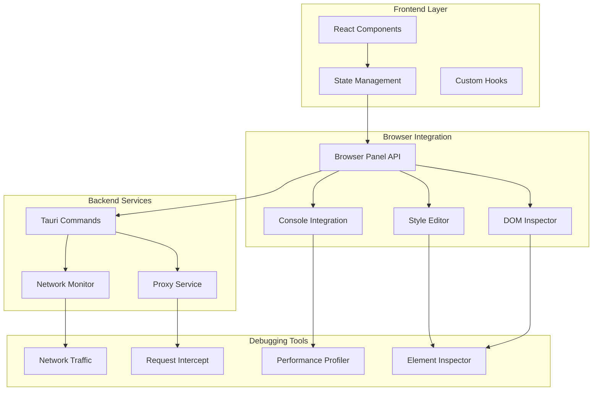
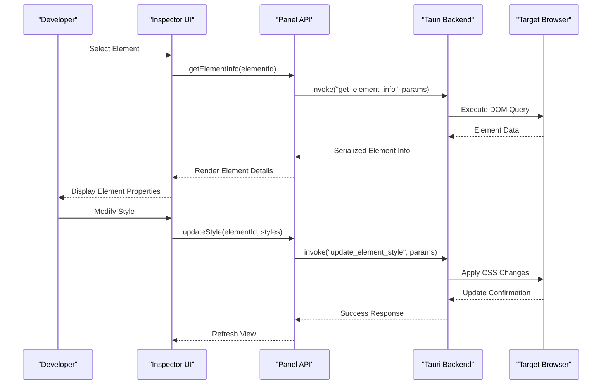
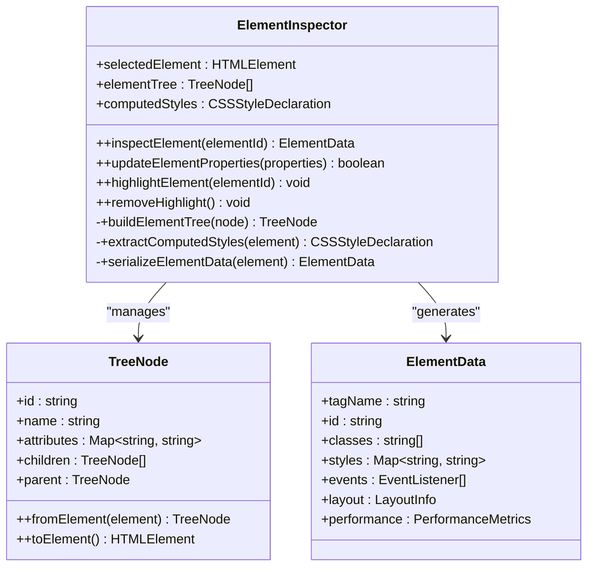
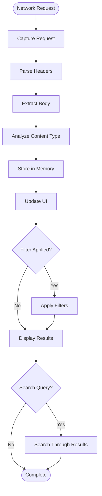
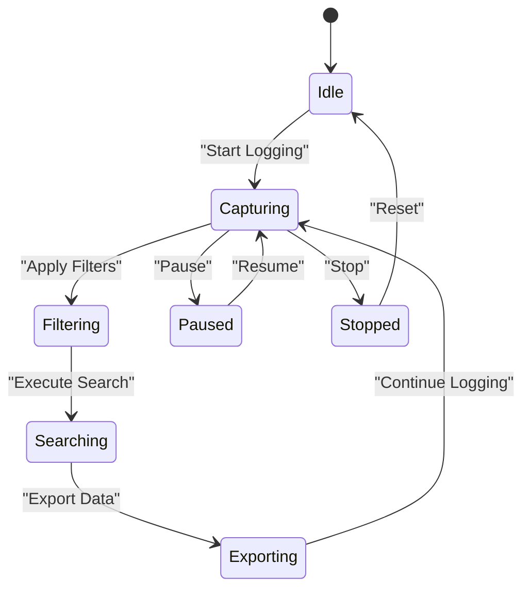
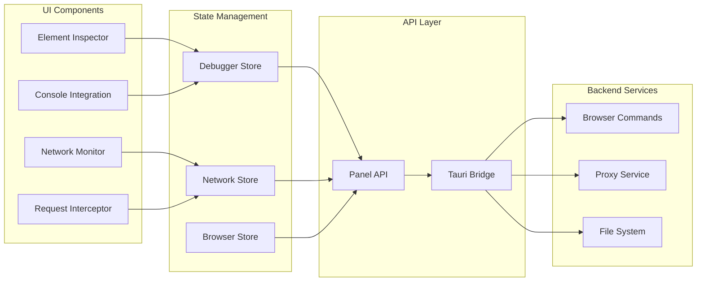

# UI Inspection & Debugging

<cite>
**Referenced Files in This Document**
- [README.md](file://README.md)
- [package.json](file://package.json)
- [src/pages/inspector/index.tsx](file://src/pages/inspector/index.tsx)
- [src/pages/browser/index.tsx](file://src/pages/browser/index.tsx)
- [src/pages/live-traffic/index.tsx](file://src/pages/live-traffic/index.tsx)
- [src/pages/intercept/index.tsx](file://src/pages/intercept/index.tsx)
- [src/components/ui/monaco-editor.tsx](file://src/components/ui/monaco-editor.tsx)
- [src/stores/debugger.ts](file://src/stores/debugger.ts)
- [src/lib/browser-panel-api.ts](file://src/lib/browser-panel-api.ts)
- [src-tauri/src/commands/browser.rs](file://src-tauri/src/commands/browser.rs)
- [src-tauri/src/proxy/mod.rs](file://src-tauri/src/proxy/mod.rs)
</cite>

## Table of Contents
1. [Introduction](#introduction)
2. [Project Structure](#project-structure)
3. [Core Components](#core-components)
4. [Architecture Overview](#architecture-overview)
5. [Detailed Component Analysis](#detailed-component-analysis)
6. [Dependency Analysis](#dependency-analysis)
7. [Performance Considerations](#performance-considerations)
8. [Troubleshooting Guide](#troubleshooting-guide)
9. [Conclusion](#conclusion)

## Introduction

Apprecon provides a comprehensive suite of UI inspection and debugging tools designed for modern web development workflows. The application integrates multiple debugging capabilities including DOM element inspection, CSS style analysis, JavaScript execution debugging, and network request monitoring within a unified interface. These tools are built into the desktop application using Tauri framework, providing native performance while maintaining full browser developer tool compatibility.

The debugging ecosystem spans across several specialized panels: an Element Inspector for DOM manipulation, a Browser panel for live page interaction, Network Traffic monitoring for HTTP/WebSocket requests, and Intercept functionality for request/response modification. Each component works seamlessly together to provide developers with powerful debugging capabilities without leaving the application environment.

## Project Structure

The UI inspection and debugging functionality is distributed across multiple architectural layers:

**Diagram sources**
- [src/pages/inspector/index.tsx](file://src/pages/inspector/index.tsx)
- [src/pages/browser/index.tsx](file://src/pages/browser/index.tsx)
- [src/lib/browser-panel-api.ts](file://src/lib/browser-panel-api.ts)
- [src-tauri/src/commands/browser.rs](file://src-tauri/src/commands/browser.rs)

**Section sources**
- [README.md](file://README.md)
- [package.json](file://package.json)

## Core Components

### Element Inspector
The Element Inspector provides real-time DOM manipulation capabilities, allowing developers to inspect and modify HTML elements directly within the browser context. It supports hierarchical navigation of the DOM tree, property inspection, and live editing of element attributes and styles.

### Style Editor
The Style Editor enables comprehensive CSS analysis and modification. Developers can view computed styles, cascade order, inheritance chains, and make real-time changes to CSS properties. The editor highlights conflicting styles and provides suggestions for optimization.

### Console Integration
Console Integration bridges the application's logging system with browser console APIs. It captures console output, error messages, and custom log statements, providing filtering, search, and export capabilities for debugging sessions.

### Network Traffic Monitor
The Network Traffic Monitor captures and displays all HTTP and WebSocket requests made by the application. It provides detailed request/response inspection, timing analysis, and payload examination with support for large data visualization.

**Section sources**
- [src/pages/inspector/index.tsx](file://src/pages/inspector/index.tsx)
- [src/pages/browser/index.tsx](file://src/pages/browser/index.tsx)
- [src/pages/live-traffic/index.tsx](file://src/pages/live-traffic/index.tsx)
- [src/pages/intercept/index.tsx](file://src/pages/intercept/index.tsx)

## Architecture Overview

The debugging architecture follows a layered approach with clear separation of concerns:

**Diagram sources**
- [src/lib/browser-panel-api.ts](file://src/lib/browser-panel-api.ts)
- [src-tauri/src/commands/browser.rs](file://src-tauri/src/commands/browser.rs)

The architecture ensures type safety through TypeScript interfaces, efficient state management via dedicated stores, and seamless communication between frontend and backend components through Tauri's command system.

## Detailed Component Analysis

### Element Inspector Implementation

The Element Inspector component provides comprehensive DOM inspection capabilities with real-time updates and interactive editing features.

**Diagram sources**
- [src/pages/inspector/index.tsx](file://src/pages/inspector/index.tsx)
- [src/pages/inspector/types.ts](file://src/pages/inspector/types.ts)

The inspector uses a tree-based data structure for efficient DOM traversal and maintains reactive state updates when elements are modified. Performance optimizations include lazy loading of deep DOM trees and debounced style calculations.

### Network Traffic Monitoring

The network monitoring system captures HTTP and WebSocket traffic with detailed analysis capabilities:

**Diagram sources**
- [src/pages/live-traffic/index.tsx](file://src/pages/live-traffic/index.tsx)
- [src/pages/intercept/index.tsx](file://src/pages/intercept/index.tsx)

The system implements efficient filtering and search algorithms to handle large volumes of network data while maintaining responsive UI performance.

### Console Integration System

The console integration provides enhanced logging capabilities with advanced filtering and analysis:

**Diagram sources**
- [src/stores/debugger.ts](file://src/stores/debugger.ts)

The console system supports multiple log levels, timestamp tracking, and contextual information about the calling code stack.

**Section sources**
- [src/pages/inspector/index.tsx](file://src/pages/inspector/index.tsx)
- [src/pages/live-traffic/index.tsx](file://src/pages/live-traffic/index.tsx)
- [src/stores/debugger.ts](file://src/stores/debugger.ts)

## Dependency Analysis

The debugging components have well-defined dependencies and communication patterns:

**Diagram sources**
- [src/stores/debugger.ts](file://src/stores/debugger.ts)
- [src/lib/browser-panel-api.ts](file://src/lib/browser-panel-api.ts)
- [src-tauri/src/commands/browser.rs](file://src-tauri/src/commands/browser.rs)

The dependency structure ensures loose coupling between components while maintaining strong typing and clear interfaces for inter-module communication.

**Section sources**
- [src/stores/debugger.ts](file://src/stores/debugger.ts)
- [src/lib/browser-panel-api.ts](file://src/lib/browser-panel-api.ts)

## Performance Considerations

The debugging tools implement several performance optimization strategies:

- **Lazy Loading**: DOM trees and network data are loaded on-demand to minimize initial memory footprint
- **Debounced Updates**: Style calculations and DOM queries are debounced to prevent excessive re-renders
- **Memory Management**: Large datasets are paginated and garbage collected when no longer needed
- **Efficient Serialization**: Element and network data are serialized using optimized formats
- **Background Processing**: Heavy computations run in background threads to maintain UI responsiveness

## Troubleshooting Guide

### Common Issues and Solutions

**Element Inspector Not Responding**
- Verify target browser connection is active
- Check if the inspected element is still in the DOM
- Ensure proper permissions for DOM access

**Network Requests Not Captured**
- Confirm proxy settings are correctly configured
- Verify SSL certificates are properly installed
- Check for CORS restrictions blocking capture

**Console Logs Missing**
- Ensure console logging is enabled in settings
- Verify filter configurations aren't excluding logs
- Check browser security policies affecting console access

**Performance Degradation**
- Clear captured network data when not needed
- Reduce logging verbosity for large applications
- Use selective element inspection instead of full DOM analysis

**Section sources**
- [src/pages/inspector/index.tsx](file://src/pages/inspector/index.tsx)
- [src/pages/live-traffic/index.tsx](file://src/pages/live-traffic/index.tsx)
- [src/stores/debugger.ts](file://src/stores/debugger.ts)

## Conclusion

Apprecon's UI inspection and debugging tools provide a comprehensive solution for modern web development workflows. The integrated approach combining DOM inspection, network monitoring, console integration, and performance profiling creates a powerful debugging environment that enhances developer productivity. The modular architecture ensures scalability and maintainability while the performance optimizations guarantee smooth operation even with complex applications.

The tools seamlessly integrate with existing browser developer workflows while providing additional capabilities specific to the Apprecon ecosystem. Future enhancements could include AI-powered debugging assistance, collaborative debugging sessions, and expanded protocol support for emerging web technologies.