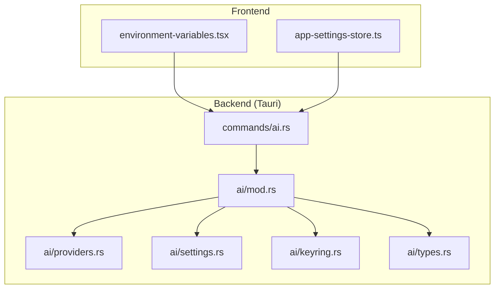
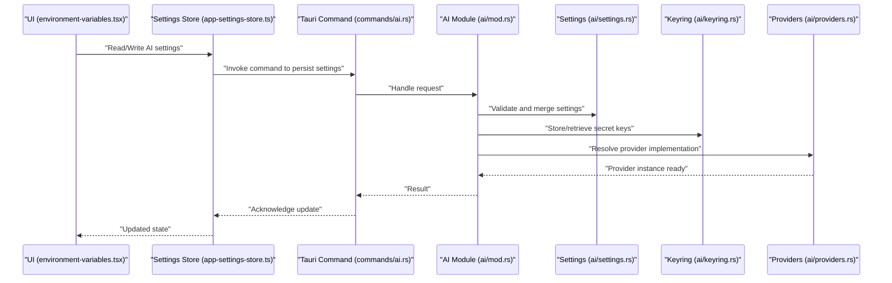
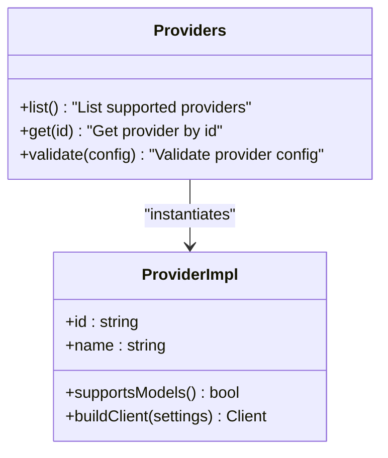
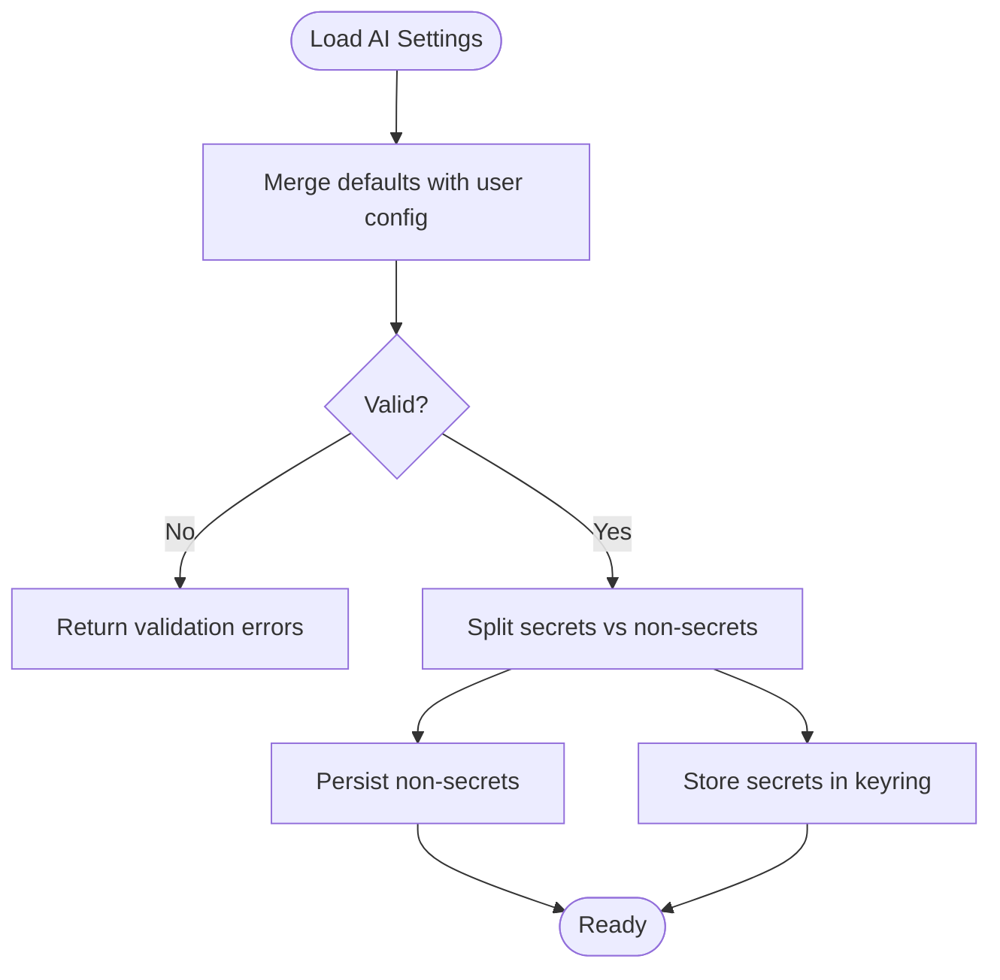
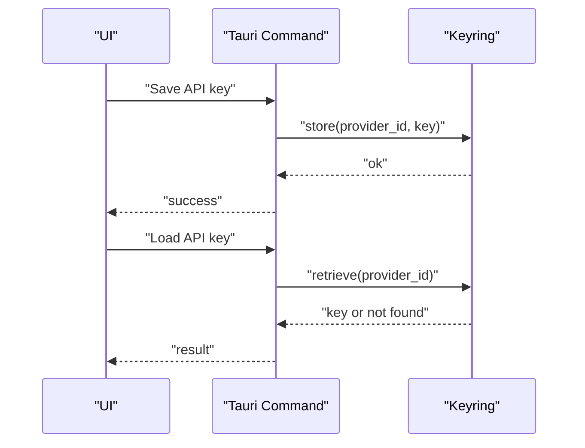
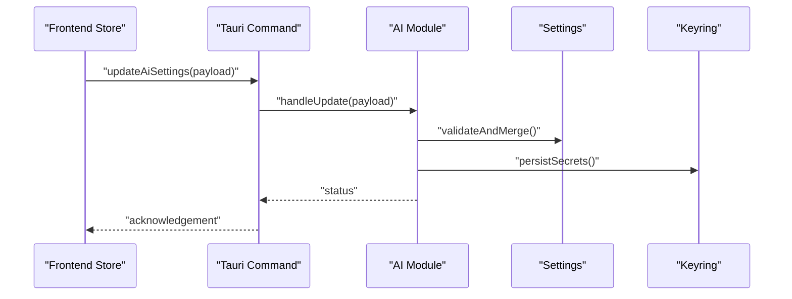
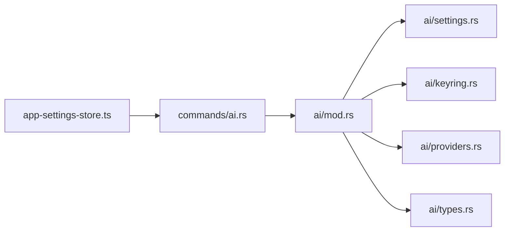

# AI Provider Configuration

<cite>
**Referenced Files in This Document**
- [src-tauri/src/ai/mod.rs](file://src-tauri/src/ai/mod.rs)
- [src-tauri/src/ai/providers.rs](file://src-tauri/src/ai/providers.rs)
- [src-tauri/src/ai/settings.rs](file://src-tauri/src/ai/settings.rs)
- [src-tauri/src/ai/keyring.rs](file://src-tauri/src/ai/keyring.rs)
- [src-tauri/src/ai/types.rs](file://src-tauri/src/ai/types.rs)
- [src-tauri/src/commands/ai.rs](file://src-tauri/src/commands/ai.rs)
- [src/components/ai-elements/environment-variables.tsx](file://src/components/ai-elements/environment-variables.tsx)
- [src/stores/app-settings-store.ts](file://src/stores/app-settings-store.ts)
</cite>

## Table of Contents
1. [Introduction](#introduction)
2. [Project Structure](#project-structure)
3. [Core Components](#core-components)
4. [Architecture Overview](#architecture-overview)
5. [Detailed Component Analysis](#detailed-component-analysis)
6. [Dependency Analysis](#dependency-analysis)
7. [Performance Considerations](#performance-considerations)
8. [Troubleshooting Guide](#troubleshooting-guide)
9. [Conclusion](#conclusion)
10. [Appendices](#appendices)

## Introduction
This document explains how to configure AI providers in Apprecon. It covers supported services, API key management, provider-specific settings, the AI settings schema, environment variable configuration, and secure credential storage using the system keyring. It also includes examples for adding new providers, configuring rate limits, and troubleshooting connection issues, along with security best practices for managing API keys and sensitive configuration data.

## Project Structure
Apprecon’s AI configuration spans both the Rust backend (Tauri) and the frontend UI:
- Backend modules define provider implementations, settings schema, keyring integration, and Tauri commands.
- Frontend components expose environment variables and settings to users.

**Diagram sources**
- [src/components/ai-elements/environment-variables.tsx](file://src/components/ai-elements/environment-variables.tsx)
- [src/stores/app-settings-store.ts](file://src/stores/app-settings-store.ts)
- [src-tauri/src/commands/ai.rs](file://src-tauri/src/commands/ai.rs)
- [src-tauri/src/ai/mod.rs](file://src-tauri/src/ai/mod.rs)
- [src-tauri/src/ai/providers.rs](file://src-tauri/src/ai/providers.rs)
- [src-tauri/src/ai/settings.rs](file://src-tauri/src/ai/settings.rs)
- [src-tauri/src/ai/keyring.rs](file://src-tauri/src/ai/keyring.rs)
- [src-tauri/src/ai/types.rs](file://src-tauri/src/ai/types.rs)

**Section sources**
- [src-tauri/src/ai/mod.rs](file://src-tauri/src/ai/mod.rs)
- [src-tauri/src/ai/providers.rs](file://src-tauri/src/ai/providers.rs)
- [src-tauri/src/ai/settings.rs](file://src-tauri/src/ai/settings.rs)
- [src-tauri/src/ai/keyring.rs](file://src-tauri/src/ai/keyring.rs)
- [src-tauri/src/ai/types.rs](file://src-tauri/src/ai/types.rs)
- [src-tauri/src/commands/ai.rs](file://src-tauri/src/commands/ai.rs)
- [src/components/ai-elements/environment-variables.tsx](file://src/components/ai-elements/environment-variables.tsx)
- [src/stores/app-settings-store.ts](file://src/stores/app-settings-store.ts)

## Core Components
- Providers registry: Defines supported AI services and their runtime behavior.
- Settings schema: Declares all configurable fields for providers, including rate limits and endpoints.
- Keyring integration: Securely stores and retrieves secrets such as API keys.
- Commands: Expose Tauri APIs for reading/writing settings and secrets from the frontend.
- Types: Shared structures used across modules for consistency.

Key responsibilities:
- Validate and normalize provider configurations.
- Persist non-secret settings via app settings.
- Store secrets securely via the OS keyring.
- Provide a unified interface for invoking AI providers.

**Section sources**
- [src-tauri/src/ai/providers.rs](file://src-tauri/src/ai/providers.rs)
- [src-tauri/src/ai/settings.rs](file://src-tauri/src/ai/settings.rs)
- [src-tauri/src/ai/keyring.rs](file://src-tauri/src/ai/keyring.rs)
- [src-tauri/src/ai/types.rs](file://src-tauri/src/ai/types.rs)
- [src-tauri/src/commands/ai.rs](file://src-tauri/src/commands/ai.rs)

## Architecture Overview
The AI configuration flow connects the UI to the backend through Tauri commands, which read/write settings and manage secrets via the keyring. Provider logic is encapsulated per service, with shared types and validation.

**Diagram sources**
- [src/components/ai-elements/environment-variables.tsx](file://src/components/ai-elements/environment-variables.tsx)
- [src/stores/app-settings-store.ts](file://src/stores/app-settings-store.ts)
- [src-tauri/src/commands/ai.rs](file://src-tauri/src/commands/ai.rs)
- [src-tauri/src/ai/mod.rs](file://src-tauri/src/ai/mod.rs)
- [src-tauri/src/ai/settings.rs](file://src-tauri/src/ai/settings.rs)
- [src-tauri/src/ai/keyring.rs](file://src-tauri/src/ai/keyring.rs)
- [src-tauri/src/ai/providers.rs](file://src-tauri/src/ai/providers.rs)

## Detailed Component Analysis

### AI Providers Registry
- Purpose: Enumerate supported AI services and provide factory or routing logic to instantiate them.
- Typical capabilities:
  - Map provider identifiers to concrete implementations.
  - Apply provider-specific defaults (e.g., base URLs, model names).
  - Enforce common constraints (e.g., required fields).

**Diagram sources**
- [src-tauri/src/ai/providers.rs](file://src-tauri/src/ai/providers.rs)

**Section sources**
- [src-tauri/src/ai/providers.rs](file://src-tauri/src/ai/providers.rs)

### AI Settings Schema
- Purpose: Define the structure of AI configuration, including provider toggles, models, endpoints, timeouts, and rate limits.
- Validation: Ensures required fields are present and values are within acceptable ranges.
- Persistence: Non-secret fields are persisted via app settings; secrets are stored in the keyring.

**Diagram sources**
- [src-tauri/src/ai/settings.rs](file://src-tauri/src/ai/settings.rs)

**Section sources**
- [src-tauri/src/ai/settings.rs](file://src-tauri/src/ai/settings.rs)

### Keyring Integration
- Purpose: Securely store and retrieve sensitive data like API keys and tokens.
- Operations:
  - Save credentials under a provider-specific account name.
  - Retrieve credentials when initializing a provider client.
  - Delete credentials on provider removal or reset.

**Diagram sources**
- [src-tauri/src/ai/keyring.rs](file://src-tauri/src/ai/keyring.rs)
- [src-tauri/src/commands/ai.rs](file://src-tauri/src/commands/ai.rs)

**Section sources**
- [src-tauri/src/ai/keyring.rs](file://src-tauri/src/ai/keyring.rs)
- [src-tauri/src/commands/ai.rs](file://src-tauri/src/commands/ai.rs)

### Tauri Commands for AI
- Purpose: Bridge between frontend and backend for AI configuration operations.
- Typical commands:
  - Read AI settings.
  - Update AI settings (non-secrets).
  - Save/retrieve/delete secrets via keyring.
  - Test provider connectivity.

**Diagram sources**
- [src-tauri/src/commands/ai.rs](file://src-tauri/src/commands/ai.rs)
- [src-tauri/src/ai/mod.rs](file://src-tauri/src/ai/mod.rs)
- [src-tauri/src/ai/settings.rs](file://src-tauri/src/ai/settings.rs)
- [src-tauri/src/ai/keyring.rs](file://src-tauri/src/ai/keyring.rs)

**Section sources**
- [src-tauri/src/commands/ai.rs](file://src-tauri/src/commands/ai.rs)
- [src-tauri/src/ai/mod.rs](file://src-tauri/src/ai/mod.rs)

### Environment Variables and UI
- The UI exposes an environment variables editor for quick configuration of provider-related variables.
- These variables can be used to override certain settings at runtime where applicable.

**Section sources**
- [src/components/ai-elements/environment-variables.tsx](file://src/components/ai-elements/environment-variables.tsx)
- [src/stores/app-settings-store.ts](file://src/stores/app-settings-store.ts)

## Dependency Analysis
- Commands depend on the AI module for orchestration.
- The AI module depends on settings, keyring, providers, and types.
- Frontend interacts with commands via Tauri bindings.

**Diagram sources**
- [src/stores/app-settings-store.ts](file://src/stores/app-settings-store.ts)
- [src-tauri/src/commands/ai.rs](file://src-tauri/src/commands/ai.rs)
- [src-tauri/src/ai/mod.rs](file://src-tauri/src/ai/mod.rs)
- [src-tauri/src/ai/settings.rs](file://src-tauri/src/ai/settings.rs)
- [src-tauri/src/ai/keyring.rs](file://src-tauri/src/ai/keyring.rs)
- [src-tauri/src/ai/providers.rs](file://src-tauri/src/ai/providers.rs)
- [src-tauri/src/ai/types.rs](file://src-tauri/src/ai/types.rs)

**Section sources**
- [src-tauri/src/ai/mod.rs](file://src-tauri/src/ai/mod.rs)
- [src-tauri/src/commands/ai.rs](file://src-tauri/src/commands/ai.rs)

## Performance Considerations
- Rate limiting: Configure per-provider rate limits to avoid throttling and ensure stable performance.
- Connection pooling: Reuse HTTP clients where possible to reduce overhead.
- Lazy initialization: Initialize provider clients only when needed.
- Caching: Cache non-sensitive metadata (e.g., model lists) if provided by the service.

[No sources needed since this section provides general guidance]

## Troubleshooting Guide
Common issues and resolutions:
- Missing or invalid API key:
  - Ensure the key is saved via the keyring and matches the expected provider format.
  - Verify that the correct provider ID is used when storing/retrieving secrets.
- Connectivity failures:
  - Check network access and proxy settings.
  - Validate base URL and endpoint paths for the provider.
- Rate limit exceeded:
  - Increase rate limit values or switch to a higher-tier plan.
  - Implement retry/backoff strategies in your workflow.
- Settings not applied:
  - Confirm that non-secret settings are persisted correctly.
  - Reload the UI or restart the application to refresh cached settings.

**Section sources**
- [src-tauri/src/ai/keyring.rs](file://src-tauri/src/ai/keyring.rs)
- [src-tauri/src/ai/settings.rs](file://src-tauri/src/ai/settings.rs)
- [src-tauri/src/commands/ai.rs](file://src-tauri/src/commands/ai.rs)

## Conclusion
Apprecon’s AI provider configuration is built around a clear separation of concerns: providers implement service-specific logic, settings define the configuration schema, and the keyring secures sensitive data. The Tauri commands provide a robust bridge for the frontend to manage these components. Following the best practices outlined here will help you add new providers, manage credentials securely, and maintain reliable integrations.

[No sources needed since this section summarizes without analyzing specific files]

## Appendices

### Supported AI Services
- Refer to the providers registry for the current list of supported services and their capabilities.

**Section sources**
- [src-tauri/src/ai/providers.rs](file://src-tauri/src/ai/providers.rs)

### Adding a New AI Provider
Steps:
1. Implement the provider interface with required methods (e.g., authentication, request building, response parsing).
2. Register the provider in the providers registry with a unique identifier and display name.
3. Add any provider-specific settings to the schema and validation rules.
4. If the provider requires secrets, integrate with the keyring for secure storage.
5. Expose any necessary Tauri commands for testing and management.

**Section sources**
- [src-tauri/src/ai/providers.rs](file://src-tauri/src/ai/providers.rs)
- [src-tauri/src/ai/settings.rs](file://src-tauri/src/ai/settings.rs)
- [src-tauri/src/ai/keyring.rs](file://src-tauri/src/ai/keyring.rs)
- [src-tauri/src/commands/ai.rs](file://src-tauri/src/commands/ai.rs)

### Configuring Rate Limits
- Use the settings schema to set per-provider rate limits (requests per minute/hour).
- Combine with backoff and retry policies to handle transient failures gracefully.

**Section sources**
- [src-tauri/src/ai/settings.rs](file://src-tauri/src/ai/settings.rs)

### Security Best Practices
- Always store API keys in the keyring; never log or print secrets.
- Restrict permissions for files and processes that may access secrets.
- Rotate keys regularly and revoke compromised credentials immediately.
- Avoid committing configuration files containing secrets to version control.

**Section sources**
- [src-tauri/src/ai/keyring.rs](file://src-tauri/src/ai/keyring.rs)