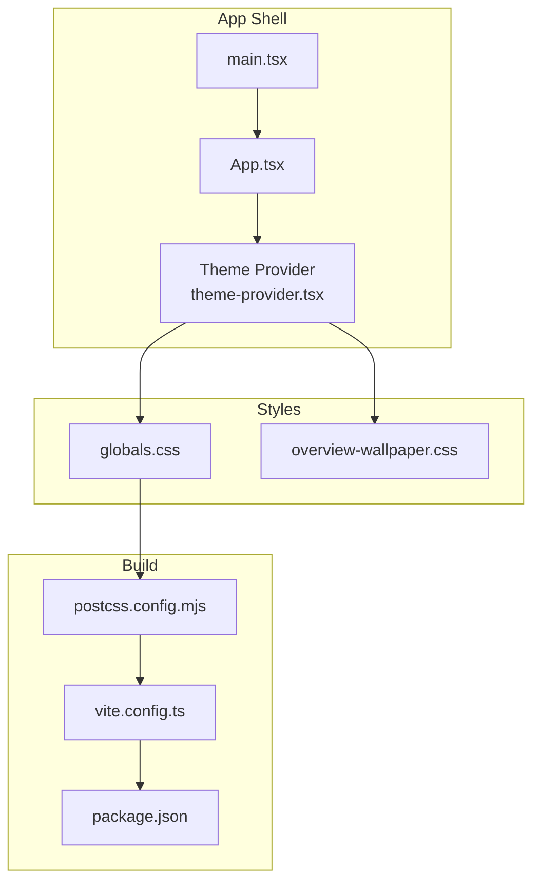
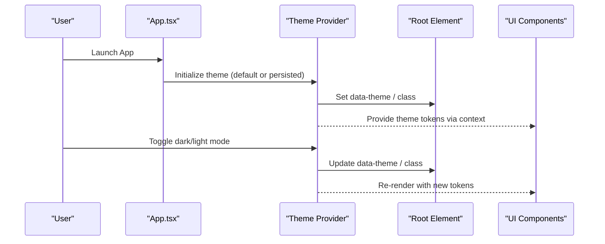
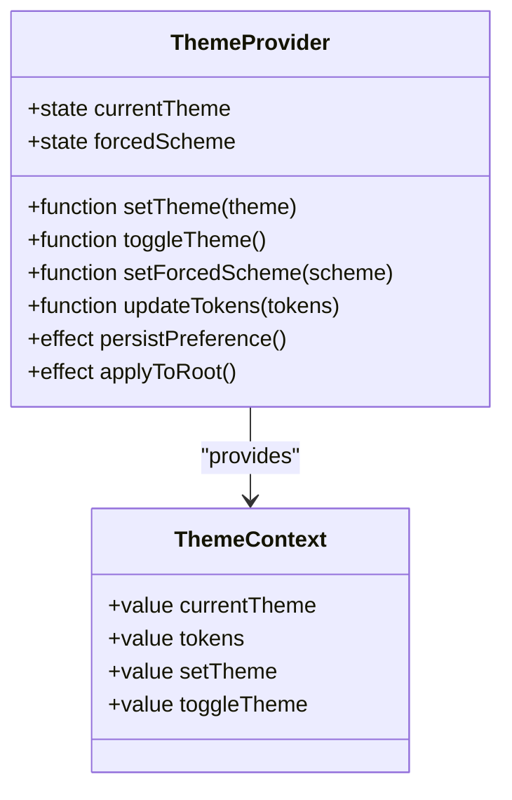
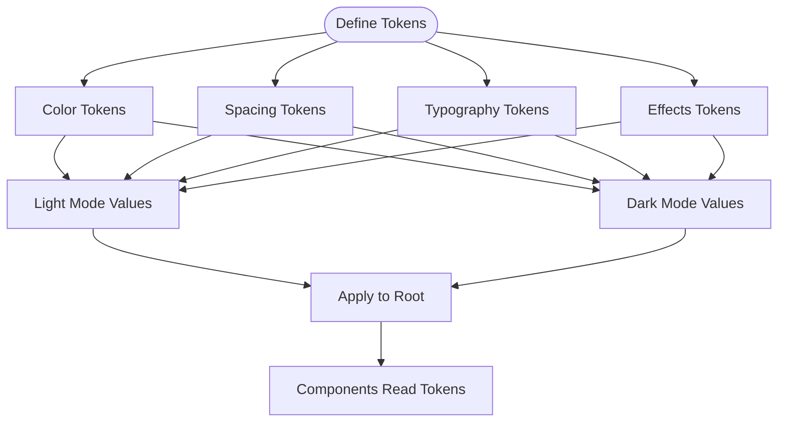
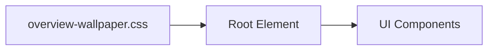
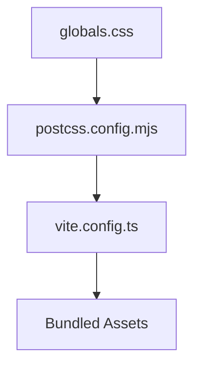
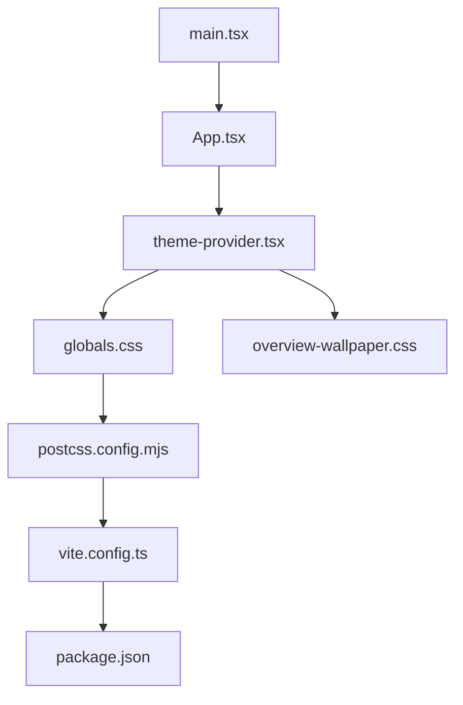

# Appearance & Theme Customization

<cite>
**Referenced Files in This Document**
- [theme-provider.tsx](file://src/components/theme-provider.tsx)
- [globals.css](file://src/styles/globals.css)
- [overview-wallpaper.css](file://src/styles/overview-wallpaper.css)
- [App.tsx](file://src/App.tsx)
- [main.tsx](file://src/main.tsx)
- [components.json](file://components.json)
- [postcss.config.mjs](file://postcss.config.mjs)
- [vite.config.ts](file://vite.config.ts)
- [package.json](file://package.json)
</cite>

## Table of Contents
1. [Introduction](#introduction)
2. [Project Structure](#project-structure)
3. [Core Components](#core-components)
4. [Architecture Overview](#architecture-overview)
5. [Detailed Component Analysis](#detailed-component-analysis)
6. [Dependency Analysis](#dependency-analysis)
7. [Performance Considerations](#performance-considerations)
8. [Troubleshooting Guide](#troubleshooting-guide)
9. [Conclusion](#conclusion)
10. [Appendices](#appendices)

## Introduction
This document explains Apprecon’s appearance and theme customization system. It covers available themes, color schemes, visual settings, how to create custom themes, modify CSS variables, extend the design system, and integrate with external design systems. It also documents the theme provider architecture, dark/light mode implementation, and responsive design considerations.

## Project Structure
Theming in Apprecon is implemented through:
- A React theme provider that manages theme state and exposes it via context
- Global CSS variables for colors, spacing, typography, and component tokens
- PostCSS and Vite configuration for processing styles
- UI components built on a shared design system that consumes theme tokens

**Diagram sources**
- [main.tsx](file://src/main.tsx)
- [App.tsx](file://src/App.tsx)
- [theme-provider.tsx](file://src/components/theme-provider.tsx)
- [globals.css](file://src/styles/globals.css)
- [overview-wallpaper.css](file://src/styles/overview-wallpaper.css)
- [postcss.config.mjs](file://postcss.config.mjs)
- [vite.config.ts](file://vite.config.ts)
- [package.json](file://package.json)

**Section sources**
- [main.tsx](file://src/main.tsx)
- [App.tsx](file://src/App.tsx)
- [theme-provider.tsx](file://src/components/theme-provider.tsx)
- [globals.css](file://src/styles/globals.css)
- [overview-wallpaper.css](file://src/styles/overview-wallpaper.css)
- [postcss.config.mjs](file://postcss.config.mjs)
- [vite.config.ts](file://vite.config.ts)
- [package.json](file://package.json)

## Core Components
- Theme Provider: Supplies current theme (light/dark), toggles, and token overrides via React context. Consumers read theme values and apply them to components.
- Global Styles: Centralized CSS variables define semantic tokens (colors, radii, shadows, typography scales). These are consumed by components and utilities.
- Build Pipeline: PostCSS processes CSS (e.g., Tailwind or utility classes), and Vite bundles assets. Configuration files control plugin behavior and asset handling.

Key responsibilities:
- Provide theme state and persistence across app restarts
- Apply theme class or attributes to the root element
- Expose hooks/utilities for components to access theme tokens
- Ensure consistent application of tokens across all UI elements

**Section sources**
- [theme-provider.tsx](file://src/components/theme-provider.tsx)
- [globals.css](file://src/styles/globals.css)
- [postcss.config.mjs](file://postcss.config.mjs)
- [vite.config.ts](file://vite.config.ts)

## Architecture Overview
The theme system follows a provider-consumer pattern:
- The provider initializes theme from defaults or persisted preferences
- It updates global CSS variables when theme changes
- Components consume theme tokens via context or CSS variables
- Dark/light mode toggling updates the active theme and persists user choice

**Diagram sources**
- [App.tsx](file://src/App.tsx)
- [theme-provider.tsx](file://src/components/theme-provider.tsx)
- [globals.css](file://src/styles/globals.css)

## Detailed Component Analysis

### Theme Provider
Responsibilities:
- Manage theme state (current theme, forced scheme, media query detection)
- Persist theme preference to storage
- Apply theme attribute/class to the document root
- Expose functions to toggle themes and override tokens

Implementation highlights:
- Uses React context to distribute theme values
- Integrates with system preference detection for automatic dark/light mode
- Updates CSS variables dynamically when theme changes
- Provides hooks for components to subscribe to theme changes

**Diagram sources**
- [theme-provider.tsx](file://src/components/theme-provider.tsx)

**Section sources**
- [theme-provider.tsx](file://src/components/theme-provider.tsx)

### Global Styles and CSS Variables
Global styles define semantic tokens used throughout the app:
- Color tokens for backgrounds, text, borders, accents, and semantic states
- Spacing and sizing tokens for consistent layout
- Typography tokens for font families, sizes, and line heights
- Component-specific tokens for shadows, radii, and transitions

Best practices:
- Use semantic names (e.g., --color-bg-primary, --color-text-muted)
- Group variables by category (colors, typography, effects)
- Provide light and dark variants under appropriate selectors
- Avoid hardcoding values in components; reference variables only

**Diagram sources**
- [globals.css](file://src/styles/globals.css)

**Section sources**
- [globals.css](file://src/styles/globals.css)

### Wallpaper and Backgrounds
Background visuals can be customized independently of theme tokens:
- Wallpaper CSS provides background images and overlays
- Can be themed per mode or applied globally
- Should respect contrast and accessibility guidelines

**Diagram sources**
- [overview-wallpaper.css](file://src/styles/overview-wallpaper.css)

**Section sources**
- [overview-wallpaper.css](file://src/styles/overview-wallpaper.css)

### Build Pipeline Integration
PostCSS and Vite configure style processing:
- PostCSS plugins transform CSS (e.g., Tailwind directives, autoprefixer)
- Vite handles asset bundling and development server
- Configuration files ensure consistent builds across environments

**Diagram sources**
- [postcss.config.mjs](file://postcss.config.mjs)
- [vite.config.ts](file://vite.config.ts)
- [globals.css](file://src/styles/globals.css)

**Section sources**
- [postcss.config.mjs](file://postcss.config.mjs)
- [vite.config.ts](file://vite.config.ts)

## Dependency Analysis
Theme-related dependencies and their relationships:
- App shell imports the theme provider and wraps the application
- Components depend on theme context or CSS variables
- Styles are processed by PostCSS and bundled by Vite
- Package configuration includes dependencies for styling and build tools

**Diagram sources**
- [main.tsx](file://src/main.tsx)
- [App.tsx](file://src/App.tsx)
- [theme-provider.tsx](file://src/components/theme-provider.tsx)
- [globals.css](file://src/styles/globals.css)
- [overview-wallpaper.css](file://src/styles/overview-wallpaper.css)
- [postcss.config.mjs](file://postcss.config.mjs)
- [vite.config.ts](file://vite.config.ts)
- [package.json](file://package.json)

**Section sources**
- [main.tsx](file://src/main.tsx)
- [App.tsx](file://src/App.tsx)
- [theme-provider.tsx](file://src/components/theme-provider.tsx)
- [globals.css](file://src/styles/globals.css)
- [overview-wallpaper.css](file://src/styles/overview-wallpaper.css)
- [postcss.config.mjs](file://postcss.config.mjs)
- [vite.config.ts](file://vite.config.ts)
- [package.json](file://package.json)

## Performance Considerations
- Minimize re-renders: Memoize theme consumers and avoid unnecessary context updates
- Prefer CSS variables over inline styles for better performance and caching
- Defer heavy wallpaper assets and use lazy loading where appropriate
- Keep token definitions small and organized to reduce CSS size
- Use production builds with optimized asset pipelines

[No sources needed since this section provides general guidance]

## Troubleshooting Guide
Common issues and resolutions:
- Theme not applying: Ensure the provider wraps the app root and the theme attribute/class is set on the root element
- Variables missing: Verify CSS variable names match exactly and are defined in both light and dark modes
- Toggles not persisting: Check storage permissions and key naming consistency
- Conflicts with external libraries: Scope theme variables or use unique prefixes to avoid collisions
- Build errors: Validate PostCSS and Vite configurations for syntax and plugin compatibility

**Section sources**
- [theme-provider.tsx](file://src/components/theme-provider.tsx)
- [globals.css](file://src/styles/globals.css)
- [postcss.config.mjs](file://postcss.config.mjs)
- [vite.config.ts](file://vite.config.ts)

## Conclusion
Apprecon’s theme system is built around a robust provider architecture and semantic CSS variables. By following the guidelines here, you can create brand-specific themes, integrate external design systems, and maintain consistent visuals across light and dark modes. Use the provided patterns to extend tokens, customize backgrounds, and ensure responsive, accessible designs.

[No sources needed since this section summarizes without analyzing specific files]

## Appendices

### Creating a Custom Theme
Steps:
- Define new semantic tokens in global styles
- Add light and dark variants for each token
- Update the theme provider to include your tokens
- Optionally add wallpaper or accent images
- Test across components and devices

**Section sources**
- [globals.css](file://src/styles/globals.css)
- [theme-provider.tsx](file://src/components/theme-provider.tsx)

### Modifying CSS Variables
Guidelines:
- Use descriptive names and group related variables
- Maintain consistency between light and dark modes
- Avoid overriding base tokens unless necessary
- Document any custom tokens for team clarity

**Section sources**
- [globals.css](file://src/styles/globals.css)

### Extending the Design System
Approach:
- Create reusable components that consume theme tokens
- Add utility classes for common patterns
- Integrate with external design systems via token mapping
- Ensure accessibility compliance (contrast, focus states)

**Section sources**
- [theme-provider.tsx](file://src/components/theme-provider.tsx)
- [globals.css](file://src/styles/globals.css)

### Integrating with External Design Systems
Methods:
- Map external tokens to Apprecon’s semantic variables
- Wrap third-party components with theme-aware wrappers
- Use CSS custom properties to bridge design systems
- Validate visual consistency across themes

**Section sources**
- [theme-provider.tsx](file://src/components/theme-provider.tsx)
- [globals.css](file://src/styles/globals.css)

### Responsive Design Considerations
Recommendations:
- Use relative units and fluid typography
- Test themes at various breakpoints
- Ensure sufficient contrast on all screen sizes
- Optimize wallpapers and backgrounds for mobile

[No sources needed since this section provides general guidance]