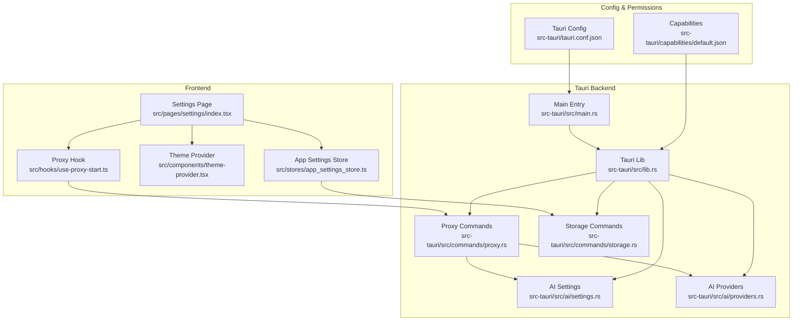
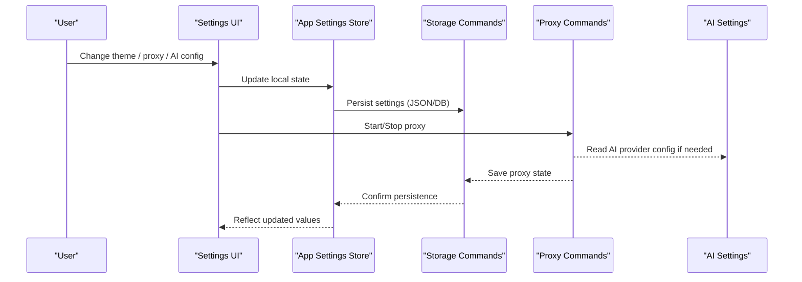
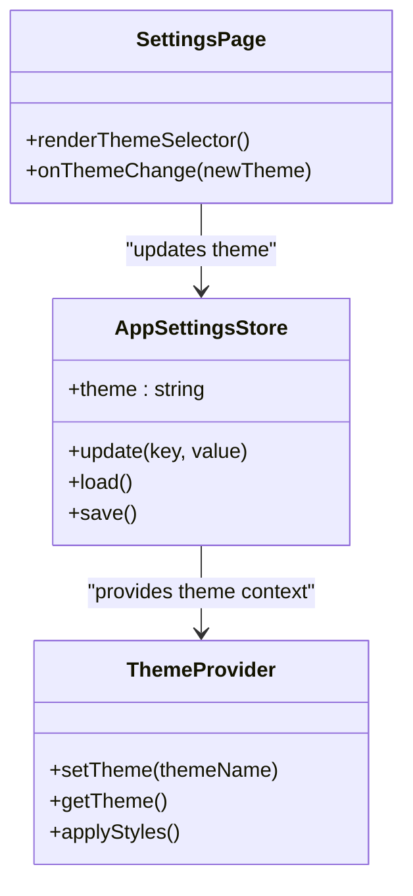
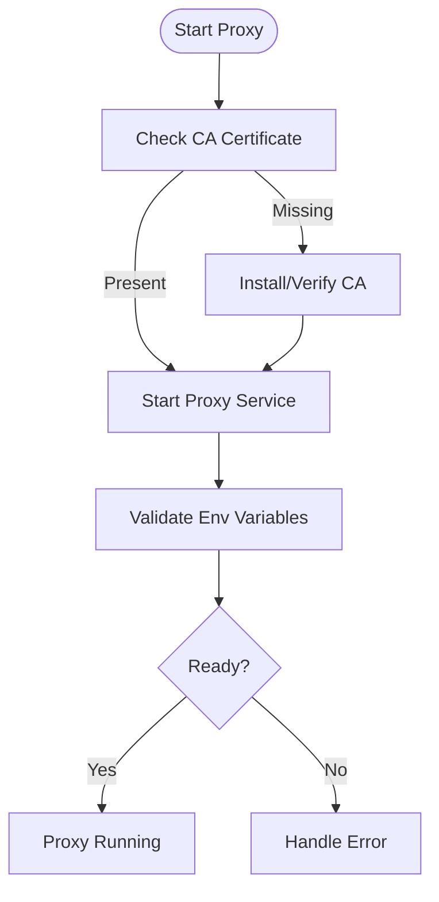
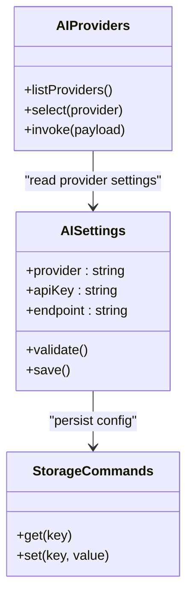
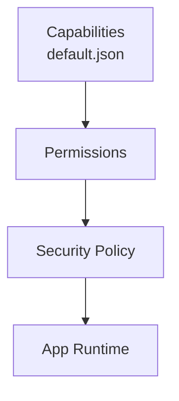
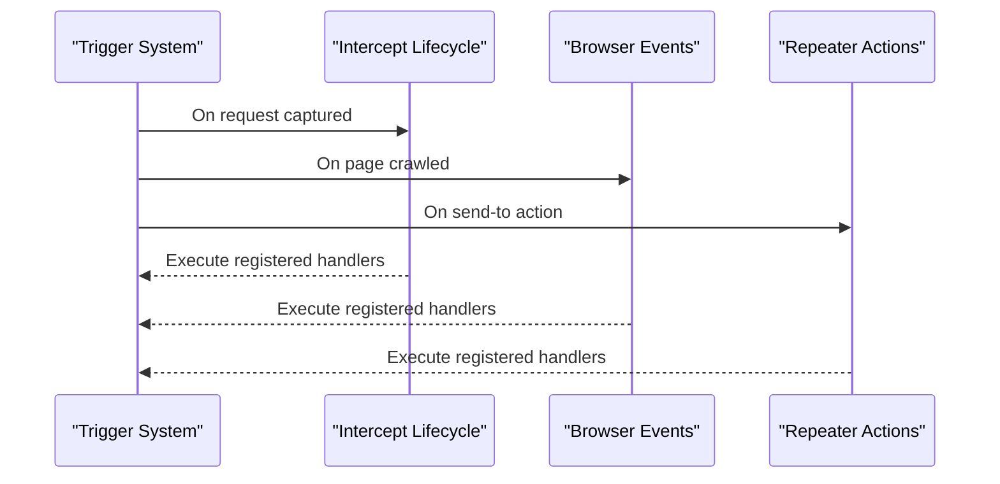
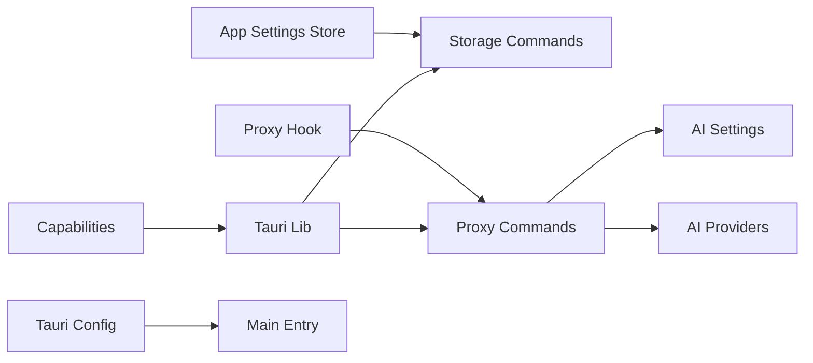

# Configuration & Customization

<cite>
**Referenced Files in This Document**
- [README.md](file://README.md)
- [tauri.conf.json](file://src-tauri/tauri.conf.json)
- [default.json](file://src-tauri/capabilities/default.json)
- [app_settings_store.ts](file://src/stores/app_settings_store.ts)
- [theme-provider.tsx](file://src/components/theme-provider.tsx)
- [use-proxy-start.ts](file://src/hooks/use-proxy-start.ts)
- [proxy.ts](file://docs/proxy.ts)
- [settings/index.tsx](file://src/pages/settings/index.tsx)
- [ai/settings.rs](file://src-tauri/src/ai/settings.rs)
- [ai/providers.rs](file://src-tauri/src/ai/providers.rs)
- [commands/proxy.rs](file://src-tauri/src/commands/proxy.rs)
- [commands/storage.rs](file://src-tauri/src/commands/storage.rs)
- [setup.rs](file://src-tauri/src/setup.rs)
- [lib.rs](file://src-tauri/src/lib.rs)
- [main.rs](file://src-tauri/src/main.rs)
- [index.ts (triggers)](file://src/triggers/index.ts)
- [intercept/lifecycle.ts](file://src/triggers/intercept/lifecycle.ts)
- [browser/page-crawled.ts](file://src/triggers/browser/page-crawled.ts)
- [repeater/send-to.ts](file://src/triggers/repeater/send-to.ts)
- [components.json](file://components.json)
- [vite.config.ts](file://vite.config.ts)
</cite>

## Table of Contents
1. [Introduction](#introduction)
2. [Project Structure](#project-structure)
3. [Core Components](#core-components)
4. [Architecture Overview](#architecture-overview)
5. [Detailed Component Analysis](#detailed-component-analysis)
6. [Dependency Analysis](#dependency-analysis)
7. [Performance Considerations](#performance-considerations)
8. [Troubleshooting Guide](#troubleshooting-guide)
9. [Conclusion](#conclusion)
10. [Appendices](#appendices)

## Introduction
This document explains Apprecon’s configuration and customization system across appearance, proxy behavior, AI provider setup, security preferences, and integrations. It covers configuration file formats, environment variables, programmatic configuration via Tauri commands and frontend stores, and advanced scenarios such as custom themes, plugin development through hooks and triggers, backup/migration of settings, and enterprise best practices.

## Project Structure
Apprecon is a Tauri-based desktop application with:
- A Rust backend exposing commands for storage, proxy control, and AI settings.
- A React/TypeScript frontend that renders settings UI and manages runtime state.
- Configuration persisted to local storage and Tauri capabilities for permissions.

Key areas relevant to configuration:
- Tauri configuration and capabilities define app-level defaults and permissions.
- Frontend settings store centralizes user preferences and theme selection.
- Proxy lifecycle is managed by both frontend hooks and backend commands.
- AI provider configuration is handled in the Rust layer and exposed to the UI.

**Diagram sources**
- [tauri.conf.json](file://src-tauri/tauri.conf.json)
- [default.json](file://src-tauri/capabilities/default.json)
- [settings/index.tsx](file://src/pages/settings/index.tsx)
- [app_settings_store.ts](file://src/stores/app_settings_store.ts)
- [theme-provider.tsx](file://src/components/theme-provider.tsx)
- [use-proxy-start.ts](file://src/hooks/use-proxy-start.ts)
- [commands/proxy.rs](file://src-tauri/src/commands/proxy.rs)
- [commands/storage.rs](file://src-tauri/src/commands/storage.rs)
- [ai/settings.rs](file://src-tauri/src/ai/settings.rs)
- [ai/providers.rs](file://src-tauri/src/ai/providers.rs)
- [lib.rs](file://src-tauri/src/lib.rs)
- [main.rs](file://src-tauri/src/main.rs)

**Section sources**
- [README.md](file://README.md)
- [tauri.conf.json](file://src-tauri/tauri.conf.json)
- [default.json](file://src-tauri/capabilities/default.json)

## Core Components
- Settings UI and persistence: The settings page drives user interactions; the app settings store persists preferences and exposes them to components.
- Theme system: The theme provider supplies theme context and supports switching between light/dark/custom themes.
- Proxy management: A hook coordinates proxy start/stop and integrates with backend commands to manage CA certificates and traffic interception.
- AI providers: Rust-side configuration and provider selection are exposed to the frontend via commands.

**Section sources**
- [settings/index.tsx](file://src/pages/settings/index.tsx)
- [app_settings_store.ts](file://src/stores/app_settings_store.ts)
- [theme-provider.tsx](file://src/components/theme-provider.tsx)
- [use-proxy-start.ts](file://src/hooks/use-proxy-start.ts)
- [commands/proxy.rs](file://src-tauri/src/commands/proxy.rs)
- [ai/settings.rs](file://src-tauri/src/ai/settings.rs)
- [ai/providers.rs](file://src-tauri/src/ai/providers.rs)

## Architecture Overview
Configuration flows from the UI into the Tauri backend where they are validated and persisted. Proxy operations involve certificate handling and network stack integration. AI provider settings are stored securely and used when invoking AI features.

**Diagram sources**
- [settings/index.tsx](file://src/pages/settings/index.tsx)
- [app_settings_store.ts](file://src/stores/app_settings_store.ts)
- [commands/storage.rs](file://src-tauri/src/commands/storage.rs)
- [commands/proxy.rs](file://src-tauri/src/commands/proxy.rs)
- [ai/settings.rs](file://src-tauri/src/ai/settings.rs)

## Detailed Component Analysis

### Appearance and Themes
- Theme provider supplies theme context and applies styles globally.
- Settings UI allows selecting themes and persisting choices.
- Custom themes can be added by extending the theme registry and ensuring CSS variables align with the design system.

**Diagram sources**
- [theme-provider.tsx](file://src/components/theme-provider.tsx)
- [app_settings_store.ts](file://src/stores/app_settings_store.ts)
- [settings/index.tsx](file://src/pages/settings/index.tsx)

**Section sources**
- [theme-provider.tsx](file://src/components/theme-provider.tsx)
- [app_settings_store.ts](file://src/stores/app_settings_store.ts)
- [settings/index.tsx](file://src/pages/settings/index.tsx)

### Proxy Configuration
- Proxy lifecycle is controlled via a frontend hook that calls backend commands to start/stop the proxy and manage CA certificates.
- Environment variables may influence proxy behavior; ensure secure handling of sensitive values.
- Enterprise deployments should enforce strict proxy policies and validate certificate chains.

**Diagram sources**
- [use-proxy-start.ts](file://src/hooks/use-proxy-start.ts)
- [commands/proxy.rs](file://src-tauri/src/commands/proxy.rs)

**Section sources**
- [use-proxy-start.ts](file://src/hooks/use-proxy-start.ts)
- [commands/proxy.rs](file://src-tauri/src/commands/proxy.rs)
- [proxy.ts](file://docs/proxy.ts)

### AI Provider Setup
- AI provider configuration is managed in the Rust layer and exposed to the frontend via commands.
- Supported providers are defined centrally; credentials should be stored securely.
- Best practice: use environment variables or secure storage for API keys and endpoints.

**Diagram sources**
- [ai/settings.rs](file://src-tauri/src/ai/settings.rs)
- [ai/providers.rs](file://src-tauri/src/ai/providers.rs)
- [commands/storage.rs](file://src-tauri/src/commands/storage.rs)

**Section sources**
- [ai/settings.rs](file://src-tauri/src/ai/settings.rs)
- [ai/providers.rs](file://src-tauri/src/ai/providers.rs)
- [commands/storage.rs](file://src-tauri/src/commands/storage.rs)

### Security Preferences
- Tauri capabilities define what the app can access; restrict permissions to minimum required.
- Sensitive data (API keys, tokens) should be stored using secure mechanisms provided by the platform.
- Enforce HTTPS and validate certificates when connecting to external services.

**Diagram sources**
- [default.json](file://src-tauri/capabilities/default.json)

**Section sources**
- [default.json](file://src-tauri/capabilities/default.json)

### Integration Options
- Triggers allow extending functionality at key events (e.g., intercept lifecycle, browser page crawled, repeater send-to).
- Hooks and triggers enable automation and custom tooling without modifying core logic.

**Diagram sources**
- [index.ts (triggers)](file://src/triggers/index.ts)
- [intercept/lifecycle.ts](file://src/triggers/intercept/lifecycle.ts)
- [browser/page-crawled.ts](file://src/triggers/browser/page-crawled.ts)
- [repeater/send-to.ts](file://src/triggers/repeater/send-to.ts)

**Section sources**
- [index.ts (triggers)](file://src/triggers/index.ts)
- [intercept/lifecycle.ts](file://src/triggers/intercept/lifecycle.ts)
- [browser/page-crawled.ts](file://src/triggers/browser/page-crawled.ts)
- [repeater/send-to.ts](file://src/triggers/repeater/send-to.ts)

## Dependency Analysis
- Frontend depends on Tauri commands for persistence and proxy control.
- Backend modules are cohesive around their responsibilities: storage, proxy, AI settings, and providers.
- Capabilities and Tauri configuration constrain runtime permissions and behavior.

**Diagram sources**
- [app_settings_store.ts](file://src/stores/app_settings_store.ts)
- [use-proxy-start.ts](file://src/hooks/use-proxy-start.ts)
- [commands/storage.rs](file://src-tauri/src/commands/storage.rs)
- [commands/proxy.rs](file://src-tauri/src/commands/proxy.rs)
- [ai/settings.rs](file://src-tauri/src/ai/settings.rs)
- [ai/providers.rs](file://src-tauri/src/ai/providers.rs)
- [lib.rs](file://src-tauri/src/lib.rs)
- [main.rs](file://src-tauri/src/main.rs)
- [tauri.conf.json](file://src-tauri/tauri.conf.json)
- [default.json](file://src-tauri/capabilities/default.json)

**Section sources**
- [lib.rs](file://src-tauri/src/lib.rs)
- [main.rs](file://src-tauri/src/main.rs)
- [tauri.conf.json](file://src-tauri/tauri.conf.json)
- [default.json](file://src-tauri/capabilities/default.json)

## Performance Considerations
- Minimize frequent writes to persistent storage; batch updates where possible.
- Avoid heavy computations in the UI thread; offload to background tasks.
- Use efficient proxy configurations to reduce overhead during traffic inspection.
- Cache frequently accessed settings to avoid repeated I/O.

[No sources needed since this section provides general guidance]

## Troubleshooting Guide
Common issues and resolutions:
- Proxy fails to start: Verify CA certificate installation and permissions; check environment variables for correct values.
- AI provider errors: Validate API keys and endpoints; ensure secure storage is accessible.
- Settings not persisting: Confirm storage commands succeed and permissions are granted.
- Theme not applying: Ensure theme provider receives updated context and CSS variables are correctly set.

**Section sources**
- [commands/proxy.rs](file://src-tauri/src/commands/proxy.rs)
- [commands/storage.rs](file://src-tauri/src/commands/storage.rs)
- [ai/settings.rs](file://src-tauri/src/ai/settings.rs)
- [theme-provider.tsx](file://src/components/theme-provider.tsx)

## Conclusion
Apprecon’s configuration system combines a flexible frontend settings UI with a robust Tauri backend. By leveraging capabilities, secure storage, and extensible triggers, teams can tailor the application to enterprise needs while maintaining security and performance. Adopt best practices for credential management, permission scoping, and modular extensions to ensure reliable deployments.

[No sources needed since this section summarizes without analyzing specific files]

## Appendices

### Configuration File Formats
- Tauri configuration defines app metadata, window settings, and build options.
- Capabilities JSON controls runtime permissions for filesystem, network, and plugins.
- Settings are typically stored as JSON objects via storage commands.

**Section sources**
- [tauri.conf.json](file://src-tauri/tauri.conf.json)
- [default.json](file://src-tauri/capabilities/default.json)
- [commands/storage.rs](file://src-tauri/src/commands/storage.rs)

### Environment Variables
- Proxy-related variables may control ports, logging, and certificate paths.
- AI provider variables include endpoints, keys, and model identifiers.
- Always validate and sanitize environment inputs before use.

**Section sources**
- [use-proxy-start.ts](file://src/hooks/use-proxy-start.ts)
- [ai/settings.rs](file://src-tauri/src/ai/settings.rs)

### Programmatic Configuration Methods
- Use Tauri commands to read/write settings programmatically.
- Invoke proxy control methods to start/stop interception dynamically.
- Register triggers and hooks to extend behavior at runtime.

**Section sources**
- [commands/storage.rs](file://src-tauri/src/commands/storage.rs)
- [commands/proxy.rs](file://src-tauri/src/commands/proxy.rs)
- [index.ts (triggers)](file://src/triggers/index.ts)

### Backup and Migration of Settings
- Export settings via storage commands to a secure location.
- Import settings by parsing and validating JSON payloads before applying.
- Maintain versioned schemas to support migrations across app versions.

**Section sources**
- [commands/storage.rs](file://src-tauri/src/commands/storage.rs)

### Plugin Development and Extensibility
- Implement custom triggers for intercept, browser, and repeater events.
- Extend AI tools by registering new providers and handlers.
- Use hooks to integrate third-party tools and automate workflows.

**Section sources**
- [intercept/lifecycle.ts](file://src/triggers/intercept/lifecycle.ts)
- [browser/page-crawled.ts](file://src/triggers/browser/page-crawled.ts)
- [repeater/send-to.ts](file://src/triggers/repeater/send-to.ts)
- [ai/providers.rs](file://src-tauri/src/ai/providers.rs)

### Advanced Configuration Scenarios
- Multi-environment setups: Use separate capability sets and Tauri configs per environment.
- Enterprise policy enforcement: Centralize proxy and AI settings via configuration management.
- Secure deployment: Restrict capabilities, enforce HTTPS, and audit logs.

**Section sources**
- [tauri.conf.json](file://src-tauri/tauri.conf.json)
- [default.json](file://src-tauri/capabilities/default.json)
- [commands/proxy.rs](file://src-tauri/src/commands/proxy.rs)

### Build and Tooling Configuration
- Vite configuration affects bundling and asset handling.
- Component library configuration ensures consistent UI elements.

**Section sources**
- [vite.config.ts](file://vite.config.ts)
- [components.json](file://components.json)