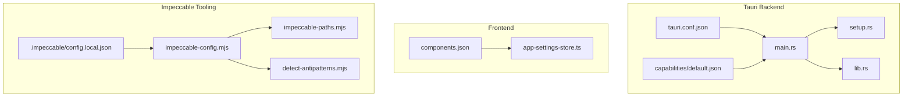
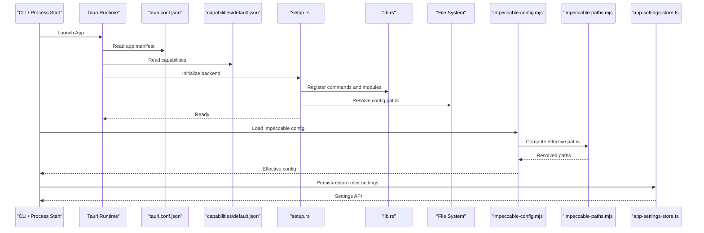
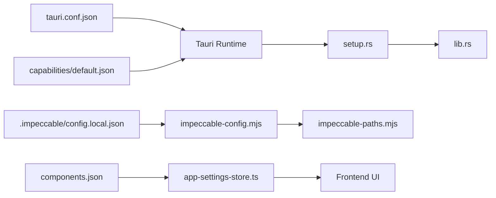

# Configuration Files & Formats

<cite>
**Referenced Files in This Document**
- [tauri.conf.json](file://src-tauri/tauri.conf.json)
- [default.json](file://src-tauri/capabilities/default.json)
- [config.local.json](file://.impeccable/config.local.json)
- [impeccable-config.mjs](file://.gemini/skills/impeccable/scripts/lib/impeccable-config.mjs)
- [impeccable-paths.mjs](file://.gemini/skills/impeccable/scripts/lib/impeccable-paths.mjs)
- [detect-antipatterns.mjs](file://.gemini/skills/impeccable/scripts/detect-antipatterns.mjs)
- [SKILL.md](file://.agents/skills/impeccable/SKILL.md)
- [components.json](file://components.json)
- [app-settings-store.ts](file://src/stores/app-settings-store.ts)
- [main.rs](file://src-tauri/src/main.rs)
- [setup.rs](file://src-tauri/src/setup.rs)
- [lib.rs](file://src-tauri/src/lib.rs)
- [package.json](file://package.json)
</cite>

## Table of Contents
1. Introduction
2. Project Structure
3. Core Components
4. Architecture Overview
5. Detailed Component Analysis
6. Dependency Analysis
7. Performance Considerations
8. Troubleshooting Guide
9. Conclusion

## Introduction
This document explains all configuration file formats used by Apprecon, including JSON schemas, environment variables, and programmatic configuration APIs. It covers:
- .impeccable configuration format and behavior
- Tauri app configuration and capabilities
- Component library settings
- Configuration precedence and inheritance rules
- Migration strategies between versions
- Common configuration scenarios, validation rules, and troubleshooting
- Backup and restore procedures for configuration files

## Project Structure
Apprecon uses several configuration sources across the frontend (TypeScript/React), backend (Tauri/Rust), and tooling (.impeccable). The most relevant configuration files are:
- Tauri application manifest and capabilities
- .impeccable local configuration and path resolution
- Component library configuration
- Frontend persistent settings store

**Diagram sources**
- [tauri.conf.json](file://src-tauri/tauri.conf.json)
- [default.json](file://src-tauri/capabilities/default.json)
- [main.rs](file://src-tauri/src/main.rs)
- [setup.rs](file://src-tauri/src/setup.rs)
- [lib.rs](file://src-tauri/src/lib.rs)
- [components.json](file://components.json)
- [app-settings-store.ts](file://src/stores/app-settings-store.ts)
- [.impeccable/config.local.json](file://.impeccable/config.local.json)
- [impeccable-config.mjs](file://.gemini/skills/impeccable/scripts/lib/impeccable-config.mjs)
- [impeccable-paths.mjs](file://.gemini/skills/impeccable/scripts/lib/impeccable-paths.mjs)
- [detect-antipatterns.mjs](file://.gemini/skills/impeccable/scripts/detect-antipatterns.mjs)

**Section sources**
- [tauri.conf.json](file://src-tauri/tauri.conf.json)
- [default.json](file://src-tauri/capabilities/default.json)
- [components.json](file://components.json)
- [app-settings-store.ts](file://src/stores/app-settings-store.ts)
- [.impeccable/config.local.json](file://.impeccable/config.local.json)
- [impeccable-config.mjs](file://.gemini/skills/impeccable/scripts/lib/impeccable-config.mjs)
- [impeccable-paths.mjs](file://.gemini/skills/impeccable/scripts/lib/impeccable-paths.mjs)
- [detect-antipatterns.mjs](file://.gemini/skills/impeccable/scripts/detect-antipatterns.mjs)
- [main.rs](file://src-tauri/src/main.rs)
- [setup.rs](file://src-tauri/src/setup.rs)
- [lib.rs](file://src-tauri/src/lib.rs)

## Core Components
- Tauri configuration: Application metadata, window settings, security capabilities, and plugin configuration are defined in the Tauri manifest and capabilities.
- Impeccable configuration: Local overrides and runtime paths for the impeccable skill are resolved via a dedicated config loader and path utilities.
- Component library settings: UI component defaults and feature flags are managed through a component configuration file consumed by the build/runtime.
- Persistent app settings: User preferences and runtime state are persisted in a structured store accessible from the frontend.

Key responsibilities:
- Load and validate configuration at startup
- Merge layered configurations with precedence rules
- Expose configuration to both frontend and backend
- Provide migration helpers when schema changes occur

**Section sources**
- [tauri.conf.json](file://src-tauri/tauri.conf.json)
- [default.json](file://src-tauri/capabilities/default.json)
- [impeccable-config.mjs](file://.gemini/skills/impeccable/scripts/lib/impeccable-config.mjs)
- [impeccable-paths.mjs](file://.gemini/skills/impeccable/scripts/lib/impeccable-paths.mjs)
- [components.json](file://components.json)
- [app-settings-store.ts](file://src/stores/app-settings-store.ts)

## Architecture Overview
Configuration flows through multiple layers:
- Tauri manifest and capabilities define app-level constraints and permissions.
- Impeccable config loader resolves local overrides and computes effective paths.
- Frontend settings store persists user preferences and exposes them to UI components.
- Backend setup initializes services based on configuration and capabilities.

**Diagram sources**
- [tauri.conf.json](file://src-tauri/tauri.conf.json)
- [default.json](file://src-tauri/capabilities/default.json)
- [setup.rs](file://src-tauri/src/setup.rs)
- [lib.rs](file://src-tauri/src/lib.rs)
- [impeccable-config.mjs](file://.gemini/skills/impeccable/scripts/lib/impeccable-config.mjs)
- [impeccable-paths.mjs](file://.gemini/skills/impeccable/scripts/lib/impeccable-paths.mjs)
- [app-settings-store.ts](file://src/stores/app-settings-store.ts)

## Detailed Component Analysis

### Tauri Configuration (Application Manifest and Capabilities)
The Tauri manifest defines:
- App identity, version, and build settings
- Window properties and lifecycle hooks
- Security policies and allowed domains
- Plugin configuration and IPC bindings

Capabilities restrict what the frontend can do:
- File system access scopes
- Network request allowances
- Command exposure to the frontend

Precedence and validation:
- Manifest is authoritative for app-level settings
- Capabilities enforce runtime permissions; violations cause errors
- Environment variables may override certain fields if supported by the build process

Migration considerations:
- When updating Tauri versions, check for deprecated keys or new required fields
- Validate capability scopes after upgrades to avoid permission regressions

**Section sources**
- [tauri.conf.json](file://src-tauri/tauri.conf.json)
- [default.json](file://src-tauri/capabilities/default.json)

### Impeccable Configuration (.impeccable)
The .impeccable directory holds local overrides and runtime configuration for the impeccable skill:
- config.local.json provides per-project overrides
- Config loader merges base and local configs
- Path utilities resolve absolute locations for scripts and assets

Behavior:
- If local config exists, it takes precedence over defaults
- Path resolution accounts for project root and nested directories
- Validation ensures required keys exist before running detection

Common scenarios:
- Override default rules or engines
- Customize output paths and report formats
- Enable/disable specific detectors

Validation rules:
- Required keys must be present
- Path values must resolve to existing files or directories
- Type checks ensure correct data shapes

Migration strategies:
- Rename or deprecate keys gradually with backward compatibility
- Provide migration scripts to transform old config to new schema

**Section sources**
- [.impeccable/config.local.json](file://.impeccable/config.local.json)
- [impeccable-config.mjs](file://.gemini/skills/impeccable/scripts/lib/impeccable-config.mjs)
- [impeccable-paths.mjs](file://.gemini/skills/impeccable/scripts/lib/impeccable-paths.mjs)
- [detect-antipatterns.mjs](file://.gemini/skills/impeccable/scripts/detect-antipatterns.mjs)
- [SKILL.md](file://.agents/skills/impeccable/SKILL.md)

### Component Library Settings
Component library configuration controls UI defaults and feature flags:
- Defines theme tokens, layout behaviors, and accessibility options
- Enables/disables experimental features
- Provides programmatic APIs to adjust settings at runtime

Usage patterns:
- Import settings into components to read current values
- Update settings programmatically to reflect user preferences
- Persist changes to the app settings store

Validation:
- Ensure only known keys are accepted
- Guard against invalid combinations of flags

**Section sources**
- [components.json](file://components.json)
- [app-settings-store.ts](file://src/stores/app-settings-store.ts)

### Frontend Persistent Settings Store
The app settings store manages user preferences:
- Reads/writes JSON-backed configuration
- Exposes typed getters/setters for each setting
- Supports incremental updates and validation callbacks

Data flow:
- UI triggers update -> store validates -> writes to disk -> notifies subscribers
- On startup, store loads persisted settings and merges with defaults

Error handling:
- Graceful fallback to defaults on parse errors
- Retry logic for transient write failures

**Section sources**
- [app-settings-store.ts](file://src/stores/app-settings-store.ts)

### Backend Initialization and Configuration Loading
Backend initialization reads configuration and sets up services:
- Main entry point bootstraps Tauri and registers commands
- Setup module initializes subsystems based on configuration
- Library module exposes APIs to the frontend

Security:
- Enforce capability-based access control
- Validate inputs to commands and handlers

**Section sources**
- [main.rs](file://src-tauri/src/main.rs)
- [setup.rs](file://src-tauri/src/setup.rs)
- [lib.rs](file://src-tauri/src/lib.rs)

## Dependency Analysis
Configuration dependencies form a clear hierarchy:
- Tauri manifest and capabilities are foundational
- Impeccable config depends on path resolution utilities
- Frontend settings store depends on component library settings
- Backend initialization consumes both Tauri and filesystem configuration

**Diagram sources**
- [tauri.conf.json](file://src-tauri/tauri.conf.json)
- [default.json](file://src-tauri/capabilities/default.json)
- [setup.rs](file://src-tauri/src/setup.rs)
- [lib.rs](file://src-tauri/src/lib.rs)
- [.impeccable/config.local.json](file://.impeccable/config.local.json)
- [impeccable-config.mjs](file://.gemini/skills/impeccable/scripts/lib/impeccable-config.mjs)
- [impeccable-paths.mjs](file://.gemini/skills/impeccable/scripts/lib/impeccable-paths.mjs)
- [components.json](file://components.json)
- [app-settings-store.ts](file://src/stores/app-settings-store.ts)

**Section sources**
- [tauri.conf.json](file://src-tauri/tauri.conf.json)
- [default.json](file://src-tauri/capabilities/default.json)
- [impeccable-config.mjs](file://.gemini/skills/impeccable/scripts/lib/impeccable-config.mjs)
- [impeccable-paths.mjs](file://.gemini/skills/impeccable/scripts/lib/impeccable-paths.mjs)
- [components.json](file://components.json)
- [app-settings-store.ts](file://src/stores/app-settings-store.ts)
- [main.rs](file://src-tauri/src/main.rs)
- [setup.rs](file://src-tauri/src/setup.rs)
- [lib.rs](file://src-tauri/src/lib.rs)

## Performance Considerations
- Minimize configuration parsing overhead by caching resolved values
- Avoid frequent disk I/O by batching settings updates
- Use lazy loading for large configuration sections
- Validate configuration once at startup and reuse validated results

[No sources needed since this section provides general guidance]

## Troubleshooting Guide
Common issues and resolutions:
- Invalid JSON syntax in configuration files: Validate using a JSON linter and fix syntax errors
- Missing required keys: Check schema definitions and add missing fields
- Permission denied errors: Review Tauri capabilities and ensure proper scopes are granted
- Path resolution failures: Verify that referenced paths exist and are accessible
- Settings not persisting: Confirm write permissions and storage location

Diagnostic steps:
- Inspect error logs from Tauri runtime
- Print effective configuration after merging layers
- Test path resolution independently
- Validate settings store operations with sample data

**Section sources**
- [tauri.conf.json](file://src-tauri/tauri.conf.json)
- [default.json](file://src-tauri/capabilities/default.json)
- [impeccable-config.mjs](file://.gemini/skills/impeccable/scripts/lib/impeccable-config.mjs)
- [impeccable-paths.mjs](file://.gemini/skills/impeccable/scripts/lib/impeccable-paths.mjs)
- [app-settings-store.ts](file://src/stores/app-settings-store.ts)

## Conclusion
Apprecon’s configuration system combines Tauri manifests, capabilities, .impeccable local overrides, component library settings, and a persistent frontend store. Understanding the precedence rules, validation requirements, and migration strategies ensures reliable operation across versions. Use the troubleshooting guide to diagnose common issues and follow backup/restore procedures to maintain configuration integrity.

[No sources needed since this section summarizes without analyzing specific files]

## Appendices

### Configuration Precedence and Inheritance Rules
- Tauri manifest overrides build-time defaults
- Capabilities enforce runtime permissions regardless of other settings
- .impeccable local config overrides base configuration
- Frontend settings merge defaults with user preferences
- Backend initialization applies merged configuration to services

### Migration Strategies Between Versions
- Maintain backward compatibility for deprecated keys
- Provide automated migration scripts where possible
- Document breaking changes clearly
- Test configuration loading with old and new schemas

### Backup and Restore Procedures
- Back up configuration files regularly
- Use version control for tracking changes
- Implement restore functionality in the application
- Validate restored configurations before applying

[No sources needed since this section provides general guidance]