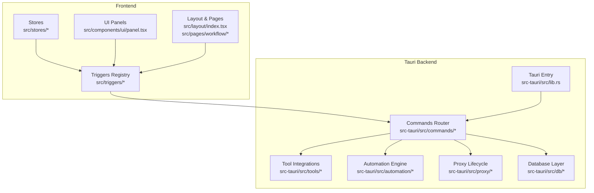
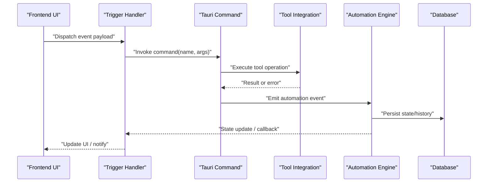
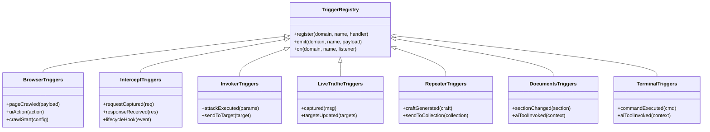
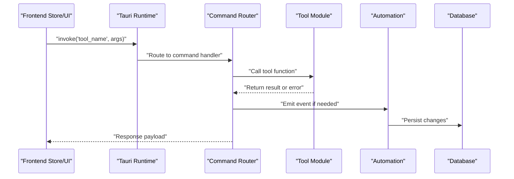
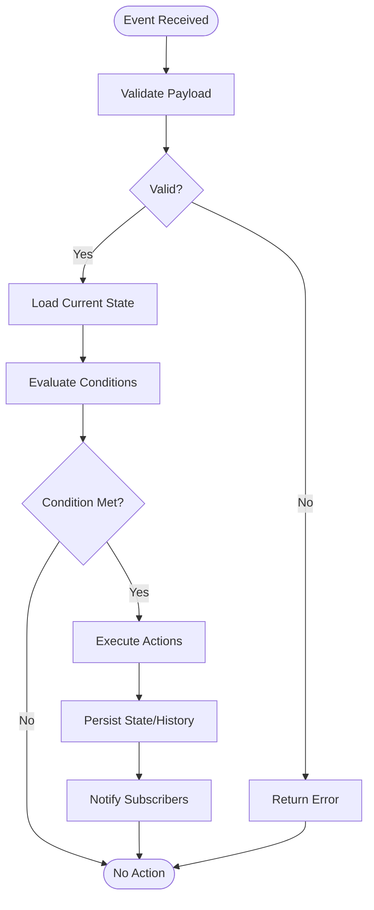
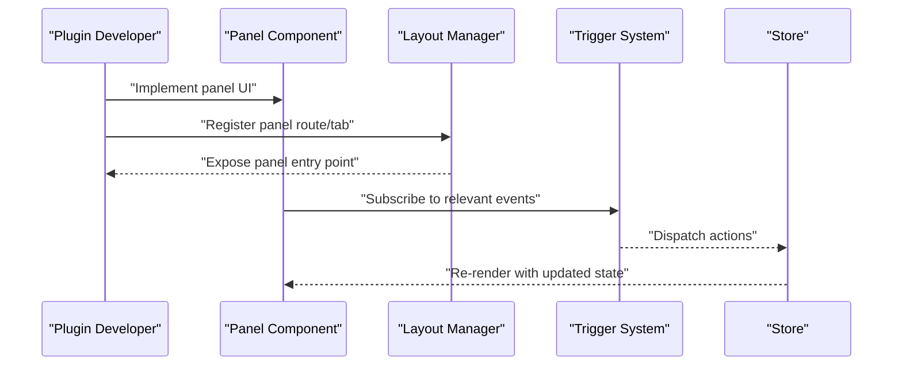
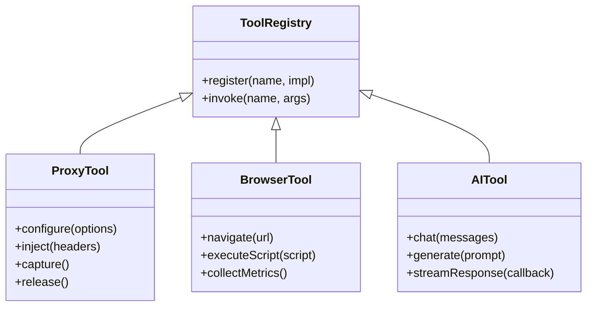
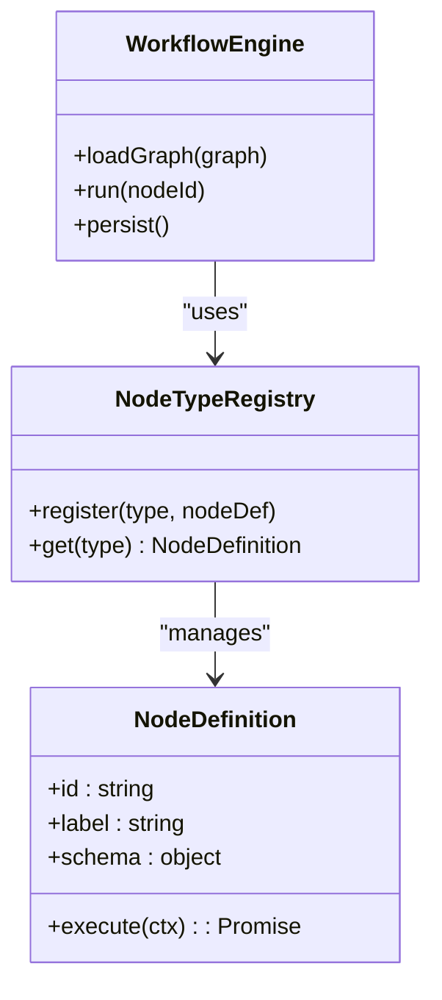
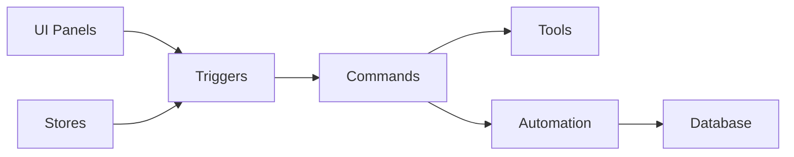

# Plugin Development & Extensions

<cite>
**Referenced Files in This Document**
- [src/triggers/index.ts](file://src/triggers/index.ts)
- [src/triggers/browser/index.ts](file://src/triggers/browser/index.ts)
- [src/triggers/intercept/index.ts](file://src/triggers/intercept/index.ts)
- [src/triggers/invoker/index.ts](file://src/triggers/invoker/index.ts)
- [src/triggers/live-traffic/index.ts](file://src/triggers/live-traffic/index.ts)
- [src/triggers/repeater/index.ts](file://src/triggers/repeater/index.ts)
- [src/triggers/documents/index.ts](file://src/triggers/documents/index.ts)
- [src/triggers/terminal/index.ts](file://src/triggers/terminal/index.ts)
- [src-tauri/src/lib.rs](file://src-tauri/src/lib.rs)
- [src-tauri/src/app_commands.rs](file://src-tauri/src/app_commands.rs)
- [src-tauri/src/commands/mod.rs](file://src-tauri/src/commands/mod.rs)
- [src-tauri/src/commands/ai.rs](file://src-tauri/src/commands/ai.rs)
- [src-tauri/src/commands/browser.rs](file://src-tauri/src/commands/browser.rs)
- [src-tauri/src/commands/intercept.rs](file://src-tauri/src/commands/intercept.rs)
- [src-tauri/src/commands/invoker.rs](file://src-tauri/src/commands/invoker.rs)
- [src-tauri/src/commands/repeater.rs](file://src-tauri/src/commands/repeater.rs)
- [src-tauri/src/tools/mod.rs](file://src-tauri/src/tools/mod.rs)
- [src-tauri/src/tools/proxy_tool.rs](file://src-tauri/src/tools/proxy_tool.rs)
- [src-tauri/src/automation/mod.rs](file://src-tauri/src/automation/mod.rs)
- [src-tauri/src/automation/events.rs](file://src-tauri/src/automation/events.rs)
- [src-tauri/src/automation/state.rs](file://src-tauri/src/automation/state.rs)
- [src-tauri/src/proxy/mod.rs](file://src-tauri/src/proxy/mod.rs)
- [src-tauri/src/proxy/lifecycle.rs](file://src-tauri/src/proxy/lifecycle.rs)
- [src-tauri/src/db/mod.rs](file://src-tauri/src/db/mod.rs)
- [src-tauri/src/types.rs](file://src-tauri/src/types.rs)
- [src/stores/tools.ts](file://src/stores/tools.ts)
- [src/stores/app-settings-store.ts](file://src/stores/app-settings-store.ts)
- [src/components/ui/panel.tsx](file://src/components/ui/panel.tsx)
- [src/layout/index.tsx](file://src/layout/index.tsx)
- [src/pages/workflow/index.tsx](file://src/pages/workflow/index.tsx)
- [src/pages/workflow/node-type-registry.ts](file://src/pages/workflow/node-type-registry.ts)
- [src/pages/workflow/nodes/index.ts](file://src/pages/workflow/nodes/index.ts)
</cite>

## Table of Contents
1. [Introduction](#introduction)
2. [Project Structure](#project-structure)
3. [Core Components](#core-components)
4. [Architecture Overview](#architecture-overview)
5. [Detailed Component Analysis](#detailed-component-analysis)
6. [Dependency Analysis](#dependency-analysis)
7. [Performance Considerations](#performance-considerations)
8. [Troubleshooting Guide](#troubleshooting-guide)
9. [Conclusion](#conclusion)
10. [Appendices](#appendices)

## Introduction
This document explains how to develop plugins and extensions for Apprecon, focusing on the plugin architecture, trigger system, extension points, Tauri command integration, custom tools, UI panels, automation workflows, lifecycle management, error handling, and distribution strategies. It is designed for both frontend-focused developers and Rust/Tauri backend contributors.

## Project Structure
Apprecon’s extensibility spans three layers:
- Frontend triggers and UI hooks (TypeScript/React)
- Backend commands and tool integrations (Rust/Tauri)
- Automation engine and state persistence (Rust + DB)

**Diagram sources**
- [src/triggers/index.ts](file://src/triggers/index.ts)
- [src-tauri/src/lib.rs](file://src-tauri/src/lib.rs)
- [src-tauri/src/commands/mod.rs](file://src-tauri/src/commands/mod.rs)
- [src-tauri/src/tools/mod.rs](file://src-tauri/src/tools/mod.rs)
- [src-tauri/src/automation/mod.rs](file://src-tauri/src/automation/mod.rs)
- [src-tauri/src/proxy/mod.rs](file://src-tauri/src/proxy/mod.rs)
- [src-tauri/src/db/mod.rs](file://src-tauri/src/db/mod.rs)
- [src/components/ui/panel.tsx](file://src/components/ui/panel.tsx)
- [src/layout/index.tsx](file://src/layout/index.tsx)

**Section sources**
- [src/triggers/index.ts](file://src/triggers/index.ts)
- [src-tauri/src/lib.rs](file://src-tauri/src/lib.rs)
- [src-tauri/src/commands/mod.rs](file://src-tauri/src/commands/mod.rs)
- [src/components/ui/panel.tsx](file://src/components/ui/panel.tsx)
- [src/layout/index.tsx](file://src/layout/index.tsx)

## Core Components
- Trigger System: Central registry that maps event names to handlers across domains (browser, intercept, invoker, live-traffic, repeater, documents, terminal).
- Tauri Commands: Secure bridge exposing Rust functionality to the frontend via typed commands.
- Tools: Reusable capabilities (e.g., proxy tool, browser tool) invoked by commands or workflows.
- Automation Engine: Event-driven execution pipeline with conditions, actions, and persistent state.
- UI Extension Points: Panel registration and layout integration for new features.

Key responsibilities:
- Triggers subscribe to domain events and dispatch actions or UI updates.
- Commands implement secure, versioned APIs for cross-process calls.
- Tools encapsulate business logic and I/O operations.
- Automation orchestrates multi-step flows triggered by events or schedules.
- UI components expose extension points for registering new panels and tabs.

**Section sources**
- [src/triggers/index.ts](file://src/triggers/index.ts)
- [src-tauri/src/commands/mod.rs](file://src-tauri/src/commands/mod.rs)
- [src-tauri/src/tools/mod.rs](file://src-tauri/src/tools/mod.rs)
- [src-tauri/src/automation/mod.rs](file://src-tauri/src/automation/mod.rs)
- [src/components/ui/panel.tsx](file://src/components/ui/panel.tsx)

## Architecture Overview
The plugin architecture follows a clear separation between UI-triggered actions and backend processing:

**Diagram sources**
- [src/triggers/index.ts](file://src/triggers/index.ts)
- [src-tauri/src/commands/mod.rs](file://src-tauri/src/commands/mod.rs)
- [src-tauri/src/tools/mod.rs](file://src-tauri/src/tools/mod.rs)
- [src-tauri/src/automation/mod.rs](file://src-tauri/src/automation/mod.rs)
- [src-tauri/src/db/mod.rs](file://src-tauri/src/db/mod.rs)

## Detailed Component Analysis

### Trigger System
The trigger system provides a centralized registry for subscribing to domain-specific events and executing handlers. Each domain folder contains an index that aggregates available triggers and their metadata.

**Diagram sources**
- [src/triggers/index.ts](file://src/triggers/index.ts)
- [src/triggers/browser/index.ts](file://src/triggers/browser/index.ts)
- [src/triggers/intercept/index.ts](file://src/triggers/intercept/index.ts)
- [src/triggers/invoker/index.ts](file://src/triggers/invoker/index.ts)
- [src/triggers/live-traffic/index.ts](file://src/triggers/live-traffic/index.ts)
- [src/triggers/repeater/index.ts](file://src/triggers/repeater/index.ts)
- [src/triggers/documents/index.ts](file://src/triggers/documents/index.ts)
- [src/triggers/terminal/index.ts](file://src/triggers/terminal/index.ts)

How to create a custom trigger:
- Define a new domain folder under src/triggers/<domain>.
- Implement an index file that registers your trigger handlers with the registry.
- Emit events from UI or backend using the trigger API.
- Subscribe listeners to react to events and update stores or call Tauri commands.

Best practices:
- Keep payloads small and typed.
- Avoid blocking operations in handlers; delegate to commands or background tasks.
- Use unique event names scoped by domain to avoid collisions.

**Section sources**
- [src/triggers/index.ts](file://src/triggers/index.ts)
- [src/triggers/browser/index.ts](file://src/triggers/browser/index.ts)
- [src/triggers/intercept/index.ts](file://src/triggers/intercept/index.ts)
- [src/triggers/invoker/index.ts](file://src/triggers/invoker/index.ts)
- [src/triggers/live-traffic/index.ts](file://src/triggers/live-traffic/index.ts)
- [src/triggers/repeater/index.ts](file://src/triggers/repeater/index.ts)
- [src/triggers/documents/index.ts](file://src/triggers/documents/index.ts)
- [src/triggers/terminal/index.ts](file://src/triggers/terminal/index.ts)

### Tauri Commands and Tool Integration
Commands are the secure interface between frontend and Rust backend. They are organized by feature area and registered centrally.

**Diagram sources**
- [src-tauri/src/lib.rs](file://src-tauri/src/lib.rs)
- [src-tauri/src/commands/mod.rs](file://src-tauri/src/commands/mod.rs)
- [src-tauri/src/commands/ai.rs](file://src-tauri/src/commands/ai.rs)
- [src-tauri/src/commands/browser.rs](file://src-tauri/src/commands/browser.rs)
- [src-tauri/src/commands/intercept.rs](file://src-tauri/src/commands/intercept.rs)
- [src-tauri/src/commands/invoker.rs](file://src-tauri/src/commands/invoker.rs)
- [src-tauri/src/commands/repeater.rs](file://src-tauri/src/commands/repeater.rs)
- [src-tauri/src/tools/mod.rs](file://src-tauri/src/tools/mod.rs)
- [src-tauri/src/tools/proxy_tool.rs](file://src-tauri/src/tools/proxy_tool.rs)
- [src-tauri/src/automation/mod.rs](file://src-tauri/src/automation/mod.rs)
- [src-tauri/src/db/mod.rs](file://src-tauri/src/db/mod.rs)

How to implement a Tauri command:
- Add a new function in the appropriate commands module.
- Register it in the central command router.
- Expose it to the frontend via a typed invoke call.
- Handle errors explicitly and return structured responses.

Integration with tools:
- Encapsulate reusable logic in tool modules.
- Call tools from commands to keep concerns separated.
- Use automation events to propagate side effects.

**Section sources**
- [src-tauri/src/lib.rs](file://src-tauri/src/lib.rs)
- [src-tauri/src/commands/mod.rs](file://src-tauri/src/commands/mod.rs)
- [src-tauri/src/commands/ai.rs](file://src-tauri/src/commands/ai.rs)
- [src-tauri/src/commands/browser.rs](file://src-tauri/src/commands/browser.rs)
- [src-tauri/src/commands/intercept.rs](file://src-tauri/src/commands/intercept.rs)
- [src-tauri/src/commands/invoker.rs](file://src-tauri/src/commands/invoker.rs)
- [src-tauri/src/commands/repeater.rs](file://src-tauri/src/commands/repeater.rs)
- [src-tauri/src/tools/mod.rs](file://src-tauri/src/tools/mod.rs)
- [src-tauri/src/tools/proxy_tool.rs](file://src-tauri/src/tools/proxy_tool.rs)

### Automation Workflows
The automation engine executes sequences of actions based on events and conditions, persisting state and emitting results.

**Diagram sources**
- [src-tauri/src/automation/mod.rs](file://src-tauri/src/automation/mod.rs)
- [src-tauri/src/automation/events.rs](file://src-tauri/src/automation/events.rs)
- [src-tauri/src/automation/state.rs](file://src-tauri/src/automation/state.rs)

How to build automation workflows:
- Define event types and payloads.
- Implement condition evaluators.
- Chain actions and ensure idempotency where possible.
- Persist intermediate state for recovery and auditability.

**Section sources**
- [src-tauri/src/automation/mod.rs](file://src-tauri/src/automation/mod.rs)
- [src-tauri/src/automation/events.rs](file://src-tauri/src/automation/events.rs)
- [src-tauri/src/automation/state.rs](file://src-tauri/src/automation/state.rs)

### Extending the UI with New Panels
New panels can be registered into the layout and integrated with triggers and stores.

**Diagram sources**
- [src/components/ui/panel.tsx](file://src/components/ui/panel.tsx)
- [src/layout/index.tsx](file://src/layout/index.tsx)
- [src/triggers/index.ts](file://src/triggers/index.ts)
- [src/stores/tools.ts](file://src/stores/tools.ts)

Steps to add a panel:
- Create a React component implementing the panel contract.
- Register the panel in the layout configuration.
- Connect to triggers to receive updates.
- Update stores to reflect state changes.

**Section sources**
- [src/components/ui/panel.tsx](file://src/components/ui/panel.tsx)
- [src/layout/index.tsx](file://src/layout/index.tsx)
- [src/stores/tools.ts](file://src/stores/tools.ts)

### Custom Tools
Tools encapsulate reusable logic such as proxy interactions, browser operations, and AI integrations.

**Diagram sources**
- [src-tauri/src/tools/mod.rs](file://src-tauri/src/tools/mod.rs)
- [src-tauri/src/tools/proxy_tool.rs](file://src-tauri/src/tools/proxy_tool.rs)

How to create a custom tool:
- Implement a tool struct with methods for each capability.
- Register the tool in the registry.
- Invoke from commands or automation actions.

**Section sources**
- [src-tauri/src/tools/mod.rs](file://src-tauri/src/tools/mod.rs)
- [src-tauri/src/tools/proxy_tool.rs](file://src-tauri/src/tools/proxy_tool.rs)

### Workflow Nodes and Templates
Workflow nodes define discrete steps in automation pipelines. The node type registry allows extending supported node types.

**Diagram sources**
- [src/pages/workflow/node-type-registry.ts](file://src/pages/workflow/node-type-registry.ts)
- [src/pages/workflow/nodes/index.ts](file://src/pages/workflow/nodes/index.ts)
- [src/pages/workflow/index.tsx](file://src/pages/workflow/index.tsx)

How to extend workflow nodes:
- Define a new node type with schema and execution logic.
- Register it in the node type registry.
- Use templates to simplify common patterns.

**Section sources**
- [src/pages/workflow/node-type-registry.ts](file://src/pages/workflow/node-type-registry.ts)
- [src/pages/workflow/nodes/index.ts](file://src/pages/workflow/nodes/index.ts)
- [src/pages/workflow/index.tsx](file://src/pages/workflow/index.tsx)

## Dependency Analysis
Extensibility relies on clear boundaries between modules:

Guidelines:
- Minimize direct coupling between UI and backend; use triggers and commands.
- Keep tools independent and composable.
- Use automation events to decouple side effects.

**Diagram sources**
- [src/triggers/index.ts](file://src/triggers/index.ts)
- [src-tauri/src/commands/mod.rs](file://src-tauri/src/commands/mod.rs)
- [src-tauri/src/tools/mod.rs](file://src-tauri/src/tools/mod.rs)
- [src-tauri/src/automation/mod.rs](file://src-tauri/src/automation/mod.rs)
- [src-tauri/src/db/mod.rs](file://src-tauri/src/db/mod.rs)

**Section sources**
- [src/stores/tools.ts](file://src/stores/tools.ts)
- [src/stores/app-settings-store.ts](file://src/stores/app-settings-store.ts)

## Performance Considerations
- Prefer async operations in triggers and commands to avoid UI blocking.
- Batch database writes in automation to reduce I/O overhead.
- Cache frequently accessed data in stores and tools where safe.
- Use streaming responses for long-running AI or network operations.
- Profile heavy computations and offload to background tasks.

[No sources needed since this section provides general guidance]

## Troubleshooting Guide
Common issues and resolutions:
- Trigger not firing: Verify registration and event name scoping.
- Command invocation fails: Check Tauri command registration and permissions.
- Tool execution errors: Inspect tool logs and validate input schemas.
- Automation state inconsistencies: Ensure idempotent actions and proper persistence.
- UI not updating: Confirm store subscriptions and trigger listeners.

Debugging tips:
- Enable verbose logging in commands and tools.
- Use automation state snapshots to trace execution paths.
- Validate payloads against schemas before processing.

**Section sources**
- [src-tauri/src/types.rs](file://src-tauri/src/types.rs)
- [src-tauri/src/proxy/lifecycle.rs](file://src-tauri/src/proxy/lifecycle.rs)

## Conclusion
Apprecon’s plugin architecture enables powerful extensibility through a robust trigger system, secure Tauri commands, modular tools, and an event-driven automation engine. By following the patterns outlined here, you can create custom triggers, implement Tauri commands, integrate with existing tools, extend the UI, and build sophisticated automation workflows. Adhering to best practices ensures maintainability, performance, and reliability across team-wide distributions.

[No sources needed since this section summarizes without analyzing specific files]

## Appendices

### Plugin Lifecycle
- Initialization: Register triggers, commands, tools, and UI panels during app startup.
- Runtime: Handle events, execute commands, and manage state transitions.
- Shutdown: Clean up resources, persist final state, and release locks.

[No sources needed since this section provides general guidance]

### Distribution Methods
- Package plugins as separate modules or crates for reuse.
- Share via internal registries or version-controlled repositories.
- Provide configuration manifests for dependency resolution.
- Include tests and documentation for team adoption.

[No sources needed since this section provides general guidance]