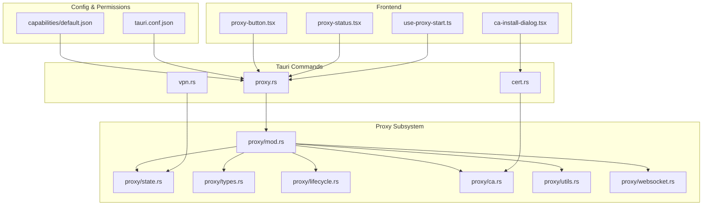
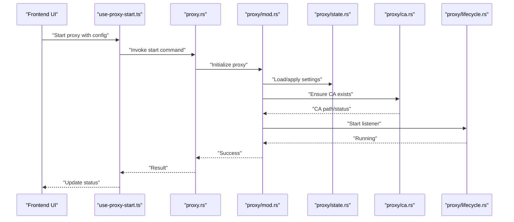
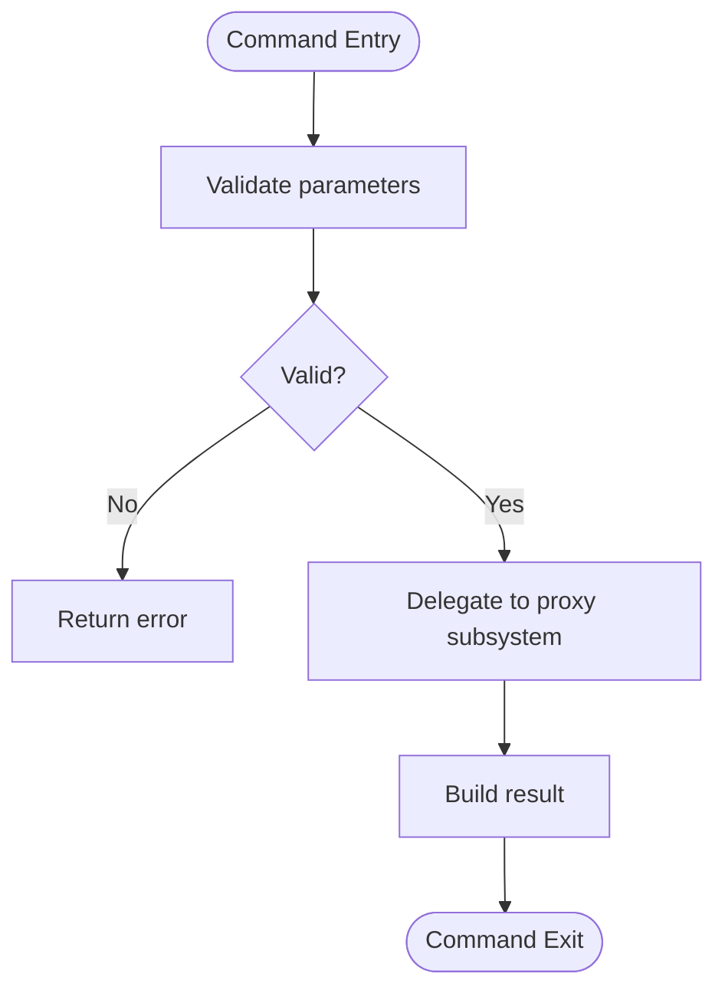
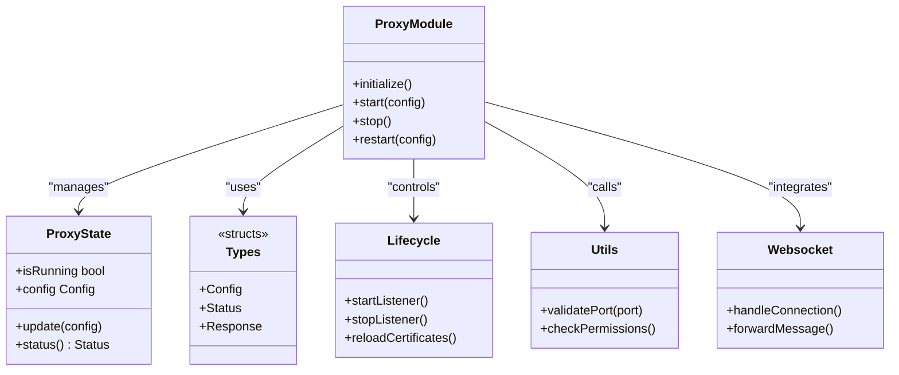
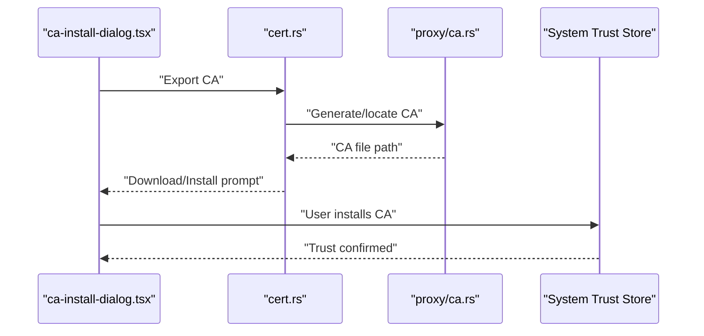
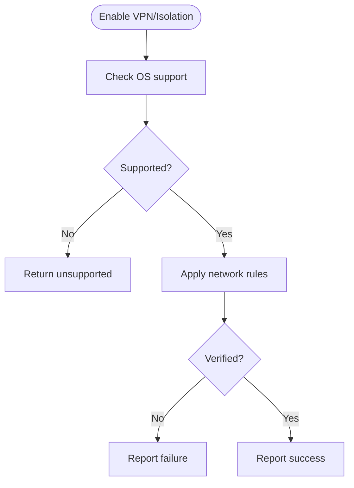
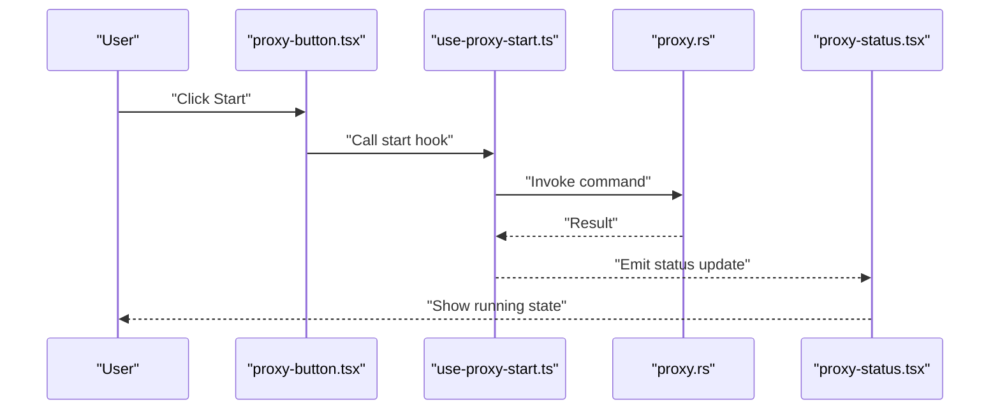
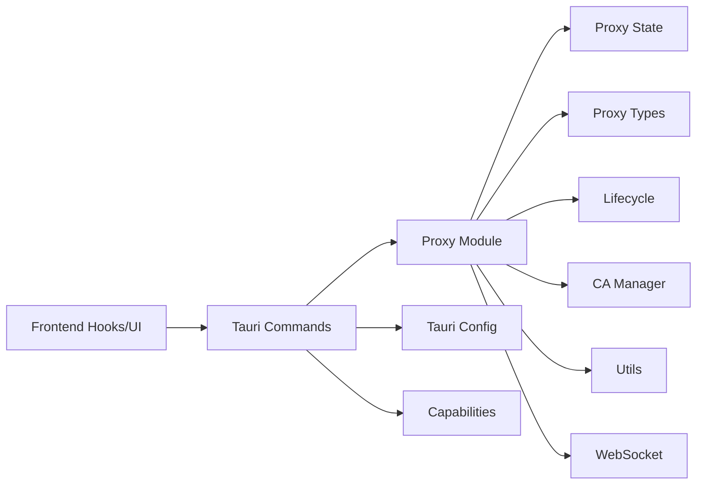

# Proxy & Security Configuration

<cite>
**Referenced Files in This Document**
- [proxy.rs](file://src-tauri/src/commands/proxy.rs)
- [ca.rs](file://src-tauri/src/proxy/ca.rs)
- [lifecycle.rs](file://src-tauri/src/proxy/lifecycle.rs)
- [state.rs](file://src-tauri/src/proxy/state.rs)
- [types.rs](file://src-tauri/src/proxy/types.rs)
- [mod.rs](file://src-tauri/src/proxy/mod.rs)
- [utils.rs](file://src-tauri/src/proxy/utils.rs)
- [websocket.rs](file://src-tauri/src/proxy/websocket.rs)
- [cert.rs](file://src-tauri/src/commands/cert.rs)
- [vpn.rs](file://src-tauri/src/commands/vpn.rs)
- [use-proxy-start.ts](file://src/hooks/use-proxy-start.ts)
- [proxy-status.tsx](file://src/layout/footer/proxy-status.tsx)
- [proxy-button.tsx](file://src/layout/proxy-button.tsx)
- [ca-install-dialog.tsx](file://src/components/ca-install-dialog.tsx)
- [tauri.conf.json](file://src-tauri/tauri.conf.json)
- [default.json](file://src-tauri/capabilities/default.json)
</cite>

## Table of Contents
1. [Introduction](#introduction)
2. [Project Structure](#project-structure)
3. [Core Components](#core-components)
4. [Architecture Overview](#architecture-overview)
5. [Detailed Component Analysis](#detailed-component-analysis)
6. [Dependency Analysis](#dependency-analysis)
7. [Performance Considerations](#performance-considerations)
8. [Troubleshooting Guide](#troubleshooting-guide)
9. [Conclusion](#conclusion)
10. [Appendices](#appendices)

## Introduction
This document explains how Apprecon configures and manages proxy and security settings, including CA certificate management, SSL/TLS behavior, proxy server configuration, CORS considerations, and network isolation options. It provides practical guidance for corporate proxy setups, self-signed certificates, trust store management, and enterprise-grade security policies for team deployments.

## Project Structure
Apprecon’s proxy and security features are implemented across Rust backend modules (Tauri commands and proxy subsystem), a small set of frontend hooks and UI components, and Tauri configuration files that govern capabilities and permissions.

**Diagram sources**
- [proxy.rs:1-L](file://src-tauri/src/commands/proxy.rs#L1-L)
- [cert.rs:1-L](file://src-tauri/src/commands/cert.rs#L1-L)
- [vpn.rs:1-L](file://src-tauri/src/commands/vpn.rs#L1-L)
- [mod.rs:1-L](file://src-tauri/src/proxy/mod.rs#L1-L)
- [state.rs:1-L](file://src-tauri/src/proxy/state.rs#L1-L)
- [types.rs:1-L](file://src-tauri/src/proxy/types.rs#L1-L)
- [lifecycle.rs:1-L](file://src-tauri/src/proxy/lifecycle.rs#L1-L)
- [ca.rs:1-L](file://src-tauri/src/proxy/ca.rs#L1-L)
- [utils.rs:1-L](file://src-tauri/src/proxy/utils.rs#L1-L)
- [websocket.rs:1-L](file://src-tauri/src/proxy/websocket.rs#L1-L)
- [tauri.conf.json:1-L](file://src-tauri/tauri.conf.json#L1-L)
- [default.json:1-L](file://src-tauri/capabilities/default.json#L1-L)

**Section sources**
- [proxy.rs:1-L](file://src-tauri/src/commands/proxy.rs#L1-L)
- [cert.rs:1-L](file://src-tauri/src/commands/cert.rs#L1-L)
- [vpn.rs:1-L](file://src-tauri/src/commands/vpn.rs#L1-L)
- [mod.rs:1-L](file://src-tauri/src/proxy/mod.rs#L1-L)
- [state.rs:1-L](file://src-tauri/src/proxy/state.rs#L1-L)
- [types.rs:1-L](file://src-tauri/src/proxy/types.rs#L1-L)
- [lifecycle.rs:1-L](file://src-tauri/src/proxy/lifecycle.rs#L1-L)
- [ca.rs:1-L](file://src-tauri/src/proxy/ca.rs#L1-L)
- [utils.rs:1-L](file://src-tauri/src/proxy/utils.rs#L1-L)
- [websocket.rs:1-L](file://src-tauri/src/proxy/websocket.rs#L1-L)
- [tauri.conf.json:1-L](file://src-tauri/tauri.conf.json#L1-L)
- [default.json:1-L](file://src-tauri/capabilities/default.json#L1-L)

## Core Components
- Tauri command layer exposes operations to start/stop the proxy, manage certificates, and control VPN/network isolation.
- Proxy subsystem encapsulates lifecycle, state, types, utilities, WebSocket handling, and CA certificate generation/installation.
- Frontend hooks and components invoke commands and display status or guide users through certificate installation.

Key responsibilities:
- Proxy lifecycle: start, stop, restart with updated configuration.
- Certificate authority: generate, export, install, and manage trust stores.
- Network isolation: configure VPN or restricted outbound access.
- UI integration: show proxy status and provide guided CA installation.

**Section sources**
- [proxy.rs:1-L](file://src-tauri/src/commands/proxy.rs#L1-L)
- [mod.rs:1-L](file://src-tauri/src/proxy/mod.rs#L1-L)
- [state.rs:1-L](file://src-tauri/src/proxy/state.rs#L1-L)
- [types.rs:1-L](file://src-tauri/src/proxy/types.rs#L1-L)
- [lifecycle.rs:1-L](file://src-tauri/src/proxy/lifecycle.rs#L1-L)
- [ca.rs:1-L](file://src-tauri/src/proxy/ca.rs#L1-L)
- [utils.rs:1-L](file://src-tauri/src/proxy/utils.rs#L1-L)
- [websocket.rs:1-L](file://src-tauri/src/proxy/websocket.rs#L1-L)
- [use-proxy-start.ts:1-L](file://src/hooks/use-proxy-start.ts#L1-L)
- [proxy-status.tsx:1-L](file://src/layout/footer/proxy-status.tsx#L1-L)
- [proxy-button.tsx:1-L](file://src/layout/proxy-button.tsx#L1-L)
- [ca-install-dialog.tsx:1-L](file://src/components/ca-install-dialog.tsx#L1-L)

## Architecture Overview
The proxy and security architecture follows a layered design:
- Frontend invokes Tauri commands via hooks and UI actions.
- Tauri commands orchestrate proxy operations and delegate to the proxy subsystem.
- The proxy subsystem manages runtime state, certificate operations, and networking.
- Tauri configuration and capabilities define permissions and environment constraints.

**Diagram sources**
- [use-proxy-start.ts:1-L](file://src/hooks/use-proxy-start.ts#L1-L)
- [proxy.rs:1-L](file://src-tauri/src/commands/proxy.rs#L1-L)
- [mod.rs:1-L](file://src-tauri/src/proxy/mod.rs#L1-L)
- [state.rs:1-L](file://src-tauri/src/proxy/state.rs#L1-L)
- [ca.rs:1-L](file://src-tauri/src/proxy/ca.rs#L1-L)
- [lifecycle.rs:1-L](file://src-tauri/src/proxy/lifecycle.rs#L1-L)

## Detailed Component Analysis

### Proxy Command Layer (proxy.rs)
- Exposes Tauri commands for proxy lifecycle and configuration.
- Validates inputs and delegates to the proxy subsystem.
- Returns structured results for UI updates.

**Diagram sources**
- [proxy.rs:1-L](file://src-tauri/src/commands/proxy.rs#L1-L)

**Section sources**
- [proxy.rs:1-L](file://src-tauri/src/commands/proxy.rs#L1-L)

### Proxy Subsystem (mod.rs, state.rs, types.rs, lifecycle.rs, utils.rs, websocket.rs)
- mod.rs: Central entrypoint coordinating components.
- state.rs: Holds current proxy configuration and runtime state.
- types.rs: Defines data structures for proxy settings and responses.
- lifecycle.rs: Manages starting/stopping listeners and resources.
- utils.rs: Helper functions for validation and environment checks.
- websocket.rs: Handles WebSocket traffic interception and forwarding.

**Diagram sources**
- [mod.rs:1-L](file://src-tauri/src/proxy/mod.rs#L1-L)
- [state.rs:1-L](file://src-tauri/src/proxy/state.rs#L1-L)
- [types.rs:1-L](file://src-tauri/src/proxy/types.rs#L1-L)
- [lifecycle.rs:1-L](file://src-tauri/src/proxy/lifecycle.rs#L1-L)
- [utils.rs:1-L](file://src-tauri/src/proxy/utils.rs#L1-L)
- [websocket.rs:1-L](file://src-tauri/src/proxy/websocket.rs#L1-L)

**Section sources**
- [mod.rs:1-L](file://src-tauri/src/proxy/mod.rs#L1-L)
- [state.rs:1-L](file://src-tauri/src/proxy/state.rs#L1-L)
- [types.rs:1-L](file://src-tauri/src/proxy/types.rs#L1-L)
- [lifecycle.rs:1-L](file://src-tauri/src/proxy/lifecycle.rs#L1-L)
- [utils.rs:1-L](file://src-tauri/src/proxy/utils.rs#L1-L)
- [websocket.rs:1-L](file://src-tauri/src/proxy/websocket.rs#L1-L)

### Certificate Authority Management (cert.rs, ca.rs)
- cert.rs: Tauri commands for exporting, installing, and managing CA certificates.
- ca.rs: Core logic for generating CA keys/certs, locating system trust stores, and guiding installation.

**Diagram sources**
- [cert.rs:1-L](file://src-tauri/src/commands/cert.rs#L1-L)
- [ca.rs:1-L](file://src-tauri/src/proxy/ca.rs#L1-L)
- [ca-install-dialog.tsx:1-L](file://src/components/ca-install-dialog.tsx#L1-L)

**Section sources**
- [cert.rs:1-L](file://src-tauri/src/commands/cert.rs#L1-L)
- [ca.rs:1-L](file://src-tauri/src/proxy/ca.rs#L1-L)
- [ca-install-dialog.tsx:1-L](file://src/components/ca-install-dialog.tsx#L1-L)

### VPN and Network Isolation (vpn.rs)
- vpn.rs: Commands to enable/disable VPN or restrict outbound connections for isolation.
- Integrates with OS-level networking where applicable.

**Diagram sources**
- [vpn.rs:1-L](file://src-tauri/src/commands/vpn.rs#L1-L)

**Section sources**
- [vpn.rs:1-L](file://src-tauri/src/commands/vpn.rs#L1-L)

### Frontend Integration (use-proxy-start.ts, proxy-status.tsx, proxy-button.tsx)
- use-proxy-start.ts: Hook to start proxy with provided configuration and handle results.
- proxy-status.tsx: Displays current proxy status and quick actions.
- proxy-button.tsx: Provides UI controls to toggle proxy and navigate to settings.

**Diagram sources**
- [use-proxy-start.ts:1-L](file://src/hooks/use-proxy-start.ts#L1-L)
- [proxy-button.tsx:1-L](file://src/layout/proxy-button.tsx#L1-L)
- [proxy-status.tsx:1-L](file://src/layout/footer/proxy-status.tsx#L1-L)
- [proxy.rs:1-L](file://src-tauri/src/commands/proxy.rs#L1-L)

**Section sources**
- [use-proxy-start.ts:1-L](file://src/hooks/use-proxy-start.ts#L1-L)
- [proxy-status.tsx:1-L](file://src/layout/footer/proxy-status.tsx#L1-L)
- [proxy-button.tsx:1-L](file://src/layout/proxy-button.tsx#L1-L)

## Dependency Analysis
The proxy and security features depend on:
- Tauri commands for cross-platform operations.
- Proxy subsystem modules for internal coordination.
- System trust stores and OS networking APIs for certificate and VPN functionality.
- Tauri configuration and capabilities for permission boundaries.

**Diagram sources**
- [proxy.rs:1-L](file://src-tauri/src/commands/proxy.rs#L1-L)
- [mod.rs:1-L](file://src-tauri/src/proxy/mod.rs#L1-L)
- [state.rs:1-L](file://src-tauri/src/proxy/state.rs#L1-L)
- [types.rs:1-L](file://src-tauri/src/proxy/types.rs#L1-L)
- [lifecycle.rs:1-L](file://src-tauri/src/proxy/lifecycle.rs#L1-L)
- [ca.rs:1-L](file://src-tauri/src/proxy/ca.rs#L1-L)
- [utils.rs:1-L](file://src-tauri/src/proxy/utils.rs#L1-L)
- [websocket.rs:1-L](file://src-tauri/src/proxy/websocket.rs#L1-L)
- [tauri.conf.json:1-L](file://src-tauri/tauri.conf.json#L1-L)
- [default.json:1-L](file://src-tauri/capabilities/default.json#L1-L)

**Section sources**
- [proxy.rs:1-L](file://src-tauri/src/commands/proxy.rs#L1-L)
- [mod.rs:1-L](file://src-tauri/src/proxy/mod.rs#L1-L)
- [state.rs:1-L](file://src-tauri/src/proxy/state.rs#L1-L)
- [types.rs:1-L](file://src-tauri/src/proxy/types.rs#L1-L)
- [lifecycle.rs:1-L](file://src-tauri/src/proxy/lifecycle.rs#L1-L)
- [ca.rs:1-L](file://src-tauri/src/proxy/ca.rs#L1-L)
- [utils.rs:1-L](file://src-tauri/src/proxy/utils.rs#L1-L)
- [websocket.rs:1-L](file://src-tauri/src/proxy/websocket.rs#L1-L)
- [tauri.conf.json:1-L](file://src-tauri/tauri.conf.json#L1-L)
- [default.json:1-L](file://src-tauri/capabilities/default.json#L1-L)

## Performance Considerations
- Keep proxy listener ports non-conflicting and avoid frequent restarts to reduce overhead.
- Cache CA paths and trust store locations to minimize repeated filesystem checks.
- Limit WebSocket message sizes and throttle logging in high-throughput scenarios.
- Use selective interception scopes to reduce processing load when not all traffic needs inspection.

[No sources needed since this section provides general guidance]

## Troubleshooting Guide
Common issues and resolutions:
- Proxy fails to start:
  - Verify port availability and permissions.
  - Ensure no other service binds to the same port.
- Certificate errors:
  - Confirm CA is installed in the correct trust store for the browser/OS.
  - Re-export and reinstall if trust chain is broken.
- VPN/isolation not applied:
  - Check OS-specific requirements and admin privileges.
  - Review firewall rules and network adapter permissions.
- UI shows incorrect status:
  - Refresh status by restarting proxy or reloading the page.
  - Inspect command logs for errors returned from the backend.

**Section sources**
- [proxy.rs:1-L](file://src-tauri/src/commands/proxy.rs#L1-L)
- [cert.rs:1-L](file://src-tauri/src/commands/cert.rs#L1-L)
- [vpn.rs:1-L](file://src-tauri/src/commands/vpn.rs#L1-L)
- [proxy-status.tsx:1-L](file://src/layout/footer/proxy-status.tsx#L1-L)

## Conclusion
Apprecon’s proxy and security configuration combines a robust Rust-based proxy subsystem with intuitive frontend controls. By following the guidance in this document, teams can securely configure corporate proxies, manage CA certificates, enforce network isolation, and maintain consistent TLS behavior across environments.

[No sources needed since this section summarizes without analyzing specific files]

## Appendices

### Corporate Proxy Configuration
- Configure upstream proxy settings via the proxy configuration interface.
- For authenticated proxies, ensure credentials are provided securely.
- Test connectivity after applying changes and verify interception works for target domains.

[No sources needed since this section provides general guidance]

### Self-Signed Certificates and Trust Stores
- Generate an internal CA using Apprecon’s CA tools.
- Export the CA certificate and install it into the system/browser trust store.
- Restart affected applications to pick up the new trust anchor.

[No sources needed since this section provides general guidance]

### Enterprise Security Policies
- Restrict proxy ports to authorized ranges and enforce least privilege.
- Enable VPN or network isolation for sensitive testing environments.
- Audit certificate installations and maintain centralized trust store management.

[No sources needed since this section provides general guidance]