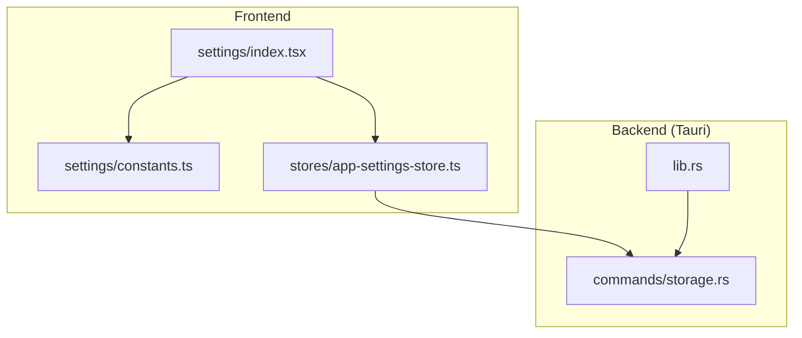
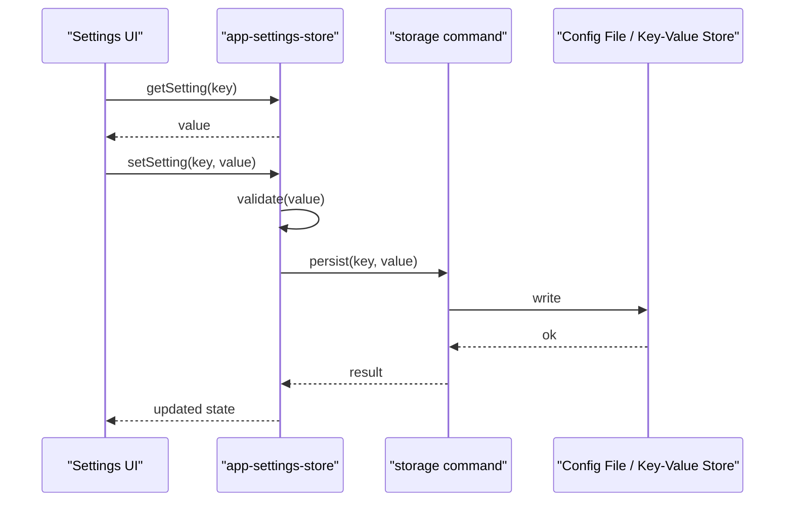
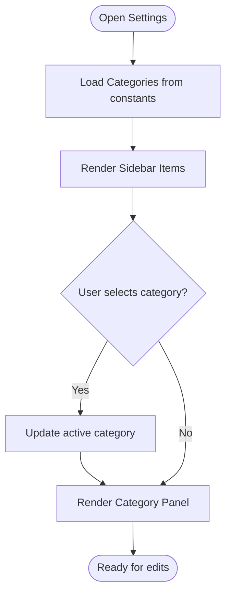
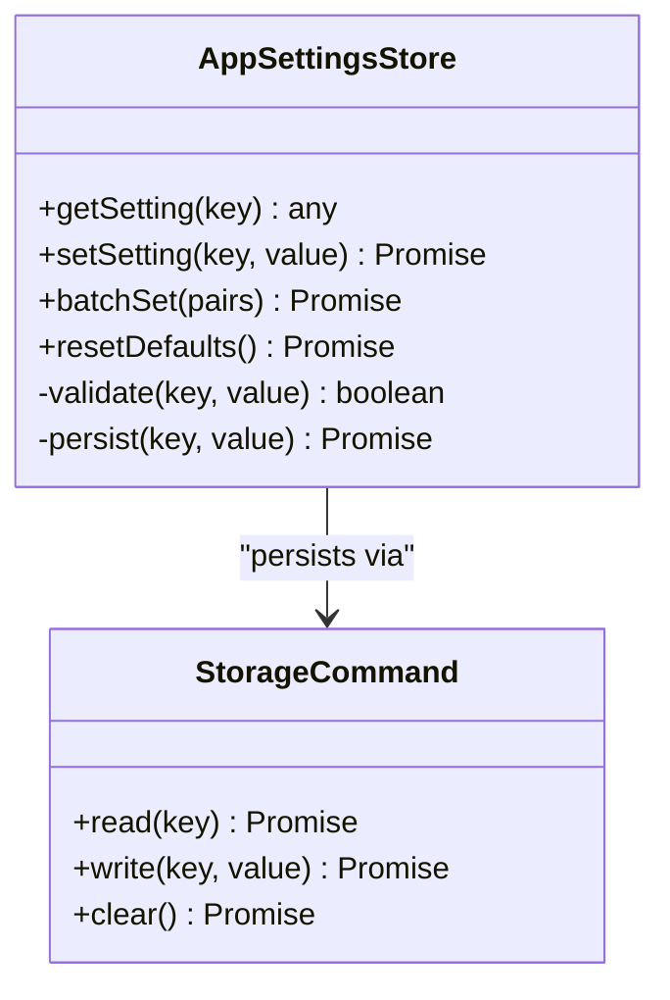
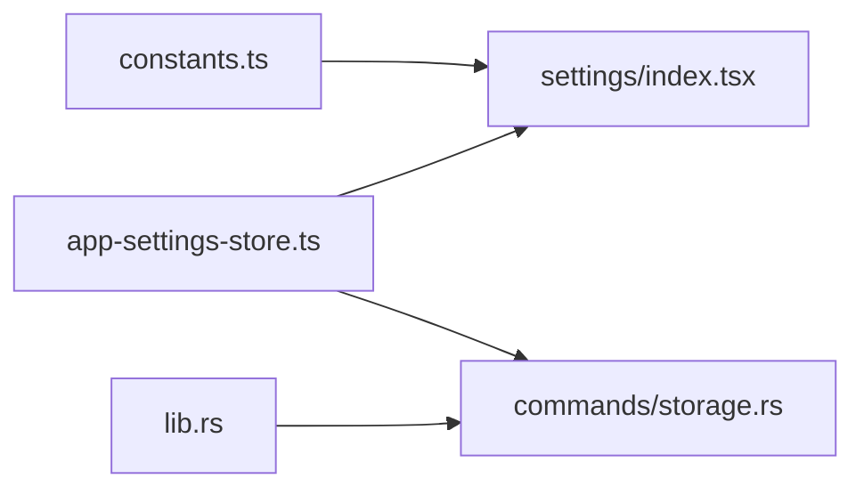

# Settings Interface

<cite>
**Referenced Files in This Document**
- [src/pages/settings/index.tsx](file://src/pages/settings/index.tsx)
- [src/pages/settings/constants.ts](file://src/pages/settings/constants.ts)
- [src/stores/app-settings-store.ts](file://src/stores/app-settings-store.ts)
- [src-tauri/src/commands/storage.rs](file://src-tauri/src/commands/storage.rs)
- [src-tauri/src/lib.rs](file://src-tauri/src/lib.rs)
</cite>

## Table of Contents
1. [Introduction](#introduction)
2. [Project Structure](#project-structure)
3. [Core Components](#core-components)
4. [Architecture Overview](#architecture-overview)
5. [Detailed Component Analysis](#detailed-component-analysis)
6. [Dependency Analysis](#dependency-analysis)
7. [Performance Considerations](#performance-considerations)
8. [Troubleshooting Guide](#troubleshooting-guide)
9. [Conclusion](#conclusion)

## Introduction
This document explains Apprecon’s settings interface and configuration management. It covers the layout structure, sidebar navigation, organization of setting categories, the settings store architecture, state management patterns, data persistence mechanisms, programmatic access and modification of settings, validation strategies, custom component implementation, and the relationship between UI settings and underlying configuration files.

## Project Structure
The settings feature is implemented as a page with a dedicated store and Tauri-backed persistence:
- Page entry and routing: src/pages/settings/index.tsx
- Category definitions and metadata: src/pages/settings/constants.ts
- Frontend state and actions: src/stores/app-settings-store.ts
- Backend storage commands (Tauri): src-tauri/src/commands/storage.rs
- Command registration and wiring: src-tauri/src/lib.rs

**Diagram sources**
- [src/pages/settings/index.tsx](file://src/pages/settings/index.tsx)
- [src/pages/settings/constants.ts](file://src/pages/settings/constants.ts)
- [src/stores/app-settings-store.ts](file://src/stores/app-settings-store.ts)
- [src-tauri/src/commands/storage.rs](file://src-tauri/src/commands/storage.rs)
- [src-tauri/src/lib.rs](file://src-tauri/src/lib.rs)

**Section sources**
- [src/pages/settings/index.tsx](file://src/pages/settings/index.tsx)
- [src/pages/settings/constants.ts](file://src/pages/settings/constants.ts)
- [src/stores/app-settings-store.ts](file://src/stores/app-settings-store.ts)
- [src-tauri/src/commands/storage.rs](file://src-tauri/src/commands/storage.rs)
- [src-tauri/src/lib.rs](file://src-tauri/src/lib.rs)

## Core Components
- Settings page shell: renders the main layout, sidebar navigation, and category panels.
- Category registry: defines available categories, icons, titles, and ordering.
- Settings store: centralizes read/write operations, validation, and persistence via Tauri commands.
- Storage commands: expose file-based or key-value persistence to the frontend.

Key responsibilities:
- Layout and navigation are driven by the category registry.
- The store encapsulates all mutations and ensures consistent state updates.
- Persistence is abstracted behind Tauri commands for cross-platform reliability.

**Section sources**
- [src/pages/settings/index.tsx](file://src/pages/settings/index.tsx)
- [src/pages/settings/constants.ts](file://src/pages/settings/constants.ts)
- [src/stores/app-settings-store.ts](file://src/stores/app-settings-store.ts)
- [src-tauri/src/commands/storage.rs](file://src-tauri/src/commands/storage.rs)

## Architecture Overview
The settings system follows a clear separation of concerns:
- UI layer (React components) renders categories and controls.
- Store layer manages state, validation, and side effects.
- Backend layer persists settings through Tauri commands.

**Diagram sources**
- [src/stores/app-settings-store.ts](file://src/stores/app-settings-store.ts)
- [src-tauri/src/commands/storage.rs](file://src-tauri/src/commands/storage.rs)

## Detailed Component Analysis

### Settings Page Shell and Sidebar Navigation
Responsibilities:
- Renders the settings container and sidebar.
- Uses the category registry to build navigation items.
- Displays the selected category’s panel content.

Behavior:
- Selection changes update active category state.
- Panels render based on the current category.

**Diagram sources**
- [src/pages/settings/index.tsx](file://src/pages/settings/index.tsx)
- [src/pages/settings/constants.ts](file://src/pages/settings/constants.ts)

**Section sources**
- [src/pages/settings/index.tsx](file://src/pages/settings/index.tsx)
- [src/pages/settings/constants.ts](file://src/pages/settings/constants.ts)

### Category Registry and Organization
Responsibilities:
- Defines each setting category with metadata (title, icon, order).
- Provides a stable contract for rendering and grouping.

Patterns:
- Centralized source of truth for category list.
- Easy extension by adding new entries.

**Section sources**
- [src/pages/settings/constants.ts](file://src/pages/settings/constants.ts)

### Settings Store Architecture and State Management
Responsibilities:
- Exposes getters/setters for individual settings.
- Validates values before applying changes.
- Persists changes via Tauri commands.
- Emits updates to subscribed UI components.

State model:
- Flat or nested key-value map representing user preferences.
- Optional schema or validators per key.

Persistence flow:
- On set, validate then call backend storage command.
- On success, update local state; on failure, surface error.

**Diagram sources**
- [src/stores/app-settings-store.ts](file://src/stores/app-settings-store.ts)
- [src-tauri/src/commands/storage.rs](file://src-tauri/src/commands/storage.rs)

**Section sources**
- [src/stores/app-settings-store.ts](file://src/stores/app-settings-store.ts)

### Data Persistence Mechanisms
Responsibilities:
- Abstracts platform-specific storage behind Tauri commands.
- Ensures atomic writes and consistent reads.

Implementation notes:
- Commands are registered in the Tauri app entrypoint.
- Frontend invokes commands using standard Tauri APIs.

**Section sources**
- [src-tauri/src/commands/storage.rs](file://src-tauri/src/commands/storage.rs)
- [src-tauri/src/lib.rs](file://src-tauri/src/lib.rs)

### Programmatic Access and Modification
Common patterns:
- Read a setting: use the store getter with the desired key.
- Write a setting: use the store setter; validation runs automatically.
- Batch updates: prefer batch methods when updating multiple keys to reduce I/O.

Validation:
- Built-in validators enforce types and constraints.
- Custom validators can be added per key in the store.

Error handling:
- Persist failures return errors that should be surfaced to users.

**Section sources**
- [src/stores/app-settings-store.ts](file://src/stores/app-settings-store.ts)

### Implementing Custom Setting Components
Guidelines:
- Create a component bound to a specific setting key.
- Use the store to read initial values and subscribe to updates.
- On change, call the store setter with validated input.
- Provide inline feedback for validation errors.

Integration points:
- Register the component within the appropriate category panel.
- Ensure accessibility and consistent UX across settings.

**Section sources**
- [src/pages/settings/index.tsx](file://src/pages/settings/index.tsx)
- [src/stores/app-settings-store.ts](file://src/stores/app-settings-store.ts)

### Relationship Between UI Settings and Configuration Files
Flow:
- UI edits trigger store setters.
- Store validates and calls Tauri storage commands.
- Backend writes to persistent storage (file or key-value store).
- Subsequent reads reflect the persisted state.

Best practices:
- Keep UI keys aligned with backend keys.
- Version or migrate settings if schemas evolve.

**Section sources**
- [src/stores/app-settings-store.ts](file://src/stores/app-settings-store.ts)
- [src-tauri/src/commands/storage.rs](file://src-tauri/src/commands/storage.rs)

## Dependency Analysis
The settings module depends on:
- Category registry for navigation and layout.
- Store for state and persistence orchestration.
- Tauri commands for reliable cross-platform storage.

**Diagram sources**
- [src/pages/settings/constants.ts](file://src/pages/settings/constants.ts)
- [src/pages/settings/index.tsx](file://src/pages/settings/index.tsx)
- [src/stores/app-settings-store.ts](file://src/stores/app-settings-store.ts)
- [src-tauri/src/commands/storage.rs](file://src-tauri/src/commands/storage.rs)
- [src-tauri/src/lib.rs](file://src-tauri/src/lib.rs)

**Section sources**
- [src/pages/settings/constants.ts](file://src/pages/settings/constants.ts)
- [src/pages/settings/index.tsx](file://src/pages/settings/index.tsx)
- [src/stores/app-settings-store.ts](file://src/stores/app-settings-store.ts)
- [src-tauri/src/commands/storage.rs](file://src-tauri/src/commands/storage.rs)
- [src-tauri/src/lib.rs](file://src-tauri/src/lib.rs)

## Performance Considerations
- Debounce frequent writes to avoid excessive I/O.
- Batch updates when changing multiple settings at once.
- Cache frequently accessed settings locally in memory.
- Avoid re-rendering entire panels by scoping subscriptions to affected components.

## Troubleshooting Guide
Common issues and resolutions:
- Validation errors: ensure values match expected types and constraints; check store validators.
- Persistence failures: verify Tauri command registration and permissions; inspect backend logs.
- Stale UI state: confirm store subscriptions are active and not unsubscribed prematurely.
- Inconsistent settings across sessions: ensure writes succeed and no race conditions exist during startup.

**Section sources**
- [src/stores/app-settings-store.ts](file://src/stores/app-settings-store.ts)
- [src-tauri/src/commands/storage.rs](file://src-tauri/src/commands/storage.rs)

## Conclusion
Apprecon’s settings interface provides a clean, extensible architecture with a clear separation between UI, state management, and persistence. The category-driven layout simplifies navigation, while the store centralizes validation and persistence logic. By following the patterns outlined here, you can add new settings, implement custom components, and maintain consistency between UI and configuration files.