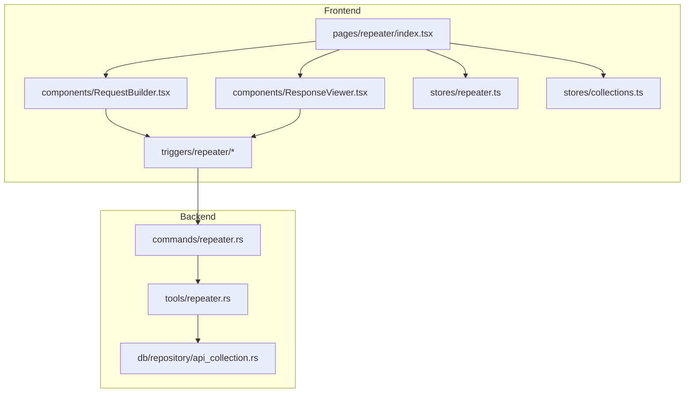
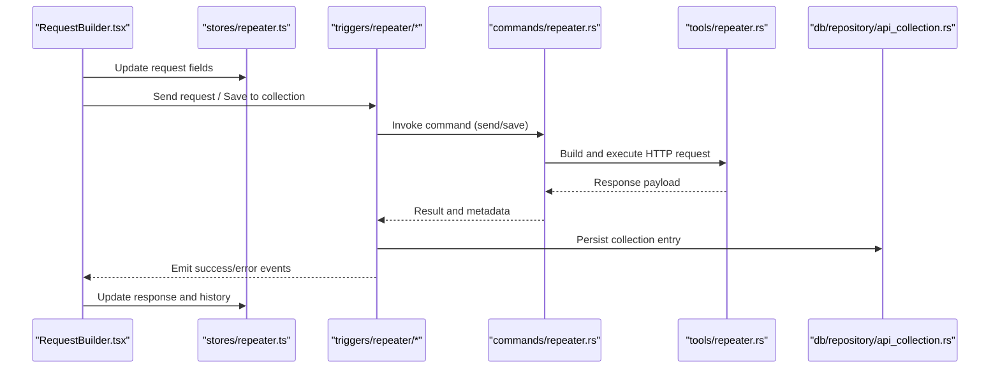
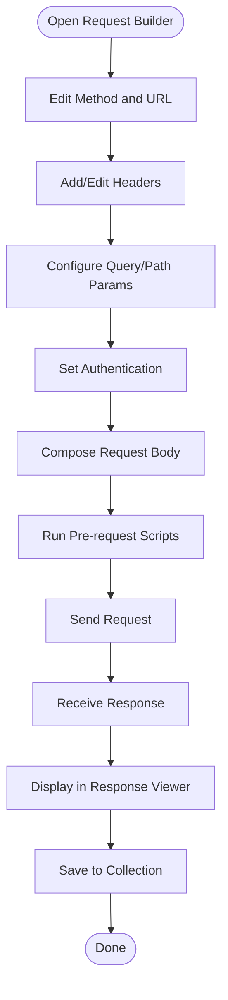
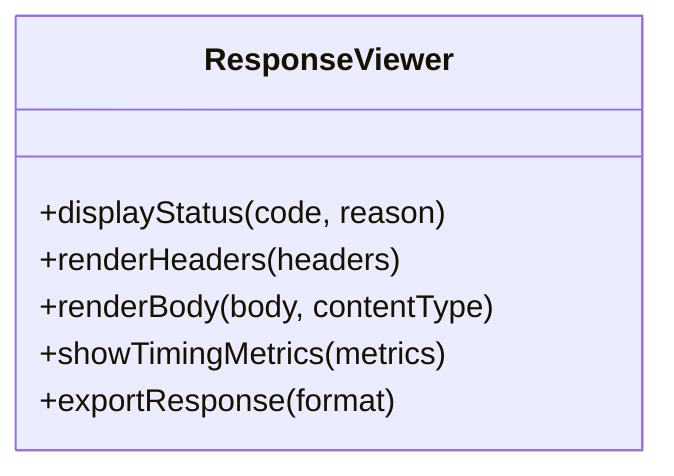
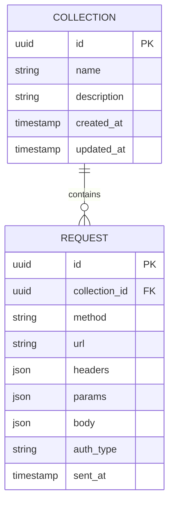
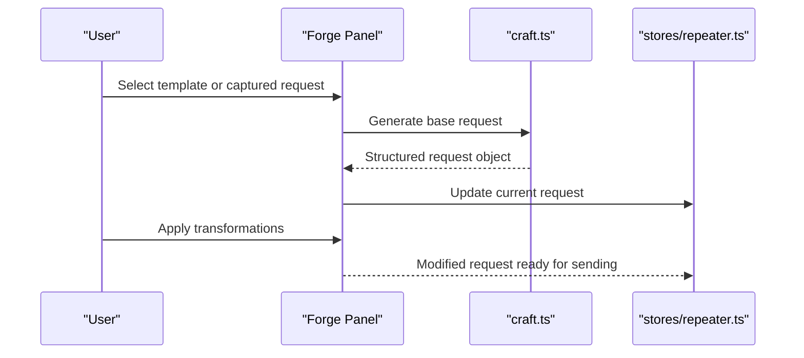
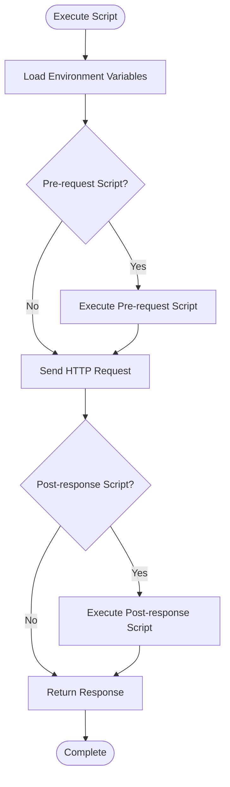
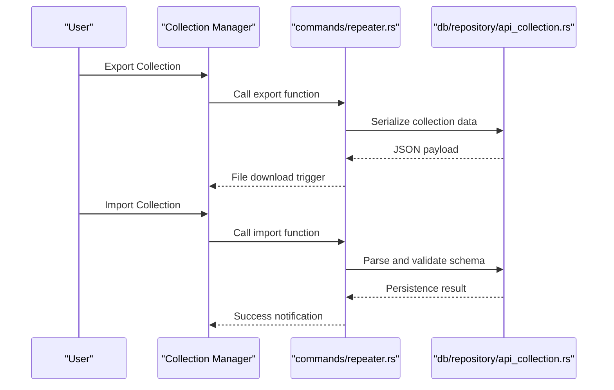
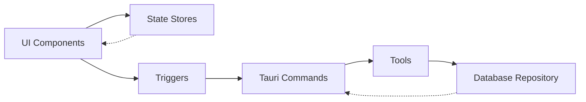

# API Repeater

<cite>
**Referenced Files in This Document**
- [repeater/index.tsx](file://src/pages/repeater/index.tsx)
- [repeater/api.ts](file://src/pages/repeater/api.ts)
- [repeater/types.ts](file://src/pages/repeater/types.ts)
- [repeater/constants.ts](file://src/pages/repeater/constants.ts)
- [repeater/hooks/useRepeater.ts](file://src/pages/repeater/hooks/useRepeater.ts)
- [repeater/components/RequestBuilder.tsx](file://src/pages/repeater/components/RequestBuilder.tsx)
- [repeater/components/ResponseViewer.tsx](file://src/pages/repeater/components/ResponseViewer.tsx)
- [repeater/lib/httpMessage.ts](file://src/pages/repeater/lib/httpMessage.ts)
- [stores/repeater.ts](file://src/stores/repeater.ts)
- [stores/collections.ts](file://src/stores/collections.ts)
- [triggers/repeater/index.ts](file://src/triggers/repeater/index.ts)
- [triggers/repeater/craft.ts](file://src/triggers/repeater/craft.ts)
- [triggers/repeater/send-to-collection.ts](file://src/triggers/repeater/send-to-collection.ts)
- [triggers/repeater/management.ts](file://src/triggers/repeater/management.ts)
- [src-tauri/src/commands/repeater.rs](file://src-tauri/src/commands/repeater.rs)
- [src-tauri/src/tools/repeater.rs](file://src-tauri/src/tools/repeater.rs)
- [src-tauri/src/db/repository/api_collection.rs](file://src-tauri/src/db/repository/api_collection.rs)
</cite>

## Table of Contents
1. [Introduction](#introduction)
2. [Project Structure](#project-structure)
3. [Core Components](#core-components)
4. [Architecture Overview](#architecture-overview)
5. [Detailed Component Analysis](#detailed-component-analysis)
6. [Dependency Analysis](#dependency-analysis)
7. [Performance Considerations](#performance-considerations)
8. [Troubleshooting Guide](#troubleshooting-guide)
9. [Conclusion](#conclusion)
10. [Appendices](#appendices)

## Introduction
The API Repeater feature enables developers to craft, send, and analyze HTTP requests with full control over headers, parameters, authentication, and payloads. It provides a dedicated request builder interface, a collection management system for organizing and reusing requests, and seamless integration with Apprecon’s workspace. The built-in Forge panel supports dynamic request generation and response manipulation, while scripting capabilities allow automation of sequences and parameter fuzzing. Requests can be exported and imported for sharing and collaboration, and the system is optimized for high-volume testing scenarios.

## Project Structure
The API Repeater spans both the frontend (React pages, hooks, components, stores) and the backend (Tauri commands and tools). Key areas include:
- Frontend page and UI components for building and viewing requests/responses
- State management for repeater state and collections
- Triggers that wire UI actions to business logic and persistence
- Tauri commands and tools for network operations and storage
- Database repository for API collections

**Diagram sources**
- [repeater/index.tsx](file://src/pages/repeater/index.tsx)
- [repeater/components/RequestBuilder.tsx](file://src/pages/repeater/components/RequestBuilder.tsx)
- [repeater/components/ResponseViewer.tsx](file://src/pages/repeater/components/ResponseViewer.tsx)
- [stores/repeater.ts](file://src/stores/repeater.ts)
- [stores/collections.ts](file://src/stores/collections.ts)
- [triggers/repeater/index.ts](file://src/triggers/repeater/index.ts)
- [src-tauri/src/commands/repeater.rs](file://src-tauri/src/commands/repeater.rs)
- [src-tauri/src/tools/repeater.rs](file://src-tauri/src/tools/repeater.rs)
- [src-tauri/src/db/repository/api_collection.rs](file://src-tauri/src/db/repository/api_collection.rs)

**Section sources**
- [repeater/index.tsx](file://src/pages/repeater/index.tsx)
- [repeater/api.ts](file://src/pages/repeater/api.ts)
- [repeater/types.ts](file://src/pages/repeater/types.ts)
- [repeater/constants.ts](file://src/pages/repeater/constants.ts)
- [stores/repeater.ts](file://src/stores/repeater.ts)
- [stores/collections.ts](file://src/stores/collections.ts)
- [triggers/repeater/index.ts](file://src/triggers/repeater/index.ts)
- [src-tauri/src/commands/repeater.rs](file://src-tauri/src/commands/repeater.rs)
- [src-tauri/src/tools/repeater.rs](file://src-tauri/src/tools/repeater.rs)
- [src-tauri/src/db/repository/api_collection.rs](file://src-tauri/src/db/repository/api_collection.rs)

## Core Components
- Request Builder Interface: A form-driven editor for method selection, URL, headers, query parameters, path parameters, cookies, and body content. Supports JSON, form-encoded, multipart, and raw payloads.
- Response Viewer: Displays status codes, headers, timing, and body with syntax highlighting and tabs for different formats.
- Collection Management: Create, organize, and reuse requests via folders and tags; import/export collections; link requests to environments.
- Forge Panel Integration: Dynamic request generation from captured traffic or templates; manipulate responses using scripts before saving or forwarding.
- Scripting and Automation: Execute pre-request and post-response scripts; chain multiple requests; automate fuzzing loops and conditional branching.
- Export/Import: Save collections as portable files; share across teams; version control-friendly formats.

**Section sources**
- [repeater/components/RequestBuilder.tsx](file://src/pages/repeater/components/RequestBuilder.tsx)
- [repeater/components/ResponseViewer.tsx](file://src/pages/repeater/components/ResponseViewer.tsx)
- [stores/collections.ts](file://src/stores/collections.ts)
- [triggers/repeater/craft.ts](file://src/triggers/repeater/craft.ts)
- [triggers/repeater/send-to-collection.ts](file://src/triggers/repeater/send-to-collection.ts)
- [triggers/repeater/management.ts](file://src/triggers/repeater/management.ts)

## Architecture Overview
The API Repeater follows a layered architecture:
- UI Layer: React components render the builder and viewer.
- State Layer: Stores manage current request, history, and collections.
- Trigger Layer: Event handlers orchestrate actions like sending, saving, and importing.
- Command Layer: Tauri commands expose secure APIs for network I/O and persistence.
- Tool Layer: Utilities encapsulate HTTP execution, serialization, and validation.
- Data Layer: Repository persists collections and metadata.

**Diagram sources**
- [repeater/components/RequestBuilder.tsx](file://src/pages/repeater/components/RequestBuilder.tsx)
- [stores/repeater.ts](file://src/stores/repeater.ts)
- [triggers/repeater/index.ts](file://src/triggers/repeater/index.ts)
- [src-tauri/src/commands/repeater.rs](file://src-tauri/src/commands/repeater.rs)
- [src-tauri/src/tools/repeater.rs](file://src-tauri/src/tools/repeater.rs)
- [src-tauri/src/db/repository/api_collection.rs](file://src-tauri/src/db/repository/api_collection.rs)

## Detailed Component Analysis

### Request Builder Interface
The Request Builder provides granular control over every aspect of an HTTP request:
- Method and URL editing with environment variable substitution
- Header editor with key-value pairs and common presets
- Query and path parameter editors with type hints
- Cookie manager and authentication helpers (Bearer tokens, Basic auth)
- Body editor supporting JSON, form data, and raw text with validation
- Pre-request scripts for dynamic value injection
- Post-response scripts for transformation and logging

**Diagram sources**
- [repeater/components/RequestBuilder.tsx](file://src/pages/repeater/components/RequestBuilder.tsx)
- [repeater/lib/httpMessage.ts](file://src/pages/repeater/lib/httpMessage.ts)
- [triggers/repeater/craft.ts](file://src/triggers/repeater/craft.ts)

**Section sources**
- [repeater/components/RequestBuilder.tsx](file://src/pages/repeater/components/RequestBuilder.tsx)
- [repeater/lib/httpMessage.ts](file://src/pages/repeater/lib/httpMessage.ts)
- [triggers/repeater/craft.ts](file://src/triggers/repeater/craft.ts)

### Response Viewer
The Response Viewer renders comprehensive details about each response:
- Status code and reason phrase
- Response headers with grouping and filtering
- Timing metrics including total time and DNS/TLS handshake durations
- Body rendering with format-specific views (JSON tree, XML, plain text)
- Copy-to-clipboard and export options
- Highlighting for errors and warnings

**Diagram sources**
- [repeater/components/ResponseViewer.tsx](file://src/pages/repeater/components/ResponseViewer.tsx)

**Section sources**
- [repeater/components/ResponseViewer.tsx](file://src/pages/repeater/components/ResponseViewer.tsx)

### Collection Management System
Collections enable organizing and reusing requests:
- Create folders and nested structures
- Tag requests for categorization
- Import/export collections in standard formats
- Link requests to environments and variables
- Share collections across team members

**Diagram sources**
- [src-tauri/src/db/repository/api_collection.rs](file://src-tauri/src/db/repository/api_collection.rs)
- [stores/collections.ts](file://src/stores/collections.ts)

**Section sources**
- [stores/collections.ts](file://src/stores/collections.ts)
- [triggers/repeater/send-to-collection.ts](file://src/triggers/repeater/send-to-collection.ts)
- [triggers/repeater/management.ts](file://src/triggers/repeater/management.ts)
- [src-tauri/src/db/repository/api_collection.rs](file://src-tauri/src/db/repository/api_collection.rs)

### Forge Panel Integration
The Forge panel enhances request creation and response handling:
- Generate requests from captured traffic or templates
- Apply dynamic transformations using scripts
- Manipulate responses before saving or forwarding
- Integrate with AI-assisted suggestion engine

**Diagram sources**
- [triggers/repeater/craft.ts](file://src/triggers/repeater/craft.ts)
- [stores/repeater.ts](file://src/stores/repeater.ts)

**Section sources**
- [triggers/repeater/craft.ts](file://src/triggers/repeater/craft.ts)

### Scripting Capabilities
Scripting enables advanced automation:
- Pre-request scripts for dynamic header/body generation
- Post-response scripts for validation and transformation
- Conditional logic based on response status or content
- Loop constructs for parameter fuzzing and iteration
- Access to environment variables and secrets

**Diagram sources**
- [triggers/repeater/index.ts](file://src/triggers/repeater/index.ts)
- [src-tauri/src/tools/repeater.rs](file://src-tauri/src/tools/repeater.rs)

**Section sources**
- [triggers/repeater/index.ts](file://src/triggers/repeater/index.ts)
- [src-tauri/src/tools/repeater.rs](file://src-tauri/src/tools/repeater.rs)

### Export/Import Functionality
Collections can be shared and versioned through export/import:
- Export collections to JSON format
- Import collections from external sources
- Validate schema compatibility
- Merge or replace existing collections

**Diagram sources**
- [src-tauri/src/commands/repeater.rs](file://src-tauri/src/commands/repeater.rs)
- [src-tauri/src/db/repository/api_collection.rs](file://src-tauri/src/db/repository/api_collection.rs)

**Section sources**
- [src-tauri/src/commands/repeater.rs](file://src-tauri/src/commands/repeater.rs)
- [src-tauri/src/db/repository/api_collection.rs](file://src-tauri/src/db/repository/api_collection.rs)

## Dependency Analysis
The API Repeater has clear separation of concerns with minimal coupling:
- UI components depend on stores for state management
- Triggers coordinate between UI and backend services
- Commands provide secure boundaries for sensitive operations
- Tools encapsulate reusable logic for HTTP operations
- Repository handles data persistence independently

**Diagram sources**
- [repeater/components/RequestBuilder.tsx](file://src/pages/repeater/components/RequestBuilder.tsx)
- [stores/repeater.ts](file://src/stores/repeater.ts)
- [triggers/repeater/index.ts](file://src/triggers/repeater/index.ts)
- [src-tauri/src/commands/repeater.rs](file://src-tauri/src/commands/repeater.rs)
- [src-tauri/src/tools/repeater.rs](file://src-tauri/src/tools/repeater.rs)
- [src-tauri/src/db/repository/api_collection.rs](file://src-tauri/src/db/repository/api_collection.rs)

**Section sources**
- [repeater/types.ts](file://src/pages/repeater/types.ts)
- [repeater/constants.ts](file://src/pages/repeater/constants.ts)
- [stores/repeater.ts](file://src/stores/repeater.ts)
- [stores/collections.ts](file://src/stores/collections.ts)

## Performance Considerations
For high-volume API testing scenarios:
- Implement request queuing to prevent overwhelming target servers
- Use connection pooling for efficient resource utilization
- Enable response streaming for large payloads
- Cache frequently accessed environment variables
- Optimize database queries for collection operations
- Implement pagination for large response sets
- Use background processing for long-running scripts

[No sources needed since this section provides general guidance]

## Troubleshooting Guide
Common issues and their solutions:
- Network connectivity problems: Verify proxy settings and SSL certificates
- Authentication failures: Check token expiration and refresh mechanisms
- Payload parsing errors: Validate JSON schema and encoding formats
- Performance bottlenecks: Monitor memory usage and optimize script execution
- Collection sync conflicts: Implement conflict resolution strategies

**Section sources**
- [repeater/api.ts](file://src/pages/repeater/api.ts)
- [src-tauri/src/commands/repeater.rs](file://src-tauri/src/commands/repeater.rs)

## Conclusion
The API Repeater feature provides a comprehensive solution for HTTP request testing and analysis. Its modular architecture, extensive customization options, and integration capabilities make it suitable for both individual developers and teams. The combination of intuitive UI, powerful scripting, and robust collection management creates an efficient workflow for API development and testing.

[No sources needed since this section summarizes without analyzing specific files]

## Appendices

### Common API Testing Patterns
- **Authentication Testing**: Validate token-based authentication flows
- **Parameter Validation**: Test input sanitization and validation rules
- **Error Handling**: Verify proper error responses and status codes
- **Rate Limiting**: Test server behavior under load conditions
- **Data Validation**: Ensure response schemas match expected formats

### Parameter Fuzzing Techniques
- **Boundary Testing**: Test minimum, maximum, and edge case values
- **Injection Testing**: Attempt SQL, XSS, and command injection attacks
- **Encoding Variations**: Test different character encodings and escaping
- **Length Testing**: Send oversized payloads to test buffer limits
- **Type Coercion**: Test how server handles unexpected data types

### Automated Request Sequences
- **Login Flow**: Authenticate user and obtain session tokens
- **CRUD Operations**: Create, read, update, and delete resources
- **Workflow Testing**: Simulate multi-step business processes
- **Regression Testing**: Validate API changes don't break existing functionality
- **Load Testing**: Generate concurrent requests to test scalability

[No sources needed since this section provides general guidance]