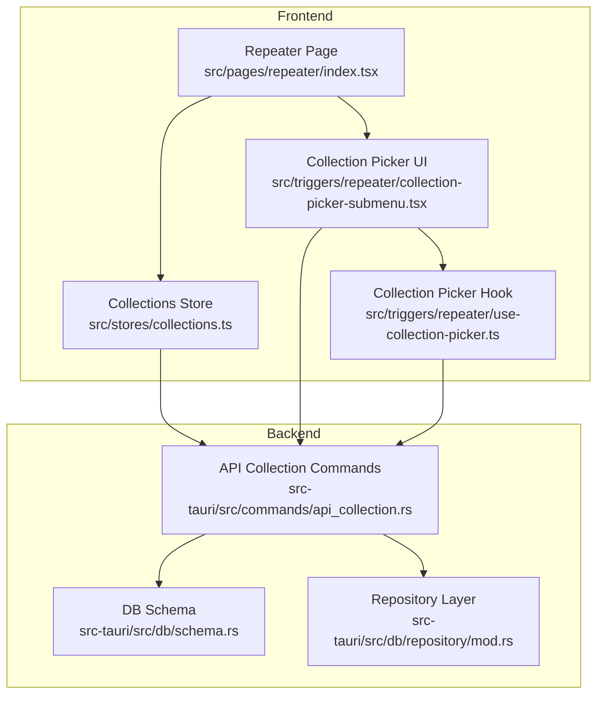
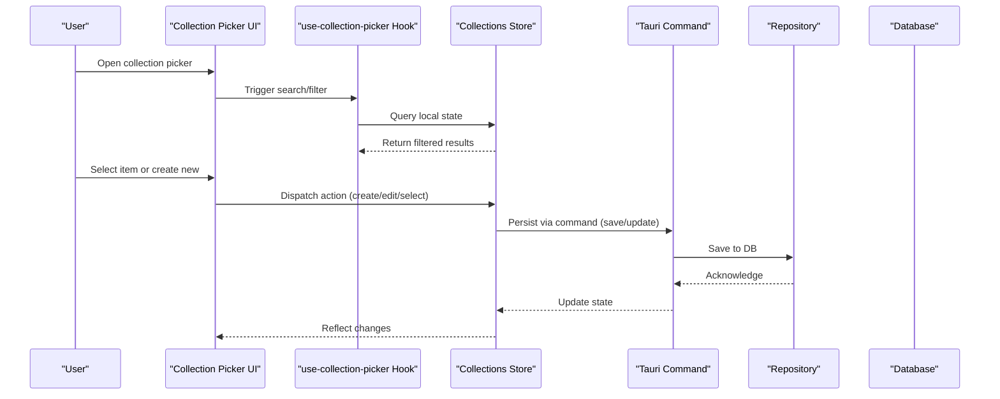
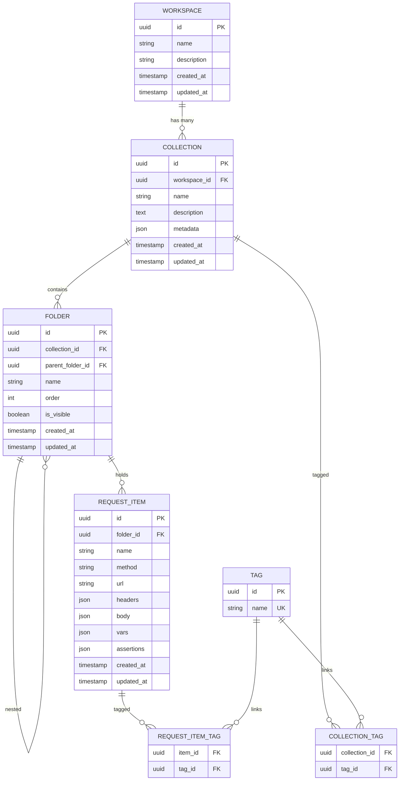
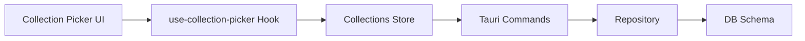

# Collections & Workspaces

<cite>
**Referenced Files in This Document**
- [collections.ts](file://src/stores/collections.ts)
- [repeater/index.tsx](file://src/pages/repeater/index.tsx)
- [repeater/api.ts](file://src/pages/repeater/api.ts)
- [repeater/constants.ts](file://src/pages/repeater/constants.ts)
- [repeater/types.ts](file://src/pages/repeater/types.ts)
- [repeater/components/collection-picker-submenu.tsx](file://src/triggers/repeater/collection-picker-submenu.tsx)
- [repeater/use-collection-picker.ts](file://src/triggers/repeater/use-collection-picker.ts)
- [commands/api_collection.rs](file://src-tauri/src/commands/api_collection.rs)
- [db/schema.rs](file://src-tauri/src/db/schema.rs)
- [db/repository/mod.rs](file://src-tauri/src/db/repository/mod.rs)
</cite>

## Table of Contents
1. [Introduction](#introduction)
2. [Project Structure](#project-structure)
3. [Core Components](#core-components)
4. [Architecture Overview](#architecture-overview)
5. [Detailed Component Analysis](#detailed-component-analysis)
6. [Dependency Analysis](#dependency-analysis)
7. [Performance Considerations](#performance-considerations)
8. [Troubleshooting Guide](#troubleshooting-guide)
9. [Conclusion](#conclusion)
10. [Appendices](#appendices)

## Introduction
This document explains the collections and workspaces system in the API Repeater. It covers how to organize API requests into hierarchical collections with folders and subfolders, workspace creation and switching, import/export capabilities for collections (JSON, Postman, Insomnia), metadata and tags, search, and best practices for large test suites and team collaboration. It also includes performance guidance and version control integration patterns.

## Project Structure
The collections and workspaces feature spans both the frontend store/UI and the Tauri backend persistence layer:
- Frontend state and UI interactions are implemented in React components and stores under src/pages/repeater and src/triggers/repeater.
- Backend commands and database schema live under src-tauri/src/commands and src-tauri/src/db.

**Diagram sources**
- [repeater/index.tsx](file://src/pages/repeater/index.tsx)
- [collections.ts](file://src/stores/collections.ts)
- [collection-picker-submenu.tsx](file://src/triggers/repeater/collection-picker-submenu.tsx)
- [use-collection-picker.ts](file://src/triggers/repeater/use-collection-picker.ts)
- [api_collection.rs](file://src-tauri/src/commands/api_collection.rs)
- [schema.rs](file://src-tauri/src/db/schema.rs)
- [mod.rs](file://src-tauri/src/db/repository/mod.rs)

**Section sources**
- [repeater/index.tsx](file://src/pages/repeater/index.tsx)
- [collections.ts](file://src/stores/collections.ts)
- [api_collection.rs](file://src-tauri/src/commands/api_collection.rs)
- [schema.rs](file://src-tauri/src/db/schema.rs)
- [mod.rs](file://src-tauri/src/db/repository/mod.rs)

## Core Components
- Collections Store: Centralized state for collections, workspaces, and request items. Provides CRUD operations, folder nesting, and selection logic.
- Repeater Page: Orchestrates UI flows for creating, editing, sending, and organizing requests within collections.
- Collection Picker UI/Hook: Provides a searchable, filterable picker to quickly navigate and send requests from any collection/folder.
- Backend Commands: Expose Tauri commands for persisting collections, workspaces, and metadata; handle import/export formats.
- Database Schema: Defines tables for collections, folders, requests, and workspace settings.

Key responsibilities:
- Hierarchical organization: folders and subfolders with stable IDs.
- Workspace isolation: separate sets of collections per workspace.
- Import/Export: JSON-native plus compatibility with Postman and Insomnia formats.
- Metadata and tags: support for labels, descriptions, and tag-based filtering.
- Search: full-text and tag-based queries across collections.

**Section sources**
- [collections.ts](file://src/stores/collections.ts)
- [repeater/index.tsx](file://src/pages/repeater/index.tsx)
- [collection-picker-submenu.tsx](file://src/triggers/repeater/collection-picker-submenu.tsx)
- [use-collection-picker.ts](file://src/triggers/repeater/use-collection-picker.ts)
- [api_collection.rs](file://src-tauri/src/commands/api_collection.rs)
- [schema.rs](file://src-tauri/src/db/schema.rs)
- [mod.rs](file://src-tauri/src/db/repository/mod.rs)

## Architecture Overview
The system follows a layered architecture:
- UI triggers and hooks initiate actions (create, edit, import/export, search).
- The collections store manages local state and dispatches side effects.
- Tauri commands bridge to persistent storage and file I/O for imports/exports.
- The repository layer abstracts DB operations defined by the schema.

**Diagram sources**
- [collection-picker-submenu.tsx](file://src/triggers/repeater/collection-picker-submenu.tsx)
- [use-collection-picker.ts](file://src/triggers/repeater/use-collection-picker.ts)
- [collections.ts](file://src/stores/collections.ts)
- [api_collection.rs](file://src-tauri/src/commands/api_collection.rs)
- [mod.rs](file://src-tauri/src/db/repository/mod.rs)
- [schema.rs](file://src-tauri/src/db/schema.rs)

## Detailed Component Analysis

### Collections Store
Responsibilities:
- Maintain workspace context and active collection.
- Manage nested folder structures with parent-child relationships.
- Provide methods to add, move, rename, delete items and folders.
- Handle metadata and tags on collections and items.
- Coordinate import/export workflows and format normalization.

Data model highlights:
- Workspace: identifies a set of collections and shared settings.
- Collection: top-level grouping with metadata and tags.
- Folder/Subfolder: hierarchical containers with ordering and visibility flags.
- Request Item: HTTP details, variables, headers, body, assertions, and environment bindings.

Operations:
- Create workspace and switch between them.
- Create collections and nest folders recursively.
- Import from JSON, Postman, and Insomnia formats; map to internal schema.
- Export to JSON and compatible formats for sharing.
- Search by name, path, tags, and content snippets.

Best practices:
- Use stable IDs for folders and items to preserve references during moves.
- Normalize imported payloads and headers to avoid duplication.
- Debounce search input and paginate results for large datasets.

**Section sources**
- [collections.ts](file://src/stores/collections.ts)

### Repeater Page Integration
Responsibilities:
- Render collection tree and editor panels.
- Wire up actions like “Send to Collection,” “Create New,” and “Import/Export.”
- Manage tabbed sessions while preserving collection context.

Integration points:
- Uses the collections store to read/write data.
- Invokes Tauri commands for import/export and persistence.
- Displays search results and allows quick navigation.

**Section sources**
- [repeater/index.tsx](file://src/pages/repeater/index.tsx)
- [repeater/api.ts](file://src/pages/repeater/api.ts)
- [repeater/constants.ts](file://src/pages/repeater/constants.ts)
- [repeater/types.ts](file://src/pages/repeater/types.ts)

### Collection Picker UI and Hook
Responsibilities:
- Provide a fast, searchable interface to locate and select requests.
- Support filtering by tags, names, and paths.
- Allow creating new items directly from the picker.

Flow:
- User types query → hook debounces → store filters → UI renders results.
- Selection updates active request and optionally opens it in a new tab.

**Section sources**
- [collection-picker-submenu.tsx](file://src/triggers/repeater/collection-picker-submenu.tsx)
- [use-collection-picker.ts](file://src/triggers/repeater/use-collection-picker.ts)

### Backend Commands and Persistence
Responsibilities:
- Expose Tauri commands for CRUD on collections, folders, and items.
- Implement import/export handlers that parse and validate external formats.
- Persist workspace configuration and active selection.

Schema considerations:
- Tables for workspaces, collections, folders, and requests.
- Indexes on frequently queried fields (name, tags, path).
- Foreign keys to maintain referential integrity across hierarchy.

Import/Export mapping:
- JSON: native round-trip with minimal transformation.
- Postman: map environments, variables, and request structure.
- Insomnia: convert auth, headers, and bodies to internal representation.

**Section sources**
- [api_collection.rs](file://src-tauri/src/commands/api_collection.rs)
- [schema.rs](file://src-tauri/src/db/schema.rs)
- [mod.rs](file://src-tauri/src/db/repository/mod.rs)

### Data Model Relationships

**Diagram sources**
- [schema.rs](file://src-tauri/src/db/schema.rs)

## Dependency Analysis
- Frontend components depend on the collections store for state and actions.
- Hooks encapsulate reusable logic for searching and picking collections.
- Backend commands are independent of UI but must align with the schema and repository contracts.
- Repository abstracts DB access, enabling consistent queries and transactions.

**Diagram sources**
- [collection-picker-submenu.tsx](file://src/triggers/repeater/collection-picker-submenu.tsx)
- [use-collection-picker.ts](file://src/triggers/repeater/use-collection-picker.ts)
- [collections.ts](file://src/stores/collections.ts)
- [api_collection.rs](file://src-tauri/src/commands/api_collection.rs)
- [mod.rs](file://src-tauri/src/db/repository/mod.rs)
- [schema.rs](file://src-tauri/src/db/schema.rs)

**Section sources**
- [collections.ts](file://src/stores/collections.ts)
- [api_collection.rs](file://src-tauri/src/commands/api_collection.rs)
- [schema.rs](file://src-tauri/src/db/schema.rs)
- [mod.rs](file://src-tauri/src/db/repository/mod.rs)

## Performance Considerations
- Large collections:
  - Paginate search results and lazy-load subtrees.
  - Debounce user input and batch updates to avoid excessive re-renders.
  - Use indexes on name, tags, and path columns for fast queries.
- Import/Export:
  - Stream large files and process in chunks.
  - Validate and normalize data incrementally to reduce memory spikes.
- Workspace switching:
  - Cache active workspace state and only reload necessary subsets.
- Naming and structure:
  - Keep folder depth reasonable (2–4 levels) to improve traversal speed.
  - Avoid overly long names or deeply nested variable chains.

[No sources needed since this section provides general guidance]

## Troubleshooting Guide
Common issues and resolutions:
- Import failures:
  - Verify format compatibility (Postman/Insomnia versions).
  - Check for unsupported auth schemes or malformed bodies.
- Missing tags or metadata:
  - Ensure normalized mapping during import.
  - Confirm tag existence before linking.
- Slow search:
  - Add or update indexes on queried fields.
  - Reduce result set size with filters.
- Workspace switching glitches:
  - Clear stale cache entries and rehydrate from DB.
  - Validate active collection ID exists in the new workspace.

**Section sources**
- [api_collection.rs](file://src-tauri/src/commands/api_collection.rs)
- [collections.ts](file://src/stores/collections.ts)

## Conclusion
The collections and workspaces system provides a robust foundation for organizing and managing API requests at scale. By leveraging hierarchical folders, metadata, tags, and powerful search, teams can collaborate effectively. Proper import/export handling ensures interoperability with popular tools, while performance-oriented design keeps large suites responsive. Adopting naming conventions and structured organization will maximize usability and maintainability.

[No sources needed since this section summarizes without analyzing specific files]

## Appendices

### Organizing Large Test Suites
- Group by domain or service, then by resource endpoints.
- Use folders for authentication, common utilities, and shared fixtures.
- Tag requests by lifecycle (smoke, regression, perf) and priority.

### Team Collaboration Workflows
- Share collections via export/import or version-controlled repositories.
- Use tags to mark ownership or review status.
- Establish naming standards and folder hierarchies across teams.

### Version Control Integration
- Commit collection exports alongside code changes.
- Use branches for feature-specific collections and merge via PRs.
- Automate validation checks on import/export artifacts.

### Best Practices for Naming and Structure
- Use clear, descriptive names for collections and folders.
- Keep URLs and variables consistent across environments.
- Limit deep nesting; prefer flat structures where possible.

[No sources needed since this section provides general guidance]