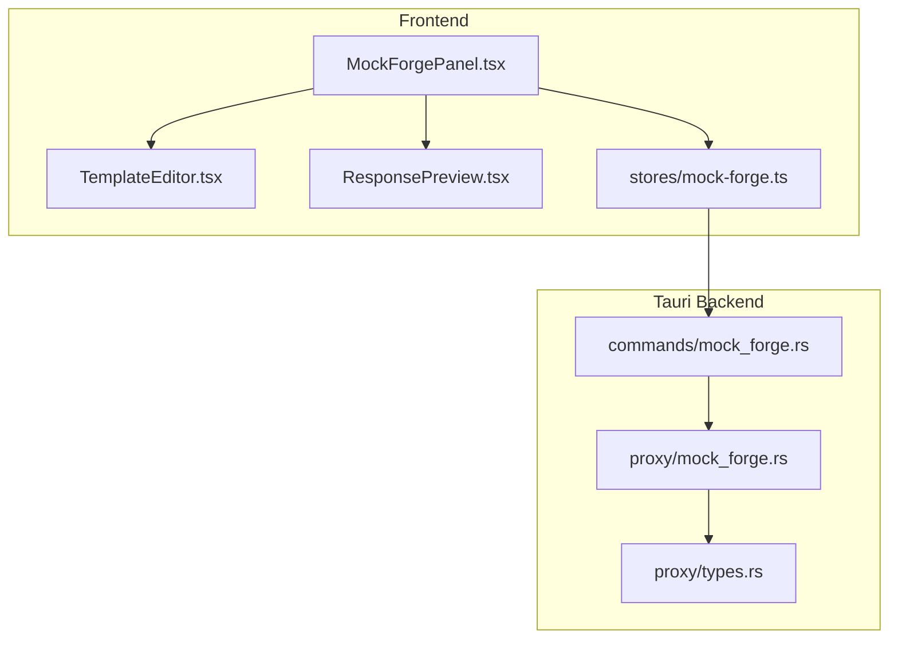
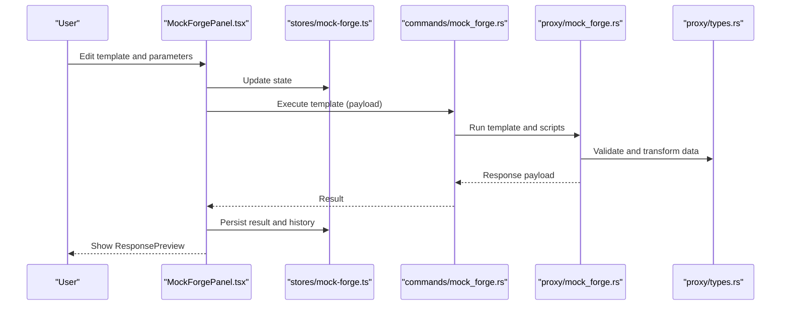
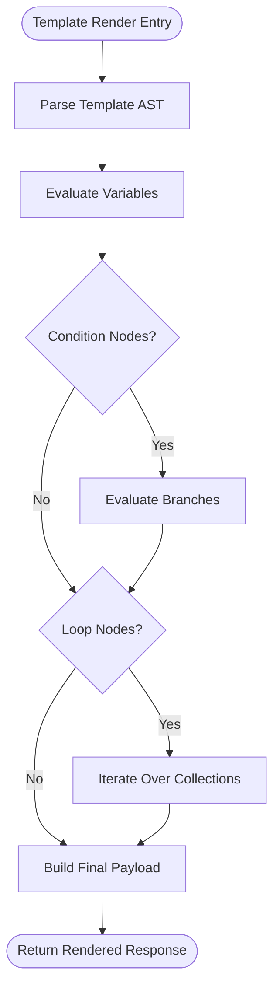
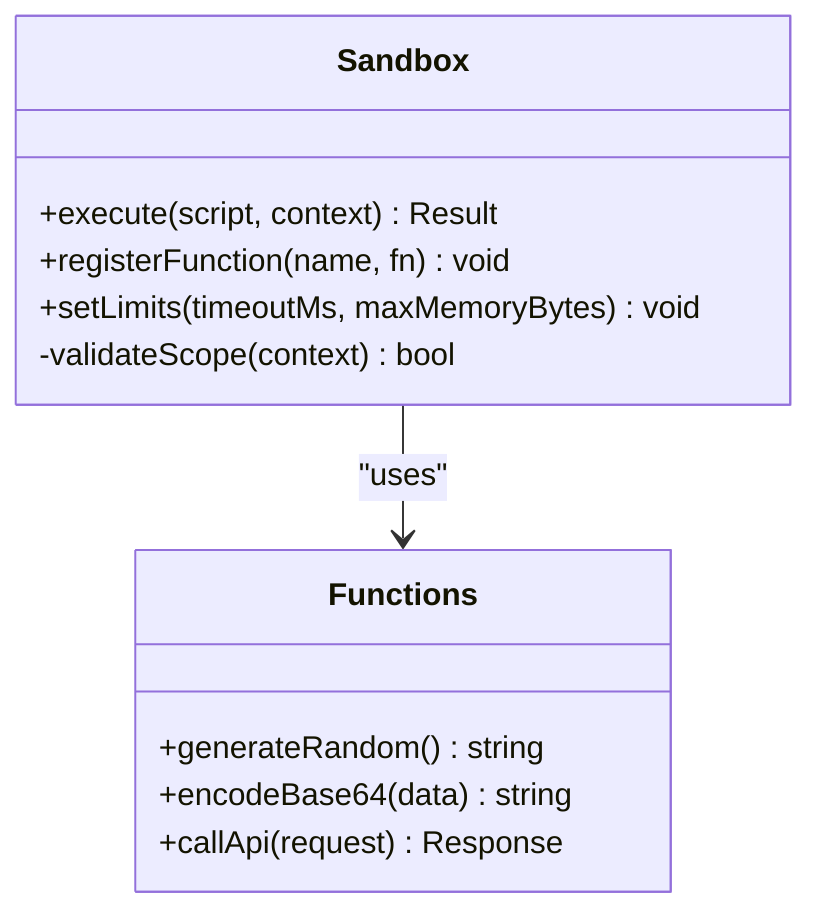
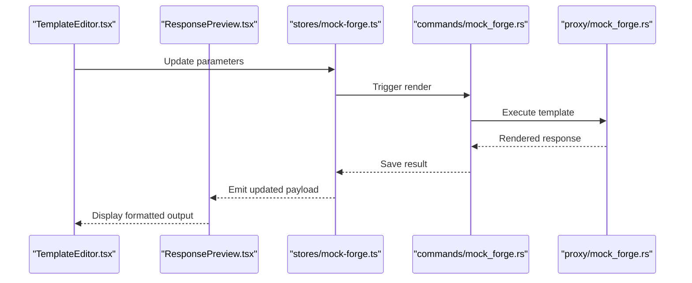
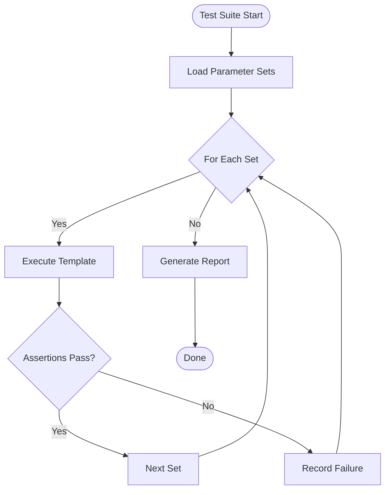
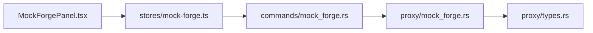

# Forge Panel & Dynamic Generation

<cite>
**Referenced Files in This Document**
- [mock-forge/index.tsx](file://src/pages/mock-forge/index.tsx)
- [mock-forge/types.ts](file://src/pages/mock-forge/types.ts)
- [mock-forge/constants.ts](file://src/pages/mock-forge/constants.ts)
- [mock-forge/hooks/use-mock-forge.ts](file://src/pages/mock-forge/hooks/use-mock-forge.ts)
- [mock-forge/components/MockForgePanel.tsx](file://src/pages/mock-forge/components/MockForgePanel.tsx)
- [mock-forge/components/TemplateEditor.tsx](file://src/pages/mock-forge/components/TemplateEditor.tsx)
- [mock-forge/components/ResponsePreview.tsx](file://src/pages/mock-forge/components/ResponsePreview.tsx)
- [stores/mock-forge.ts](file://src/stores/mock-forge.ts)
- [src-tauri/src/commands/mock_forge.rs](file://src-tauri/src/commands/mock_forge.rs)
- [src-tauri/src/proxy/mock_forge.rs](file://src-tauri/src/proxy/mock_forge.rs)
- [src-tauri/src/proxy/types.rs](file://src-tauri/src/proxy/types.rs)
</cite>

## Table of Contents
1. [Introduction](#introduction)
2. [Project Structure](#project-structure)
3. [Core Components](#core-components)
4. [Architecture Overview](#architecture-overview)
5. [Detailed Component Analysis](#detailed-component-analysis)
6. [Dependency Analysis](#dependency-analysis)
7. [Performance Considerations](#performance-considerations)
8. [Troubleshooting Guide](#troubleshooting-guide)
9. [Conclusion](#conclusion)
10. [Appendices](#appendices)

## Introduction
This document explains the Forge panel feature that enables dynamic request generation and response manipulation. It covers how to build dynamic templates with variables, conditions, and loops; how the scripting sandbox executes custom logic for data transformation; built-in functions for data generation, encoding, and API calls; automated testing scenarios, parameter fuzzing, and response mocking; security considerations for script execution; debugging techniques; and performance optimization strategies for complex transformations.

## Project Structure
The Forge feature spans both the frontend (React UI and state management) and the backend (Tauri commands and proxy integration). The key areas are:
- Frontend pages and components under src/pages/mock-forge
- State store under src/stores/mock-forge.ts
- Tauri command handler under src-tauri/src/commands/mock_forge.rs
- Proxy-side mock engine under src-tauri/src/proxy/mock_forge.rs and types under src-tauri/src/proxy/types.rs

**Diagram sources**
- [mock-forge/components/MockForgePanel.tsx](file://src/pages/mock-forge/components/MockForgePanel.tsx)
- [mock-forge/components/TemplateEditor.tsx](file://src/pages/mock-forge/components/TemplateEditor.tsx)
- [mock-forge/components/ResponsePreview.tsx](file://src/pages/mock-forge/components/ResponsePreview.tsx)
- [stores/mock-forge.ts](file://src/stores/mock-forge.ts)
- [src-tauri/src/commands/mock_forge.rs](file://src-tauri/src/commands/mock_forge.rs)
- [src-tauri/src/proxy/mock_forge.rs](file://src-tauri/src/proxy/mock_forge.rs)
- [src-tauri/src/proxy/types.rs](file://src-tauri/src/proxy/types.rs)

**Section sources**
- [mock-forge/index.tsx](file://src/pages/mock-forge/index.tsx)
- [mock-forge/types.ts](file://src/pages/mock-forge/types.ts)
- [mock-forge/constants.ts](file://src/pages/mock-forge/constants.ts)
- [stores/mock-forge.ts](file://src/stores/mock-forge.ts)
- [src-tauri/src/commands/mock_forge.rs](file://src-tauri/src/commands/mock_forge.rs)
- [src-tauri/src/proxy/mock_forge.rs](file://src-tauri/src/proxy/mock_forge.rs)
- [src-tauri/src/proxy/types.rs](file://src-tauri/src/proxy/types.rs)

## Core Components
- MockForgePanel: Orchestrates user interactions, template editing, preview, and execution flow.
- TemplateEditor: Provides an editor for writing dynamic templates with variables, conditions, and loops.
- ResponsePreview: Renders a live preview of generated responses based on current inputs and template logic.
- Store (stores/mock-forge.ts): Manages state for templates, parameters, execution results, and history.
- Command Handler (commands/mock_forge.rs): Bridges frontend requests to the proxy’s mock engine.
- Proxy Mock Engine (proxy/mock_forge.rs): Executes templates, runs scripts, transforms data, and returns responses.

Key responsibilities:
- Template parsing and rendering pipeline
- Sandbox execution environment for custom logic
- Built-in function registry for data generation, encoding, and API calls
- Parameter fuzzing and automated test orchestration
- Secure execution boundaries and error isolation

**Section sources**
- [mock-forge/components/MockForgePanel.tsx](file://src/pages/mock-forge/components/MockForgePanel.tsx)
- [mock-forge/components/TemplateEditor.tsx](file://src/pages/mock-forge/components/TemplateEditor.tsx)
- [mock-forge/components/ResponsePreview.tsx](file://src/pages/mock-forge/components/ResponsePreview.tsx)
- [stores/mock-forge.ts](file://src/stores/mock-forge.ts)
- [src-tauri/src/commands/mock_forge.rs](file://src-tauri/src/commands/mock_forge.rs)
- [src-tauri/src/proxy/mock_forge.rs](file://src-tauri/src/proxy/mock_forge.rs)

## Architecture Overview
The Forge panel follows a layered architecture:
- UI Layer: React components handle user input and display previews.
- State Layer: Centralized store manages template definitions, parameters, and execution outputs.
- Command Layer: Tauri commands expose safe APIs to the frontend.
- Execution Layer: Proxy-side engine parses templates, executes sandboxed scripts, and produces responses.

**Diagram sources**
- [mock-forge/components/MockForgePanel.tsx](file://src/pages/mock-forge/components/MockForgePanel.tsx)
- [stores/mock-forge.ts](file://src/stores/mock-forge.ts)
- [src-tauri/src/commands/mock_forge.rs](file://src-tauri/src/commands/mock_forge.rs)
- [src-tauri/src/proxy/mock_forge.rs](file://src-tauri/src/proxy/mock_forge.rs)
- [src-tauri/src/proxy/types.rs](file://src-tauri/src/proxy/types.rs)

## Detailed Component Analysis

### Template System: Variables, Conditions, Loops
Templates support:
- Variables: Inject values from parameters, context, or previous steps.
- Conditions: Branch logic based on runtime values.
- Loops: Iterate over arrays or ranges to generate repeated structures.

Implementation highlights:
- Template parser reads placeholders and control structures.
- Renderer evaluates expressions within a restricted scope.
- Error handling captures syntax issues and runtime failures.

**Diagram sources**
- [mock-forge/components/TemplateEditor.tsx](file://src/pages/mock-forge/components/TemplateEditor.tsx)
- [src-tauri/src/proxy/mock_forge.rs](file://src-tauri/src/proxy/mock_forge.rs)

**Section sources**
- [mock-forge/components/TemplateEditor.tsx](file://src/pages/mock-forge/components/TemplateEditor.tsx)
- [src-tauri/src/proxy/mock_forge.rs](file://src-tauri/src/proxy/mock_forge.rs)

### Scripting Sandbox: Custom Logic Execution and Data Transformation
The sandbox provides a secure environment for executing custom scripts:
- Restricted global scope to prevent unsafe operations.
- Whitelisted built-in functions for data generation, encoding, and API calls.
- Timeouts and memory limits to avoid resource exhaustion.
- Isolated execution per template run to prevent cross-contamination.

Built-in functions typically include:
- Data generation: random strings, IDs, timestamps, enums.
- Encoding utilities: base64, hex, URL encoding/decoding.
- API helpers: controlled outbound calls with rate limiting and caching.

**Diagram sources**
- [src-tauri/src/proxy/mock_forge.rs](file://src-tauri/src/proxy/mock_forge.rs)
- [src-tauri/src/proxy/types.rs](file://src-tauri/src/proxy/types.rs)

**Section sources**
- [src-tauri/src/proxy/mock_forge.rs](file://src-tauri/src/proxy/mock_forge.rs)
- [src-tauri/src/proxy/types.rs](file://src-tauri/src/proxy/types.rs)

### Response Preview and Live Editing
ResponsePreview renders the output of template execution:
- Supports JSON, XML, HTML, and plain text formats.
- Highlights errors and warnings inline.
- Allows quick edits to parameters and re-execution without leaving the panel.

**Diagram sources**
- [mock-forge/components/TemplateEditor.tsx](file://src/pages/mock-forge/components/TemplateEditor.tsx)
- [mock-forge/components/ResponsePreview.tsx](file://src/pages/mock-forge/components/ResponsePreview.tsx)
- [stores/mock-forge.ts](file://src/stores/mock-forge.ts)
- [src-tauri/src/commands/mock_forge.rs](file://src-tauri/src/commands/mock_forge.rs)
- [src-tauri/src/proxy/mock_forge.rs](file://src-tauri/src/proxy/mock_forge.rs)

**Section sources**
- [mock-forge/components/ResponsePreview.tsx](file://src/pages/mock-forge/components/ResponsePreview.tsx)
- [stores/mock-forge.ts](file://src/stores/mock-forge.ts)

### Automated Testing Scenarios, Parameter Fuzzing, and Response Mocking
Automated testing workflows:
- Define test suites with multiple parameter sets.
- Execute templates against each set and assert expected outcomes.
- Capture logs and diffs for failed cases.

Parameter fuzzing:
- Generate variations using built-in generators.
- Apply constraints and boundary checks.
- Track success rates and anomalies.

Response mocking:
- Create static or dynamic mocks for endpoints.
- Route requests through the proxy to return crafted responses.
- Integrate with live traffic inspection for validation.

**Diagram sources**
- [mock-forge/components/MockForgePanel.tsx](file://src/pages/mock-forge/components/MockForgePanel.tsx)
- [stores/mock-forge.ts](file://src/stores/mock-forge.ts)
- [src-tauri/src/proxy/mock_forge.rs](file://src-tauri/src/proxy/mock_forge.rs)

**Section sources**
- [mock-forge/components/MockForgePanel.tsx](file://src/pages/mock-forge/components/MockForgePanel.tsx)
- [stores/mock-forge.ts](file://src/stores/mock-forge.ts)
- [src-tauri/src/proxy/mock_forge.rs](file://src-tauri/src/proxy/mock_forge.rs)

## Dependency Analysis
The Forge feature has clear separation between UI, state, and backend execution:
- UI depends on the store for state synchronization.
- Store invokes Tauri commands for execution.
- Commands delegate to the proxy engine for template processing.
- Proxy engine uses typed data structures for validation and transformation.

**Diagram sources**
- [mock-forge/components/MockForgePanel.tsx](file://src/pages/mock-forge/components/MockForgePanel.tsx)
- [stores/mock-forge.ts](file://src/stores/mock-forge.ts)
- [src-tauri/src/commands/mock_forge.rs](file://src-tauri/src/commands/mock_forge.rs)
- [src-tauri/src/proxy/mock_forge.rs](file://src-tauri/src/proxy/mock_forge.rs)
- [src-tauri/src/proxy/types.rs](file://src-tauri/src/proxy/types.rs)

**Section sources**
- [mock-forge/types.ts](file://src/pages/mock-forge/types.ts)
- [mock-forge/constants.ts](file://src/pages/mock-forge/constants.ts)
- [stores/mock-forge.ts](file://src/stores/mock-forge.ts)
- [src-tauri/src/commands/mock_forge.rs](file://src-tauri/src/commands/mock_forge.rs)
- [src-tauri/src/proxy/mock_forge.rs](file://src-tauri/src/proxy/mock_forge.rs)
- [src-tauri/src/proxy/types.rs](file://src-tauri/src/proxy/types.rs)

## Performance Considerations
- Template compilation: Cache compiled ASTs when templates remain unchanged.
- Sandbox execution: Enforce strict timeouts and memory caps to prevent hangs.
- Built-in functions: Prefer vectorized operations where possible; avoid excessive allocations.
- Preview updates: Debounce rapid parameter changes to reduce re-renders.
- Large payloads: Stream or paginate responses when generating large datasets.
- Caching: Reuse expensive computations across similar parameter sets.

[No sources needed since this section provides general guidance]

## Troubleshooting Guide
Common issues and resolutions:
- Template syntax errors: Use the editor’s validation and error markers to locate problems.
- Sandbox execution failures: Inspect logs for timeout or memory limit violations.
- Missing variables: Ensure all referenced variables are defined in the context.
- API call failures: Verify network access and rate limits; check error responses.
- Performance degradation: Profile heavy loops and optimize built-in function usage.

Debugging techniques:
- Enable detailed logging in the proxy engine.
- Step-through template evaluation with breakpoints in the sandbox.
- Export intermediate states for analysis.
- Use isolated test runs to reproduce issues reliably.

**Section sources**
- [src-tauri/src/proxy/mock_forge.rs](file://src-tauri/src/proxy/mock_forge.rs)
- [stores/mock-forge.ts](file://src/stores/mock-forge.ts)

## Conclusion
The Forge panel provides a powerful, extensible system for dynamic request generation and response manipulation. By combining templating, sandboxed scripting, and robust tooling, it supports advanced use cases like automated testing, fuzzing, and mocking. Following the security and performance guidelines ensures reliable operation even with complex transformations.

[No sources needed since this section summarizes without analyzing specific files]

## Appendices
- Best practices for template design: Keep templates modular and reusable.
- Security checklist: Validate inputs, restrict globals, and audit built-ins.
- Performance checklist: Profile hot paths, cache results, and limit iterations.

[No sources needed since this section provides general guidance]