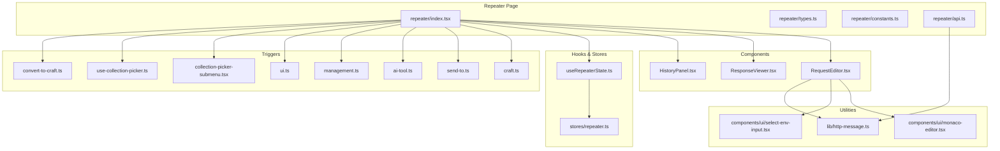
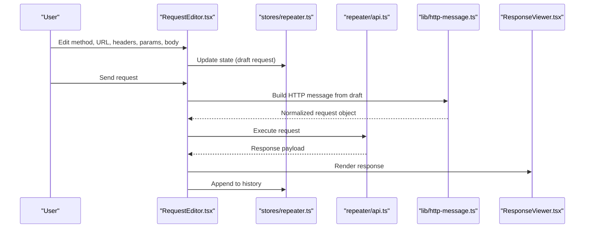
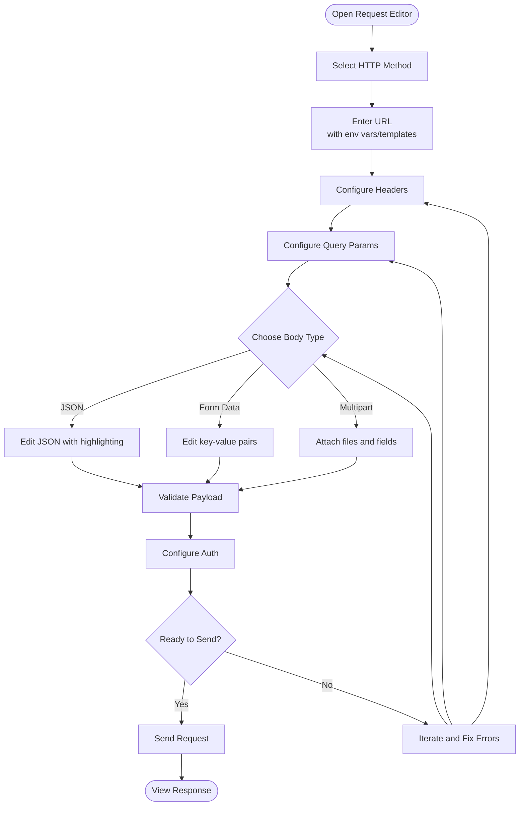
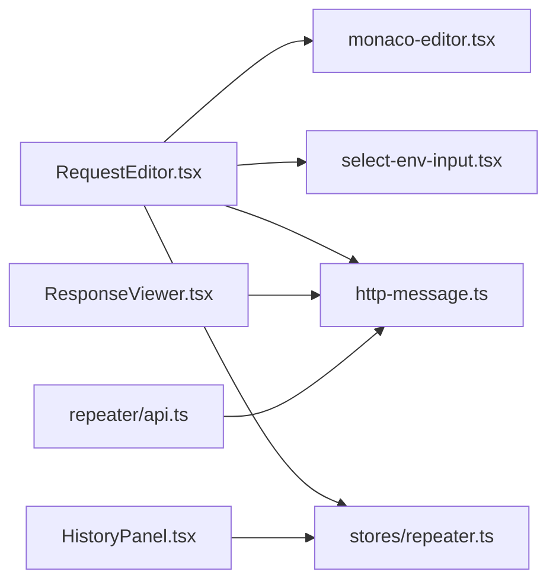

# Request Builder & Editor

<cite>
**Referenced Files in This Document**
- [repeater/index.tsx](file://src/pages/repeater/index.tsx)
- [repeater/types.ts](file://src/pages/repeater/types.ts)
- [repeater/constants.ts](file://src/pages/repeater/constants.ts)
- [repeater/api.ts](file://src/pages/repeater/api.ts)
- [repeater/components/RequestEditor.tsx](file://src/pages/repeater/components/RequestEditor.tsx)
- [repeater/components/ResponseViewer.tsx](file://src/pages/repeater/components/ResponseViewer.tsx)
- [repeater/components/HistoryPanel.tsx](file://src/pages/repeater/components/HistoryPanel.tsx)
- [repeater/hooks/useRepeaterState.ts](file://src/pages/repeater/hooks/useRepeaterState.ts)
- [stores/repeater.ts](file://src/stores/repeater.ts)
- [lib/http-message.ts](file://src/lib/http-message.ts)
- [components/ui/monaco-editor.tsx](file://src/components/ui/monaco-editor.tsx)
- [components/ui/select-env-input.tsx](file://src/components/ui/select-env-input.tsx)
- [triggers/repeater/craft.ts](file://src/triggers/repeater/craft.ts)
- [triggers/repeater/send-to.ts](file://src/triggers/repeater/send-to.ts)
- [triggers/repeater/ai-tool.ts](file://src/triggers/repeater/ai-tool.ts)
- [triggers/repeater/management.ts](file://src/triggers/repeater/management.ts)
- [triggers/repeater/ui.ts](file://src/triggers/repeater/ui.ts)
- [triggers/repeater/collection-picker-submenu.tsx](file://src/triggers/repeater/collection-picker-submenu.tsx)
- [triggers/repeater/use-collection-picker.ts](file://src/triggers/repeater/use-collection-picker.ts)
- [triggers/repeater/convert-to-craft.ts](file://src/triggers/repeater/convert-to-craft.ts)
</cite>

## Table of Contents
1. [Introduction](#introduction)
2. [Project Structure](#project-structure)
3. [Core Components](#core-components)
4. [Architecture Overview](#architecture-overview)
5. [Detailed Component Analysis](#detailed-component-analysis)
6. [Dependency Analysis](#dependency-analysis)
7. [Performance Considerations](#performance-considerations)
8. [Troubleshooting Guide](#troubleshooting-guide)
9. [Conclusion](#conclusion)
10. [Appendices](#appendices)

## Introduction
This document explains the API Repeater’s request builder and editor interface, focusing on how to construct HTTP requests with full control over methods, URLs, headers, parameters, and bodies. It covers the tabbed interface for organizing request parts (headers, params, body, auth), syntax highlighting, validation, autocomplete, environment variables, templating, dynamic content generation, keyboard shortcuts, copy/paste operations, and request history management. The goal is to help both new and experienced users build, refine, and execute repeatable HTTP requests efficiently.

## Project Structure
The Repeater feature is implemented as a page with components, hooks, triggers, and stores that coordinate UI, state, and backend interactions. Key areas:
- Page entry and routing: src/pages/repeater
- UI components: src/pages/repeater/components
- State and persistence: src/stores/repeater.ts
- HTTP message utilities: src/lib/http-message.ts
- Editor and input helpers: src/components/ui
- Triggers for actions like crafting, sending, and AI assistance: src/triggers/repeater

**Diagram sources**
- [repeater/index.tsx](file://src/pages/repeater/index.tsx)
- [repeater/types.ts](file://src/pages/repeater/types.ts)
- [repeater/constants.ts](file://src/pages/repeater/constants.ts)
- [repeater/api.ts](file://src/pages/repeater/api.ts)
- [repeater/components/RequestEditor.tsx](file://src/pages/repeater/components/RequestEditor.tsx)
- [repeater/components/ResponseViewer.tsx](file://src/pages/repeater/components/ResponseViewer.tsx)
- [repeater/components/HistoryPanel.tsx](file://src/pages/repeater/components/HistoryPanel.tsx)
- [repeater/hooks/useRepeaterState.ts](file://src/pages/repeater/hooks/useRepeaterState.ts)
- [stores/repeater.ts](file://src/stores/repeater.ts)
- [lib/http-message.ts](file://src/lib/http-message.ts)
- [components/ui/monaco-editor.tsx](file://src/components/ui/monaco-editor.tsx)
- [components/ui/select-env-input.tsx](file://src/components/ui/select-env-input.tsx)
- [triggers/repeater/craft.ts](file://src/triggers/repeater/craft.ts)
- [triggers/repeater/send-to.ts](file://src/triggers/repeater/send-to.ts)
- [triggers/repeater/ai-tool.ts](file://src/triggers/repeater/ai-tool.ts)
- [triggers/repeater/management.ts](file://src/triggers/repeater/management.ts)
- [triggers/repeater/ui.ts](file://src/triggers/repeater/ui.ts)
- [triggers/repeater/collection-picker-submenu.tsx](file://src/triggers/repeater/collection-picker-submenu.tsx)
- [triggers/repeater/use-collection-picker.ts](file://src/triggers/repeater/use-collection-picker.ts)
- [triggers/repeater/convert-to-craft.ts](file://src/triggers/repeater/convert-to-craft.ts)

**Section sources**
- [repeater/index.tsx](file://src/pages/repeater/index.tsx)
- [repeater/types.ts](file://src/pages/repeater/types.ts)
- [repeater/constants.ts](file://src/pages/repeater/constants.ts)
- [repeater/api.ts](file://src/pages/repeater/api.ts)
- [stores/repeater.ts](file://src/stores/repeater.ts)
- [lib/http-message.ts](file://src/lib/http-message.ts)

## Core Components
- Request Editor: Tabbed interface for method, URL, headers, query parameters, body, and authentication. Provides syntax highlighting, validation feedback, and autocomplete for keys and values. Supports environment variable interpolation and templating.
- Response Viewer: Displays response status, headers, and body with formatting options for JSON, text, and binary previews. Includes copy and export capabilities.
- History Panel: Lists past requests with search, filtering, and quick re-execution. Supports pinning and grouping.

Key responsibilities:
- Constructing HTTP messages from user input
- Validating inputs and providing inline errors
- Rendering responses with appropriate formatting
- Managing request history and collections
- Integrating with environment variables and templates

**Section sources**
- [repeater/components/RequestEditor.tsx](file://src/pages/repeater/components/RequestEditor.tsx)
- [repeater/components/ResponseViewer.tsx](file://src/pages/repeater/components/ResponseViewer.tsx)
- [repeater/components/HistoryPanel.tsx](file://src/pages/repeater/components/HistoryPanel.tsx)
- [lib/http-message.ts](file://src/lib/http-message.ts)

## Architecture Overview
The Repeater orchestrates user input through the Request Editor, transforms it into an HTTP message via utilities, executes the request using the API layer, and renders results in the Response Viewer while persisting history.

**Diagram sources**
- [repeater/components/RequestEditor.tsx](file://src/pages/repeater/components/RequestEditor.tsx)
- [stores/repeater.ts](file://src/stores/repeater.ts)
- [repeater/api.ts](file://src/pages/repeater/api.ts)
- [lib/http-message.ts](file://src/lib/http-message.ts)
- [repeater/components/ResponseViewer.tsx](file://src/pages/repeater/components/ResponseViewer.tsx)

## Detailed Component Analysis

### Request Editor
The Request Editor provides a tabbed layout for constructing HTTP requests:
- Method and URL: Dropdown or input for HTTP methods; URL field supports environment variables and templating.
- Headers: Key-value pairs with validation and autocomplete for common headers.
- Query Params: Key-value pairs with type hints and optional array support.
- Body: Supports JSON, form data, and multipart uploads with preview and validation.
- Auth: Predefined schemes and custom header injection.

Features:
- Syntax highlighting for JSON and form payloads
- Inline validation with error markers
- Autocomplete for keys and values based on context
- Environment variable interpolation and templating
- Keyboard shortcuts for send, save, and navigation
- Copy/paste operations for headers and body

**Diagram sources**
- [repeater/components/RequestEditor.tsx](file://src/pages/repeater/components/RequestEditor.tsx)
- [lib/http-message.ts](file://src/lib/http-message.ts)

**Section sources**
- [repeater/components/RequestEditor.tsx](file://src/pages/repeater/components/RequestEditor.tsx)
- [components/ui/monaco-editor.tsx](file://src/components/ui/monaco-editor.tsx)
- [components/ui/select-env-input.tsx](file://src/components/ui/select-env-input.tsx)
- [lib/http-message.ts](file://src/lib/http-message.ts)

### Response Viewer
The Response Viewer displays:
- Status code and reason
- Response headers
- Body formatted by content type (JSON, HTML, plain text, binary)
- Actions: copy, download, and export

It integrates with the store to maintain context and supports switching between raw and pretty views.

**Section sources**
- [repeater/components/ResponseViewer.tsx](file://src/pages/repeater/components/ResponseViewer.tsx)

### History Panel
The History Panel manages:
- List of executed requests with timestamps
- Search and filter by method, URL, status
- Quick re-run and pinning
- Grouping and tags

It persists entries and supports bulk operations.

**Section sources**
- [repeater/components/HistoryPanel.tsx](file://src/pages/repeater/components/HistoryPanel.tsx)
- [stores/repeater.ts](file://src/stores/repeater.ts)

### State Management and Hooks
- useRepeaterState: Manages local UI state for the editor and coordinates with global store.
- repeater store: Persists drafts, history, and settings.

**Section sources**
- [repeater/hooks/useRepeaterState.ts](file://src/pages/repeater/hooks/useRepeaterState.ts)
- [stores/repeater.ts](file://src/stores/repeater.ts)

### API Layer
The API module handles execution of HTTP requests, including:
- Building final request objects
- Handling timeouts and retries
- Returning structured responses

**Section sources**
- [repeater/api.ts](file://src/pages/repeater/api.ts)
- [lib/http-message.ts](file://src/lib/http-message.ts)

### Triggers and Workflows
- craft.ts: Converts captured traffic or external payloads into editor drafts.
- send-to.ts: Sends current request to other tools or collections.
- ai-tool.ts: Assists with generating or refining payloads and headers.
- management.ts: Handles saving, loading, and managing request collections.
- ui.ts: Exposes UI actions like toggling panels and shortcuts.
- collection-picker-submenu.tsx and use-collection-picker.ts: Provide collection selection workflows.
- convert-to-craft.ts: Transforms various formats into editor-friendly structures.

**Section sources**
- [triggers/repeater/craft.ts](file://src/triggers/repeater/craft.ts)
- [triggers/repeater/send-to.ts](file://src/triggers/repeater/send-to.ts)
- [triggers/repeater/ai-tool.ts](file://src/triggers/repeater/ai-tool.ts)
- [triggers/repeater/management.ts](file://src/triggers/repeater/management.ts)
- [triggers/repeater/ui.ts](file://src/triggers/repeater/ui.ts)
- [triggers/repeater/collection-picker-submenu.tsx](file://src/triggers/repeater/collection-picker-submenu.tsx)
- [triggers/repeater/use-collection-picker.ts](file://src/triggers/repeater/use-collection-picker.ts)
- [triggers/repeater/convert-to-craft.ts](file://src/triggers/repeater/convert-to-craft.ts)

## Dependency Analysis
The Repeater depends on shared UI components and utilities:
- Monaco Editor for syntax highlighting and editing
- Environment variable selector for interpolation
- HTTP message utilities for normalization and validation
- Store for persistence and cross-component state

**Diagram sources**
- [repeater/components/RequestEditor.tsx](file://src/pages/repeater/components/RequestEditor.tsx)
- [components/ui/monaco-editor.tsx](file://src/components/ui/monaco-editor.tsx)
- [components/ui/select-env-input.tsx](file://src/components/ui/select-env-input.tsx)
- [lib/http-message.ts](file://src/lib/http-message.ts)
- [stores/repeater.ts](file://src/stores/repeater.ts)
- [repeater/components/ResponseViewer.tsx](file://src/pages/repeater/components/ResponseViewer.tsx)
- [repeater/components/HistoryPanel.tsx](file://src/pages/repeater/components/HistoryPanel.tsx)
- [repeater/api.ts](file://src/pages/repeater/api.ts)

**Section sources**
- [repeater/components/RequestEditor.tsx](file://src/pages/repeater/components/RequestEditor.tsx)
- [components/ui/monaco-editor.tsx](file://src/components/ui/monaco-editor.tsx)
- [components/ui/select-env-input.tsx](file://src/components/ui/select-env-input.tsx)
- [lib/http-message.ts](file://src/lib/http-message.ts)
- [stores/repeater.ts](file://src/stores/repeater.ts)
- [repeater/components/ResponseViewer.tsx](file://src/pages/repeater/components/ResponseViewer.tsx)
- [repeater/components/HistoryPanel.tsx](file://src/pages/repeater/components/HistoryPanel.tsx)
- [repeater/api.ts](file://src/pages/repeater/api.ts)

## Performance Considerations
- Debounce validation and autocomplete to reduce overhead during typing.
- Lazy-load large response bodies and avoid rendering unnecessary content.
- Use efficient diffing for history updates and limit list size with virtualization.
- Cache frequently used environment variables and templates.
- Optimize JSON parsing and formatting for large payloads.

[No sources needed since this section provides general guidance]

## Troubleshooting Guide
Common issues and resolutions:
- Invalid JSON: Use the built-in validator and fix syntax errors indicated by markers.
- Missing headers: Ensure required headers are present; use autocomplete suggestions.
- Authentication failures: Verify credentials and token formats; check environment variables.
- Slow responses: Inspect network settings and consider reducing payload size.
- History not saving: Check storage permissions and persistence configuration.

**Section sources**
- [repeater/components/RequestEditor.tsx](file://src/pages/repeater/components/RequestEditor.tsx)
- [repeater/components/ResponseViewer.tsx](file://src/pages/repeater/components/ResponseViewer.tsx)
- [repeater/components/HistoryPanel.tsx](file://src/pages/repeater/components/HistoryPanel.tsx)
- [stores/repeater.ts](file://src/stores/repeater.ts)

## Conclusion
The API Repeater’s request builder and editor provide a comprehensive, extensible interface for crafting and executing HTTP requests. With robust editing features, validation, environment variable support, and integrated history management, it enables efficient API testing and iteration. Leveraging triggers and utilities, users can automate workflows, collaborate across collections, and streamline development and debugging tasks.

[No sources needed since this section summarizes without analyzing specific files]

## Appendices

### Common Request Patterns
- JSON payloads: Use JSON tab with syntax highlighting and validation.
- Form data: Switch to form mode and add key-value pairs.
- Multipart uploads: Attach files and additional fields in multipart mode.
- Authentication headers: Configure Authorization headers or use predefined schemes.

[No sources needed since this section provides general guidance]

### Keyboard Shortcuts
- Send request: Dedicated shortcut for quick execution.
- Save draft: Persist current editor state.
- Navigate tabs: Move between headers, params, body, and auth.
- Copy response: Export response body or headers.

[No sources needed since this section provides general guidance]

### Environment Variables and Templating
- Interpolate variables in URLs, headers, and body.
- Use templating expressions for dynamic content generation.
- Manage environments via the environment selector component.

[No sources needed since this section provides general guidance]