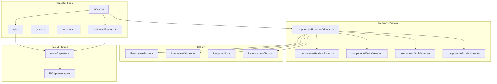
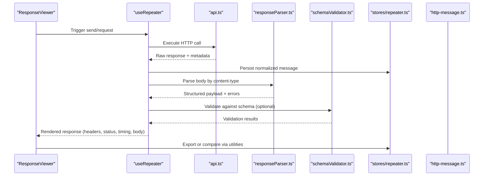
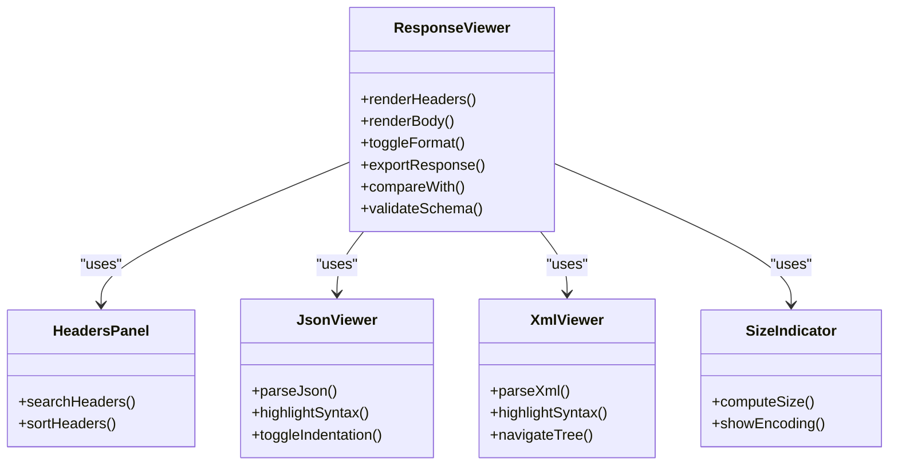
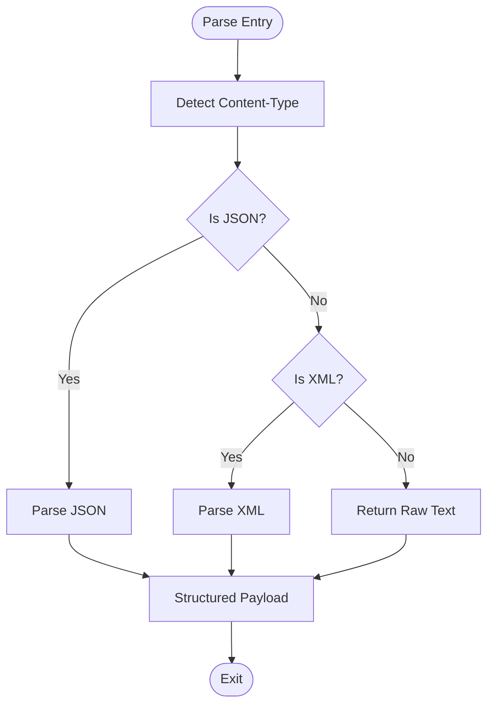
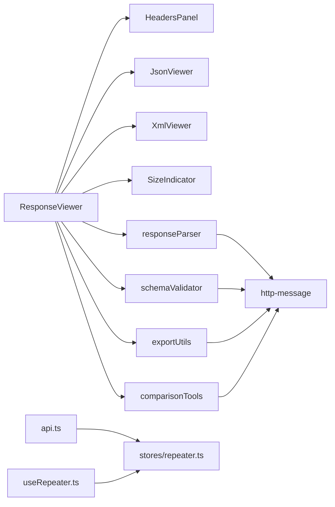

# Response Analysis & Inspection

<cite>
**Referenced Files in This Document**
- [repeater/index.tsx](file://src/pages/repeater/index.tsx)
- [repeater/api.ts](file://src/pages/repeater/api.ts)
- [repeater/types.ts](file://src/pages/repeater/types.ts)
- [repeater/constants.ts](file://src/pages/repeater/constants.ts)
- [repeater/hooks/useRepeater.ts](file://src/pages/repeater/hooks/useRepeater.ts)
- [repeater/components/ResponseViewer.tsx](file://src/pages/repeater/components/ResponseViewer.tsx)
- [repeater/components/HeadersPanel.tsx](file://src/pages/repeater/components/HeadersPanel.tsx)
- [repeater/components/JsonViewer.tsx](file://src/pages/repeater/components/JsonViewer.tsx)
- [repeater/components/XmlViewer.tsx](file://src/pages/repeater/components/XmlViewer.tsx)
- [repeater/components/SizeIndicator.tsx](file://src/pages/repeater/components/SizeIndicator.tsx)
- [repeater/lib/responseParser.ts](file://src/pages/repeater/lib/responseParser.ts)
- [repeater/lib/schemaValidator.ts](file://src/pages/repeater/lib/schemaValidator.ts)
- [repeater/lib/exportUtils.ts](file://src/pages/repeater/lib/exportUtils.ts)
- [repeater/lib/comparisonTools.ts](file://src/pages/repeater/lib/comparisonTools.ts)
- [stores/repeater.ts](file://src/stores/repeater.ts)
- [lib/http-message.ts](file://src/lib/http-message.ts)
</cite>

## Table of Contents
1. [Introduction](#introduction)
2. [Project Structure](#project-structure)
3. [Core Components](#core-components)
4. [Architecture Overview](#architecture-overview)
5. [Detailed Component Analysis](#detailed-component-analysis)
6. [Dependency Analysis](#dependency-analysis)
7. [Performance Considerations](#performance-considerations)
8. [Troubleshooting Guide](#troubleshooting-guide)
9. [Conclusion](#conclusion)

## Introduction
This document explains how to analyze and inspect API responses within the Repeater feature. It covers the response viewer with syntax highlighting, formatting options, and size indicators; examining headers, status codes, and timing information; JSON/XML parsing and schema validation; error analysis; export capabilities; comparison tools for diffing responses; debugging failed requests; performance profiling; automated response validation; memory management for large responses; and best practices for caching.

## Project Structure
The Repeater is implemented as a page with associated components, hooks, utilities, and store integration. The key areas include:
- Page entry and orchestration
- API interaction and state management
- Response parsing and validation
- UI panels for headers, body viewers, and metadata
- Export and comparison utilities

**Diagram sources**
- [repeater/index.tsx](file://src/pages/repeater/index.tsx)
- [repeater/api.ts](file://src/pages/repeater/api.ts)
- [repeater/types.ts](file://src/pages/repeater/types.ts)
- [repeater/constants.ts](file://src/pages/repeater/constants.ts)
- [repeater/hooks/useRepeater.ts](file://src/pages/repeater/hooks/useRepeater.ts)
- [repeater/components/ResponseViewer.tsx](file://src/pages/repeater/components/ResponseViewer.tsx)
- [repeater/components/HeadersPanel.tsx](file://src/pages/repeater/components/HeadersPanel.tsx)
- [repeater/components/JsonViewer.tsx](file://src/pages/repeater/components/JsonViewer.tsx)
- [repeater/components/XmlViewer.tsx](file://src/pages/repeater/components/XmlViewer.tsx)
- [repeater/components/SizeIndicator.tsx](file://src/pages/repeater/components/SizeIndicator.tsx)
- [repeater/lib/responseParser.ts](file://src/pages/repeater/lib/responseParser.ts)
- [repeater/lib/schemaValidator.ts](file://src/pages/repeater/lib/schemaValidator.ts)
- [repeater/lib/exportUtils.ts](file://src/pages/repeater/lib/exportUtils.ts)
- [repeater/lib/comparisonTools.ts](file://src/pages/repeater/lib/comparisonTools.ts)
- [stores/repeater.ts](file://src/stores/repeater.ts)
- [lib/http-message.ts](file://src/lib/http-message.ts)

**Section sources**
- [repeater/index.tsx](file://src/pages/repeater/index.tsx)
- [repeater/api.ts](file://src/pages/repeater/api.ts)
- [repeater/types.ts](file://src/pages/repeater/types.ts)
- [repeater/constants.ts](file://src/pages/repeater/constants.ts)
- [repeater/hooks/useRepeater.ts](file://src/pages/repeater/hooks/useRepeater.ts)
- [repeater/components/ResponseViewer.tsx](file://src/pages/repeater/components/ResponseViewer.tsx)
- [repeater/components/HeadersPanel.tsx](file://src/pages/repeater/components/HeadersPanel.tsx)
- [repeater/components/JsonViewer.tsx](file://src/pages/repeater/components/JsonViewer.tsx)
- [repeater/components/XmlViewer.tsx](file://src/pages/repeater/components/XmlViewer.tsx)
- [repeater/components/SizeIndicator.tsx](file://src/pages/repeater/components/SizeIndicator.tsx)
- [repeater/lib/responseParser.ts](file://src/pages/repeater/lib/responseParser.ts)
- [repeater/lib/schemaValidator.ts](file://src/pages/repeater/lib/schemaValidator.ts)
- [repeater/lib/exportUtils.ts](file://src/pages/repeater/lib/exportUtils.ts)
- [repeater/lib/comparisonTools.ts](file://src/pages/repeater/lib/comparisonTools.ts)
- [stores/repeater.ts](file://src/stores/repeater.ts)
- [lib/http-message.ts](file://src/lib/http-message.ts)

## Core Components
- ResponseViewer: Central panel that renders headers, status/timing, and body content with syntax highlighting and formatting controls.
- HeadersPanel: Displays response headers in a searchable, sortable table.
- JsonViewer: Parses and highlights JSON payloads with collapsible tree view and formatting toggles.
- XmlViewer: Parses and highlights XML payloads with tree navigation.
- SizeIndicator: Shows payload size and encoding details.
- responseParser: Detects content type and parses bodies into structured data.
- schemaValidator: Validates parsed JSON against provided schemas.
- exportUtils: Exports responses to common formats (JSON, CSV, text).
- comparisonTools: Computes diffs between two responses (headers/body/status/timing).

Key responsibilities:
- Parsing and normalization of response payloads
- Rendering with syntax highlighting and formatting options
- Validation and error reporting
- Export and comparison workflows
- Integration with store for persistence and retrieval

**Section sources**
- [repeater/components/ResponseViewer.tsx](file://src/pages/repeater/components/ResponseViewer.tsx)
- [repeater/components/HeadersPanel.tsx](file://src/pages/repeater/components/HeadersPanel.tsx)
- [repeater/components/JsonViewer.tsx](file://src/pages/repeater/components/JsonViewer.tsx)
- [repeater/components/XmlViewer.tsx](file://src/pages/repeater/components/XmlViewer.tsx)
- [repeater/components/SizeIndicator.tsx](file://src/pages/repeater/components/SizeIndicator.tsx)
- [repeater/lib/responseParser.ts](file://src/pages/repeater/lib/responseParser.ts)
- [repeater/lib/schemaValidator.ts](file://src/pages/repeater/lib/schemaValidator.ts)
- [repeater/lib/exportUtils.ts](file://src/pages/repeater/lib/exportUtils.ts)
- [repeater/lib/comparisonTools.ts](file://src/pages/repeater/lib/comparisonTools.ts)

## Architecture Overview
The Repeater orchestrates request execution, response capture, parsing, validation, and rendering. The flow integrates with shared HTTP message types and the repeater store for persistence.

**Diagram sources**
- [repeater/hooks/useRepeater.ts](file://src/pages/repeater/hooks/useRepeater.ts)
- [repeater/api.ts](file://src/pages/repeater/api.ts)
- [repeater/lib/responseParser.ts](file://src/pages/repeater/lib/responseParser.ts)
- [repeater/lib/schemaValidator.ts](file://src/pages/repeater/lib/schemaValidator.ts)
- [stores/repeater.ts](file://src/stores/repeater.ts)
- [lib/http-message.ts](file://src/lib/http-message.ts)

## Detailed Component Analysis

### ResponseViewer
Responsibilities:
- Display status code, timing metrics, and header summary
- Switch between raw and formatted views
- Toggle JSON/XML formatting options (indentation, minify)
- Show size indicator and encoding info
- Provide actions: copy, export, compare, validate

**Diagram sources**
- [repeater/components/ResponseViewer.tsx](file://src/pages/repeater/components/ResponseViewer.tsx)
- [repeater/components/HeadersPanel.tsx](file://src/pages/repeater/components/HeadersPanel.tsx)
- [repeater/components/JsonViewer.tsx](file://src/pages/repeater/components/JsonViewer.tsx)
- [repeater/components/XmlViewer.tsx](file://src/pages/repeater/components/XmlViewer.tsx)
- [repeater/components/SizeIndicator.tsx](file://src/pages/repeater/components/SizeIndicator.tsx)

**Section sources**
- [repeater/components/ResponseViewer.tsx](file://src/pages/repeater/components/ResponseViewer.tsx)
- [repeater/components/HeadersPanel.tsx](file://src/pages/repeater/components/HeadersPanel.tsx)
- [repeater/components/JsonViewer.tsx](file://src/pages/repeater/components/JsonViewer.tsx)
- [repeater/components/XmlViewer.tsx](file://src/pages/repeater/components/XmlViewer.tsx)
- [repeater/components/SizeIndicator.tsx](file://src/pages/repeater/components/SizeIndicator.tsx)

### Headers Panel
Features:
- Searchable list of headers
- Sortable columns (name, value)
- Highlighting of critical headers (content-type, cache-control, set-cookie)
- Copy individual header values

Best practices:
- Normalize header names to lowercase for consistent search/sort
- Preserve original casing in display while using normalized keys internally

**Section sources**
- [repeater/components/HeadersPanel.tsx](file://src/pages/repeater/components/HeadersPanel.tsx)

### JSON Viewer
Capabilities:
- Parse JSON with error handling
- Syntax highlighting and collapsible tree
- Formatting options (indentation levels, minify)
- Navigate nested objects and arrays
- Copy path to selected node

Error analysis:
- Report parse errors with line/column context
- Offer fallback to raw view when parsing fails

**Section sources**
- [repeater/components/JsonViewer.tsx](file://src/pages/repeater/components/JsonViewer.tsx)
- [repeater/lib/responseParser.ts](file://src/pages/repeater/lib/responseParser.ts)

### XML Viewer
Capabilities:
- Parse XML with error handling
- Syntax highlighting and tree navigation
- Pretty print and minify options
- Extract attributes and text nodes

Error analysis:
- Surface well-formedness issues and provide hints

**Section sources**
- [repeater/components/XmlViewer.tsx](file://src/pages/repeater/components/XmlViewer.tsx)
- [repeater/lib/responseParser.ts](file://src/pages/repeater/lib/responseParser.ts)

### Size Indicator
Metrics:
- Total bytes and human-readable sizes
- Content-Encoding awareness (gzip, deflate, br)
- Decompressed vs compressed size when available

Usage:
- Helps identify oversized responses and compression effectiveness

**Section sources**
- [repeater/components/SizeIndicator.tsx](file://src/pages/repeater/components/SizeIndicator.tsx)

### Response Parser
Logic:
- Inspect content-type to determine parser
- Decode bodies safely (UTF-8, base64 where applicable)
- Return structured payload and parse errors

**Diagram sources**
- [repeater/lib/responseParser.ts](file://src/pages/repeater/lib/responseParser.ts)

**Section sources**
- [repeater/lib/responseParser.ts](file://src/pages/repeater/lib/responseParser.ts)

### Schema Validator
Functionality:
- Validate parsed JSON against provided schemas
- Report violations with paths and expected types
- Support multiple schema versions if needed

Integration:
- Optional step triggered from ResponseViewer actions

**Section sources**
- [repeater/lib/schemaValidator.ts](file://src/pages/repeater/lib/schemaValidator.ts)

### Export Utilities
Export targets:
- JSON file
- CSV (for array-of-objects payloads)
- Plain text (raw body)
- Combined metadata (headers, status, timing)

Workflow:
- Serialize payload according to target format
- Include optional metadata block
- Trigger browser download

**Section sources**
- [repeater/lib/exportUtils.ts](file://src/pages/repeater/lib/exportUtils.ts)

### Comparison Tools
Diff capabilities:
- Compare headers (added/removed/changed)
- Compare bodies (JSON/XML/text) with contextual diffs
- Compare status codes and timing deltas
- Generate side-by-side or unified diff output

Use cases:
- Regression detection across environments
- Change tracking between API versions

**Section sources**
- [repeater/lib/comparisonTools.ts](file://src/pages/repeater/lib/comparisonTools.ts)

### Store Integration
Responsibilities:
- Persist responses and metadata
- Manage history and pinning
- Provide query/filter/search over stored responses
- Coordinate with http-message types for consistency

**Section sources**
- [stores/repeater.ts](file://src/stores/repeater.ts)
- [lib/http-message.ts](file://src/lib/http-message.ts)

## Dependency Analysis
The Repeater’s components depend on shared utilities and store abstractions. Key relationships:
- ResponseViewer composes HeadersPanel, JsonViewer, XmlViewer, and SizeIndicator
- Parser and Validator are invoked during response processing
- Export and Comparison tools operate on normalized structures
- Store provides persistence and retrieval backed by http-message types

**Diagram sources**
- [repeater/components/ResponseViewer.tsx](file://src/pages/repeater/components/ResponseViewer.tsx)
- [repeater/lib/responseParser.ts](file://src/pages/repeater/lib/responseParser.ts)
- [repeater/lib/schemaValidator.ts](file://src/pages/repeater/lib/schemaValidator.ts)
- [repeater/lib/exportUtils.ts](file://src/pages/repeater/lib/exportUtils.ts)
- [repeater/lib/comparisonTools.ts](file://src/pages/repeater/lib/comparisonTools.ts)
- [repeater/api.ts](file://src/pages/repeater/api.ts)
- [repeater/hooks/useRepeater.ts](file://src/pages/repeater/hooks/useRepeater.ts)
- [stores/repeater.ts](file://src/stores/repeater.ts)
- [lib/http-message.ts](file://src/lib/http-message.ts)

**Section sources**
- [repeater/components/ResponseViewer.tsx](file://src/pages/repeater/components/ResponseViewer.tsx)
- [repeater/lib/responseParser.ts](file://src/pages/repeater/lib/responseParser.ts)
- [repeater/lib/schemaValidator.ts](file://src/pages/repeater/lib/schemaValidator.ts)
- [repeater/lib/exportUtils.ts](file://src/pages/repeater/lib/exportUtils.ts)
- [repeater/lib/comparisonTools.ts](file://src/pages/repeater/lib/comparisonTools.ts)
- [repeater/api.ts](file://src/pages/repeater/api.ts)
- [repeater/hooks/useRepeater.ts](file://src/pages/repeater/hooks/useRepeater.ts)
- [stores/repeater.ts](file://src/stores/repeater.ts)
- [lib/http-message.ts](file://src/lib/http-message.ts)

## Performance Considerations
- Large responses:
  - Stream or chunk rendering for very large payloads
  - Defer parsing until user opens the body tab
  - Use virtualized lists for extensive header sets
- Memory management:
  - Release references after export/diff operations
  - Avoid holding multiple large decoded buffers simultaneously
- Caching:
  - Cache parsed results keyed by request fingerprint
  - Respect server cache headers (ETag, Cache-Control)
  - Implement TTL-based invalidation for frequently changing endpoints
- Timing metrics:
  - Record DNS, connect, TLS handshake, TTFB, and total time
  - Expose per-phase breakdown for profiling

[No sources needed since this section provides general guidance]

## Troubleshooting Guide
Common issues and resolutions:
- Parse failures:
  - Verify content-type and charset
  - Check for truncated responses or network interruptions
  - Fall back to raw view when parsing fails
- Missing headers:
  - Ensure proxy/capture layer forwards all headers
  - Normalize header names for consistent inspection
- Slow rendering:
  - Disable auto-formatting for large payloads
  - Limit initial tree depth in JSON/XML viewers
- Validation errors:
  - Confirm schema version matches API contract
  - Inspect field paths reported by validator

Debugging failed requests:
- Inspect status codes and error bodies
- Review timing breakdown to identify bottlenecks
- Use comparison tool to detect regressions between environments

Automated response validation:
- Integrate schema validation into CI pipelines
- Snapshot baseline responses and diff on changes
- Fail builds on unexpected deviations

**Section sources**
- [repeater/lib/responseParser.ts](file://src/pages/repeater/lib/responseParser.ts)
- [repeater/lib/schemaValidator.ts](file://src/pages/repeater/lib/schemaValidator.ts)
- [repeater/lib/comparisonTools.ts](file://src/pages/repeater/lib/comparisonTools.ts)

## Conclusion
The Repeater’s response analysis features provide a comprehensive toolkit for inspecting, validating, exporting, and comparing API responses. By leveraging syntax highlighting, formatting controls, size indicators, and robust parsing/validation utilities, developers can efficiently debug issues, profile performance, and ensure API contracts remain stable across changes. Adhering to the recommended practices for memory management and caching ensures smooth operation even with large payloads.

[No sources needed since this section summarizes without analyzing specific files]