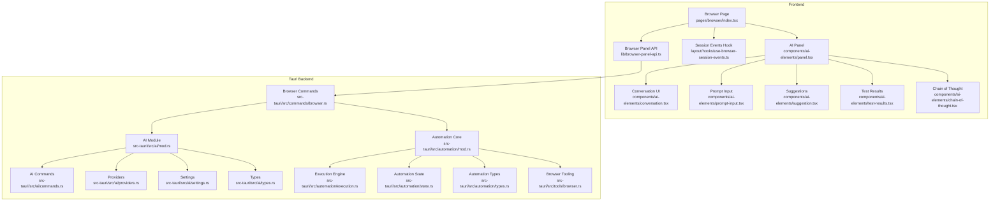
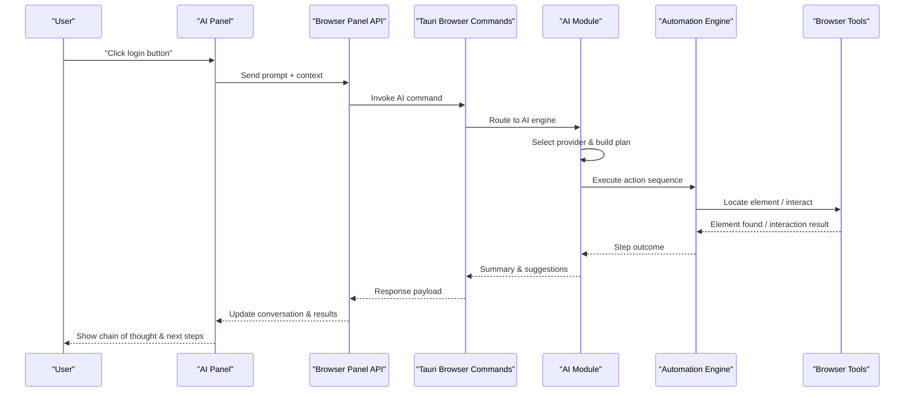
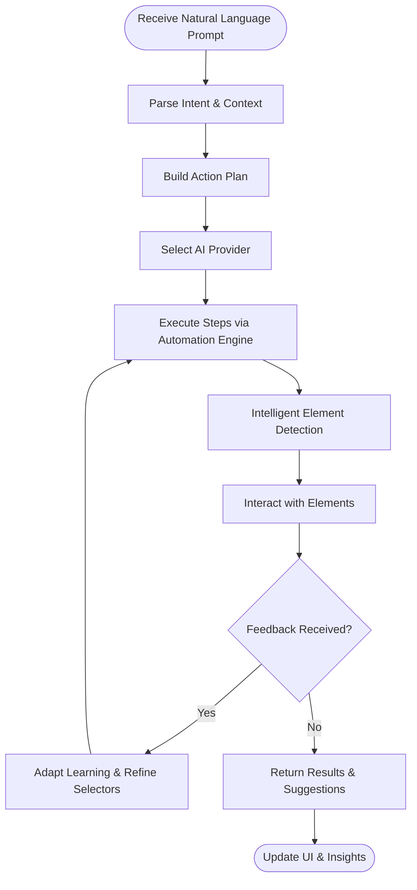
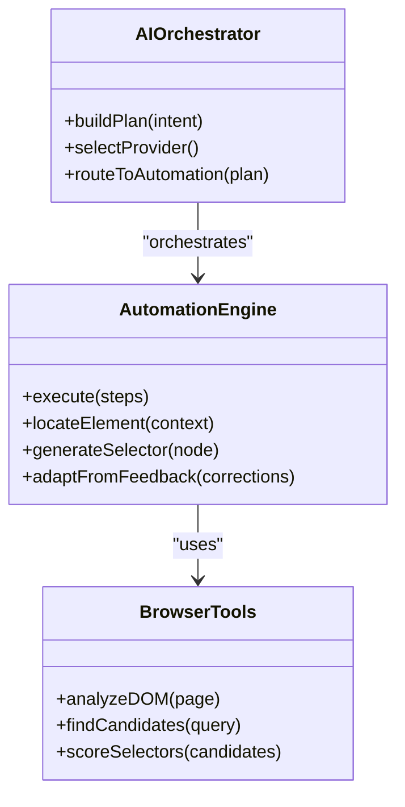
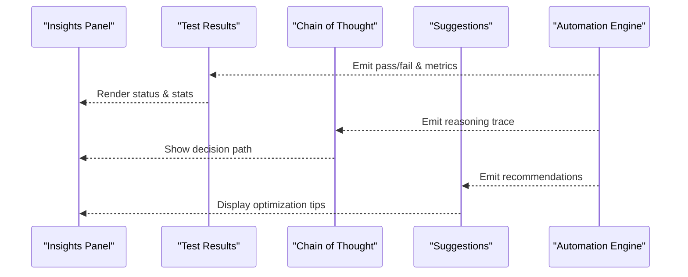
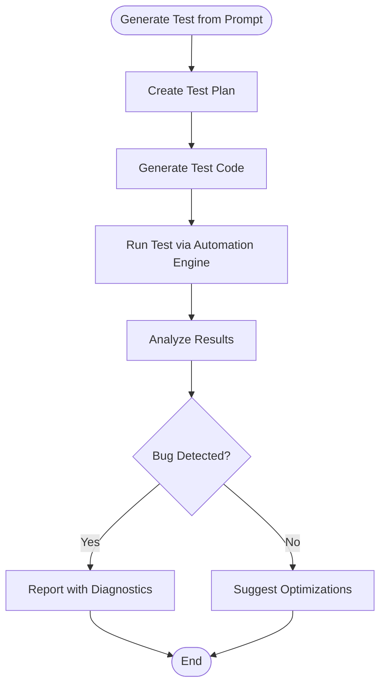
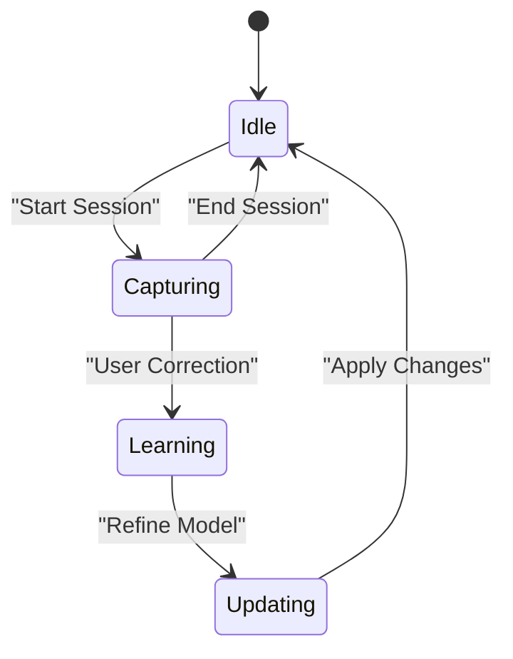
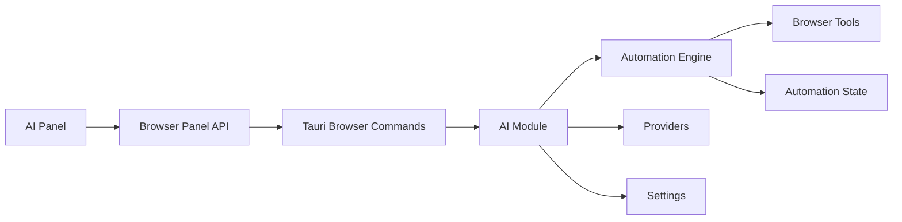

# AI-Powered Browser Features

<cite>
**Referenced Files in This Document**
- [browser.mdx](file://docs/website/content/docs/ai-and-automation/browser.mdx)
- [index.tsx](file://src/pages/browser/index.tsx)
- [types.ts](file://src/pages/browser/types.ts)
- [constants.ts](file://src/pages/browser/constants.ts)
- [browser-panel-api.ts](file://src/lib/browser-panel-api.ts)
- [use-browser-session-events.ts](file://src/layout/hooks/use-browser-session-events.ts)
- [open-browser.tsx](file://src/layout/open-browser.tsx)
- [ai-tool.ts](file://src/triggers/browser/ai-tool.ts)
- [crawl.ts](file://src/triggers/browser/crawl.ts)
- [page-crawled.ts](file://src/triggers/browser/page-crawled.ts)
- [ui.ts](file://src/triggers/browser/ui.ts)
- [mod.rs](file://src-tauri/src/ai/mod.rs)
- [commands.rs](file://src-tauri/src/ai/commands.rs)
- [providers.rs](file://src-tauri/src/ai/providers.rs)
- [settings.rs](file://src-tauri/src/ai/settings.rs)
- [types.rs](file://src-tauri/src/ai/types.rs)
- [browser.rs](file://src-tauri/src/commands/browser.rs)
- [mod.rs](file://src-tauri/src/automation/mod.rs)
- [execution.rs](file://src-tauri/src/automation/execution.rs)
- [state.rs](file://src-tauri/src/automation/state.rs)
- [types.rs](file://src-tauri/src/automation/types.rs)
- [browser.rs](file://src-tauri/src/tools/browser.rs)
- [index.tsx](file://src/components/ai-elements/conversation.tsx)
- [prompt-input.tsx](file://src/components/ai-elements/prompt-input.tsx)
- [suggestion.tsx](file://src/components/ai-elements/suggestion.tsx)
- [test-results.tsx](file://src/components/ai-elements/test-results.tsx)
- [chain-of-thought.tsx](file://src/components/ai-elements/chain-of-thought.tsx)
- [panel.tsx](file://src/components/ai-elements/panel.tsx)
</cite>

## Table of Contents
1. [Introduction](#introduction)
2. [Project Structure](#project-structure)
3. [Core Components](#core-components)
4. [Architecture Overview](#architecture-overview)
5. [Detailed Component Analysis](#detailed-component-analysis)
6. [Dependency Analysis](#dependency-analysis)
7. [Performance Considerations](#performance-considerations)
8. [Troubleshooting Guide](#troubleshooting-guide)
9. [Conclusion](#conclusion)

## Introduction
This document explains Apprecon’s AI-powered browser features that enhance automation through intelligent element detection, natural language commands, and adaptive learning from user interactions. It also documents the insights panel for AI-generated recommendations on test optimization and performance, and details integration with Apprecon’s AI engine for automated test generation and bug detection. Practical examples include AI-assisted debugging, smart selector generation, and predictive element location to produce robust automation scripts.

## Project Structure
Apprecon implements AI-driven browser capabilities across three layers:
- Frontend UI and orchestration (React components, hooks, and stores)
- Tauri backend services (Rust modules for AI, automation, and browser tools)
- Documentation and configuration assets

**Diagram sources**
- [index.tsx](file://src/pages/browser/index.tsx)
- [panel.tsx](file://src/components/ai-elements/panel.tsx)
- [conversation.tsx](file://src/components/ai-elements/conversation.tsx)
- [prompt-input.tsx](file://src/components/ai-elements/prompt-input.tsx)
- [suggestion.tsx](file://src/components/ai-elements/suggestion.tsx)
- [test-results.tsx](file://src/components/ai-elements/test-results.tsx)
- [chain-of-thought.tsx](file://src/components/ai-elements/chain-of-thought.tsx)
- [use-browser-session-events.ts](file://src/layout/hooks/use-browser-session-events.ts)
- [browser-panel-api.ts](file://src/lib/browser-panel-api.ts)
- [mod.rs](file://src-tauri/src/ai/mod.rs)
- [commands.rs](file://src-tauri/src/ai/commands.rs)
- [providers.rs](file://src-tauri/src/ai/providers.rs)
- [settings.rs](file://src-tauri/src/ai/settings.rs)
- [types.rs](file://src-tauri/src/ai/types.rs)
- [browser.rs](file://src-tauri/src/commands/browser.rs)
- [mod.rs](file://src-tauri/src/automation/mod.rs)
- [execution.rs](file://src-tauri/src/automation/execution.rs)
- [state.rs](file://src-tauri/src/automation/state.rs)
- [types.rs](file://src-tauri/src/automation/types.rs)
- [browser.rs](file://src-tauri/src/tools/browser.rs)

**Section sources**
- [index.tsx](file://src/pages/browser/index.tsx)
- [panel.tsx](file://src/components/ai-elements/panel.tsx)
- [mod.rs](file://src-tauri/src/ai/mod.rs)
- [mod.rs](file://src-tauri/src/automation/mod.rs)

## Core Components
- AI Panel and Conversation UI: Provides a chat-like interface for natural language commands, suggestions, and step-by-step reasoning.
- Prompt Input and Suggestions: Accepts user intents and proposes actions or selectors based on context.
- Test Results and Chain of Thought: Displays outcomes and intermediate reasoning for transparency and debugging.
- Session Events Hook: Bridges browser session events to the AI layer for adaptive learning.
- Browser Panel API: Exposes Tauri commands for AI operations and automation execution.
- Tauri AI Module: Orchestrates provider selection, settings, and command routing.
- Automation Engine: Executes actions, manages state, and integrates with browser tooling.

Key responsibilities:
- Translate natural language into actionable steps
- Generate and refine selectors intelligently
- Learn from user corrections and session patterns
- Provide insights for optimization and performance

**Section sources**
- [conversation.tsx](file://src/components/ai-elements/conversation.tsx)
- [prompt-input.tsx](file://src/components/ai-elements/prompt-input.tsx)
- [suggestion.tsx](file://src/components/ai-elements/suggestion.tsx)
- [test-results.tsx](file://src/components/ai-elements/test-results.tsx)
- [chain-of-thought.tsx](file://src/components/ai-elements/chain-of-thought.tsx)
- [use-browser-session-events.ts](file://src/layout/hooks/use-browser-session-events.ts)
- [browser-panel-api.ts](file://src/lib/browser-panel-api.ts)
- [mod.rs](file://src-tauri/src/ai/mod.rs)
- [mod.rs](file://src-tauri/src/automation/mod.rs)

## Architecture Overview
The AI-powered browser workflow connects frontend prompts to backend AI orchestration and automation execution. The flow supports natural language input, intelligent element detection, and feedback loops for adaptive learning.

**Diagram sources**
- [browser-panel-api.ts](file://src/lib/browser-panel-api.ts)
- [browser.rs](file://src-tauri/src/commands/browser.rs)
- [mod.rs](file://src-tauri/src/ai/mod.rs)
- [commands.rs](file://src-tauri/src/ai/commands.rs)
- [execution.rs](file://src-tauri/src/automation/execution.rs)
- [browser.rs](file://src-tauri/src/tools/browser.rs)

## Detailed Component Analysis

### Natural Language Command Processing
- The AI Panel captures user intent via the prompt input and forwards it to the Browser Panel API.
- The Tauri Browser Commands route requests to the AI Module, which selects providers and constructs an execution plan.
- The Automation Engine executes steps using Browser Tools, returning structured results and suggestions.

**Diagram sources**
- [prompt-input.tsx](file://src/components/ai-elements/prompt-input.tsx)
- [browser-panel-api.ts](file://src/lib/browser-panel-api.ts)
- [mod.rs](file://src-tauri/src/ai/mod.rs)
- [commands.rs](file://src-tauri/src/ai/commands.rs)
- [execution.rs](file://src-tauri/src/automation/execution.rs)
- [browser.rs](file://src-tauri/src/tools/browser.rs)

**Section sources**
- [prompt-input.tsx](file://src/components/ai-elements/prompt-input.tsx)
- [browser-panel-api.ts](file://src/lib/browser-panel-api.ts)
- [mod.rs](file://src-tauri/src/ai/mod.rs)
- [commands.rs](file://src-tauri/src/ai/commands.rs)
- [execution.rs](file://src-tauri/src/automation/execution.rs)
- [browser.rs](file://src-tauri/src/tools/browser.rs)

### Intelligent Element Detection and Smart Selector Generation
- The Automation Engine leverages Browser Tools to analyze DOM structure and generate robust selectors.
- Predictive element location uses contextual cues (labels, roles, attributes) to reduce flakiness.
- Adaptive learning updates selector strategies based on user corrections and session history.

**Diagram sources**
- [execution.rs](file://src-tauri/src/automation/execution.rs)
- [browser.rs](file://src-tauri/src/tools/browser.rs)
- [mod.rs](file://src-tauri/src/ai/mod.rs)

**Section sources**
- [execution.rs](file://src-tauri/src/automation/execution.rs)
- [browser.rs](file://src-tauri/src/tools/browser.rs)
- [mod.rs](file://src-tauri/src/ai/mod.rs)

### Insights Panel for Optimization and Performance
- The Test Results component displays outcomes and highlights areas for improvement.
- Chain of Thought provides transparency into decisions and suggests optimizations.
- Suggestions propose better selectors, wait strategies, and test case refinements.

**Diagram sources**
- [test-results.tsx](file://src/components/ai-elements/test-results.tsx)
- [chain-of-thought.tsx](file://src/components/ai-elements/chain-of-thought.tsx)
- [suggestion.tsx](file://src/components/ai-elements/suggestion.tsx)
- [execution.rs](file://src-tauri/src/automation/execution.rs)

**Section sources**
- [test-results.tsx](file://src/components/ai-elements/test-results.tsx)
- [chain-of-thought.tsx](file://src/components/ai-elements/chain-of-thought.tsx)
- [suggestion.tsx](file://src/components/ai-elements/suggestion.tsx)
- [execution.rs](file://src-tauri/src/automation/execution.rs)

### Automated Test Generation and Bug Detection
- The AI Module integrates with providers to generate tests from natural language descriptions.
- Automation Execution runs generated tests and reports failures with diagnostic information.
- Browser Tools assist in capturing evidence and identifying root causes.

**Diagram sources**
- [mod.rs](file://src-tauri/src/ai/mod.rs)
- [commands.rs](file://src-tauri/src/ai/commands.rs)
- [execution.rs](file://src-tauri/src/automation/execution.rs)
- [browser.rs](file://src-tauri/src/tools/browser.rs)

**Section sources**
- [mod.rs](file://src-tauri/src/ai/mod.rs)
- [commands.rs](file://src-tauri/src/ai/commands.rs)
- [execution.rs](file://src-tauri/src/automation/execution.rs)
- [browser.rs](file://src-tauri/src/tools/browser.rs)

### Adaptive Learning from User Interactions
- Session Events Hook captures user actions and corrections.
- Automation State persists learned patterns and preferences.
- AI Orchestrator refines future plans based on historical feedback.

**Diagram sources**
- [use-browser-session-events.ts](file://src/layout/hooks/use-browser-session-events.ts)
- [state.rs](file://src-tauri/src/automation/state.rs)
- [mod.rs](file://src-tauri/src/ai/mod.rs)

**Section sources**
- [use-browser-session-events.ts](file://src/layout/hooks/use-browser-session-events.ts)
- [state.rs](file://src-tauri/src/automation/state.rs)
- [mod.rs](file://src-tauri/src/ai/mod.rs)

### Examples of AI-Assisted Debugging, Smart Selectors, and Predictive Location
- AI-Assisted Debugging: The Chain of Thought shows why a step failed and suggests fixes.
- Smart Selector Generation: The system proposes stable selectors based on semantic cues.
- Predictive Element Location: Anticipates element positions using context and prior interactions.

Practical references:
- Conversation and reasoning display: [conversation.tsx](file://src/components/ai-elements/conversation.tsx), [chain-of-thought.tsx](file://src/components/ai-elements/chain-of-thought.tsx)
- Selector generation and prediction: [execution.rs](file://src-tauri/src/automation/execution.rs), [browser.rs](file://src-tauri/src/tools/browser.rs)
- Session-based adaptation: [use-browser-session-events.ts](file://src/layout/hooks/use-browser-session-events.ts), [state.rs](file://src-tauri/src/automation/state.rs)

**Section sources**
- [conversation.tsx](file://src/components/ai-elements/conversation.tsx)
- [chain-of-thought.tsx](file://src/components/ai-elements/chain-of-thought.tsx)
- [execution.rs](file://src-tauri/src/automation/execution.rs)
- [browser.rs](file://src-tauri/src/tools/browser.rs)
- [use-browser-session-events.ts](file://src/layout/hooks/use-browser-session-events.ts)
- [state.rs](file://src-tauri/src/automation/state.rs)

## Dependency Analysis
The AI-powered browser features rely on tight coupling between frontend panels, Tauri commands, AI orchestration, and automation execution.

**Diagram sources**
- [panel.tsx](file://src/components/ai-elements/panel.tsx)
- [browser-panel-api.ts](file://src/lib/browser-panel-api.ts)
- [browser.rs](file://src-tauri/src/commands/browser.rs)
- [mod.rs](file://src-tauri/src/ai/mod.rs)
- [mod.rs](file://src-tauri/src/automation/mod.rs)
- [execution.rs](file://src-tauri/src/automation/execution.rs)
- [state.rs](file://src-tauri/src/automation/state.rs)
- [browser.rs](file://src-tauri/src/tools/browser.rs)
- [providers.rs](file://src-tauri/src/ai/providers.rs)
- [settings.rs](file://src-tauri/src/ai/settings.rs)

**Section sources**
- [panel.tsx](file://src/components/ai-elements/panel.tsx)
- [browser-panel-api.ts](file://src/lib/browser-panel-api.ts)
- [browser.rs](file://src-tauri/src/commands/browser.rs)
- [mod.rs](file://src-tauri/src/ai/mod.rs)
- [mod.rs](file://src-tauri/src/automation/mod.rs)
- [execution.rs](file://src-tauri/src/automation/execution.rs)
- [state.rs](file://src-tauri/src/automation/state.rs)
- [browser.rs](file://src-tauri/src/tools/browser.rs)
- [providers.rs](file://src-tauri/src/ai/providers.rs)
- [settings.rs](file://src-tauri/src/ai/settings.rs)

## Performance Considerations
- Minimize DOM analysis overhead by caching selector scores and candidate lists.
- Use incremental learning to avoid reprocessing entire sessions on each correction.
- Stream responses from the AI engine to keep the UI responsive during long-running tasks.
- Debounce frequent session events to prevent excessive state updates.

[No sources needed since this section provides general guidance]

## Troubleshooting Guide
Common issues and resolutions:
- AI provider misconfiguration: Verify settings and credentials in the AI module.
- Selector instability: Review Chain of Thought output and adjust selector strategies.
- Automation timeouts: Increase wait thresholds and add explicit synchronization points.
- Session drift: Re-sync state after major page changes and clear stale caches.

Relevant files for diagnostics:
- AI settings and providers: [settings.rs](file://src-tauri/src/ai/settings.rs), [providers.rs](file://src-tauri/src/ai/providers.rs)
- Automation execution logs: [execution.rs](file://src-tauri/src/automation/execution.rs)
- Session event handling: [use-browser-session-events.ts](file://src/layout/hooks/use-browser-session-events.ts)

**Section sources**
- [settings.rs](file://src-tauri/src/ai/settings.rs)
- [providers.rs](file://src-tauri/src/ai/providers.rs)
- [execution.rs](file://src-tauri/src/automation/execution.rs)
- [use-browser-session-events.ts](file://src/layout/hooks/use-browser-session-events.ts)

## Conclusion
Apprecon’s AI-powered browser features combine natural language interfaces, intelligent element detection, and adaptive learning to deliver robust automation. The insights panel and chain-of-thought outputs provide transparency and actionable recommendations. Integration with the AI engine enables automated test generation and bug detection, while smart selector generation and predictive element location improve reliability. By leveraging these capabilities, teams can accelerate testing workflows and maintain high-quality automation scripts.

[No sources needed since this section summarizes without analyzing specific files]