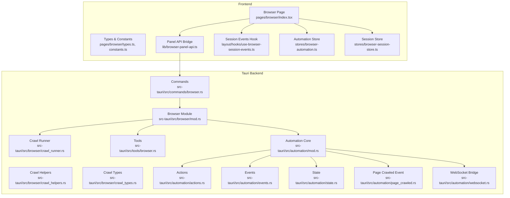
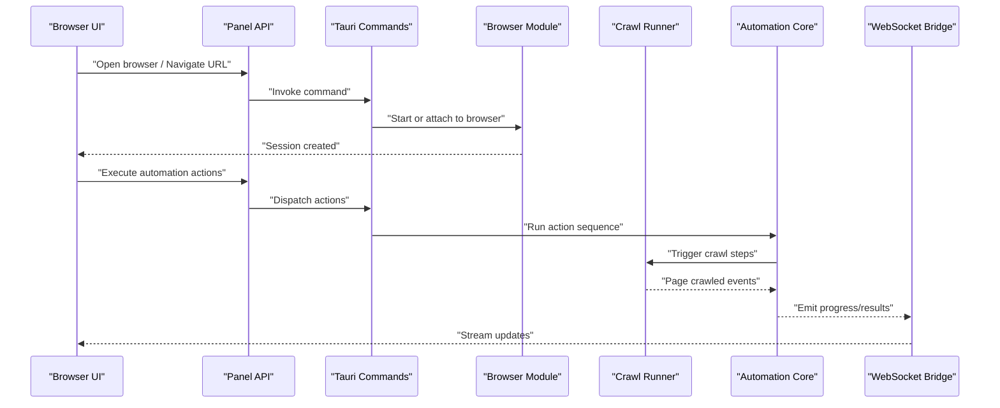
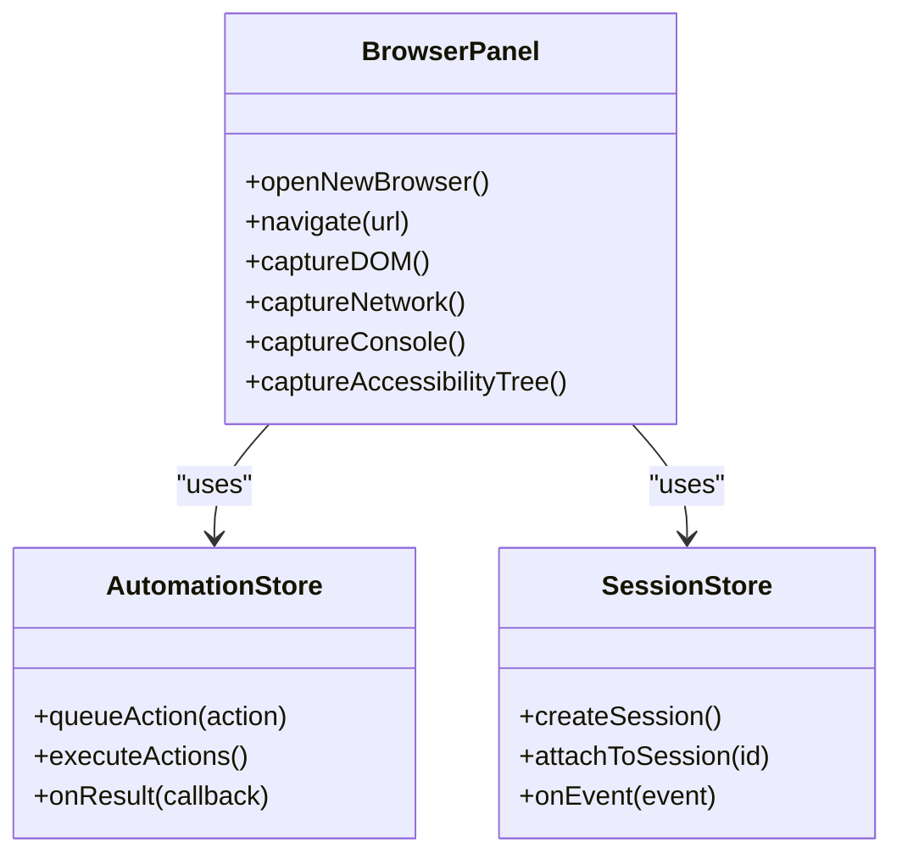
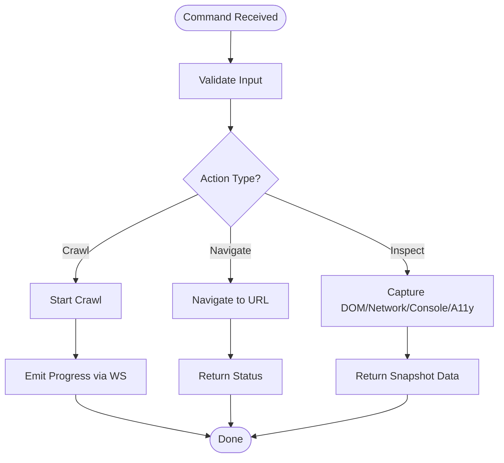
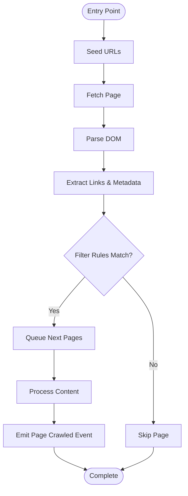

# Browser Automation & Inspection

<cite>
**Referenced Files in This Document**
- [browser.mdx](file://docs/website/content/docs/ai-and-automation/browser.mdx)
- [index.tsx](file://src/pages/browser/index.tsx)
- [types.ts](file://src/pages/browser/types.ts)
- [constants.ts](file://src/pages/browser/constants.ts)
- [browser-panel-api.ts](file://src/lib/browser-panel-api.ts)
- [use-browser-session-events.ts](file://src/layout/hooks/use-browser-session-events.ts)
- [open-browser.tsx](file://src/layout/open-browser.tsx)
- [browser-automation.ts](file://src/stores/browser-automation.ts)
- [browser-session-store.ts](file://src/stores/browser-session-store.ts)
- [mod.rs](file://src-tauri/src/browser/mod.rs)
- [crawl_runner.rs](file://src-tauri/src/browser/crawl_runner.rs)
- [crawl_helpers.rs](file://src-tauri/src/browser/crawl_helpers.rs)
- [crawl_types.rs](file://src-tauri/src/browser/crawl_types.rs)
- [browser.rs](file://src-tauri/src/commands/browser.rs)
- [automation/mod.rs](file://src-tauri/src/automation/mod.rs)
- [automation/actions.rs](file://src-tauri/src/automation/actions.rs)
- [automation/events.rs](file://src-tauri/src/automation/events.rs)
- [automation/state.rs](file://src-tauri/src/automation/state.rs)
- [automation/page_crawled.rs](file://src-tauri/src/automation/page_crawled.rs)
- [automation/websocket.rs](file://src-tauri/src/automation/websocket.rs)
- [tools/browser.rs](file://src-tauri/src/tools/browser.rs)
- [triggers/index.ts](file://src/triggers/index.ts)
- [triggers/browser/index.ts](file://src/triggers/browser/index.ts)
- [triggers/browser/crawl.ts](file://src/triggers/browser/crawl.ts)
- [triggers/browser/ui.ts](file://src/triggers/browser/ui.ts)
</cite>

## Table of Contents
1. [Introduction](#introduction)
2. [Project Structure](#project-structure)
3. [Core Components](#core-components)
4. [Architecture Overview](#architecture-overview)
5. [Detailed Component Analysis](#detailed-component-analysis)
6. [Dependency Analysis](#dependency-analysis)
7. [Performance Considerations](#performance-considerations)
8. [Troubleshooting Guide](#troubleshooting-guide)
9. [Conclusion](#conclusion)
10. [Appendices](#appendices)

## Introduction
This document explains Apprecon’s Browser Automation and Inspection feature, focusing on how the integrated browser enables automated web interactions, page crawling, and detailed inspection of client-side behavior. It covers the browser automation APIs, element selection strategies, event simulation capabilities, and inspection tools such as DOM analysis, network monitoring, console output, and accessibility tree examination. Practical examples demonstrate automated testing scenarios, data extraction tasks, and user journey simulation. The guide also outlines integration with other Apprecon features for end-to-end testing and security assessment workflows.

## Project Structure
The Browser Automation and Inspection feature spans both the frontend (React UI and hooks), state management, and the Tauri backend (Rust modules for browser control, crawling, and automation). Key areas include:
- Frontend pages and components for the browser panel and inspector
- Stores for automation state and session management
- Tauri commands and modules that orchestrate browser instances, crawling, and automation execution
- Triggers and events to connect automation actions with UI and other features

**Diagram sources**
- [index.tsx](file://src/pages/browser/index.tsx)
- [types.ts](file://src/pages/browser/types.ts)
- [constants.ts](file://src/pages/browser/constants.ts)
- [browser-panel-api.ts](file://src/lib/browser-panel-api.ts)
- [use-browser-session-events.ts](file://src/layout/hooks/use-browser-session-events.ts)
- [browser-automation.ts](file://src/stores/browser-automation.ts)
- [browser-session-store.ts](file://src/stores/browser-session-store.ts)
- [mod.rs](file://src-tauri/src/browser/mod.rs)
- [crawl_runner.rs](file://src-tauri/src/browser/crawl_runner.rs)
- [crawl_helpers.rs](file://src-tauri/src/browser/crawl_helpers.rs)
- [crawl_types.rs](file://src-tauri/src/browser/crawl_types.rs)
- [browser.rs](file://src-tauri/src/commands/browser.rs)
- [automation/mod.rs](file://src-tauri/src/automation/mod.rs)
- [automation/actions.rs](file://src-tauri/src/automation/actions.rs)
- [automation/events.rs](file://src-tauri/src/automation/events.rs)
- [automation/state.rs](file://src-tauri/src/automation/state.rs)
- [automation/page_crawled.rs](file://src-tauri/src/automation/page_crawled.rs)
- [automation/websocket.rs](file://src-tauri/src/automation/websocket.rs)

**Section sources**
- [browser.mdx](file://docs/website/content/docs/ai-and-automation/browser.mdx)
- [index.tsx](file://src/pages/browser/index.tsx)
- [types.ts](file://src/pages/browser/types.ts)
- [constants.ts](file://src/pages/browser/constants.ts)
- [browser-panel-api.ts](file://src/lib/browser-panel-api.ts)
- [use-browser-session-events.ts](file://src/layout/hooks/use-browser-session-events.ts)
- [browser-automation.ts](file://src/stores/browser-automation.ts)
- [browser-session-store.ts](file://src/stores/browser-session-store.ts)
- [mod.rs](file://src-tauri/src/browser/mod.rs)
- [crawl_runner.rs](file://src-tauri/src/browser/crawl_runner.rs)
- [crawl_helpers.rs](file://src-tauri/src/browser/crawl_helpers.rs)
- [crawl_types.rs](file://src-tauri/src/browser/crawl_types.rs)
- [browser.rs](file://src-tauri/src/commands/browser.rs)
- [automation/mod.rs](file://src-tauri/src/automation/mod.rs)
- [automation/actions.rs](file://src-tauri/src/automation/actions.rs)
- [automation/events.rs](file://src-tauri/src/automation/events.rs)
- [automation/state.rs](file://src-tauri/src/automation/state.rs)
- [automation/page_crawled.rs](file://src-tauri/src/automation/page_crawled.rs)
- [automation/websocket.rs](file://src-tauri/src/automation/websocket.rs)

## Core Components
- Browser Panel UI: Provides controls to open a new browser instance, navigate, interact with elements, and capture results.
- Automation Store: Manages automation sessions, queued actions, and outcomes.
- Session Store: Tracks active browser sessions, lifecycle events, and runtime state.
- Tauri Commands: Expose browser operations to the frontend via secure IPC.
- Crawler Engine: Orchestrates page discovery, navigation, and data extraction during crawls.
- Automation Core: Executes action sequences, handles conditions, and emits events.
- WebSocket Bridge: Streams automation events and crawl progress back to the UI.

Key responsibilities:
- Element selection strategies: CSS selectors, XPath, role-based queries, and text matching.
- Event simulation: Clicks, key presses, form submissions, and custom events.
- Inspection tools: DOM snapshotting, network request logging, console log aggregation, and accessibility tree traversal.
- Integration points: Connects with HTTP history, intercept, invoker, and regression modules for end-to-end testing and security assessments.

**Section sources**
- [index.tsx](file://src/pages/browser/index.tsx)
- [browser-automation.ts](file://src/stores/browser-automation.ts)
- [browser-session-store.ts](file://src/stores/browser-session-store.ts)
- [browser.rs](file://src-tauri/src/commands/browser.rs)
- [crawl_runner.rs](file://src-tauri/src/browser/crawl_runner.rs)
- [automation/mod.rs](file://src-tauri/src/automation/mod.rs)
- [automation/websocket.rs](file://src-tauri/src/automation/websocket.rs)

## Architecture Overview
The system follows a layered architecture:
- Frontend layer: React UI and stores communicate through a panel API bridge.
- IPC layer: Tauri commands expose backend functionality securely.
- Backend layer: Browser module orchestrates crawling and automation; automation core executes actions and emits events; crawler helpers assist with DOM and network introspection.

**Diagram sources**
- [browser-panel-api.ts](file://src/lib/browser-panel-api.ts)
- [browser.rs](file://src-tauri/src/commands/browser.rs)
- [mod.rs](file://src-tauri/src/browser/mod.rs)
- [crawl_runner.rs](file://src-tauri/src/browser/crawl_runner.rs)
- [automation/mod.rs](file://src-tauri/src/automation/mod.rs)
- [automation/websocket.rs](file://src-tauri/src/automation/websocket.rs)

## Detailed Component Analysis

### Browser Panel and Session Management
The browser panel coordinates user actions and displays live feedback. It uses hooks to subscribe to session events and stores to manage automation state.

**Diagram sources**
- [index.tsx](file://src/pages/browser/index.tsx)
- [browser-automation.ts](file://src/stores/browser-automation.ts)
- [browser-session-store.ts](file://src/stores/browser-session-store.ts)

**Section sources**
- [index.tsx](file://src/pages/browser/index.tsx)
- [types.ts](file://src/pages/browser/types.ts)
- [constants.ts](file://src/pages/browser/constants.ts)
- [browser-automation.ts](file://src/stores/browser-automation.ts)
- [browser-session-store.ts](file://src/stores/browser-session-store.ts)
- [use-browser-session-events.ts](file://src/layout/hooks/use-browser-session-events.ts)

### Tauri Commands and Browser Module
Commands provide the IPC boundary between the UI and backend. The browser module encapsulates browser lifecycle, crawling, and tool integrations.

**Diagram sources**
- [browser.rs](file://src-tauri/src/commands/browser.rs)
- [mod.rs](file://src-tauri/src/browser/mod.rs)
- [crawl_runner.rs](file://src-tauri/src/browser/crawl_runner.rs)
- [tools/browser.rs](file://src-tauri/src/tools/browser.rs)

**Section sources**
- [browser.rs](file://src-tauri/src/commands/browser.rs)
- [mod.rs](file://src-tauri/src/browser/mod.rs)
- [tools/browser.rs](file://src-tauri/src/tools/browser.rs)

### Crawler Engine
The crawler engine drives page discovery and extraction. It uses helpers for DOM parsing, link resolution, and filtering.

**Diagram sources**
- [crawl_runner.rs](file://src-tauri/src/browser/crawl_runner.rs)
- [crawl_helpers.rs](file://src-tauri/src/browser/crawl_helpers.rs)
- [crawl_types.rs](file://src-tauri/src/browser/crawl_types.rs)
- [automation/page_crawled.rs](file://src-tauri/src/automation/page_crawled.rs)

**Section sources**
- [crawl_runner.rs](file://src-tauri/src/browser/crawl_runner.rs)
- [crawl_helpers.rs](file://src-tauri/src/browser/crawl_helpers.rs)
- [crawl_types.rs](file://src/t