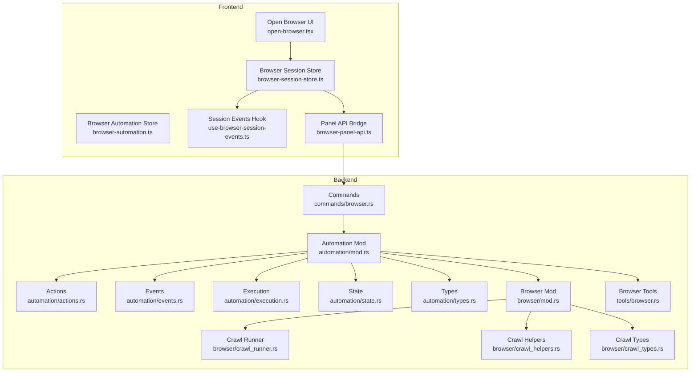
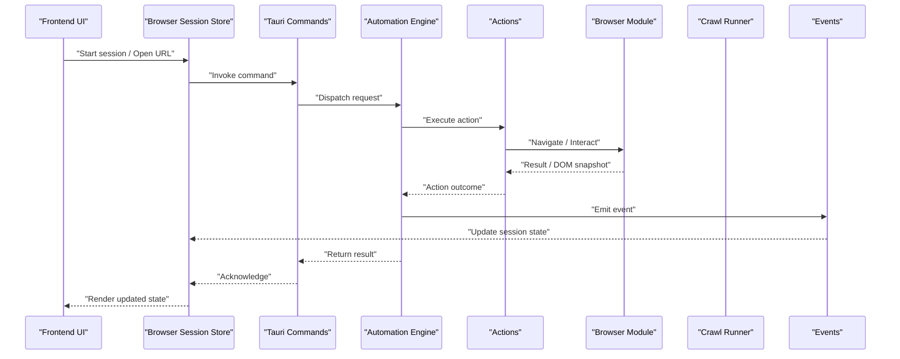
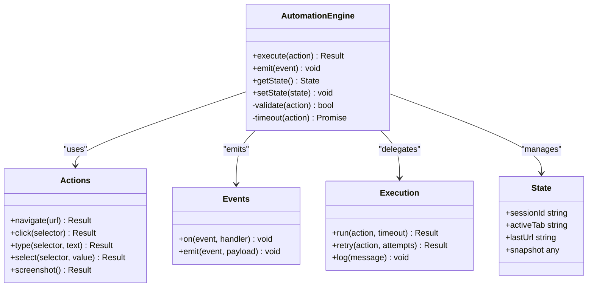
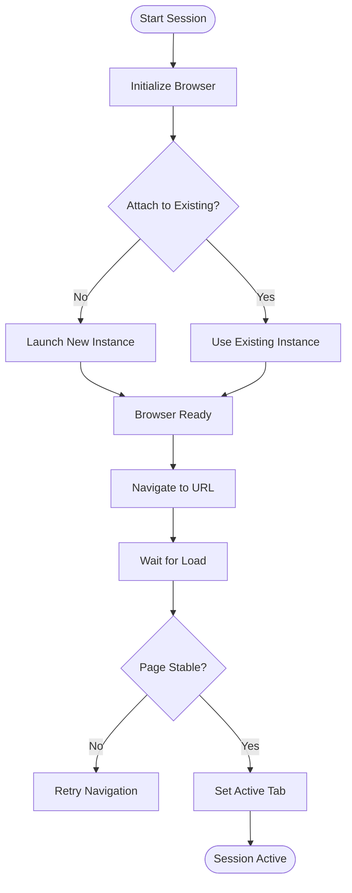
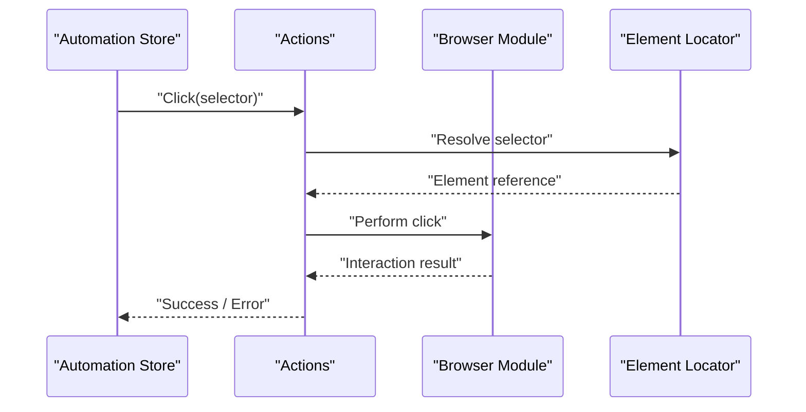
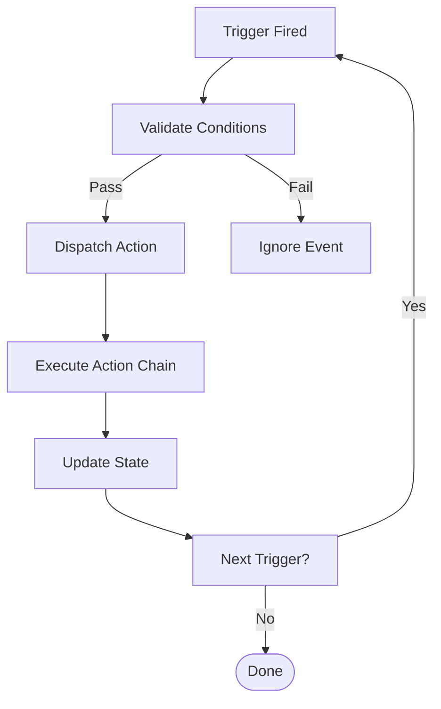
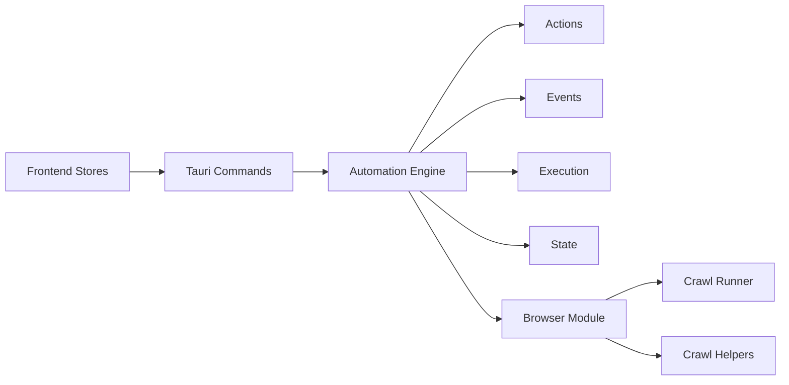

# Browser Automation Core

<cite>
**Referenced Files in This Document**
- [browser-session-store.ts](file://src/stores/browser-session-store.ts)
- [browser-automation.ts](file://src/stores/browser-automation.ts)
- [index.ts](file://src/triggers/index.ts)
- [index.ts](file://src/triggers/browser/index.ts)
- [crawl.ts](file://src/triggers/browser/crawl.ts)
- [page-crawled.ts](file://src/triggers/browser/page-crawled.ts)
- [ui.ts](file://src/triggers/browser/ui.ts)
- [ai-tool.ts](file://src/triggers/browser/ai-tool.ts)
- [mod.rs](file://src-tauri/src/automation/mod.rs)
- [actions.rs](file://src-tauri/src/automation/actions.rs)
- [events.rs](file://src-tauri/src/automation/events.rs)
- [execution.rs](file://src-tauri/src/automation/execution.rs)
- [state.rs](file://src-tauri/src/automation/state.rs)
- [types.rs](file://src-tauri/src/automation/types.rs)
- [mod.rs](file://src-tauri/src/browser/mod.rs)
- [crawl_runner.rs](file://src-tauri/src/browser/crawl_runner.rs)
- [crawl_helpers.rs](file://src-tauri/src/browser/crawl_helpers.rs)
- [crawl_types.rs](file://src-tauri/src/browser/crawl_types.rs)
- [browser.ts](file://src-tauri/src/tools/browser.rs)
- [commands/browser.rs](file://src-tauri/src/commands/browser.rs)
- [use-browser-session-events.ts](file://src/layout/hooks/use-browser-session-events.ts)
- [open-browser.tsx](file://src/layout/open-browser.tsx)
- [browser-panel-api.ts](file://src/lib/browser-panel-api.ts)
</cite>

## Table of Contents
1. [Introduction](#introduction)
2. [Project Structure](#project-structure)
3. [Core Components](#core-components)
4. [Architecture Overview](#architecture-overview)
5. [Detailed Component Analysis](#detailed-component-analysis)
6. [Dependency Analysis](#dependency-analysis)
7. [Performance Considerations](#performance-considerations)
8. [Troubleshooting Guide](#troubleshooting-guide)
9. [Conclusion](#conclusion)

## Introduction
This document explains the Browser Automation Core functionality, focusing on session management, automation engine architecture, and programmatic APIs for controlling a browser instance. It covers the browser lifecycle, page navigation, element interaction patterns, and the event-driven automation triggers system. Practical examples illustrate common tasks such as loading pages, filling forms, and clicking buttons. Error handling, timeout strategies, and debugging capabilities are also addressed to help you build robust automated workflows.

## Project Structure
The Browser Automation Core spans both frontend (TypeScript/React) and backend (Rust/Tauri) layers:
- Frontend stores and hooks manage session state and expose UI interactions.
- Backend modules implement the automation engine, actions, events, execution pipeline, and browser crawling utilities.
- Commands bridge Tauri IPC between frontend and backend.
- Triggers define an event-driven system that reacts to browser and application events.

**Diagram sources**
- [browser-session-store.ts](file://src/stores/browser-session-store.ts)
- [browser-automation.ts](file://src/stores/browser-automation.ts)
- [use-browser-session-events.ts](file://src/layout/hooks/use-browser-session-events.ts)
- [open-browser.tsx](file://src/layout/open-browser.tsx)
- [browser-panel-api.ts](file://src/lib/browser-panel-api.ts)
- [mod.rs](file://src-tauri/src/automation/mod.rs)
- [actions.rs](file://src-tauri/src/automation/actions.rs)
- [events.rs](file://src-tauri/src/automation/events.rs)
- [execution.rs](file://src-tauri/src/automation/execution.rs)
- [state.rs](file://src-tauri/src/automation/state.rs)
- [types.rs](file://src-tauri/src/automation/types.rs)
- [mod.rs](file://src-tauri/src/browser/mod.rs)
- [crawl_runner.rs](file://src-tauri/src/browser/crawl_runner.rs)
- [crawl_helpers.rs](file://src-tauri/src/browser/crawl_helpers.rs)
- [crawl_types.rs](file://src-tauri/src/browser/crawl_types.rs)
- [browser.rs](file://src-tauri/src/tools/browser.rs)
- [commands/browser.rs](file://src-tauri/src/commands/browser.rs)

**Section sources**
- [browser-session-store.ts](file://src/stores/browser-session-store.ts)
- [browser-automation.ts](file://src/stores/browser-automation.ts)
- [mod.rs](file://src-tauri/src/automation/mod.rs)
- [commands/browser.rs](file://src-tauri/src/commands/browser.rs)

## Core Components
- Browser Session Store: Centralizes session lifecycle, active tab tracking, and event subscriptions.
- Browser Automation Store: Encapsulates high-level automation operations and orchestrates actions.
- Automation Engine (Rust): Implements action execution, event emission, state transitions, and integration with browser tools.
- Browser Module (Rust): Provides crawling runner and helpers for navigating and extracting data from pages.
- Commands Layer: Exposes Tauri commands for frontend calls to backend automation features.
- Triggers System: Event-driven hooks that react to browser and app events to trigger automation flows.

Key responsibilities:
- Session management: create, attach, navigate, detach, and close sessions.
- Page navigation: open URLs, handle redirects, wait for load states.
- Element interaction: locate elements, type text, click buttons, select options.
- Event-driven automation: subscribe to triggers and execute actions based on conditions.
- Error handling and timeouts: propagate errors, enforce timeouts, and provide diagnostics.

**Section sources**
- [browser-session-store.ts](file://src/stores/browser-session-store.ts)
- [browser-automation.ts](file://src/stores/browser-automation.ts)
- [mod.rs](file://src-tauri/src/automation/mod.rs)
- [actions.rs](file://src-tauri/src/automation/actions.rs)
- [events.rs](file://src-tauri/src/automation/events.rs)
- [execution.rs](file://src-tauri/src/automation/execution.rs)
- [state.rs](file://src-tauri/src/automation/state.rs)
- [types.rs](file://src-tauri/src/automation/types.rs)
- [mod.rs](file://src-tauri/src/browser/mod.rs)
- [crawl_runner.rs](file://src-tauri/src/browser/crawl_runner.rs)
- [crawl_helpers.rs](file://src-tauri/src/browser/crawl_helpers.rs)
- [crawl_types.rs](file://src-tauri/src/browser/crawl_types.rs)
- [browser.rs](file://src-tauri/src/tools/browser.rs)
- [commands/browser.rs](file://src-tauri/src/commands/browser.rs)

## Architecture Overview
The automation flow starts from the frontend store or UI, invokes Tauri commands, which delegate to the Rust automation engine. The engine coordinates actions, emits events, updates state, and interacts with the browser module for navigation and crawling. Triggers listen to these events and can initiate further automation steps.

**Diagram sources**
- [browser-session-store.ts](file://src/stores/browser-session-store.ts)
- [commands/browser.rs](file://src-tauri/src/commands/browser.rs)
- [mod.rs](file://src-tauri/src/automation/mod.rs)
- [actions.rs](file://src-tauri/src/automation/actions.rs)
- [mod.rs](file://src-tauri/src/browser/mod.rs)
- [crawl_runner.rs](file://src-tauri/src/browser/crawl_runner.rs)
- [events.rs](file://src-tauri/src/automation/events.rs)

## Detailed Component Analysis

### Browser Session Management
Responsibilities:
- Create and manage multiple browser sessions.
- Track active tabs and current page context.
- Subscribe to session lifecycle events (created, navigated, closed).
- Provide methods to open URLs, refresh, go back/forward, and capture snapshots.

Implementation highlights:
- Session store maintains state and exposes reactive methods for UI and automation.
- Hooks centralize event subscription and propagation to components.
- Panel API bridges frontend calls to backend commands.

Practical usage patterns:
- Initialize a session and set it as active.
- Navigate to a URL and wait for load completion.
- Capture page state for inspection or automation decisions.

**Section sources**
- [browser-session-store.ts](file://src/stores/browser-session-store.ts)
- [use-browser-session-events.ts](file://src/layout/hooks/use-browser-session-events.ts)
- [browser-panel-api.ts](file://src/lib/browser-panel-api.ts)
- [open-browser.tsx](file://src/layout/open-browser.tsx)

### Automation Engine Architecture
Responsibilities:
- Orchestrate actions and ensure correct sequencing.
- Emit standardized events for cross-module communication.
- Manage execution context, timeouts, and error propagation.
- Maintain automation state across actions and triggers.

Key modules:
- Actions: Define atomic operations like navigate, click, type, select, screenshot.
- Events: Define event schema and emission points.
- Execution: Run actions with retries, timeouts, and logging.
- State: Persist and sync automation state.
- Types: Shared interfaces for actions, events, and results.

**Diagram sources**
- [mod.rs](file://src-tauri/src/automation/mod.rs)
- [actions.rs](file://src-tauri/src/automation/actions.rs)
- [events.rs](file://src-tauri/src/automation/events.rs)
- [execution.rs](file://src-tauri/src/automation/execution.rs)
- [state.rs](file://src-tauri/src/automation/state.rs)
- [types.rs](file://src-tauri/src/automation/types.rs)

**Section sources**
- [mod.rs](file://src-tauri/src/automation/mod.rs)
- [actions.rs](file://src-tauri/src/automation/actions.rs)
- [events.rs](file://src-tauri/src/automation/events.rs)
- [execution.rs](file://src-tauri/src/automation/execution.rs)
- [state.rs](file://src-tauri/src/automation/state.rs)
- [types.rs](file://src-tauri/src/automation/types.rs)

### Browser Lifecycle and Navigation
Responsibilities:
- Start browser process, attach to existing instances, and gracefully close sessions.
- Handle page lifecycle: beforeunload, load, domcontentloaded, network idle.
- Manage navigation history and redirects.

Implementation highlights:
- Browser module encapsulates low-level browser control.
- Crawl runner orchestrates multi-page workflows and waits for stability.
- Helpers provide utilities for selectors, waiting, and extraction.

**Diagram sources**
- [mod.rs](file://src-tauri/src/browser/mod.rs)
- [crawl_runner.rs](file://src-tauri/src/browser/crawl_runner.rs)
- [crawl_helpers.rs](file://src-tauri/src/browser/crawl_helpers.rs)
- [crawl_types.rs](file://src-tauri/src/browser/crawl_types.rs)

**Section sources**
- [mod.rs](file://src-tauri/src/browser/mod.rs)
- [crawl_runner.rs](file://src-tauri/src/browser/crawl_runner.rs)
- [crawl_helpers.rs](file://src-tauri/src/browser/crawl_helpers.rs)
- [crawl_types.rs](file://src-tauri/src/browser/crawl_types.rs)

### Element Interaction Patterns
Responsibilities:
- Locate elements via selectors (CSS, XPath).
- Perform interactions: click, type, select, hover, drag-and-drop.
- Handle dynamic content by waiting for visibility, enabled state, and network idle.

Patterns:
- Selector resolution with fallback strategies.
- Explicit waits for element readiness.
- Action chaining with error recovery.

**Diagram sources**
- [actions.rs](file://src-tauri/src/automation/actions.rs)
- [browser.rs](file://src-tauri/src/tools/browser.rs)

**Section sources**
- [actions.rs](file://src-tauri/src/automation/actions.rs)
- [browser.rs](file://src-tauri/src/tools/browser.rs)

### Automation Triggers System
Responsibilities:
- Define event types and handlers for browser and application events.
- Enable declarative automation rules that react to triggers.
- Support conditional execution and chaining of actions.

Key files:
- Index and browser-specific triggers (crawl, page-crawled, ui, ai-tool).
- Integration with automation engine to dispatch actions.

**Diagram sources**
- [index.ts](file://src/triggers/index.ts)
- [index.ts](file://src/triggers/browser/index.ts)
- [crawl.ts](file://src/triggers/browser/crawl.ts)
- [page-crawled.ts](file://src/triggers/browser/page-crawled.ts)
- [ui.ts](file://src/triggers/browser/ui.ts)
- [ai-tool.ts](file://src/triggers/browser/ai-tool.ts)

**Section sources**
- [index.ts](file://src/triggers/index.ts)
- [index.ts](file://src/triggers/browser/index.ts)
- [crawl.ts](file://src/triggers/browser/crawl.ts)
- [page-crawled.ts](file://src/triggers/browser/page-crawled.ts)
- [ui.ts](file://src/triggers/browser/ui.ts)
- [ai-tool.ts](file://src/triggers/browser/ai-tool.ts)

### Practical Examples
Common automation tasks:
- Page loading: Open a URL, wait for load, verify title or content.
- Form filling: Locate input fields, type values, submit form.
- Button clicking: Click primary actions, handle confirmations.

Usage pattern overview:
- Use the automation store to call high-level methods.
- Under the hood, actions are executed with explicit waits and error handling.
- Triggers can automate repetitive sequences based on events.

[No sources needed since this section provides general guidance]

## Dependency Analysis
The automation system has clear layering:
- Frontend stores depend on Tauri commands.
- Commands depend on the automation engine.
- Engine depends on actions, events, execution, state, and browser module.
- Browser module depends on crawl runner and helpers.

**Diagram sources**
- [browser-session-store.ts](file://src/stores/browser-session-store.ts)
- [commands/browser.rs](file://src-tauri/src/commands/browser.rs)
- [mod.rs](file://src-tauri/src/automation/mod.rs)
- [actions.rs](file://src-tauri/src/automation/actions.rs)
- [events.rs](file://src-tauri/src/automation/events.rs)
- [execution.rs](file://src-tauri/src/automation/execution.rs)
- [state.rs](file://src-tauri/src/automation/state.rs)
- [mod.rs](file://src-tauri/src/browser/mod.rs)
- [crawl_runner.rs](file://src-tauri/src/browser/crawl_runner.rs)
- [crawl_helpers.rs](file://src-tauri/src/browser/crawl_helpers.rs)

**Section sources**
- [browser-session-store.ts](file://src/stores/browser-session-store.ts)
- [commands/browser.rs](file://src-tauri/src/commands/browser.rs)
- [mod.rs](file://src-tauri/src/automation/mod.rs)
- [mod.rs](file://src-tauri/src/browser/mod.rs)

## Performance Considerations
- Prefer explicit waits over polling to reduce overhead.
- Batch element interactions when possible to minimize round-trips.
- Reuse selectors and caches where appropriate.
- Monitor memory usage during long-running crawls; release resources promptly.
- Use concurrency carefully; avoid overwhelming the browser or network.

[No sources needed since this section provides general guidance]

## Troubleshooting Guide
Common issues and resolutions:
- Timeout errors: Increase wait times, check network stability, and validate selectors.
- Element not found: Verify selector specificity, ensure page is fully loaded, and handle dynamic content.
- Session crashes: Restart the browser instance, clear temporary state, and inspect logs.
- Debugging: Enable detailed logs, capture screenshots at failure points, and log navigation steps.

Error handling strategies:
- Centralized error propagation through actions and execution.
- Consistent event emission for failures to trigger recovery flows.
- State rollback on critical errors to maintain consistency.

**Section sources**
- [execution.rs](file://src-tauri/src/automation/execution.rs)
- [events.rs](file://src-tauri/src/automation/events.rs)
- [state.rs](file://src-tauri/src/automation/state.rs)

## Conclusion
The Browser Automation Core provides a robust foundation for programmatic browser control. Its layered architecture separates concerns between frontend state management, backend orchestration, and browser interaction. The event-driven triggers system enables flexible automation workflows. By following best practices for waits, selectors, and error handling, you can build reliable and efficient automation scripts for web testing, scraping, and interactive workflows.

[No sources needed since this section summarizes without analyzing specific files]