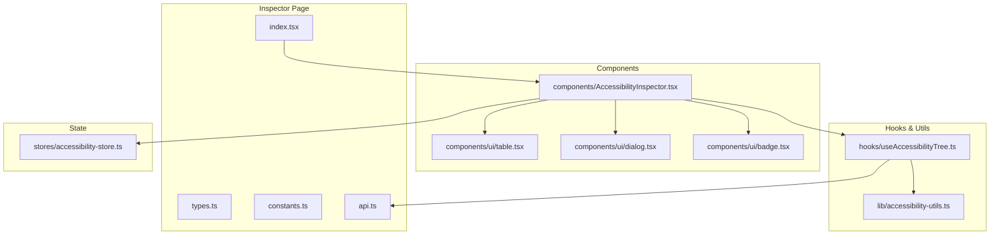
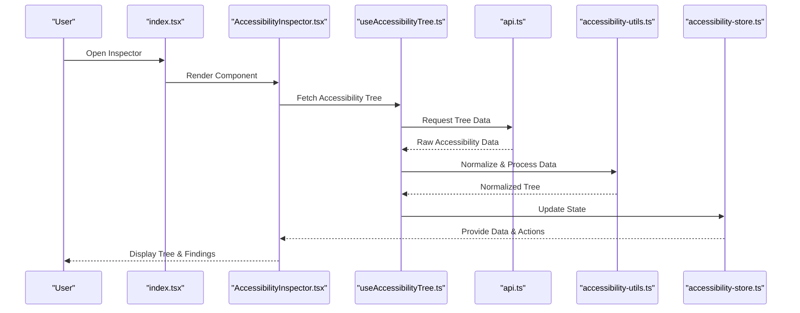
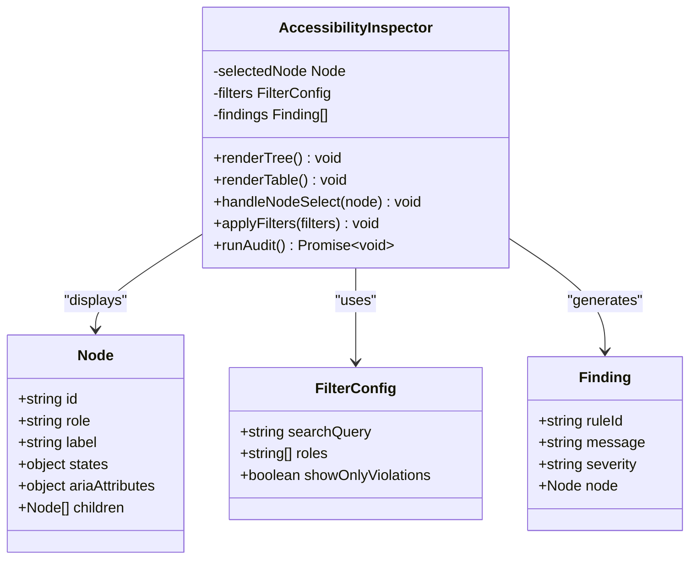
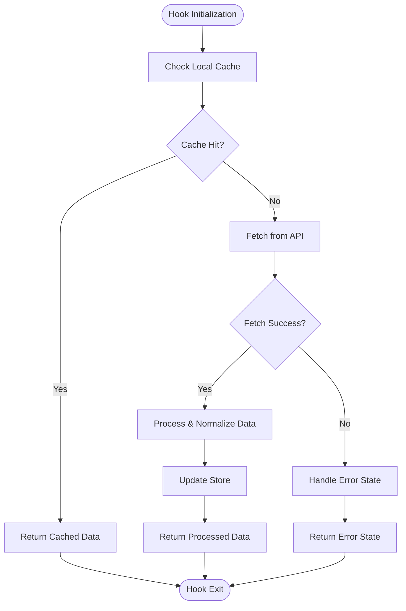
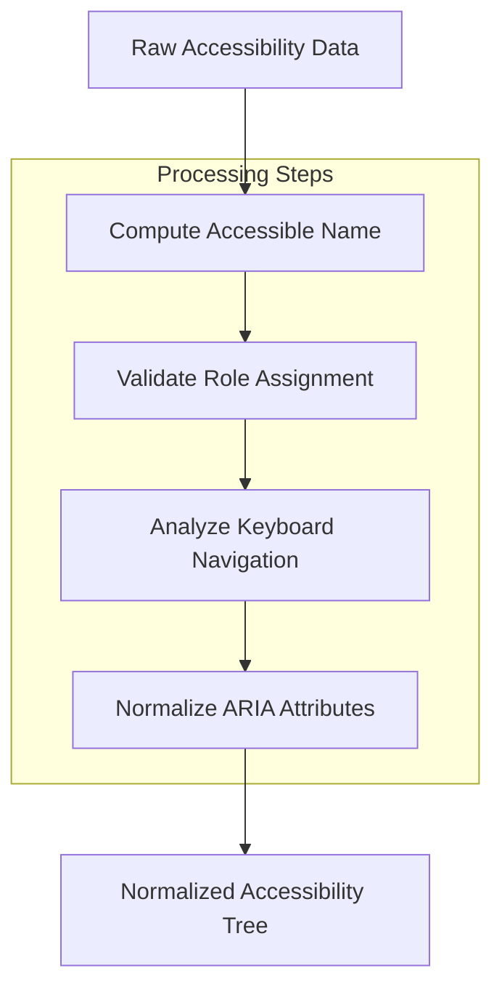
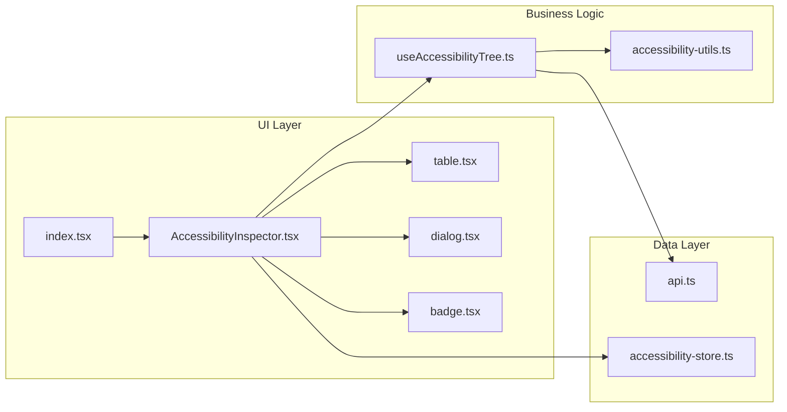

# Accessibility Tree Inspector

<cite>
**Referenced Files in This Document**
- [index.tsx](file://src/pages/inspector/index.tsx)
- [types.ts](file://src/pages/inspector/types.ts)
- [api.ts](file://src/pages/inspector/api.ts)
- [constants.ts](file://src/pages/inspector/constants.ts)
- [components/AccessibilityInspector.tsx](file://src/pages/inspector/components/AccessibilityInspector.tsx)
- [hooks/useAccessibilityTree.ts](file://src/pages/inspector/hooks/useAccessibilityTree.ts)
- [lib/accessibility-utils.ts](file://src/pages/inspector/lib/accessibility-utils.ts)
- [stores/accessibility-store.ts](file://src/stores/accessibility-store.ts)
- [components/ui/table.tsx](file://src/components/ui/table.tsx)
- [components/ui/dialog.tsx](file://src/components/ui/dialog.tsx)
- [components/ui/badge.tsx](file://src/components/ui/badge.tsx)
</cite>

## Table of Contents
1. [Introduction](#introduction)
2. [Project Structure](#project-structure)
3. [Core Components](#core-components)
4. [Architecture Overview](#architecture-overview)
5. [Detailed Component Analysis](#detailed-component-analysis)
6. [Dependency Analysis](#dependency-analysis)
7. [Performance Considerations](#performance-considerations)
8. [Troubleshooting Guide](#troubleshooting-guide)
9. [Conclusion](#conclusion)

## Introduction
The Accessibility Tree Inspector is a dedicated tool for inspecting and validating the accessibility tree exposed by web pages. It helps developers examine roles, labels, states, and ARIA attributes to ensure WCAG compliance. The inspector provides both automated checks and manual validation workflows, enabling teams to identify and fix issues such as missing keyboard focus management, incorrect role assignments, and improper semantic markup.

Key capabilities include:
- WCAG compliance testing with rule-based checks
- Screen reader simulation insights via computed accessibility properties
- Automated accessibility auditing with actionable findings
- Manual inspection of the accessibility hierarchy, roles, and ARIA attributes
- Integration points for external accessibility testing frameworks and reporting

## Project Structure
The Accessibility Tree Inspector is implemented as a page within the application’s inspector module. It consists of UI components, hooks for data fetching and state management, utility functions for processing accessibility data, and API integration for communicating with browser automation or runtime services.

**Diagram sources**
- [index.tsx:1-50](file://src/pages/inspector/index.tsx#L1-L50)
- [components/AccessibilityInspector.tsx:1-120](file://src/pages/inspector/components/AccessibilityInspector.tsx#L1-L120)
- [hooks/useAccessibilityTree.ts:1-80](file://src/pages/inspector/hooks/useAccessibilityTree.ts#L1-L80)
- [lib/accessibility-utils.ts:1-60](file://src/pages/inspector/lib/accessibility-utils.ts#L1-L60)
- [stores/accessibility-store.ts:1-40](file://src/stores/accessibility-store.ts#L1-L40)

**Section sources**
- [index.tsx:1-50](file://src/pages/inspector/index.tsx#L1-L50)
- [types.ts:1-40](file://src/pages/inspector/types.ts#L1-L40)
- [constants.ts:1-30](file://src/pages/inspector/constants.ts#L1-L30)

## Core Components
- AccessibilityInspector: Main UI component that renders the accessibility tree, filters, and audit results. It integrates table views for structured data and dialogs for detailed node inspection.
- useAccessibilityTree: Hook responsible for fetching and managing the accessibility tree data from the backend or injected scripts. It handles caching, updates, and error states.
- accessibility-utils: Utility functions for computing accessible names, roles, states, and ARIA attribute normalization. Includes helpers for keyboard navigation analysis and focus order computation.
- accessibility-store: Centralized state store for accessibility findings, selected nodes, and filter configurations.

Key responsibilities:
- Rendering hierarchical accessibility nodes with expand/collapse behavior
- Displaying roles, labels, states, and ARIA attributes in tabular format
- Running automated WCAG checks and surfacing findings
- Providing manual validation tools for interactive elements

**Section sources**
- [components/AccessibilityInspector.tsx:1-120](file://src/pages/inspector/components/AccessibilityInspector.tsx#L1-L120)
- [hooks/useAccessibilityTree.ts:1-80](file://src/pages/inspector/hooks/useAccessibilityTree.ts#L1-L80)
- [lib/accessibility-utils.ts:1-60](file://src/pages/inspector/lib/accessibility-utils.ts#L1-L60)
- [stores/accessibility-store.ts:1-40](file://src/stores/accessibility-store.ts#L1-L40)

## Architecture Overview
The Accessibility Tree Inspector follows a modular architecture with clear separation between UI, data fetching, utilities, and state management. The flow begins with the inspector page initializing the main component, which uses the hook to fetch accessibility data. Utilities process raw data into a normalized structure, while the store manages user interactions and filter states.

**Diagram sources**
- [index.tsx:1-50](file://src/pages/inspector/index.tsx#L1-L50)
- [components/AccessibilityInspector.tsx:1-120](file://src/pages/inspector/components/AccessibilityInspector.tsx#L1-L120)
- [hooks/useAccessibilityTree.ts:1-80](file://src/pages/inspector/hooks/useAccessibilityTree.ts#L1-L80)
- [lib/accessibility-utils.ts:1-60](file://src/pages/inspector/lib/accessibility-utils.ts#L1-L60)
- [stores/accessibility-store.ts:1-40](file://src/stores/accessibility-store.ts#L1-L40)

## Detailed Component Analysis

### AccessibilityInspector Component
The AccessibilityInspector component serves as the primary interface for examining the accessibility tree. It provides:
- Hierarchical tree view with expandable nodes
- Tabular display of roles, labels, states, and ARIA attributes
- Filter controls for searching and narrowing down nodes
- Audit results panel showing WCAG violations and recommendations
- Detail dialog for inspecting individual nodes

**Diagram sources**
- [components/AccessibilityInspector.tsx:1-120](file://src/pages/inspector/components/AccessibilityInspector.tsx#L1-L120)

**Section sources**
- [components/AccessibilityInspector.tsx:1-120](file://src/pages/inspector/components/AccessibilityInspector.tsx#L1-L120)

### useAccessibilityTree Hook
This hook encapsulates the logic for fetching and managing accessibility tree data. It handles:
- Data fetching from the API layer
- Caching and debouncing requests
- Error handling and retry mechanisms
- State synchronization with the accessibility store

**Diagram sources**
- [hooks/useAccessibilityTree.ts:1-80](file://src/pages/inspector/hooks/useAccessibilityTree.ts#L1-L80)

**Section sources**
- [hooks/useAccessibilityTree.ts:1-80](file://src/pages/inspector/hooks/useAccessibilityTree.ts#L1-L80)

### Accessibility Utilities
The utility functions provide essential processing capabilities for accessibility data:
- Computed accessible name calculation following WAI-ARIA specifications
- Role inference and validation against HTML semantics
- Keyboard navigation analysis including focus order and tab sequence
- ARIA attribute normalization and validation

**Diagram sources**
- [lib/accessibility-utils.ts:1-60](file://src/pages/inspector/lib/accessibility-utils.ts#L1-L60)

**Section sources**
- [lib/accessibility-utils.ts:1-60](file://src/pages/inspector/lib/accessibility-utils.ts#L1-L60)

## Dependency Analysis
The Accessibility Tree Inspector has well-defined dependencies between its components:

**Diagram sources**
- [index.tsx:1-50](file://src/pages/inspector/index.tsx#L1-L50)
- [components/AccessibilityInspector.tsx:1-120](file://src/pages/inspector/components/AccessibilityInspector.tsx#L1-L120)
- [hooks/useAccessibilityTree.ts:1-80](file://src/pages/inspector/hooks/useAccessibilityTree.ts#L1-L80)
- [lib/accessibility-utils.ts:1-60](file://src/pages/inspector/lib/accessibility-utils.ts#L1-L60)
- [stores/accessibility-store.ts:1-40](file://src/stores/accessibility-store.ts#L1-L40)

**Section sources**
- [index.tsx:1-50](file://src/pages/inspector/index.tsx#L1-L50)
- [components/AccessibilityInspector.tsx:1-120](file://src/pages/inspector/components/AccessibilityInspector.tsx#L1-L120)

## Performance Considerations
- **Lazy Loading**: Accessibility tree nodes are loaded on-demand to prevent initial render delays
- **Debounced Search**: Search functionality implements debouncing to reduce unnecessary re-renders
- **Caching Strategy**: Recent accessibility snapshots are cached locally to minimize API calls
- **Virtual Scrolling**: Large trees utilize virtual scrolling for efficient rendering
- **Memoization**: Expensive computations are memoized using React.memo and useMemo hooks

## Troubleshooting Guide
Common issues and their solutions:

### Accessibility Tree Not Loading
- Verify network connectivity and API availability
- Check browser console for JavaScript errors
- Ensure proper permissions for accessing accessibility APIs
- Clear local cache and retry the operation

### Incorrect Role Assignments
- Review HTML semantics and ARIA usage
- Validate custom components implement proper accessibility interfaces
- Check for conflicting role definitions
- Use browser developer tools to compare expected vs actual roles

### Keyboard Navigation Issues
- Inspect tab order and focus management
- Verify event handlers for keyboard interactions
- Check for custom focus traps or modal implementations
- Test with actual screen readers (NVDA, JAWS, VoiceOver)

### ARIA Attribute Problems
- Validate ARIA attribute syntax and values
- Ensure ARIA attributes are used correctly according to specifications
- Check for redundant or conflicting ARIA usage
- Use ARIA validator tools for comprehensive checking

**Section sources**
- [components/AccessibilityInspector.tsx:1-120](file://src/pages/inspector/components/AccessibilityInspector.tsx#L1-L120)
- [lib/accessibility-utils.ts:1-60](file://src/pages/inspector/lib/accessibility-utils.ts#L1-L60)

## Conclusion
The Accessibility Tree Inspector provides a comprehensive solution for examining and validating web accessibility. By combining automated WCAG compliance testing with manual inspection tools, it enables developers to create more inclusive web applications. The modular architecture ensures maintainability and extensibility, while performance optimizations handle large accessibility trees efficiently. Integration with existing development workflows and reporting capabilities makes it a valuable addition to any accessibility testing toolkit.