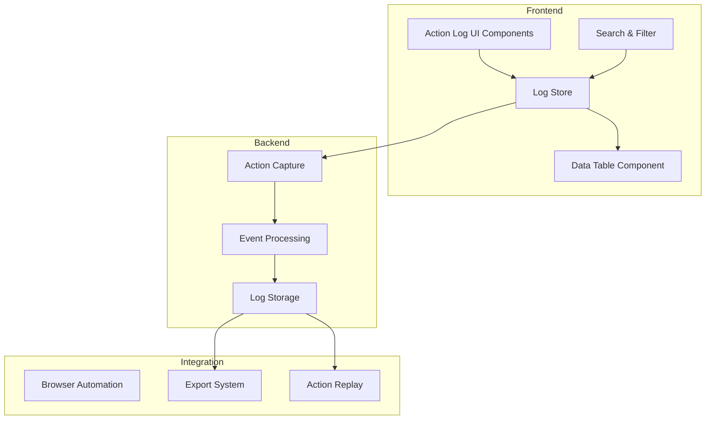
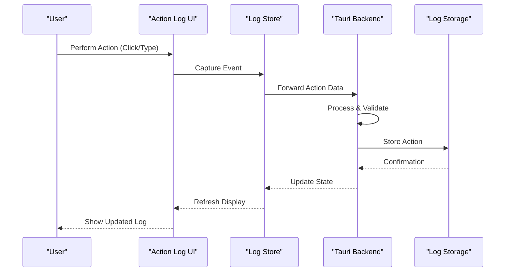
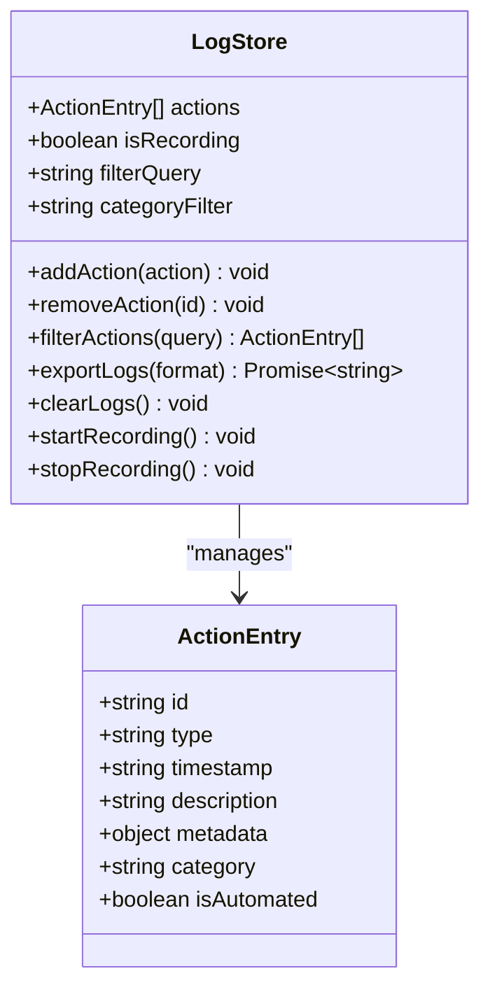
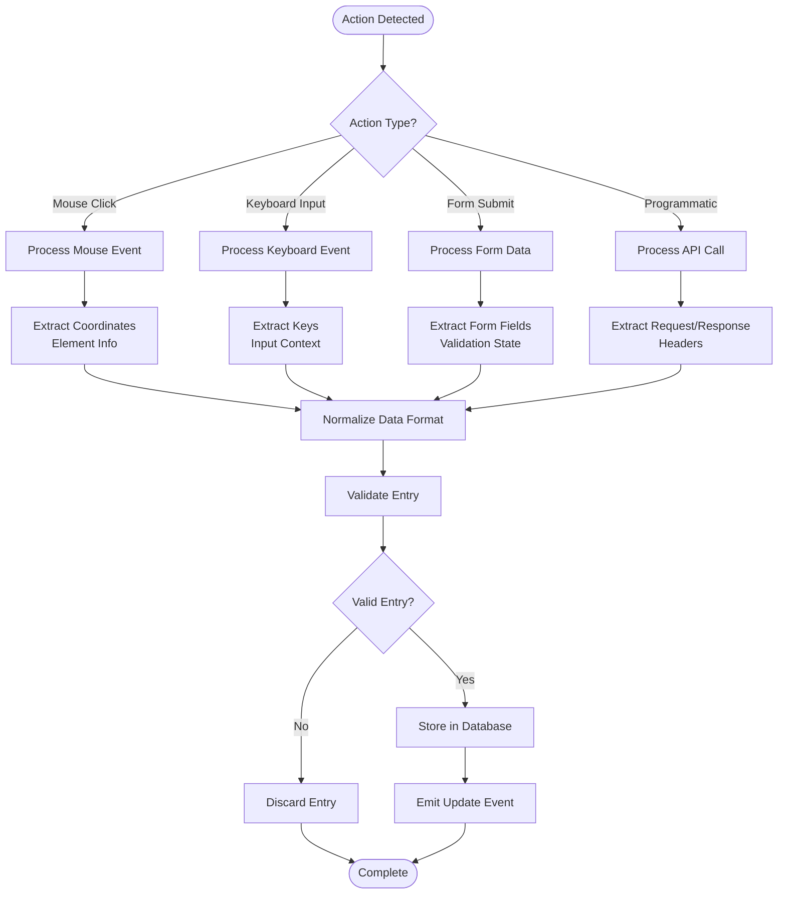
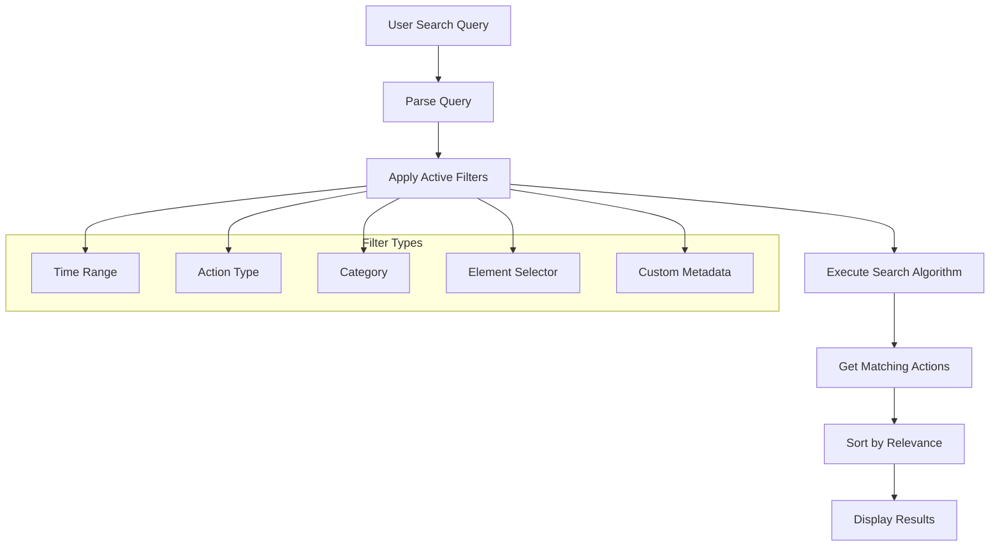
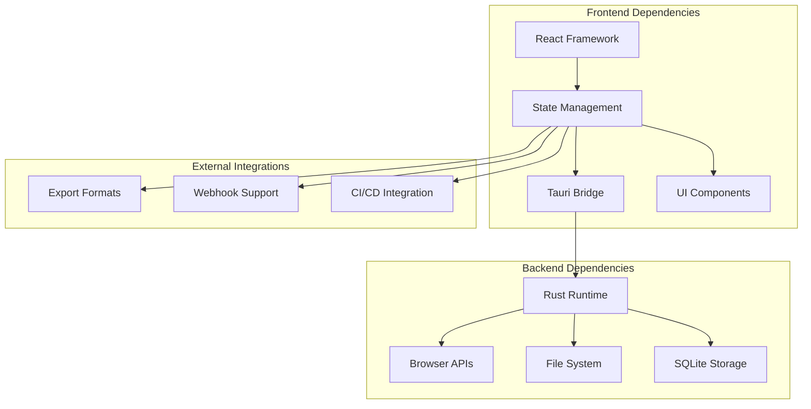

# Action Log Panel

<cite>
**Referenced Files in This Document**
- [src/stores/log.ts](file://src/stores/log.ts)
- [src/pages/browser/index.tsx](file://src/pages/browser/index.tsx)
- [src/components/ui/data-table.tsx](file://src/components/ui/data-table.tsx)
- [src/components/ui/table.tsx](file://src/components/ui/table.tsx)
- [src/components/ui/input.tsx](file://src/components/ui/input.tsx)
- [src/components/ui/button.tsx](file://src/components/ui/button.tsx)
- [src/lib/utils.ts](file://src/lib/utils.ts)
- [src-tauri/src/automation/actions.rs](file://src-tauri/src/automation/actions.rs)
- [src-tauri/src/automation/events.rs](file://src-tauri/src/automation/events.rs)
- [src-tauri/src/commands/mod.rs](file://src-tauri/src/commands/mod.rs)
</cite>

## Table of Contents
1. [Introduction](#introduction)
2. [Project Structure](#project-structure)
3. [Core Components](#core-components)
4. [Architecture Overview](#architecture-overview)
5. [Detailed Component Analysis](#detailed-component-analysis)
6. [Dependency Analysis](#dependency-analysis)
7. [Performance Considerations](#performance-considerations)
8. [Troubleshooting Guide](#troubleshooting-guide)
9. [Conclusion](#conclusion)
10. [Appendices](#appendices)

## Introduction
The Action Log Panel provides a comprehensive system for tracking user interactions, automating event logging, and replaying actions within the application. It captures mouse clicks, keyboard input, form submissions, and programmatic actions to enable debugging, test script generation, and behavior analysis. The panel supports filtering and searching through logged actions, exporting logs for offline analysis, and integrating with automation workflows for seamless testing and validation.

## Project Structure
The Action Log Panel is implemented as a React-based interface with Tauri backend integration. The frontend components handle user interaction and display, while the backend manages action capture and storage.

**Diagram sources**
- [src/stores/log.ts:1-100](file://src/stores/log.ts#L1-L100)
- [src-tauri/src/automation/actions.rs:1-50](file://src-tauri/src/automation/actions.rs#L1-L50)

**Section sources**
- [src/stores/log.ts:1-100](file://src/stores/log.ts#L1-L100)
- [src/pages/browser/index.tsx:1-50](file://src/pages/browser/index.tsx#L1-L50)

## Core Components
The Action Log Panel consists of several key components that work together to provide comprehensive action tracking and management.

### Log Store Management
The central log store manages all action data, providing methods for adding, filtering, and retrieving logged actions. It handles the core state management for the entire logging system.

### User Interface Components
The UI layer includes interactive elements for displaying logs, searching through entries, and managing log operations. These components provide an intuitive interface for users to interact with captured actions.

### Backend Integration
The Tauri backend handles low-level action capture from browser events and system interactions, ensuring reliable logging across different platforms and environments.

**Section sources**
- [src/stores/log.ts:1-150](file://src/stores/log.ts#L1-L150)
- [src/components/ui/data-table.tsx:1-100](file://src/components/ui/data-table.tsx#L1-L100)

## Architecture Overview
The Action Log Panel follows a modular architecture with clear separation between frontend presentation, state management, and backend processing.

**Diagram sources**
- [src/stores/log.ts:50-120](file://src/stores/log.ts#L50-L120)
- [src-tauri/src/automation/actions.rs:20-80](file://src-tauri/src/automation/actions.rs#L20-L80)

## Detailed Component Analysis

### Log Store Implementation
The log store serves as the central state manager for all action logging functionality. It provides comprehensive CRUD operations for action entries and maintains real-time synchronization between frontend and backend.

**Diagram sources**
- [src/stores/log.ts:1-200](file://src/stores/log.ts#L1-L200)

### Action Capture System
The action capture system handles different types of user interactions and converts them into standardized log entries. It supports various input methods and ensures consistent data formatting.

**Diagram sources**
- [src-tauri/src/automation/actions.rs:1-150](file://src-tauri/src/automation/actions.rs#L1-L150)
- [src-tauri/src/automation/events.rs:1-100](file://src-tauri/src/automation/events.rs#L1-L100)

### Search and Filtering System
The search and filtering system enables users to quickly locate specific actions within large datasets. It supports multiple filtering criteria and real-time search capabilities.

**Diagram sources**
- [src/stores/log.ts:100-250](file://src/stores/log.ts#L100-L250)

### Export and Integration System
The export system provides multiple output formats for sharing and analyzing logged actions. It supports integration with external tools and automation workflows.

**Section sources**
- [src/stores/log.ts:1-300](file://src/stores/log.ts#L1-L300)
- [src-tauri/src/automation/actions.rs:1-200](file://src-tauri/src/automation/actions.rs#L1-L200)

## Dependency Analysis
The Action Log Panel has well-defined dependencies between its components, ensuring loose coupling and high cohesion.

**Diagram sources**
- [src/stores/log.ts:1-50](file://src/stores/log.ts#L1-L50)
- [src-tauri/src/commands/mod.rs:1-100](file://src-tauri/src/commands/mod.rs#L1-L100)

**Section sources**
- [src/stores/log.ts:1-100](file://src/stores/log.ts#L1-L100)
- [src-tauri/src/commands/mod.rs:1-100](file://src-tauri/src/commands/mod.rs#L1-L100)

## Performance Considerations
The Action Log Panel implements several performance optimizations to handle large volumes of action data efficiently.

### Memory Management
- Lazy loading of action entries to reduce initial memory footprint
- Efficient data structures for fast search and filtering operations
- Automatic cleanup of old or unused log entries

### Search Optimization
- Indexed search queries for faster result retrieval
- Debounced search input to prevent excessive processing
- Incremental filtering for responsive user experience

### Storage Efficiency
- Compressed storage format for reduced disk usage
- Batch operations for database writes
- Configurable retention policies for automatic cleanup

## Troubleshooting Guide
Common issues and their solutions when working with the Action Log Panel.

### Logging Issues
- **Missing Actions**: Verify browser permissions and proxy settings
- **Slow Performance**: Check system resources and adjust logging verbosity
- **Export Failures**: Ensure sufficient disk space and file permissions

### Search and Filter Problems
- **Empty Results**: Verify filter syntax and active filter combinations
- **Slow Searches**: Optimize query complexity and use specific filters
- **Incorrect Sorting**: Check sort field definitions and data types

### Integration Issues
- **Automation Failures**: Review action sequence and timing constraints
- **Export Format Errors**: Validate output format specifications
- **Webhook Failures**: Check endpoint availability and authentication

**Section sources**
- [src/stores/log.ts:200-350](file://src/stores/log.ts#L200-L350)
- [src-tauri/src/automation/actions.rs:150-250](file://src-tauri/src/automation/actions.rs#L150-L250)

## Conclusion
The Action Log Panel provides a robust and flexible solution for tracking user interactions and automating testing workflows. Its modular architecture, comprehensive feature set, and performance optimizations make it suitable for both development and production environments. The system's extensibility allows for easy integration with existing toolchains and customization for specific use cases.

## Appendices

### Supported Action Types
- **Mouse Events**: Clicks, double-clicks, context menus, hover states
- **Keyboard Input**: Text entry, shortcuts, special keys, composition events
- **Form Interactions**: Input changes, validation, submission, file uploads
- **Navigation**: Page loads, URL changes, history manipulation
- **Programmatic Actions**: API calls, DOM modifications, state updates

### Export Formats
- **JSON**: Structured data for programmatic processing
- **CSV**: Spreadsheet-compatible format for analysis
- **HTML**: Visual report with embedded styling
- **Test Scripts**: Automated test generation in popular frameworks

### Configuration Options
- **Logging Verbosity**: Control detail level of captured actions
- **Retention Policies**: Define automatic cleanup rules
- **Filter Presets**: Save common search configurations
- **Export Templates**: Customize output format and content