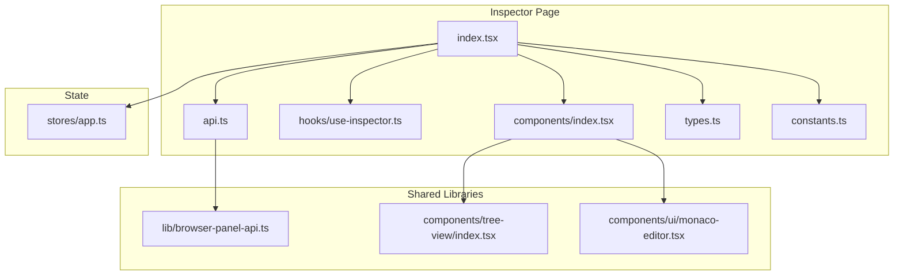
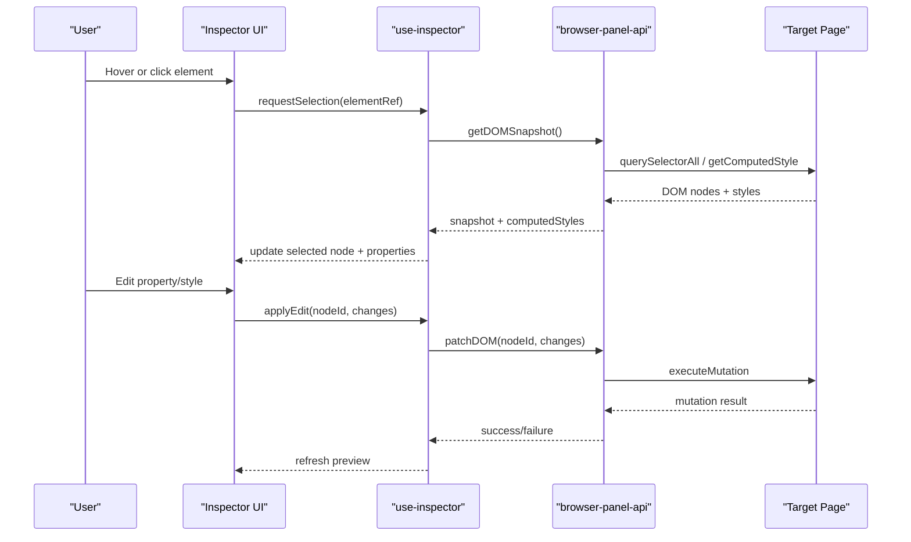
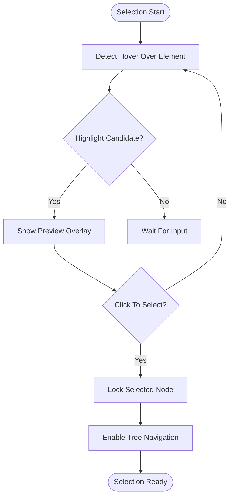
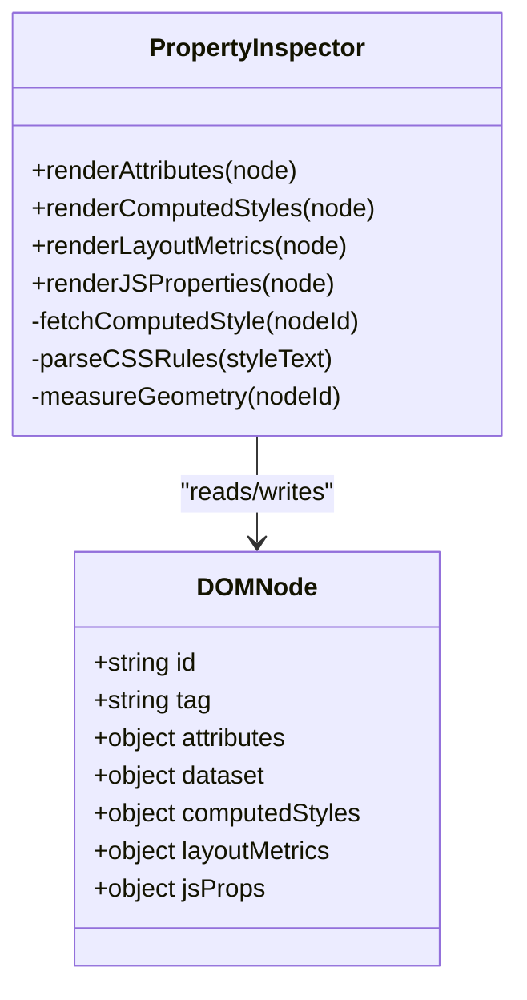
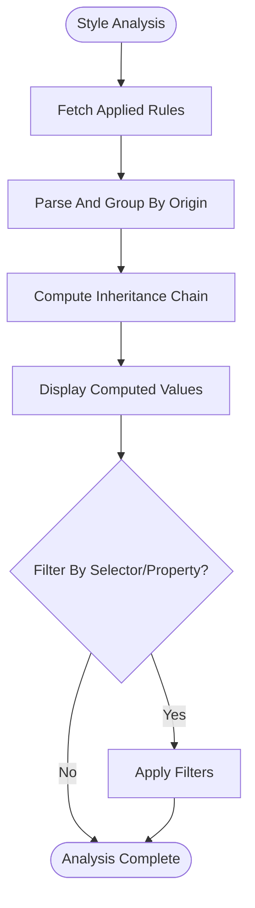
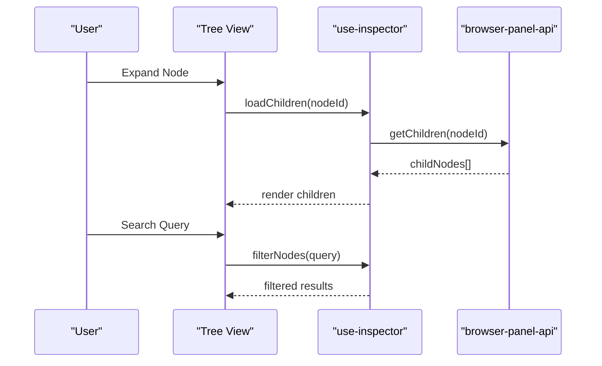
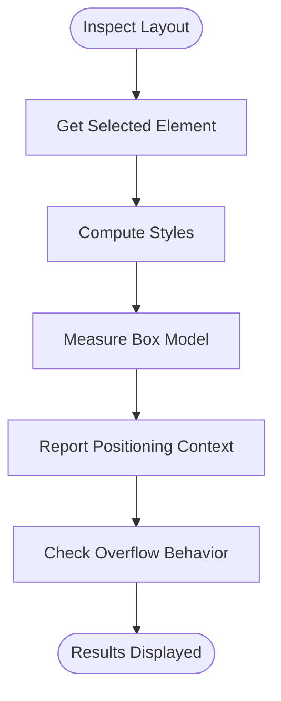
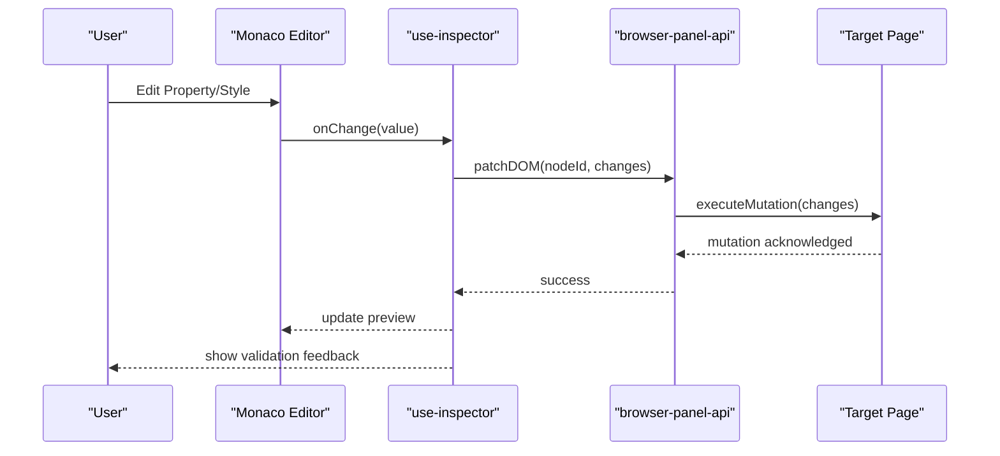
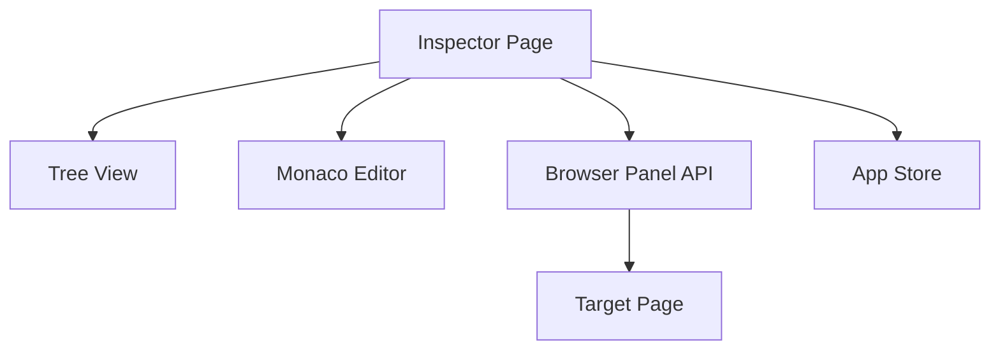

# DOM Inspector

<cite>
**Referenced Files in This Document**
- [index.tsx](file://src/pages/inspector/index.tsx)
- [api.ts](file://src/pages/inspector/api.ts)
- [constants.ts](file://src/pages/inspector/constants.ts)
- [types.ts](file://src/pages/inspector/types.ts)
- [components/index.tsx](file://src/pages/inspector/components/index.tsx)
- [hooks/use-inspector.ts](file://src/pages/inspector/hooks/use-inspector.ts)
- [lib/browser-panel-api.ts](file://src/lib/browser-panel-api.ts)
- [stores/app.ts](file://src/stores/app.ts)
- [components/ui/monaco-editor.tsx](file://src/components/ui/monaco-editor.tsx)
- [components/tree-view/index.tsx](file://src/components/tree-view/index.tsx)
</cite>

## Table of Contents
1. [Introduction](#introduction)
2. [Project Structure](#project-structure)
3. [Core Components](#core-components)
4. [Architecture Overview](#architecture-overview)
5. [Detailed Component Analysis](#detailed-component-analysis)
6. [Dependency Analysis](#dependency-analysis)
7. [Performance Considerations](#performance-considerations)
8. [Troubleshooting Guide](#troubleshooting-guide)
9. [Conclusion](#conclusion)
10. [Appendices](#appendices)

## Introduction
This document provides comprehensive documentation for the DOM Inspector tool within the application. It explains how to select elements, examine properties and styles, navigate the DOM tree, inspect computed styles, analyze layout properties, perform real-time edits with live preview, and integrate with browser developer tools and performance profiling workflows. The guide is structured to be accessible to both new users and experienced developers seeking a deep understanding of the inspector’s capabilities and architecture.

## Project Structure
The DOM Inspector is implemented as a dedicated page module under src/pages/inspector. It includes UI components, hooks, API integration, types, and constants that together provide element selection, property inspection, style analysis, and live editing features. Supporting libraries such as the Monaco editor and tree view are reused from shared component modules.

**Diagram sources**
- [index.tsx](file://src/pages/inspector/index.tsx)
- [components/index.tsx](file://src/pages/inspector/components/index.tsx)
- [hooks/use-inspector.ts](file://src/pages/inspector/hooks/use-inspector.ts)
- [api.ts](file://src/pages/inspector/api.ts)
- [types.ts](file://src/pages/inspector/types.ts)
- [constants.ts](file://src/pages/inspector/constants.ts)
- [lib/browser-panel-api.ts](file://src/lib/browser-panel-api.ts)
- [components/tree-view/index.tsx](file://src/components/tree-view/index.tsx)
- [components/ui/monaco-editor.tsx](file://src/components/ui/monaco-editor.tsx)
- [stores/app.ts](file://src/stores/app.ts)

**Section sources**
- [index.tsx](file://src/pages/inspector/index.tsx)
- [components/index.tsx](file://src/pages/inspector/components/index.tsx)
- [api.ts](file://src/pages/inspector/api.ts)
- [types.ts](file://src/pages/inspector/types.ts)
- [constants.ts](file://src/pages/inspector/constants.ts)
- [lib/browser-panel-api.ts](file://src/lib/browser-panel-api.ts)
- [components/tree-view/index.tsx](file://src/components/tree-view/index.tsx)
- [components/ui/monaco-editor.tsx](file://src/components/ui/monaco-editor.tsx)
- [stores/app.ts](file://src/stores/app.ts)

## Core Components
- Inspector Page: Orchestrates the inspector UI, manages state, and coordinates interactions between selection, inspection, editing, and preview.
- Inspector Components: Provide the visual panels for DOM tree navigation, property inspection, style analysis, and code editing.
- Hooks: Encapsulate logic for element selection, computed style retrieval, live updates, and event handling.
- API Layer: Interfaces with browser panel APIs to fetch DOM snapshots, computed styles, and apply edits.
- Shared Libraries: Reuse tree view for DOM traversal and Monaco editor for syntax-highlighted editing.
- State Store: Centralizes app-level state relevant to inspector operations (e.g., selected element, edit buffers).

Key responsibilities:
- Element selection mechanism via hover/click events and tree navigation.
- Property examination including attributes, dataset, and computed styles.
- Style analysis with CSS rules, inheritance, and layout metrics.
- Real-time editing with immediate feedback and live preview.
- Integration with browser devtools through injected scripts and panel APIs.

**Section sources**
- [index.tsx](file://src/pages/inspector/index.tsx)
- [components/index.tsx](file://src/pages/inspector/components/index.tsx)
- [hooks/use-inspector.ts](file://src/pages/inspector/hooks/use-inspector.ts)
- [api.ts](file://src/pages/inspector/api.ts)
- [types.ts](file://src/pages/inspector/types.ts)
- [constants.ts](file://src/pages/inspector/constants.ts)
- [lib/browser-panel-api.ts](file://src/lib/browser-panel-api.ts)
- [components/tree-view/index.tsx](file://src/components/tree-view/index.tsx)
- [components/ui/monaco-editor.tsx](file://src/components/ui/monaco-editor.tsx)
- [stores/app.ts](file://src/stores/app.ts)

## Architecture Overview
The DOM Inspector follows a layered architecture:
- Presentation Layer: React components render the inspector UI, including tree view and editors.
- Logic Layer: Hooks implement selection, inspection, and editing workflows.
- Data Layer: API functions communicate with browser panel APIs to retrieve and mutate DOM data.
- State Management: App store maintains global state for selections and edits.

**Diagram sources**
- [index.tsx](file://src/pages/inspector/index.tsx)
- [hooks/use-inspector.ts](file://src/pages/inspector/hooks/use-inspector.ts)
- [api.ts](file://src/pages/inspector/api.ts)
- [lib/browser-panel-api.ts](file://src/lib/browser-panel-api.ts)

## Detailed Component Analysis

### Element Selection Mechanism
The selection mechanism supports:
- Hover-based highlighting to identify candidate elements.
- Click-to-select to lock focus on an element.
- Tree navigation to traverse parent-child relationships.
- Keyboard shortcuts for quick selection and movement.

Implementation highlights:
- Event listeners capture mouse and keyboard inputs.
- Node identification uses stable identifiers (e.g., nodeId or path).
- Tree view renders hierarchical structure with expand/collapse.

**Diagram sources**
- [hooks/use-inspector.ts](file://src/pages/inspector/hooks/use-inspector.ts)
- [components/tree-view/index.tsx](file://src/components/tree-view/index.tsx)

**Section sources**
- [hooks/use-inspector.ts](file://src/pages/inspector/hooks/use-inspector.ts)
- [components/tree-view/index.tsx](file://src/components/tree-view/index.tsx)

### Property Examination Capabilities
Property examination includes:
- Attributes and dataset inspection.
- Computed styles and CSS rule origins.
- Layout metrics (width, height, margins, paddings).
- JavaScript properties exposed by the element.

Workflow:
- Fetch computed styles via browser APIs.
- Parse CSS rules to show inheritance and specificity.
- Display layout metrics using geometry queries.
- Render editable fields for mutable properties.

**Diagram sources**
- [components/index.tsx](file://src/pages/inspector/components/index.tsx)
- [api.ts](file://src/pages/inspector/api.ts)
- [types.ts](file://src/pages/inspector/types.ts)

**Section sources**
- [components/index.tsx](file://src/pages/inspector/components/index.tsx)
- [api.ts](file://src/pages/inspector/api.ts)
- [types.ts](file://src/pages/inspector/types.ts)

### Style Analysis Features
Style analysis focuses on:
- Listing applied CSS rules with source locations.
- Showing inheritance chains and overridden values.
- Visualizing specificity and cascade order.
- Inspecting custom properties and variables.

Features:
- Rule filtering by selector or property name.
- Inline previews of computed values.
- Diff view when editing styles.

**Diagram sources**
- [api.ts](file://src/pages/inspector/api.ts)
- [components/index.tsx](file://src/pages/inspector/components/index.tsx)

**Section sources**
- [api.ts](file://src/pages/inspector/api.ts)
- [components/index.tsx](file://src/pages/inspector/components/index.tsx)

### Navigating the DOM Tree
Navigation enables:
- Expandable tree view with indentation.
- Search/filter nodes by tag, attribute, or text content.
- Jump to element in the page preview.
- Context actions (copy selector, open in devtools).

Implementation:
- Tree nodes represent DOM hierarchy with lazy loading.
- Search uses client-side filtering over snapshot.
- Actions dispatch commands via API layer.

**Diagram sources**
- [components/tree-view/index.tsx](file://src/components/tree-view/index.tsx)
- [hooks/use-inspector.ts](file://src/pages/inspector/hooks/use-inspector.ts)
- [api.ts](file://src/pages/inspector/api.ts)

**Section sources**
- [components/tree-view/index.tsx](file://src/components/tree-view/index.tsx)
- [hooks/use-inspector.ts](file://src/pages/inspector/hooks/use-inspector.ts)
- [api.ts](file://src/pages/inspector/api.ts)

### Inspecting Computed Styles and Layout Properties
Computed style inspection:
- Retrieves final resolved values after cascade and inheritance.
- Shows units, colors, and shorthand expansions.
- Highlights inherited vs. explicitly set properties.

Layout property analysis:
- Displays box model metrics (content, padding, border, margin).
- Reports positioning context (static, relative, absolute, fixed).
- Indicates overflow behavior and clipping.

**Diagram sources**
- [api.ts](file://src/pages/inspector/api.ts)
- [components/index.tsx](file://src/pages/inspector/components/index.tsx)

**Section sources**
- [api.ts](file://src/pages/inspector/api.ts)
- [components/index.tsx](file://src/pages/inspector/components/index.tsx)

### Real-Time Editing and Live Preview
Real-time editing allows:
- Inline modification of attributes, styles, and JS properties.
- Immediate validation and error feedback.
- Undo/redo support for edits.
- Live preview overlay showing changes without full reload.

Workflow:
- Editor captures user input and debounces changes.
- API applies mutations to target element.
- Preview updates computed styles and layout metrics.
- History tracks changes for undo/redo.

**Diagram sources**
- [components/ui/monaco-editor.tsx](file://src/components/ui/monaco-editor.tsx)
- [hooks/use-inspector.ts](file://src/pages/inspector/hooks/use-inspector.ts)
- [api.ts](file://src/pages/inspector/api.ts)

**Section sources**
- [components/ui/monaco-editor.tsx](file://src/components/ui/monaco-editor.tsx)
- [hooks/use-inspector.ts](file://src/pages/inspector/hooks/use-inspector.ts)
- [api.ts](file://src/pages/inspector/api.ts)

### Common Debugging Workflows
- Identifying layout issues:
  - Use tree navigation to locate misaligned elements.
  - Inspect box model and positioning context.
  - Adjust margins/padding and observe live preview.
- Debugging CSS problems:
  - Review applied rules and inheritance chain.
  - Override inline styles temporarily to isolate conflicts.
  - Use specificity visualization to understand cascade.
- Examining JavaScript DOM manipulation:
  - Observe dynamic attribute changes.
  - Monitor computed style updates triggered by scripts.
  - Validate event handlers and side effects.

**Section sources**
- [components/index.tsx](file://src/pages/inspector/components/index.tsx)
- [hooks/use-inspector.ts](file://src/pages/inspector/hooks/use-inspector.ts)
- [api.ts](file://src/pages/inspector/api.ts)

### Integration with Browser Developer Tools and Performance Profiling
Integration points:
- Injected scripts communicate with the inspector via browser panel APIs.
- Open-in-devtools actions bridge to native devtools for advanced debugging.
- Performance profiling leverages timing hooks around DOM mutations and style recalculations.

Best practices:
- Use lightweight snapshots to avoid blocking the main thread.
- Debounce heavy computations like style parsing.
- Profile mutation frequency to identify performance bottlenecks.

**Section sources**
- [lib/browser-panel-api.ts](file://src/lib/browser-panel-api.ts)
- [hooks/use-inspector.ts](file://src/pages/inspector/hooks/use-inspector.ts)

## Dependency Analysis
The inspector depends on shared components and APIs:
- Tree view for hierarchical navigation.
- Monaco editor for syntax-aware editing.
- Browser panel API for cross-boundary communication.
- App store for global state synchronization.

**Diagram sources**
- [index.tsx](file://src/pages/inspector/index.tsx)
- [components/tree-view/index.tsx](file://src/components/tree-view/index.tsx)
- [components/ui/monaco-editor.tsx](file://src/components/ui/monaco-editor.tsx)
- [lib/browser-panel-api.ts](file://src/lib/browser-panel-api.ts)
- [stores/app.ts](file://src/stores/app.ts)

**Section sources**
- [index.tsx](file://src/pages/inspector/index.tsx)
- [components/tree-view/index.tsx](file://src/components/tree-view/index.tsx)
- [components/ui/monaco-editor.tsx](file://src/components/ui/monaco-editor.tsx)
- [lib/browser-panel-api.ts](file://src/lib/browser-panel-api.ts)
- [stores/app.ts](file://src/stores/app.ts)

## Performance Considerations
- Minimize snapshot size by limiting depth and excluding non-essential nodes.
- Cache computed styles and layout metrics to avoid repeated queries.
- Use virtualization for large trees to improve rendering performance.
- Debounce live edits to reduce mutation frequency.
- Profile long-running tasks and offload heavy work to web workers if feasible.

[No sources needed since this section provides general guidance]

## Troubleshooting Guide
Common issues and resolutions:
- Element not selectable:
  - Ensure the target page has the inspector script injected.
  - Verify permissions for accessing DOM APIs.
- Styles not updating:
  - Check for CSP restrictions blocking mutations.
  - Confirm that computed style queries are succeeding.
- Live preview lag:
  - Reduce snapshot frequency and debounce edits.
  - Optimize tree rendering with virtualization.

Debugging steps:
- Inspect network messages between inspector and target page.
- Log mutation payloads to validate correctness.
- Use console logs in injected scripts to trace execution flow.

**Section sources**
- [lib/browser-panel-api.ts](file://src/lib/browser-panel-api.ts)
- [hooks/use-inspector.ts](file://src/pages/inspector/hooks/use-inspector.ts)

## Conclusion
The DOM Inspector provides a robust toolkit for selecting elements, examining properties and styles, navigating the DOM tree, and performing real-time edits with live preview. Its architecture integrates seamlessly with browser developer tools and supports performance profiling workflows. By following the documented workflows and best practices, developers can efficiently diagnose layout issues, resolve CSS conflicts, and understand JavaScript DOM manipulations.

[No sources needed since this section summarizes without analyzing specific files]

## Appendices
- Quick start checklist:
  - Open the inspector page.
  - Hover over an element to highlight it.
  - Click to select and explore properties.
  - Edit styles or attributes and observe live changes.
- Keyboard shortcuts:
  - Arrow keys to navigate tree.
  - Enter to confirm edits.
  - Escape to cancel changes.

[No sources needed since this section provides general guidance]