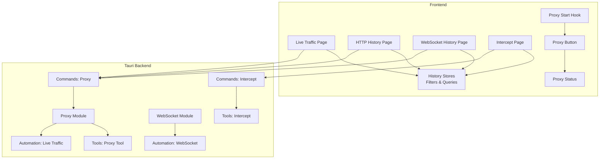
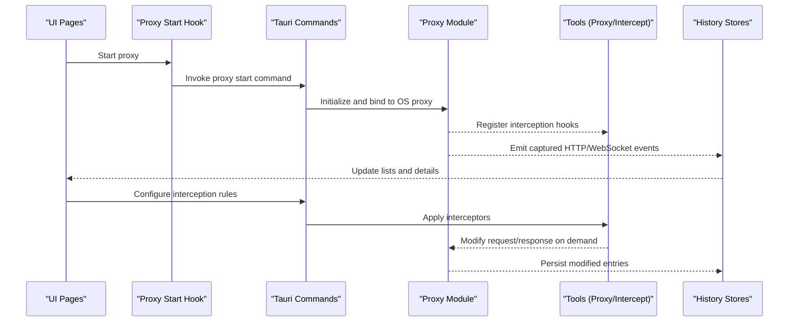
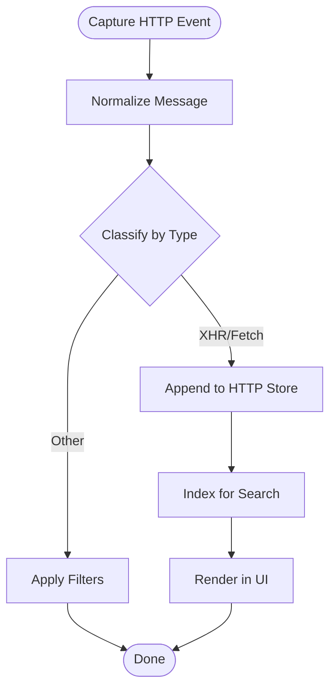
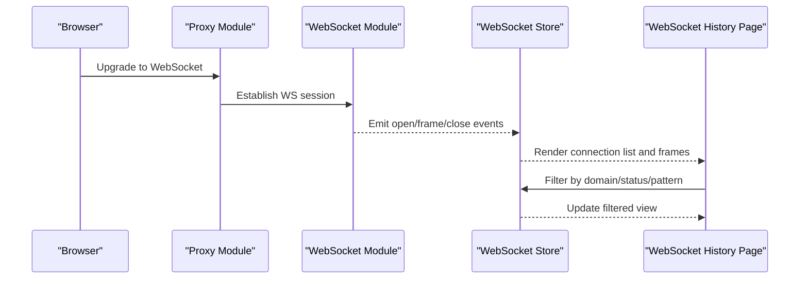
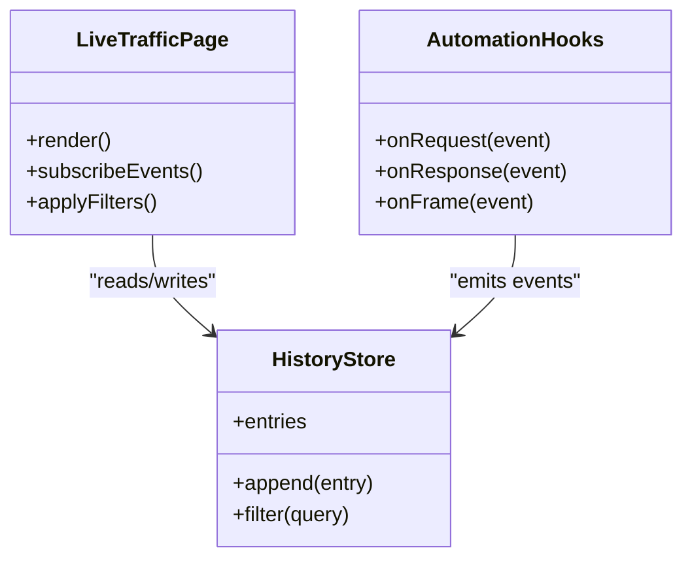
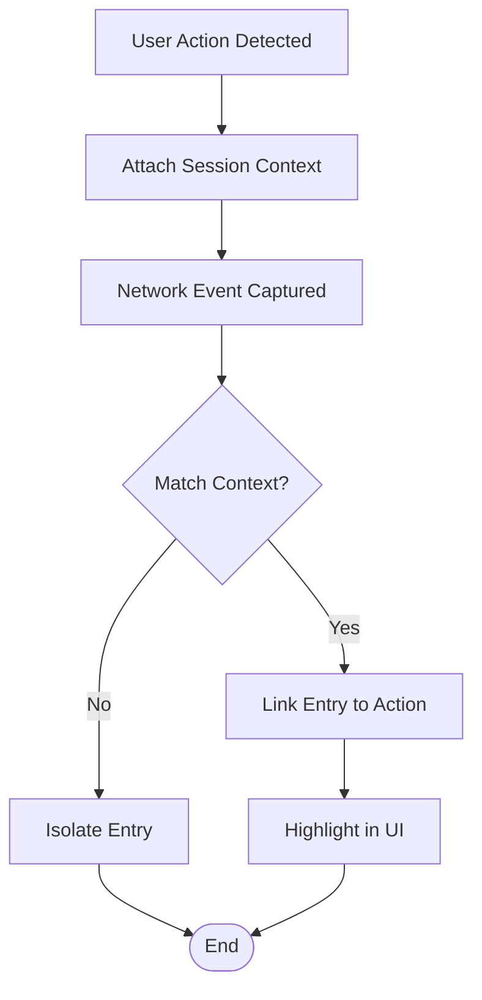
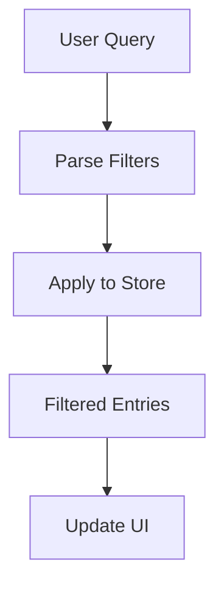
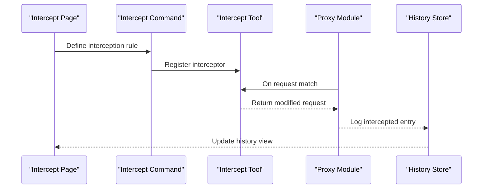
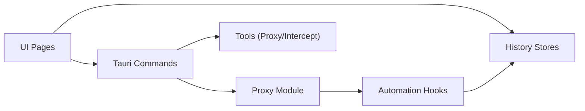

# Network Monitoring Integration

<cite>
**Referenced Files in This Document**
- [live-traffic/index.tsx](file://src/pages/live-traffic/index.tsx)
- [http-history/index.tsx](file://src/pages/live-traffic/http-history/index.tsx)
- [websocket-history/index.tsx](file://src/pages/live-traffic/websocket-history/index.tsx)
- [use-proxy-start.ts](file://src/hooks/use-proxy-start.ts)
- [proxy-button.tsx](file://src/layout/proxy-button.tsx)
- [proxy-status.tsx](file://src/layout/footer/proxy-status.tsx)
- [intercept/index.tsx](file://src/pages/intercept/index.tsx)
- [intercept/api.ts](file://src/pages/intercept/api.ts)
- [intercept/lib.ts](file://src/pages/intercept/lib.ts)
- [intercept/types.ts](file://src/pages/intercept/types.ts)
- [automation/live_traffic.rs](file://src-tauri/src/automation/live_traffic.rs)
- [automation/websocket.rs](file://src-tauri/src/automation/websocket.rs)
- [proxy/mod.rs](file://src-tauri/src/proxy/mod.rs)
- [proxy/state.rs](file://src-tauri/src/proxy/state.rs)
- [proxy/websocket.rs](file://src-tauri/src/proxy/websocket.rs)
- [commands/proxy.rs](file://src-tauri/src/commands/proxy.rs)
- [commands/intercept.rs](file://src-tauri/src/commands/intercept.rs)
- [tools/proxy_tool.rs](file://src-tauri/src/tools/proxy_tool.rs)
- [tools/intercept.rs](file://src-tauri/src/tools/intercept.rs)
- [stores/history/index.ts](file://src/stores/history/index.ts)
- [stores/history/http-query.ts](file://src/stores/history/http-query.ts)
- [stores/history/websocket-query.ts](file://src/stores/history/websocket-query.ts)
- [stores/filter.ts](file://src/stores/filter.ts)
- [lib/http-message.ts](file://src/lib/http-message.ts)
- [global-search/http-history-search.tsx](file://src/layout/global-search/http-history-search.tsx)
- [global-search/websocket-history-search.tsx](file://src/layout/global-search/websocket-history-search.tsx)
</cite>

## Table of Contents
1. Introduction
2. Project Structure
3. Core Components
4. Architecture Overview
5. Detailed Component Analysis
6. Dependency Analysis
7. Performance Considerations
8. Troubleshooting Guide
9. Conclusion

## Introduction
This document explains the Network Monitoring Integration used by page inspection tools to capture and analyze HTTP requests/responses, monitor WebSocket traffic, and inspect real-time network activity during user interactions. It covers how network events are correlated with DOM changes and user actions, filtering and search capabilities, request interception and response modification, and integration with browser developer tools and custom analysis workflows. Practical examples illustrate debugging API calls, identifying performance bottlenecks, and troubleshooting common network issues.

## Project Structure
The network monitoring feature spans both frontend (TypeScript/React) and backend (Rust/Tauri) layers:
- Frontend pages for live traffic, HTTP history, and WebSocket history provide UIs for inspection and filtering.
- A proxy control hook and UI components manage proxy lifecycle and status.
- Intercept pages enable request/response interception and modification.
- Tauri commands and modules implement proxying, WebSocket handling, and automation hooks.
- Stores manage query state, filters, and persistence for HTTP/WebSocket histories.

**Diagram sources**
- [live-traffic/index.tsx](file://src/pages/live-traffic/index.tsx)
- [http-history/index.tsx](file://src/pages/live-traffic/http-history/index.tsx)
- [websocket-history/index.tsx](file://src/pages/live-traffic/websocket-history/index.tsx)
- [intercept/index.tsx](file://src/pages/intercept/index.tsx)
- [use-proxy-start.ts](file://src/hooks/use-proxy-start.ts)
- [proxy-button.tsx](file://src/layout/proxy-button.tsx)
- [proxy-status.tsx](file://src/layout/footer/proxy-status.tsx)
- [commands/proxy.rs](file://src-tauri/src/commands/proxy.rs)
- [commands/intercept.rs](file://src-tauri/src/commands/intercept.rs)
- [proxy/mod.rs](file://src-tauri/src/proxy/mod.rs)
- [proxy/websocket.rs](file://src-tauri/src/proxy/websocket.rs)
- [tools/proxy_tool.rs](file://src-tauri/src/tools/proxy_tool.rs)
- [tools/intercept.rs](file://src-tauri/src/tools/intercept.rs)
- [automation/live_traffic.rs](file://src-tauri/src/automation/live_traffic.rs)
- [automation/websocket.rs](file://src-tauri/src/automation/websocket.rs)

**Section sources**
- [live-traffic/index.tsx](file://src/pages/live-traffic/index.tsx)
- [http-history/index.tsx](file://src/pages/live-traffic/http-history/index.tsx)
- [websocket-history/index.tsx](file://src/pages/live-traffic/websocket-history/index.tsx)
- [intercept/index.tsx](file://src/pages/intercept/index.tsx)
- [use-proxy-start.ts](file://src/hooks/use-proxy-start.ts)
- [proxy-button.tsx](file://src/layout/proxy-button.tsx)
- [proxy-status.tsx](file://src/layout/footer/proxy-status.tsx)
- [commands/proxy.rs](file://src-tauri/src/commands/proxy.rs)
- [commands/intercept.rs](file://src-tauri/src/commands/intercept.rs)
- [proxy/mod.rs](file://src-tauri/src/proxy/mod.rs)
- [proxy/websocket.rs](file://src-tauri/src/proxy/websocket.rs)
- [tools/proxy_tool.rs](file://src-tauri/src/tools/proxy_tool.rs)
- [tools/intercept.rs](file://src-tauri/src/tools/intercept.rs)
- [automation/live_traffic.rs](file://src-tauri/src/automation/live_traffic.rs)
- [automation/websocket.rs](file://src-tauri/src/automation/websocket.rs)

## Core Components
- Live Traffic and History Pages: Provide tabbed views for HTTP and WebSocket captures, with search, filtering, and detail panes.
- Proxy Control: Starts/stops the system proxy and displays its status; integrates with OS-level proxy configuration.
- Intercept Module: Enables request/response interception, allowing inspection and modification before forwarding or responding.
- Tauri Commands and Modules: Expose APIs for proxy management, interception, and WebSocket handling from the frontend.
- Stores and Filters: Centralize query parameters, filter rules, and persisted history entries for efficient UI updates.

Key responsibilities:
- Capture and normalize HTTP messages and WebSocket frames.
- Maintain a searchable, filterable history store.
- Provide interception points for modifying payloads and headers.
- Correlate network events with user actions via session context.

**Section sources**
- [http-history/index.tsx](file://src/pages/live-traffic/http-history/index.tsx)
- [websocket-history/index.tsx](file://src/pages/live-traffic/websocket-history/index.tsx)
- [use-proxy-start.ts](file://src/hooks/use-proxy-start.ts)
- [proxy-button.tsx](file://src/layout/proxy-button.tsx)
- [proxy-status.tsx](file://src/layout/footer/proxy-status.tsx)
- [intercept/index.tsx](file://src/pages/intercept/index.tsx)
- [intercept/api.ts](file://src/pages/intercept/api.ts)
- [intercept/lib.ts](file://src/pages/intercept/lib.ts)
- [intercept/types.ts](file://src/pages/intercept/types.ts)
- [commands/proxy.rs](file://src-tauri/src/commands/proxy.rs)
- [commands/intercept.rs](file://src-tauri/src/commands/intercept.rs)
- [proxy/mod.rs](file://src-tauri/src/proxy/mod.rs)
- [proxy/websocket.rs](file://src-tauri/src/proxy/websocket.rs)
- [tools/proxy_tool.rs](file://src-tauri/src/tools/proxy_tool.rs)
- [tools/intercept.rs](file://src-tauri/src/tools/intercept.rs)
- [automation/live_traffic.rs](file://src-tauri/src/automation/live_traffic.rs)
- [automation/websocket.rs](file://src-tauri/src/automation/websocket.rs)
- [stores/history/index.ts](file://src/stores/history/index.ts)
- [stores/history/http-query.ts](file://src/stores/history/http-query.ts)
- [stores/history/websocket-query.ts](file://src/stores/history/websocket-query.ts)
- [stores/filter.ts](file://src/stores/filter.ts)

## Architecture Overview
The system uses a Tauri-based proxy that intercepts HTTP and WebSocket traffic. The frontend controls the proxy lifecycle and subscribes to captured events. Interception is exposed via dedicated commands and tools, enabling dynamic payload manipulation. History data is stored and queried through centralized stores with robust filtering and search.

**Diagram sources**
- [use-proxy-start.ts](file://src/hooks/use-proxy-start.ts)
- [commands/proxy.rs](file://src-tauri/src/commands/proxy.rs)
- [proxy/mod.rs](file://src-tauri/src/proxy/mod.rs)
- [tools/proxy_tool.rs](file://src-tauri/src/tools/proxy_tool.rs)
- [tools/intercept.rs](file://src-tauri/src/tools/intercept.rs)
- [stores/history/index.ts](file://src/stores/history/index.ts)

## Detailed Component Analysis

### HTTP Request/Response Analysis
- Captures full HTTP metadata: method, URL, headers, body, timing, and status.
- Normalizes payloads for consistent display and analysis.
- Supports grouping, pinning, and highlighting based on patterns.

Implementation highlights:
- HTTP message normalization and utilities reside in a dedicated module.
- History store manages entries and exposes query functions for filtering and searching.
- Global search integrates with HTTP history for quick discovery across sessions.

**Diagram sources**
- [lib/http-message.ts](file://src/lib/http-message.ts)
- [stores/history/index.ts](file://src/stores/history/index.ts)
- [stores/history/http-query.ts](file://src/stores/history/http-query.ts)
- [global-search/http-history-search.tsx](file://src/layout/global-search/http-history-search.tsx)

**Section sources**
- [lib/http-message.ts](file://src/lib/http-message.ts)
- [stores/history/index.ts](file://src/stores/history/index.ts)
- [stores/history/http-query.ts](file://src/stores/history/http-query.ts)
- [global-search/http-history-search.tsx](file://src/layout/global-search/http-history-search.tsx)

### WebSocket Monitoring
- Monitors WebSocket connections, including handshake, frames, and close events.
- Provides frame-level inspection with direction indicators and payload decoding.
- Integrates with automation hooks to correlate frames with page actions.

**Diagram sources**
- [proxy/websocket.rs](file://src-tauri/src/proxy/websocket.rs)
- [automation/websocket.rs](file://src-tauri/src/automation/websocket.rs)
- [websocket-history/index.tsx](file://src/pages/live-traffic/websocket-history/index.tsx)
- [stores/history/websocket-query.ts](file://src/stores/history/websocket-query.ts)

**Section sources**
- [proxy/websocket.rs](file://src-tauri/src/proxy/websocket.rs)
- [automation/websocket.rs](file://src-tauri/src/automation/websocket.rs)
- [websocket-history/index.tsx](file://src/pages/live-traffic/websocket-history/index.tsx)
- [stores/history/websocket-query.ts](file://src/stores/history/websocket-query.ts)

### Real-Time Traffic Inspection During Page Interactions
- Live traffic feed streams captured events as they occur.
- Events are tagged with session context to correlate with DOM changes and user actions.
- Filtering reduces noise and focuses on relevant traffic.

**Diagram sources**
- [live-traffic/index.tsx](file://src/pages/live-traffic/index.tsx)
- [stores/history/index.ts](file://src/stores/history/index.ts)
- [automation/live_traffic.rs](file://src-tauri/src/automation/live_traffic.rs)

**Section sources**
- [live-traffic/index.tsx](file://src/pages/live-traffic/index.tsx)
- [stores/history/index.ts](file://src/stores/history/index.ts)
- [automation/live_traffic.rs](file://src-tauri/src/automation/live_traffic.rs)

### Correlating Network Activity with DOM Changes and User Actions
- Session context links network events to specific user interactions (clicks, navigation, form submissions).
- Automation hooks emit contextual signals that can be matched against DOM mutation events.
- UI supports highlighting related entries when a DOM change is inspected.

[No sources needed since this diagram shows conceptual workflow, not actual code structure]

### Filtering Capabilities
- Query-based filtering for HTTP and WebSocket histories.
- Pattern matching for URLs, headers, methods, and statuses.
- Persistent filter presets for recurring analysis tasks.

**Diagram sources**
- [stores/history/http-query.ts](file://src/stores/history/http-query.ts)
- [stores/history/websocket-query.ts](file://src/stores/history/websocket-query.ts)
- [stores/filter.ts](file://src/stores/filter.ts)

**Section sources**
- [stores/history/http-query.ts](file://src/stores/history/http-query.ts)
- [stores/history/websocket-query.ts](file://src/stores/history/websocket-query.ts)
- [stores/filter.ts](file://src/stores/filter.ts)

### Request Interception and Response Modification
- Interception rules allow selective modification of requests and responses.
- Rules can target domains, paths, headers, or payload patterns.
- Modified entries are persisted and reflected in history and live feeds.

**Diagram sources**
- [intercept/index.tsx](file://src/pages/intercept/index.tsx)
- [intercept/api.ts](file://src/pages/intercept/api.ts)
- [intercept/lib.ts](file://src/pages/intercept/lib.ts)
- [intercept/types.ts](file://src/pages/intercept/types.ts)
- [commands/intercept.rs](file://src-tauri/src/commands/intercept.rs)
- [tools/intercept.rs](file://src-tauri/src/tools/intercept.rs)
- [proxy/mod.rs](file://src-tauri/src/proxy/mod.rs)

**Section sources**
- [intercept/index.tsx](file://src/pages/intercept/index.tsx)
- [intercept/api.ts](file://src/pages/intercept/api.ts)
- [intercept/lib.ts](file://src/pages/intercept/lib.ts)
- [intercept/types.ts](file://src/pages/intercept/types.ts)
- [commands/intercept.rs](file://src-tauri/src/commands/intercept.rs)
- [tools/intercept.rs](file://src-tauri/src/tools/intercept.rs)
- [proxy/mod.rs](file://src-tauri/src/proxy/mod.rs)

### Integration with Browser Developer Tools and Custom Workflows
- Export/import capabilities for network logs and interception rules.
- CLI and API hooks for automated testing and CI pipelines.
- Compatibility with standard dev tool formats for seamless handoff.

[No sources needed since this section provides general guidance]

## Dependency Analysis
The network monitoring stack exhibits clear separation between UI, commands, and core modules:
- UI depends on stores and commands for data and control.
- Commands depend on proxy and tools modules for functionality.
- Automation hooks bridge browser events to storage and UI.

**Diagram sources**
- [live-traffic/index.tsx](file://src/pages/live-traffic/index.tsx)
- [http-history/index.tsx](file://src/pages/live-traffic/http-history/index.tsx)
- [websocket-history/index.tsx](file://src/pages/live-traffic/websocket-history/index.tsx)
- [commands/proxy.rs](file://src-tauri/src/commands/proxy.rs)
- [commands/intercept.rs](file://src-tauri/src/commands/intercept.rs)
- [proxy/mod.rs](file://src-tauri/src/proxy/mod.rs)
- [tools/proxy_tool.rs](file://src-tauri/src/tools/proxy_tool.rs)
- [tools/intercept.rs](file://src-tauri/src/tools/intercept.rs)
- [automation/live_traffic.rs](file://src-tauri/src/automation/live_traffic.rs)
- [automation/websocket.rs](file://src-tauri/src/automation/websocket.rs)
- [stores/history/index.ts](file://src/stores/history/index.ts)

**Section sources**
- [live-traffic/index.tsx](file://src/pages/live-traffic/index.tsx)
- [http-history/index.tsx](file://src/pages/live-traffic/http-history/index.tsx)
- [websocket-history/index.tsx](file://src/pages/live-traffic/websocket-history/index.tsx)
- [commands/proxy.rs](file://src-tauri/src/commands/proxy.rs)
- [commands/intercept.rs](file://src-tauri/src/commands/intercept.rs)
- [proxy/mod.rs](file://src-tauri/src/proxy/mod.rs)
- [tools/proxy_tool.rs](file://src-tauri/src/tools/proxy_tool.rs)
- [tools/intercept.rs](file://src-tauri/src/tools/intercept.rs)
- [automation/live_traffic.rs](file://src-tauri/src/automation/live_traffic.rs)
- [automation/websocket.rs](file://src-tauri/src/automation/websocket.rs)
- [stores/history/index.ts](file://src/stores/history/index.ts)

## Performance Considerations
- Stream processing: Use backpressure and throttling to avoid UI lag under high traffic.
- Indexing: Maintain indexes for frequent queries (URL, method, status) to speed up filtering.
- Memory management: Limit retained payloads and prune old entries based on retention policies.
- Async operations: Ensure non-blocking I/O for proxy and WebSocket handling.

[No sources needed since this section provides general guidance]

## Troubleshooting Guide
Common issues and resolutions:
- Proxy not starting: Verify OS proxy settings and permissions; check proxy status UI.
- Missing WebSocket frames: Confirm upgrade handshake and ensure WS module is active.
- Slow filtering: Review query complexity and indexes; simplify patterns.
- Interception not applied: Validate rule scope and priority; test with minimal patterns.

Debugging steps:
- Inspect proxy logs and command outputs.
- Use global search to locate problematic entries quickly.
- Temporarily disable filters to isolate causes.
- Export logs for offline analysis.

**Section sources**
- [proxy-status.tsx](file://src/layout/footer/proxy-status.tsx)
- [proxy-button.tsx](file://src/layout/proxy-button.tsx)
- [use-proxy-start.ts](file://src/hooks/use-proxy-start.ts)
- [global-search/http-history-search.tsx](file://src/layout/global-search/http-history-search.tsx)
- [global-search/websocket-history-search.tsx](file://src/layout/global-search/websocket-history-search.tsx)

## Conclusion
The Network Monitoring Integration provides comprehensive HTTP and WebSocket inspection, powerful filtering and interception, and tight correlation with user actions. By leveraging centralized stores, robust commands, and modular proxy tools, it enables effective debugging, performance analysis, and troubleshooting within page inspection workflows.