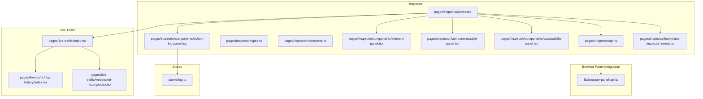
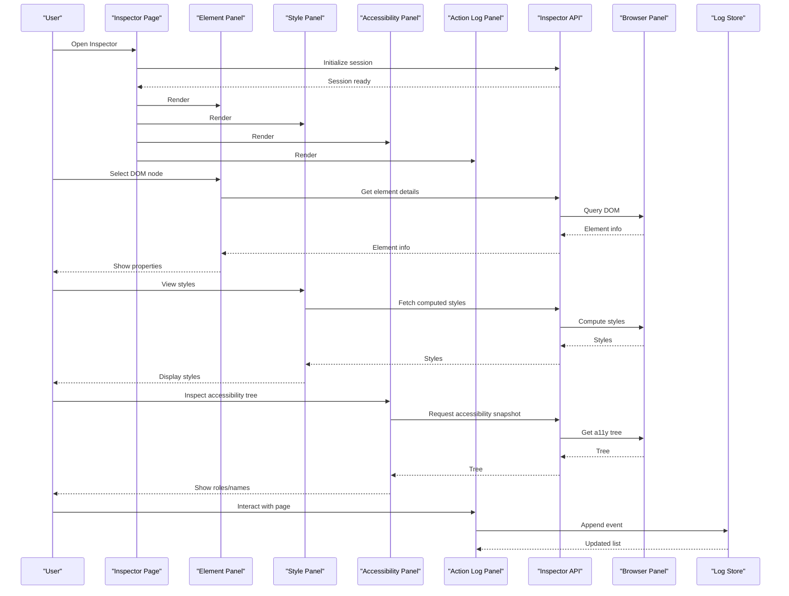
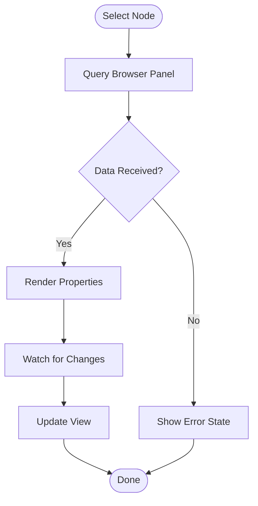
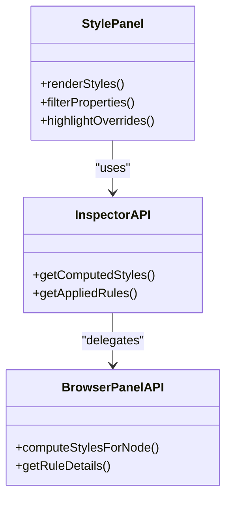
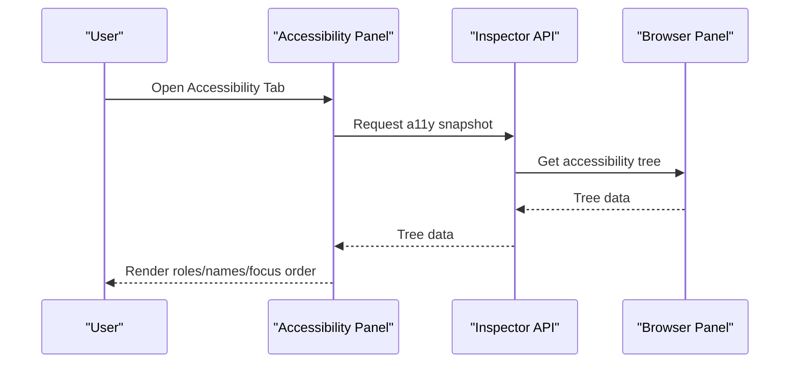
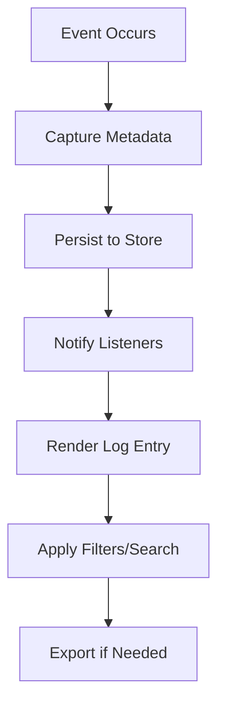
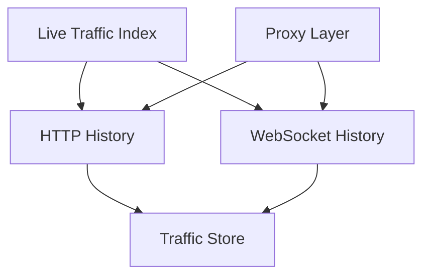
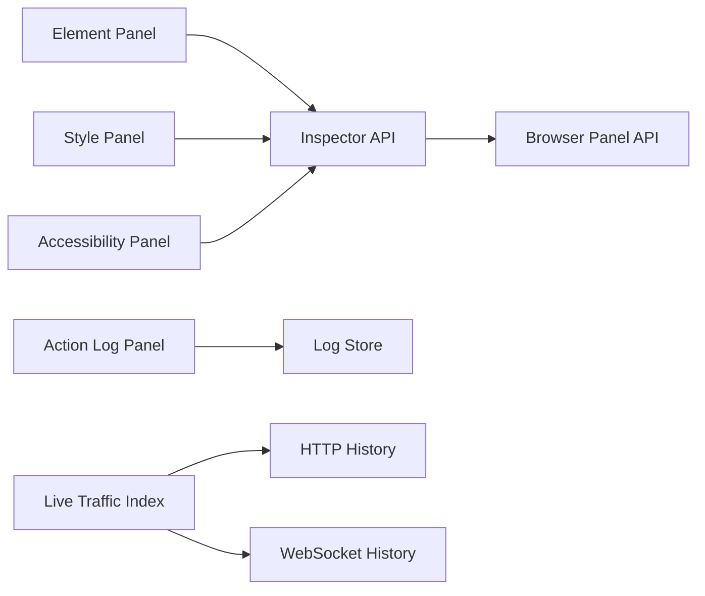

# Page Inspection Tools

<cite>
**Referenced Files in This Document**
- [index.tsx](file://src/pages/inspector/index.tsx)
- [api.ts](file://src/pages/inspector/api.ts)
- [types.ts](file://src/pages/inspector/types.ts)
- [constants.ts](file://src/pages/inspector/constants.ts)
- [components/element-panel.tsx](file://src/pages/inspector/components/element-panel.tsx)
- [components/style-panel.tsx](file://src/pages/inspector/components/style-panel.tsx)
- [components/accessibility-panel.tsx](file://src/pages/inspector/components/accessibility-panel.tsx)
- [components/action-log-panel.tsx](file://src/pages/inspector/components/action-log-panel.tsx)
- [hooks/use-inspector-events.ts](file://src/pages/inspector/hooks/use-inspector-events.ts)
- [lib/browser-panel-api.ts](file://src/lib/browser-panel-api.ts)
- [stores/log.ts](file://src/stores/log.ts)
- [pages/live-traffic/index.tsx](file://src/pages/live-traffic/index.tsx)
- [pages/live-traffic/http-history/index.tsx](file://src/pages/live-traffic/http-history/index.tsx)
- [pages/live-traffic/websocket-history/index.tsx](file://src/pages/live-traffic/websocket-history/index.tsx)
</cite>

## Table of Contents
1. [Introduction](#introduction)
2. [Project Structure](#project-structure)
3. [Core Components](#core-components)
4. [Architecture Overview](#architecture-overview)
5. [Detailed Component Analysis](#detailed-component-analysis)
6. [Dependency Analysis](#dependency-analysis)
7. [Performance Considerations](#performance-considerations)
8. [Troubleshooting Guide](#troubleshooting-guide)
9. [Conclusion](#conclusion)
10. [Appendices](#appendices)

## Introduction
This document describes the Page Inspection Tools suite, focusing on:
- DOM inspector capabilities for element selection, property examination, and style analysis
- Accessibility tree inspection for WCAG compliance testing and screen reader simulation
- Action log panel for tracking user interactions and automated events
- Network monitoring integration to analyze HTTP requests and responses during page interactions
- Common inspection workflows for debugging client-side issues and validating UI behavior

The suite integrates with the browser panel and live traffic modules to provide a cohesive inspection experience within the application.

## Project Structure
The inspector is implemented as a dedicated page with supporting components, hooks, types, constants, and an API layer that communicates with the browser panel. Network monitoring is provided by the live traffic pages.

**Diagram sources**
- [index.tsx](file://src/pages/inspector/index.tsx)
- [api.ts](file://src/pages/inspector/api.ts)
- [types.ts](file://src/pages/inspector/types.ts)
- [constants.ts](file://src/pages/inspector/constants.ts)
- [components/element-panel.tsx](file://src/pages/inspector/components/element-panel.tsx)
- [components/style-panel.tsx](file://src/pages/inspector/components/style-panel.tsx)
- [components/accessibility-panel.tsx](file://src/pages/inspector/components/accessibility-panel.tsx)
- [components/action-log-panel.tsx](file://src/pages/inspector/components/action-log-panel.tsx)
- [hooks/use-inspector-events.ts](file://src/pages/inspector/hooks/use-inspector-events.ts)
- [lib/browser-panel-api.ts](file://src/lib/browser-panel-api.ts)
- [stores/log.ts](file://src/stores/log.ts)
- [pages/live-traffic/index.tsx](file://src/pages/live-traffic/index.tsx)
- [pages/live-traffic/http-history/index.tsx](file://src/pages/live-traffic/http-history/index.tsx)
- [pages/live-traffic/websocket-history/index.tsx](file://src/pages/live-traffic/websocket-history/index.tsx)

**Section sources**
- [index.tsx](file://src/pages/inspector/index.tsx)
- [api.ts](file://src/pages/inspector/api.ts)
- [types.ts](file://src/pages/inspector/types.ts)
- [constants.ts](file://src/pages/inspector/constants.ts)
- [components/element-panel.tsx](file://src/pages/inspector/components/element-panel.tsx)
- [components/style-panel.tsx](file://src/pages/inspector/components/style-panel.tsx)
- [components/accessibility-panel.tsx](file://src/pages/inspector/components/accessibility-panel.tsx)
- [components/action-log-panel.tsx](file://src/pages/inspector/components/action-log-panel.tsx)
- [hooks/use-inspector-events.ts](file://src/pages/inspector/hooks/use-inspector-events.ts)
- [lib/browser-panel-api.ts](file://src/lib/browser-panel-api.ts)
- [stores/log.ts](file://src/stores/log.ts)
- [pages/live-traffic/index.tsx](file://src/pages/live-traffic/index.tsx)
- [pages/live-traffic/http-history/index.tsx](file://src/pages/live-traffic/http-history/index.tsx)
- [pages/live-traffic/websocket-history/index.tsx](file://src/pages/live-traffic/websocket-history/index.tsx)

## Core Components
- Element Panel: Provides DOM element selection, property inspection, and attribute/value viewing. It coordinates with the browser panel to fetch current element details and updates when selections change.
- Style Panel: Displays computed styles, CSS rules, and inheritance chains for the selected element. It supports filtering and searching through style properties.
- Accessibility Panel: Presents the accessibility tree for the active page, enabling WCAG checks and simulating how assistive technologies perceive the UI.
- Action Log Panel: Records user interactions (clicks, inputs, navigation) and automated events emitted by automation flows. It provides filtering, search, and export capabilities.

These components are orchestrated by the inspector page and communicate with the browser panel via the API layer.

**Section sources**
- [components/element-panel.tsx](file://src/pages/inspector/components/element-panel.tsx)
- [components/style-panel.tsx](file://src/pages/inspector/components/style-panel.tsx)
- [components/accessibility-panel.tsx](file://src/pages/inspector/components/accessibility-panel.tsx)
- [components/action-log-panel.tsx](file://src/pages/inspector/components/action-log-panel.tsx)
- [api.ts](file://src/pages/inspector/api.ts)
- [types.ts](file://src/pages/inspector/types.ts)
- [constants.ts](file://src/pages/inspector/constants.ts)

## Architecture Overview
The inspector page composes panels and subscribes to inspector events. The API module encapsulates calls to the browser panel for DOM and accessibility data. The action log panel persists entries to a shared store. Live traffic pages integrate network monitoring alongside inspection workflows.

**Diagram sources**
- [index.tsx](file://src/pages/inspector/index.tsx)
- [api.ts](file://src/pages/inspector/api.ts)
- [components/element-panel.tsx](file://src/pages/inspector/components/element-panel.tsx)
- [components/style-panel.tsx](file://src/pages/inspector/components/style-panel.tsx)
- [components/accessibility-panel.tsx](file://src/pages/inspector/components/accessibility-panel.tsx)
- [components/action-log-panel.tsx](file://src/pages/inspector/components/action-log-panel.tsx)
- [lib/browser-panel-api.ts](file://src/lib/browser-panel-api.ts)
- [stores/log.ts](file://src/stores/log.ts)

## Detailed Component Analysis

### DOM Inspector: Element Selection and Property Examination
- Element selection triggers queries to the browser panel to retrieve attributes, properties, and computed values.
- The element panel renders a structured view of the selected node’s hierarchy and metadata.
- Updates occur reactively when the selection changes or when the page mutates relevant nodes.

**Diagram sources**
- [components/element-panel.tsx](file://src/pages/inspector/components/element-panel.tsx)
- [api.ts](file://src/pages/inspector/api.ts)
- [lib/browser-panel-api.ts](file://src/lib/browser-panel-api.ts)

**Section sources**
- [components/element-panel.tsx](file://src/pages/inspector/components/element-panel.tsx)
- [api.ts](file://src/pages/inspector/api.ts)
- [lib/browser-panel-api.ts](file://src/lib/browser-panel-api.ts)

### Style Analysis
- Computes and displays applied CSS rules, including inherited styles and overrides.
- Supports filtering by property name and visual indicators for overridden values.
- Integrates with the element panel to reflect context-aware styling information.

**Diagram sources**
- [components/style-panel.tsx](file://src/pages/inspector/components/style-panel.tsx)
- [api.ts](file://src/pages/inspector/api.ts)
- [lib/browser-panel-api.ts](file://src/lib/browser-panel-api.ts)

**Section sources**
- [components/style-panel.tsx](file://src/pages/inspector/components/style-panel.tsx)
- [api.ts](file://src/pages/inspector/api.ts)
- [lib/browser-panel-api.ts](file://src/lib/browser-panel-api.ts)

### Accessibility Tree Inspection
- Retrieves the accessibility tree for the active page, exposing roles, names, states, and relationships.
- Enables WCAG-focused checks such as missing labels, incorrect roles, and focus management issues.
- Simulates screen reader traversal order and announces key elements for validation.

**Diagram sources**
- [components/accessibility-panel.tsx](file://src/pages/inspector/components/accessibility-panel.tsx)
- [api.ts](file://src/pages/inspector/api.ts)
- [lib/browser-panel-api.ts](file://src/lib/browser-panel-api.ts)

**Section sources**
- [components/accessibility-panel.tsx](file://src/pages/inspector/components/accessibility-panel.tsx)
- [api.ts](file://src/pages/inspector/api.ts)
- [lib/browser-panel-api.ts](file://src/lib/browser-panel-api.ts)

### Action Log Panel
- Captures user interactions (clicks, keyboard, form inputs) and automation events.
- Persists entries to a shared store for cross-panel visibility and history.
- Provides filtering, search, and export features to streamline debugging.

**Diagram sources**
- [components/action-log-panel.tsx](file://src/pages/inspector/components/action-log-panel.tsx)
- [stores/log.ts](file://src/stores/log.ts)
- [hooks/use-inspector-events.ts](file://src/pages/inspector/hooks/use-inspector-events.ts)

**Section sources**
- [components/action-log-panel.tsx](file://src/pages/inspector/components/action-log-panel.tsx)
- [stores/log.ts](file://src/stores/log.ts)
- [hooks/use-inspector-events.ts](file://src/pages/inspector/hooks/use-inspector-events.ts)

### Network Monitoring Integration
- The live traffic pages capture HTTP and WebSocket traffic associated with page interactions.
- Users can correlate DOM and style changes with network activity to diagnose performance and data flow issues.
- Filtering and grouping enable focused analysis of specific endpoints or request patterns.

**Diagram sources**
- [pages/live-traffic/index.tsx](file://src/pages/live-traffic/index.tsx)
- [pages/live-traffic/http-history/index.tsx](file://src/pages/live-traffic/http-history/index.tsx)
- [pages/live-traffic/websocket-history/index.tsx](file://src/pages/live-traffic/websocket-history/index.tsx)

**Section sources**
- [pages/live-traffic/index.tsx](file://src/pages/live-traffic/index.tsx)
- [pages/live-traffic/http-history/index.tsx](file://src/pages/live-traffic/http-history/index.tsx)
- [pages/live-traffic/websocket-history/index.tsx](file://src/pages/live-traffic/websocket-history/index.tsx)

## Dependency Analysis
The inspector depends on the browser panel API for DOM and accessibility data, while the action log panel relies on a shared store for persistence. Live traffic pages integrate with the proxy layer to capture network activity.

**Diagram sources**
- [components/element-panel.tsx](file://src/pages/inspector/components/element-panel.tsx)
- [components/style-panel.tsx](file://src/pages/inspector/components/style-panel.tsx)
- [components/accessibility-panel.tsx](file://src/pages/inspector/components/accessibility-panel.tsx)
- [components/action-log-panel.tsx](file://src/pages/inspector/components/action-log-panel.tsx)
- [api.ts](file://src/pages/inspector/api.ts)
- [lib/browser-panel-api.ts](file://src/lib/browser-panel-api.ts)
- [stores/log.ts](file://src/stores/log.ts)
- [pages/live-traffic/index.tsx](file://src/pages/live-traffic/index.tsx)
- [pages/live-traffic/http-history/index.tsx](file://src/pages/live-traffic/http-history/index.tsx)
- [pages/live-traffic/websocket-history/index.tsx](file://src/pages/live-traffic/websocket-history/index.tsx)

**Section sources**
- [components/element-panel.tsx](file://src/pages/inspector/components/element-panel.tsx)
- [components/style-panel.tsx](file://src/pages/inspector/components/style-panel.tsx)
- [components/accessibility-panel.tsx](file://src/pages/inspector/components/accessibility-panel.tsx)
- [components/action-log-panel.tsx](file://src/pages/inspector/components/action-log-panel.tsx)
- [api.ts](file://src/pages/inspector/api.ts)
- [lib/browser-panel-api.ts](file://src/lib/browser-panel-api.ts)
- [stores/log.ts](file://src/stores/log.ts)
- [pages/live-traffic/index.tsx](file://src/pages/live-traffic/index.tsx)
- [pages/live-traffic/http-history/index.tsx](file://src/pages/live-traffic/http-history/index.tsx)
- [pages/live-traffic/websocket-history/index.tsx](file://src/pages/live-traffic/websocket-history/index.tsx)

## Performance Considerations
- Debounce heavy operations such as computed style retrieval and accessibility snapshots to avoid blocking UI updates.
- Use virtualized lists for large logs and traffic histories to maintain responsiveness.
- Cache frequently accessed element properties and styles where appropriate, invalidating caches on known mutations.
- Limit the depth of DOM traversal and accessibility tree queries to reduce overhead.

[No sources needed since this section provides general guidance]

## Troubleshooting Guide
- If element details do not update, verify the selection hook and ensure the browser panel is connected and responsive.
- For missing styles, confirm that computed style queries target the correct node and that CSS injection is enabled.
- When accessibility data is empty, check permissions and ensure the page has loaded fully before requesting the tree.
- For absent log entries, validate event listeners and store subscriptions; ensure filters are not hiding expected entries.
- For network gaps, confirm proxy configuration and certificate installation, then reattempt interaction.

**Section sources**
- [hooks/use-inspector-events.ts](file://src/pages/inspector/hooks/use-inspector-events.ts)
- [components/action-log-panel.tsx](file://src/pages/inspector/components/action-log-panel.tsx)
- [stores/log.ts](file://src/stores/log.ts)
- [pages/live-traffic/index.tsx](file://src/pages/live-traffic/index.tsx)

## Conclusion
The Page Inspection Tools suite provides a comprehensive environment for inspecting the DOM, analyzing styles, validating accessibility, tracking actions, and correlating network activity. By integrating tightly with the browser panel and live traffic modules, it enables efficient debugging and validation of client-side behavior across common workflows.

[No sources needed since this section summarizes without analyzing specific files]

## Appendices

### Common Inspection Workflows
- Debugging UI rendering issues:
  - Select the problematic element in the Element Panel.
  - Review computed styles in the Style Panel to identify overrides or missing rules.
  - Cross-reference with network requests to ensure required resources loaded successfully.
- Validating accessibility:
  - Open the Accessibility Panel and traverse the tree to confirm roles, names, and focus order.
  - Run targeted WCAG checks and fix missing labels or incorrect semantics.
- Investigating user interactions:
  - Use the Action Log Panel to trace clicks and inputs leading to unexpected state changes.
  - Correlate with network traffic to see if backend responses caused UI anomalies.
- Analyzing performance bottlenecks:
  - Identify heavy DOM mutations and style recalculations using the Element and Style Panels.
  - Examine network timing in the Live Traffic pages to pinpoint slow endpoints.

[No sources needed since this section provides general guidance]