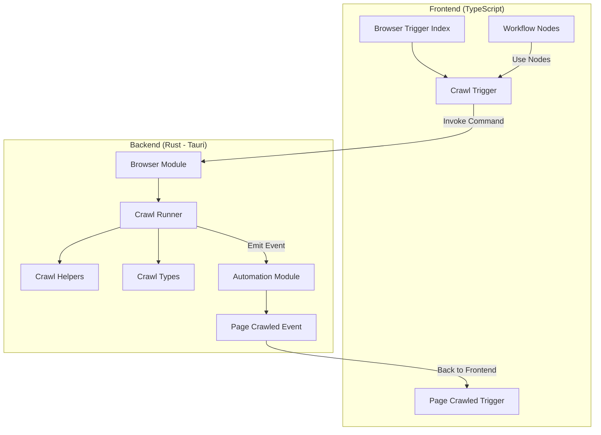
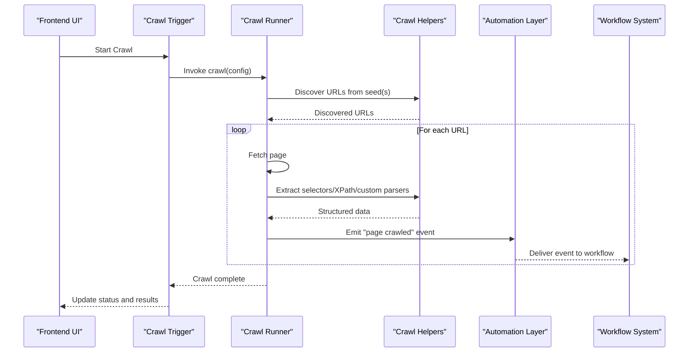
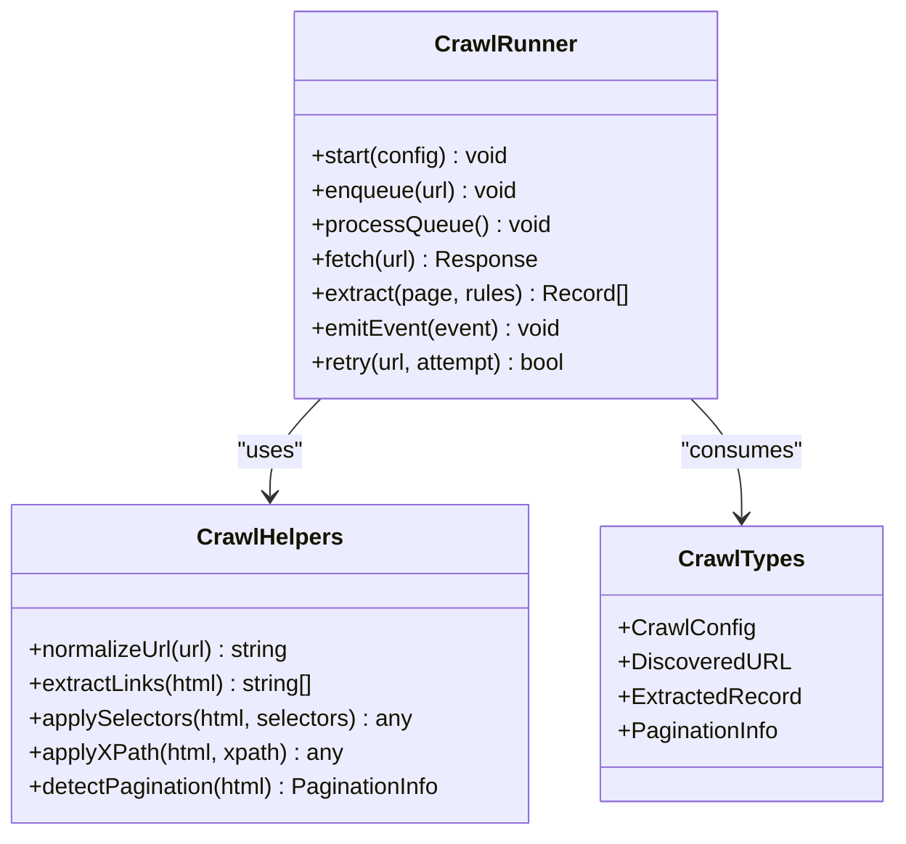
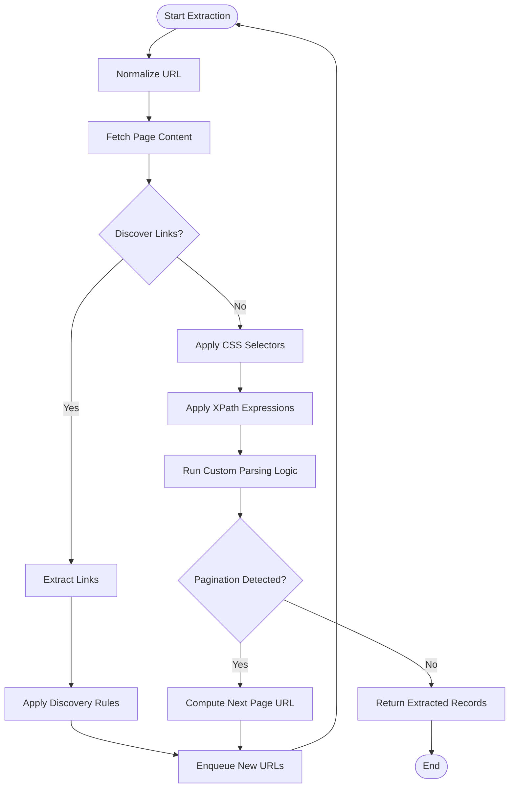
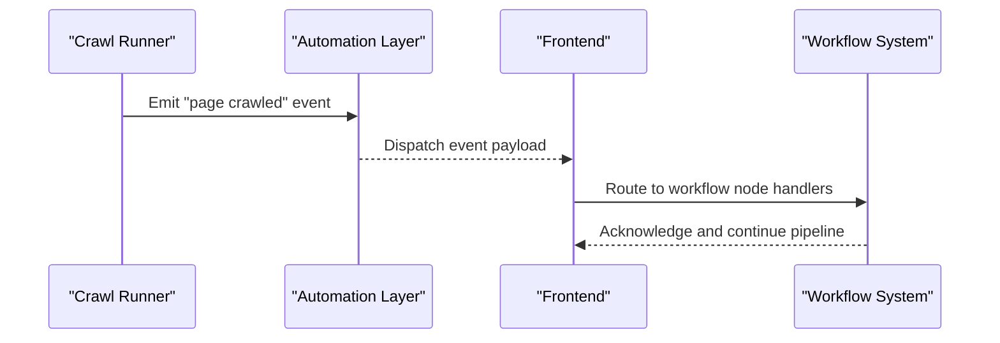
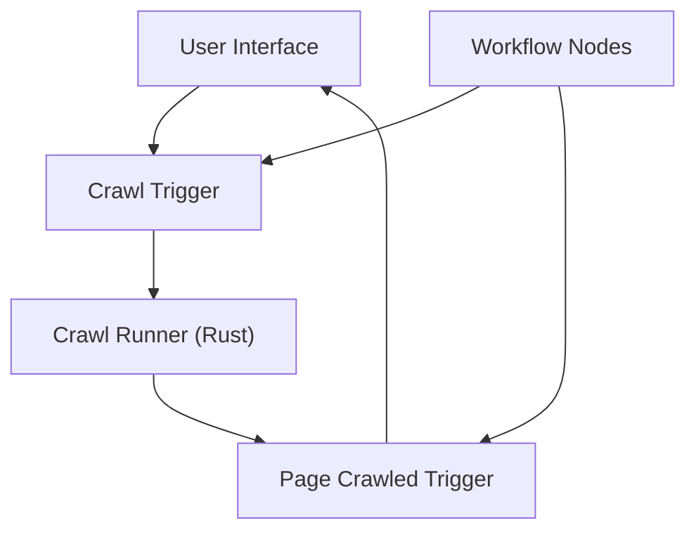
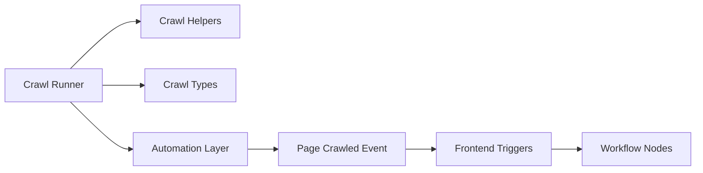

# Web Crawling & Data Extraction

<cite>
**Referenced Files in This Document**
- [crawl_runner.rs](file://src-tauri/src/browser/crawl_runner.rs)
- [crawl_helpers.rs](file://src-tauri/src/browser/crawl_helpers.rs)
- [crawl_types.rs](file://src-tauri/src/browser/crawl_types.rs)
- [mod.rs](file://src-tauri/src/browser/mod.rs)
- [automation_mod.rs](file://src-tauri/src/automation/mod.rs)
- [page_crawled.rs](file://src-tauri/src/automation/page_crawled.rs)
- [browser_trigger_index.ts](file://src/triggers/browser/index.ts)
- [crawl_trigger.ts](file://src/triggers/browser/crawl.ts)
- [page_crawled_trigger.ts](file://src/triggers/browser/page_crawled.ts)
- [workflow_nodes_index.tsx](file://src/pages/workflow/nodes/index.tsx)
- [node_type_registry.ts](file://src/pages/workflow/node-type-registry.ts)
</cite>

## Table of Contents
1. [Introduction](#introduction)
2. [Project Structure](#project-structure)
3. [Core Components](#core-components)
4. [Architecture Overview](#architecture-overview)
5. [Detailed Component Analysis](#detailed-component-analysis)
6. [Dependency Analysis](#dependency-analysis)
7. [Performance Considerations](#performance-considerations)
8. [Troubleshooting Guide](#troubleshooting-guide)
9. [Conclusion](#conclusion)
10. [Appendices](#appendices)

## Introduction
This document explains Apprecon’s Web Crawling and Data Extraction capabilities, focusing on the crawling engine architecture, URL discovery algorithms, pagination handling strategies, data extraction patterns (CSS selectors, XPath expressions, and custom parsing logic), crawl configuration options, rate limiting, error recovery mechanisms, practical examples for building crawlers across different website structures, handling dynamic content, and integration with Apprecon’s workflow system for automated data processing pipelines.

## Project Structure
Apprecon implements web crawling primarily in Rust under the Tauri backend, with orchestration and UI triggers in TypeScript. The key modules are:
- Browser crawling engine: Rust module that manages crawling lifecycle, helpers, and types.
- Automation layer: Rust module that exposes events and execution hooks to the frontend.
- Frontend triggers: TypeScript files that wire UI actions to backend commands and emit events like page crawled.
- Workflow nodes: TypeScript components that integrate crawling into Apprecon’s visual automation workflows.

**Diagram sources**
- [mod.rs](file://src-tauri/src/browser/mod.rs)
- [crawl_runner.rs](file://src-tauri/src/browser/crawl_runner.rs)
- [crawl_helpers.rs](file://src-tauri/src/browser/crawl_helpers.rs)
- [crawl_types.rs](file://src-tauri/src/browser/crawl_types.rs)
- [automation_mod.rs](file://src-tauri/src/automation/mod.rs)
- [page_crawled.rs](file://src-tauri/src/automation/page_crawled.rs)
- [browser_trigger_index.ts](file://src/triggers/browser/index.ts)
- [crawl_trigger.ts](file://src/triggers/browser/crawl.ts)
- [page_crawled_trigger.ts](file://src/triggers/browser/page_crawled.ts)
- [workflow_nodes_index.tsx](file://src/pages/workflow/nodes/index.tsx)
- [node_type_registry.ts](file://src/pages/workflow/node-type-registry.ts)

**Section sources**
- [mod.rs](file://src-tauri/src/browser/mod.rs)
- [crawl_runner.rs](file://src-tauri/src/browser/crawl_runner.rs)
- [crawl_helpers.rs](file://src-tauri/src/browser/crawl_helpers.rs)
- [crawl_types.rs](file://src-tauri/src/browser/crawl_types.rs)
- [automation_mod.rs](file://src-tauri/src/automation/mod.rs)
- [page_crawled.rs](file://src-tauri/src/automation/page_crawled.rs)
- [browser_trigger_index.ts](file://src/triggers/browser/index.ts)
- [crawl_trigger.ts](file://src/triggers/browser/crawl.ts)
- [page_crawled_trigger.ts](file://src/triggers/browser/page_crawled.ts)
- [workflow_nodes_index.tsx](file://src/pages/workflow/nodes/index.tsx)
- [node_type_registry.ts](file://src/pages/workflow/node-type-registry.ts)

## Core Components
- Crawl Runner: Orchestrates the crawling lifecycle, including scheduling, concurrency control, and event emission. It coordinates URL discovery, request dispatch, response handling, and extraction.
- Crawl Helpers: Provides utilities for URL normalization, link extraction, selector-based extraction, and pagination detection.
- Crawl Types: Defines structured types for crawl configuration, discovered URLs, extracted data, and crawl state.
- Automation Layer: Bridges crawling events to the frontend via Tauri commands and emits “page crawled” events consumed by the UI and workflow system.
- Frontend Triggers: Exposes user-facing controls to start crawls and react to page-crawled events; integrates with workflow nodes for pipeline composition.

Key responsibilities:
- URL discovery: Parse HTML, extract links, filter by rules, and enqueue new targets.
- Pagination handling: Detect next-page patterns and continue crawling until completion or policy limits.
- Data extraction: Apply CSS selectors, XPath expressions, and custom parsing logic to produce structured records.
- Rate limiting: Enforce concurrency and delay policies to respect target servers and avoid throttling.
- Error recovery: Retry transient failures, handle timeouts, and log errors without halting the entire crawl.

**Section sources**
- [crawl_runner.rs](file://src-tauri/src/browser/crawl_runner.rs)
- [crawl_helpers.rs](file://src-tauri/src/browser/crawl_helpers.rs)
- [crawl_types.rs](file://src-tauri/src/browser/crawl_types.rs)
- [automation_mod.rs](file://src-tauri/src/automation/mod.rs)
- [page_crawled.rs](file://src-tauri/src/automation/page_crawled.rs)
- [browser_trigger_index.ts](file://src/triggers/browser/index.ts)
- [crawl_trigger.ts](file://src/triggers/browser/crawl.ts)
- [page_crawled_trigger.ts](file://src/triggers/browser/page_crawled.ts)

## Architecture Overview
The crawling architecture separates concerns between orchestration (runner), utilities (helpers), data models (types), and event bridging (automation). Frontend triggers initiate crawls and subscribe to events, while workflow nodes compose crawls with other steps.

**Diagram sources**
- [crawl_runner.rs](file://src-tauri/src/browser/crawl_runner.rs)
- [crawl_helpers.rs](file://src-tauri/src/browser/crawl_helpers.rs)
- [automation_mod.rs](file://src-tauri/src/automation/mod.rs)
- [page_crawled.rs](file://src-tauri/src/automation/page_crawled.rs)
- [crawl_trigger.ts](file://src/triggers/browser/crawl.ts)
- [page_crawled_trigger.ts](file://src/triggers/browser/page_crawled.ts)

## Detailed Component Analysis

### Crawl Runner
Responsibilities:
- Initialize crawl context from configuration.
- Manage concurrency and rate limiting.
- Orchestrate URL discovery and extraction loops.
- Emit “page crawled” events after successful extraction.
- Handle retries and error propagation.

**Diagram sources**
- [crawl_runner.rs](file://src-tauri/src/browser/crawl_runner.rs)
- [crawl_helpers.rs](file://src-tauri/src/browser/crawl_helpers.rs)
- [crawl_types.rs](file://src-tauri/src/browser/crawl_types.rs)

**Section sources**
- [crawl_runner.rs](file://src-tauri/src/browser/crawl_runner.rs)
- [crawl_helpers.rs](file://src-tauri/src/browser/crawl_helpers.rs)
- [crawl_types.rs](file://src-tauri/src/browser/crawl_types.rs)

### Crawl Helpers
Responsibilities:
- Normalize URLs and resolve relative paths.
- Extract hyperlinks from HTML documents.
- Apply CSS selectors and XPath expressions to retrieve structured data.
- Detect pagination patterns (next page indicators, page numbers).

**Diagram sources**
- [crawl_helpers.rs](file://src-tauri/src/browser/crawl_helpers.rs)
- [crawl_types.rs](file://src-tauri/src/browser/crawl_types.rs)

**Section sources**
- [crawl_helpers.rs](file://src-tauri/src/browser/crawl_helpers.rs)
- [crawl_types.rs](file://src-tauri/src/browser/crawl_types.rs)

### Automation Layer and Events
Responsibilities:
- Bridge crawling events to the frontend via Tauri commands.
- Emit “page crawled” events carrying structured data payloads.
- Provide hooks for workflow integration and downstream processing.

**Diagram sources**
- [automation_mod.rs](file://src-tauri/src/automation/mod.rs)
- [page_crawled.rs](file://src-tauri/src/automation/page_crawled.rs)
- [page_crawled_trigger.ts](file://src/triggers/browser/page_crawled.ts)

**Section sources**
- [automation_mod.rs](file://src-tauri/src/automation/mod.rs)
- [page_crawled.rs](file://src-tauri/src/automation/page_crawled.rs)
- [page_crawled_trigger.ts](file://src/triggers/browser/page_crawled.ts)

### Frontend Triggers and Workflow Integration
Responsibilities:
- Expose crawl initiation through UI actions.
- Subscribe to “page crawled” events and update UI state.
- Integrate crawling steps into Apprecon’s workflow nodes for automated pipelines.

**Diagram sources**
- [browser_trigger_index.ts](file://src/triggers/browser/index.ts)
- [crawl_trigger.ts](file://src/triggers/browser/crawl.ts)
- [page_crawled_trigger.ts](file://src/triggers/browser/page_crawled.ts)
- [workflow_nodes_index.tsx](file://src/pages/workflow/nodes/index.tsx)
- [node_type_registry.ts](file://src/pages/workflow/node-type-registry.ts)

**Section sources**
- [browser_trigger_index.ts](file://src/triggers/browser/index.ts)
- [crawl_trigger.ts](file://src/triggers/browser/crawl.ts)
- [page_crawled_trigger.ts](file://src/triggers/browser/page_crawled.ts)
- [workflow_nodes_index.tsx](file://src/pages/workflow/nodes/index.tsx)
- [node_type_registry.ts](file://src/pages/workflow/node-type-registry.ts)

## Dependency Analysis
- Crawl Runner depends on Crawl Helpers for URL/link extraction and selection logic, and on Crawl Types for structured data models.
- Automation Layer depends on Tauri command interfaces to communicate with the frontend and emits events consumed by workflow nodes.
- Frontend triggers depend on backend commands and event channels to coordinate crawling and updates.

**Diagram sources**
- [crawl_runner.rs](file://src-tauri/src/browser/crawl_runner.rs)
- [crawl_helpers.rs](file://src-tauri/src/browser/crawl_helpers.rs)
- [crawl_types.rs](file://src-tauri/src/browser/crawl_types.rs)
- [automation_mod.rs](file://src-tauri/src/automation/mod.rs)
- [page_crawled.rs](file://src-tauri/src/automation/page_crawled.rs)
- [browser_trigger_index.ts](file://src/triggers/browser/index.ts)
- [crawl_trigger.ts](file://src/triggers/browser/crawl.ts)
- [page_crawled_trigger.ts](file://src/triggers/browser/page_crawled.ts)
- [workflow_nodes_index.tsx](file://src/pages/workflow/nodes/index.tsx)
- [node_type_registry.ts](file://src/pages/workflow/node-type-registry.ts)

**Section sources**
- [crawl_runner.rs](file://src-tauri/src/browser/crawl_runner.rs)
- [crawl_helpers.rs](file://src-tauri/src/browser/crawl_helpers.rs)
- [crawl_types.rs](file://src-tauri/src/browser/crawl_types.rs)
- [automation_mod.rs](file://src-tauri/src/automation/mod.rs)
- [page_crawled.rs](file://src-tauri/src/automation/page_crawled.rs)
- [browser_trigger_index.ts](file://src/triggers/browser/index.ts)
- [crawl_trigger.ts](file://src/triggers/browser/crawl.ts)
- [page_crawled_trigger.ts](file://src/triggers/browser/page_crawled.ts)
- [workflow_nodes_index.tsx](file://src/pages/workflow/nodes/index.tsx)
- [node_type_registry.ts](file://src/pages/workflow/node-type-registry.ts)

## Performance Considerations
- Concurrency control: Limit parallel fetches to balance throughput and server load.
- Rate limiting: Implement delays and backoff strategies to avoid throttling.
- Memory management: Stream responses and process pages incrementally to reduce memory pressure.
- Selector efficiency: Prefer targeted CSS selectors and optimized XPath expressions to minimize DOM traversal cost.
- Pagination optimization: Detect stable pagination patterns early to avoid redundant requests.

[No sources needed since this section provides general guidance]

## Troubleshooting Guide
Common issues and resolutions:
- Network errors: Configure retry policies and timeouts; inspect logs for transient failures.
- Selector mismatches: Validate CSS selectors and XPath expressions against live pages; use debugging tools to inspect DOM structure.
- Pagination loops: Ensure termination conditions and visited URL sets prevent infinite cycles.
- Rate limiting: Adjust concurrency and delays; monitor server responses for 429 or 5xx codes.
- Event delivery: Verify automation layer event emissions and frontend subscriptions; check workflow node handlers for errors.

**Section sources**
- [crawl_runner.rs](file://src-tauri/src/browser/crawl_runner.rs)
- [crawl_helpers.rs](file://src-tauri/src/browser/crawl_helpers.rs)
- [automation_mod.rs](file://src-tauri/src/automation/mod.rs)
- [page_crawled.rs](file://src-tauri/src/automation/page_crawled.rs)

## Conclusion
Apprecon’s web crawling and data extraction system combines a robust Rust-based crawling engine with flexible frontend triggers and workflow integration. By leveraging configurable URL discovery, pagination handling, and multi-modal extraction patterns (CSS selectors, XPath, custom parsing), it supports diverse website structures and dynamic content. Rate limiting and error recovery ensure reliable operation, while workflow nodes enable automated data processing pipelines.

[No sources needed since this section summarizes without analyzing specific files]

## Appendices

### Practical Examples
- Building a crawler for static sites:
  - Define seed URLs and discovery rules.
  - Use CSS selectors to extract titles, links, and metadata.
  - Enable pagination detection to traverse catalog pages.
- Extracting structured data from dynamic content:
  - Inject custom parsing logic to handle JavaScript-rendered elements.
  - Combine XPath expressions with selector fallbacks for resilience.
- Integrating with workflows:
  - Add crawl nodes to pipelines and connect “page crawled” events to downstream processors.
  - Configure rate limiting and retries within workflow parameters.

[No sources needed since this section provides general guidance]