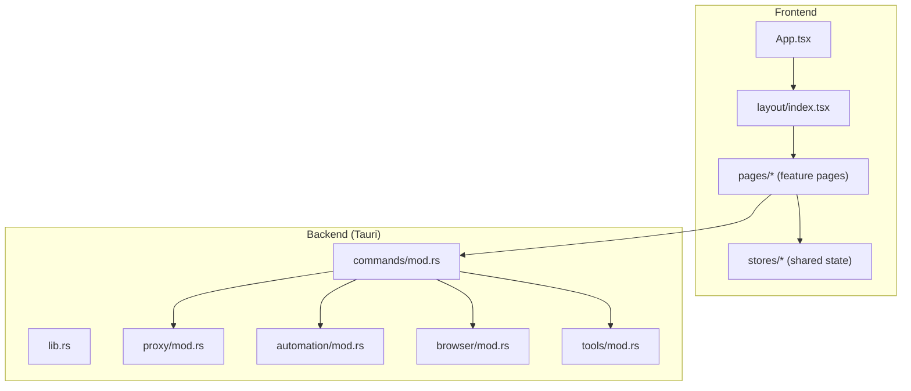
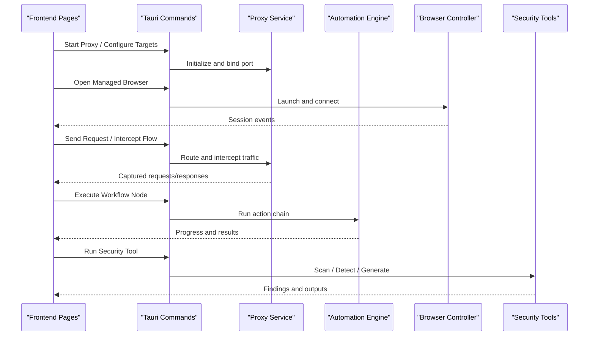
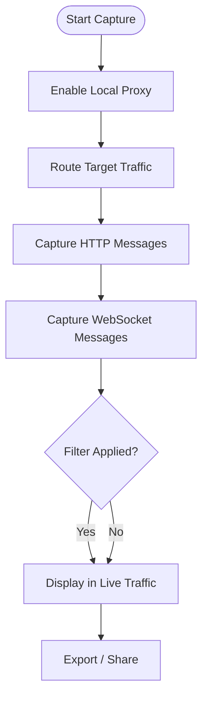
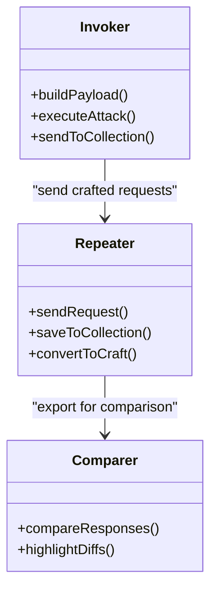
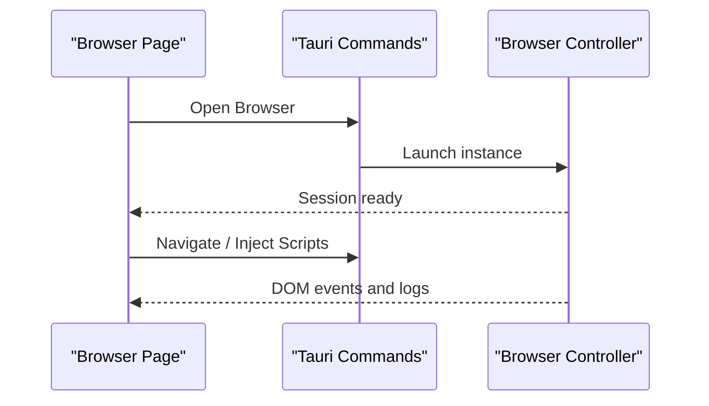
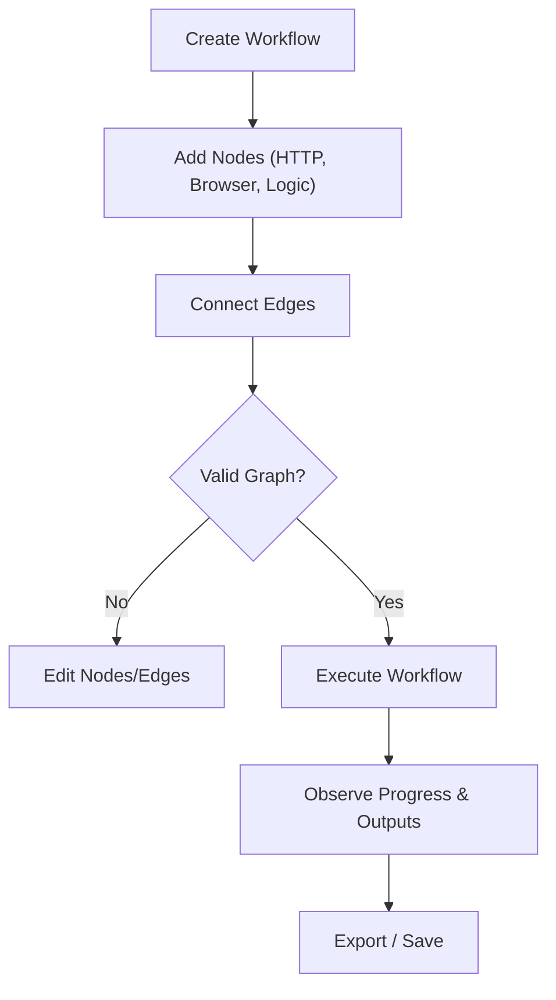
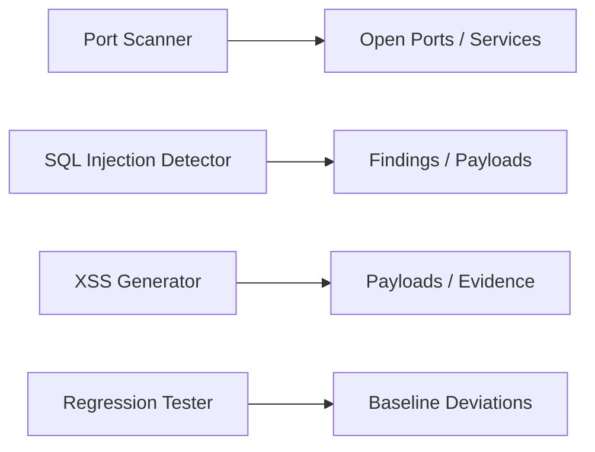
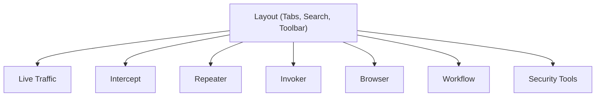
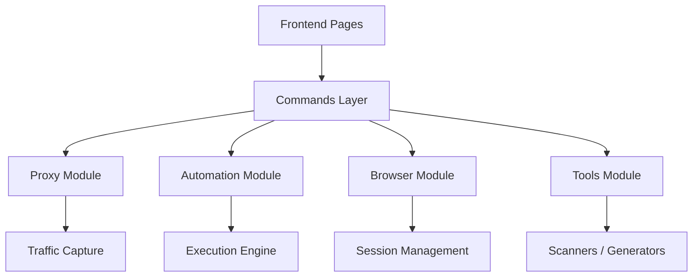

# Core Features

<cite>
**Referenced Files in This Document**
- [README.md](file://README.md)
- [App.tsx](file://src/App.tsx)
- [index.tsx](file://src/layout/index.tsx)
- [proxy-button.tsx](file://src/layout/proxy-button.tsx)
- [open-browser.tsx](file://src/layout/open-browser.tsx)
- [index.tsx](file://src/pages/live-traffic/index.tsx)
- [index.tsx](file://src/pages/intercept/index.tsx)
- [index.tsx](file://src/pages/repeater/index.tsx)
- [index.tsx](file://src/pages/invoker/index.tsx)
- [index.tsx](file://src/pages/browser/index.tsx)
- [index.tsx](file://src/pages/workflow/index.tsx)
- [index.tsx](file://src/pages/regression/index.tsx)
- [index.tsx](file://src/pages/port-scanner/index.tsx)
- [index.tsx](file://src/pages/sql-injection/index.tsx)
- [index.tsx](file://src/pages/xss-generator/index.tsx)
- [mod.rs](file://src-tauri/src/lib.rs)
- [mod.rs](file://src-tauri/src/proxy/mod.rs)
- [mod.rs](file://src-tauri/src/automation/mod.rs)
- [mod.rs](file://src-tauri/src/browser/mod.rs)
- [mod.rs](file://src-tauri/src/tools/mod.rs)
- [mod.rs](file://src-tauri/src/commands/mod.rs)
</cite>

## Table of Contents
1. Introduction
2. Project Structure
3. Core Components
4. Architecture Overview
5. Detailed Component Analysis
6. Dependency Analysis
7. Performance Considerations
8. Troubleshooting Guide
9. Conclusion

## Introduction
This document provides a comprehensive overview of Apprecon’s core features and how they integrate into a cohesive security testing and development workflow. It explains live traffic interception, API request/response manipulation, browser automation, workflow orchestration, and security testing tools. It also describes user interface patterns, navigation between tools, data sharing across components, and practical use cases for security assessment, API development, and debugging. Guidance is included to help you choose the right tool for specific tasks and combine multiple features for complex scenarios.

## Project Structure
Apprecon is a desktop application built with Tauri (Rust backend) and a React frontend. The frontend organizes features as pages under src/pages, each with its own components, hooks, lib utilities, constants, types, and an index entry point. Shared layout and navigation live under src/layout, while global state and cross-feature stores are under src/stores. The Rust backend exposes commands and services via src-tauri/src, including proxy handling, automation, browser control, and tool integrations.

**Diagram sources**
- [App.tsx](file://src/App.tsx)
- [index.tsx](file://src/layout/index.tsx)
- [index.tsx](file://src/pages/live-traffic/index.tsx)
- [index.tsx](file://src/pages/intercept/index.tsx)
- [index.tsx](file://src/pages/repeater/index.tsx)
- [index.tsx](file://src/pages/invoker/index.tsx)
- [index.tsx](file://src/pages/browser/index.tsx)
- [index.tsx](file://src/pages/workflow/index.tsx)
- [mod.rs](file://src-tauri/src/lib.rs)
- [mod.rs](file://src-tauri/src/commands/mod.rs)
- [mod.rs](file://src-tauri/src/proxy/mod.rs)
- [mod.rs](file://src-tauri/src/automation/mod.rs)
- [mod.rs](file://src-tauri/src/browser/mod.rs)
- [mod.rs](file://src-tauri/src/tools/mod.rs)

**Section sources**
- [README.md](file://README.md)
- [App.tsx](file://src/App.tsx)
- [index.tsx](file://src/layout/index.tsx)

## Core Components
Apprecon’s feature set centers around:
- Live Traffic Interception: Capture HTTP and WebSocket traffic from applications or browsers routed through the local proxy.
- API Request/Response Manipulation: Inspect, modify, replay, and compare requests/responses; manage collections and environments.
- Browser Automation: Launch and control a managed browser session for automated interactions and crawling.
- Workflow Orchestration: Build and execute multi-step workflows combining network calls, browser actions, and logic nodes.
- Security Testing Tools: Port scanning, SQL injection detection, XSS generation, regression testing, and more.

These components share common UI patterns (tabbed layouts, search, filters), centralized stores for cross-tool data, and a command layer that bridges frontend actions to backend services.

**Section sources**
- [index.tsx](file://src/pages/live-traffic/index.tsx)
- [index.tsx](file://src/pages/intercept/index.tsx)
- [index.tsx](file://src/pages/repeater/index.tsx)
- [index.tsx](file://src/pages/invoker/index.tsx)
- [index.tsx](file://src/pages/browser/index.tsx)
- [index.tsx](file://src/pages/workflow/index.tsx)
- [index.tsx](file://src/pages/regression/index.tsx)
- [index.tsx](file://src/pages/port-scanner/index.tsx)
- [index.tsx](file://src/pages/sql-injection/index.tsx)
- [index.tsx](file://src/pages/xss-generator/index.tsx)

## Architecture Overview
At runtime, the frontend renders feature pages and dispatches actions via Tauri commands. The backend orchestrates the proxy server, browser automation engine, and specialized tools. Shared stores keep state consistent across tabs and tools, enabling seamless transitions and data sharing.

**Diagram sources**
- [mod.rs](file://src-tauri/src/lib.rs)
- [mod.rs](file://src-tauri/src/commands/mod.rs)
- [mod.rs](file://src-tauri/src/proxy/mod.rs)
- [mod.rs](file://src-tauri/src/automation/mod.rs)
- [mod.rs](file://src-tauri/src/browser/mod.rs)
- [mod.rs](file://src-tauri/src/tools/mod.rs)

## Detailed Component Analysis

### Live Traffic Interception
Live traffic captures HTTP and WebSocket messages by routing application traffic through Apprecon’s local proxy. Users can filter, group, pin, and export captured entries. Integration points include target configuration, blacklist management, and real-time updates.

**Diagram sources**
- [index.tsx](file://src/pages/live-traffic/index.tsx)
- [mod.rs](file://src-tauri/src/proxy/mod.rs)

**Section sources**
- [index.tsx](file://src/pages/live-traffic/index.tsx)
- [mod.rs](file://src-tauri/src/proxy/mod.rs)

### API Request/Response Manipulation
The Repeater and Invoker enable crafting, sending, and analyzing requests. Collections and environments support variable substitution and reuse. Comparison tools allow side-by-side analysis of responses.

**Diagram sources**
- [index.tsx](file://src/pages/repeater/index.tsx)
- [index.tsx](file://src/pages/invoker/index.tsx)
- [index.tsx](file://src/pages/comparer/index.tsx)

**Section sources**
- [index.tsx](file://src/pages/repeater/index.tsx)
- [index.tsx](file://src/pages/invoker/index.tsx)

### Browser Automation
A managed browser session allows launching targets, capturing sessions, and automating interactions. Events flow back to the UI for inspection and integration with other tools.

**Diagram sources**
- [index.tsx](file://src/pages/browser/index.tsx)
- [mod.rs](file://src-tauri/src/browser/mod.rs)

**Section sources**
- [index.tsx](file://src/pages/browser/index.tsx)
- [mod.rs](file://src-tauri/src/browser/mod.rs)

### Workflow Orchestration
Workflows combine nodes representing actions like HTTP requests, browser steps, conditions, and loops. Execution progress and outputs are visualized and can be exported or reused.

**Diagram sources**
- [index.tsx](file://src/pages/workflow/index.tsx)
- [mod.rs](file://src-tauri/src/automation/mod.rs)

**Section sources**
- [index.tsx](file://src/pages/workflow/index.tsx)
- [mod.rs](file://src-tauri/src/automation/mod.rs)

### Security Testing Tools
Specialized tools assist in vulnerability discovery and validation:
- Port Scanner: Discover open ports and service banners.
- SQL Injection Detector: Identify potential injection points and payloads.
- XSS Generator: Generate payloads and test reflected/dominated vectors.
- Regression Tester: Automate repeated checks against known baselines.

**Diagram sources**
- [index.tsx](file://src/pages/port-scanner/index.tsx)
- [index.tsx](file://src/pages/sql-injection/index.tsx)
- [index.tsx](file://src/pages/xss-generator/index.tsx)
- [index.tsx](file://src/pages/regression/index.tsx)

**Section sources**
- [index.tsx](file://src/pages/port-scanner/index.tsx)
- [index.tsx](file://src/pages/sql-injection/index.tsx)
- [index.tsx](file://src/pages/xss-generator/index.tsx)
- [index.tsx](file://src/pages/regression/index.tsx)

### User Interface Patterns and Navigation
Common UI patterns include:
- Tabbed workspace for switching between tools without losing context.
- Global search to quickly navigate to endpoints, history items, or workflow nodes.
- Centralized stores for shared data such as targets, collections, and environment variables.
- Consistent toolbar actions (send, save, export, compare).

Navigation flows typically start from the main layout, which hosts proxy controls and quick-launch buttons for the browser and key tools.

**Diagram sources**
- [index.tsx](file://src/layout/index.tsx)
- [proxy-button.tsx](file://src/layout/proxy-button.tsx)
- [open-browser.tsx](file://src/layout/open-browser.tsx)

**Section sources**
- [index.tsx](file://src/layout/index.tsx)
- [proxy-button.tsx](file://src/layout/proxy-button.tsx)
- [open-browser.tsx](file://src/layout/open-browser.tsx)

### Data Sharing Across Components
Cross-cutting data includes:
- Targets and scopes for filtering and routing.
- Collections and environments for reusable request templates and variables.
- History and pinned items for quick access and collaboration.
- Logs and annotations for contextual notes and evidence.

These are managed by shared stores and exposed via triggers and hooks to keep UI components synchronized.

**Section sources**
- [index.tsx](file://src/pages/live-traffic/index.tsx)
- [index.tsx](file://src/pages/repeater/index.tsx)
- [index.tsx](file://src/pages/invoker/index.tsx)
- [index.tsx](file://src/pages/workflow/index.tsx)

## Dependency Analysis
The frontend depends on Tauri commands to interact with backend services. Backend modules encapsulate responsibilities:
- Proxy module handles traffic interception and response modification.
- Automation module executes workflows and sequences of actions.
- Browser module manages the controlled browser session.
- Tools module integrates specialized scanners and generators.

**Diagram sources**
- [mod.rs](file://src-tauri/src/lib.rs)
- [mod.rs](file://src-tauri/src/commands/mod.rs)
- [mod.rs](file://src-tauri/src/proxy/mod.rs)
- [mod.rs](file://src-tauri/src/automation/mod.rs)
- [mod.rs](file://src-tauri/src/browser/mod.rs)
- [mod.rs](file://src-tauri/src/tools/mod.rs)

**Section sources**
- [mod.rs](file://src-tauri/src/lib.rs)
- [mod.rs](file://src-tauri/src/commands/mod.rs)
- [mod.rs](file://src-tauri/src/proxy/mod.rs)
- [mod.rs](file://src-tauri/src/automation/mod.rs)
- [mod.rs](file://src-tauri/src/browser/mod.rs)
- [mod.rs](file://src-tauri/src/tools/mod.rs)

## Performance Considerations
- Use filters and blacklists in Live Traffic to reduce noise and improve responsiveness.
- Pin only essential requests to avoid large histories impacting memory.
- Batch operations in Workflows where possible to minimize round-trips.
- Limit concurrent scans in Port Scanner to balance speed and system load.
- Leverage collections and environments to avoid redundant request construction.

[No sources needed since this section provides general guidance]

## Troubleshooting Guide
Common issues and resolutions:
- Proxy not capturing traffic: Ensure the target app routes through the local proxy and certificates are installed if HTTPS is used.
- Browser session fails to launch: Verify permissions and dependencies for the managed browser instance.
- Workflow execution stalls: Check node configurations and connectivity; review execution logs for errors.
- Slow Live Traffic: Apply stricter filters and disable unnecessary capture channels.

For detailed diagnostics, consult the relevant page’s logs and backend command outputs.

**Section sources**
- [index.tsx](file://src/pages/live-traffic/index.tsx)
- [index.tsx](file://src/pages/browser/index.tsx)
- [index.tsx](file://src/pages/workflow/index.tsx)

## Conclusion
Apprecon unifies traffic interception, API manipulation, browser automation, workflow orchestration, and security testing into a single, cohesive desktop environment. By leveraging shared UI patterns, centralized stores, and a robust command layer, developers and security professionals can efficiently assess APIs, debug applications, automate tests, and discover vulnerabilities. Choose the appropriate tool for each task—Live Traffic for observation, Repeater/Invoker for crafting and sending requests, Browser for automation, Workflow for orchestration, and Security Tools for targeted assessments—and combine them to build powerful, repeatable workflows tailored to your needs.

[No sources needed since this section summarizes without analyzing specific files]