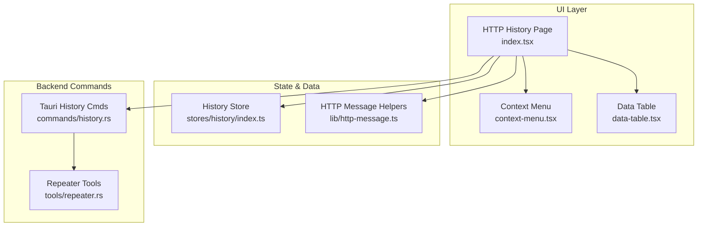
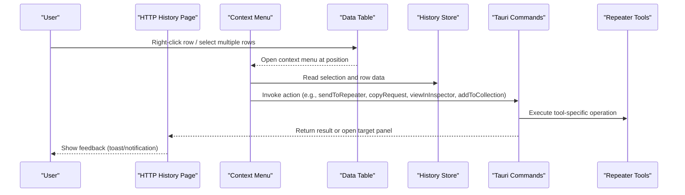
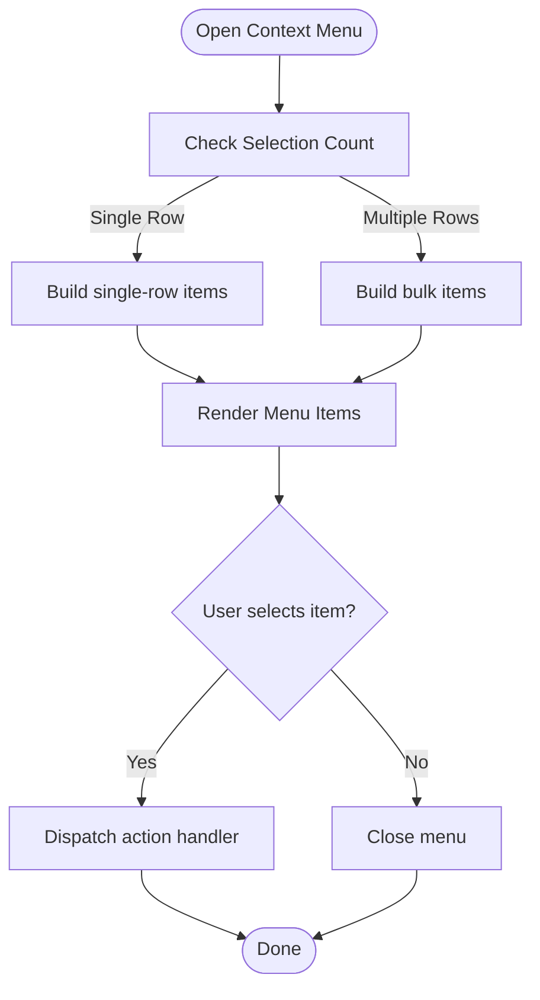
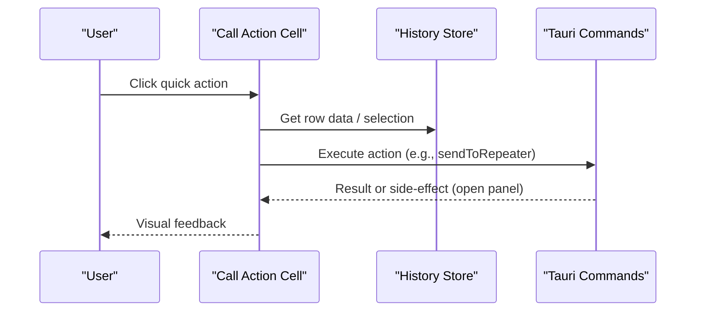
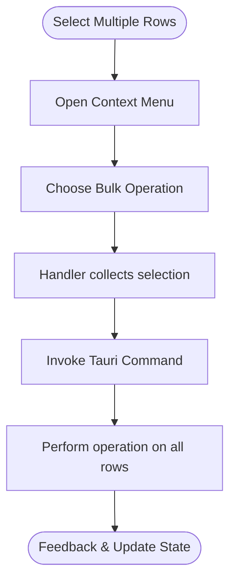
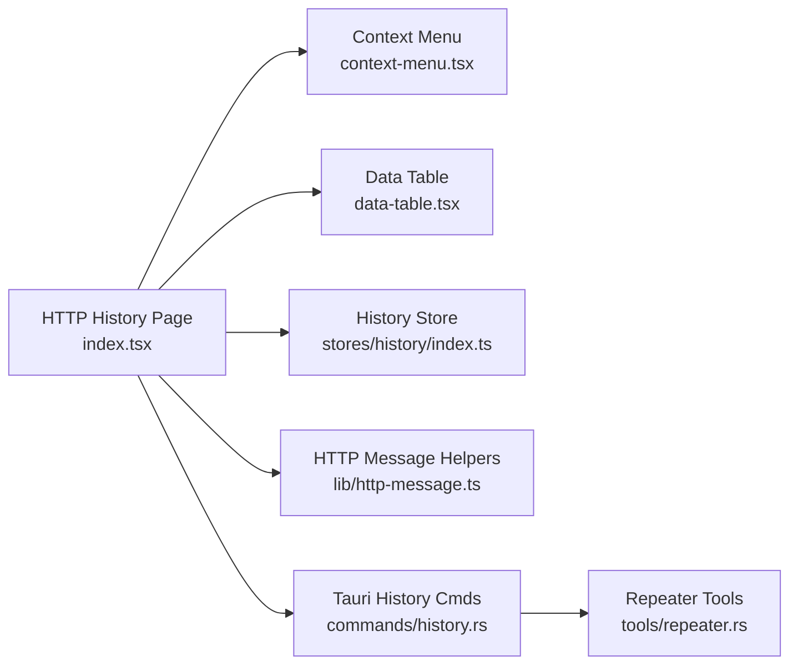

# Context Menu and Actions

<cite>
**Referenced Files in This Document**
- [context-menu.tsx](file://src/components/ui/context-menu.tsx)
- [data-table.tsx](file://src/components/ui/data-table.tsx)
- [http-history-search.tsx](file://src/layout/global-search/http-history-search.tsx)
- [index.tsx](file://src/pages/live-traffic/http-history/index.tsx)
- [components/](file://src/pages/live-traffic/http-history/components/)
- [lib/http-message.ts](file://src/lib/http-message.ts)
- [stores/history/index.ts](file://src/stores/history/index.ts)
- [commands/history.rs](file://src-tauri/src/commands/history.rs)
- [tools/repeater.rs](file://src-tauri/src/tools/repeater.rs)
</cite>

## Table of Contents
1. [Introduction](#introduction)
2. [Project Structure](#project-structure)
3. [Core Components](#core-components)
4. [Architecture Overview](#architecture-overview)
5. [Detailed Component Analysis](#detailed-component-analysis)
6. [Dependency Analysis](#dependency-analysis)
7. [Performance Considerations](#performance-considerations)
8. [Troubleshooting Guide](#troubleshooting-guide)
9. [Conclusion](#conclusion)
10. [Appendices](#appendices)

## Introduction
This document explains the context menu system and action buttons available in the HTTP history viewer. It covers right-click context menus with options such as “Send to Repeater,” “Copy Request,” “View in Inspector,” and “Add to Collection.” It also documents the call action cell for quick actions on individual entries, bulk operations for selected rows, and keyboard shortcuts for common tasks. Finally, it provides guidance on customizing context menu items, integrating with external tools, and creating automated workflows based on historical requests.

## Project Structure
The HTTP history viewer is part of the live traffic module and integrates with shared UI primitives (context menu, data table), stores for history state, and Tauri commands for cross-process actions like sending to Repeater or opening the Inspector.

**Diagram sources**
- [index.tsx](file://src/pages/live-traffic/http-history/index.tsx)
- [context-menu.tsx](file://src/components/ui/context-menu.tsx)
- [data-table.tsx](file://src/components/ui/data-table.tsx)
- [index.ts](file://src/stores/history/index.ts)
- [http-message.ts](file://src/lib/http-message.ts)
- [history.rs](file://src-tauri/src/commands/history.rs)
- [repeater.rs](file://src-tauri/src/tools/repeater.rs)

**Section sources**
- [index.tsx](file://src/pages/live-traffic/http-history/index.tsx)
- [context-menu.tsx](file://src/components/ui/context-menu.tsx)
- [data-table.tsx](file://src/components/ui/data-table.tsx)
- [index.ts](file://src/stores/history/index.ts)
- [http-message.ts](file://src/lib/http-message.ts)
- [history.rs](file://src-tauri/src/commands/history.rs)
- [repeater.rs](file://src-tauri/src/tools/repeater.rs)

## Core Components
- Context Menu: Provides a right-click menu over history rows with actions like Send to Repeater, Copy Request, View in Inspector, Add to Collection, and more.
- Data Table: Renders the history list, supports row selection, sorting, filtering, and exposes per-row action cells.
- History Store: Holds captured requests, selection state, filters, and pinned/highlighted groups.
- HTTP Message Helpers: Utilities to serialize, parse, and transform request/response payloads for copy/export actions.
- Tauri Commands: Bridge to backend capabilities such as sending to Repeater, opening Inspector, and managing collections.

Key responsibilities:
- Context menu builds an array of menu items dynamically based on selection and row context.
- Data table renders rows and wires up click handlers for both single-row and multi-row selections.
- Store updates reflect user actions (selection changes, pinning, grouping).
- Backend commands execute cross-process operations triggered by UI actions.

**Section sources**
- [context-menu.tsx](file://src/components/ui/context-menu.tsx)
- [data-table.tsx](file://src/components/ui/data-table.tsx)
- [index.ts](file://src/stores/history/index.ts)
- [http-message.ts](file://src/lib/http-message.ts)
- [history.rs](file://src-tauri/src/commands/history.rs)
- [repeater.rs](file://src-tauri/src/tools/repeater.rs)

## Architecture Overview
The HTTP history viewer composes UI components with state management and backend commands to deliver interactive actions.

**Diagram sources**
- [index.tsx](file://src/pages/live-traffic/http-history/index.tsx)
- [context-menu.tsx](file://src/components/ui/context-menu.tsx)
- [data-table.tsx](file://src/components/ui/data-table.tsx)
- [index.ts](file://src/stores/history/index.ts)
- [history.rs](file://src-tauri/src/commands/history.rs)
- [repeater.rs](file://src-tauri/src/tools/repeater.rs)

## Detailed Component Analysis

### Context Menu System
- Behavior:
  - Opens on right-click over a history row or on toolbar actions when rows are selected.
  - Presents contextual options based on whether one or multiple rows are selected.
  - Common options include:
    - Send to Repeater
    - Copy Request (headers, body, full message)
    - View in Inspector
    - Add to Collection
    - Duplicate, Delete, Pin/Unpin, Grouping helpers
- Customization:
  - Extend the menu item registry to add new actions.
  - Conditionally show/hide items based on selection count or row properties.
  - Integrate external tools via Tauri commands invoked from menu callbacks.

**Diagram sources**
- [context-menu.tsx](file://src/components/ui/context-menu.tsx)
- [data-table.tsx](file://src/components/ui/data-table.tsx)
- [index.ts](file://src/stores/history/index.ts)

**Section sources**
- [context-menu.tsx](file://src/components/ui/context-menu.tsx)
- [data-table.tsx](file://src/components/ui/data-table.tsx)
- [index.ts](file://src/stores/history/index.ts)

### Call Action Cell (Quick Actions)
- Purpose: Provide one-click actions directly on each row without opening the context menu.
- Typical actions:
  - Send to Repeater
  - Copy Request
  - View in Inspector
  - Pin/Unpin
  - Quick delete or duplicate
- Implementation notes:
  - Each cell binds to a handler that reads the row’s data from the store and invokes the appropriate command.
  - For bulk operations, use the table’s selection API to act on all selected rows.

**Diagram sources**
- [data-table.tsx](file://src/components/ui/data-table.tsx)
- [index.ts](file://src/stores/history/index.ts)
- [history.rs](file://src-tauri/src/commands/history.rs)

**Section sources**
- [data-table.tsx](file://src/components/ui/data-table.tsx)
- [index.ts](file://src/stores/history/index.ts)
- [history.rs](file://src-tauri/src/commands/history.rs)

### Bulk Operations for Selected Rows
- Supported operations:
  - Send selected to Repeater
  - Copy selected requests
  - Add selected to collection
  - Bulk pin/unpin or delete
- Workflow:
  - Select multiple rows using Shift/Ctrl/Cmd clicks or drag selection.
  - Use the context menu or toolbar to perform bulk actions.
  - The store aggregates selection and passes it to the command layer.

**Diagram sources**
- [data-table.tsx](file://src/components/ui/data-table.tsx)
- [context-menu.tsx](file://src/components/ui/context-menu.tsx)
- [index.ts](file://src/stores/history/index.ts)
- [history.rs](file://src-tauri/src/commands/history.rs)

**Section sources**
- [data-table.tsx](file://src/components/ui/data-table.tsx)
- [context-menu.tsx](file://src/components/ui/context-menu.tsx)
- [index.ts](file://src/stores/history/index.ts)
- [history.rs](file://src-tauri/src/commands/history.rs)

### Keyboard Shortcuts
- Common shortcuts:
  - Open context menu on focused row
  - Copy request payload
  - Send to Repeater
  - View in Inspector
  - Toggle pin
  - Clear selection
- Notes:
  - Shortcuts should be documented in-app and accessible via help overlay.
  - Ensure focus management so shortcuts apply to the correct component.

[No sources needed since this section provides general guidance]

### Examples: Customizing Context Menu Items
- Adding a new item:
  - Register a new menu entry with label, visibility condition, and callback.
  - Callback can invoke a Tauri command or update local state.
- Integrating with external tools:
  - Use Tauri commands to call external binaries or scripts.
  - Pass serialized request data as arguments or via temporary files.
- Automated workflows:
  - Chain multiple actions (copy, send to Repeater, then run a script).
  - Use webhooks or file watchers to trigger downstream processes.

[No sources needed since this section provides general guidance]

## Dependency Analysis
The HTTP history viewer depends on shared UI components, state stores, and Tauri commands.

**Diagram sources**
- [index.tsx](file://src/pages/live-traffic/http-history/index.tsx)
- [context-menu.tsx](file://src/components/ui/context-menu.tsx)
- [data-table.tsx](file://src/components/ui/data-table.tsx)
- [index.ts](file://src/stores/history/index.ts)
- [http-message.ts](file://src/lib/http-message.ts)
- [history.rs](file://src-tauri/src/commands/history.rs)
- [repeater.rs](file://src-tauri/src/tools/repeater.rs)

**Section sources**
- [index.tsx](file://src/pages/live-traffic/http-history/index.tsx)
- [context-menu.tsx](file://src/components/ui/context-menu.tsx)
- [data-table.tsx](file://src/components/ui/data-table.tsx)
- [index.ts](file://src/stores/history/index.ts)
- [http-message.ts](file://src/lib/http-message.ts)
- [history.rs](file://src-tauri/src/commands/history.rs)
- [repeater.rs](file://src-tauri/src/tools/repeater.rs)

## Performance Considerations
- Virtualization: Ensure large history lists are virtualized to avoid rendering overhead.
- Debounce heavy operations: Delay expensive actions (like bulk copying) until necessary.
- Minimize re-renders: Keep selection and menu state localized; batch updates where possible.
- Efficient serialization: Use streaming or chunked approaches for large payloads when copying or exporting.

[No sources needed since this section provides general guidance]

## Troubleshooting Guide
- Context menu not appearing:
  - Verify event listeners are attached to rows and that z-index stacking is correct.
  - Check for conflicting global context menus.
- Actions do nothing:
  - Confirm Tauri commands are registered and permissions allow the operation.
  - Inspect console logs for errors during serialization or command invocation.
- Bulk operations slow:
  - Profile selection handling and ensure operations are non-blocking.
  - Consider offloading heavy work to background threads via Tauri.

**Section sources**
- [context-menu.tsx](file://src/components/ui/context-menu.tsx)
- [data-table.tsx](file://src/components/ui/data-table.tsx)
- [history.rs](file://src-tauri/src/commands/history.rs)

## Conclusion
The HTTP history viewer’s context menu and action system provide powerful, flexible interactions for working with captured requests. By leveraging shared UI components, robust state management, and Tauri-backed commands, users can quickly send requests to Repeater, copy payloads, inspect details, and integrate with external tools. Extending the menu and automating workflows enables tailored productivity pipelines suited to diverse testing and development needs.

[No sources needed since this section summarizes without analyzing specific files]

## Appendices
- Integration tips:
  - Use Tauri commands to call CLI tools or scripts with serialized request data.
  - Persist custom menu configurations in app settings for team consistency.
- Best practices:
  - Validate inputs before invoking backend commands.
  - Provide clear user feedback for long-running operations.
  - Keep keyboard shortcuts consistent across modules.

[No sources needed since this section provides general guidance]