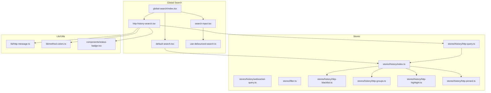
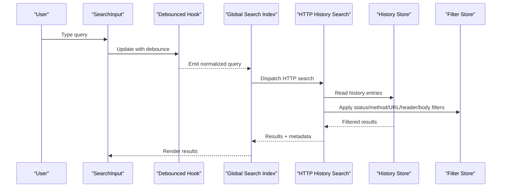
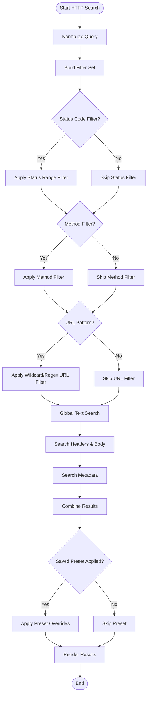
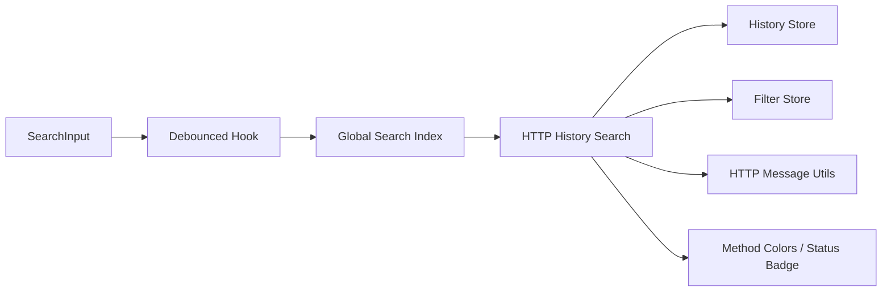

# Filtering and Search

<cite>
**Referenced Files in This Document**
- [http-history-search.tsx](file://src/layout/global-search/http-history-search.tsx)
- [default-search.tsx](file://src/layout/global-search/default-search.tsx)
- [search-input.tsx](file://src/layout/global-search/search-input.tsx)
- [use-debounced-search.ts](file://src/layout/global-search/use-debounced-search.ts)
- [index.tsx](file://src/layout/global-search/index.tsx)
- [http-query.ts](file://src/stores/history/http-query.ts)
- [websocket-query.ts](file://src/stores/history/websocket-query.ts)
- [index.ts](file://src/stores/history/index.ts)
- [http-blacklist.ts](file://src/stores/history/http-blacklist.ts)
- [http-groups.ts](file://src/stores/history/http-groups.ts)
- [http-highlight.ts](file://src/stores/history/http-highlight.ts)
- [http-pinned.ts](file://src/stores/history/http-pinned.ts)
- [filter.ts](file://src/stores/filter.ts)
- [http-message.ts](file://src/lib/http-message.ts)
- [method-colors.ts](file://src/lib/method-colors.ts)
- [status-badge.tsx](file://src/components/status-badge.tsx)
</cite>

## Table of Contents
1. [Introduction](#introduction)
2. [Project Structure](#project-structure)
3. [Core Components](#core-components)
4. [Architecture Overview](#architecture-overview)
5. [Detailed Component Analysis](#detailed-component-analysis)
6. [Dependency Analysis](#dependency-analysis)
7. [Performance Considerations](#performance-considerations)
8. [Troubleshooting Guide](#troubleshooting-guide)
9. [Conclusion](#conclusion)
10. [Appendices](#appendices)

## Introduction
This document explains the HTTP history filtering and search system, focusing on:
- Filter panel capabilities: status code ranges (2xx, 3xx, 4xx, 5xx), HTTP method filters (GET, POST, PUT, DELETE), and URL pattern matching with wildcards and regex.
- Global search across all fields: headers, body content, and metadata.
- Advanced query building: boolean operators, field-specific searches, and saved filter presets.
- Real-time performance considerations and integration with the URL bar for quick access.

The goal is to help users efficiently locate specific requests within large traffic histories while maintaining responsive UI behavior.

## Project Structure
The filtering and search functionality spans UI components, global search orchestration, debouncing utilities, and persistent stores for queries and related features like blacklist, groups, highlights, and pinned items.

**Diagram sources**
- [index.tsx](file://src/layout/global-search/index.tsx)
- [http-history-search.tsx](file://src/layout/global-search/http-history-search.tsx)
- [default-search.tsx](file://src/layout/global-search/default-search.tsx)
- [search-input.tsx](file://src/layout/global-search/search-input.tsx)
- [use-debounced-search.ts](file://src/layout/global-search/use-debounced-search.ts)
- [http-query.ts](file://src/stores/history/http-query.ts)
- [websocket-query.ts](file://src/stores/history/websocket-query.ts)
- [index.ts](file://src/stores/history/index.ts)
- [http-blacklist.ts](file://src/stores/history/http-blacklist.ts)
- [http-groups.ts](file://src/stores/history/http-groups.ts)
- [http-highlight.ts](file://src/stores/history/http-highlight.ts)
- [http-pinned.ts](file://src/stores/history/http-pinned.ts)
- [http-message.ts](file://src/lib/http-message.ts)
- [method-colors.ts](file://src/lib/method-colors.ts)
- [status-badge.tsx](file://src/components/status-badge.tsx)

**Section sources**
- [index.tsx](file://src/layout/global-search/index.tsx)
- [http-history-search.tsx](file://src/layout/global-search/http-history-search.tsx)
- [default-search.tsx](file://src/layout/global-search/default-search.tsx)
- [search-input.tsx](file://src/layout/global-search/search-input.tsx)
- [use-debounced-search.ts](file://src/layout/global-search/use-debounced-search.ts)
- [http-query.ts](file://src/stores/history/http-query.ts)
- [websocket-query.ts](file://src/stores/history/websocket-query.ts)
- [index.ts](file://src/stores/history/index.ts)
- [http-blacklist.ts](file://src/stores/history/http-blacklist.ts)
- [http-groups.ts](file://src/stores/history/http-groups.ts)
- [http-highlight.ts](file://src/stores/history/http-highlight.ts)
- [http-pinned.ts](file://src/stores/history/http-pinned.ts)
- [http-message.ts](file://src/lib/http-message.ts)
- [method-colors.ts](file://src/lib/method-colors.ts)
- [status-badge.tsx](file://src/components/status-badge.tsx)

## Core Components
- Global search orchestrator: coordinates between different search backends and input handling.
- HTTP history search component: provides filter panel and result rendering for HTTP traffic.
- Default search component: fallback or general-purpose search logic.
- Search input: handles user input, keyboard shortcuts, and debounced updates.
- Debounced search hook: reduces re-renders and query churn during typing.
- Stores:
  - http-query: manages HTTP-specific query state and persistence.
  - websocket-query: manages WebSocket-specific query state.
  - history index: centralizes history data access and operations.
  - filter: shared filter state used across modules.
  - blacklist/groups/highlight/pinned: auxiliary features that affect visibility and presentation.

Key responsibilities:
- Parse and normalize user queries into structured filters.
- Apply filters against HTTP message properties (status codes, methods, URLs, headers, bodies).
- Persist and restore saved filter presets.
- Provide real-time results with performance safeguards.

**Section sources**
- [index.tsx](file://src/layout/global-search/index.tsx)
- [http-history-search.tsx](file://src/layout/global-search/http-history-search.tsx)
- [default-search.tsx](file://src/layout/global-search/default-search.tsx)
- [search-input.tsx](file://src/layout/global-search/search-input.tsx)
- [use-debounced-search.ts](file://src/layout/global-search/use-debounced-search.ts)
- [http-query.ts](file://src/stores/history/http-query.ts)
- [websocket-query.ts](file://src/stores/history/websocket-query.ts)
- [index.ts](file://src/stores/history/index.ts)
- [filter.ts](file://src/stores/filter.ts)
- [http-blacklist.ts](file://src/stores/history/http-blacklist.ts)
- [http-groups.ts](file://src/stores/history/http-groups.ts)
- [http-highlight.ts](file://src/stores/history/http-highlight.ts)
- [http-pinned.ts](file://src/stores/history/http-pinned.ts)

## Architecture Overview
The system follows a layered architecture:
- UI layer: search input and result panels.
- Orchestration layer: global search controller coordinating inputs and backends.
- Query layer: parsing and normalization of queries into structured filters.
- Data layer: stores managing history data, query state, and auxiliary features.

**Diagram sources**
- [search-input.tsx](file://src/layout/global-search/search-input.tsx)
- [use-debounced-search.ts](file://src/layout/global-search/use-debounced-search.ts)
- [index.tsx](file://src/layout/global-search/index.tsx)
- [http-history-search.tsx](file://src/layout/global-search/http-history-search.tsx)
- [index.ts](file://src/stores/history/index.ts)
- [filter.ts](file://src/stores/filter.ts)

## Detailed Component Analysis

### HTTP History Search Component
Responsibilities:
- Render filter panel with status code ranges, HTTP methods, and URL pattern matching.
- Execute global search across headers, body content, and metadata.
- Support advanced query syntax including boolean operators and field-specific searches.
- Integrate saved filter presets for quick reuse.

Filter panel details:
- Status code filters: 2xx, 3xx, 4xx, 5xx toggles.
- Method filters: GET, POST, PUT, DELETE toggles.
- URL pattern matching: supports wildcards and regex patterns.

Global search:
- Searches across request/response headers, body text, and metadata such as timestamps and IDs.
- Supports field-specific prefixes to narrow scope (e.g., header names, URL segments).

Advanced query building:
- Boolean operators: AND, OR, NOT for combining conditions.
- Field-specific searches: target headers, body, URL, method, status code explicitly.
- Saved presets: store and load complex queries for repeated use.

**Diagram sources**
- [http-history-search.tsx](file://src/layout/global-search/http-history-search.tsx)
- [http-query.ts](file://src/stores/history/http-query.ts)
- [index.ts](file://src/stores/history/index.ts)
- [filter.ts](file://src/stores/filter.ts)

**Section sources**
- [http-history-search.tsx](file://src/layout/global-search/http-history-search.tsx)
- [http-query.ts](file://src/stores/history/http-query.ts)
- [index.ts](file://src/stores/history/index.ts)
- [filter.ts](file://src/stores/filter.ts)

### Global Search Orchestrator
Responsibilities:
- Manage active search backend selection (HTTP vs WebSocket vs default).
- Coordinate input events and dispatch normalized queries.
- Maintain focus and keyboard shortcuts for quick actions.

Integration points:
- Connects to search input and debounced hook.
- Routes queries to appropriate search components.
- Aggregates results and displays them consistently.

**Section sources**
- [index.tsx](file://src/layout/global-search/index.tsx)
- [search-input.tsx](file://src/layout/global-search/search-input.tsx)
- [use-debounced-search.ts](file://src/layout/global-search/use-debounced-search.ts)

### Search Input and Debounce
Responsibilities:
- Capture user input and handle keyboard navigation.
- Debounce rapid keystrokes to reduce processing overhead.
- Emit normalized queries to the orchestrator.

Performance considerations:
- Debounce interval tuned for responsiveness without excessive re-renders.
- Input validation and sanitization before query emission.

**Section sources**
- [search-input.tsx](file://src/layout/global-search/search-input.tsx)
- [use-debounced-search.ts](file://src/layout/global-search/use-debounced-search.ts)

### Stores and Query State
Responsibilities:
- Maintain HTTP and WebSocket query states.
- Centralize history data access and operations.
- Manage auxiliary features affecting visibility and presentation.

Key stores:
- http-query: HTTP-specific query state and persistence.
- websocket-query: WebSocket-specific query state.
- history index: core history data management.
- filter: shared filter state across modules.
- blacklist/groups/highlight/pinned: visibility and presentation controls.

**Section sources**
- [http-query.ts](file://src/stores/history/http-query.ts)
- [websocket-query.ts](file://src/stores/history/websocket-query.ts)
- [index.ts](file://src/stores/history/index.ts)
- [filter.ts](file://src/stores/filter.ts)
- [http-blacklist.ts](file://src/stores/history/http-blacklist.ts)
- [http-groups.ts](file://src/stores/history/http-groups.ts)
- [http-highlight.ts](file://src/stores/history/http-highlight.ts)
- [http-pinned.ts](file://src/stores/history/http-pinned.ts)

### Supporting Utilities
- HTTP message utilities: parse and format HTTP messages for search and display.
- Method colors: assign visual indicators based on HTTP methods.
- Status badge: render status code badges with color coding.

**Section sources**
- [http-message.ts](file://src/lib/http-message.ts)
- [method-colors.ts](file://src/lib/method-colors.ts)
- [status-badge.tsx](file://src/components/status-badge.tsx)

## Dependency Analysis
The filtering and search system has clear dependencies:
- UI components depend on stores for data and state.
- Orchestrator depends on input and debounce utilities.
- HTTP search depends on message utilities and visual helpers.

**Diagram sources**
- [search-input.tsx](file://src/layout/global-search/search-input.tsx)
- [use-debounced-search.ts](file://src/layout/global-search/use-debounced-search.ts)
- [index.tsx](file://src/layout/global-search/index.tsx)
- [http-history-search.tsx](file://src/layout/global-search/http-history-search.tsx)
- [index.ts](file://src/stores/history/index.ts)
- [filter.ts](file://src/stores/filter.ts)
- [http-message.ts](file://src/lib/http-message.ts)
- [method-colors.ts](file://src/lib/method-colors.ts)
- [status-badge.tsx](file://src/components/status-badge.tsx)

**Section sources**
- [search-input.tsx](file://src/layout/global-search/search-input.tsx)
- [use-debounced-search.ts](file://src/layout/global-search/use-debounced-search.ts)
- [index.tsx](file://src/layout/global-search/index.tsx)
- [http-history-search.tsx](file://src/layout/global-search/http-history-search.tsx)
- [index.ts](file://src/stores/history/index.ts)
- [filter.ts](file://src/stores/filter.ts)
- [http-message.ts](file://src/lib/http-message.ts)
- [method-colors.ts](file://src/lib/method-colors.ts)
- [status-badge.tsx](file://src/components/status-badge.tsx)

## Performance Considerations
- Debounce strategy: minimize re-renders during rapid typing by batching updates.
- Incremental filtering: apply filters progressively to avoid full scans on each keystroke.
- Indexed search: consider indexing frequently searched fields (headers, body) for faster lookups.
- Virtualization: render only visible results to handle large datasets efficiently.
- Caching: cache parsed queries and intermediate results to reduce recomputation.
- Memory management: clean up unused subscriptions and timers to prevent leaks.

[No sources needed since this section provides general guidance]

## Troubleshooting Guide
Common issues and resolutions:
- Slow search performance: check debounce settings and consider optimizing filter application order.
- Incorrect results: verify query parsing and ensure proper normalization of inputs.
- Missing fields in search: confirm that headers and body content are included in the search scope.
- Preset conflicts: review saved presets for overlapping or contradictory conditions.
- Integration problems: validate URL bar integration and keyboard shortcuts for expected behavior.

Debugging tips:
- Log query normalization steps to identify parsing errors.
- Inspect filter application sequence to ensure correct precedence.
- Use browser dev tools to monitor re-renders and memory usage.

**Section sources**
- [http-history-search.tsx](file://src/layout/global-search/http-history-search.tsx)
- [http-query.ts](file://src/stores/history/http-query.ts)
- [index.ts](file://src/stores/history/index.ts)
- [filter.ts](file://src/stores/filter.ts)

## Conclusion
The HTTP history filtering and search system provides a robust, performant solution for navigating large volumes of traffic data. With comprehensive filter options, global search capabilities, and advanced query building, users can efficiently locate specific requests. The modular architecture ensures maintainability and scalability, while performance optimizations keep the interface responsive under heavy usage.

[No sources needed since this section summarizes without analyzing specific files]

## Appendices

### Examples of Complex Queries
- Find all 4xx errors from POST requests to URLs containing "/api/v2":
  - Use status code filter for 4xx, method filter for POST, and URL pattern with wildcard "/api/v2".
- Search for JSON responses containing "error" in headers or body:
  - Use global search with field-specific targeting for headers and body content.
- Combine boolean operators to exclude specific domains:
  - Use AND/OR/NOT to refine search results based on domain patterns.

[No sources needed since this section provides conceptual examples]

### Integration with URL Bar
- Quick access: type queries directly in the URL bar for immediate search results.
- Keyboard shortcuts: use predefined shortcuts for common search operations.
- Contextual suggestions: leverage autocomplete based on recent queries and popular patterns.

[No sources needed since this section provides conceptual guidance]