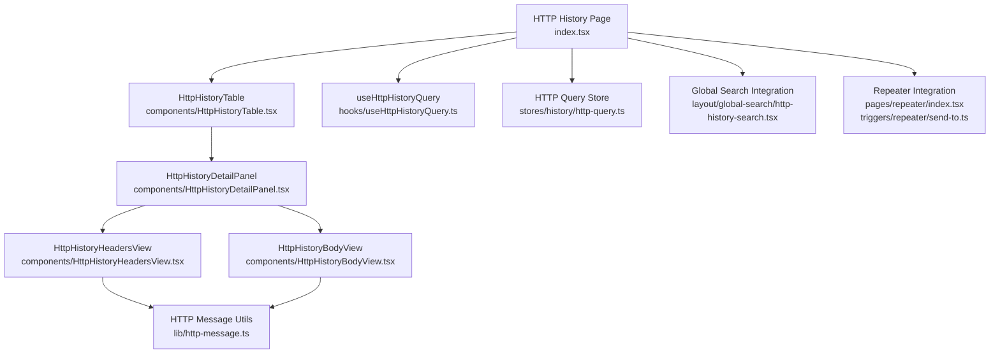
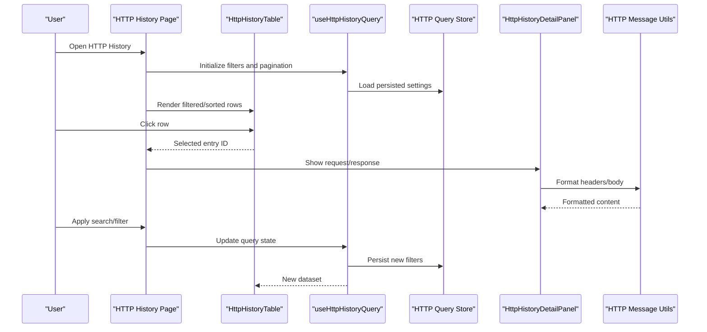
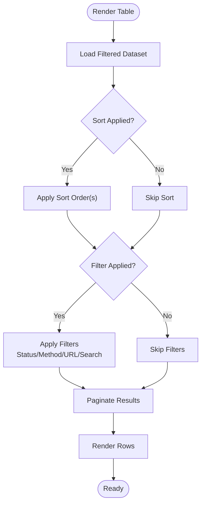
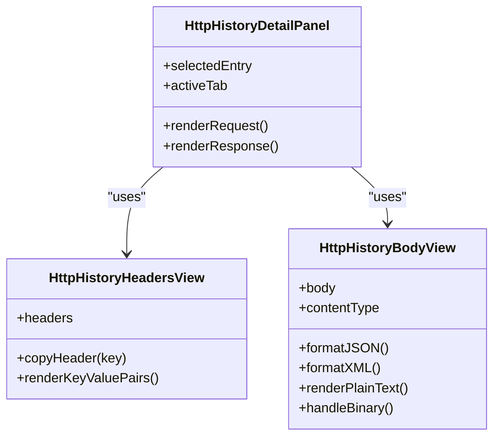
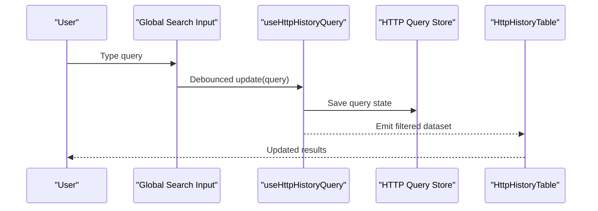
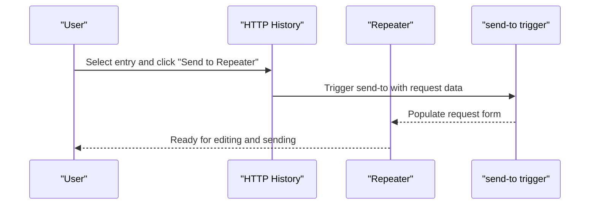
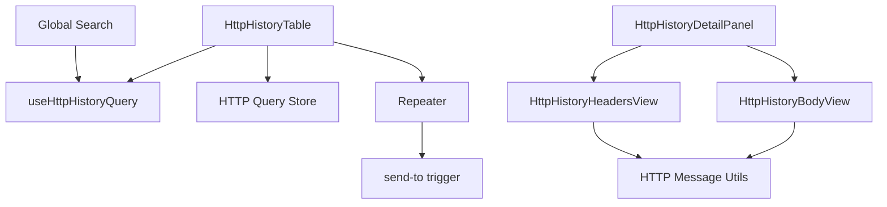

# HTTP History Viewer

<cite>
**Referenced Files in This Document**
- [http-history-search.tsx](file://src/layout/global-search/http-history-search.tsx)
- [index.tsx](file://src/pages/live-traffic/http-history/index.tsx)
- [components/HttpHistoryTable.tsx](file://src/pages/live-traffic/http-history/components/HttpHistoryTable.tsx)
- [components/HttpHistoryDetailPanel.tsx](file://src/pages/live-traffic/http-history/components/HttpHistoryDetailPanel.tsx)
- [components/HttpHistoryHeadersView.tsx](file://src/pages/live-traffic/http-history/components/HttpHistoryHeadersView.tsx)
- [components/HttpHistoryBodyView.tsx](file://src/pages/live-traffic/http-history/components/HttpHistoryBodyView.tsx)
- [hooks/useHttpHistoryQuery.ts](file://src/pages/live-traffic/http-history/hooks/useHttpHistoryQuery.ts)
- [stores/history/http-query.ts](file://src/stores/history/http-query.ts)
- [stores/history/http-pinned.ts](file://src/stores/history/http-pinned.ts)
- [stores/history/http-highlight.ts](file://src/stores/history/http-highlight.ts)
- [lib/http-message.ts](file://src/lib/http-message.ts)
- [pages/repeater/index.tsx](file://src/pages/repeater/index.tsx)
- [triggers/repeater/send-to.ts](file://src/triggers/repeater/send-to.ts)
</cite>

## Table of Contents
1. [Introduction](#introduction)
2. [Project Structure](#project-structure)
3. [Core Components](#core-components)
4. [Architecture Overview](#architecture-overview)
5. [Detailed Component Analysis](#detailed-component-analysis)
6. [Dependency Analysis](#dependency-analysis)
7. [Performance Considerations](#performance-considerations)
8. [Troubleshooting Guide](#troubleshooting-guide)
9. [Conclusion](#conclusion)
10. [Appendices](#appendices)

## Introduction
The HTTP History Viewer is a table-based interface for browsing captured HTTP requests and responses within Apprecon. It provides powerful filtering, sorting, and search across all fields, along with a detailed log entry view that lets you inspect headers and bodies in multiple formats (JSON, XML, plain text), and handle binary data safely. The viewer integrates with other tools such as the Repeater to quickly send captured requests for modification and re-execution.

## Project Structure
The HTTP History Viewer spans UI components, hooks, stores, and shared utilities:
- Page entry point orchestrates layout and state
- Table component renders the history list with columns, sorting, and selection
- Detail panel shows request/response inspection panels
- Header and body viewers support formatting and binary handling
- Query hook and stores manage filtering, pagination, and persistence
- Utilities parse and format HTTP messages

**Diagram sources**
- [index.tsx](file://src/pages/live-traffic/http-history/index.tsx)
- [components/HttpHistoryTable.tsx](file://src/pages/live-traffic/http-history/components/HttpHistoryTable.tsx)
- [hooks/useHttpHistoryQuery.ts](file://src/pages/live-traffic/http-history/hooks/useHttpHistoryQuery.ts)
- [stores/history/http-query.ts](file://src/stores/history/http-query.ts)
- [components/HttpHistoryDetailPanel.tsx](file://src/pages/live-traffic/http-history/components/HttpHistoryDetailPanel.tsx)
- [components/HttpHistoryHeadersView.tsx](file://src/pages/live-traffic/http-history/components/HttpHistoryHeadersView.tsx)
- [components/HttpHistoryBodyView.tsx](file://src/pages/live-traffic/http-history/components/HttpHistoryBodyView.tsx)
- [lib/http-message.ts](file://src/lib/http-message.ts)
- [http-history-search.tsx](file://src/layout/global-search/http-history-search.tsx)
- [pages/repeater/index.tsx](file://src/pages/repeater/index.tsx)
- [triggers/repeater/send-to.ts](file://src/triggers/repeater/send-to.ts)

**Section sources**
- [index.tsx](file://src/pages/live-traffic/http-history/index.tsx)
- [components/HttpHistoryTable.tsx](file://src/pages/live-traffic/http-history/components/HttpHistoryTable.tsx)
- [hooks/useHttpHistoryQuery.ts](file://src/pages/live-traffic/http-history/hooks/useHttpHistoryQuery.ts)
- [stores/history/http-query.ts](file://src/stores/history/http-query.ts)
- [components/HttpHistoryDetailPanel.tsx](file://src/pages/live-traffic/http-history/components/HttpHistoryDetailPanel.tsx)
- [components/HttpHistoryHeadersView.tsx](file://src/pages/live-traffic/http-history/components/HttpHistoryHeadersView.tsx)
- [components/HttpHistoryBodyView.tsx](file://src/pages/live-traffic/http-history/components/HttpHistoryBodyView.tsx)
- [lib/http-message.ts](file://src/lib/http-message.ts)
- [http-history-search.tsx](file://src/layout/global-search/http-history-search.tsx)
- [pages/repeater/index.tsx](file://src/pages/repeater/index.tsx)
- [triggers/repeater/send-to.ts](file://src/triggers/repeater/send-to.ts)

## Core Components
- HTTP History Page: Orchestrates the viewer, binds query state, and manages selected entries.
- HttpHistoryTable: Renders the tabular list with sortable columns, filters, and row selection.
- HttpHistoryDetailPanel: Displays the selected entry’s request and response details.
- HttpHistoryHeadersView: Shows headers in key-value pairs with copy actions.
- HttpHistoryBodyView: Formats JSON/XML/plain text and handles binary payloads safely.
- useHttpHistoryQuery: Centralizes filtering, sorting, pagination, and debounced search.
- HTTP Query Store: Persists filter settings and column visibility preferences.
- HTTP Pinned/Highlight Stores: Maintain pinned rows and highlight rules.
- HTTP Message Utils: Parse and format messages, detect content types, and render bodies.

Key capabilities:
- Column customization: toggle visibility, reorder via drag-and-drop where supported.
- Sorting: click column headers to sort ascending/descending; multi-column sort when configured.
- Filtering: status code ranges, HTTP methods, URL patterns, and free-text search across all fields.
- Body formatting: auto-detect JSON/XML, syntax highlighting, pretty print, raw view, and binary preview.
- Binary handling: safe display indicators, size limits, and download options.

**Section sources**
- [components/HttpHistoryTable.tsx](file://src/pages/live-traffic/http-history/components/HttpHistoryTable.tsx)
- [components/HttpHistoryDetailPanel.tsx](file://src/pages/live-traffic/http-history/components/HttpHistoryDetailPanel.tsx)
- [components/HttpHistoryHeadersView.tsx](file://src/pages/live-traffic/http-history/components/HttpHistoryHeadersView.tsx)
- [components/HttpHistoryBodyView.tsx](file://src/pages/live-traffic/http-history/components/HttpHistoryBodyView.tsx)
- [hooks/useHttpHistoryQuery.ts](file://src/pages/live-traffic/http-history/hooks/useHttpHistoryQuery.ts)
- [stores/history/http-query.ts](file://src/stores/history/http-query.ts)
- [stores/history/http-pinned.ts](file://src/stores/history/http-pinned.ts)
- [stores/history/http-highlight.ts](file://src/stores/history/http-highlight.ts)
- [lib/http-message.ts](file://src/lib/http-message.ts)

## Architecture Overview
The HTTP History Viewer follows a clear separation between UI, state, and utilities:
- UI layer: page and components render interactive tables and detail panels.
- State layer: stores persist user preferences and active filters; hooks compute derived views.
- Data layer: message utilities parse and format HTTP payloads.

**Diagram sources**
- [index.tsx](file://src/pages/live-traffic/http-history/index.tsx)
- [components/HttpHistoryTable.tsx](file://src/pages/live-traffic/http-history/components/HttpHistoryTable.tsx)
- [hooks/useHttpHistoryQuery.ts](file://src/pages/live-traffic/http-history/hooks/useHttpHistoryQuery.ts)
- [stores/history/http-query.ts](file://src/stores/history/http-query.ts)
- [components/HttpHistoryDetailPanel.tsx](file://src/pages/live-traffic/http-history/components/HttpHistoryDetailPanel.tsx)
- [lib/http-message.ts](file://src/lib/http-message.ts)

## Detailed Component Analysis

### HTTP History Table
- Responsibilities:
  - Display paginated rows with columns like method, URL, status, size, time.
  - Provide column header clicks for sorting and dropdowns for filters.
  - Support column visibility toggles and custom widths.
  - Handle row selection and keyboard navigation.
- Sorting and filtering:
  - Single or multi-column sorting based on configuration.
  - Status code filtering by exact values or ranges.
  - Method filtering via checkboxes or dropdown.
  - URL pattern matching using substring or regex if enabled.
- Performance:
  - Virtualized rendering for large datasets.
  - Debounced search input to reduce re-renders.
  - Lazy loading of heavy body content until expanded.

**Diagram sources**
- [components/HttpHistoryTable.tsx](file://src/pages/live-traffic/http-history/components/HttpHistoryTable.tsx)
- [hooks/useHttpHistoryQuery.ts](file://src/pages/live-traffic/http-history/hooks/useHttpHistoryQuery.ts)

**Section sources**
- [components/HttpHistoryTable.tsx](file://src/pages/live-traffic/http-history/components/HttpHistoryTable.tsx)
- [hooks/useHttpHistoryQuery.ts](file://src/pages/live-traffic/http-history/hooks/useHttpHistoryQuery.ts)

### Log Entry View (Detail Panel)
- Responsibilities:
  - Show selected request and response side-by-side or in tabs.
  - Display headers as key-value pairs with copy actions.
  - Format body content based on detected content type.
  - Provide binary payload indicators and safe viewing options.
- Interaction:
  - Expand/collapse sections.
  - Copy headers or body snippets.
  - Switch between formatted and raw views.

**Diagram sources**
- [components/HttpHistoryDetailPanel.tsx](file://src/pages/live-traffic/http-history/components/HttpHistoryDetailPanel.tsx)
- [components/HttpHistoryHeadersView.tsx](file://src/pages/live-traffic/http-history/components/HttpHistoryHeadersView.tsx)
- [components/HttpHistoryBodyView.tsx](file://src/pages/live-traffic/http-history/components/HttpHistoryBodyView.tsx)

**Section sources**
- [components/HttpHistoryDetailPanel.tsx](file://src/pages/live-traffic/http-history/components/HttpHistoryDetailPanel.tsx)
- [components/HttpHistoryHeadersView.tsx](file://src/pages/live-traffic/http-history/components/HttpHistoryHeadersView.tsx)
- [components/HttpHistoryBodyView.tsx](file://src/pages/live-traffic/http-history/components/HttpHistoryBodyView.tsx)

### Headers Display
- Features:
  - Key-value pairs with case-insensitive lookup.
  - Copy individual header values or entire header block.
  - Highlight sensitive headers (e.g., Authorization).
- Best practices:
  - Normalize header names for consistent display.
  - Avoid rendering excessively long header values without truncation.

**Section sources**
- [components/HttpHistoryHeadersView.tsx](file://src/pages/live-traffic/http-history/components/HttpHistoryHeadersView.tsx)
- [lib/http-message.ts](file://src/lib/http-message.ts)

### Body Formatting Options
- Supported formats:
  - JSON: syntax highlighting, pretty print, schema hints if available.
  - XML: tree view or formatted text with indentation.
  - Plain text: monospaced font, line wrapping.
  - Binary: indicator of non-text content, size warning, and download option.
- Behavior:
  - Auto-detect content type from headers.
  - Fallback to plain text when parsing fails.
  - Limit initial load size for performance; lazy-load full body on demand.

**Section sources**
- [components/HttpHistoryBodyView.tsx](file://src/pages/live-traffic/http-history/components/HttpHistoryBodyView.tsx)
- [lib/http-message.ts](file://src/lib/http-message.ts)

### Search Functionality Across All Fields
- Scope:
  - Free-text search across method, URL, status, headers, and body content.
  - Debounced input to minimize re-computation.
  - Case-insensitive matching with optional regex mode.
- Integration:
  - Global search integration allows quick filtering from the top-level search bar.

**Diagram sources**
- [http-history-search.tsx](file://src/layout/global-search/http-history-search.tsx)
- [hooks/useHttpHistoryQuery.ts](file://src/pages/live-traffic/http-history/hooks/useHttpHistoryQuery.ts)
- [stores/history/http-query.ts](file://src/stores/history/http-query.ts)
- [components/HttpHistoryTable.tsx](file://src/pages/live-traffic/http-history/components/HttpHistoryTable.tsx)

**Section sources**
- [http-history-search.tsx](file://src/layout/global-search/http-history-search.tsx)
- [hooks/useHttpHistoryQuery.ts](file://src/pages/live-traffic/http-history/hooks/useHttpHistoryQuery.ts)
- [stores/history/http-query.ts](file://src/stores/history/http-query.ts)

### Status Code Filtering
- Capabilities:
  - Filter by exact status codes (e.g., 200, 404).
  - Range filters (e.g., 2xx, 4xx, 5xx).
  - Combine with method and URL filters.
- UX:
  - Dropdown with checkboxes for quick selection.
  - Visual badges indicating success/failure categories.

**Section sources**
- [components/HttpHistoryTable.tsx](file://src/pages/live-traffic/http-history/components/HttpHistoryTable.tsx)
- [hooks/useHttpHistoryQuery.ts](file://src/pages/live-traffic/http-history/hooks/useHttpHistoryQuery.ts)

### Method Filtering
- Capabilities:
  - Filter by HTTP methods (GET, POST, PUT, DELETE, etc.).
  - Multi-select for complex workflows.
- UX:
  - Toggle buttons or dropdown with method icons.

**Section sources**
- [components/HttpHistoryTable.tsx](file://src/pages/live-traffic/http-history/components/HttpHistoryTable.tsx)
- [hooks/useHttpHistoryQuery.ts](file://src/pages/live-traffic/http-history/hooks/useHttpHistoryQuery.ts)

### URL Pattern Matching
- Capabilities:
  - Substring match for quick searches.
  - Regex mode for advanced patterns (e.g., path segments, query parameters).
- UX:
  - Input field with pattern hint and validation feedback.

**Section sources**
- [components/HttpHistoryTable.tsx](file://src/pages/live-traffic/http-history/components/HttpHistoryTable.tsx)
- [hooks/useHttpHistoryQuery.ts](file://src/pages/live-traffic/http-history/hooks/useHttpHistoryQuery.ts)

### Integration with Repeater
- Workflow:
  - Select an entry in HTTP History.
  - Use “Send to Repeater” action to open the Repeater with the captured request pre-filled.
  - Modify headers, body, or parameters and resend.
- Benefits:
  - Rapid iteration for debugging and testing.
  - Consistent context between history and repeater.

**Diagram sources**
- [components/HttpHistoryTable.tsx](file://src/pages/live-traffic/http-history/components/HttpHistoryTable.tsx)
- [pages/repeater/index.tsx](file://src/pages/repeater/index.tsx)
- [triggers/repeater/send-to.ts](file://src/triggers/repeater/send-to.ts)

**Section sources**
- [pages/repeater/index.tsx](file://src/pages/repeater/index.tsx)
- [triggers/repeater/send-to.ts](file://src/triggers/repeater/send-to.ts)

## Dependency Analysis
The HTTP History Viewer depends on several modules:
- UI components depend on stores for state and utilities for formatting.
- Hooks centralize query logic and interact with stores.
- Global search integrates with the query hook to update filters.
- Repeater integration uses triggers to pass request data.

**Diagram sources**
- [components/HttpHistoryTable.tsx](file://src/pages/live-traffic/http-history/components/HttpHistoryTable.tsx)
- [hooks/useHttpHistoryQuery.ts](file://src/pages/live-traffic/http-history/hooks/useHttpHistoryQuery.ts)
- [stores/history/http-query.ts](file://src/stores/history/http-query.ts)
- [components/HttpHistoryDetailPanel.tsx](file://src/pages/live-traffic/http-history/components/HttpHistoryDetailPanel.tsx)
- [components/HttpHistoryHeadersView.tsx](file://src/pages/live-traffic/http-history/components/HttpHistoryHeadersView.tsx)
- [components/HttpHistoryBodyView.tsx](file://src/pages/live-traffic/http-history/components/HttpHistoryBodyView.tsx)
- [lib/http-message.ts](file://src/lib/http-message.ts)
- [http-history-search.tsx](file://src/layout/global-search/http-history-search.tsx)
- [pages/repeater/index.tsx](file://src/pages/repeater/index.tsx)
- [triggers/repeater/send-to.ts](file://src/triggers/repeater/send-to.ts)

**Section sources**
- [components/HttpHistoryTable.tsx](file://src/pages/live-traffic/http-history/components/HttpHistoryTable.tsx)
- [hooks/useHttpHistoryQuery.ts](file://src/pages/live-traffic/http-history/hooks/useHttpHistoryQuery.ts)
- [stores/history/http-query.ts](file://src/stores/history/http-query.ts)
- [components/HttpHistoryDetailPanel.tsx](file://src/pages/live-traffic/http-history/components/HttpHistoryDetailPanel.tsx)
- [components/HttpHistoryHeadersView.tsx](file://src/pages/live-traffic/http-history/components/HttpHistoryHeadersView.tsx)
- [components/HttpHistoryBodyView.tsx](file://src/pages/live-traffic/http-history/components/HttpHistoryBodyView.tsx)
- [lib/http-message.ts](file://src/lib/http-message.ts)
- [http-history-search.tsx](file://src/layout/global-search/http-history-search.tsx)
- [pages/repeater/index.tsx](file://src/pages/repeater/index.tsx)
- [triggers/repeater/send-to.ts](file://src/triggers/repeater/send-to.ts)

## Performance Considerations
- Virtualization: Use virtual scrolling for large datasets to avoid DOM overload.
- Debouncing: Apply debounce to search inputs and filter changes.
- Lazy Loading: Defer body parsing and rendering until the row is expanded.
- Pagination: Implement server-side or client-side pagination to limit dataset size.
- Memory Management: Clear references to large payloads after unmounting.
- Efficient Parsing: Cache parsed JSON/XML results per entry to avoid repeated work.

[No sources needed since this section provides general guidance]

## Troubleshooting Guide
Common issues and resolutions:
- Slow rendering with many entries:
  - Enable virtualization and pagination.
  - Reduce initial body load; switch to lazy rendering.
- Incorrect body formatting:
  - Verify Content-Type headers; fallback to plain text when parsing fails.
  - Check for malformed JSON/XML and provide error messages.
- Search not updating:
  - Ensure debounce timing is appropriate; check store updates.
  - Validate regex patterns for URL matching.
- Binary data display:
  - Confirm binary detection logic; show size warnings and offer download.
  - Avoid rendering large binaries inline; prefer previews and downloads.

**Section sources**
- [components/HttpHistoryBodyView.tsx](file://src/pages/live-traffic/http-history/components/HttpHistoryBodyView.tsx)
- [hooks/useHttpHistoryQuery.ts](file://src/pages/live-traffic/http-history/hooks/useHttpHistoryQuery.ts)
- [stores/history/http-query.ts](file://src/stores/history/http-query.ts)

## Conclusion
The HTTP History Viewer provides a robust, user-friendly interface for inspecting captured HTTP traffic. With flexible column customization, sorting, filtering, and comprehensive search, it supports efficient debugging workflows. The detail panel offers precise inspection of headers and bodies, including binary handling, while integration with the Repeater streamlines iterative testing. Optimizations like virtualization and lazy loading ensure smooth performance even with large datasets.

[No sources needed since this section summarizes without analyzing specific files]

## Appendices
- Practical debugging scenarios:
  - Investigate failed API calls by filtering 4xx/5xx statuses and inspecting response bodies.
  - Trace authentication issues by searching for Authorization headers and token endpoints.
  - Validate payload structures by formatting JSON/XML and comparing expected schemas.
- Tips:
  - Pin frequently accessed entries for quick access.
  - Use highlight rules to mark critical requests (e.g., sensitive endpoints).
  - Export filtered results for reporting or sharing.

[No sources needed since this section provides general guidance]