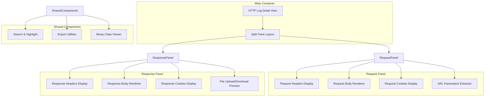
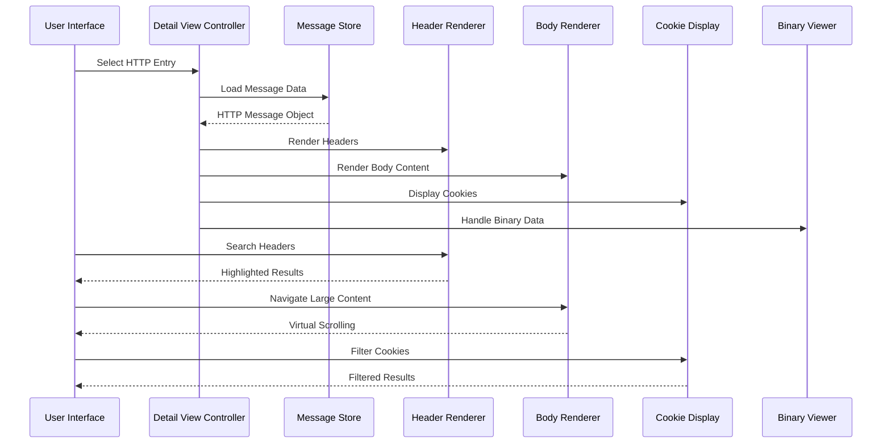
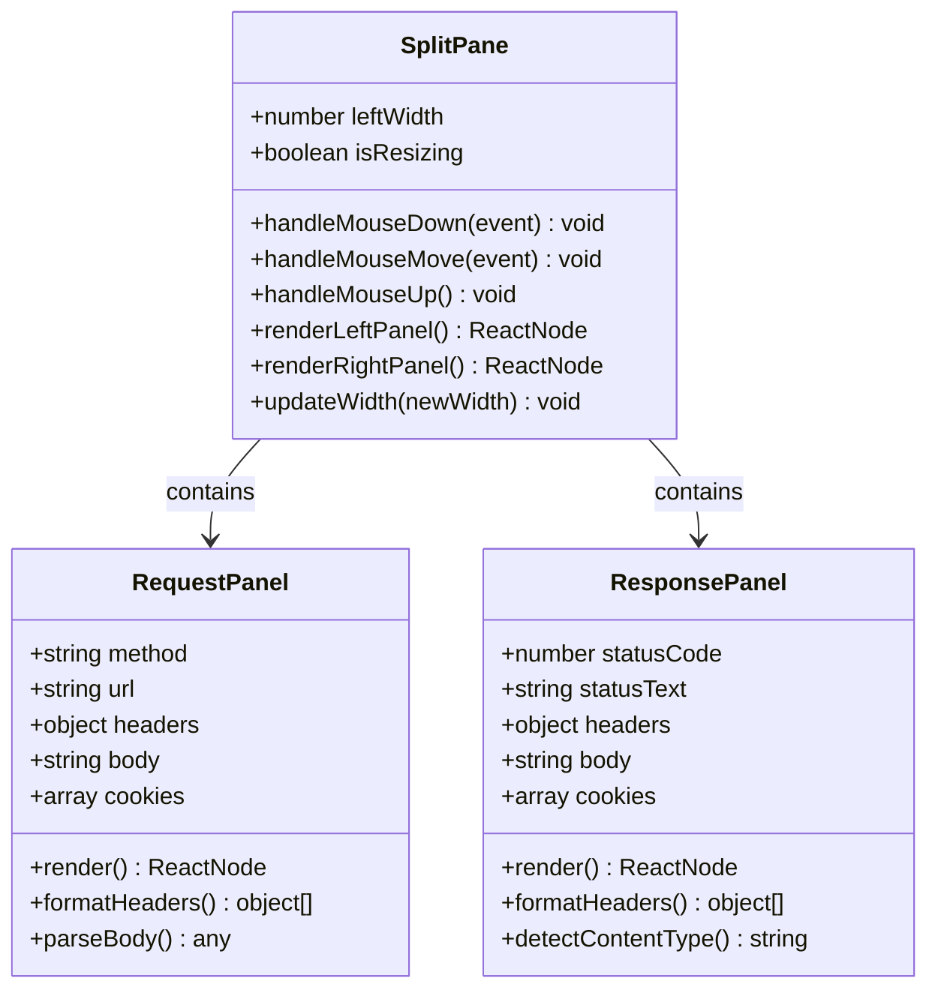
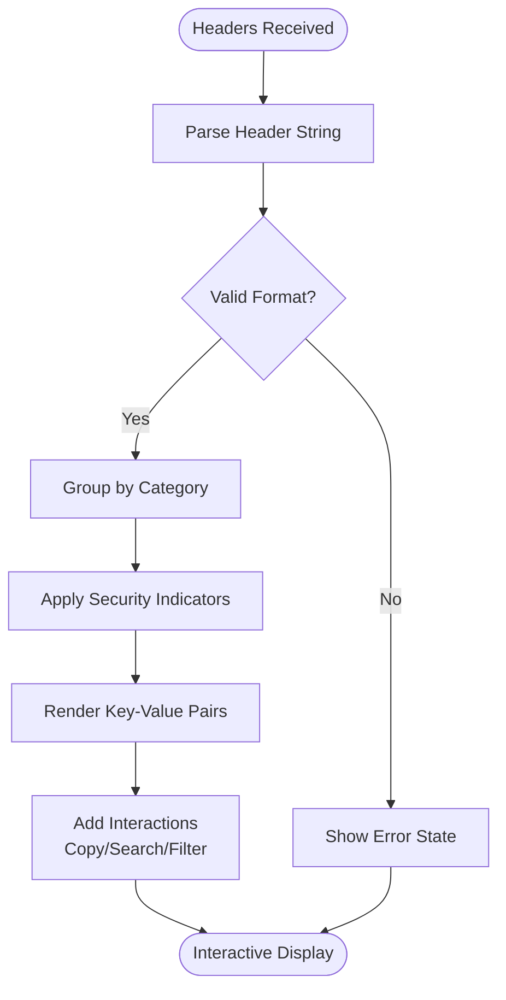
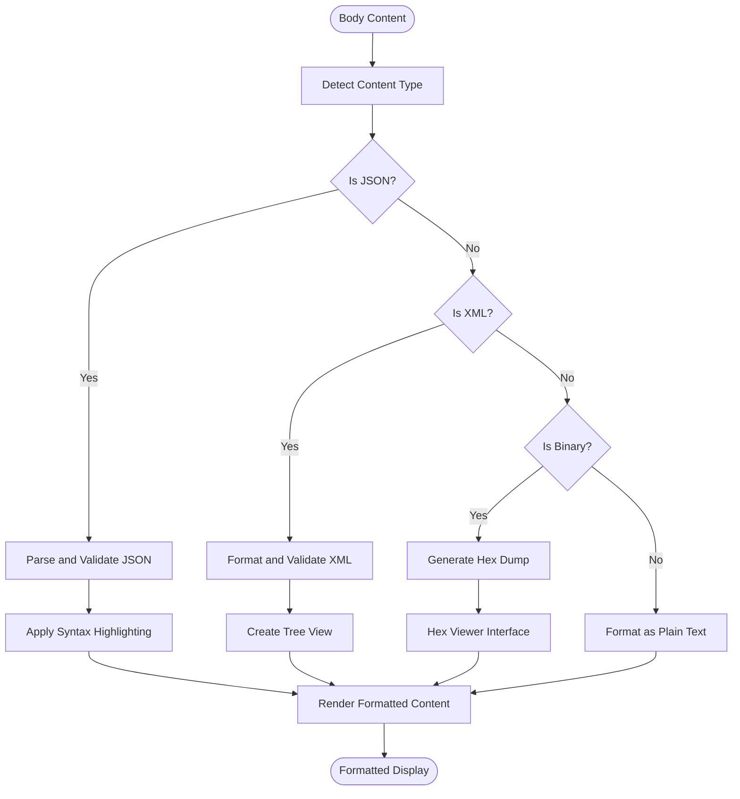
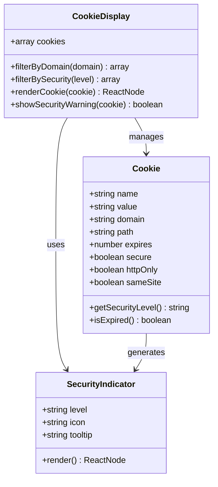
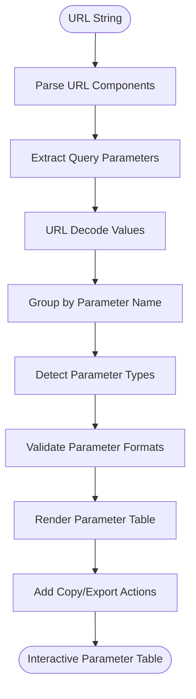
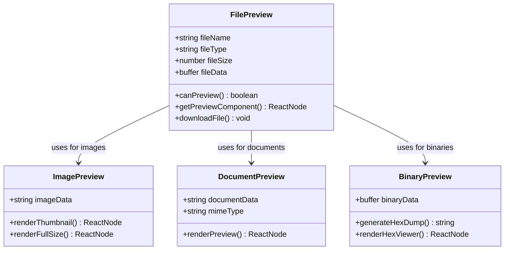
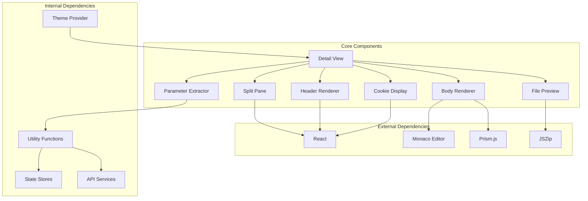

# Log Entry Detail View

<cite>
**Referenced Files in This Document**
- [http-history.tsx](file://src/pages/live-traffic/http-history/index.tsx)
- [message-viewer.tsx](file://src/components/message-viewer.tsx)
- [headers-display.tsx](file://src/components/headers-display.tsx)
- [body-renderer.tsx](file://src/components/body-renderer.tsx)
- [cookie-display.tsx](file://src/components/cookie-display.tsx)
- [parameter-extractor.tsx](file://src/components/parameter-extractor.tsx)
- [file-preview.tsx](file://src/components/file-preview.tsx)
- [search-highlight.tsx](file://src/components/search-highlight.tsx)
- [export-utils.ts](file://src/lib/export-utils.ts)
</cite>

## Table of Contents
1. [Introduction](#introduction)
2. [Project Structure](#project-structure)
3. [Core Components](#core-components)
4. [Architecture Overview](#architecture-overview)
5. [Detailed Component Analysis](#detailed-component-analysis)
6. [Dependency Analysis](#dependency-analysis)
7. [Performance Considerations](#performance-considerations)
8. [Troubleshooting Guide](#troubleshooting-guide)
9. [Conclusion](#conclusion)

## Introduction

The HTTP log entry detail view is a sophisticated split-pane interface designed to display both request and response details simultaneously. This component serves as the primary inspection tool for analyzing HTTP traffic captured by the application's proxy functionality. It provides developers and security professionals with comprehensive visibility into network communications, enabling detailed analysis of headers, body content, cookies, parameters, and binary data.

The interface follows modern design principles with responsive layouts, syntax highlighting, and interactive features that enhance the debugging and analysis workflow. Users can navigate through large responses efficiently, search within content, and export specific sections for further analysis or reporting.

## Project Structure

The HTTP log entry detail view is implemented as a modular React component system with clear separation of concerns:

**Diagram sources**
- [http-history.tsx:1-100](file://src/pages/live-traffic/http-history/index.tsx#L1-L100)
- [message-viewer.tsx:1-150](file://src/components/message-viewer.tsx#L1-L150)

**Section sources**
- [http-history.tsx:1-100](file://src/pages/live-traffic/http-history/index.tsx#L1-L100)
- [message-viewer.tsx:1-150](file://src/components/message-viewer.tsx#L1-L150)

## Core Components

The HTTP log entry detail view consists of several core components that work together to provide a comprehensive inspection experience:

### Split Pane Interface
The main container implements a resizable split pane layout that displays request and response panels side by side. The layout supports dynamic resizing, keyboard shortcuts, and responsive behavior across different screen sizes.

### Headers Display Component
A specialized component for rendering HTTP headers with key-value formatting. It supports:
- Syntax highlighting for header names and values
- Collapsible sections for organization
- Copy-to-clipboard functionality
- Security indicators for sensitive headers

### Body Content Renderer
An intelligent renderer that adapts to different content types:
- JSON with syntax highlighting and tree view
- XML with formatting and validation
- Plain text with line numbers
- Binary data with hex dump capabilities

### Cookie Display Component
Specialized cookie management with security indicators:
- Secure flag visualization
- HttpOnly indicator
- Domain and path information
- Expiration date formatting

**Section sources**
- [headers-display.tsx:1-200](file://src/components/headers-display.tsx#L1-L200)
- [body-renderer.tsx:1-300](file://src/components/body-renderer.tsx#L1-L300)
- [cookie-display.tsx:1-150](file://src/components/cookie-display.tsx#L1-L150)

## Architecture Overview

The HTTP log entry detail view follows a unidirectional data flow pattern with clear separation between presentation and business logic:

**Diagram sources**
- [message-viewer.tsx:50-200](file://src/components/message-viewer.tsx#L50-L200)
- [http-history.tsx:100-300](file://src/pages/live-traffic/http-history/index.tsx#L100-L300)

## Detailed Component Analysis

### Split Pane Implementation

The split pane component manages the layout and interaction between request and response panels:

**Diagram sources**
- [message-viewer.tsx:100-250](file://src/components/message-viewer.tsx#L100-L250)

### Headers Display Component

The headers display component provides structured visualization of HTTP headers:

**Diagram sources**
- [headers-display.tsx:50-150](file://src/components/headers-display.tsx#L50-L150)

### Body Content Rendering

The body renderer handles multiple content formats with appropriate visualization:

**Diagram sources**
- [body-renderer.tsx:100-250](file://src/components/body-renderer.tsx#L100-L250)

### Cookie Display with Security Indicators

The cookie display component provides enhanced security visualization:

**Diagram sources**
- [cookie-display.tsx:50-150](file://src/components/cookie-display.tsx#L50-L150)

### Parameter Extraction from URLs

The parameter extractor component parses URL parameters and query strings:

**Diagram sources**
- [parameter-extractor.tsx:50-150](file://src/components/parameter-extractor.tsx#L50-L150)

### File Upload/Download Previews

The file preview component handles various file types with appropriate previews:

**Diagram sources**
- [file-preview.tsx:50-200](file://src/components/file-preview.tsx#L50-L200)

## Dependency Analysis

The HTTP log entry detail view has well-defined dependencies between components:

**Diagram sources**
- [package.json:1-100](file://package.json#L1-L100)
- [message-viewer.tsx:1-100](file://src/components/message-viewer.tsx#L1-L100)

**Section sources**
- [package.json:1-100](file://package.json#L1-L100)
- [message-viewer.tsx:1-100](file://src/components/message-viewer.tsx#L1-L100)

## Performance Considerations

The HTTP log entry detail view implements several performance optimizations:

### Virtual Scrolling
Large response bodies are rendered using virtual scrolling to maintain smooth user interactions even with multi-megabyte payloads. Only visible content is rendered, significantly reducing memory usage and improving responsiveness.

### Lazy Loading
Components are loaded lazily based on content type detection. Heavy libraries like Monaco Editor are only loaded when needed for code editing scenarios.

### Memory Management
Binary data is processed in chunks to prevent memory spikes. Large files use streaming approaches where possible, and temporary objects are properly garbage collected.

### Caching Strategies
Parsed JSON and XML structures are cached to avoid repeated parsing operations. Header and cookie data is memoized to prevent unnecessary re-renders.

### Debounced Search
Search functionality is debounced to prevent excessive re-rendering during typing. Results are highlighted efficiently using DOM manipulation rather than full component re-renders.

## Troubleshooting Guide

### Common Issues and Solutions

#### Large Response Handling
When dealing with very large responses (>10MB), users may experience slow loading times. The component automatically switches to chunked loading mode, but users can also manually trigger lazy loading by scrolling.

#### Binary Data Display
Binary files may not display correctly if the MIME type detection fails. Users can force hex dump view by right-clicking and selecting "View as Hex".

#### Memory Usage
High memory usage can occur with extremely large files. The component includes automatic cleanup, but users should close unused tabs and clear browser cache periodically.

#### Search Performance
Search functionality may be slow on very large documents. Users can limit search scope to specific sections (headers, body, cookies) for better performance.

### Debug Information
The component provides debug information accessible through the developer console:
- Memory usage statistics
- Render performance metrics
- Error logs with stack traces
- Component lifecycle events

**Section sources**
- [message-viewer.tsx:200-300](file://src/components/message-viewer.tsx#L200-L300)
- [body-renderer.tsx:250-350](file://src/components/body-renderer.tsx#L250-L350)

## Conclusion

The HTTP log entry detail view component represents a comprehensive solution for inspecting and analyzing HTTP traffic. Its modular architecture, performance optimizations, and rich feature set make it an essential tool for developers and security professionals working with network communications.

The split-pane interface provides intuitive navigation between request and response data, while the intelligent content rendering ensures optimal display of various data formats. Advanced features like binary data handling, cookie security indicators, and parameter extraction enhance the debugging and analysis workflow.

Future enhancements could include collaborative features, advanced filtering options, and integration with external analysis tools. The component's extensible architecture makes it well-suited for such improvements while maintaining backward compatibility.