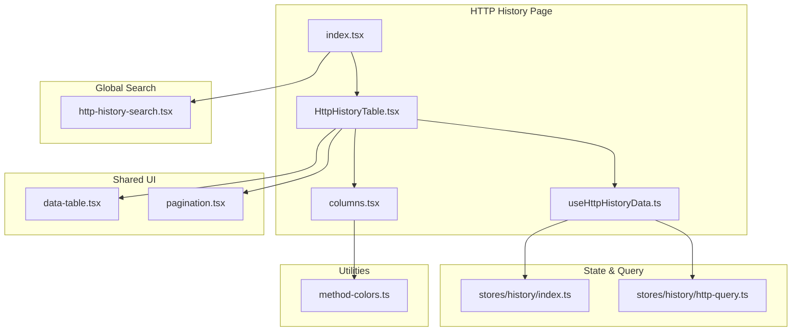
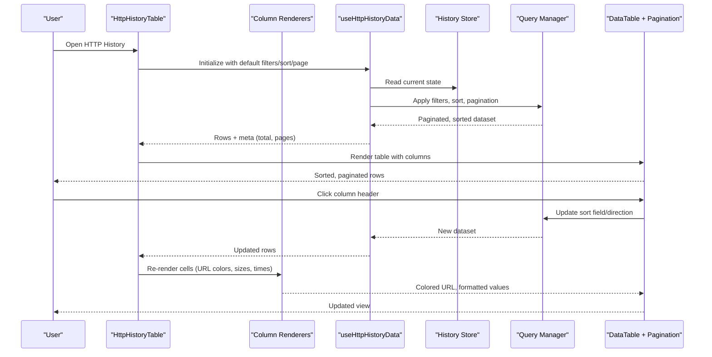
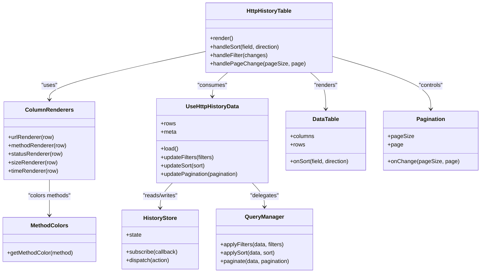

# Log Table Interface

<cite>
**Referenced Files in This Document**
- [http-history/index.tsx](file://src/pages/live-traffic/http-history/index.tsx)
- [http-history/components/HttpHistoryTable.tsx](file://src/pages/live-traffic/http-history/components/HttpHistoryTable.tsx)
- [http-history/components/columns.tsx](file://src/pages/live-traffic/http-history/components/columns.tsx)
- [http-history/hooks/useHttpHistoryData.ts](file://src/pages/live-traffic/http-history/hooks/useHttpHistoryData.ts)
- [components/ui/data-table.tsx](file://src/components/ui/data-table.tsx)
- [components/ui/pagination.tsx](file://src/components/ui/pagination.tsx)
- [lib/method-colors.ts](file://src/lib/method-colors.ts)
- [stores/history/index.ts](file://src/stores/history/index.ts)
- [stores/history/http-query.ts](file://src/stores/history/http-query.ts)
- [layout/global-search/http-history-search.tsx](file://src/layout/global-search/http-history-search.tsx)
</cite>

## Table of Contents
1. [Introduction](#introduction)
2. [Project Structure](#project-structure)
3. [Core Components](#core-components)
4. [Architecture Overview](#architecture-overview)
5. [Detailed Component Analysis](#detailed-component-analysis)
6. [Dependency Analysis](#dependency-analysis)
7. [Performance Considerations](#performance-considerations)
8. [Troubleshooting Guide](#troubleshooting-guide)
9. [Conclusion](#conclusion)

## Introduction
This document explains the HTTP History Log Table component used to display captured HTTP requests and responses. It covers the table structure (URL, method, status code, size, timing), column customization, sorting by different fields, pagination for large datasets, and colored URL rendering with protocol highlighting, domain coloring, and path visualization. It also includes configuration examples, custom column rendering guidance, and performance optimization techniques for handling thousands of log entries.

## Project Structure
The HTTP history table is implemented under the live-traffic feature area and integrates with shared UI primitives and stores:
- Feature page and orchestration: src/pages/live-traffic/http-history
- Table implementation and columns: components within http-history
- Shared data table and pagination: src/components/ui
- Method color utilities: src/lib/method-colors.ts
- State and query management: src/stores/history
- Global search integration: src/layout/global-search

**Diagram sources**
- [http-history/index.tsx](file://src/pages/live-traffic/http-history/index.tsx)
- [http-history/components/HttpHistoryTable.tsx](file://src/pages/live-traffic/http-history/components/HttpHistoryTable.tsx)
- [http-history/components/columns.tsx](file://src/pages/live-traffic/http-history/components/columns.tsx)
- [http-history/hooks/useHttpHistoryData.ts](file://src/pages/live-traffic/http-history/hooks/useHttpHistoryData.ts)
- [components/ui/data-table.tsx](file://src/components/ui/data-table.tsx)
- [components/ui/pagination.tsx](file://src/components/ui/pagination.tsx)
- [lib/method-colors.ts](file://src/lib/method-colors.ts)
- [stores/history/index.ts](file://src/stores/history/index.ts)
- [stores/history/http-query.ts](file://src/stores/history/http-query.ts)
- [layout/global-search/http-history-search.tsx](file://src/layout/global-search/http-history-search.tsx)

**Section sources**
- [http-history/index.tsx](file://src/pages/live-traffic/http-history/index.tsx)
- [http-history/components/HttpHistoryTable.tsx](file://src/pages/live-traffic/http-history/components/HttpHistoryTable.tsx)
- [components/ui/data-table.tsx](file://src/components/ui/data-table.tsx)
- [components/ui/pagination.tsx](file://src/components/ui/pagination.tsx)
- [lib/method-colors.ts](file://src/lib/method-colors.ts)
- [stores/history/index.ts](file://src/stores/history/index.ts)
- [stores/history/http-query.ts](file://src/stores/history/http-query.ts)
- [layout/global-search/http-history-search.tsx](file://src/layout/global-search/http-history-search.tsx)

## Core Components
- HttpHistoryTable: Renders the main table, wires up sorting, filtering, pagination, and row selection. It composes column definitions and delegates rendering to the shared data-table primitive.
- Column Definitions: Define visible columns (URL, Method, Status, Size, Time) and their renderers. The URL renderer applies protocol highlighting, domain coloring, and path visualization.
- Data Hook: useHttpHistoryData fetches and manages paginated, sorted, and filtered results from the store or API layer.
- Shared DataTable: Provides generic table behavior including header sorting, cell rendering, and accessibility.
- Pagination: Controls page size and navigation for large datasets.
- Method Colors: Utility mapping HTTP methods to colors for consistent visual encoding.

Key responsibilities:
- Rendering a responsive, accessible table with sortable headers.
- Displaying URLs with semantic color coding for improved readability.
- Managing state for sort, filter, and pagination via hooks and stores.
- Optimizing rendering for large lists through virtualization or efficient updates.

**Section sources**
- [http-history/components/HttpHistoryTable.tsx](file://src/pages/live-traffic/http-history/components/HttpHistoryTable.tsx)
- [http-history/components/columns.tsx](file://src/pages/live-traffic/http-history/components/columns.tsx)
- [http-history/hooks/useHttpHistoryData.ts](file://src/pages/live-traffic/http-history/hooks/useHttpHistoryData.ts)
- [components/ui/data-table.tsx](file://src/components/ui/data-table.tsx)
- [components/ui/pagination.tsx](file://src/components/ui/pagination.tsx)
- [lib/method-colors.ts](file://src/lib/method-colors.ts)

## Architecture Overview
The HTTP History Log Table follows a layered architecture:
- Presentation Layer: HttpHistoryTable and column renderers compose the UI using shared primitives.
- Data Layer: useHttpHistoryData coordinates fetching, caching, and transformation of records.
- State Layer: Stores manage global state, queries, and persistence for history items.
- Utilities: Color helpers and formatting functions ensure consistent visuals and UX.

**Diagram sources**
- [http-history/components/HttpHistoryTable.tsx](file://src/pages/live-traffic/http-history/components/HttpHistoryTable.tsx)
- [http-history/components/columns.tsx](file://src/pages/live-traffic/http-history/components/columns.tsx)
- [http-history/hooks/useHttpHistoryData.ts](file://src/pages/live-traffic/http-history/hooks/useHttpHistoryData.ts)
- [stores/history/index.ts](file://src/stores/history/index.ts)
- [stores/history/http-query.ts](file://src/stores/history/http-query.ts)
- [components/ui/data-table.tsx](file://src/components/ui/data-table.tsx)
- [components/ui/pagination.tsx](file://src/components/ui/pagination.tsx)

## Detailed Component Analysis

### HttpHistoryTable
Responsibilities:
- Compose column definitions and pass them to the shared DataTable.
- Manage local state for sorting, filtering, and pagination.
- Integrate with useHttpHistoryData to fetch and update rows.
- Provide actions like row selection and export if needed.

Configuration highlights:
- Column visibility toggles allow users to show/hide fields such as URL, Method, Status, Size, and Time.
- Sorting can be enabled per column; default sort may be set on load.
- Pagination supports configurable page sizes and navigation controls.

Customization points:
- Replace or extend column renderers for advanced formatting.
- Inject additional metadata columns (e.g., group, tags).
- Customize row actions via callbacks.

**Section sources**
- [http-history/components/HttpHistoryTable.tsx](file://src/pages/live-traffic/http-history/components/HttpHistoryTable.tsx)
- [components/ui/data-table.tsx](file://src/components/ui/data-table.tsx)
- [components/ui/pagination.tsx](file://src/components/ui/pagination.tsx)

### Column Definitions and URL Rendering
Columns:
- URL: Displays the full request URL with protocol highlighting, domain coloring, and path visualization.
- Method: Shows the HTTP method with color coding based on method type.
- Status: Displays the response status code with appropriate color semantics.
- Size: Formats byte counts into human-readable units.
- Time: Shows duration or timestamp with relative formatting where applicable.

URL rendering details:
- Protocol segment (e.g., https) is highlighted to distinguish scheme.
- Domain segment is colored to emphasize host identity.
- Path segment is rendered distinctly to aid scanning long URLs.

Method coloring:
- Uses a centralized mapping to assign consistent colors across GET, POST, PUT, DELETE, etc.

**Section sources**
- [http-history/components/columns.tsx](file://src/pages/live-traffic/http-history/components/columns.tsx)
- [lib/method-colors.ts](file://src/lib/method-colors.ts)

### Data Hook and Query Management
useHttpHistoryData:
- Initializes default filters, sorts, and pagination parameters.
- Subscribes to store changes and recomputes derived datasets.
- Debounces expensive operations and batches updates.

Query manager:
- Applies filters (e.g., by domain, status, method).
- Sorts by selected column and direction.
- Slices results for pagination and tracks total count.

Integration:
- Exposes rows and metadata to the table component.
- Emits events for loading states and errors.

**Section sources**
- [http-history/hooks/useHttpHistoryData.ts](file://src/pages/live-traffic/http-history/hooks/useHttpHistoryData.ts)
- [stores/history/http-query.ts](file://src/stores/history/http-query.ts)
- [stores/history/index.ts](file://src/stores/history/index.ts)

### Shared DataTable and Pagination
DataTable:
- Generic table component supporting dynamic columns, header sorting, and cell renderers.
- Handles keyboard navigation and accessibility attributes.

Pagination:
- Provides page size selector and navigation buttons.
- Integrates with the data hook to request specific slices of data.

**Section sources**
- [components/ui/data-table.tsx](file://src/components/ui/data-table.tsx)
- [components/ui/pagination.tsx](file://src/components/ui/pagination.tsx)

### Global Search Integration
The HTTP history table participates in global search:
- Searches across URL, method, status, and other relevant fields.
- Updates filters in real time and navigates to matching rows.

**Section sources**
- [layout/global-search/http-history-search.tsx](file://src/layout/global-search/http-history-search.tsx)

## Dependency Analysis
The HTTP history table depends on shared UI primitives, stores, and utilities. The following diagram shows key relationships:

**Diagram sources**
- [http-history/components/HttpHistoryTable.tsx](file://src/pages/live-traffic/http-history/components/HttpHistoryTable.tsx)
- [http-history/components/columns.tsx](file://src/pages/live-traffic/http-history/components/columns.tsx)
- [http-history/hooks/useHttpHistoryData.ts](file://src/pages/live-traffic/http-history/hooks/useHttpHistoryData.ts)
- [stores/history/index.ts](file://src/stores/history/index.ts)
- [stores/history/http-query.ts](file://src/stores/history/http-query.ts)
- [components/ui/data-table.tsx](file://src/components/ui/data-table.tsx)
- [components/ui/pagination.tsx](file://src/components/ui/pagination.tsx)
- [lib/method-colors.ts](file://src/lib/method-colors.ts)

**Section sources**
- [http-history/components/HttpHistoryTable.tsx](file://src/pages/live-traffic/http-history/components/HttpHistoryTable.tsx)
- [http-history/components/columns.tsx](file://src/pages/live-traffic/http-history/components/columns.tsx)
- [http-history/hooks/useHttpHistoryData.ts](file://src/pages/live-traffic/http-history/hooks/useHttpHistoryData.ts)
- [stores/history/index.ts](file://src/stores/history/index.ts)
- [stores/history/http-query.ts](file://src/stores/history/http-query.ts)
- [components/ui/data-table.tsx](file://src/components/ui/data-table.tsx)
- [components/ui/pagination.tsx](file://src/components/ui/pagination.tsx)
- [lib/method-colors.ts](file://src/lib/method-colors.ts)

## Performance Considerations
Optimization strategies for handling thousands of log entries:
- Virtualization: Render only visible rows to reduce DOM overhead. Ensure the DataTable supports virtualized lists or integrate a virtualizer.
- Memoization: Memoize column renderers and computed values to avoid unnecessary re-renders.
- Debounced Input: Debounce filter inputs and search to limit frequent recomputation.
- Efficient Sorting: Prefer server-side or indexed sorting when available; otherwise, cache sorted indices.
- Pagination Defaults: Start with reasonable page sizes (e.g., 50–100) and allow user adjustment.
- Lazy Loading: Load additional metadata or payloads on demand rather than upfront.
- Memory Management: Avoid retaining large objects in memory; normalize data shapes and prune unused fields.
- Batched Updates: Coalesce multiple store updates into single renders.

Practical tips:
- Use stable keys for rows to improve reconciliation.
- Avoid heavy computations inside render paths; move to hooks or workers.
- Profile rendering with browser dev tools to identify bottlenecks.

[No sources needed since this section provides general guidance]

## Troubleshooting Guide
Common issues and resolutions:
- Missing or incorrect URL colors:
  - Verify method color mappings are loaded and applied correctly.
  - Check that URL segments are parsed consistently before applying styles.
- Sorting not working:
  - Confirm sort handlers are wired to the query manager and that sort fields match data schema.
  - Ensure stable sort keys and handle null/undefined values gracefully.
- Pagination glitches:
  - Validate total count calculations and boundary checks for page transitions.
  - Ensure data slicing aligns with backend or store pagination logic.
- Slow rendering with large datasets:
  - Enable virtualization and memoization.
  - Reduce per-row complexity and defer heavy formatting until necessary.
- Global search not updating:
  - Ensure debouncing is configured and filters propagate to the query manager.
  - Check event propagation and state synchronization between search and table.

**Section sources**
- [http-history/components/columns.tsx](file://src/pages/live-traffic/http-history/components/columns.tsx)
- [http-history/hooks/useHttpHistoryData.ts](file://src/pages/live-traffic/http-history/hooks/useHttpHistoryData.ts)
- [components/ui/data-table.tsx](file://src/components/ui/data-table.tsx)
- [components/ui/pagination.tsx](file://src/components/ui/pagination.tsx)
- [lib/method-colors.ts](file://src/lib/method-colors.ts)

## Conclusion
The HTTP History Log Table provides a robust, customizable interface for inspecting captured HTTP traffic. With structured columns, colored URL rendering, sortable headers, and pagination, it balances usability and performance. By leveraging shared UI primitives, centralized color utilities, and efficient data flow through hooks and stores, the component scales well to large datasets. Following the recommended optimizations and troubleshooting steps ensures smooth operation even under heavy usage.

[No sources needed since this section summarizes without analyzing specific files]