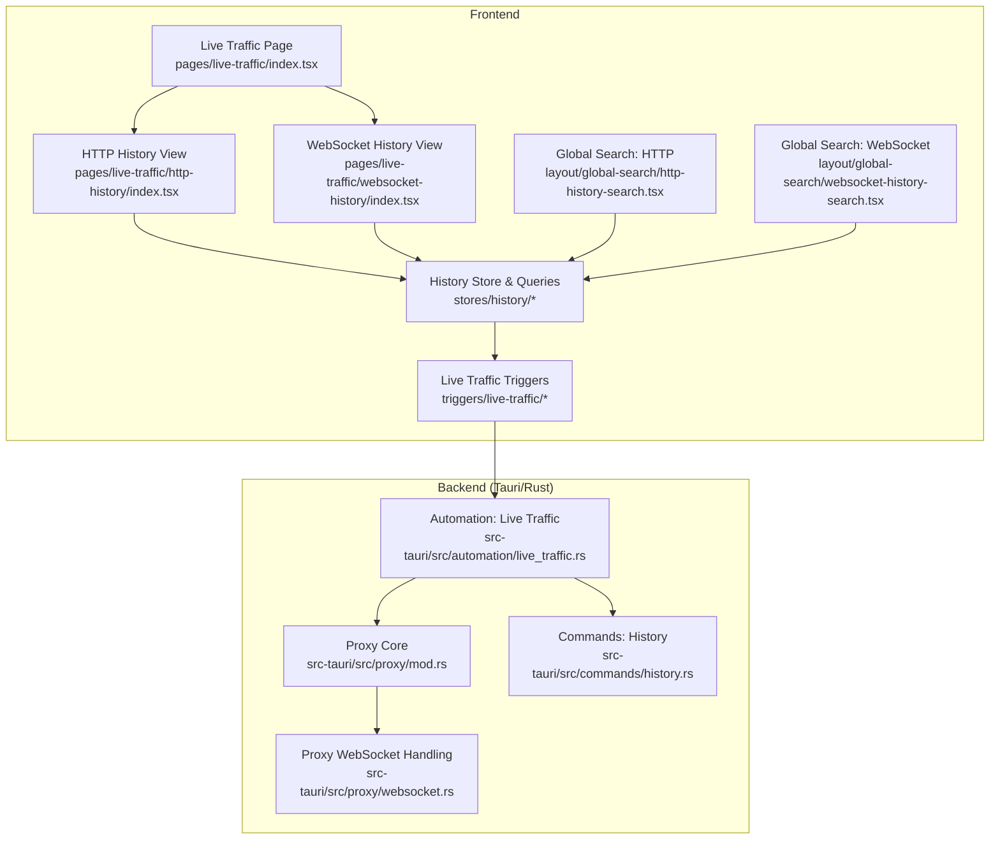
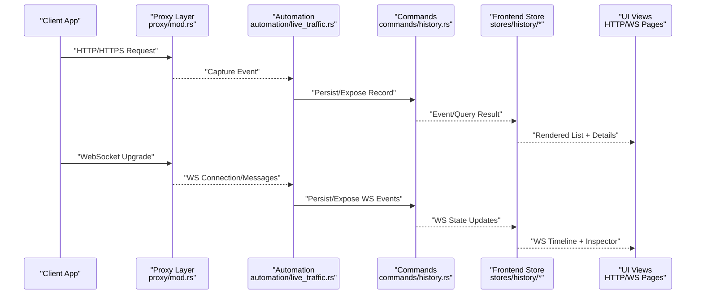
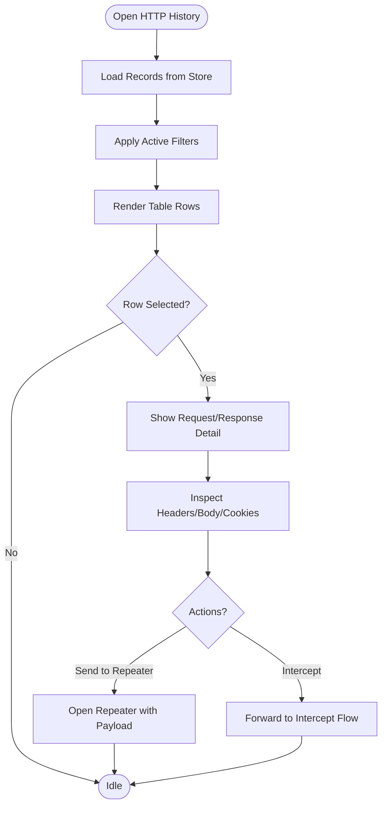
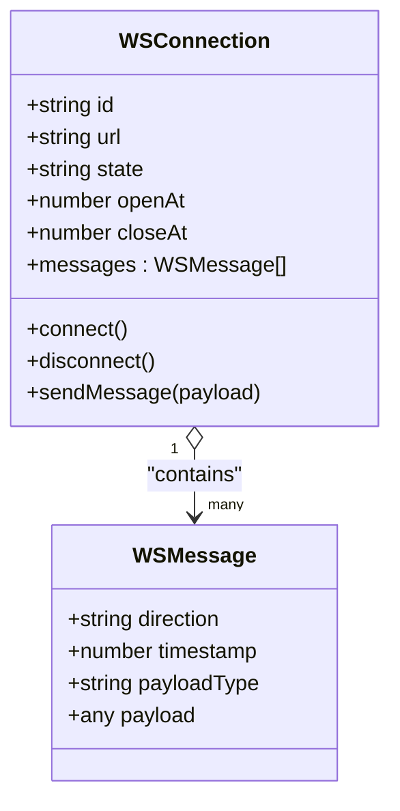
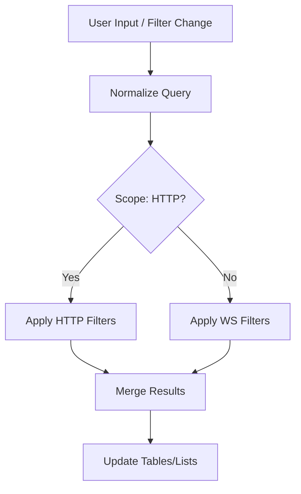
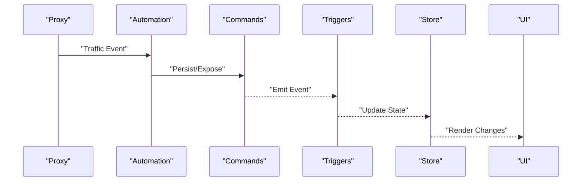
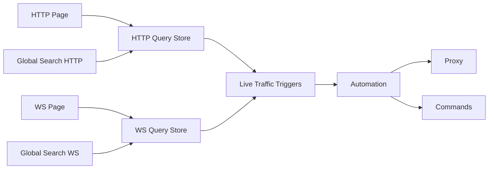

# Live Traffic Inspection

<cite>
**Referenced Files in This Document**
- [index.tsx](file://src/pages/live-traffic/index.tsx)
- [http-history/index.tsx](file://src/pages/live-traffic/http-history/index.tsx)
- [websocket-history/index.tsx](file://src/pages/live-traffic/websocket-history/index.tsx)
- [captured.ts](file://src/triggers/live-traffic/captured.ts)
- [targets.ts](file://src/triggers/live-traffic/targets.ts)
- [ui.ts](file://src/triggers/live-traffic/ui.ts)
- [automation/live_traffic.rs](file://src-tauri/src/automation/live_traffic.rs)
- [proxy/mod.rs](file://src-tauri/src/proxy/mod.rs)
- [proxy/websocket.rs](file://src-tauri/src/proxy/websocket.rs)
- [commands/history.rs](file://src-tauri/src/commands/history.rs)
- [stores/history/index.ts](file://src/stores/history/index.ts)
- [stores/history/http-query.ts](file://src/stores/history/http-query.ts)
- [stores/history/websocket-query.ts](file://src/stores/history/websocket-query.ts)
- [global-search/http-history-search.tsx](file://src/layout/global-search/http-history-search.tsx)
- [global-search/websocket-history-search.tsx](file://src/layout/global-search/websocket-history-search.tsx)
</cite>

## Table of Contents
1. [Introduction](#introduction)
2. [Project Structure](#project-structure)
3. [Core Components](#core-components)
4. [Architecture Overview](#architecture-overview)
5. [Detailed Component Analysis](#detailed-component-analysis)
6. [Dependency Analysis](#dependency-analysis)
7. [Performance Considerations](#performance-considerations)
8. [Troubleshooting Guide](#troubleshooting-guide)
9. [Conclusion](#conclusion)
10. [Appendices](#appendices)

## Introduction
This document explains Apprecon’s Live Traffic Inspection feature, which captures and displays real-time HTTP/HTTPS and WebSocket traffic between applications and servers. It covers how traffic is captured, filtered, searched, and visualized; the HTTP history viewer with its table interface and request/response inspection panels; WebSocket monitoring for message inspection and connection management; and practical scenarios for analyzing traffic. It also includes performance tips for high-volume traffic and integration points with other Apprecon tools such as Repeater and Intercept.

## Project Structure
Live Traffic Inspection spans both the frontend (React/Tauri UI) and backend (Rust Tauri modules). The key areas are:
- Frontend pages for HTTP and WebSocket history views
- Global search integrations for quick filtering across history
- Stores and query utilities for managing and filtering captured data
- Triggers that bridge captured events to the UI
- Backend automation and proxy modules that capture network traffic and expose commands

**Diagram sources**
- [index.tsx](file://src/pages/live-traffic/index.tsx)
- [http-history/index.tsx](file://src/pages/live-traffic/http-history/index.tsx)
- [websocket-history/index.tsx](file://src/pages/live-traffic/websocket-history/index.tsx)
- [http-history-search.tsx](file://src/layout/global-search/http-history-search.tsx)
- [websocket-history-search.tsx](file://src/layout/global-search/websocket-history-search.tsx)
- [index.ts](file://src/stores/history/index.ts)
- [http-query.ts](file://src/stores/history/http-query.ts)
- [websocket-query.ts](file://src/stores/history/websocket-query.ts)
- [captured.ts](file://src/triggers/live-traffic/captured.ts)
- [live_traffic.rs](file://src-tauri/src/automation/live_traffic.rs)
- [mod.rs](file://src-tauri/src/proxy/mod.rs)
- [websocket.rs](file://src-tauri/src/proxy/websocket.rs)
- [history.rs](file://src-tauri/src/commands/history.rs)

**Section sources**
- [index.tsx](file://src/pages/live-traffic/index.tsx)
- [http-history/index.tsx](file://src/pages/live-traffic/http-history/index.tsx)
- [websocket-history/index.tsx](file://src/pages/live-traffic/websocket-history/index.tsx)
- [http-history-search.tsx](file://src/layout/global-search/http-history-search.tsx)
- [websocket-history-search.tsx](file://src/layout/global-search/websocket-history-search.tsx)
- [index.ts](file://src/stores/history/index.ts)
- [http-query.ts](file://src/stores/history/http-query.ts)
- [websocket-query.ts](file://src/stores/history/websocket-query.ts)
- [captured.ts](file://src/triggers/live-traffic/captured.ts)
- [live_traffic.rs](file://src-tauri/src/automation/live_traffic.rs)
- [mod.rs](file://src-tauri/src/proxy/mod.rs)
- [websocket.rs](file://src-tauri/src/proxy/websocket.rs)
- [history.rs](file://src-tauri/src/commands/history.rs)

## Core Components
- HTTP History Viewer: A tabular view of captured HTTP requests and responses with columns for method, URL, status, size, and timing. Includes a detail panel for headers, body, cookies, and timeline. Supports advanced filtering by method, domain, path, status code, and content type.
- WebSocket History Viewer: Displays active and past WebSocket connections with per-message logs, direction indicators, and payload inspection. Provides connection lifecycle controls (connect, disconnect, refresh).
- Filtering and Search: Unified filtering across HTTP and WebSocket history via dedicated stores and query utilities. Global search integrates with both histories for fast cross-cutting queries.
- Capture Pipeline: Captures traffic through the proxy layer and exposes it via automation commands to the frontend store for rendering and interaction.

**Section sources**
- [http-history/index.tsx](file://src/pages/live-traffic/http-history/index.tsx)
- [websocket-history/index.tsx](file://src/pages/live-traffic/websocket-history/index.tsx)
- [http-query.ts](file://src/stores/history/http-query.ts)
- [websocket-query.ts](file://src/stores/history/websocket-query.ts)
- [history.rs](file://src-tauri/src/commands/history.rs)

## Architecture Overview
The Live Traffic Inspection pipeline connects the Rust-based proxy and automation layers to the React frontend. Traffic is captured at the proxy level, normalized into structured records, and exposed via Tauri commands. The frontend subscribes to these events, updates local stores, and renders interactive views.

**Diagram sources**
- [mod.rs](file://src-tauri/src/proxy/mod.rs)
- [live_traffic.rs](file://src-tauri/src/automation/live_traffic.rs)
- [history.rs](file://src-tauri/src/commands/history.rs)
- [index.ts](file://src/stores/history/index.ts)
- [http-history/index.tsx](file://src/pages/live-traffic/http-history/index.tsx)
- [websocket-history/index.tsx](file://src/pages/live-traffic/websocket-history/index.tsx)

## Detailed Component Analysis

### HTTP History Viewer
- Table Interface: Columns include method, URL, status, size, and duration. Sorting and pagination are supported for large datasets.
- Request/Response Panels: Separate tabs or sections for headers, body, cookies, and timing breakdown. Body rendering supports JSON, text, and binary previews where applicable.
- Advanced Filtering: Filter by method, domain, path segments, status codes, response size ranges, and content types. Filters combine logically to narrow results quickly.
- Integration Points: Send selected requests to Repeater for re-execution; forward to Intercept for modification and replay.

**Diagram sources**
- [http-history/index.tsx](file://src/pages/live-traffic/http-history/index.tsx)
- [http-query.ts](file://src/stores/history/http-query.ts)
- [history.rs](file://src-tauri/src/commands/history.rs)

**Section sources**
- [http-history/index.tsx](file://src/pages/live-traffic/http-history/index.tsx)
- [http-query.ts](file://src/stores/history/http-query.ts)

### WebSocket History Viewer
- Connection Management: Lists active and historical WebSocket connections with connect/disconnect controls and reconnect options.
- Message Inspection: Per-message log showing direction (client/server), timestamp, payload preview, and full payload inspector.
- Real-Time Analysis: Live updates as messages arrive; ability to pause/resume capture and export logs.

**Diagram sources**
- [websocket-history/index.tsx](file://src/pages/live-traffic/websocket-history/index.tsx)
- [websocket.rs](file://src-tauri/src/proxy/websocket.rs)
- [history.rs](file://src-tauri/src/commands/history.rs)

**Section sources**
- [websocket-history/index.tsx](file://src/pages/live-traffic/websocket-history/index.tsx)
- [websocket.rs](file://src-tauri/src/proxy/websocket.rs)

### Filtering and Search
- HTTP Query Store: Manages filter state, applies criteria to the record set, and exposes results to the UI.
- WebSocket Query Store: Tracks active connections and message filters, enabling quick navigation to specific events.
- Global Search: Integrates with both HTTP and WebSocket histories to provide unified search across all captured traffic.

**Diagram sources**
- [http-query.ts](file://src/stores/history/http-query.ts)
- [websocket-query.ts](file://src/stores/history/websocket-query.ts)
- [http-history-search.tsx](file://src/layout/global-search/http-history-search.tsx)
- [websocket-history-search.tsx](file://src/layout/global-search/websocket-history-search.tsx)

**Section sources**
- [http-query.ts](file://src/stores/history/http-query.ts)
- [websocket-query.ts](file://src/stores/history/websocket-query.ts)
- [http-history-search.tsx](file://src/layout/global-search/http-history-search.tsx)
- [websocket-history-search.tsx](file://src/layout/global-search/websocket-history-search.tsx)

### Capture Mechanisms and Triggers
- Automation Layer: Coordinates capture events from the proxy and persists them via commands.
- Proxy Layer: Intercepts HTTP/HTTPS requests and WebSocket upgrades, normalizing payloads and metadata.
- Triggers: Bridge captured events to the frontend store, ensuring reactive UI updates.

**Diagram sources**
- [live_traffic.rs](file://src-tauri/src/automation/live_traffic.rs)
- [mod.rs](file://src-tauri/src/proxy/mod.rs)
- [history.rs](file://src-tauri/src/commands/history.rs)
- [captured.ts](file://src/triggers/live-traffic/captured.ts)
- [index.ts](file://src/stores/history/index.ts)

**Section sources**
- [live_traffic.rs](file://src-tauri/src/automation/live_traffic.rs)
- [mod.rs](file://src-tauri/src/proxy/mod.rs)
- [history.rs](file://src-tauri/src/commands/history.rs)
- [captured.ts](file://src/triggers/live-traffic/captured.ts)
- [index.ts](file://src/stores/history/index.ts)

## Dependency Analysis
Live Traffic Inspection depends on several core modules:
- Frontend dependencies: HTTP/WS pages rely on stores and query utilities for data binding and filtering.
- Backend dependencies: Automation and proxy modules coordinate capture and persistence; commands expose data to the frontend.
- Integration points: Global search components depend on both HTTP and WS query stores.

**Diagram sources**
- [http-history/index.tsx](file://src/pages/live-traffic/http-history/index.tsx)
- [websocket-history/index.tsx](file://src/pages/live-traffic/websocket-history/index.tsx)
- [http-query.ts](file://src/stores/history/http-query.ts)
- [websocket-query.ts](file://src/stores/history/websocket-query.ts)
- [captured.ts](file://src/triggers/live-traffic/captured.ts)
- [live_traffic.rs](file://src-tauri/src/automation/live_traffic.rs)
- [mod.rs](file://src-tauri/src/proxy/mod.rs)
- [history.rs](file://src-tauri/src/commands/history.rs)

**Section sources**
- [http-history/index.tsx](file://src/pages/live-traffic/http-history/index.tsx)
- [websocket-history/index.tsx](file://src/pages/live-traffic/websocket-history/index.tsx)
- [http-query.ts](file://src/stores/history/http-query.ts)
- [websocket-query.ts](file://src/stores/history/websocket-query.ts)
- [captured.ts](file://src/triggers/live-traffic/captured.ts)
- [live_traffic.rs](file://src-tauri/src/automation/live_traffic.rs)
- [mod.rs](file://src-tauri/src/proxy/mod.rs)
- [history.rs](file://src-tauri/src/commands/history.rs)

## Performance Considerations
- Limit captured scope: Configure target domains and paths to reduce noise and memory usage.
- Use efficient filters: Prefer exact matches and range filters over broad substring searches.
- Batch updates: Ensure store updates coalesce changes to avoid excessive re-renders.
- Pagination and virtualization: For large datasets, implement virtual scrolling and server-side pagination where possible.
- Disable heavy body parsing: Defer decoding large bodies until inspected.

[No sources needed since this section provides general guidance]

## Troubleshooting Guide
- No traffic captured: Verify proxy configuration and certificate installation; ensure targets route through the proxy.
- WebSocket not appearing: Confirm upgrade handshake is intercepted; check WS-specific filters and connection states.
- Slow UI with large volumes: Reduce capture scope, enable pagination, and avoid loading full payloads by default.
- Search returns empty: Validate filter syntax and scopes; ensure global search is scoped correctly to HTTP or WS.

**Section sources**
- [mod.rs](file://src-tauri/src/proxy/mod.rs)
- [websocket.rs](file://src-tauri/src/proxy/websocket.rs)
- [http-query.ts](file://src/stores/history/http-query.ts)
- [websocket-query.ts](file://src/stores/history/websocket-query.ts)

## Conclusion
Apprecon’s Live Traffic Inspection provides a robust, integrated solution for capturing and analyzing HTTP/HTTPS and WebSocket traffic. With powerful filtering, search, and visualization capabilities, it enables developers and security professionals to diagnose issues, validate behavior, and explore communication patterns efficiently. Its seamless integration with Repeater and Intercept enhances workflow productivity, while performance-oriented design ensures smooth operation under high traffic loads.

[No sources needed since this section summarizes without analyzing specific files]

## Appendices

### Practical Scenarios
- Debugging API failures: Filter by status codes and inspect error responses; send failing requests to Repeater for reproduction.
- Analyzing real-time features: Monitor WebSocket messages to understand event flows and payload structures; pause capture to focus on critical sequences.
- Verifying security policies: Inspect headers and cookies for misconfigurations; use Intercept to simulate policy changes and observe effects.

[No sources needed since this section provides general guidance]