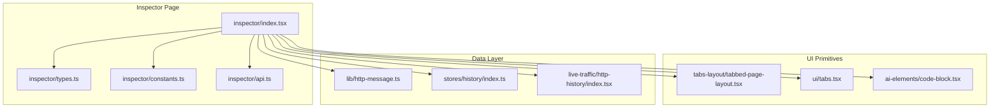
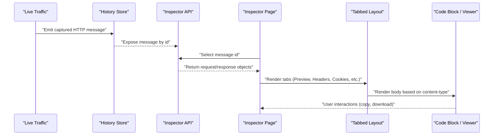
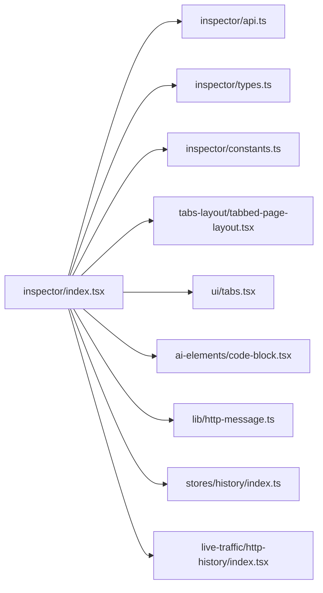

# Request/Response Inspector

<cite>
**Referenced Files in This Document**
- [index.tsx](file://src/pages/inspector/index.tsx)
- [types.ts](file://src/pages/inspector/types.ts)
- [constants.ts](file://src/pages/inspector/constants.ts)
- [api.ts](file://src/pages/inspector/api.ts)
- [components/CodeBlock.tsx](file://src/components/ai-elements/code-block.tsx)
- [components/tabs-layout/tabbed-page-layout.tsx](file://src/components/tabs-layout/tabbed-page-layout.tsx)
- [components/ui/tabs.tsx](file://src/components/ui/tabs.tsx)
- [lib/http-message.ts](file://src/lib/http-message.ts)
- [stores/history/index.ts](file://src/stores/history/index.ts)
- [pages/live-traffic/http-history/index.tsx](file://src/pages/live-traffic/http-history/index.tsx)
</cite>

## Table of Contents
1. [Introduction](#introduction)
2. [Project Structure](#project-structure)
3. [Core Components](#core-components)
4. [Architecture Overview](#architecture-overview)
5. [Detailed Component Analysis](#detailed-component-analysis)
6. [Dependency Analysis](#dependency-analysis)
7. [Performance Considerations](#performance-considerations)
8. [Troubleshooting Guide](#troubleshooting-guide)
9. [Conclusion](#conclusion)

## Introduction
This document describes Apprecon’s traffic inspector component, focusing on the dual-pane interface for inspecting HTTP requests and responses. It explains how headers are displayed with key-value formatting, how bodies are rendered with syntax highlighting for JSON, XML, HTML, CSS, and JavaScript, and how the response detail window provides a tabbed experience across content types. It also covers binary data viewing, file download capabilities, advanced inspection features (cookies, authentication headers, cache control, security headers), practical debugging scenarios, performance optimization for large payloads, and integration points for external tools.

## Project Structure
The inspector is implemented as a page module under src/pages/inspector, composed of:
- A main entry component that orchestrates the dual-pane layout and state
- Types and constants defining message structures and UI behavior
- API helpers to fetch or subscribe to captured messages
- Reusable UI components for tabs, code rendering, and panels
- Shared libraries for HTTP message parsing and history store integration

**Diagram sources**
- [index.tsx](file://src/pages/inspector/index.tsx)
- [types.ts](file://src/pages/inspector/types.ts)
- [constants.ts](file://src/pages/inspector/constants.ts)
- [api.ts](file://src/pages/inspector/api.ts)
- [tabbed-page-layout.tsx](file://src/components/tabs-layout/tabbed-page-layout.tsx)
- [tabs.tsx](file://src/components/ui/tabs.tsx)
- [code-block.tsx](file://src/components/ai-elements/code-block.tsx)
- [http-message.ts](file://src/lib/http-message.ts)
- [index.ts](file://src/stores/history/index.ts)
- [index.tsx](file://src/pages/live-traffic/http-history/index.tsx)

**Section sources**
- [index.tsx](file://src/pages/inspector/index.tsx)
- [types.ts](file://src/pages/inspector/types.ts)
- [constants.ts](file://src/pages/inspector/constants.ts)
- [api.ts](file://src/pages/inspector/api.ts)
- [tabbed-page-layout.tsx](file://src/components/tabs-layout/tabbed-page-layout.tsx)
- [tabs.tsx](file://src/components/ui/tabs.tsx)
- [code-block.tsx](file://src/components/ai-elements/code-block.tsx)
- [http-message.ts](file://src/lib/http-message.ts)
- [index.ts](file://src/stores/history/index.ts)
- [index.tsx](file://src/pages/live-traffic/http-history/index.tsx)

## Core Components
- Dual-pane layout: Left pane shows request details; right pane shows response details. The panes can be resized and synchronized with selection from live traffic.
- Headers display: Key-value pairs with copy-to-clipboard actions and optional filtering/search.
- Body rendering: Syntax-aware rendering for JSON, XML, HTML, CSS, JavaScript, plain text, and images. Binary blobs are presented with hex view and download options.
- Response detail window: Tabbed interface per content type (e.g., Preview, Headers, Cookies, Params, Query, Body, Raw).
- Advanced inspection: Cookie parser, authentication header analysis, cache-control inspection, and security header validation with warnings.

**Section sources**
- [index.tsx](file://src/pages/inspector/index.tsx)
- [types.ts](file://src/pages/inspector/types.ts)
- [constants.ts](file://src/pages/inspector/constants.ts)
- [api.ts](file://src/pages/inspector/api.ts)
- [tabbed-page-layout.tsx](file://src/components/tabs-layout/tabbed-page-layout.tsx)
- [tabs.tsx](file://src/components/ui/tabs.tsx)
- [code-block.tsx](file://src/components/ai-elements/code-block.tsx)
- [http-message.ts](file://src/lib/http-message.ts)

## Architecture Overview
The inspector integrates with the live traffic capture pipeline and the history store to render selected messages. Data flows from the capture layer into the store, then into the inspector page, which composes UI primitives to present headers, body, cookies, and metadata.

**Diagram sources**
- [index.tsx](file://src/pages/inspector/index.tsx)
- [api.ts](file://src/pages/inspector/api.ts)
- [tabbed-page-layout.tsx](file://src/components/tabs-layout/tabbed-page-layout.tsx)
- [code-block.tsx](file://src/components/ai-elements/code-block.tsx)
- [index.ts](file://src/stores/history/index.ts)
- [index.tsx](file://src/pages/live-traffic/http-history/index.tsx)

## Detailed Component Analysis

### Inspector Page (Dual-Pane Interface)
Responsibilities:
- Manage selected message id and split pane state
- Fetch request/response via API helpers
- Compose header list, cookie table, and body viewer
- Provide actions like copy, download, and open in external tool

Key behaviors:
- Synchronizes selection with live traffic list
- Debounces heavy operations when handling large payloads
- Renders different tabs depending on available content

**Section sources**
- [index.tsx](file://src/pages/inspector/index.tsx)
- [api.ts](file://src/pages/inspector/api.ts)
- [types.ts](file://src/pages/inspector/types.ts)

### Types and Constants
Defines:
- Message shape (request, response, headers, cookies, params, body, status, timing)
- Tab definitions and default ordering
- Content-type detection rules and supported languages

Usage:
- Ensures consistent typing across inspector modules
- Drives conditional rendering for body viewers and tabs

**Section sources**
- [types.ts](file://src/pages/inspector/types.ts)
- [constants.ts](file://src/pages/inspector/constants.ts)

### API Helpers
Provides:
- Methods to retrieve request/response by id
- Subscription hooks to keep inspector in sync with live updates
- Utilities to normalize raw payloads into structured views

Integration:
- Connects to the history store and live traffic events
- Returns normalized objects consumed by the inspector page

**Section sources**
- [api.ts](file://src/pages/inspector/api.ts)
- [index.ts](file://src/stores/history/index.ts)

### Tabbed Response Detail Window
Features:
- Tabs for Preview, Headers, Cookies, Params, Query, Body, Raw
- Dynamic tab generation based on content-type and payload presence
- Consistent UX across request and response contexts

Implementation:
- Uses shared tabbed layout and tabs primitives
- Delegates rendering to specialized viewers per tab

**Section sources**
- [tabbed-page-layout.tsx](file://src/components/tabs-layout/tabbed-page-layout.tsx)
- [tabs.tsx](file://src/components/ui/tabs.tsx)
- [index.tsx](file://src/pages/inspector/index.tsx)

### Header Display (Key-Value Formatting)
Capabilities:
- Displays all headers in a searchable, sortable list
- Highlights sensitive headers (authorization, cookies)
- Copy single header or export all headers

Advanced inspection:
- Parses Set-Cookie and Cookie headers into structured tables
- Validates common security headers (CSP, HSTS, X-Frame-Options, etc.)
- Flags missing or misconfigured headers with actionable hints

**Section sources**
- [index.tsx](file://src/pages/inspector/index.tsx)
- [http-message.ts](file://src/lib/http-message.ts)

### Body Rendering and Syntax Highlighting
Supported formats:
- JSON: Parsed and formatted with collapsible tree view
- XML: Pretty-printed with tag highlighting
- HTML: Rendered preview and source view
- CSS: Formatted with rule highlighting
- JavaScript: Syntax-highlighted editor-like view
- Plain text and images: Optimized viewers
- Binary: Hex dump and downloadable blob

Actions:
- Copy content, toggle word wrap, search within body
- Download original payload or formatted version

**Section sources**
- [code-block.tsx](file://src/components/ai-elements/code-block.tsx)
- [index.tsx](file://src/pages/inspector/index.tsx)

### Binary Data Viewers and File Downloads
Binary handling:
- Detects non-text content-types and switches to binary viewer
- Provides hex view with offset and byte grouping
- Supports downloading original bytes or base64-encoded variants

Use cases:
- Inspect images, PDFs, archives, and custom binary protocols
- Export payloads for offline analysis

**Section sources**
- [index.tsx](file://src/pages/inspector/index.tsx)
- [types.ts](file://src/pages/inspector/types.ts)

### Advanced Inspection Features
Cookie parsing:
- Extracts name, value, domain, path, expires/max-age, secure, httpOnly, sameSite
- Visual indicators for flags and expiration

Authentication header analysis:
- Recognizes Authorization schemes (Bearer, Basic, Token)
- Decodes tokens where applicable and highlights structure

Cache control inspection:
- Parses Cache-Control directives (no-cache, no-store, max-age, etc.)
- Advises on caching best practices and potential issues

Security header validation:
- Checks presence and values of CSP, HSTS, Referrer-Policy, Permissions-Policy
- Provides severity levels and remediation tips

**Section sources**
- [index.tsx](file://src/pages/inspector/index.tsx)
- [http-message.ts](file://src/lib/http-message.ts)

### Practical Debugging Scenarios
Common workflows:
- Reproduce an error by replaying the exact request and inspecting response body
- Validate authentication flow by examining Authorization and Set-Cookie headers
- Diagnose caching issues by reviewing Cache-Control and ETag headers
- Inspect large JSON payloads using search and collapse features
- Export problematic responses for sharing with teammates or external tools

**Section sources**
- [index.tsx](file://src/pages/inspector/index.tsx)
- [api.ts](file://src/pages/inspector/api.ts)

## Dependency Analysis
The inspector depends on shared UI primitives, HTTP utilities, and the history store. The following diagram illustrates these relationships.

**Diagram sources**
- [index.tsx](file://src/pages/inspector/index.tsx)
- [api.ts](file://src/pages/inspector/api.ts)
- [types.ts](file://src/pages/inspector/types.ts)
- [constants.ts](file://src/pages/inspector/constants.ts)
- [tabbed-page-layout.tsx](file://src/components/tabs-layout/tabbed-page-layout.tsx)
- [tabs.tsx](file://src/components/ui/tabs.tsx)
- [code-block.tsx](file://src/components/ai-elements/code-block.tsx)
- [http-message.ts](file://src/lib/http-message.ts)
- [index.ts](file://src/stores/history/index.ts)
- [index.tsx](file://src/pages/live-traffic/http-history/index.tsx)

**Section sources**
- [index.tsx](file://src/pages/inspector/index.tsx)
- [api.ts](file://src/pages/inspector/api.ts)
- [types.ts](file://src/pages/inspector/types.ts)
- [constants.ts](file://src/pages/inspector/constants.ts)
- [tabbed-page-layout.tsx](file://src/components/tabs-layout/tabbed-page-layout.tsx)
- [tabs.tsx](file://src/components/ui/tabs.tsx)
- [code-block.tsx](file://src/components/ai-elements/code-block.tsx)
- [http-message.ts](file://src/lib/http-message.ts)
- [index.ts](file://src/stores/history/index.ts)
- [index.tsx](file://src/pages/live-traffic/http-history/index.tsx)

## Performance Considerations
- Lazy loading: Only load body content when the corresponding tab is active
- Virtualization: For very large payloads, consider virtualizing lists and trees
- Debounce: Apply debouncing to search/filter operations in headers and body
- Memory management: Avoid retaining large buffers; stream or chunk processing where possible
- Compression: Prefer compressed payloads and decode only necessary parts
- Caching: Cache parsed results for repeated access within a session

[No sources needed since this section provides general guidance]

## Troubleshooting Guide
Common issues and resolutions:
- Empty body: Verify content-length and transfer-encoding; ensure decompression is enabled if required
- Incorrect syntax highlighting: Check content-type header and fallback logic
- Slow rendering: Disable auto-formatting for large files; use raw view temporarily
- Missing cookies: Confirm SameSite and Secure attributes; check domain/path matching
- Security warnings: Review header values against current best practices and update server configuration

**Section sources**
- [index.tsx](file://src/pages/inspector/index.tsx)
- [http-message.ts](file://src/lib/http-message.ts)

## Conclusion
Apprecon’s traffic inspector delivers a robust, dual-pane interface for inspecting HTTP requests and responses. With rich header visualization, multi-format body rendering, binary support, and advanced inspection features, it enables efficient debugging and analysis. By following the performance recommendations and troubleshooting steps outlined here, users can maximize productivity and reliability while working with complex traffic data.