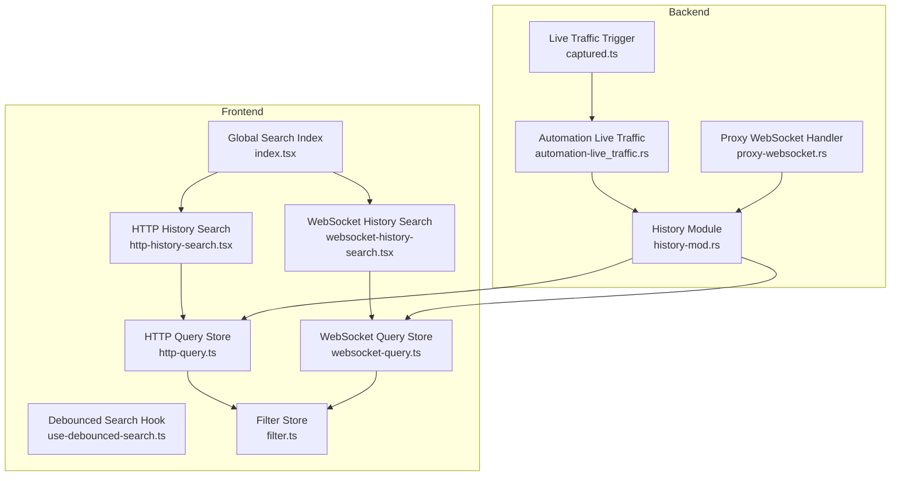
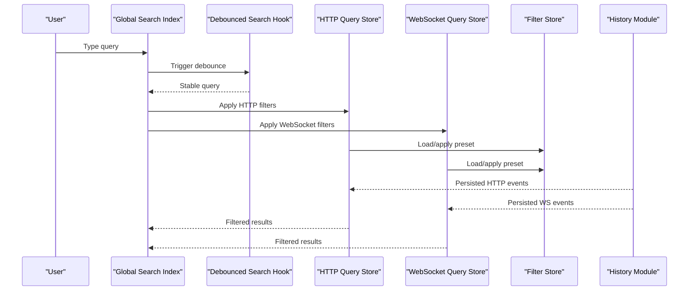
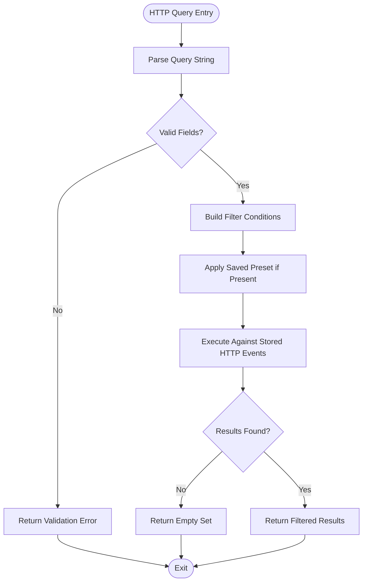
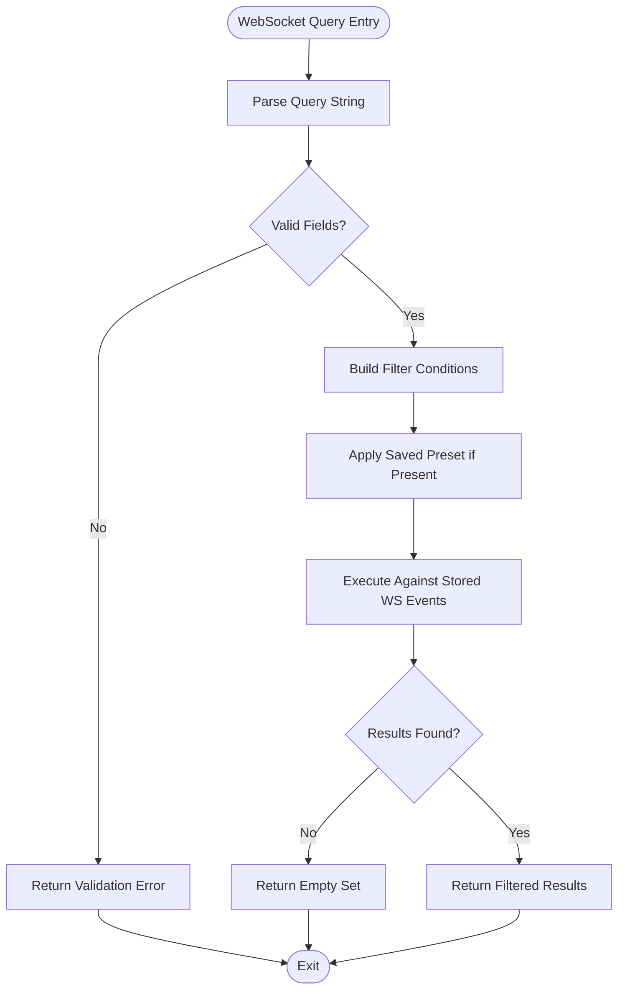
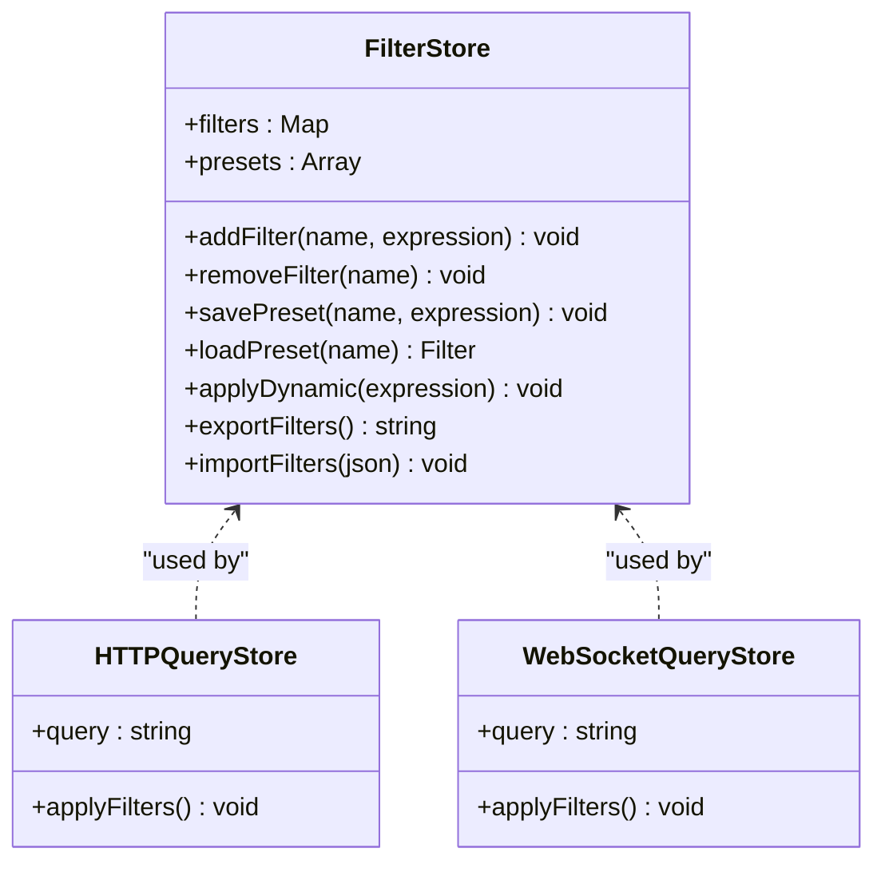
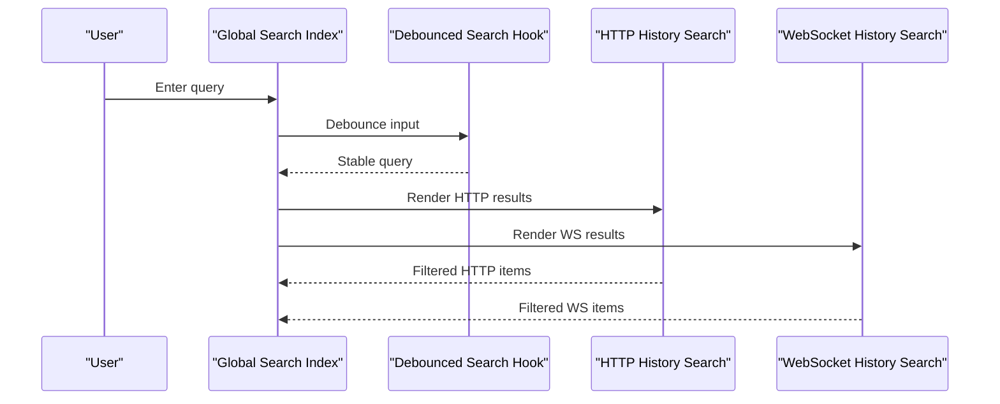
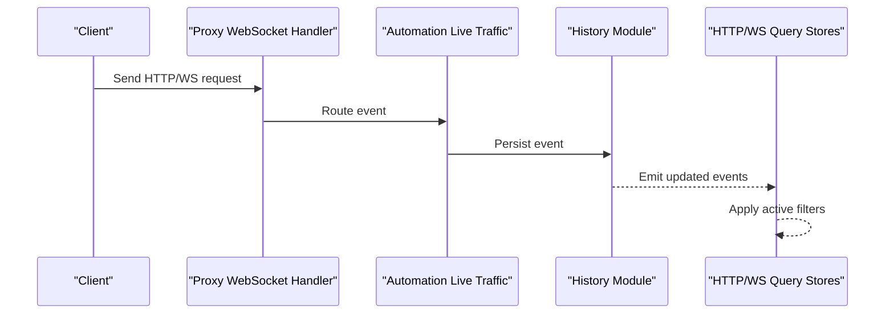
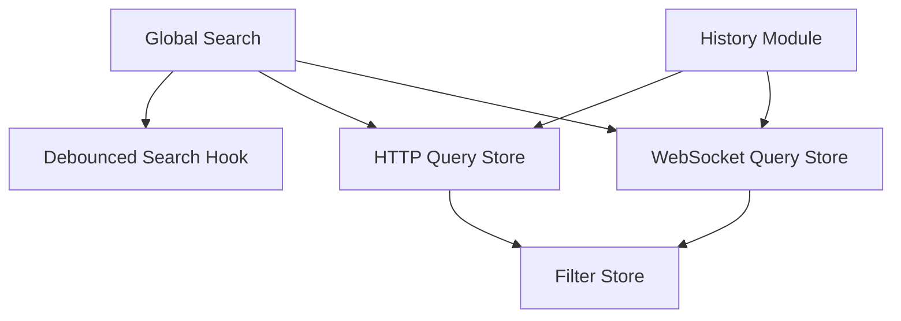

# Traffic Filtering and Search

<cite>
**Referenced Files in This Document**
- [http-query.ts](file://src/stores/history/http-query.ts)
- [websocket-query.ts](file://src/stores/history/websocket-query.ts)
- [filter.ts](file://src/stores/filter.ts)
- [http-history-search.tsx](file://src/layout/global-search/http-history-search.tsx)
- [websocket-history-search.tsx](file://src/layout/global-search/websocket-history-search.tsx)
- [index.tsx](file://src/layout/global-search/index.tsx)
- [use-debounced-search.ts](file://src/layout/global-search/use-debounced-search.ts)
- [live-traffic-captured.ts](file://src/triggers/live-traffic/captured.ts)
- [automation-live_traffic.rs](file://src-tauri/src/automation/live_traffic.rs)
- [proxy-websocket.rs](file://src-tauri/src/proxy/websocket.rs)
- [history-mod.rs](file://src-tauri/src/history/mod.rs)
</cite>

## Table of Contents
1. [Introduction](#introduction)
2. [Project Structure](#project-structure)
3. [Core Components](#core-components)
4. [Architecture Overview](#architecture-overview)
5. [Detailed Component Analysis](#detailed-component-analysis)
6. [Dependency Analysis](#dependency-analysis)
7. [Performance Considerations](#performance-considerations)
8. [Troubleshooting Guide](#troubleshooting-guide)
9. [Conclusion](#conclusion)
10. [Appendices](#appendices)

## Introduction
This document explains Apprecon’s traffic filtering and search capabilities for both HTTP and WebSocket traffic. It covers the query system, filter syntax, supported operators, field-specific searches, the visual filter builder interface, saved presets, dynamic application of filters, advanced search features (regex, date ranges, size-based filtering, composite queries), practical debugging workflows, performance tips, best practices for organizing filters, persistence and sharing, and integration with analysis workflows.

## Project Structure
Apprecon implements filtering and search across frontend stores, UI components, and backend modules:
- Frontend stores manage query state and apply filters to HTTP and WebSocket history.
- Global search components provide a unified search experience across traffic types.
- Triggers and backend modules capture and route live traffic events that feed into the filtering pipeline.

**Diagram sources**
- [index.tsx](file://src/layout/global-search/index.tsx)
- [http-history-search.tsx](file://src/layout/global-search/http-history-search.tsx)
- [websocket-history-search.tsx](file://src/layout/global-search/websocket-history-search.tsx)
- [use-debounced-search.ts](file://src/layout/global-search/use-debounced-search.ts)
- [http-query.ts](file://src/stores/history/http-query.ts)
- [websocket-query.ts](file://src/stores/history/websocket-query.ts)
- [filter.ts](file://src/stores/filter.ts)
- [live-traffic-captured.ts](file://src/triggers/live-traffic/captured.ts)
- [automation-live_traffic.rs](file://src-tauri/src/automation/live_traffic.rs)
- [proxy-websocket.rs](file://src-tauri/src/proxy/websocket.rs)
- [history-mod.rs](file://src-tauri/src/history/mod.rs)

**Section sources**
- [index.tsx](file://src/layout/global-search/index.tsx)
- [http-history-search.tsx](file://src/layout/global-search/http-history-search.tsx)
- [websocket-history-search.tsx](file://src/layout/global-search/websocket-history-search.tsx)
- [use-debounced-search.ts](file://src/layout/global-search/use-debounced-search.ts)
- [http-query.ts](file://src/stores/history/http-query.ts)
- [websocket-query.ts](file://src/stores/history/websocket-query.ts)
- [filter.ts](file://src/stores/filter.ts)
- [live-traffic-captured.ts](file://src/triggers/live-traffic/captured.ts)
- [automation-live_traffic.rs](file://src-tauri/src/automation/live_traffic.rs)
- [proxy-websocket.rs](file://src-tauri/src/proxy/websocket.rs)
- [history-mod.rs](file://src-tauri/src/history/mod.rs)

## Core Components
- HTTP Query Store: Manages HTTP traffic queries, applies filters, and exposes filtered results to UI components.
- WebSocket Query Store: Manages WebSocket traffic queries, applies filters, and exposes filtered results to UI components.
- Filter Store: Centralized filter state management, including saved presets and shared filters.
- Global Search Components: Provide a unified search input and result rendering for HTTP and WebSocket traffic.
- Debounced Search Hook: Reduces search frequency to improve performance during rapid typing.
- Live Traffic Trigger and Backend Modules: Capture incoming HTTP and WebSocket events and persist them for querying.

Key responsibilities:
- Parse and validate user queries.
- Apply field-specific filters and composite conditions.
- Persist and load saved filter presets.
- Integrate with live traffic ingestion for real-time filtering.

**Section sources**
- [http-query.ts](file://src/stores/history/http-query.ts)
- [websocket-query.ts](file://src/stores/history/websocket-query.ts)
- [filter.ts](file://src/stores/filter.ts)
- [http-history-search.tsx](file://src/layout/global-search/http-history-search.tsx)
- [websocket-history-search.tsx](file://src/layout/global-search/websocket-history-search.tsx)
- [use-debounced-search.ts](file://src/layout/global-search/use-debounced-search.ts)
- [live-traffic-captured.ts](file://src/triggers/live-traffic/captured.ts)
- [automation-live_traffic.rs](file://src-tauri/src/automation/live_traffic.rs)
- [proxy-websocket.rs](file://src-tauri/src/proxy/websocket.rs)
- [history-mod.rs](file://src-tauri/src/history/mod.rs)

## Architecture Overview
The filtering architecture combines frontend query stores with backend traffic capture:
- User input is captured by global search components and debounced before applying filters.
- The HTTP and WebSocket query stores parse queries and apply filters against stored traffic data.
- Saved presets are managed centrally and can be applied dynamically.
- Live traffic triggers push new events into the backend, which persists and indexes them for querying.

**Diagram sources**
- [index.tsx](file://src/layout/global-search/index.tsx)
- [use-debounced-search.ts](file://src/layout/global-search/use-debounced-search.ts)
- [http-query.ts](file://src/stores/history/http-query.ts)
- [websocket-query.ts](file://src/stores/history/websocket-query.ts)
- [filter.ts](file://src/stores/filter.ts)
- [history-mod.rs](file://src-tauri/src/history/mod.rs)

## Detailed Component Analysis

### HTTP Query Store
Responsibilities:
- Parse HTTP-specific fields (method, URL, status code, headers, body).
- Apply operators (equals, contains, regex, range).
- Support composite queries (AND/OR/NOT).
- Integrate with saved presets and dynamic application.

**Diagram sources**
- [http-query.ts](file://src/stores/history/http-query.ts)

**Section sources**
- [http-query.ts](file://src/stores/history/http-query.ts)

### WebSocket Query Store
Responsibilities:
- Parse WebSocket-specific fields (message type, payload patterns, connection metadata).
- Apply operators (equals, contains, regex, size thresholds).
- Support composite queries and preset application.

**Diagram sources**
- [websocket-query.ts](file://src/stores/history/websocket-query.ts)

**Section sources**
- [websocket-query.ts](file://src/stores/history/websocket-query.ts)

### Filter Store
Responsibilities:
- Manage centralized filter state.
- Persist saved presets locally.
- Enable sharing via export/import mechanisms.
- Provide APIs for dynamic filter application.

**Diagram sources**
- [filter.ts](file://src/stores/filter.ts)
- [http-query.ts](file://src/stores/history/http-query.ts)
- [websocket-query.ts](file://src/stores/history/websocket-query.ts)

**Section sources**
- [filter.ts](file://src/stores/filter.ts)

### Global Search Components
Responsibilities:
- Unified search input for HTTP and WebSocket traffic.
- Debounced query processing to reduce overhead.
- Result rendering with highlighting and context.

**Diagram sources**
- [index.tsx](file://src/layout/global-search/index.tsx)
- [use-debounced-search.ts](file://src/layout/global-search/use-debounced-search.ts)
- [http-history-search.tsx](file://src/layout/global-search/http-history-search.tsx)
- [websocket-history-search.tsx](file://src/layout/global-search/websocket-history-search.tsx)

**Section sources**
- [index.tsx](file://src/layout/global-search/index.tsx)
- [use-debounced-search.ts](file://src/layout/global-search/use-debounced-search.ts)
- [http-history-search.tsx](file://src/layout/global-search/http-history-search.tsx)
- [websocket-history-search.tsx](file://src/layout/global-search/websocket-history-search.tsx)

### Live Traffic Integration
Responsibilities:
- Capture incoming HTTP and WebSocket events.
- Persist events for querying and filtering.
- Emit events to frontend stores for real-time updates.

**Diagram sources**
- [proxy-websocket.rs](file://src-tauri/src/proxy/websocket.rs)
- [automation-live_traffic.rs](file://src-tauri/src/automation/live_traffic.rs)
- [history-mod.rs](file://src-tauri/src/history/mod.rs)
- [http-query.ts](file://src/stores/history/http-query.ts)
- [websocket-query.ts](file://src/stores/history/websocket-query.ts)

**Section sources**
- [proxy-websocket.rs](file://src-tauri/src/proxy/websocket.rs)
- [automation-live_traffic.rs](file://src-tauri/src/automation/live_traffic.rs)
- [history-mod.rs](file://src-tauri/src/history/mod.rs)
- [http-query.ts](file://src/stores/history/http-query.ts)
- [websocket-query.ts](file://src/stores/history/websocket-query.ts)

## Dependency Analysis
The filtering system depends on cohesive frontend stores and robust backend capture:
- HTTP and WebSocket query stores depend on the filter store for preset management.
- Global search components depend on debounced search hooks for performance.
- Backend modules persist and index traffic events for efficient querying.

**Diagram sources**
- [http-query.ts](file://src/stores/history/http-query.ts)
- [websocket-query.ts](file://src/stores/history/websocket-query.ts)
- [filter.ts](file://src/stores/filter.ts)
- [index.tsx](file://src/layout/global-search/index.tsx)
- [use-debounced-search.ts](file://src/layout/global-search/use-debounced-search.ts)
- [history-mod.rs](file://src-tauri/src/history/mod.rs)

**Section sources**
- [http-query.ts](file://src/stores/history/http-query.ts)
- [websocket-query.ts](file://src/stores/history/websocket-query.ts)
- [filter.ts](file://src/stores/filter.ts)
- [index.tsx](file://src/layout/global-search/index.tsx)
- [use-debounced-search.ts](file://src/layout/global-search/use-debounced-search.ts)
- [history-mod.rs](file://src-tauri/src/history/mod.rs)

## Performance Considerations
- Use debounced search to minimize re-renders and query executions during rapid typing.
- Prefer field-specific searches to reduce the search space.
- Leverage saved presets for complex queries to avoid repeated parsing.
- Limit regex usage to necessary cases due to computational overhead.
- Batch filter applications when multiple changes occur simultaneously.

[No sources needed since this section provides general guidance]

## Troubleshooting Guide
Common issues and resolutions:
- Invalid query syntax: Ensure proper operator usage and field names.
- Slow performance: Simplify queries, use field-specific searches, and avoid excessive regex.
- Missing results: Verify that traffic has been captured and persisted.
- Preset not loading: Check local storage permissions and import/export formats.

**Section sources**
- [http-query.ts](file://src/stores/history/http-query.ts)
- [websocket-query.ts](file://src/stores/history/websocket-query.ts)
- [filter.ts](file://src/stores/filter.ts)

## Conclusion
Apprecon’s traffic filtering and search system provides a powerful, extensible framework for analyzing HTTP and WebSocket traffic. With support for advanced queries, saved presets, and real-time integration, it enables efficient debugging and analysis workflows. By following best practices and leveraging performance tips, users can optimize their filtering strategies for maximum effectiveness.

[No sources needed since this section summarizes without analyzing specific files]

## Appendices
- Practical Examples:
  - Find all POST requests to a specific endpoint using method and URL filters.
  - Identify large responses exceeding a size threshold using size-based filtering.
  - Match WebSocket messages containing specific patterns using regex.
  - Combine multiple conditions with AND/OR/NOT for composite queries.
- Best Practices:
  - Organize frequently used filters into named presets.
  - Share presets with team members via export/import.
  - Regularly review and update filters to reflect evolving traffic patterns.

[No sources needed since this section provides general guidance]