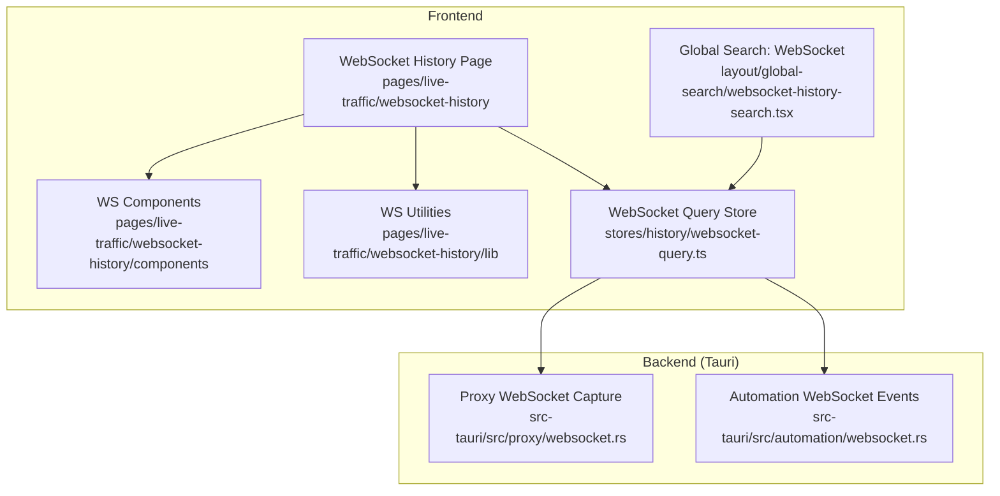
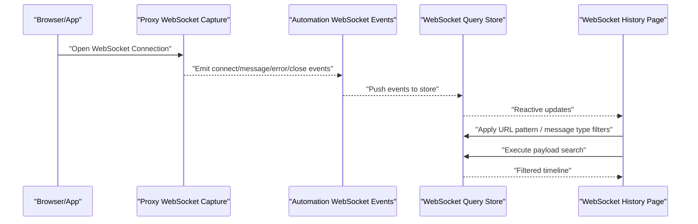
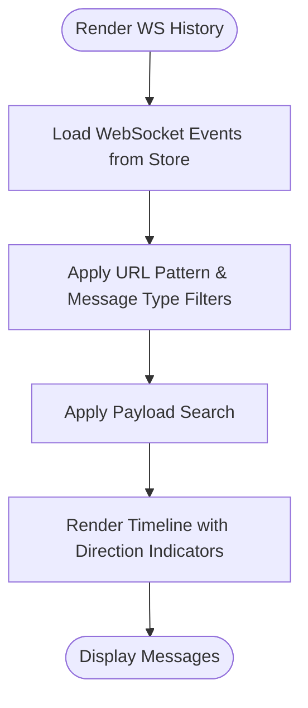
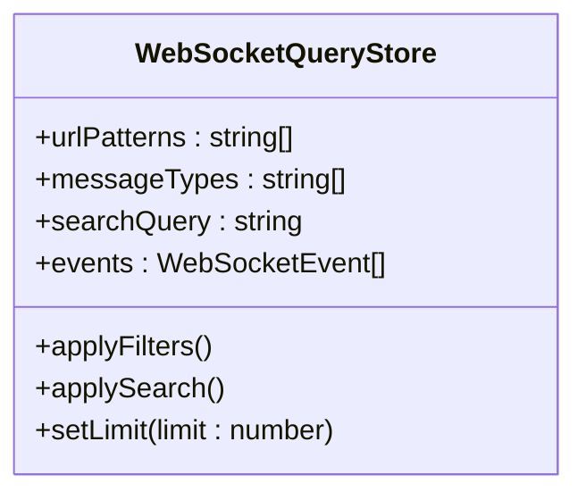
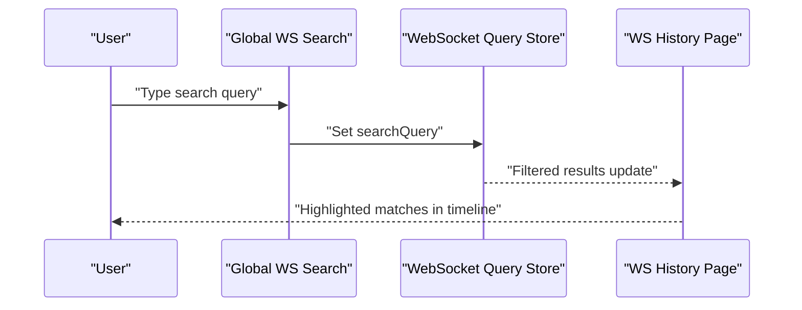
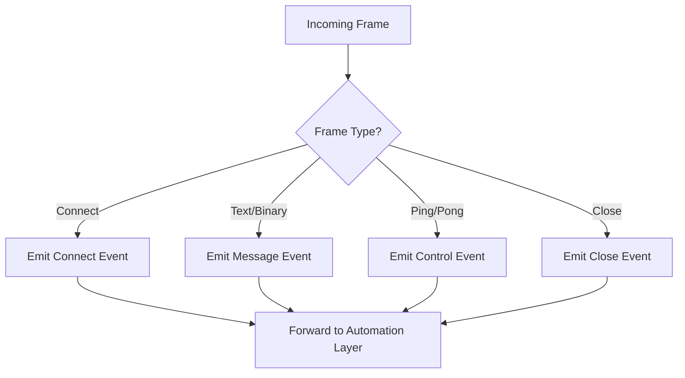
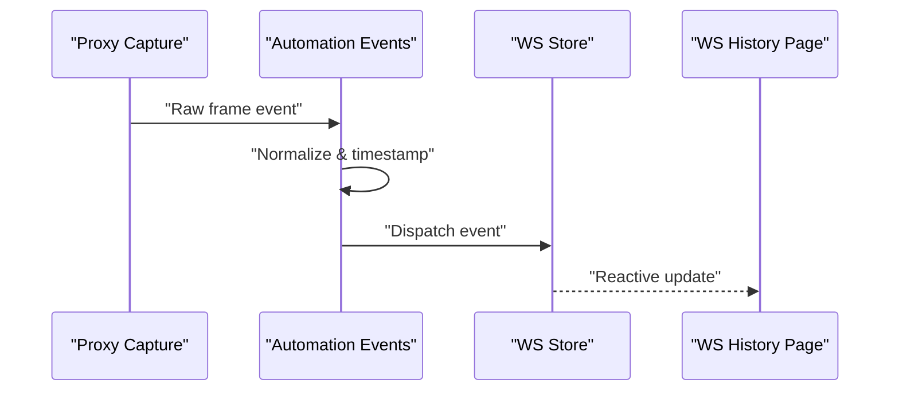
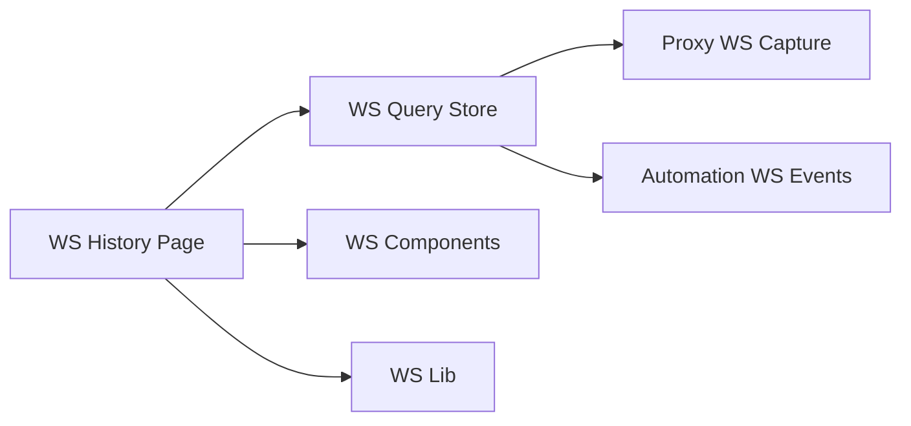

# WebSocket Traffic Monitor

<cite>
**Referenced Files in This Document**
- [websocket-history-search.tsx](file://src/layout/global-search/websocket-history-search.tsx)
- [websocket-query.ts](file://src/stores/history/websocket-query.ts)
- [websocket.rs](file://src-tauri/src/automation/websocket.rs)
- [websocket.rs](file://src-tauri/src/proxy/websocket.rs)
- [index.tsx](file://src/pages/live-traffic/websocket-history/index.tsx)
- [components](file://src/pages/live-traffic/websocket-history/components)
- [lib](file://src/pages/live-traffic/websocket-history/lib)
</cite>

## Table of Contents
1. [Introduction](#introduction)
2. [Project Structure](#project-structure)
3. [Core Components](#core-components)
4. [Architecture Overview](#architecture-overview)
5. [Detailed Component Analysis](#detailed-component-analysis)
6. [Dependency Analysis](#dependency-analysis)
7. [Performance Considerations](#performance-considerations)
8. [Troubleshooting Guide](#troubleshooting-guide)
9. [Conclusion](#conclusion)

## Introduction
This document explains Apprecon’s WebSocket traffic monitoring feature, focusing on real-time connection tracking, message inspection, and lifecycle management. It covers the WebSocket history view with a message timeline, direction indicators for send/receive, payload formatting options, filtering by URL patterns, message type filtering, and search within payloads. Practical examples are provided for debugging WebSocket applications, analyzing real-time communication patterns, and troubleshooting connection issues. Performance considerations for high-frequency streams and memory management for long-running connections are also addressed.

## Project Structure
The WebSocket monitoring spans both frontend (React UI and stores) and backend (Tauri Rust modules). Key areas include:
- Frontend WebSocket history page and components
- Global search integration for WebSocket messages
- Store-based query and filtering state
- Tauri automation and proxy layers handling WebSocket capture and events

**Diagram sources**
- [index.tsx](file://src/pages/live-traffic/websocket-history/index.tsx)
- [websocket-history-search.tsx](file://src/layout/global-search/websocket-history-search.tsx)
- [websocket-query.ts](file://src/stores/history/websocket-query.ts)
- [websocket.rs](file://src-tauri/src/proxy/websocket.rs)
- [websocket.rs](file://src-tauri/src/automation/websocket.rs)

**Section sources**
- [index.tsx](file://src/pages/live-traffic/websocket-history/index.tsx)
- [websocket-history-search.tsx](file://src/layout/global-search/websocket-history-search.tsx)
- [websocket-query.ts](file://src/stores/history/websocket-query.ts)
- [websocket.rs](file://src-tauri/src/proxy/websocket.rs)
- [websocket.rs](file://src-tauri/src/automation/websocket.rs)

## Core Components
- WebSocket History Page: Orchestrates the history view, manages filters, and renders the message timeline.
- WebSocket Query Store: Holds filter state (URL patterns, message types), search queries, and pagination or limits.
- Global WebSocket Search: Provides unified search across WebSocket messages from the global search interface.
- Proxy WebSocket Capture: Intercepts WebSocket frames at the proxy layer and emits events to the frontend.
- Automation WebSocket Events: Bridges captured WebSocket activity into application-level events consumed by the UI.

Key responsibilities:
- Real-time connection tracking and lifecycle events (connect, message, error, close)
- Message inspection with payload formatting (text, JSON, binary)
- Filtering by URL pattern and message type
- Searching within payloads
- Timeline visualization with direction indicators

**Section sources**
- [index.tsx](file://src/pages/live-traffic/websocket-history/index.tsx)
- [websocket-query.ts](file://src/stores/history/websocket-query.ts)
- [websocket-history-search.tsx](file://src/layout/global-search/websocket-history-search.tsx)
- [websocket.rs](file://src-tauri/src/proxy/websocket.rs)
- [websocket.rs](file://src-tauri/src/automation/websocket.rs)

## Architecture Overview
The WebSocket monitoring pipeline captures frames via the proxy, routes them through automation event channels, and exposes them to the React UI where users can filter, search, and visualize messages.

**Diagram sources**
- [websocket.rs](file://src-tauri/src/proxy/websocket.rs)
- [websocket.rs](file://src-tauri/src/automation/websocket.rs)
- [websocket-query.ts](file://src/stores/history/websocket-query.ts)
- [index.tsx](file://src/pages/live-traffic/websocket-history/index.tsx)

## Detailed Component Analysis

### WebSocket History Page
Responsibilities:
- Renders the WebSocket history timeline
- Displays direction indicators (send/receive)
- Supports payload formatting options (e.g., pretty-print JSON, hex/binary view)
- Integrates filters and search controls

Implementation highlights:
- Uses reactive store subscriptions to update the timeline in real time
- Applies URL pattern and message type filters before rendering
- Provides search input that queries stored messages’ payloads

**Diagram sources**
- [index.tsx](file://src/pages/live-traffic/websocket-history/index.tsx)

**Section sources**
- [index.tsx](file://src/pages/live-traffic/websocket-history/index.tsx)

### WebSocket Query Store
Responsibilities:
- Maintains filter state: URL patterns, message types, search query
- Manages limits and pagination for performance
- Exposes filtered results to the UI

Key behaviors:
- Debounced search to reduce re-renders
- Efficient filtering using indexed fields (URL, direction, timestamp)
- Memory-safe accumulation with optional truncation policies

**Diagram sources**
- [websocket-query.ts](file://src/stores/history/websocket-query.ts)

**Section sources**
- [websocket-query.ts](file://src/stores/history/websocket-query.ts)

### Global WebSocket Search
Responsibilities:
- Unified search entry point across features
- Queries WebSocket messages based on user input
- Highlights matching substrings in payloads

Integration points:
- Subscribes to WebSocket store events
- Executes search against payload content and metadata

**Diagram sources**
- [websocket-history-search.tsx](file://src/layout/global-search/websocket-history-search.tsx)
- [websocket-query.ts](file://src/stores/history/websocket-query.ts)

**Section sources**
- [websocket-history-search.tsx](file://src/layout/global-search/websocket-history-search.tsx)
- [websocket-query.ts](file://src/stores/history/websocket-query.ts)

### Proxy WebSocket Capture
Responsibilities:
- Intercepts WebSocket frames (handshake, text, binary, ping/pong, close)
- Emits structured events with metadata (URL, direction, timestamp, size)
- Ensures minimal overhead and safe buffering

**Diagram sources**
- [websocket.rs](file://src-tauri/src/proxy/websocket.rs)

**Section sources**
- [websocket.rs](file://src-tauri/src/proxy/websocket.rs)

### Automation WebSocket Events
Responsibilities:
- Bridges captured events to the frontend store
- Normalizes event shapes and timestamps
- Handles backpressure and rate limiting

**Diagram sources**
- [websocket.rs](file://src-tauri/src/automation/websocket.rs)

**Section sources**
- [websocket.rs](file://src-tauri/src/automation/websocket.rs)

## Dependency Analysis
The WebSocket monitoring feature depends on coordinated interactions between frontend components, store state, and backend capture modules.

**Diagram sources**
- [index.tsx](file://src/pages/live-traffic/websocket-history/index.tsx)
- [websocket-query.ts](file://src/stores/history/websocket-query.ts)
- [websocket.rs](file://src-tauri/src/proxy/websocket.rs)
- [websocket.rs](file://src-tauri/src/automation/websocket.rs)

**Section sources**
- [index.tsx](file://src/pages/live-traffic/websocket-history/index.tsx)
- [websocket-query.ts](file://src/stores/history/websocket-query.ts)
- [websocket.rs](file://src-tauri/src/proxy/websocket.rs)
- [websocket.rs](file://src-tauri/src/automation/websocket.rs)

## Performance Considerations
High-frequency message streams and long-lived connections require careful resource management:
- Limit event retention: Configure maximum number of stored events per connection to prevent unbounded memory growth.
- Debounce search and filters: Reduce re-renders during rapid updates.
- Batch updates: Coalesce multiple events into single store updates when possible.
- Lazy rendering: Only render visible portions of the timeline; virtualize large lists.
- Binary payload handling: Avoid unnecessary decoding unless requested; provide hex view for large binaries.
- Backpressure: Drop or throttle low-priority control frames under heavy load.
- Memory cleanup: Clear closed connection data after a configurable grace period.

[No sources needed since this section provides general guidance]

## Troubleshooting Guide
Common issues and resolutions:
- No messages appearing:
  - Verify proxy is active and intercepting WebSocket traffic.
  - Check URL pattern filters and ensure they match the target endpoints.
  - Confirm message type filters are not excluding expected frames.
- Slow UI with many messages:
  - Reduce retained event count and enable virtualization.
  - Disable payload parsing for large binaries until needed.
- Search not finding payloads:
  - Ensure search scope includes payload content and metadata.
  - Normalize payload encoding before searching (UTF-8 vs hex).
- Frequent disconnects:
  - Inspect close frames and error events for server-side reasons.
  - Validate handshake headers and origin policies.

Practical debugging workflow:
- Filter by URL pattern to isolate relevant connections.
- Use message type filters to focus on text/binary/control frames.
- Search within payloads for specific tokens or IDs.
- Inspect timeline for timing anomalies and missing acknowledgments.
- Export or copy payloads for offline analysis if necessary.

**Section sources**
- [websocket-query.ts](file://src/stores/history/websocket-query.ts)
- [websocket.rs](file://src-tauri/src/proxy/websocket.rs)
- [websocket.rs](file://src-tauri/src/automation/websocket.rs)

## Conclusion
Apprecon’s WebSocket traffic monitor provides comprehensive real-time tracking, inspection, and analysis capabilities. With robust filtering, search, and visualization tools, developers can efficiently debug WebSocket applications, understand communication patterns, and resolve connectivity issues. By applying the recommended performance practices, teams can maintain responsiveness even under high-frequency messaging and long-lived connections.

[No sources needed since this section summarizes without analyzing specific files]